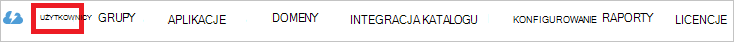

<properties
    pageTitle="Samouczek: Azure Active Directory Integracja z Domo | Microsoft Azure"
    description="Dowiedz się, jak skonfigurować rejestracji jednokrotnej między usługi Azure Active Directory i Domo."
    services="active-directory"
    documentationCenter=""
    authors="jeevansd"
    manager="femila"
    editor=""/>

<tags
    ms.service="active-directory"
    ms.workload="identity"
    ms.tgt_pltfrm="na"
    ms.devlang="na"
    ms.topic="article"
    ms.date="10/07/2016"
    ms.author="jeedes"/>

# Samouczek: Azure Active Directory Integracja z Domo

Celem tego samouczka jest pokazano, jak zintegrować Domo z usługi Azure Active Directory (Azure AD).  
Integrowanie Domo z usługą Azure Active Directory zapewnia następujące korzyści:

- Możesz sterować w Azure AD, kto ma dostęp do Domo
- Można umożliwić użytkownikom automatyczne pobieranie podpisane w Domo (jednokrotną) z ich kontami Azure AD
- Możesz zarządzać kont użytkownika w jednej centralnej lokalizacji - portalu klasyczny Azure

Jeśli chcesz wiedzieć więcej szczegółów dotyczących władz akredytacji bezpieczeństwa aplikacji Integracja z usługą Azure Active Directory, zobacz [Co to jest dostęp do aplikacji i rejestracji jednokrotnej z usługą Azure Active Directory](active-directory-appssoaccess-whatis.md).

## Wymagania wstępne

Aby skonfigurować Azure AD integracji z Domo, potrzebne następujące elementy:

- Subskrypcję usługi Azure AD
- Domo logowania jednokrotnego w enabled subskrypcji

> [AZURE.NOTE] Aby przetestować kroki opisane w tym samouczku, zaleca się używanie w środowisku produkcyjnym.

Aby przetestować czynności w ramach tego samouczka, należy zastosowaniu tych zaleceń:

- Nie należy używać środowisku produkcyjnym, chyba że jest to konieczne.
- Jeśli nie ma środowiska wersji próbnej usługi Azure AD, możesz uzyskać miesięcznego wersji próbnej [tutaj](https://azure.microsoft.com/pricing/free-trial/).

## Opis scenariuszy
Celem tego samouczka jest ułatwia testowanie Azure AD logowania jednokrotnego w środowisku testowym.  
Scenariusz przedstawionych w tym samouczku składa się z dwóch głównych bloków konstrukcyjnych:

1. Dodawanie Domo z galerii
2. Konfigurowanie i testowanie Azure AD pojedynczy logowania jednokrotnego

## Dodawanie Domo z galerii
Aby skonfigurować integrację Azure AD Domo, musisz dodać Domo z galerii do listy zarządzanych aplikacji władz akredytacji bezpieczeństwa.

**Aby dodać Domo z galerii, wykonaj następujące czynności:**

1. W **portalu klasyczny Azure**, w okienku nawigacji po lewej stronie kliknij pozycję **Usługi Active Directory**. 

    ![Usługi Active Directory][1]

2. Na liście **katalogu** zaznacz katalogu, dla której chcesz włączyć integracji katalogów.

3. Aby otworzyć widok aplikacji w widoku katalogu, w górnym menu kliknij pozycję **aplikacje** .

    ![Aplikacje][2]

4. Kliknij przycisk **Dodaj** w dolnej części strony.

    ![Aplikacje][3]

5. W oknie dialogowym **co chcesz zrobić** kliknij przycisk **Dodaj aplikację z galerii**.

    ![Aplikacje][4]

6. W polu wyszukiwania wpisz **Domo**.

    

7. W okienku wyników wybierz **Domo**, a następnie kliknij **Wykonano** w celu dodania aplikacji.

    

##  Konfigurowanie i testowanie Azure AD pojedynczy logowania jednokrotnego
Celem w tej sekcji jest pokazano, jak skonfigurować i przetestować Azure AD rejestracji jednokrotnej z Domo opartą na użytkowniku test o nazwie "Britta Simona".

Rejestracji jednokrotnej do pracy Azure AD musi wie, co jest odpowiednikiem użytkownikowi w Domo użytkownika w Azure AD. Innymi słowy łącze powiązanie użytkownika w usłudze Azure AD użytkownikowi w Domo musi zostać ustanowione.  
Łącze relacji jest określany przez przypisanie wartości **nazwy użytkownika** w Azure AD jako wartość **nazwy użytkownika** w Domo.

Aby skonfigurować i przetestować Azure AD rejestracji jednokrotnej z Domo, należy wykonać następujące czynności bloków konstrukcyjnych:

1. **[Konfigurowanie Azure AD rejestracji jednokrotnej](#configuring-azure-ad-single-single-sign-on)** — aby umożliwić użytkownikom korzystanie z tej funkcji.
2. **[Tworzenie Azure AD testowanie użytkownika](#creating-an-azure-ad-test-user)** — Aby przetestować Azure AD rejestracji jednokrotnej z Simona Britta.
4. **[Tworzenie Domo testowanie użytkownika](#creating-a-domo-test-user)** — aby odpowiednikiem Simona Britta w Domo połączonego z reprezentacją Azure AD jej.
5. **[Przypisywanie Azure AD testowanie użytkownika](#assigning-the-azure-ad-test-user)** — umożliwiające Simona Britta używać Azure AD rejestracji jednokrotnej.
5. **[Testowanie rejestracji jednokrotnej](#testing-single-sign-on)** — Aby sprawdzić, czy działa konfiguracji.

### Konfigurowanie Azure AD rejestracji jednokrotnej

Celem w tej sekcji jest, aby włączyć Azure AD logowania jednokrotnego w portalu klasyczny Azure i konfigurowanie logowania jednokrotnego w aplikacji Domo.

Aplikacja Domo oczekuje potwierdzeń SAML w określonym formacie. Skonfiguruj następujące oświadczeniach dla tej aplikacji. Na karcie **"Atrribute"** aplikacji, możesz zarządzać wartości tych atrybutów. Następujące zrzut ekranu przedstawia przykładową to. 

 

**Aby skonfigurować Azure AD rejestracji jednokrotnej z Domo, wykonaj następujące czynności:**

1. W portalu klasyczny Azure, na stronie integracji **Domo** aplikacji w menu u góry kliknij **atrybutów**.

     

1. W oknie dialogowym **atrybuty tokenu SAML** dla każdego wiersza pokazano w poniższej tabeli, wykonaj następujące czynności:

  	| Nazwa atrybutu | Wartość atrybutu |
  	| --- | --- |    
  	| Nazwa  | User.DisplayName |
  	| Adres e-mail | User.mail |

    . Kliknij przycisk **Dodaj atrybut użytkownika** , aby otworzyć okno dialogowe **Dodawanie Attribure użytkownika** .

     

    b. W polu tekstowym **Nazwa Attrubute** wpisz nazwę atrybutu wyświetlania dla tego wiersza.

    c. Z listy **Wartości atrybutu** selsect wartość atrybutu wyświetlania dla tego wiersza.

    d. Kliknij pozycję **pełne**.  

2. W portalu klasyczny Azure, na stronie integracji **Domo** aplikacji kliknij pozycję **Konfiguruj rejestracji jednokrotnej** aby otworzyć okno dialogowe **Konfigurowanie logowania jednokrotnego** .

    ![Konfigurowanie logowania jednokrotnego][6] 

3. Na stronie **jak chcesz użytkownikom logowanie do Domo** wybierz **Azure AD rejestracji jednokrotnej**, a następnie kliknij **Dalej**.

     

4. Na stronie okno dialogowe **Konfigurowanie ustawień aplikacji** wykonaj następujące czynności:

     

    . W polu tekstowym **Logowania na adres URL** wpisz adres URL używane przez użytkowników do logowania się w aplikacji Domo przy użyciu następującego wzorca:`https://<company name>.domo.com`

    b. Kliknij przycisk **Dalej**.

5. Na stronie **Konfigurowanie logowania jednokrotnego w Domo** wykonaj następujące czynności:

     

    . Kliknij przycisk **Pobierz certyfikat**, a następnie zapisz plik na komputerze.

    b. Kliknij przycisk **Dalej**.

6. Aby uzyskać logowania jednokrotnego skonfigurowane dla aplikacji, skontaktuj się z zespołem pomocy technicznej Domo w [support@domo.com](mailto: support@domo.com), dołączyć pobranego certyfikatu i podaj im **Wystawcy adres URL**, adres **URL logowania jednokrotnego SAML** i **Zaloguj się adresu URL**.

7. W portalu klasyczny Azure wybierz potwierdzenia konfiguracji rejestracji jednokrotnej firmy, a następnie kliknij **Dalej**.

    ![Azure AD rejestracji jednokrotnej][10]

8. Na stronie **potwierdzenia rejestracji jednokrotnej** kliknij przycisk **Zakończ**.  

    ![Azure AD rejestracji jednokrotnej][11]

### Tworzenie użytkownika testowego Azure AD
Celem w tej sekcji jest utworzenie użytkownika testowego w portalu klasyczny Azure o nazwie Simona Britta.  

![Utwórz użytkownika Azure AD][20]

**Aby utworzyć użytkownika testowego w Azure AD, wykonaj następujące czynności:**

1. W **portalu klasyczny Azure**, w okienku nawigacji po lewej stronie kliknij pozycję **Usługi Active Directory**.

     

2. Na liście **katalogu** zaznacz katalogu, dla której chcesz włączyć integracji katalogów.

3. Aby wyświetlić listę użytkowników, w menu u góry, kliknij pozycję **Użytkownicy**.

     

4. Aby otworzyć okno dialogowe **Dodaj użytkownika** , na pasku narzędzi u dołu, kliknij pozycję **Dodaj użytkownika**.

     

5. Na stronie okno **Powiedz nam o tym użytkowniku,** wykonaj następujące czynności:

     

    . Typ użytkownika zaznacz nowego użytkownika w Twojej organizacji.

    b. W polu Nazwa użytkownika **pole tekstowe**wpisz **BrittaSimon**.

    c. Kliknij przycisk **Dalej**.

6.  Na stronie okno dialogowe **Profilu użytkownika** wykonaj następujące czynności:

     

    . W polu tekstowym **Imię** wpisz **Britta**.  

    b. W polu **Nazwisko** tekstowym typu **Simona**.

    c. W polu tekstowym **Nazwa wyświetlana** wpisz **Simona Britta**.

    d. Na liście **ról** wybierz **użytkownika**.

    e. Kliknij przycisk **Dalej**.

7. Na stronie **Pobierz hasła tymczasowego** okno kliknij przycisk **Utwórz**.

     

8. Na stronie okno dialogowe **Pobierz hasło tymczasowe** wykonaj następujące czynności:

     

    . Zanotuj wartość **Nowego hasła**.

    b. Kliknij pozycję **pełne**.   

### Tworzenie użytkownika test Domo

Celem w tej sekcji jest utworzenie użytkownika o nazwie Simona Britta w Domo. Domo obsługuje w czasie inicjowania obsługi administracyjnej, która jest domyślnie włączona.

Nie ma żadnych czynności do wykonania dla Ciebie w tej sekcji. Nowy użytkownik zostanie utworzony podczas próby dostępu Domo, jeśli go jeszcze nie istnieje. [Konfigurowanie Azure AD rejestracji jednokrotnej](#configuring-azure-ad-single-single-sign-on).

> [AZURE.NOTE] Jeśli trzeba ręcznie utworzyć użytkownika, należy skontaktować się z obsługą Domo.

### Przypisywanie użytkowników testowych Azure AD

Celem w tej sekcji jest włączenie Simona Britta do udostępnienia jej Domo za pomocą Azure rejestracji jednokrotnej.

![Przypisywanie użytkownika][200] 

**Aby przypisać Simona Britta Domo, wykonaj następujące czynności:**

1. Klasyczny portalu Azure aby otworzyć widok aplikacji w widoku katalogu, kliknij pozycję **aplikacje** w górnym menu.

    ![Przypisywanie użytkownika][201] 

2. Na liście aplikacji zaznacz **Domo**.

     

1. W menu u góry kliknij pozycję **Użytkownicy**.

    ![Przypisywanie użytkownika][203] 

1. Na liście Użytkownicy zaznacz **Simona Britta**.

2. Na pasku narzędzi u dołu kliknij przycisk **Przypisz**.

    ![Przypisywanie użytkownika][205]

### Testowanie logowania jednokrotnego

Celem w tej sekcji jest test Azure AD pojedynczego logowania jednokrotnego konfiguracji przy użyciu panelu programu Access.  
Po kliknięciu kafelka Domo w panelu programu Access, możesz należy uzyskać automatycznie podpisane w aplikacji Domo.

## Dodatkowe zasoby

* [Lista samouczki dotyczące integracji władz akredytacji bezpieczeństwa aplikacji z usługą Azure Active Directory](active-directory-saas-tutorial-list.md)
* [Co to jest dostęp do aplikacji i rejestracji jednokrotnej z usługą Azure Active Directory?](active-directory-appssoaccess-whatis.md)

<!--Image references-->

[1]: ./media/active-directory-saas-domo-tutorial/tutorial_general_01.png
[2]: ./media/active-directory-saas-domo-tutorial/tutorial_general_02.png
[3]: ./media/active-directory-saas-domo-tutorial/tutorial_general_03.png
[4]: ./media/active-directory-saas-domo-tutorial/tutorial_general_04.png

[6]: ./media/active-directory-saas-domo-tutorial/tutorial_general_05.png
[10]: ./media/active-directory-saas-domo-tutorial/tutorial_general_06.png
[11]: ./media/active-directory-saas-domo-tutorial/tutorial_general_07.png
[20]: ./media/active-directory-saas-domo-tutorial/tutorial_general_100.png

[200]: ./media/active-directory-saas-domo-tutorial/tutorial_general_200.png
[201]: ./media/active-directory-saas-domo-tutorial/tutorial_general_201.png
[203]: ./media/active-directory-saas-domo-tutorial/tutorial_general_203.png
[204]: ./media/active-directory-saas-domo-tutorial/tutorial_general_204.png
[205]: ./media/active-directory-saas-domo-tutorial/tutorial_general_205.png
