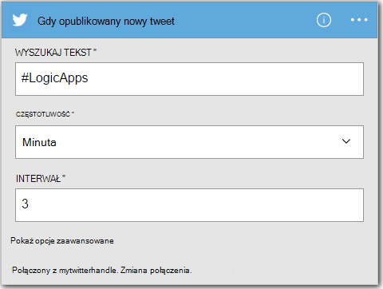
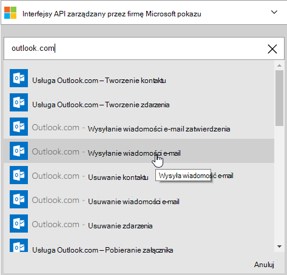
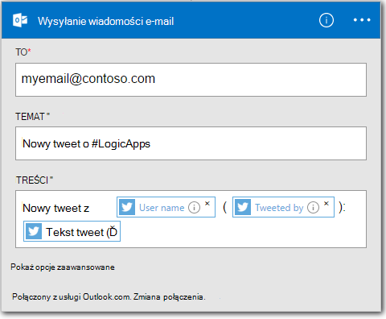

<properties
    pageTitle="Tworzenie aplikacji logika | Microsoft Azure"
    description="Dowiedz się, jak utworzyć aplikację logiczny, łączenie usług władz akredytacji bezpieczeństwa"
    authors="jeffhollan"
    manager="dwrede"
    editor=""
    services="logic-apps"
    documentationCenter=""/>

<tags
    ms.service="logic-apps"
    ms.workload="na"
    ms.tgt_pltfrm="na"
    ms.devlang="na"
    ms.topic="get-started-article"
    ms.date="10/18/2016"
    ms.author="jehollan"/>

# Utworzenia nowej aplikacji logika łączenie usług władz akredytacji bezpieczeństwa

W tym temacie przedstawiono, jak to zrobić, w ciągu kilku minut, ułatwi Ci rozpoczęcie pracy z [Aplikacjami logiczny Azure](app-service-logic-what-are-logic-apps.md). Przedstawimy każde prostego przepływu pracy, który pozwala wysyłać interesujące tweety do wiadomości e-mail.

Aby korzystać z tego scenariusza, należy następująco:

- Subskrypcję usługi Azure
- Konto Twitter
- Outlook.com lub hostowanej skrzynki pocztowej usługi Office 365

## Tworzenie nowej aplikacji logiki do konta e-mail tweety

1. Na [Azure portalu pulpitu nawigacyjnego](https://portal.azure.com)wybierz pozycję **Nowy**. 
2. Na pasku wyszukiwania wyszukiwanie "logiki aplikacji", a następnie wybierz **Aplikację logiczny**. Możesz również wybierz pozycję **Nowy**, **Web + Mobile**i wybierz **Aplikację logicznych**. 
3. Wprowadź nazwę aplikacji logika, wybierz lokalizację, grupa zasobów, a następnie wybierz pozycję **Utwórz**.  Po wybraniu **numeru Pin do pulpitu nawigacyjnego** aplikacji logika będą automatycznie otwierane po wdrożeniu.  
4. Po otwarciu aplikacji logika po raz pierwszy można wybrać przy użyciu szablonu do uruchomienia.  Teraz kliknij **Pustej aplikacji logiki** do utworzenia to od podstaw. 
1. Pierwszy element, który należy utworzyć jest wyzwalacz.  Jest to zdarzenie rozpoczęcia aplikacji logicznych.  Wyszukiwanie **serwisu twitter** w polu wyszukiwania wyzwalacza, a następnie zaznacz go.
7. Teraz będzie wpisywać w wyszukiwany termin wyzwalać na.  **Częstotliwość** i **Interwał** określi, jak często aplikacji logika sprawdzi nowe tweety (i wszystkie tweety podczas tego okres zwrotu).
    

5. Wybierz przycisk **Nowy krok** , a następnie wybierz pozycję **Dodaj akcję** lub **Dodaj warunek**
6. Gdy wybierzesz **Dodaj akcję**, możesz wyszukać [dostępne łączników](../connectors/apis-list.md) , aby wybrać akcję. Na przykład można wybrać **Usługa Outlook.com — Wyślij wiadomość E-mail** do wysyłania poczty e-mail z adresu outlook.com:  
    

7. Teraz masz do wypełniania parametrów do obsługi poczty e-mail ma:  

8. Na koniec wybierz **Zapisz** nawiązać aplikacji logika live.

## Zarządzanie po utworzeniu aplikacji warunków logicznych

Teraz aplikacja logiczny jest i rozpocząć pracę. Go okresowo sprawdza tweety z wyszukiwany termin wprowadzone. Po znalezieniu pasujących tweet, go otrzymasz wiadomość e-mail. Na koniec będzie Dowiedz się, jak wyłączyć aplikację lub zobacz, jak robi.

1. Przejdź do [portalu Azure](https://portal.azure.com)

1. Kliknij przycisk **Przeglądaj,** po lewej stronie ekranu, a następnie wybierz pozycję **Aplikacje logicznych**.

2. Kliknij pozycję Nowa aplikacja logiczny, nowo utworzony Aby wyświetlić bieżący stan i ogólne informacje.

3. Aby edytować z nowej aplikacji logiczny, kliknij przycisk **Edytuj**.

5. Aby wyłączyć aplikację, kliknij polecenie **Wyłącz** na pasku poleceń.

1. Wyświetlanie historii Uruchom i wyzwalacz monitorowanie po uruchomieniu aplikacji logicznych.  Można kliknąć przycisk **Odśwież** , aby zobaczyć najnowsze dane.

W ciągu mniej niż 5 minut udało Ci się Konfigurowanie aplikacji dla prostych wyrażeń logicznych uruchomiony w chmurze. Aby dowiedzieć się więcej o korzystaniu z funkcji logicznych aplikacji, zobacz [Używanie logiki aplikacji funkcje]. Aby dowiedzieć się definicje logiki aplikacji, zobacz [Tworzenie definicji aplikacji logiczny](app-service-logic-author-definitions.md).

<!-- Shared links -->
[Azure portal]: https://portal.azure.com
[Korzystanie z funkcji aplikacji warunków logicznych]: app-service-logic-create-a-logic-app.md
