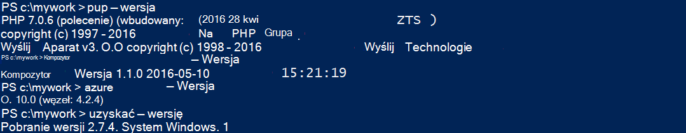
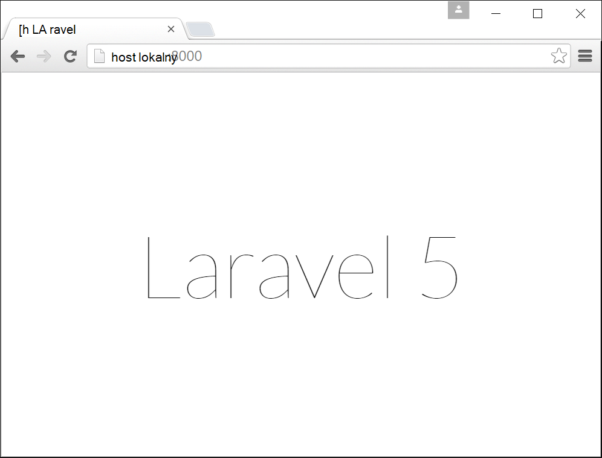
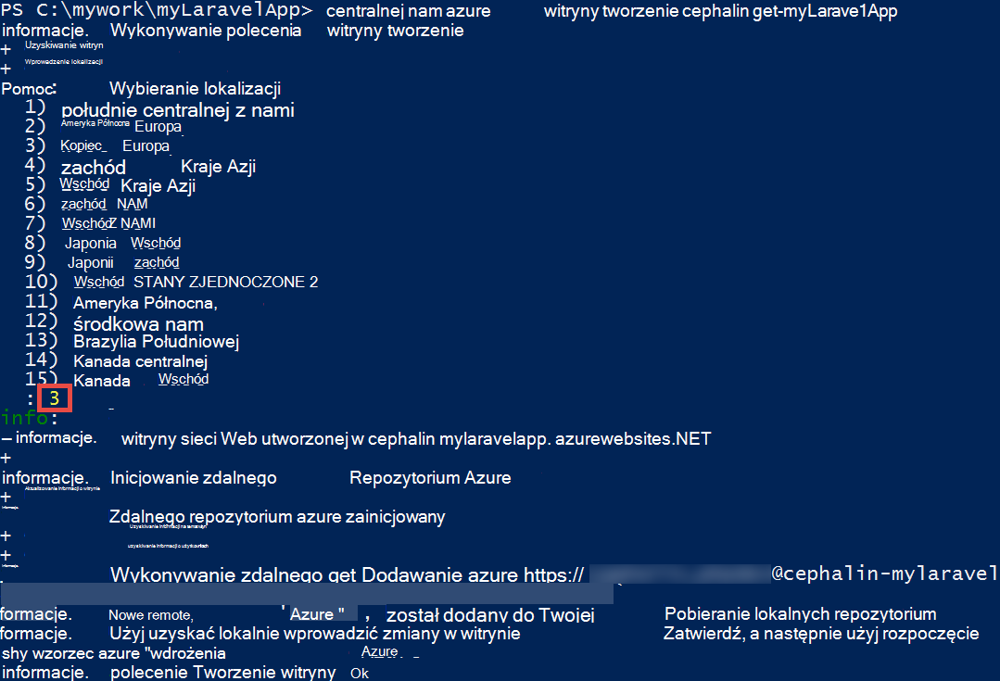
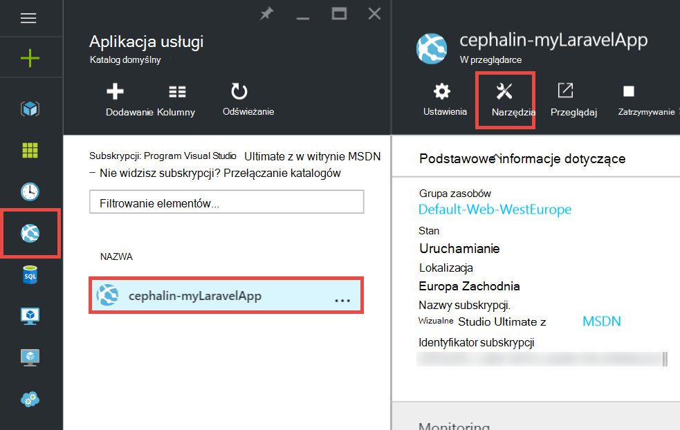
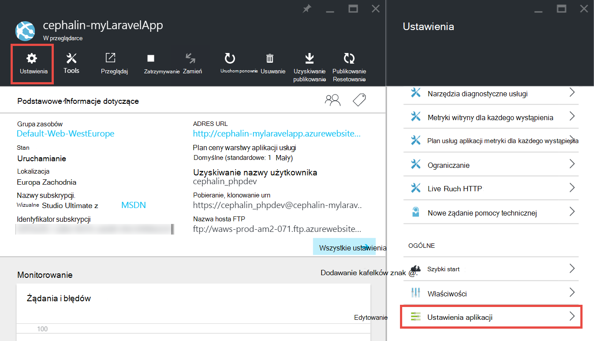
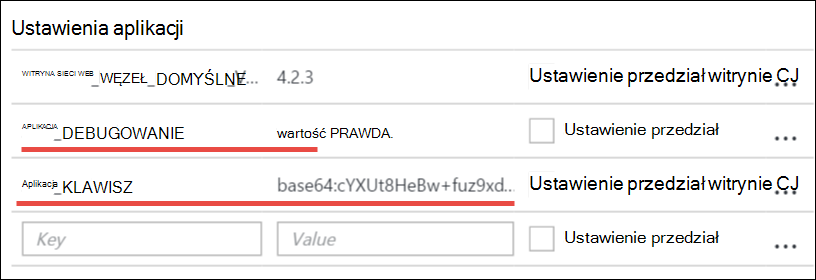
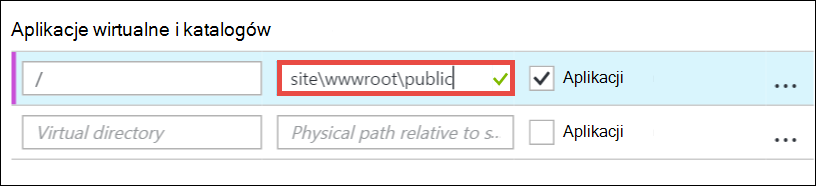
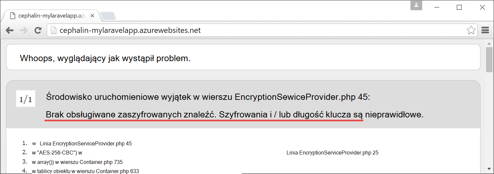

<properties
    pageTitle="Tworzenie, konfigurowanie i wdrażanie aplikacji sieci web PHP Azure"
    description="Samouczek przedstawiający jak skonfigurować aplikację sieci web PHP (Laravel) wykonywania w usłudze Azure aplikacji. Dowiedz się, jak skonfigurować usługę Azure aplikacji do wymagań framework PHP, które możesz wybrać."
    services="app-service\web"
    documentationCenter="php"
    authors="cephalin"
    manager="wpickett"
    editor=""
    tags="mysql"/>

<tags
    ms.service="app-service-web"
    ms.workload="web"
    ms.tgt_pltfrm="na"
    ms.devlang="PHP"
    ms.topic="article"
    ms.date="06/03/2016" 
    ms.author="cephalin"/>

# Tworzenie, konfigurowanie i wdrażanie aplikacji sieci web PHP Azure

[AZURE.INCLUDE [tabs](../../includes/app-service-web-get-started-nav-tabs.md)]

W tym samouczku pokazano, jak tworzyć, konfigurowanie i wdrażanie aplikacji sieci web PHP dla Azure i jak skonfigurować usługę Azure aplikacji do wymagań aplikacji sieci web PHP. Koniec samouczka konieczne będzie działać aplikacji sieci web [Laravel](https://www.laravel.com/) systemem live w [Usłudze Azure w aplikacji](../app-service/app-service-value-prop-what-is.md).

Projektant PHP możesz zabrać ze sobą swojego ulubionego framework PHP Azure. Samouczku Laravel po prostu jako przykład konkretnych aplikacji. Dowiesz się: 

- Wdrażanie przy użyciu cyfra
- Ustawianie PHP wersji
- Używanie pliku start, który nie znajduje się w katalogu głównym aplikacji
- Zmienne specyficzne dla środowiska programu Access
- Aktualizowanie aplikacji platformy Azure

Możesz zastosować zdobyte informacje poniżej do innych aplikacji sieci web PHP, które wdrażanie Azure.

>[AZURE.INCLUDE [app-service-linux](../../includes/app-service-linux.md)] 

## Wymagania wstępne

- Instalowanie [PHP 5.6.x](http://php.net/downloads.php) (Pomoc techniczna PHP 7 jest beta)
- Instalowanie [Kompozytor](https://getcomposer.org/download/)
- Instalowanie [polecenie Azure](../xplat-cli-install.md)
- Instalowanie [cyfra](http://www.git-scm.com/downloads)
- Uzyskiwanie konta Microsoft Azure. Jeśli nie masz konta, możesz [Utwórz konto w bezpłatnej wersji próbnej](/pricing/free-trial/?WT.mc_id=A261C142F) lub [aktywowania programu Visual Studio subskrybentów korzyści](/pricing/member-offers/msdn-benefits-details/?WT.mc_id=A261C142F).

>[AZURE.NOTE] Zobacz aplikacji sieci web w działaniu. [Spróbuj aplikacji usługi](http://go.microsoft.com/fwlink/?LinkId=523751) natychmiast i tworzenie aplikacji krótkotrwałe starter — karty kredytowej wymagane, nie zobowiązań.

## Tworzenie aplikacji PHP (Laravel) na komputerze deweloperów

1. Otwórz nowy wiersz polecenia systemu Windows, okno programu PowerShell, powłoki Linux lub terminal OS X. Uruchom następujące polecenia, aby sprawdzić, czy narzędzia potrzebne są prawidłowo zainstalowane na komputerze. 

        php --version
        composer --version
        azure --version
        git --version

    

    Jeśli jeszcze nie zainstalowano narzędzia, zobacz [wymagania wstępne](#Prerequisites) dotyczące łącza pobierania.
    
2. Zainstaluj Laravel tak jak:

        composer global require "laravel/installer

3. `CD`do katalogu roboczego i tworzenie nowej aplikacji Laravel tak jak:

        cd <working_directory>
        laravel new <app_name>

4. `CD`do nowo utworzonej `<app_name>` katalogu i testowanie aplikacji tak jak:

        cd <app_name>
        php artisan serve
        
    Można teraz przejdź do 8000 w przeglądarce i wyświetlony ekran powitalny Laravel.
    
    
    
Tak daleko, właśnie zwykłą Laravel przepływu pracy, a znajdziesz nie <a href="https://laravel.com/docs/5.2" rel="nofollow">informacje Laravel</a>. Dlatego przejdziemy.

## Tworzenie aplikacji sieci web Azure i skonfigurować wdrożenie cyfra

>[AZURE.NOTE] "Zaczekaj! Co zrobić, jeśli chcę wdrożyć FTP?" Istnieje [Samouczek FTP](web-sites-php-mysql-deploy-use-ftp.md) do własnych potrzeb. 

Polecenie Azure możesz utworzyć aplikację sieci web w usłudze Azure aplikacji i skonfigurował wdrożenia cyfra z jednego wiersza polecenia. Załóżmy wykonaj następujące czynności.

1. Zmień tryb ASM i zaloguj się do Azure:

        azure config mode asm
        azure login
    
    Postępuj zgodnie z komunikatem Pomocy, aby kontynuować proces logowania.
    
    

4. Uruchamianie polecenia do tworzenia aplikacji sieci Azure web rozmieszczenia cyfra. Gdy zostanie wyświetlony monit, określ liczbę odpowiedni region.

        azure site create --git <app_name>
    
    
    
    >[AZURE.NOTE] Jeśli nigdy nie ustawiono poświadczeń wdrożenia Azure subskrypcji, zostanie wyświetlony monit, aby je utworzyć. Te poświadczenia, a nie swoje poświadczenia konta Azure, są używane przez usługi aplikacji tylko w przypadku wdrożeń cyfra i FTP logowania. 
    
    To polecenie tworzy nowe repozytorium cyfra do bieżącego katalogu (z `git init`) i podłączony do repozytorium w Azure jako zdalnego cyfra (z `git remote add`).

<a name="configure"/>
## Konfigurowanie aplikacji sieci Azure web

Dla aplikacji Laravel do pracy w Azure należy zwrócić uwagę na kilka sposobów. Wykonaj tego ćwiczenia podobne do RAM PHP wybór.

- Konfigurowanie PHP 5.5.9 lub nowszego. Zobacz [Wymagania dotyczące najnowszych Laravel 5,2 serwera](https://laravel.com/docs/5.2#server-requirements) dla całej listy wymagania dotyczące serwera. Pozostałych elementów listy są rozszerzenia, które już są włączone przez osoby Azure PHP. 
- Ustawianie zmiennych środowiska aplikacji potrzebuje. Używa Laravel `.env` pliku Określanie zmiennych środowiska. Jednak ponieważ nie powinien być przekazane do kontrolki źródła (zobacz [Konfiguracji środowiska Laravel](https://laravel.com/docs/5.2/configuration#environment-configuration)zostanie ustawiona zamiast tego ustawienia aplikacji aplikacji sieci Azure web.
- Upewnij się, że punkt wejścia aplikacji Laravel, `public/index.php`, po raz pierwszy załadowanego. Zobacz [Omówienie Laravel cyklu życia](https://laravel.com/docs/5.2/lifecycle#lifecycle-overview). Innymi słowy, należy ustawić główny adres URL aplikacji sieci web, aby wskazywały `public` katalogu.
- Włącz rozszerzenia Kompozytor w Azure, ponieważ mają composer.json. W ten sposób możesz pozwolić, aby Kompozytor martwić uzyskania wymagane pakiety po wdrożeniu z `git push`. Jest to kwestia wygody. Jeśli nie włączysz Kompozytor automatyzacji, wystarczy usunąć `/vendor` z `.gitignore` plik, tak aby zawiera cyfra ("Wyczyść-ignoruje") publikowane w `vendor` katalogu po ich zatwierdzeniem i wdrażanie kodu.

Załóżmy kolejno skonfigurować te zadania.

4. Ustawianie wersji PHP, która wymaga aplikacji Laravel.

        azure site set --php-version 5.6

    Gotowe ustawienie wersji PHP! 
    
4. Generowanie nowego `APP_KEY` dla usługi Azure sieci web app i ustawianie go jako ustawienie aplikacji dla aplikacji sieci Azure web.

        php artisan key:generate --show
        azure site appsetting add APP_KEY="<output_of_php_artisan_key:generate_--show>"

4. Ponadto włączania Laravel debugowania w celu zastępują wszelkie zrozumiałą `Whoops, looks like something went wrong.` strony.

        azure site appsetting add APP_DEBUG=true

    Ustawienia środowiska zmiennych gotowe!
    
    >[AZURE.NOTE] Poczekaj, Przejdźmy spowolnić nieco i wyjaśniono, co oznacza Laravel i Azure działanie tutaj. Używa Laravel `.env` pliku w katalogu głównym udzielenia zmienne środowiska do aplikacji, której można znaleźć linię `APP_DEBUG=true` (a także `APP_KEY=...`). Zmienna jest dostępna w `config/app.php` kod     `'debug' => env('APP_DEBUG', false),`. [ENV()](https://laravel.com/docs/5.2/helpers#method-env) jest to metoda Pomocnik Laravel, która używa PHP [getenv()](http://php.net/manual/en/function.getenv.php) w obszarze okładki.
    >
    >Jednak `.env` jest ignorowany przez cyfra, ponieważ jest wymienionym `.gitignore` pliku w katalogu głównym. Krótko mówiąc, `.env`  
 w swojej lokalnej cyfra repozytorium zostanie nie przypisany do Azure z reszty plików. Oczywiście można usunąć tylko tego wiersza z `.gitignore`, ale mamy już zostały ustanowione nie zalecane zatwierdzeniem tego pliku w formancie źródła. Jednak nadal potrzebujesz sposobem określania zmienne środowiska platformy Azure. 
    >
    >Szczęście to, że ustawienia aplikacji w usłudze Azure aplikacja obsługuje [getenv()](http://php.net/manual/en/function.getenv.php)  
 w PHP. Tak, za pomocą FTP lub w inny sposób przekazywania ręcznie `.env` pliku do Azure, po prostu jako można określić zmienne ma ustawień aplikacji Azure bez `.env` w Azure, takich jak przed chwilą zrobiono. Ponadto jeśli zmienna jest zarówno `.env` plik, a następnie w obszarze Ustawienia aplikacji Azure wins ustawienie Azure aplikacji.     

4. [Azure portal](https://portal.azure.com)wymaga dwóch ostatnich zadań (ustawienie katalogu wirtualnego i włączanie kompozytor), aby zalogować się do [portalu](https://portal.azure.com) za pomocą konta usługi Azure.

4. Z poziomu menu po lewej stronie kliknij pozycję **Usługi aplikacji** > **&lt;nazwa_aplikacji >** > **Narzędzia**.

    
    
    >[AZURE.TIP] Jeśli klikniesz **Ustawienia** zamiast **Narzędzia**, można uzyskać dostęp do **Ustawień aplikacji**  
 karta, która umożliwia ustawianie wersji PHP, ustawień aplikacji i to zostało katalogów wirtualnych, takich jak Ty. 
    
4. Kliknij pozycję **rozszerzenia** > **Dodaj** , aby dodać rozszerzenie.

4. Wybierz pozycję **Kompozytor** na **rozszerzenie wybierz** [Karta](../azure-portal-overview.md) (*Karta*: strona portalu, otwartym w poziomie).

4. Kliknij **przycisk OK** w karta **Zaakceptuj warunki prawne** . 

5. Kliknij **przycisk OK** w karta **Dodaj rozszerzenie** .

    Po zakończeniu Azure Dodawanie rozszerzenia, powinien zostać wyświetlony przyjazny komunikat podręczny w rogu, a także  **Kompozytor** wymienionych w karta **rozszerzenia** .

    

    Włączanie Kompozytor gotowe!
    
4. Po powrocie do karta aplikacji sieci web, kliknij pozycję **Ustawienia** > **Ustawienia aplikacji**.

    

    Zanotuj wersję PHP, ustawione wcześniej w karta **Ustawienia aplikacji** :

    

    i dodawane ustawienia aplikacji:
    
    

4. Przewiń do dołu karta i Zmień głównego katalogu wirtualnego, aby wskazywały **site\wwwroot\public** zamiast **site\wwwroot**.

    

4. Kliknij przycisk **Zapisz** w górnej części karta.

    Gotowe ustawienie katalogu wirtualnego! 

## Wdrażanie aplikacji sieci web z cyfra (i konfigurowania środowiska zmienne)

Możesz teraz wdrażanie kodu. Wykonaj tej w wierszu polecenia lub terminal.

4. Zatwierdzić wprowadzone zmiany i wdrażanie kodu do aplikacji sieci Azure web, podobnie jak w dowolnym repozytorium cyfra:

        git add .
        git commit -m "Hurray! My first commit for my Azure app!"
        git push azure master 

    Podczas uruchamiania `git push`, zostanie wyświetlony monit o podanie hasła wdrożenia cyfra. Jeśli monit o utworzenie wdrażania poświadczeń w `azure site create` wcześniej, wpisz w polu hasło zostało użyte.
    
5. Zobaczmy, uruchamiając tego polecenia są uruchamiane w przeglądarce:

        azure site browse

    Przeglądarki należy wyświetlić ekran powitalny Laravel.
    
    
    
    Gratulacje, teraz używasz aplikacji sieci web Laravel platformy Azure.
             
## Rozwiązywanie typowych problemów

Oto niektóre błędy, które mogą pojawić się po tego samouczka:

- [Polecenie Azure zawiera "" witryny"nie jest azure polecenie"](#clierror)
- [Wyświetla błąd HTTP 403, aplikacji sieci Web](#http403)
- [Aplikacja sieci Web informuje, że "Whoops, wygląda jak wystąpił problem."](#whoops)
- [W przeglądarce zawiera "Nie obsługiwanych szyfrujący znaleziony."](#encryptor)

### Polecenie Azure zawiera "" witryny"nie jest azure polecenie"

Podczas uruchamiania `azure site *` w terminal wiersza polecenia, zostanie wyświetlony komunikat o błędzie`error:   'site' is not an azure command. See 'azure help'.` 

Jest to zazwyczaj wyniku przełączania w trybie "ARM" (Menedżer zasobów Azure). Aby rozwiązać ten problem, przejdź do trybu "ASM" (Zarządzanie usługą Azure), uruchamiając `azure config mode asm`.

### Wyświetla błąd HTTP 403, aplikacji sieci Web

Wdrożono aplikacji sieci web Azure pomyślnie, ale po przejściu do aplikacji sieci Azure web, zostanie wyświetlony komunikat `HTTP 403` lub`You do not have permission to view this directory or page.`

To jest najprawdopodobniej aplikacji sieci web nie można odnaleźć punktu wejścia do aplikacji Laravel. Upewnij się, zmieniono głównego katalogu wirtualnego, aby wskazywały `site\wwwroot\public`, gdzie Laravel w `index.php` jest (zobacz [Konfigurowanie aplikacji sieci Azure web](#configure)).

### Aplikacja sieci Web informuje, że "Whoops, wygląda jak wystąpił problem."

Wdrożono aplikacji sieci web Azure pomyślnie, ale po przejściu do aplikacji sieci Azure web, zostanie wyświetlony komunikat zrozumiałą`Whoops, looks like something went wrong.`

Aby uzyskać bardziej szczegółowy błędu, Włącz Laravel debugowania przez ustawienie `APP_DEBUG` zmiennej środowiska `true` (zobacz [Konfigurowanie aplikacji sieci Azure web](#configure)).

### W przeglądarce zawiera "Nie obsługiwanych szyfrujący znaleziony."

Wdrożono aplikacji sieci web Azure pomyślnie, ale po przejściu do aplikacji sieci Azure web, zostanie wyświetlony poniższy komunikat o błędzie:

    
To nasty błędu, ale co najmniej nie jest niezrozumiała ponieważ włączone debugowanie Laravel. Pobieżną wyszukiwania ciągu błąd na forach Laravel zostanie wyświetlona się ze względu na to ustawienie nie zostanie APP_KEY `.env`, lub w Twoim przypadku nie ma `.env` platformy Azure wcale. Można to naprawić, dodając ustawienie `APP_KEY` jako aplikację Azure ustawienie (zobacz [Konfigurowanie aplikacji sieci Azure web](#configure)).
    
## Następne kroki

Dowiedz się, jak dodać dane do aplikacji, [tworząc bazą danych MySQL platformy Azure](../store-php-create-mysql-database.md). Ponadto zapoznaj się z bardziej przydatne łącza dla PHP platformy Azure poniżej:

- [Centrum deweloperów PHP](/develop/php/).
- [Tworzenie aplikacji sieci web z usługi Azure Marketplace](app-service-web-create-web-app-from-marketplace.md)
- [Konfigurowanie PHP w aplikacjach sieci Web Azure aplikacji usługi](web-sites-php-configure.md)
- [Konwertowanie WordPress wielooddziałowość w usłudze Azure aplikacji](web-sites-php-convert-wordpress-multisite.md)
- [WordPress klasy korporacyjnej na Azure aplikacji usługi](web-sites-php-enterprise-wordpress.md)
