<properties 
    pageTitle="Używanie Azure CDN w Azure aplikacji usługi" 
    description="Samouczek opisujący jak wdrożyć aplikację sieci web do usługi aplikacji Azure służy zawartości z punktu końcowego zintegrowane Azure CDN" 
    services="app-service\web,cdn" 
    documentationCenter=".net" 
    authors="cephalin" 
    manager="wpickett" 
    editor="jimbe"/>

<tags 
    ms.service="app-service" 
    ms.workload="tbd" 
    ms.tgt_pltfrm="na" 
    ms.devlang="dotnet" 
    ms.topic="article" 
    ms.date="07/01/2016" 
    ms.author="cephalin"/>


# <a name="use-azure-cdn-in-azure-app-service"></a>Używanie Azure CDN w Azure aplikacji usługi

[Usługa aplikacji](http://go.microsoft.com/fwlink/?LinkId=529714) można zintegrować z [Azure CDN](/services/cdn/), dodanie do globalnej funkcji skalowania biznesowej w [Aplikacjach sieci Web usługi aplikacji](http://go.microsoft.com/fwlink/?LinkId=529714) udostępniając zawartości aplikacji sieci web globalnie z węzłów serwera u klientów (zaktualizowaną listę wszystkich bieżącej lokalizacji węzeł można znaleźć [tutaj](http://msdn.microsoft.com/library/azure/gg680302.aspx)). W scenariuszy, takich jak serwowania obrazów statycznych integracja znacznie zwiększyć wydajność aplikacji sieci Web programu Azure aplikacji usługi i znacznie zwiększa środowisko użytkownika aplikacji sieci web na całym świecie. 

Integracja aplikacji sieci Web z sieci CDN Azure zapewnia następujące korzyści:

- Integracja rozmieszczania zawartości (obrazów, skrypty i arkusze stylów) w ramach procesu [wdrażania ciągły](app-service-continuous-deployment.md) aplikacji sieci web
- Łatwo uaktualnić pakietów NuGet w aplikacji sieci web w usłudze Azure aplikacji, takich jak jQuery lub uruchamiania wersji 
- Zarządzanie aplikacji sieci Web i obsługiwane CDN zawartości z tego samego interfejsu programu Visual Studio
- Integracja programu ASP.NET grupowania i minification z Azure CDN

[AZURE.INCLUDE [app-service-web-to-api-and-mobile](../../includes/app-service-web-to-api-and-mobile.md)] 

## <a name="what-you-will-build"></a>Zostanie utworzona ##

Będzie wdrażanie aplikacji sieci web do usługi aplikacji Azure przy użyciu domyślnego szablonu ASP.NET MVC w programie Visual Studio, Dodaj kod, aby udostępniać zawartość z zintegrowane CDN Azure, takich jak obraz, wyniki działania kontrolerze i domyślnego języka JavaScript i plików CSS i także napisać kod, aby skonfigurować alternatywnych mechanizm wiązki obsługiwane w przypadku, gdy CDN jest w trybie offline.

## <a name="what-you-will-need"></a>Co będzie potrzebne ##

Ten samouczek ma następujące wymagania:

-   Aktywne [konto Microsoft Azure](/account/)
-   Visual Studio 2015 z [Azure SDK dla środowiska .NET](http://go.microsoft.com/fwlink/p/?linkid=323510&clcid=0x409). Jeśli korzystasz z programu Visual Studio, czynności mogą się różnić.

> [AZURE.NOTE] Potrzebne jest konto Azure do użycia tego samouczka:
> + Możesz [otworzyć konto Azure bezpłatnie](/pricing/free-trial/) — pobranie środków Umożliwia wypróbowanie płatnych usług Azure, a nawet w przypadku, gdy są używane w górę możesz zachować konta i użyj wolny Azure usług, takich jak aplikacje sieci Web.
> + Można [aktywować korzyści subskrybentów Visual Studio](/pricing/member-offers/msdn-benefits-details/) — subskrypcji i Visual Studio umożliwia środków co miesiąc, używanej usługi Azure płatnej.
>
> Jeśli chcesz rozpocząć pracę z Azure aplikacji usługi przed utworzeniem konta dla konta Azure, przejdź do [Spróbuj aplikacji usługi](http://go.microsoft.com/fwlink/?LinkId=523751), którym natychmiast można utworzyć aplikację sieci web krótkotrwałe starter w aplikacji usługi. Nie kart kredytowych wymagane; nie zobowiązania.

## <a name="deploy-a-web-app-to-azure-with-an-integrated-cdn-endpoint"></a>Wdrażanie aplikacji sieci web Azure z zintegrowane końcowym sieci CDN ##

W tej sekcji będą wdrażanie aplikacji usługi domyślnego szablonu aplikacji programu ASP.NET MVC w Visual Studio 2015 r, a następnie zintegrować z nowy punkt końcowy CDN. Postępuj zgodnie z instrukcjami poniżej:

1. W Visual Studio 2015 r., tworzenie nowej aplikacji sieci web programu ASP.NET na pasku menu, przechodząc do **Plik > Nowy > Projekt > sieci Web > aplikacji sieci Web programu ASP.NET**. Nadaj plikowi nazwę i kliknij **przycisk OK**.

    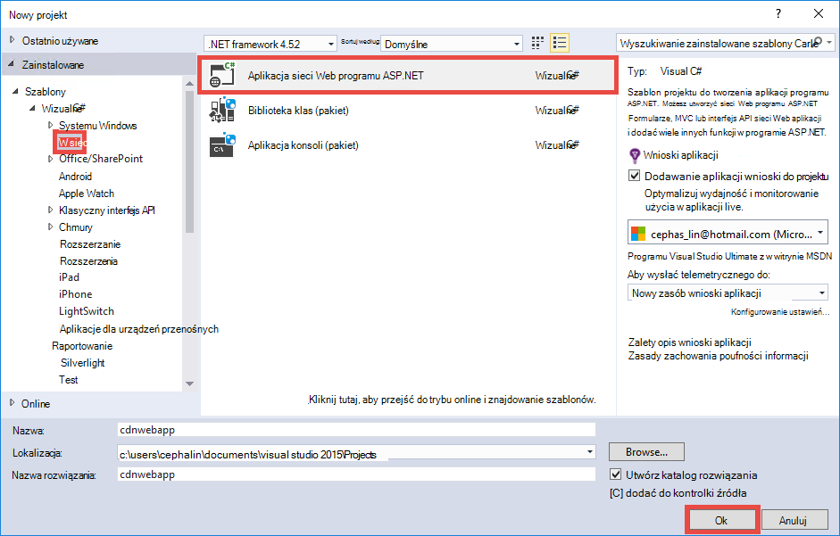

3. Zaznacz **MVC** , a następnie kliknij **przycisk OK**.

    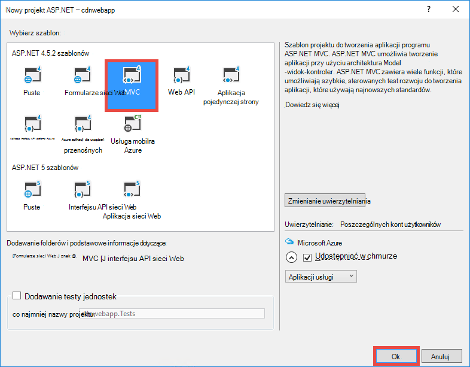

4. Jeśli jeszcze nie zostało przeprowadzone do konta usługi Azure, kliknij ikonę konta w prawym górnym rogu i postępuj zgodnie okno dialogowe, aby zalogować się do konta Azure. Po zakończeniu konfigurowania aplikacji, tak jak pokazano poniżej, a następnie kliknij przycisk **Nowy** , aby utworzyć nowy plan usługi aplikacji dla aplikacji.  

    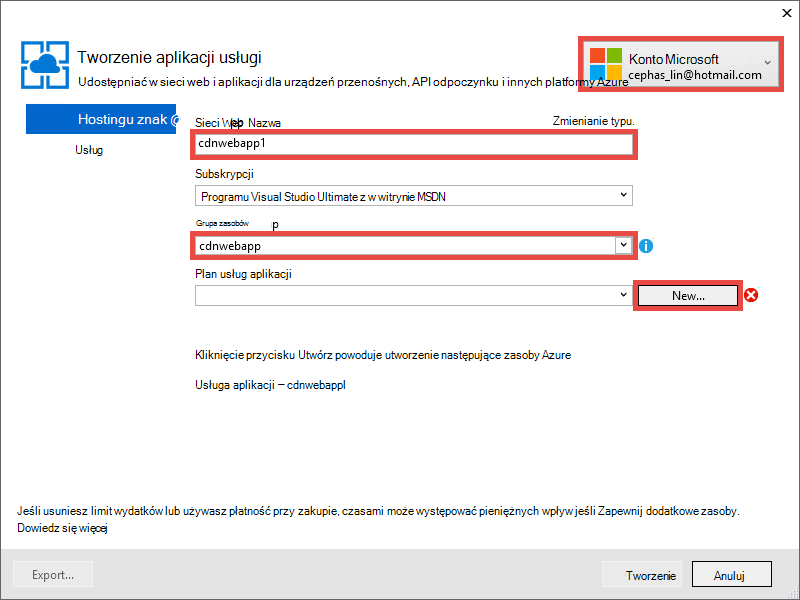

5. Konfigurowanie nowego planu aplikacji usługi w oknie dialogowym, tak jak pokazano poniżej, a następnie kliknij **przycisk OK**. 

    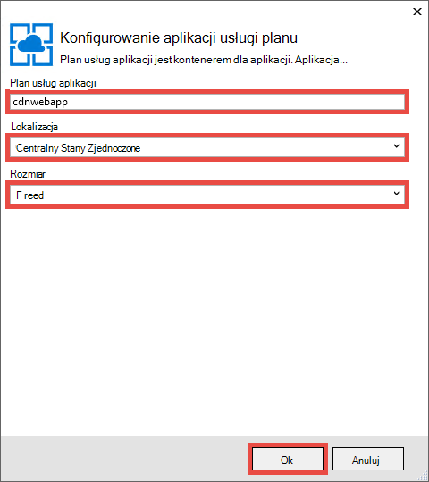

8. Kliknij przycisk **Utwórz** , aby utworzyć aplikację sieci web.

    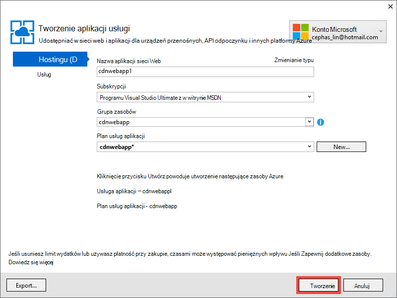

9. Po utworzeniu aplikacji ASP.NET opublikować go Azure w okienku wykonania usługi Azure aplikacji, klikając pozycję **Publikuj `<app name>` dla tej aplikacji sieci Web**. Kliknij przycisk **Publikuj** , aby ukończyć proces.

    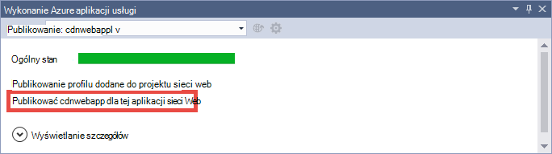

    Po zakończeniu publikowania, zostanie wyświetlony aplikacji web opublikowanych w przeglądarce. 

1. Aby utworzyć punkt końcowy CDN, zaloguj się do [portalu Azure](https://portal.azure.com). 
2. Kliknij pozycję **+ Nowy** > **multimediów + CDN** > **CDN**.

    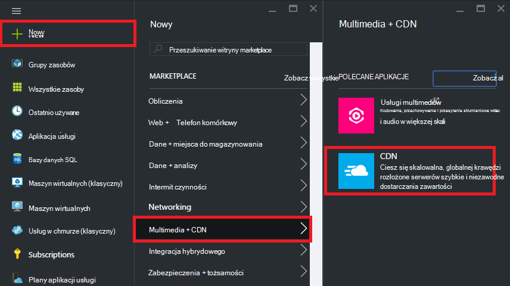

3. Określ **CDN**, **lokalizację**, **Grupa zasobów**, **ceny warstwy**, a następnie kliknij przycisk **Utwórz**

    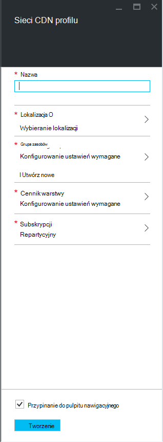   

4. W **Profilu CDN** karta kliknij przycisk **+ punktu końcowego** . Nadaj plikowi nazwę, wybierz **Aplikację sieci Web** w menu rozwijanego **Typ pochodzenia** i aplikacji sieci web, na liście rozwijanej **Origin hostname** , a następnie kliknij przycisk **Dodaj**.  

    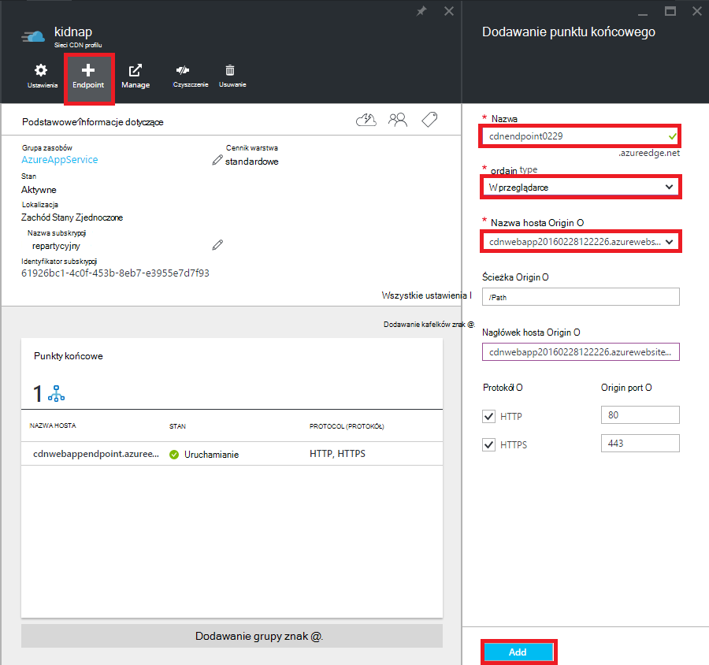


    > [AZURE.NOTE] Po utworzeniu punkt końcowy CDN karta **punkt końcowy** zostanie wyświetlona jego adres URL sieci CDN i domeny origin, który jest zintegrowany z. Jednak może minąć trochę czasu, zanim nowy końcowy CDN konfiguracji są w pełni propagowane do wszystkich lokalizacji węzeł CDN. 

3. Po powrocie do karta **punktu końcowego** kliknij nazwę punktu końcowego CDN właśnie utworzony.

    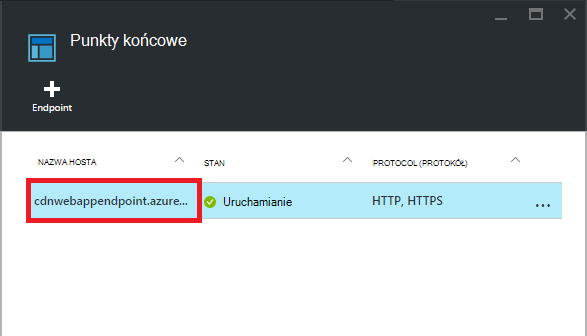

3. Kliknij przycisk **Konfiguruj** . W karta **Konfigurowanie** wybierz **pamięci podręcznej każdej unikatowy adres URL** w **pamięci podręcznej, zachowanie ciągu kwerendy** z listy rozwijanej, a następnie kliknij przycisk **Zapisz** .


    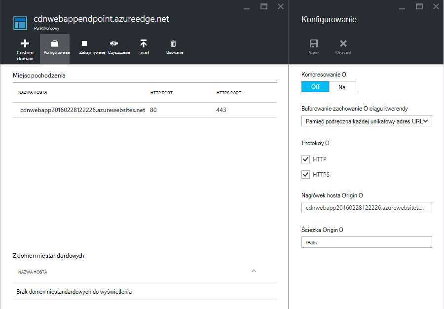

Po włączeniu to samo łącze pobierane przez różne ciągi kwerend będą buforowane jako oddzielne wpisy.

>[AZURE.NOTE] Podczas włączania ciągu kwerendy nie jest konieczne dla tego samouczka, należy to wcześniej możliwie dla wygody od jakiejkolwiek zmiany w tym miejscu ma czasu propagowanie do wszystkich węzłów CDN, a nie chcesz, aby zawartość innych niż kwerenda ciąg-z włączonym one zapełniać w górę CDN pamięci podręcznej (aktualizacji zawartości CDN zostanie omówiony później).

2. Teraz przejdź do adresu punktu końcowego CDN. Jeśli punkt końcowy jest gotowy, powinien zostać wyświetlony aplikacji sieci web wyświetlane. Jeśli zostanie wyświetlony komunikat o błędzie **HTTP 404** , punkt końcowy CDN nie jest gotowy. Może być konieczne oczekiwać godziny konfiguracji sieci CDN są propagowane do wszystkich węzłów krawędzi. 

    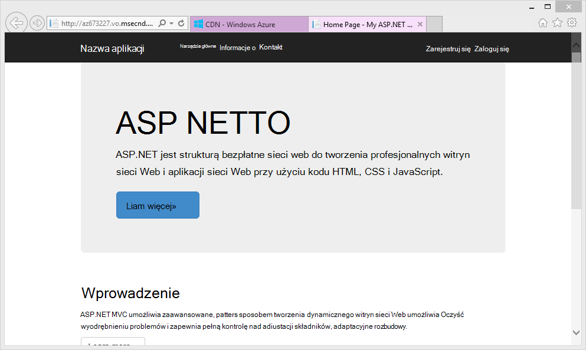

1. Następnie próbę uzyskania dostępu do pliku **~/Content/bootstrap.css** w projekcie ASP.NET. W oknie przeglądarki, przejdź do * *http://*&lt;cdnName >*.azureedge.net/Content/bootstrap.css**. Moje ustawienia ten adres URL jest:

        http://az673227.azureedge.net/Content/bootstrap.css

    Które odpowiada następujące źródłowy adres URL w sieci CDN punkt końcowy:

        http://cdnwebapp.azurewebsites.net/Content/bootstrap.css

    Po przejściu do * *http://*&lt;cdnName >*.azureedge.net/Content/bootstrap.css**, pojawi się monit o pobranie bootstrap.css, dostarczonej razem z Twojej aplikacji sieci web platformy Azure. 

    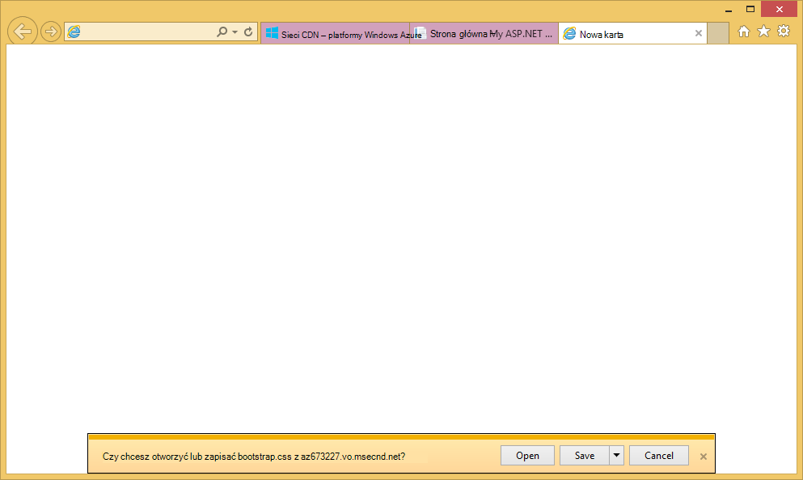

Podobnie możesz uzyskać dostęp do dowolnego publicznie adresu URL w * *http://*&lt;NazwaUsługi >*.cloudapp.net/** bezpośrednio z sieci CDN punktu końcowego. Na przykład:

-   Plik js z ścieżce/Script
-   Dowolny plik zawartości z/Content ścieżki
-   Kontroler i działania 
-   Po włączeniu ciągu kwerendy na punkt końcowy CDN dowolny adres URL z ciągi kwerend
-   Cały Azure aplikacji web app, jeśli cała zawartość jest publiczna

Należy zauważyć, że może nie być zawsze dobrym pomysłem (lub ogólnie dobrym pomysłem) do obsługi aplikacji całego web Azure za pośrednictwem sieci CDN Azure. Ostrzeżenia, należą:

-   Ta metoda wymaga całej witryny dostępna publicznie, ponieważ Azure CDN nie może służyć dowolny prywatną zawartość.
-   Jeśli z jakiegoś powodu punkt końcowy CDN przechodzi do trybu offline, czy zaplanowanych lub błąd użytkownika aplikacji sieci web całego przechodzi do trybu offline, chyba że klienci mogą być przekierowywane do źródłowy adres URL * *http://*&lt;nazwa witryny >*.azurewebsites.net/**. 
-   Nawet w przypadku ustawienia pamięci podręcznej Kontrolki niestandardowe (zobacz [Konfigurowanie opcji buforowania dla plików statycznych w aplikacji sieci Azure web](#configure-caching-options-for-static-files-in-your-azure-web-app)) punkt końcowy CDN nie poprawia wydajności zawartości wysoce dynamiczne. Jeśli próbujesz ładowanie strony głównej od punktu końcowego sieci CDN jak przedstawiony powyżej, należy zauważyć, że zajęło co najmniej 5 sekund aby załadować domyślnej strony głównej po raz pierwszy, czyli dość proste strony. Załóżmy, co się stanie do obsługi klienta, jeśli ta strona zawiera zawartość dynamiczna, który należy zaktualizować co minutę. Serwowania zawartości dynamicznej z punkt końcowy CDN wymaga wygaśnięcie krótki pamięci podręcznej, co oznacza Chybienia w pamięci podręcznej częste w punkcie końcowym CDN. Spowoduje to powinna wydajność aplikacji sieci Azure web i defeats przeznaczenie CDN.

Alternatywny jest określić, jaka zawartość ma być służyć z Azure CDN na podstawie przez przypadek w aplikacji sieci Azure web. W tym celu masz już widoczne jak uzyskać dostęp do pojedynczych plików zawartości od punktu końcowego CDN. I procedurach pokazano, jak obsługiwać akcję kontroler określone przez punkt końcowy CDN w [udostępniać zawartość z akcji kontroler za pośrednictwem sieci CDN Azure](#serve-content-from-controller-actions-through-azure-cdn).

## <a name="configure-caching-options-for-static-files-in-your-azure-web-app"></a>Konfigurowanie opcji buforowania dla plików statycznych w aplikacji sieci Azure web ##

W przypadku integracji Azure CDN w aplikacji sieci Azure web można określić, jak ma zawartość statyczną pamięci podręcznej w punkt końcowy CDN. Aby to zrobić, otwórz *Web.config* z Twojego projektu programu ASP.NET (np. **cdnwebapp**), a następnie dodaj `<staticContent>` element, aby `<system.webServer>`. XML poniższe konfiguruje pamięci podręcznej wygaśnie w ciągu 3 dni.  

    <system.webServer>
      <staticContent>
        <clientCache cacheControlMode="UseMaxAge" cacheControlMaxAge="3.00:00:00"/>
      </staticContent>
      ...
    </system.webServer>

Po wykonaniu tej czynności wszystkich plików statycznych w aplikacji sieci Azure web odbywa się w tej samej reguły w pamięci podręcznej CDN. Aby uzyskać większą kontrolę nad ustawień pamięci podręcznej Dodawanie pliku *Web.config* do folderu i dodawanie ustawień. Na przykład dodać plik *Web.config* do folderu *\Content* i zastąpić zawartości XML następujące czynności:

    <?xml version="1.0"?>
    <configuration>
      <system.webServer>
        <staticContent>
          <clientCache cacheControlMode="UseMaxAge" cacheControlMaxAge="15.00:00:00"/>
        </staticContent>
      </system.webServer>
    </configuration>

To ustawienie powoduje, że wszystkie pliki statyczne z folderu *\Content* pamięci podręcznej przez 15 dni.

Aby uzyskać więcej informacji na temat konfigurowania `<clientCache>` elementu, zobacz [pamięci podręcznej klienta &lt;clientCache >](http://www.iis.net/configreference/system.webserver/staticcontent/clientcache).

W następnej sekcji można także przedstawiono, jak można skonfigurować ustawienia pamięci podręcznej kontrolera wyniki akcji w pamięci podręcznej CDN.

## <a name="serve-content-from-controller-actions-through-azure-cdn"></a>Udostępniać zawartość z akcji kontroler za pośrednictwem sieci CDN Azure ##

Aplikacje sieci Web można zintegrować z Azure CDN, jest stosunkowo łatwo udostępniać zawartość z akcji kontroler za pośrednictwem sieci CDN Azure. Ponownie Jeśli zdecydujesz się do obsługi aplikacji web Azure całego za pośrednictwem sieci CDN, nie trzeba to zrobić na wszystkich ponieważ wszystkie akcje kontroler są już dostępne za pośrednictwem sieci CDN. Ale z powodów, które można już wskazano w [Wdrażanie aplikacji Azure web z zintegrowane końcowym CDN](#deploy-a-web-app-to-azure-with-an-integrated-cdn-endpoint), możesz zdecydować, przed i wybierz zamiast wybrać akcję kontrolerze, których chcesz używać z Azure CDN. [Maarten Balliauw](https://twitter.com/maartenballiauw) pokazano, jak to zrobić z Wesołych kontroler MemeGenerator [Skracanie](http://channel9.msdn.com/events/TechDays/Techdays-2014-the-Netherlands/Reducing-latency-on-the-web-with-the-Windows-Azure-CDN)opóźnienia w sieci web za pomocą sieci CDN Azure. Można będzie po prostu odtworzyć go w tym miejscu.

Załóżmy, że w aplikacji sieci web, aby wygenerować memes na podstawie małych obrazu Norris uchwytach (zdjęcie światło [Alan](http://www.flickr.com/photos/alan-light/218493788/)) tak jak poniżej:


Masz prostą `Index` akcję, która pozwala określić najwyższego przymiotników na obrazie, następnie generuje meme po przesyłać do akcji. Ponieważ jest Norris uchwytach, można oczekiwać strony, aby globalnie stają się wildly popularne. To jest dobrym przykładem serwowania półstrukturalnych dynamicznej zawartości z Azure CDN. 

Wykonaj powyższe kroki, aby ta akcja kontroler konfiguracji:

1. W folderze *\Controllers* utworzenie nowego pliku CS o nazwie *MemeGeneratorController.cs* i zastąpić zawartość poniższy kod. Podstaw ścieżce pliku dla `~/Content/chuck.bmp` i nazwa sieci CDN dla `yourCDNName`.


        using System;
        using System.Collections.Generic;
        using System.Diagnostics;
        using System.Drawing;
        using System.IO;
        using System.Net;
        using System.Web.Hosting;
        using System.Web.Mvc;
        using System.Web.UI;

        namespace cdnwebapp.Controllers
        {
          public class MemeGeneratorController : Controller
          {
            static readonly Dictionary<string, Tuple<string ,string>> Memes = new Dictionary<string, Tuple<string, string>>();

            public ActionResult Index()
            {
              return View();
            }

            [HttpPost, ActionName("Index")]
            public ActionResult Index_Post(string top, string bottom)
            {
              var identifier = Guid.NewGuid().ToString();
              if (!Memes.ContainsKey(identifier))
              {
                Memes.Add(identifier, new Tuple<string, string>(top, bottom));
              }

              return Content("<a href=\"" + Url.Action("Show", new {id = identifier}) + "\">here's your meme</a>");
            }

            [OutputCache(VaryByParam = "*", Duration = 1, Location = OutputCacheLocation.Downstream)]
            public ActionResult Show(string id)
            {
              Tuple<string, string> data = null;
              if (!Memes.TryGetValue(id, out data))
              {
                return new HttpStatusCodeResult(HttpStatusCode.NotFound);
              }

              if (Debugger.IsAttached) // Preserve the debug experience
              {
                return Redirect(string.Format("/MemeGenerator/Generate?top={0}&bottom={1}", data.Item1, data.Item2));
              }
              else // Get content from Azure CDN
              {
                return Redirect(string.Format("http://<yourCDNName>.azureedge.net/MemeGenerator/Generate?top={0}&bottom={1}", data.Item1, data.Item2));
              }
            }

            [OutputCache(VaryByParam = "*", Duration = 3600, Location = OutputCacheLocation.Downstream)]
            public ActionResult Generate(string top, string bottom)
            {
              string imageFilePath = HostingEnvironment.MapPath("~/Content/chuck.bmp");
              Bitmap bitmap = (Bitmap)Image.FromFile(imageFilePath);

              using (Graphics graphics = Graphics.FromImage(bitmap))
              {
                SizeF size = new SizeF();
                using (Font arialFont = FindBestFitFont(bitmap, graphics, top.ToUpperInvariant(), new Font("Arial Narrow", 100), out size))
                {
                    graphics.DrawString(top.ToUpperInvariant(), arialFont, Brushes.White, new PointF(((bitmap.Width - size.Width) / 2), 10f));
                }
                using (Font arialFont = FindBestFitFont(bitmap, graphics, bottom.ToUpperInvariant(), new Font("Arial Narrow", 100), out size))
                {
                    graphics.DrawString(bottom.ToUpperInvariant(), arialFont, Brushes.White, new PointF(((bitmap.Width - size.Width) / 2), bitmap.Height - 10f - arialFont.Height));
                }
              }
              MemoryStream ms = new MemoryStream();
              bitmap.Save(ms, System.Drawing.Imaging.ImageFormat.Png);
              return File(ms.ToArray(), "image/png");
            }

            private Font FindBestFitFont(Image i, Graphics g, String text, Font font, out SizeF size)
            {
              // Compute actual size, shrink if needed
              while (true)
              {
                size = g.MeasureString(text, font);

                // It fits, back out
                if (size.Height < i.Height &&
                     size.Width < i.Width) { return font; }

                // Try a smaller font (90% of old size)
                Font oldFont = font;
                font = new Font(font.Name, (float)(font.Size * .9), font.Style);
                oldFont.Dispose();
              }
            }
          }
        }

2. Kliknij prawym przyciskiem myszy w domyślnym `Index()` Akcja i wybierz pozycję **Dodaj widok**.

    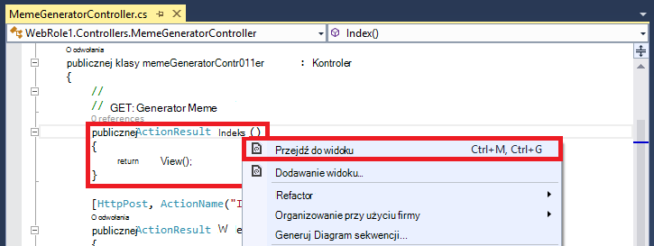

3.  Zaakceptuj poniższe ustawienia i kliknij przycisk **Dodaj**.

    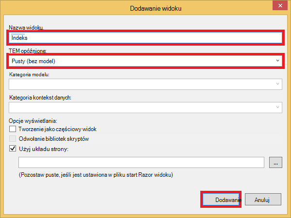

4. Otwórz nowy *Views\MemeGenerator\Index.cshtml* i zastąpić poniższy kod HTML prosty składania najwyższego przymiotników zawartości:

        <h2>Meme Generator</h2>
        
        <form action="" method="post">
            <input type="text" name="top" placeholder="Enter top text here" />
            <br />
            <input type="text" name="bottom" placeholder="Enter bottom text here" />
            <br />
            <input class="btn" type="submit" value="Generate meme" />
        </form>

5. Publikowanie aplikacji sieci Azure web ponownie i przejdź do strony * *http://*&lt;NazwaUsługi >*.cloudapp.net/MemeGenerator/Index** w przeglądarce. 

Po przesłaniu wartości formularza do `/MemeGenerator/Index`, `Index_Post` metoda akcji zwraca łącze do `Show` metody akcję z odpowiednich identyfikatorem wprowadzania danych. Po kliknięciu łącza zostanie wyświetlona następujący kod:  

    [OutputCache(VaryByParam = "*", Duration = 1, Location = OutputCacheLocation.Downstream)]
    public ActionResult Show(string id)
    {
      Tuple<string, string> data = null;
      if (!Memes.TryGetValue(id, out data))
      {
        return new HttpStatusCodeResult(HttpStatusCode.NotFound);
      }

      if (Debugger.IsAttached) // Preserve the debug experience
      {
        return Redirect(string.Format("/MemeGenerator/Generate?top={0}&bottom={1}", data.Item1, data.Item2));
      }
      else // Get content from Azure CDN
      {
        return Redirect(string.Format("http://<yourCDNName>.azureedge.net/MemeGenerator/Generate?top={0}&bottom={1}", data.Item1, data.Item2));
      }
    }

Jeśli dołączony do lokalnych debugowania zostanie wyświetlony pracę zwykłą debugowania w programie lokalne przekierowywania. Jeśli działa w aplikacji sieci Azure web, następnie nastąpi przekierowanie do:

    http://<yourCDNName>.azureedge.net/MemeGenerator/Generate?top=<formInput>&bottom=<formInput>

Które odpowiada następujące źródłowy adres URL w Twojej sieci CDN punkt końcowy:

    http://<yourSiteName>.azurewebsites.net/cdn/MemeGenerator/Generate?top=<formInput>&bottom=<formInput>

Po adres URL edycji wcześniej zastosowano reguły, jest rzeczywisty plik, który pobiera przechowywanych w pamięci podręcznej, sieci CDN punktu końcowego:

    http://<yourSiteName>.azurewebsites.net/MemeGenerator/Generate?top=<formInput>&bottom=<formInput>

Możesz użyć `OutputCacheAttribute` atrybutów na `Generate` metodę, aby określić, jak wynik działania powinny być buforowane, które będą przestrzegać Azure CDN. Poniższy kod określić wygaśnięcie pamięci podręcznej 1 godzina (3600 sekund).

    [OutputCache(VaryByParam = "*", Duration = 3600, Location = OutputCacheLocation.Downstream)]

Analogicznie możesz może służyć zawartości od wszelkich działań kontroler w aplikacji sieci Azure web za pośrednictwem sieci CDN Azure, z odpowiednią opcję buforowania.

W następnej sekcji I procedurach pokazano, jak obsługiwać powiązane i minified skrypty i arkuszy CSS za pośrednictwem sieci CDN Azure. 

## <a name="integrate-aspnet-bundling-and-minification-with-azure-cdn"></a>Integracja programu ASP.NET grupowania i minification z Azure CDN ##

Arkusze stylów CSS i skryptów są głównym kandydatów pamięci podręcznej Azure CDN i zmienianie rzadko. Serwowania aplikacji web całego za pośrednictwem sieci CDN Azure jest najprostszym sposobem integracji grupowania i minification z Azure CDN. Jednak podczas przed tej metody może wybrać z powodów opisanych w [Integracja punkt końcowy Azure CDN z Azure zawartości sieci web app i służą statyczne na stronach sieci Web z sieci CDN Azure](#deploy-a-web-app-to-azure-with-an-integrated-cdn-endpoint), I procedurach pokazano, jak to zrobić przy zachowaniu środowisko programistyczne odpowiedniej ASP.NET grupowania i minification, takie jak:

-   Środowisko tryb debugowania profesjonalnych
-   Usprawniony wdrażania
-   Natychmiastowe aktualizacje klientów dotyczące uaktualnień wersji skryptu i arkuszy CSS
-   Mechanizm alternatywnych w przypadku niepowodzenia punkt końcowy sieci CDN
-   Minimalizowanie modyfikacja kodu

W programie project ASP.NET, utworzony w [Integracja punkt końcowy Azure CDN z Azure zawartości sieci web app i służą statyczne na stronach sieci Web z sieci CDN Azure](#deploy-a-web-app-to-azure-with-an-integrated-cdn-endpoint), otwórz *App_Start\BundleConfig.cs* i zapoznaj się `bundles.Add()` metody połączenia.

    public static void RegisterBundles(BundleCollection bundles)
    {
        bundles.Add(new ScriptBundle("~/bundles/jquery").Include(
                    "~/Scripts/jquery-{version}.js"));
        ...
    }

Pierwszy `bundles.Add()` instrukcja dodaje pakiet skryptu w katalogu wirtualnego `~/bundles/jquery`. Następnie należy otworzyć *Views\Shared\_Layout.cshtml* aby zobaczyć, jak renderowanie tagu pakietu. Być może znaleźć następujący wiersz kodu Razor:

    @Scripts.Render("~/bundles/jquery")

Po uruchomieniu tego kodu Razor w aplikacji sieci Azure web będą renderowane `<script>` znacznika pakietu skrypt podobny do następującego: 

    <script src="/bundles/jquery?v=FVs3ACwOLIVInrAl5sdzR2jrCDmVOWFbZMY6g6Q0ulE1"></script>

Jednak, gdy jest uruchamiana w programie Visual Studio, wpisując `F5`, jej spowoduje, że każdy plik skryptu pakietu pojedynczo (w przypadku powyżej, plik skryptu tylko jeden jest w pakiecie):

    <script src="/Scripts/jquery-1.10.2.js"></script>

Umożliwia debugowania kodu JavaScript w środowisku rozwoju podczas zmniejszania połączenia równoczesne klienta (łączenie) i poprawę plik Pobierz wydajności (minification) w produkcji. Jest doskonałych funkcji w celu zachowania przy użyciu integracji Azure CDN. Ponadto ponieważ renderowanych pakietu zawiera już automatycznie wygenerowanego wersja, mają być replikowane funkcja tak, aby po zaktualizowaniu wersji dostępne za pośrednictwem NuGet go można aktualizować po stronie klienta tak szybko, jak to możliwe.

Postępuj zgodnie z instrukcjami poniżej integracji programu ASP.NET grupowania i minification z punktem końcowym sieci CDN.

1. Po powrocie do *App_Start\BundleConfig.cs*modyfikowanie `bundles.Add()` sposoby za pomocą różnych [konstruktora pakietu](http://msdn.microsoft.com/library/jj646464.aspx), która określa adres CDN. W tym celu należy zastąpić `RegisterBundles` definicja metody z następujący kod:  
    
        public static void RegisterBundles(BundleCollection bundles)
        {
          bundles.UseCdn = true;
          var version = System.Reflection.Assembly.GetAssembly(typeof(Controllers.HomeController))
            .GetName().Version.ToString();
          var cdnUrl = "http://<yourCDNName>.azureedge.net/{0}?" + version;

          bundles.Add(new ScriptBundle("~/bundles/jquery", string.Format(cdnUrl, "bundles/jquery")).Include(
                "~/Scripts/jquery-{version}.js"));

          bundles.Add(new ScriptBundle("~/bundles/jqueryval", string.Format(cdnUrl, "bundles/jqueryval")).Include(
                "~/Scripts/jquery.validate*"));

          // Use the development version of Modernizr to develop with and learn from. Then, when you're
          // ready for production, use the build tool at http://modernizr.com to pick only the tests you need.
          bundles.Add(new ScriptBundle("~/bundles/modernizr", string.Format(cdnUrl, "bundles/modernizr")).Include(
                "~/Scripts/modernizr-*"));

          bundles.Add(new ScriptBundle("~/bundles/bootstrap", string.Format(cdnUrl, "bundles/bootstrap")).Include(
                "~/Scripts/bootstrap.js",
                "~/Scripts/respond.js"));

          bundles.Add(new StyleBundle("~/Content/css", string.Format(cdnUrl, "Content/css")).Include(
                "~/Content/bootstrap.css",
                "~/Content/site.css"));
        }


    Pamiętaj zamienić `<yourCDNName>` z nazwą swojego CDN Azure.

    Prostymi słowami ustawiasz `bundles.UseCdn = true` i dodane starannie zredagowanej CDN adresu URL do każdego pakietu. Na przykład pierwszy konstruktora w kodzie:

        new ScriptBundle("~/bundles/jquery", string.Format(cdnUrl, "bundles/jquery"))

    jest taka sama jak: 

        new ScriptBundle("~/bundles/jquery", string.Format(cdnUrl, "http://<yourCDNName>.azureedge.net/bundles/jquery?<W.X.Y.Z>"))

    Ten konstruktor informuje ASP.NET grupowania i minification do wyświetlania plików pojedynczego skryptu po debugowania lokalnie, ale dostępu skrypt w danym za pomocą określonego adresu sieci CDN. Należy jednak zwrócić uwagę dwie ważne cechy z tym starannie zredagowanej adresem URL CDN:
    
    - Dla tego adresu URL CDN pochodzi `http://<yourSiteName>.azurewebsites.net/bundles/jquery?<W.X.Y.Z>`, która jest faktycznie katalogu wirtualnego wiązki skrypt w aplikacji sieci Web.
    - Ponieważ w przypadku korzystania z konstruktora CDN tagu CDN dla pakietu nie zawiera już automatycznie wygenerowanego wersja renderowanych adres URL. Ciąg unikatowe wersji należy ręcznie wygenerować każdorazowo pakietu skrypt jest modyfikować tak, aby wymusić nie trafienia pamięci podręcznej w sieci CDN Azure. W tym samym czasie ten ciąg unikatowe wersji musi być stała za pośrednictwem życia wdrażania maksymalizować trafień w pamięci podręcznej w sieci CDN Azure po wdrożeniu pakietu.

3. Ciąg kwerendy `<W.X.Y.Z>` pobiera z *Properties\AssemblyInfo.cs* w projekcie ASP.NET. Możesz mieć wdrożenie przepływu pracy, który zawiera, zwiększając wersję zestawu w każdym publikowaniu Azure. Lub po prostu zmodyfikować *Properties\AssemblyInfo.cs* w projekcie, aby automatycznie zwiększane ciąg wersji, zawsze możesz utworzyć przy użyciu znaku wieloznacznego "*". Na przykład zmienić `AssemblyVersion` tak jak pokazano poniżej:
    
        [assembly: AssemblyVersion("1.0.0.*")]
    
    Strategii usprawnianie generuje unikatowy ciąg dla życia wdrożeniu będzie działać w tym miejscu.

3. Ponowne publikowanie aplikacji ASP.NET i uzyskać dostęp do strony głównej.
 
4. Wyświetlanie kodu HTML na stronie. Powinny być widoczne adres URL sieci CDN renderowanie ciągiem wersji unikatowe każdorazowo opublikować zmiany do aplikacji sieci Azure web. Na przykład:  
    
        ...
        <link href="http://az673227.azureedge.net/Content/css?1.0.0.25449" rel="stylesheet"/>
        <script src="http://az673227.azureedge.net/bundles/modernizer?1.0.0.25449"></script>
        ...
        <script src="http://az673227.azureedge.net/bundles/jquery?1.0.0.25449"></script>
        <script src="http://az673227.azureedge.net/bundles/bootstrap?1.0.0.25449"></script>
        ...

5. W programie Visual Studio debugowania aplikacji ASP.NET w programie Visual Studio, wpisując `F5`., 

6. Wyświetlanie kodu HTML na stronie. Ty nadal widzisz każdy plik skryptu pojedynczo renderowanie, dzięki czemu będziesz mieć zgodne programem występują w programie Visual Studio.  
    
        ...
        <link href="/Content/bootstrap.css" rel="stylesheet"/>
        <link href="/Content/site.css" rel="stylesheet"/>
        <script src="/Scripts/modernizr-2.6.2.js"></script>
        ...
        <script src="/Scripts/jquery-1.10.2.js"></script>
        <script src="/Scripts/bootstrap.js"></script>
        <script src="/Scripts/respond.js"></script>
        ...    

## <a name="fallback-mechanism-for-cdn-urls"></a>Mechanizm alternatywnych adresów URL sieci CDN ##

Gdy punkt końcowy Azure CDN kończy się niepowodzeniem z dowolnego powodu, ma strony sieci Web jako inteligentny uzyskać dostęp do serwera sieci Web origin jako opcja alternatywnych ładowania JavaScript lub początkowego. Jest poważne utracić obrazów w aplikacji sieci web z powodu niedostępności CDN, ale bardziej poważne utracić ważnych strony funkcjonalność skryptów i arkusze stylów.

Klasa [pakietu](http://msdn.microsoft.com/library/system.web.optimization.bundle.aspx) zawiera właściwość o nazwie [CdnFallbackExpression](http://msdn.microsoft.com/library/system.web.optimization.bundle.cdnfallbackexpression.aspx) umożliwia konfigurowanie alternatywnych mechanizm CDN błąd. Aby użyć tej właściwości, wykonaj następujące czynności:

1. W projekcie programu ASP.NET, otwórz *App_Start\BundleConfig.cs*, gdzie w każdej [konstruktora pakietu](http://msdn.microsoft.com/library/jj646464.aspx)dodano adres URL sieci CDN i Dodaj `CdnFallbackExpression` kod cztery miejsca pokazany Dodawanie mechanizmu powrotu do wiązki domyślne.  
    
        public static void RegisterBundles(BundleCollection bundles)
        {
          var version = System.Reflection.Assembly.GetAssembly(typeof(BundleConfig))
            .GetName().Version.ToString();
          var cdnUrl = "http://cdnurl.azureedge.net/.../{0}?" + version;
          bundles.UseCdn = true;

          bundles.Add(new ScriptBundle("~/bundles/jquery", string.Format(cdnUrl, "bundles/jquery")) 
                { CdnFallbackExpression = "window.jquery" }
                .Include("~/Scripts/jquery-{version}.js"));

          bundles.Add(new ScriptBundle("~/bundles/jqueryval", string.Format(cdnUrl, "bundles/jqueryval")) 
                { CdnFallbackExpression = "$.validator" }
                .Include("~/Scripts/jquery.validate*"));

          // Use the development version of Modernizr to develop with and learn from. Then, when you're
          // ready for production, use the build tool at http://modernizr.com to pick only the tests you need.
          bundles.Add(new ScriptBundle("~/bundles/modernizr", string.Format(cdnUrl, "bundles/modernizer")) 
                { CdnFallbackExpression = "window.Modernizr" }
                .Include("~/Scripts/modernizr-*"));

          bundles.Add(new ScriptBundle("~/bundles/bootstrap", string.Format(cdnUrl, "bundles/bootstrap"))     
                { CdnFallbackExpression = "$.fn.modal" }
                .Include(
                        "~/Scripts/bootstrap.js",
                        "~/Scripts/respond.js"));

          bundles.Add(new StyleBundle("~/Content/css", string.Format(cdnUrl, "Content/css")).Include(
                "~/Content/bootstrap.css",
                "~/Content/site.css"));
        }

    Gdy `CdnFallbackExpression` jest nie zawiera wartości null, skrypt dodane do formatu HTML, aby sprawdzić, czy załadowany pakietu i, jeśli nie dostęp do pakietu bezpośrednio z serwerem sieci Web origin. Ta właściwość musi być ustawiona na wyrażenie języka JavaScript, która sprawdza, czy odpowiednich pakietu CDN jest ładowana poprawnie. Wyrażenie, aby przetestować każdego pakietu różni się stosownie do zawartości. Aby uzyskać wiązki domyślne powyżej:
    
    - `window.jquery`jest zdefiniowana w js jquery-{wersji}
    - `$.validator`jest zdefiniowana w jquery.validate.js
    - `window.Modernizr`jest zdefiniowana w js modernizer-{wersji}
    - `$.fn.modal`jest zdefiniowana w bootstrap.js
    
    Zwróć uwagę, że nie ustawił I CdnFallbackExpression dla `~/Cointent/css` pakietu. Jest to, ponieważ obecnie jest to [błąd w System.Web.Optimization](https://aspnetoptimization.codeplex.com/workitem/104) wstawia go `<script>` znacznika alternatywnych CSS zamiast oczekiwanych `<link>` znacznik.
    
    Istnieje jednak warto [Powrót pakietu styl](https://github.com/EmberConsultingGroup/StyleBundleFallback) oferowanych przez [Grupy doradcze Członkowskimi](https://github.com/EmberConsultingGroup). 

2. Aby użyć obejścia dla arkusza CSS, utworzenie nowego pliku CS w projekcie ASP.NET *App_Start* folderu o nazwie *StyleBundleExtensions.cs*i Zastąp zawartość [z GitHub kodu](https://github.com/EmberConsultingGroup/StyleBundleFallback/blob/master/Website/App_Start/StyleBundleExtensions.cs). 

4. W *App_Start\StyleFundleExtensions.cs*Zmień nazwę obszaru nazw do nazw aplikacji programu ASP.NET (np. **cdnwebapp**). 

3. Wrócić do `App_Start\BundleConfig.cs` i zamienić ostatniego `bundles.Add` instrukcji z następujący kod:  

        bundles.Add(new StyleBundle("~/Content/css", string.Format(cdnUrl, "Content/css"))
          .IncludeFallback("~/Content/css", "sr-only", "width", "1px")
          .Include(
            "~/Content/bootstrap.css",
            "~/Content/site.css"));

    Tej nowej metody rozszerzenia korzysta z tym samym ogólny obraz do dodania skryptu w formacie HTML, aby sprawdzić DOM dla nazwy klasy, nazwa reguły i wartość reguły zdefiniowane w pakiecie arkuszy CSS i serwer sieci Web origin kompetencjach, jeśli go nie powiedzie się znaleźć dopasowanie.

4. Publikowanie aplikacji sieci Azure web ponownie i uzyskać dostęp do strony głównej. 
5. Wyświetlanie kodu HTML na stronie. Należy odnaleźć wprowadzoną skryptów podobny do następującego:    
    
    ```
    ...
    <link href="http://az673227.azureedge.net/Content/css?1.0.0.25474" rel="stylesheet"/>
<script>(function() {
                var loadFallback,
                    len = document.styleSheets.length;
                for (var i = 0; i < len; i++) {
                    var sheet = document.styleSheets[i];
                    if (sheet.href.indexOf('http://az673227.azureedge.net/Content/css?1.0.0.25474') !== -1) {
                        var meta = document.createElement('meta');
                        meta.className = 'sr-only';
                        document.head.appendChild(meta);
                        var value = window.getComputedStyle(meta).getPropertyValue('width');
                        document.head.removeChild(meta);
                        if (value !== '1px') {
                            document.write('<link href="/Content/css" rel="stylesheet" type="text/css" />');
                        }
                    }
                }
                return true;
            }())||document.write('<script src="/Content/css"><\/script>');</script>

    <script src="http://az673227.azureedge.net/bundles/modernizer?1.0.0.25474"></script>
    <script>(window.Modernizr)||document.write('<script src="/bundles/modernizr"><\/script>');</script>
    ... 
    <script src="http://az673227.azureedge.net/bundles/jquery?1.0.0.25474"></script>
    <script>(window.jquery)||document.write('<script src="/bundles/jquery"><\/script>');</script>

    <script src="http://az673227.azureedge.net/bundles/bootstrap?1.0.0.25474"></script>
    <script>($.fn.modal)||document.write('<script src="/bundles/bootstrap"><\/script>');</script>
    ...
    ```

    Zauważ, że skrypt wprowadzoną dla pakietu CSS nadal zawiera wadliwe pozostałych z `CdnFallbackExpression` właściwość w wierszu:

        }())||document.write('<script src="/Content/css"><\/script>');</script>

    Ponieważ pierwsza część, ale || wyrażenie zawsze zwraca wartość PRAWDA (w wierszu bezpośrednio powyżej), funkcja wywołania document.write() nigdy nie działają.

6. Aby sprawdzić, czy działa alternatywnych skrypt, wróć do karta sieci CDN punktu końcowego i kliknij przycisk **Zatrzymaj**.

    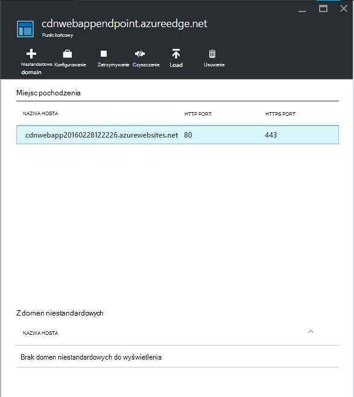

7. Odśwież okno przeglądarki dla aplikacji sieci Azure web. Powinien zostać wyświetlony poprawnie załadować wszystkie skrypty i arkusze stylów.

## <a name="more-information"></a>Więcej informacji 
- [Omówienie sieci Azure dostarczania zawartości (CDN)](../cdn/cdn-overview.md)
- [Za pomocą Azure CDN](../cdn/cdn-create-new-endpoint.md)
- [Integracja usługi w chmurze z Azure CDN](../cdn/cdn-cloud-service-with-cdn.md)
- [Łączenie programu ASP.NET i Minification](http://www.asp.net/mvc/tutorials/mvc-4/bundling-and-minification)

