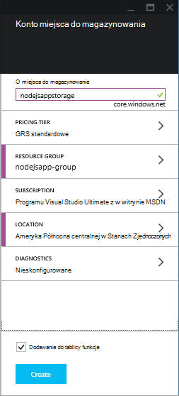
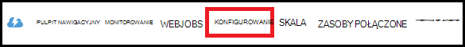
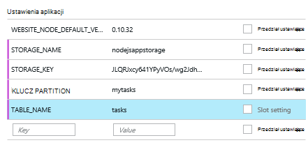

<properties
    pageTitle="Node.js aplikacji sieci web przy użyciu usługi Azure tabeli"
    description="Ten samouczek przedstawiono sposób przechowywania danych z aplikacji Node.js, który znajduje się w aplikacjach sieci Web usługi aplikacji Azure za pomocą usługi Azure tabeli."
    tags="azure-portal"
    services="app-service\web, storage"
    documentationCenter="nodejs"
    authors="rmcmurray"
    manager="wpickett"
    editor=""/>

<tags
    ms.service="storage"
    ms.workload="storage"
    ms.tgt_pltfrm="na"
    ms.devlang="nodejs"
    ms.topic="article"
    ms.date="08/11/2016"
    ms.author="robmcm"/>

# Node.js aplikacji sieci web przy użyciu usługi Azure tabeli

## Omówienie

Ten samouczek pokazano, jak korzystać z usługi tabeli Azure zarządzania danymi do przechowywania i udostępniania danych z aplikacji [węzeł] obsługiwane w aplikacjach sieci Web [Azure aplikacji usługi](http://go.microsoft.com/fwlink/?LinkId=529714) . Tego samouczka przyjęto założenie, że niektóre wcześniejszego doświadczenia w korzystaniu węzeł i [cyfra].

Dowiesz się:

* Jak należy zainstalować moduł węzeł npm (Menedżera pakietów węzeł)

* Jak pracować z usługą Azure tabeli

* Jak używać Azure interfejsu wiersza polecenia do tworzenia aplikacji sieci web.

Wykonując tego samouczka, zostanie utworzona proste, oparte na sieci web aplikacji "listy zadań do wykonania", która umożliwia tworzenia, pobierania i wykonywania zadań. Zadania są przechowywane w usłudze tabeli.

Oto złożonym aplikacji:

![Strona sieci web pustego tasklist][node-table-finished]

>[AZURE.NOTE] Jeśli chcesz rozpocząć pracę z Azure aplikacji usługi przed utworzeniem konta dla konta Azure, przejdź do [Spróbuj aplikacji usługi](http://go.microsoft.com/fwlink/?LinkId=523751), którym natychmiast można utworzyć aplikację sieci web krótkotrwałe starter w aplikacji usługi. Nie kart kredytowych wymagane; nie zobowiązania.

## Wymagania wstępne

Przed zgodnie z instrukcjami zawartymi w tym artykule, upewnij się, że masz zainstalowane następujące elementy:

* [węzeł] wersji 0.10.24 lub nowszym

* [Cyfra]

[AZURE.INCLUDE [create-account-and-websites-note](../../includes/create-account-and-websites-note.md)]

## Tworzenie konta miejsca do magazynowania

Utwórz konto Azure miejsca do magazynowania. Przy użyciu tego konta aplikacji przechowywania elementów do wykonania.

1.  Logowanie do [portalu Azure](https://portal.azure.com/).

2. Kliknij ikonę **Nowy** w lewym dolnym rogu portalu, a następnie kliknij **danych + miejsca do magazynowania** > **miejsca do magazynowania**. Określ unikatową nazwę konta magazynu i tworzenie nowej [grupy zasobów](../azure-resource-manager/resource-group-overview.md) dla niego.

    

    Po utworzeniu konta miejsca do magazynowania przycisk **powiadomienia** zostaną flash zielony **SUKCESU** i karta konta miejsca do magazynowania jest otwarty, aby pokazać, że należy go do nowej grupy zasobów utworzonej.

5. Karta konta miejsca do magazynowania, kliknij **Ustawienia** > **klawiszy**. Kopiowanie klucz podstawowy dostęp do Schowka.

    ![Klawisz dostępu][portal-storage-access-keys]

##Instalowanie moduły i generowanie rusztowania

W tej sekcji możesz utworzyć nową aplikację węzeł i umożliwia dodawanie pakietów moduł npm. Dla tej aplikacji będzie używany moduły [Express] i [Azure] . Moduł Express określa strukturę Model widok kontroler węzeł, gdy Azure moduły zapewnia łączność z usługą tabeli.

### Instalowanie express i generowanie rusztowania

1. W wierszu polecenia utworzenia nowego katalogu o nazwie **tasklist** i Przełącz do tego katalogu.  

2. Wpisz następujące polecenie, aby zainstalować moduł Express.

        npm install express-generator@4.2.0 -g

    W zależności od systemu operacyjnego może być konieczne umieszczenie "sudo" przed poleceniem:

        sudo npm install express-generator@4.2.0 -g

    Wynik jest wyświetlany podobny do następującego przykładu:

        express-generator@4.2.0 /usr/local/lib/node_modules/express-generator
        ├── mkdirp@0.3.5
        └── commander@1.3.2 (keypress@0.1.0)

    > [AZURE.NOTE] "-G" parametr jest instalowana globalnie modułu. Dzięki temu możemy użyć **express** do generowania rusztowania aplikacji sieci web bez konieczności wpisz dodatkowe informacje.

4. Aby utworzyć rusztowania dla aplikacji, wprowadź **express** polecenie:

        express

    Wynik to polecenie jest wyświetlany podobny do następującego przykładu:

           create : .
           create : ./package.json
           create : ./app.js
           create : ./public
           create : ./public/images
           create : ./routes
           create : ./routes/index.js
           create : ./routes/users.js
           create : ./public/stylesheets
           create : ./public/stylesheets/style.css
           create : ./views
           create : ./views/index.jade
           create : ./views/layout.jade
           create : ./views/error.jade
           create : ./public/javascripts
           create : ./bin
           create : ./bin/www

           install dependencies:
             $ cd . && npm install

           run the app:
             $ DEBUG=my-application ./bin/www

    Teraz masz kilka nowych katalogów i plików w katalogu **tasklist** .

### Instalowanie dodatkowych modułów

Jeden z plików tego **express** tworzy jest **package.json**. Ten plik zawiera listę zależności modułu. Później podczas wdrażania aplikacji sieci Web usługi aplikacji tego pliku Określa, które moduły musi być zainstalowany Azure.

W wierszu polecenia wpisz następujące polecenie, aby zainstalować moduł opisany w pliku **package.json** . Konieczne może być "sudo".

    npm install

Wynik to polecenie jest wyświetlany podobny do następującego przykładu:

    debug@0.7.4 node_modules\debug

    cookie-parser@1.0.1 node_modules\cookie-parser
    ├── cookie-signature@1.0.3
    └── cookie@0.1.0

    [...]

Następnie wpisz następujące polecenie, aby zainstalować moduł [azure], [uuid węzeł], [nconf] i [asynchronicznych] :

    npm install azure-storage node-uuid async nconf --save

**— Zapisywanie** Flaga Dodaje wpisy dla tych modułów do pliku **package.json** .

Wynik to polecenie jest wyświetlany podobny do następującego przykładu:

    async@0.9.0 node_modules\async

    node-uuid@1.4.1 node_modules\node-uuid

    nconf@0.6.9 node_modules\nconf
    ├── ini@1.2.1
    ├── async@0.2.9
    └── optimist@0.6.0 (wordwrap@0.0.2, minimist@0.0.10)

    [...]

## Tworzenie aplikacji

Teraz możemy przystąpić do tworzenia aplikacji.

### Tworzenie modelu

*Model* jest obiekt reprezentujący dane w aplikacji. Dla aplikacji tylko model jest obiekt zadania, która reprezentuje element z listy zadań do wykonania. Zadania mają następujące pola:

- PartitionKey
- RowKey
- Nazwa (ciąg)
- Kategoria (ciąg)
- ukończony (wartość logiczna)

**PartitionKey** i **RowKey** są używane przez usługę tabeli jako klucze tabeli. Aby uzyskać więcej informacji zobacz [Opis modelu danych tabeli usługi](https://msdn.microsoft.com/library/azure/dd179338.aspx).

1. W katalogu **tasklist** utworzenia nowego katalogu o nazwie **modeli**.

2. W katalogu **modeli** Utwórz nowy plik o nazwie **task.js**. Ten plik zawiera modelu dla zadań utworzone przez aplikację.

3. Na początku pliku **task.js** , Dodaj następujący kod, aby odwołać bibliotek wymagane:

        var azure = require('azure-storage');
        var uuid = require('node-uuid');
        var entityGen = azure.TableUtilities.entityGenerator;

4. Dodaj następujący kod, aby zdefiniować i eksportowania obiektu zadania. Ten obiekt jest odpowiedzialny za nawiązywanie połączenia z tabeli.

        module.exports = Task;

        function Task(storageClient, tableName, partitionKey) {
          this.storageClient = storageClient;
          this.tableName = tableName;
          this.partitionKey = partitionKey;
          this.storageClient.createTableIfNotExists(tableName, function tableCreated(error) {
            if(error) {
              throw error;
            }
          });
        };

5. Dodaj następujący kod, aby zdefiniować dodatkowe metody obiektu zadania umożliwiające interakcje z danymi przechowywanymi w tabeli:

        Task.prototype = {
          find: function(query, callback) {
            self = this;
            self.storageClient.queryEntities(this.tableName, query, null, function entitiesQueried(error, result) {
              if(error) {
                callback(error);
              } else {
                callback(null, result.entries);
              }
            });
          },

          addItem: function(item, callback) {
            self = this;
            // use entityGenerator to set types
            // NOTE: RowKey must be a string type, even though
            // it contains a GUID in this example.
            var itemDescriptor = {
              PartitionKey: entityGen.String(self.partitionKey),
              RowKey: entityGen.String(uuid()),
              name: entityGen.String(item.name),
              category: entityGen.String(item.category),
              completed: entityGen.Boolean(false)
            };
            self.storageClient.insertEntity(self.tableName, itemDescriptor, function entityInserted(error) {
              if(error){  
                callback(error);
              }
              callback(null);
            });
          },

          updateItem: function(rKey, callback) {
            self = this;
            self.storageClient.retrieveEntity(self.tableName, self.partitionKey, rKey, function entityQueried(error, entity) {
              if(error) {
                callback(error);
              }
              entity.completed._ = true;
              self.storageClient.updateEntity(self.tableName, entity, function entityUpdated(error) {
                if(error) {
                  callback(error);
                }
                callback(null);
              });
            });
          }
        }

6. Zapisz i zamknij plik **task.js** .

### Utworzyć kontroler

*Kontroler* obsługuje żądania HTTP i są renderowane za pomocą odpowiedzi HTML.

1. W katalogu **tasklist/przekierowuje** utworzenie nowego pliku o nazwie **tasklist.js** , a następnie otwórz go w edytorze tekstów.

2. Dodaj następujący kod do **tasklist.js**. Ładuje to moduły azure i asynchroniczne, które są używane przez **tasklist.js**. Definiuje również funkcji **TaskList** , który jest przekazywany wystąpienia obiektu **zadania** , możemy wcześniej zdefiniowanych przez:

        var azure = require('azure-storage');
        var async = require('async');

        module.exports = TaskList;

3. Definiowanie obiektu **TaskList** .

        function TaskList(task) {
          this.task = task;
        }

4. Dodać **TaskList**następujących metod:

        TaskList.prototype = {
          showTasks: function(req, res) {
            self = this;
            var query = new azure.TableQuery()
              .where('completed eq ?', false);
            self.task.find(query, function itemsFound(error, items) {
              res.render('index',{title: 'My ToDo List ', tasks: items});
            });
          },

          addTask: function(req,res) {
            var self = this;
            var item = req.body.item;
            self.task.addItem(item, function itemAdded(error) {
              if(error) {
                throw error;
              }
              res.redirect('/');
            });
          },

          completeTask: function(req,res) {
            var self = this;
            var completedTasks = Object.keys(req.body);
            async.forEach(completedTasks, function taskIterator(completedTask, callback) {
              self.task.updateItem(completedTask, function itemsUpdated(error) {
                if(error){
                  callback(error);
                } else {
                  callback(null);
                }
              });
            }, function goHome(error){
              if(error) {
                throw error;
              } else {
               res.redirect('/');
              }
            });
          }
        }

### Modyfikowanie app.js

1. Z poziomu katalogu **tasklist** Otwórz plik **app.js** . Ten plik został utworzony wcześniej po uruchomieniu polecenia **express** .

2. Na początku pliku, Dodaj poniższe czynności, aby załadować modułu azure, ustawić nazwę tabeli, klucz partycją i Ustawianie poświadczeń miejsca do magazynowania, używane przez w tym przykładzie:

        var azure = require('azure-storage');
        var nconf = require('nconf');
        nconf.env()
             .file({ file: 'config.json', search: true });
        var tableName = nconf.get("TABLE_NAME");
        var partitionKey = nconf.get("PARTITION_KEY");
        var accountName = nconf.get("STORAGE_NAME");
        var accountKey = nconf.get("STORAGE_KEY");

    > [AZURE.NOTE] nconf pobierze wartości konfiguracji środowiska zmienne lub pliku **config.json** , który zostanie utworzony później.

3. W pliku app.js przewiń w dół do miejsce, w którym zostanie wyświetlony następujący wiersz:

        app.use('/', routes);
        app.use('/users', users);

    Zamień powyżej wierszy kodu, jak pokazano poniżej. Spowoduje to zainicjować wystąpienie <strong>zadania</strong> za pomocą połączenia z kontem miejsca do magazynowania. To jest przekazywany do <strong>TaskList</strong>, które będą z niej korzystać można komunikować się z usługą tabeli:

        var TaskList = require('./routes/tasklist');
        var Task = require('./models/task');
        var task = new Task(azure.createTableService(accountName, accountKey), tableName, partitionKey);
        var taskList = new TaskList(task);

        app.get('/', taskList.showTasks.bind(taskList));
        app.post('/addtask', taskList.addTask.bind(taskList));
        app.post('/completetask', taskList.completeTask.bind(taskList));

4. Zapisz plik **app.js** .

### Modyfikowanie widoku indeksu

1. Otwórz plik **tasklist/views/index.jade** w edytorze tekstów.

2. Zamień całą zawartość plik poniższy kod. Definiuje widoku, który jest wyświetlany istniejących zadań i zawiera formularz do dodawania nowych zadań i oznaczanie istniejących jako wykonane.

        extends layout

        block content
          h1= title
          br

          form(action="/completetask", method="post")
            table.table.table-striped.table-bordered
              tr
                td Name
                td Category
                td Date
                td Complete
              if (typeof tasks === "undefined")
                tr
                  td
              else
                each task in tasks
                  tr
                    td #{task.name._}
                    td #{task.category._}
                    - var day   = task.Timestamp._.getDate();
                    - var month = task.Timestamp._.getMonth() + 1;
                    - var year  = task.Timestamp._.getFullYear();
                    td #{month + "/" + day + "/" + year}
                    td
                      input(type="checkbox", name="#{task.RowKey._}", value="#{!task.completed._}", checked=task.completed._)
            button.btn(type="submit") Update tasks
          hr
          form.well(action="/addtask", method="post")
            label Item Name:
            input(name="item[name]", type="textbox")
            label Item Category:
            input(name="item[category]", type="textbox")
            br
            button.btn(type="submit") Add item

3. Zapisz i zamknij plik **index.jade** .

### Modyfikowanie układu globalnego

Plik **layout.jade** w katalogu **Widoki** jest szablonu globalnego, aby inne pliki **.jade** . W tym kroku należy zmodyfikować go do używania [Serwisu Twitter początkowego](https://github.com/twbs/bootstrap), która jest zestaw narzędzi, który ułatwia projektowanie i wyglądających aplikacji sieci web.

Pobierz i Wyodrębnij pliki do [Serwisu Twitter początkowego](http://getbootstrap.com/). Skopiuj plik **bootstrap.min.css** z folderu uruchamiania **css** do katalogu **publicznego i arkusze stylów** w aplikacji.

W folderze **Widoki** otworzyć **layout.jade** i zamienić całą zawartość z następujących czynności:

    doctype html
    html
      head
        title= title
        link(rel='stylesheet', href='/stylesheets/bootstrap.min.css')
        link(rel='stylesheet', href='/stylesheets/style.css')
      body.app
        nav.navbar.navbar-default
          div.navbar-header
          a.navbar-brand(href='/') My Tasks
        block content

### Tworzenie pliku konfiguracji

Aby uruchomić aplikację lokalnie, firma Microsoft przykleić Azure magazynu poświadczeń w pliku konfiguracji. Utwórz plik o nazwie * *config.json* *z JSON następujące czynności:

    {
        "STORAGE_NAME": "<storage account name>",
        "STORAGE_KEY": "<storage access key>",
        "PARTITION_KEY": "mytasks",
        "TABLE_NAME": "tasks"
    }

Zamień **nazwę konta magazynu** nazwę konta magazynu utworzony wcześniej i zamienić **klawisz dostępu miejsca do magazynowania** klucz podstawowy dostępu do konta miejsca do magazynowania. Na przykład:

    {
        "STORAGE_NAME": "nodejsappstorage",
        "STORAGE_KEY": "KG0oDd..."
        "PARTITION_KEY": "mytasks",
        "TABLE_NAME": "tasks"
    }

Zapisz ten plik *jeden katalogu poziom wyżej* niż katalogu **tasklist** w następujący sposób:

    parent/
      |-- config.json
      |-- tasklist/

Powód w ten sposób jest unikanie sprawdzanie pliku konfiguracji w formancie źródła miejsce, w którym mogą być publiczna. Gdy firma Microsoft wdrożyć aplikację Azure, użyjemy zmienne środowiska zamiast pliku konfiguracji.

## Uruchom aplikację lokalnie

Aby przetestować aplikacji na komputerze lokalnym, należy wykonać następujące czynności:

1. W wierszu polecenia Zmień katalog do katalogu **tasklist** .

2. Użyj następującego polecenia, aby uruchomić aplikację lokalnie:

        npm start

3. Otwórz przeglądarkę sieci web i przejdź do http://127.0.0.1:3000.

    Zostanie wyświetlona strona sieci web podobny do następującego przykładu.

    ![Wyświetlanie pustego tasklist strony sieci Web][node-table-finished]

4. Aby utworzyć nowy element do wykonania, wprowadź nazwę i kategorii, a następnie kliknij przycisk **Dodaj element**. 

6. Aby oznaczyć zadanie jako wykonane, sprawdź **Wykonano** , a następnie kliknij przycisk **Aktualizuj zadania**.

    ![Obraz nowego elementu na liście zadań][node-table-list-items]

Mimo że aplikacja działa lokalnie, jest przechowywana w usłudze Azure tabeli danych.

## Wdrażanie aplikacji Azure

Czynności opisane w tej sekcji umożliwia utworzenie nowej aplikacji sieci web w aplikacji usługi Azure narzędzi wiersza polecenia, a następnie użyj cyfra wdrażania aplikacji. Aby wykonać poniższe czynności należy Azure subskrypcji.

> [AZURE.NOTE] Poniższe czynności, można również przeprowadzić przy użyciu [Azure Portal](https://portal.azure.com/). Zobacz [Tworzenie i wdrażanie aplikacji sieci web Node.js w usłudze Azure aplikacji].
>
> Jeśli jest to pierwszy aplikacji sieci web utworzony Azure Portal należy użyć do wdrożenia tej aplikacji.

Aby rozpocząć pracę, zainstaluj [Azure interfejsu wiersza polecenia] , wpisując następujące polecenie w wierszu polecenia:

    npm install azure-cli -g

### Importuj ustawienia publikowania

W tym kroku pobierze plik zawierający informacje o Twojej subskrypcji.

1. Wpisz następujące polecenie:

        azure account download

    To polecenie uruchamia przeglądarki i powoduje przejście do strony pobierania. Jeśli zostanie wyświetlony monit, zaloguj się przy użyciu konta skojarzonego z subskrypcją usługi Azure.

    <!-- ![The download page][download-publishing-settings] -->

    Pobieranie pliku rozpoczyna się automatycznie; Nie, po kliknięciu łącza na początku strony, aby ręcznie pobrać plik. Zapisz plik i Zanotuj ścieżkę pliku.

2. Wpisz następujące polecenie, aby zaimportować ustawienia:

        azure account import <path-to-file>

    Określ ścieżkę i nazwę pliku ustawień publikowania, pobranego w poprzednim kroku.

3. Po zaimportowaniu ustawienia, usuń plik ustawień publikowania. Nie jest już potrzebna, a zawiera ważne informacje dotyczące subskrypcji usługi Azure.

### Tworzenie aplikacji sieci web programu aplikacji usługi

1. W wierszu polecenia Zmień katalog do katalogu **tasklist** .

2. Użyj następującego polecenia w celu utworzenia nowej aplikacji sieci web.

        azure site create --git

    Pojawi się monit dla nazwy aplikacji sieci web i lokalizacji. Podaj unikatową nazwę i wybierz tej samej lokalizacji geograficznej jako konto Azure miejsca do magazynowania.

    `--git` Parametr tworzy repozytorium cyfra Azure dla tej aplikacji sieci web. Inicjuje również repozytorium cyfra w bieżącym katalogu, jeśli nie istnieje, a dodaje [cyfra zdalnego] o nazwie "azure", która służy do publikowania aplikacji Azure. Na koniec tworzy plik **web.config** , który zawiera ustawienia używane przez Azure do obsługi aplikacji węzeł. W przypadku pominięcia `--git` parametr, ale katalogu zawiera repozytorium cyfra, polecenie nadal utworzy azure zdalnym.

    Po ukończeniu tego polecenia zostaną wyświetlone informacje podobne do następujących. Zauważ, że na początku wiersza z **witryną sieci Web utworzona w** zawiera adres URL aplikacji sieci web.

        info:   Executing command site create
        help:   Need a site name
        Name: TableTasklist
        info:   Using location southcentraluswebspace
        info:   Executing `git init`
        info:   Creating default .gitignore file
        info:   Creating a new web site
        info:   Created web site at  tabletasklist.azurewebsites.net
        info:   Initializing repository
        info:   Repository initialized
        info:   Executing `git remote add azure https://username@tabletasklist.azurewebsites.net/TableTasklist.git`
        info:   site create command OK

    > [AZURE.NOTE] Jeśli jest to pierwszy aplikacji web app dla aplikacji usługi dla subskrypcji, pojawi się instrukcja Azure Portal umożliwia tworzenie aplikacji sieci web. Aby uzyskać więcej informacji zobacz [Tworzenie i wdrażanie aplikacji sieci web Node.js w usłudze Azure aplikacji].

### Konfigurowanie środowiska zmienne

W tym kroku dodasz zmienne środowiska Azure konfiguracji aplikacji sieci web.
W wierszu polecenia wpisz następujące wyrażenie:

    azure site appsetting add
        STORAGE_NAME=<storage account name>;STORAGE_KEY=<storage access key>;PARTITION_KEY=mytasks;TABLE_NAME=tasks

Zamienianie **<storage account name>** o nazwie magazynu kont utworzonego wcześniej i zamienić **<storage access key>** klucz podstawowy dostęp dla Twojego konta miejsca do magazynowania. (Użyj tych samych wartości jako plik config.json, który został utworzony wcześniej).

Ponadto można ustawić zmienne środowiska w [Azure Portal](https://portal.azure.com/):

1.  Otwórz karta aplikacji sieci web, klikając przycisk **Przeglądaj** > **Aplikacje sieci Web** > nazwy aplikacji sieci web.

1.  Karta aplikacji sieci web kliknij **Wszystkie ustawienia** > **Ustawienia aplikacji**.

    <!--  -->

1.  Przewiń w dół do sekcji **Ustawienia aplikacji** i dodawanie par klucz wartość.

    

1. Kliknij przycisk **ZAPISZ**.

### Publikowanie aplikacji

Aby opublikować aplikację, przekaż pliki kodu do cyfra, a następnie przekazać do azure wzorca.

1. Ustaw poświadczenia wdrożenia.

        azure site deployment user set <name> <password>

2. Dodawanie i zatwierdź plików aplikacji.

        git add .
        git commit -m "adding files"

3. Powiadomienia push zatwierdzenie do aplikacji usługi aplikacji sieci web:

        git push azure master

    Używanie **wzorca** jako gałąź docelowej. Na końcu wdrażania pojawi się instrukcja podobny do następującego przykładu:

        To https://username@tabletasklist.azurewebsites.net/TableTasklist.git
         * [new branch]      master -> master

4. Po zakończeniu operacji push, przejdź do adresu URL aplikacji sieci web, które zostały wcześniej zwracane przez `azure create site` polecenie, aby wyświetlić aplikacji.

## Następne kroki

Gdy czynności opisane w tym artykule opisano, przy użyciu usługi tabeli do przechowywania informacji, możesz również używać [MongoDB](https://mlab.com/azure/). 

## Dodatkowe zasoby

[Polecenie Azure]

## Informacje o zmianach
* Przewodnika do zmiany z witryn sieci Web do usługi aplikacji Zobacz: [Usługa Azure aplikacji i jego wpływ na istniejące usługi Azure](http://go.microsoft.com/fwlink/?LinkId=529714)

<!-- URLs -->

[Tworzenie i wdrażanie aplikacji sieci web Node.js Azure aplikacji usługi]: web-sites-nodejs-develop-deploy-mac.md
[Azure Developer Center]: /develop/nodejs/

[węzeł]: http://nodejs.org
[Cyfra]: http://git-scm.com
[Express]: http://expressjs.com
[for free]: http://windowsazure.com
[Cyfra zdalnych]: http://git-scm.com/docs/git-remote

[Polecenie Azure]: ../xplat-cli-install.md

[Azure]: https://github.com/Azure/azure-sdk-for-node
[węzeł uuid]: https://www.npmjs.com/package/node-uuid
[nconf]: https://www.npmjs.com/package/nconf
[asynchroniczna]: https://www.npmjs.com/package/async

[Azure Portal]: https://portal.azure.com

[Create and deploy a Node.js application to an Azure Web Site]: web-sites-nodejs-develop-deploy-mac.md
 
<!-- Image References -->

[node-table-finished]: ./media/storage-nodejs-use-table-storage-web-site/table_todo_empty.png
[node-table-list-items]: ./media/storage-nodejs-use-table-storage-web-site/table_todo_list.png
[download-publishing-settings]: ./media/storage-nodejs-use-table-storage-web-site/azure-account-download-cli.png
[portal-new]: ./media/storage-nodejs-use-table-storage-web-site/plus-new.png
[portal-storage-account]: ./media/storage-nodejs-use-table-storage-web-site/new-storage.png
[portal-quick-create-storage]: ./media/storage-nodejs-use-table-storage-web-site/quick-storage.png
[portal-storage-access-keys]: ./media/storage-nodejs-use-table-storage-web-site/manage-access-keys.png
[go-to-dashboard]: ./media/storage-nodejs-use-table-storage-web-site/go_to_dashboard.png
[web-configure]: ./media/storage-nodejs-use-table-storage-web-site/sql-task-configure.png
[app-settings-save]: ./media/storage-nodejs-use-table-storage-web-site/savebutton.png
[app-settings]: ./media/storage-nodejs-use-table-storage-web-site/storage-tasks-appsettings.png
