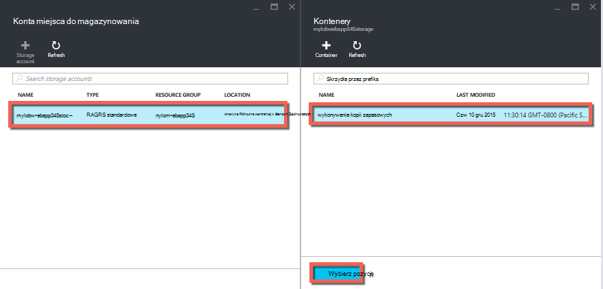

<properties 
    pageTitle="Wykonywanie kopii zapasowej aplikacji platformy Azure" 
    description="Dowiedz się, jak tworzyć kopie zapasowe aplikacji w usłudze Azure aplikacji." 
    services="app-service" 
    documentationCenter="" 
    authors="cephalin" 
    manager="wpickett" 
    editor="jimbe"/>

<tags 
    ms.service="app-service" 
    ms.workload="na" 
    ms.tgt_pltfrm="na" 
    ms.devlang="na" 
    ms.topic="article" 
    ms.date="07/06/2016" 
    ms.author="cephalin"/>

# Wykonywanie kopii zapasowej aplikacji platformy Azure

Funkcja Kopia zapasowa i przywracanie w [Usłudze Azure aplikacji](../app-service/app-service-value-prop-what-is.md) pozwala łatwo tworzyć kopie zapasowe aplikacji ręcznie lub automatycznie. Możesz przywrócić aplikacji do poprzedniego stanu lub utworzenia nowej aplikacji na podstawie jednej z aplikacji oryginalnej kopii zapasowych. 

Aby uzyskać informacje na temat przywracania aplikacji z kopii zapasowej zobacz [Przywracanie aplikacji platformy Azure](web-sites-restore.md).

## Co to jest kopii zapasowej 
Usługa aplikacji może wykonywać kopie zapasowe następujące informacje:

* Konfiguracja aplikacji
* Zawartość pliku
* Bazy danych programu SQL Azure ani bazy danych MySQL Azure (ClearDB) połączony z aplikacji (które z nich do uwzględnienia w kopii zapasowej można wybrać)

Te informacje kopii zapasowej konta magazynu platformy Azure i kontener, w którym możesz określić. 

> [AZURE.NOTE] Każda kopia zapasowa jest wykonano kopię offline aplikacji, nie przyrostowe aktualizacji.

## Wymagania i ograniczenia

* Funkcja Kopia zapasowa i przywracanie wymaga plan usług aplikacji w warstwie **Standardowy** lub nowszym. Aby uzyskać więcej informacji na temat skalowania planu usług aplikacji, aby użyć wyższego poziomu zobacz [rozbudowy aplikacji platformy Azure](web-sites-scale.md). Należy zauważyć, że warstwa **Premium** umożliwia większą liczbę codzienną niż **Standardowy** warstwy.
* Potrzebujesz konto Azure miejsca do magazynowania i kontener w tej samej subskrypcji jako aplikację, którą chcesz zarchiwizować. Aby uzyskać więcej informacji na kontach Azure miejsca do magazynowania zobacz [łącza](#moreaboutstorage) na końcu tego artykułu.
* Wykonywanie kopii zapasowych może być do 10GB aplikacji i bazy danych zawartości. Jeśli rozmiar kopii zapasowej przekracza ten limit zostanie wyświetlony komunikat o błędzie. 

## Ręcznie utworzyć kopię zapasową

2. W [Azure Portal](https://portal.azure.com)przejdź do swojej aplikacji karta wybierz pozycję **Ustawienia**, a następnie **kopie zapasowe**. Zostanie wyświetlona karta **kopie zapasowe** .
    
    ![Strona wykonywania kopii zapasowych][ChooseBackupsPage]

    >[AZURE.NOTE]Jeśli zostanie wyświetlony poniższy komunikat, kliknij go, aby uaktualnić swój plan usługi aplikacji przed przejściem z kopii zapasowych.
Aby uzyskać więcej informacji, zobacz [rozbudowy aplikacji platformy Azure](web-sites-scale.md) .  
    >

3. Karta **kopie zapasowe** kliknij **miejsca do magazynowania: nie skonfigurowano** Aby skonfigurować konto miejsca do magazynowania.

    ![Wybierz konto miejsca do magazynowania][ChooseStorageAccount]
    
4. Wybierz miejsce docelowe kopii zapasowej, wybierając **Konto miejsca do magazynowania** i **kontener**. Konto miejsca do magazynowania musi należeć do tej samej subskrypcji jako aplikację, którą chcesz utworzyć kopię zapasową. Jeśli chcesz, możesz utworzyć nowe konto miejsca do magazynowania lub nowego kontenera w odpowiedniej karty. Gdy skończysz, kliknij przycisk **Wybierz**.
    
    
    
5. W kartę **Konfigurowanie ustawień kopii zapasowej** , która nadal pozostanie otwarty kliknij pozycję **Ustawienia bazy danych**, zaznacz bazy danych, które chcesz uwzględnić w kopii zapasowych (baza danych SQL lub MySQL), a następnie kliknij **przycisk OK**.  

    

    > [AZURE.NOTE]  Dla bazy danych są wyświetlane na liście jej parametrów połączenia, musi istnieć w sekcji **Parametry połączenia** karta **Ustawienia aplikacji** dla aplikacji.

6. W karta **Konfigurowanie ustawień kopii zapasowej** kliknij przycisk **Zapisz**.  

7. Na pasku poleceń karta **kopie zapasowe** kliknij pozycję **Kopia zapasowa teraz**.
    
    ![Przycisk BackUpNow][BackUpNow]
    
    Podczas wykonywania kopii zapasowej, zostanie wyświetlony komunikat postępu.

Po skonfigurowaniu konta miejsca do magazynowania i kontener kopii zapasowych umożliwia ręczne kopii zapasowej w dowolnym momencie.  

## Konfigurowanie automatycznego wykonywania kopii zapasowych

1. Karta **kopie zapasowe** kliknij **harmonogramu: nie skonfigurowano**. 

    
    
1. Na karta **Ustawienia kopii zapasowych harmonogram** ustawiono **Zaplanowane kopii zapasowej** **na**, a następnie skonfigurować harmonogram wykonywania kopii zapasowych w razie potrzeby, a następnie kliknij **przycisk OK**.
    
    ![Włączanie automatycznego wykonywania kopii zapasowych][SetAutomatedBackupOn]
    
4. Kartę **Konfigurowanie ustawień kopii zapasowej** , która nadal pozostanie otwarty kliknij pozycję **Ustawienia miejsca do magazynowania**, a następnie wybierz miejsce docelowe kopii zapasowej, wybierając **Konto miejsca do magazynowania** i **kontener**. Konto miejsca do magazynowania musi należeć do tej samej subskrypcji jako aplikację, którą chcesz utworzyć kopię zapasową. Jeśli chcesz, możesz utworzyć nowe konto miejsca do magazynowania lub nowego kontenera w odpowiedniej karty. Gdy skończysz, kliknij przycisk **Wybierz**.
    
    
    
5. W karta **Konfigurowanie ustawień kopii zapasowej** kliknij pozycję **Ustawienia bazy danych**, zaznacz bazy danych, które chcesz uwzględnić w kopii zapasowych (baza danych SQL lub MySQL), a następnie kliknij **przycisk OK**.  

    

    > [AZURE.NOTE]  Dla bazy danych są wyświetlane na liście jej parametrów połączenia, musi istnieć w sekcji **Parametry połączenia** karta **Ustawienia aplikacji** dla aplikacji.

6. W karta **Konfigurowanie ustawień kopii zapasowej** kliknij przycisk **Zapisz**.  

## Kopii zapasowej tylko część aplikacji

Czasami nie chcesz utworzyć kopię zapasową, wszystkie elementy na aplikacji. Oto kilka przykładów:

-   Możesz [skonfigurować tygodniowy kopie zapasowe](web-sites-backup.md#configure-automated-backups) aplikacji zawierający zawartość statyczną, która nigdy nie zmiany, takie jak starych wpisów w blogu lub obrazy.
-   Aplikacji ma ponad 10GB zawartość (kwoty maksymalnej, które można utworzyć kopię zapasową w czasie).
-   Nie chcesz, aby wykonywać kopie zapasowe plików dziennika.

Częściowe kopie zapasowe pozwoli wybiera dokładnie pliki, których chcesz utworzyć kopię zapasową.

### Wykluczanie plików z kopii zapasowej

Aby wykluczyć plików i folderów z kopii zapasowych, należy utworzyć `_backup.filter` plików w folderze D:\home\site\wwwroot aplikacji i określ listę plików i folderów, które chcesz wykluczyć w niego. Łatwy sposób na dostęp do tej jest za pomocą [Konsoli Kudu](https://github.com/projectkudu/kudu/wiki/Kudu-console). 

Załóżmy, że masz aplikację, która zawiera pliki dziennika i obrazów statycznych z poprzednich lat, które nie mają zmienić. Masz już pełnej kopii zapasowej aplikację, która zawiera stare obrazów. Teraz chcesz utworzyć kopię zapasową aplikacji codziennie, ale nie chcesz zapłacić do przechowywania plików dziennika lub pliki statycznego obrazu, które nigdy nie zmieniają się.

![Folderu dzienników][LogsFolder]
![obrazów folderu][ImagesFolder]
    
Kroki Pokaż, jak chcesz wykluczyć te pliki z kopii zapasowej.

1. Przejdź do pozycji `http://{yourapp}.scm.azurewebsites.net/DebugConsole` i określ foldery, które chcesz wykluczyć z kopii zapasowych. W tym przykładzie czy chcesz wykluczyć następujące pliki i foldery, w tym interfejsu użytkownika:

        D:\home\site\wwwroot\Logs
        D:\home\LogFiles
        D:\home\site\wwwroot\Images\2013
        D:\home\site\wwwroot\Images\2014
        D:\home\site\wwwroot\Images\brand.png

    [AZURE.NOTE] Ostatni wiersz pokazano, że można wykluczyć pliki osób, a także foldery.

2. Tworzenie pliku o nazwie `_backup.filter` i powyżej liście należy umieścić w pliku, ale usuwać `D:\home`. Katalog listy jedną lub pliku w wierszu. Dlatego należy zawartości pliku:

    \site\wwwroot\Logs \LogFiles \site\wwwroot\Images\2013 \site\wwwroot\Images\2014 \site\wwwroot\Images\brand.PNG

3. Przekazać tego pliku do `D:\home\site\wwwroot\` katalogu witryny za pomocą [ftp](web-sites-deploy.md#ftp) lub innej metody. Jeśli chcesz, możesz utworzyć plik bezpośrednio w `http://{yourapp}.scm.azurewebsites.net/DebugConsole` i wstawić zawartość.

4. Uruchom kopie zapasowe taki sam sposób, zwykle należy go, [ręcznie](#create-a-manual-backup) lub [automatycznie](#configure-automated-backups).

Teraz, wszystkie pliki i foldery, które są określane w `_backup.filter` będą wykluczone z kopii zapasowej. W tym przykładzie pliki dziennika i pliki obrazów 2013 i 2014 będzie już kopię zapasową, a także brand.png.

>[AZURE.NOTE] Przywracanie częściowe kopie zapasowe witryny tak samo jak [Przywracanie regularne tworzenie kopii zapasowych](web-sites-restore.md). Proces przywracania wykona co.
>
>Po przywróceniu pełną kopię zapasową całej zawartości w witrynie są zastępowane ze względu na w kopii zapasowej. Jeśli plik znajduje się w witrynie, ale nie w kopii zapasowej otrzymuje usunięte. Ale po przywróceniu częściowej kopii zapasowej dowolną zawartość, która znajduje się w jednym z katalogów zabronione lub dowolny plik zabronione pozostanie niezmieniona.

## Sposób przechowywania kopii zapasowych

Po wprowadzeniu jednego lub więcej kopii zapasowych dla aplikacji, kopie zapasowe będą widoczne na karta **kontenerów** konta miejsca do magazynowania, a także aplikacji. W oknie konta miejsca do magazynowania każdej kopii zapasowej składa się z pliku zip, który zawiera dane kopii zapasowej, a plik XML, który zawiera manifest zawartości pliku zip. Można Rozpakuj plik i przeglądać te pliki, jeśli chcesz uzyskać dostęp do kopii zapasowych bez rzeczywistego wykonywania przywracania aplikacji.

Kopia zapasowa bazy danych dla aplikacji jest przechowywany w katalogu głównym pliku zip. W bazie danych SQL to jest plik PLECAK (bez rozszerzenia pliku) i można zaimportować. Aby utworzyć nową bazę danych SQL opartą na eksportowanie PLECAK, zobacz [Importowanie pliku PLECAK do utworzenia nowej bazy danych użytkownika](http://technet.microsoft.com/library/hh710052.aspx).

> [AZURE.WARNING] Zmienianie plików w kontenerze usługi **websitebackups** mogą powodować stają się nieprawidłowe i dlatego nie-umożliwiająca przywrócenie kopia zapasowa.

## Następne kroki
Aby uzyskać informacje na temat przywracania aplikacji z kopii zapasowej zobacz [Przywracanie aplikacji platformy Azure](web-sites-restore.md). Można również kopia zapasowa i przywracanie aplikacji usługi aplikacji za pomocą interfejsu API usługi REST (zobacz [Pozostałych Użyj tworzenia kopii zapasowych i przywracanie aplikacji usługi aplikacji](websites-csm-backup.md)).

>[AZURE.NOTE] Jeśli chcesz rozpocząć pracę z Azure aplikacji usługi przed utworzeniem konta dla konta Azure, przejdź do [Spróbuj aplikacji usługi](http://go.microsoft.com/fwlink/?LinkId=523751), którym natychmiast można utworzyć aplikację sieci web krótkotrwałe starter w aplikacji usługi. Nie kart kredytowych wymagane; nie zobowiązania.

<!-- IMAGES -->
[ChooseBackupsPage]: ./media/web-sites-backup/01ChooseBackupsPage.png
[ChooseStorageAccount]: ./media/web-sites-backup/02ChooseStorageAccount.png
[IncludedDatabases]: ./media/web-sites-backup/03IncludedDatabases.png
[BackUpNow]: ./media/web-sites-backup/04BackUpNow.png
[BackupProgress]: ./media/web-sites-backup/05BackupProgress.png
[SetAutomatedBackupOn]: ./media/web-sites-backup/06SetAutomatedBackupOn.png
[Frequency]: ./media/web-sites-backup/07Frequency.png
[StartDate]: ./media/web-sites-backup/08StartDate.png
[StartTime]: ./media/web-sites-backup/09StartTime.png
[SaveIcon]: ./media/web-sites-backup/10SaveIcon.png
[ImagesFolder]: ./media/web-sites-backup/11Images.png
[LogsFolder]: ./media/web-sites-backup/12Logs.png
[GhostUpgradeWarning]: ./media/web-sites-backup/13GhostUpgradeWarning.png
 
