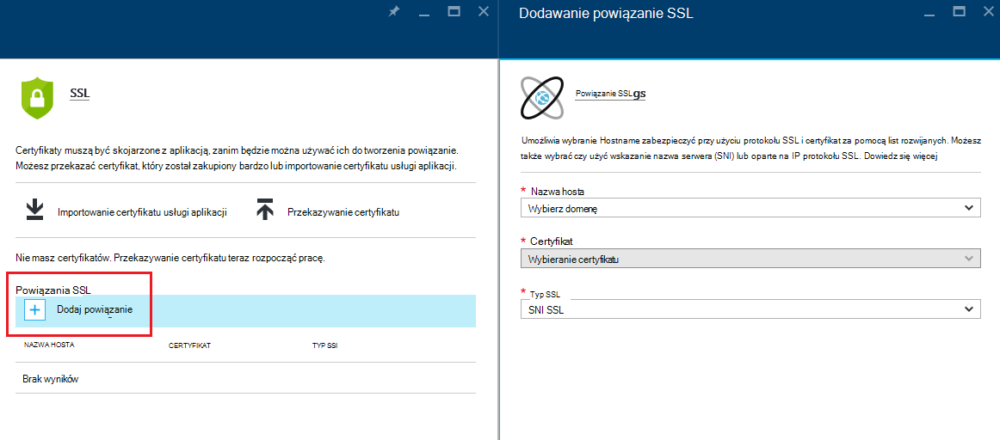
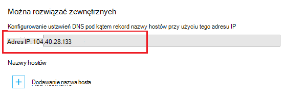
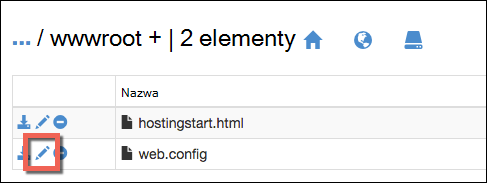

<properties
    pageTitle="Bezpieczne domeny niestandardowej aplikacji sieci przy użyciu protokołu HTTPS | Microsoft Azure"
    description="Dowiedz się, jak bezpieczne niestandardowej nazwy domeny dla aplikacji w usłudze Azure aplikacji przez skonfigurowanie powiązanie certyfikat SSL. Będzie również sposób uzyskiwania certyfikatu SSL z wielu narzędzi."
    services="app-service"
    documentationCenter=".net"
    authors="cephalin"
    manager="wpickett"
    editor="jimbe"
    tags="top-support-issue"/>

<tags
    ms.service="app-service"
    ms.workload="na"
    ms.tgt_pltfrm="na"
    ms.devlang="na"
    ms.topic="article"
    ms.date="08/08/2016"
    ms.author="cephalin"/>

# Bezpieczne domeny niestandardowej aplikacji sieci przy użyciu protokołu HTTPS

> [AZURE.SELECTOR]
- [Zakup certyfikatu SSL platformy Azure](web-sites-purchase-ssl-web-site.md)
- [Używanie certyfikatu SSL z innego miejsca](web-sites-configure-ssl-certificate.md)

W tym artykule pokazano, jak włączyć HTTPS dla aplikacji sieci web, wewnętrznej bazie danych aplikacji dla urządzeń przenośnych lub aplikacji interfejsu API w [Usłudze Azure aplikacji](../app-service/app-service-value-prop-what-is.md) , która używa niestandardowej nazwy domeny. Obejmuje tylko do serwera uwierzytelniania. Jeśli potrzebujesz wzajemnego uwierzytelniania (w tym uwierzytelnianie klienta), zobacz [Jak do skonfigurowania TLS wzajemnego uwierzytelniania dla aplikacji usługi](app-service-web-configure-tls-mutual-auth.md).

Aby zabezpieczyć przy użyciu protokołu HTTPS aplikację, która ma niestandardowej nazwy domeny, możesz dodać certyfikat dla tej nazwy domeny. Domyślnie zabezpiecza Azure ** \*. azurewebsites.net** domeny symboli z jednym certyfikat SSL, więc klientów już dostęp do aplikacji w * *https://*&lt;argumentu >*. azurewebsites.net**. Ale jeśli chcesz używać domeny niestandardowej, na przykład **www.contoso.com contoso.com**; ****, i ** \*. contoso.com**, domyślny certyfikat nie można zabezpieczyć który. Ponadto podobnie jak wszystkie [Certyfikaty symbol wieloznaczny](https://casecurity.org/2014/02/26/pros-and-cons-of-single-domain-multi-domain-and-wildcard-certificates/)domyślny certyfikat nie jest bezpieczny przy użyciu domeny niestandardowej i certyfikat dla tej domeny niestandardowej.   

>[AZURE.NOTE] Możesz ją uzyskać od ekspertów Azure w dowolnym momencie na [forach Azure](https://azure.microsoft.com/support/forums/). Bardziej spersonalizowanej pomoc techniczną przejdź do [Obsługi Azure](https://azure.microsoft.com/support/options/) , a następnie kliknij przycisk **Uzyskiwanie pomocy technicznej**.

## Co jest potrzebne
Aby zabezpieczyć niestandardowej nazwy domeny przy użyciu protokołu HTTPS, niestandardowe certyfikat SSL powiązać tej domeny niestandardowej w Azure. Przed wiązanie certyfikatu niestandardowych, należy wykonać następujące czynności:

- **Konfigurowanie domeny niestandardowej** - aplikacji usługi tylko umożliwia dodawanie certyfikatu dla nazwy domeny, która jest już skonfigurowana w aplikacji. Aby uzyskać instrukcje zobacz [Mapowanie niestandardowej nazwy domeny do Azure aplikacji](web-sites-custom-domain-name.md). 
- **Rozbudowy do poziomu podstawowe lub nowszy** Plany aplikacji usługi w dolnym cennik poziomów nie obsługują niestandardowe certyfikatów SSL. Aby uzyskać instrukcje zobacz [rozbudowy aplikacji platformy Azure](web-sites-scale.md). 
- **Uzyskaj certyfikat SSL** — Jeśli nie masz już jeden, musisz uzyskać jedną z zaufanego [urzędu certyfikacji](http://en.wikipedia.org/wiki/Certificate_authority) (CA). Certyfikat musi spełniać następujące wymagania:

    - Jest on podpisany przez zaufany urząd certyfikacji (nie prywatne serwery CA).
    - Zawiera klucz prywatny.
    - Jest tworzony dla wymiany kluczy i eksportowane do. Plik PFX.
    - Używa co najmniej 2048-bitowy szyfrowania.
    - Jego nazwa odpowiada domeny niestandardowej, potrzebną do zabezpieczenia. Aby zabezpieczyć wiele domen z jednego certyfikatu, należy użyć nazwy symboli (np. ** \*. contoso.com**) lub określ wartości subjectAltName.
    - Scalone z wszystkich **[certyfikatów pośrednich](http://en.wikipedia.org/wiki/Intermediate_certificate_authorities)** używane przez urząd certyfikacji. W przeciwnym razie może wystąpić irreproducible współdziałaniem na niektórych komputerach klienckich.

        >[AZURE.NOTE] Najprostszym sposobem na uzyskiwanie certyfikatu SSL, które spełniają wszystkie wymagania jest ją         [kupić w portalu Azure bezpośrednio](web-sites-purchase-ssl-web-site.md). W tym artykule pokazano, jak to zrobić ręcznie, a następnie powiązać go z domeny niestandardowej w aplikacji usługi.
        >   
        > **Certyfikaty kryptograficzny Krzywa eliptyczna (ECC)** można pracować z usługą aplikacji, ale poza zakres tego artykułu. Praca z urzędu certyfikacji na szczegółowe instrukcje, aby utworzyć certyfikat ECC.

## Krok 1. Uzyskaj certyfikat SSL

Ponieważ urzędy certyfikacji zapewnia różne typy certyfikatu SSL w punktach inną cenę, należy uruchomić przy podejmowaniu decyzji, jakiego rodzaju certyfikatu SSL do zakupu. Aby zabezpieczyć pojedynczy nazwa_domeny (**www.contoso.com**), wystarczy certyfikatu podstawowego. Aby zabezpieczyć wielu nazw domen (**contoso.com** *i* **www.contoso.com** 
*i* **mail.contoso.com**), jest potrzebny [certyfikat symbol wieloznaczny](http://en.wikipedia.org/wiki/Wildcard_certificate) lub certyfikatu z [Alternatywna nazwa tematu](http://en.wikipedia.org/wiki/SubjectAltName) (`subjectAltName`).

Znając który certyfikat SSL do zakupu, możesz przesłać certyfikatu podpisywania żądania obsługi do urzędu certyfikacji. Gdy powrócisz żądany certyfikat z urzędu certyfikacji, następnie wygenerować plik pfx z certyfikatu. Można wykonywać następujące czynności za pomocą narzędzia wyboru. Poniżej zamieszczono instrukcje dotyczące typowych narzędzi:

- [Procedura Certreq.exe](#bkmk_certreq) - narzędzie systemu Windows do tworzenia żądania certyfikatu. Od systemu Windows XP i Windows Server 2000 było częścią systemu Windows.
- [Kroki Menedżera IIS](#bkmk_iismgr) — narzędzie wybór, gdy znasz już go.
- [Procedura OpenSSL](#bkmk_openssl) - [Narzędzie Otwórz źródło, między platformami](https://www.openssl.org). Go używać ułatwiające rozpoczęcie certyfikat SSL z poziomu dowolnej platformy.
- [kroki subjectAltName przy użyciu OpenSSL](#bkmk_subjectaltname) - procedura uzyskiwania `subjectAltName` certyfikaty.

Jeśli chcesz sprawdzić ustawienia w aplikacji usługi przed zakupem certyfikatu, można wygenerować [certyfikat z podpisem własnym](https://en.wikipedia.org/wiki/Self-signed_certificate). Ten samouczek umożliwia generowanie go na dwa sposoby:

- [Certyfikat z podpisem własnym, Certreq.exe czynności](#bkmk_sscertreq)
- [Certyfikat z podpisem własnym, OpenSSL czynności](#bkmk_ssopenssl)

### Uzyskiwanie certyfikatu przy użyciu Certreq.exe

1. Tworzenie pliku (np. **myrequest.txt**) i skopiuj do niego poniższy tekst i zapisz go w katalogu roboczego. Zamienianie `<your-domain>` symbol zastępczy z nazwą domeny niestandardowej aplikacji.

        [NewRequest]
        Subject = "CN=<your-domain>"  ; E.g. "CN=www.contoso.com", or "CN=*.contoso.com" for a wildcard certificate
        Exportable = TRUE
        KeyLength = 2048              ; Required minimum is 2048
        KeySpec = 1
        KeyUsage = 0xA0
        MachineKeySet = True
        ProviderName = "Microsoft RSA SChannel Cryptographic Provider"
        ProviderType = 12
        HashAlgorithm = SHA256

        [EnhancedKeyUsageExtension]
        OID=1.3.6.1.5.5.7.3.1         ; Server Authentication

    Aby uzyskać więcej informacji na odpowiednie opcje w obszarze i inne dostępne opcje zobacz [Certreq dokumentacji](https://technet.microsoft.com/library/dn296456.aspx).

4. W wierszu polecenia `CD` do katalogu roboczego i uruchom następujące polecenie w celu utworzenia obsługi:

        certreq -new myrequest.txt myrequest.csr

    **myrequest.CSR** jest teraz tworzony w bieżącym katalogu roboczym.

5. Przesyłanie **myrequest.csr** do urzędu certyfikacji, aby uzyskać certyfikat SSL. Możesz przekazać plik albo skopiuj zawartość z edytora tekstu do formularza sieci web.

    Aby uzyskać listę urzędów certyfikacji zaufane przez firmę Microsoft, zobacz [zaufanych programie certyfikatów głównych firmy Microsoft: Uczestnicy][cas].

6. Gdy urząd certyfikacji odpowiedział na możesz za pomocą certyfikatu (. Plik CER), zapisz je w katalogu roboczym. Następnie uruchom następujące polecenie, aby ukończyć oczekiwanie działu obsługi klienta.

        certreq -accept -user <certificate-name>.cer

    To polecenie przechowywanych na koniec certyfikat w magazynie certyfikatów systemu Windows.

6. Jeśli urząd certyfikacji używa certyfikatów pośrednich, zainstaluj je, przed kontynuowaniem. Zazwyczaj pochodzą pobrania osobno z urzędu certyfikacji, a w wielu formatów typu serwera innej witryny sieci web. Wybierz wersję programu IIS firmy Microsoft.

    Po pobraniu certyfikaty kliknij prawym przyciskiem myszy każdy z nich w Eksploratorze Windows, a następnie wybierz pozycję  **Instalowanie certyfikatu**. Domyślne wartości za pomocą **Kreatora importu certyfikatów**i kontynuuj zaznaczanie **następnej** ukończeniem importowania.

7. Aby wyeksportować certyfikat SSL z magazynu certyfikatów, należy nacisnąć klawisz `Win` + `R` i uruchamianie **certmgr.msc** , aby uruchomić Menedżera certyfikatów. Wybierz pozycję **osobistych** > **certyfikatów**. W kolumnie **Wystawiony dla** wpis powinien być widoczny przy użyciu niestandardowej nazwy domeny i używane do wygenerowania certyfikat w kolumnie **Wystawiony przez** urząd certyfikacji.

    ![Wstawianie obrazu w tym miejscu Menedżera certyfikatu][certmgr]

9. Kliknij prawym przyciskiem myszy certyfikat, a następnie wybierz pozycję **Wszystkie zadania** > **Eksportowanie**. W oknie dialogowym **Kreatora eksportu certyfikatów**kliknij przycisk **Dalej**, a następnie wybierz pozycję **Tak, Eksportuj klucz prywatny**, a następnie ponownie kliknij przycisk **Dalej** .

    ![Eksportuj klucz prywatny][certwiz1]

10. Wybierz **Wymiana informacji osobistych - PKCS #12**, **Dołącz wszystkie certyfikaty w ścieżce certyfikacji, jeśli to możliwe**, a **Eksportuj wszystkie właściwości rozszerzone**. Następnie kliknij przycisk **Dalej**.

    ![zawiera wszystkie certyfikaty i właściwości rozszerzone][certwiz2]

11. Wybierz **hasło**, a następnie wprowadź i Potwierdź hasło. Kliknij przycisk **Dalej**.

    ![Określanie hasła][certwiz3]

12. Podaj ścieżkę i nazwę pliku dla eksportowanego certyfikatu rozszerzenie **pfx**. Kliknij przycisk **Dalej** do końca.

    ![Podaj ścieżkę do pliku][certwiz4]

Teraz możesz przystąpić do przekazania wyeksportowany plik PFX do aplikacji usługi. Zobacz [Krok 2. Przekazywanie i powiązać niestandardowych certyfikatu SSL](#bkmk_configuressl).

### Uzyskaj certyfikat przy użyciu Menedżera IIS

1. Generowanie działu obsługi klienta przy użyciu Menedżera IIS do wysłania do urzędu certyfikacji. Aby uzyskać więcej informacji na generowanie znajdujący się zobacz [żądanie certyfikat serwera Internet (IIS 7)][iiscsr].

3. Przesyłanie do obsługi do urzędu certyfikacji, aby uzyskać certyfikat SSL. Aby uzyskać listę urzędów certyfikacji zaufane przez firmę Microsoft, zobacz [zaufanych programie certyfikatów głównych firmy Microsoft: Uczestnicy][cas].

3. Wykonywanie CSR certyfikatem urzędu certyfikacji wysyła do Ciebie. Aby uzyskać więcej informacji o zakończeniu obsługi klienta, zobacz [Instalowanie certyfikat serwera Internet (IIS 7)][installcertiis].

4. Jeśli urząd certyfikacji używa certyfikatów pośrednich, zainstaluj je, przed kontynuowaniem. Zazwyczaj pochodzą pobrania osobno z urzędu certyfikacji, a w wielu formatów typu serwera innej witryny sieci web. Wybierz wersję programu IIS firmy Microsoft.

    Po pobraniu certyfikaty kliknij prawym przyciskiem myszy każdy z nich w Eksploratorze Windows, a następnie wybierz pozycję **Instalowanie certyfikatu**. 
    Domyślne wartości za pomocą **Kreatora importu certyfikatów**i kontynuuj zaznaczanie **następnej** ukończeniem importowania.

4. Eksportowanie certyfikatu SSL w Menedżerze IIS. Aby uzyskać więcej informacji na temat eksportowania certyfikatu, zobacz [Eksportowanie certyfikatu serwera (usług IIS 7)][exportcertiis]. 

    >[AZURE.IMPORTANT] W oknie dialogowym **Kreatora eksportu certyfikatów**upewnij się, wybierz pozycję **Tak, Eksportuj klucz prywatny**  
    >
    >![Eksportuj klucz prywatny][certwiz1]  
    >
    > a także wybrać **Wymiana informacji osobistych - PKCS #12**, **zawiera wszystkie certyfikaty w ścieżce certyfikatu, jeśli to możliwe**i     **Eksportuj wszystkie właściwości rozszerzone**.
    >
    >![zawiera wszystkie certyfikaty i właściwości rozszerzone][certwiz2]

Teraz możesz przystąpić do przekazania wyeksportowany plik PFX do aplikacji usługi. Zobacz [Krok 2. Przekazywanie i powiązać niestandardowe certyfikatu SSL](#bkmk_configuressl).

### Uzyskiwanie certyfikatu przy użyciu OpenSSL

1. W polu wiersza polecenia terminal `CD` do katalogu roboczego wygenerować klucz prywatny i obsługi klienta, uruchamiając następujące polecenie:

        openssl req -sha256 -new -nodes -keyout myserver.key -out server.csr -newkey rsa:2048

2. Gdy zostanie wyświetlony monit, wprowadź odpowiednie informacje. Na przykład:

        Country Name (2 letter code)
        State or Province Name (full name) []: Washington
        Locality Name (eg, city) []: Redmond
        Organization Name (eg, company) []: Microsoft
        Organizational Unit Name (eg, section) []: Azure
        Common Name (eg, YOUR name) []: www.microsoft.com
        Email Address []:

        Please enter the following 'extra' attributes to be sent with your certificate request

        A challenge password []:

    Po zakończeniu ma dwa pliki w katalogu roboczym: **myserver.key** i **server.csr**. 
    **Server.csr** zawiera obsługi klienta, a później konieczne **myserver.key** .

3. Przesyłanie do obsługi do urzędu certyfikacji, aby uzyskać certyfikat SSL. Aby uzyskać listę urzędów certyfikacji zaufane przez firmę Microsoft, zobacz [zaufanych programie certyfikatów głównych firmy Microsoft: Uczestnicy][cas].

4. Gdy urząd certyfikacji wysyła żądany certyfikat, zapisz go w pliku o nazwie **myserver.crt** w katalogu roboczym. Jeśli urzędu certyfikacji udostępnia go w formacie tekstowym, po prostu skopiować zawartość do **myserver.crt** w edytorze tekstów i zapisz go. Plik powinien wyglądać następująco:

        -----BEGIN CERTIFICATE-----
        MIIDJDCCAgwCCQCpCY4o1LBQuzANBgkqhkiG9w0BAQUFADBUMQswCQYDVQQGEwJV
        UzELMAkGA1UECBMCV0ExEDAOBgNVBAcTB1JlZG1vbmQxEDAOBgNVBAsTB0NvbnRv
        c28xFDASBgNVBAMTC2NvbnRvc28uY29tMB4XDTE0MDExNjE1MzIyM1oXDTE1MDEx
        NjE1MzIyM1owVDELMAkGA1UEBhMCVVMxCzAJBgNVBAgTAldBMRAwDgYDVQQHEwdS
        ZWRtb25kMRAwDgYDVQQLEwdDb250b3NvMRQwEgYDVQQDEwtjb250b3NvLmNvbTCC
        ASIwDQYJKoZIhvcNAQEBBQADggEPADCCAQoCggEBAN96hBX5EDgULtWkCRK7DMM3
        enae1LT9fXqGlbA7ScFvFivGvOLEqEPD//eLGsf15OYHFOQHK1hwgyfXa9sEDPMT
        3AsF3iWyF7FiEoR/qV6LdKjeQicJ2cXjGwf3G5vPoIaYifI5r0lhgOUqBxzaBDZ4
        xMgCh2yv7NavI17BHlWyQo90gS2X5glYGRhzY/fGp10BeUEgIs3Se0kQfBQOFUYb
        ktA6802lod5K0OxlQy4Oc8kfxTDf8AF2SPQ6BL7xxWrNl/Q2DuEEemjuMnLNxmeA
        Ik2+6Z6+WdvJoRxqHhleoL8ftOpWR20ToiZXCPo+fcmLod4ejsG5qjBlztVY4qsC
        AwEAATANBgkqhkiG9w0BAQUFAAOCAQEAVcM9AeeNFv2li69qBZLGDuK0NDHD3zhK
        Y0nDkqucgjE2QKUuvVSPodz8qwHnKoPwnSrTn8CRjW1gFq5qWEO50dGWgyLR8Wy1
        F69DYsEzodG+shv/G+vHJZg9QzutsJTB/Q8OoUCSnQS1PSPZP7RbvDV9b7Gx+gtg
        7kQ55j3A5vOrpI8N9CwdPuimtu6X8Ylw9ejWZsnyy0FMeOPpK3WTkDMxwwGxkU3Y
        lCRTzkv6vnHrlYQxyBLOSafCB1RWinN/slcWSLHADB6R+HeMiVKkFpooT+ghtii1
        A9PdUQIhK9bdaFicXPBYZ6AgNVuGtfwyuS5V6ucm7RE6+qf+QjXNFg==
        -----END CERTIFICATE-----

5. W terminal wiersza polecenia, uruchom następujące polecenie, aby wyeksportować **myserver.pfx** z **myserver.key** i **myserver.crt**:

        openssl pkcs12 -export -out myserver.pfx -inkey myserver.key -in myserver.crt

    Po wyświetleniu monitu określ hasło, aby zabezpieczyć plik pfx.

    > [AZURE.NOTE] Jeśli urząd certyfikacji korzysta z certyfikatów pośrednich, musi zawierać ich z `-certfile` parametru. Zazwyczaj pochodzą pobrania osobno z urzędu certyfikacji, a w wielu formatów typu serwera innej witryny sieci web. Wybierz wersję z `.pem` rozszerzenia.
    >
    > Usługi `openssl -export` polecenie powinna wyglądać podobnie do poniższy przykład, który tworzy plik PFX, który zawiera certyfikatów pośrednich z pliku **jako pośrednie cets.pem** :
    >  
    > `openssl pkcs12 -chain -export -out myserver.pfx -inkey myserver.key -in myserver.crt -certfile intermediate-cets.pem`

Teraz możesz przystąpić do przekazania wyeksportowany plik PFX do aplikacji usługi. Zobacz [Krok 2. Przekazywanie i powiązać niestandardowe certyfikatu SSL](#bkmk_configuressl).

### Uzyskaj certyfikat SubjectAltName przy użyciu OpenSSL

1. Tworzenie pliku o nazwie **sancert.cnf**, skopiuj następujący tekst do niego i zapisz go w katalogu pracy:

        # -------------- BEGIN custom sancert.cnf -----
        HOME = .
        oid_section = new_oids
        [ new_oids ]
        [ req ]
        default_days = 730
        distinguished_name = req_distinguished_name
        encrypt_key = no
        string_mask = nombstr
        req_extensions = v3_req # Extensions to add to certificate request
        [ req_distinguished_name ]
        countryName = Country Name (2 letter code)
        countryName_default =
        stateOrProvinceName = State or Province Name (full name)
        stateOrProvinceName_default =
        localityName = Locality Name (eg, city)
        localityName_default =
        organizationalUnitName  = Organizational Unit Name (eg, section)
        organizationalUnitName_default  =
        commonName              = Your common name (eg, domain name)
        commonName_default      = www.mydomain.com
        commonName_max = 64
        [ v3_req ]
        subjectAltName=DNS:ftp.mydomain.com,DNS:blog.mydomain.com,DNS:*.mydomain.com
        # -------------- END custom sancert.cnf -----

    W wierszu, który zaczyna się od `subjectAltName`, Zamień wartość wszystkie nazwy domen chcesz zabezpieczyć (oprócz  `commonName`). Na przykład:

        subjectAltName=DNS:sales.contoso.com,DNS:support.contoso.com,DNS:fabrikam.com

    Nie trzeba zmienić innych pól, łącznie z `commonName`. Wyświetli monit o je określić w następnych kilku kroków.

1. W polu wiersza polecenia terminal `CD` do katalogu roboczego i uruchom następujące polecenie:

        openssl req -sha256 -new -nodes -keyout myserver.key -out server.csr -newkey rsa:2048 -config sancert.cnf

2. Gdy zostanie wyświetlony monit, wprowadź odpowiednie informacje. Na przykład:

        Country Name (2 letter code) []: US
        State or Province Name (full name) []: Washington
        Locality Name (eg, city) []: Redmond
        Organizational Unit Name (eg, section) []: Azure
        Your common name (eg, domain name) []: www.microsoft.com

    Po zakończeniu ma dwa pliki w katalogu roboczym: **myserver.key** i **server.csr**. 
    **Server.csr** zawiera obsługi klienta, a później konieczne **myserver.key** .

3. Przesyłanie do obsługi do urzędu certyfikacji, aby uzyskać certyfikat SSL. Aby uzyskać listę urzędów certyfikacji zaufane przez firmę Microsoft, zobacz [zaufanych programie certyfikatów głównych firmy Microsoft: Uczestnicy][cas].

4. Gdy urząd certyfikacji wysyła żądany certyfikat, zapisz go w pliku o nazwie **myserver.crt**. Jeśli urzędu certyfikacji udostępnia go w formacie tekstowym, po prostu skopiować zawartość do **myserver.crt** w edytorze tekstów i zapisz go. Plik powinien wyglądać następująco:

        -----BEGIN CERTIFICATE-----
        MIIDJDCCAgwCCQCpCY4o1LBQuzANBgkqhkiG9w0BAQUFADBUMQswCQYDVQQGEwJV
        UzELMAkGA1UECBMCV0ExEDAOBgNVBAcTB1JlZG1vbmQxEDAOBgNVBAsTB0NvbnRv
        c28xFDASBgNVBAMTC2NvbnRvc28uY29tMB4XDTE0MDExNjE1MzIyM1oXDTE1MDEx
        NjE1MzIyM1owVDELMAkGA1UEBhMCVVMxCzAJBgNVBAgTAldBMRAwDgYDVQQHEwdS
        ZWRtb25kMRAwDgYDVQQLEwdDb250b3NvMRQwEgYDVQQDEwtjb250b3NvLmNvbTCC
        ASIwDQYJKoZIhvcNAQEBBQADggEPADCCAQoCggEBAN96hBX5EDgULtWkCRK7DMM3
        enae1LT9fXqGlbA7ScFvFivGvOLEqEPD//eLGsf15OYHFOQHK1hwgyfXa9sEDPMT
        3AsF3iWyF7FiEoR/qV6LdKjeQicJ2cXjGwf3G5vPoIaYifI5r0lhgOUqBxzaBDZ4
        xMgCh2yv7NavI17BHlWyQo90gS2X5glYGRhzY/fGp10BeUEgIs3Se0kQfBQOFUYb
        ktA6802lod5K0OxlQy4Oc8kfxTDf8AF2SPQ6BL7xxWrNl/Q2DuEEemjuMnLNxmeA
        Ik2+6Z6+WdvJoRxqHhleoL8ftOpWR20ToiZXCPo+fcmLod4ejsG5qjBlztVY4qsC
        AwEAATANBgkqhkiG9w0BAQUFAAOCAQEAVcM9AeeNFv2li69qBZLGDuK0NDHD3zhK
        Y0nDkqucgjE2QKUuvVSPodz8qwHnKoPwnSrTn8CRjW1gFq5qWEO50dGWgyLR8Wy1
        F69DYsEzodG+shv/G+vHJZg9QzutsJTB/Q8OoUCSnQS1PSPZP7RbvDV9b7Gx+gtg
        7kQ55j3A5vOrpI8N9CwdPuimtu6X8Ylw9ejWZsnyy0FMeOPpK3WTkDMxwwGxkU3Y
        lCRTzkv6vnHrlYQxyBLOSafCB1RWinN/slcWSLHADB6R+HeMiVKkFpooT+ghtii1
        A9PdUQIhK9bdaFicXPBYZ6AgNVuGtfwyuS5V6ucm7RE6+qf+QjXNFg==
        -----END CERTIFICATE-----

5. W terminal wiersza polecenia, uruchom następujące polecenie, aby wyeksportować **myserver.pfx** z **myserver.key** i **myserver.crt**:

        openssl pkcs12 -export -out myserver.pfx -inkey myserver.key -in myserver.crt

    Po wyświetleniu monitu określ hasło, aby zabezpieczyć plik pfx.

    > [AZURE.NOTE] Jeśli urząd certyfikacji używa certyfikatów pośrednich, musi zawierać ich z `-certfile` parametru. Zazwyczaj pochodzą pobrania osobno z urzędu certyfikacji, a w wielu formatów typu serwera innej witryny sieci web. Wybierz wersję z `.pem` rozszerzenia).
    >
    > Usługi `openssl -export` polecenie powinna wyglądać podobnie do poniższy przykład, który tworzy plik PFX, który zawiera certyfikatów pośrednich z pliku **jako pośrednie cets.pem** :
    >  
    > `openssl pkcs12 -chain -export -out myserver.pfx -inkey myserver.key -in myserver.crt -certfile intermediate-cets.pem`

Teraz możesz przystąpić do przekazania wyeksportowany plik PFX do aplikacji usługi. Zobacz [Krok 2. Przekazywanie i powiązać niestandardowe certyfikatu SSL](#bkmk_configuressl).

### Generowanie przy użyciu Certreq.exe certyfikat z podpisem własnym ###

>[AZURE.IMPORTANT] Certyfikaty z podpisem własnym są tylko do celów testowych. Większości przeglądarek zwracać błędy podczas odwiedzania witryny sieci Web, zabezpieczone przez certyfikat z podpisem własnym. Niektóre przeglądarki mogą nawet odmówić przejdź do witryny. 

1. Tworzenie pliku tekstowego (np. **mycert.txt**), skopiuj do niego następujący tekst i Zapisz plik w katalogu roboczym. Zamienianie `<your-domain>` symbol zastępczy z nazwą domeny niestandardowej aplikacji.

        [NewRequest]
        Subject = "CN=<your-domain>"  ; E.g. "CN=www.contoso.com", or "CN=*.contoso.com" for a wildcard certificate
        Exportable = TRUE
        KeyLength = 2048              ; KeyLength can be 2048, 4096, 8192, or 16384 (required minimum is 2048)
        KeySpec = 1
        KeyUsage = 0xA0
        MachineKeySet = True
        ProviderName = "Microsoft RSA SChannel Cryptographic Provider"
        ProviderType = 12
        HashAlgorithm = SHA256
        RequestType = Cert            ; Self-signed certificate
        ValidityPeriod = Years
        ValidityPeriodUnits = 1

        [EnhancedKeyUsageExtension]
        OID=1.3.6.1.5.5.7.3.1         ; Server Authentication

    Parametr ważne jest `RequestType = Cert`, który określa certyfikat z podpisem własnym. 
    Aby uzyskać więcej informacji na odpowiednie opcje w obszarze i inne dostępne opcje zobacz [Certreq dokumentacji](https://technet.microsoft.com/library/dn296456.aspx).

4. W wierszu polecenia `CD` do katalogu roboczego i uruchom następujące polecenie:

        certreq -new mycert.txt mycert.crt
    
    Do nowego certyfikatu z podpisem własnym jest zainstalowany w magazynie certyfikatów.

7. Aby wyeksportować certyfikat z magazynu certyfikatów, należy nacisnąć klawisz `Win` + `R` i uruchamianie **certmgr.msc** , aby uruchomić Menedżera certyfikatów. Wybierz pozycję **osobistych** > **certyfikatów**. W kolumnie **Wystawiony dla** wpis powinien być widoczny przy użyciu niestandardowej nazwy domeny i używane do wygenerowania certyfikat w kolumnie **Wystawiony przez** urząd certyfikacji.

    ![Wstawianie obrazu w tym miejscu Menedżera certyfikatu][certmgr]

9. Kliknij prawym przyciskiem myszy certyfikat, a następnie wybierz pozycję **Wszystkie zadania** > **Eksportowanie**. W oknie dialogowym **Kreatora eksportu certyfikatów**kliknij przycisk **Dalej**, a następnie wybierz pozycję **Tak, Eksportuj klucz prywatny**, a następnie ponownie kliknij przycisk **Dalej** .

    ![Eksportuj klucz prywatny][certwiz1]

10. Wybierz **Wymiana informacji osobistych - PKCS #12**, **Dołącz wszystkie certyfikaty w ścieżce certyfikacji, jeśli to możliwe**, a **Eksportuj wszystkie właściwości rozszerzone**. Następnie kliknij przycisk **Dalej**.

    ![zawiera wszystkie certyfikaty i właściwości rozszerzone][certwiz2]

11. Wybierz **hasło**, a następnie wprowadź i Potwierdź hasło. Kliknij przycisk **Dalej**.

    ![Określanie hasła][certwiz3]

12. Podaj ścieżkę i nazwę pliku dla eksportowanego certyfikatu rozszerzenie **pfx**. Kliknij przycisk **Dalej** do końca.

    ![Podaj ścieżkę do pliku][certwiz4]

Teraz możesz przystąpić do przekazania wyeksportowany plik PFX do aplikacji usługi. Zobacz [Krok 2. Przekazywanie i powiązać niestandardowe certyfikatu SSL](#bkmk_configuressl).

###Generowanie przy użyciu OpenSSL certyfikat z podpisem własnym ###

>[AZURE.IMPORTANT] Certyfikaty z podpisem własnym są tylko do celów testowych. Większości przeglądarek zwraca błędy podczas odwiedzania witryny sieci Web jest zabezpieczone przez certyfikat z podpisem własnym. Niektóre przeglądarki mogą nawet odmówić przejdź do witryny. 

1. Tworzenie pliku tekstowego o nazwie **serverauth.cnf**, a następnie skopiuj następującą zawartość do niego, a następnie zapisz go w katalogu roboczym:

        [ req ]
        default_bits           = 2048
        default_keyfile        = privkey.pem
        distinguished_name     = req_distinguished_name
        attributes             = req_attributes
        x509_extensions        = v3_ca

        [ req_distinguished_name ]
        countryName         = Country Name (2 letter code)
        countryName_min         = 2
        countryName_max         = 2
        stateOrProvinceName     = State or Province Name (full name)
        localityName            = Locality Name (eg, city)
        0.organizationName      = Organization Name (eg, company)
        organizationalUnitName      = Organizational Unit Name (eg, section)
        commonName          = Common Name (eg, your app's domain name)
        commonName_max          = 64
        emailAddress            = Email Address
        emailAddress_max        = 40

        [ req_attributes ]
        challengePassword       = A challenge password
        challengePassword_min       = 4
        challengePassword_max       = 20

        [ v3_ca ]
         subjectKeyIdentifier=hash
         authorityKeyIdentifier=keyid:always,issuer:always
         basicConstraints = CA:false
         keyUsage=nonRepudiation, digitalSignature, keyEncipherment
         extendedKeyUsage = serverAuth

2. W polu wiersza polecenia terminal `CD` do katalogu roboczego i uruchom następujące polecenie:

        openssl req -sha256 -x509 -nodes -days 365 -newkey rsa:2048 -keyout myserver.key -out myserver.crt -config serverauth.cnf

    To polecenie powoduje utworzenie dwóch plików: **myserver.crt** (certyfikatu z podpisem własnym) i **myserver.key** (klucz prywatny), na podstawie ustawień w **serverauth.cnf**.

3. Wyeksportuj certyfikat do pliku PFX, uruchamiając następujące polecenie:

        openssl pkcs12 -export -out myserver.pfx -inkey myserver.key -in myserver.crt

    Po wyświetleniu monitu określ hasło, aby zabezpieczyć plik pfx.

Teraz możesz przystąpić do przekazania wyeksportowany plik PFX do aplikacji usługi. Zobacz [Krok 2. Przekazywanie i powiązać niestandardowe certyfikatu SSL](#bkmk_configuressl).

## Krok 2. Przekazywanie i powiązać niestandardowe certyfikatu SSL

Przed przeniesieniem, zapoznaj się z sekcją [tego, czego potrzebujesz](#bkmk_domainname) i sprawdź, czy:

- masz domenę niestandardową, który jest mapowany Azure aplikacji,
- aplikacji działa w warstwie **podstawowe** lub nowszym, a
- masz certyfikat SSL dla domeny niestandardowej z urzędu certyfikacji.

1. W przeglądarce, otwórz ** [Azure Portal.](https://portal.azure.com/)**
2.  Kliknij opcję **Aplikacji usługi** po lewej stronie.
3.  Kliknij nazwę aplikacji, do którego chcesz przypisać ten certyfikat. 
4.  W obszarze **Ustawienia**kliknij **certyfikatów SSL**
5.  Kliknij przycisk **Przekaż certyfikatu**
6.  Wybierz plik PFX, wyeksportowany w [kroku 1](#bkmk_getcert) i określ hasło, które są tworzone przed. Następnie kliknij przycisk **Przekaż** przekazywanie certyfikatu. Powinien zostać wyświetlony przekazane certyfikatu w programie karta **certyfikat SSL** .
7. W **powiązań ssl** sekcji kliknij **Dodawanie powiązań**
8. W karta **Dodać powiązanie SSL** umożliwia wybierz nazwę domeny, aby zabezpieczyć przy użyciu protokołu SSL i certyfikat za pomocą list rozwijanych. Możesz także wybrać czy użyć **[Wskazanie nazwa serwera (SNI)](http://en.wikipedia.org/wiki/Server_Name_Indication)** lub oparte na IP protokołu SSL.

    

       •    IP based SSL associates a certificate with a domain name by mapping the dedicated public IP address of the server to the domain name. This requires each domain name (contoso.com, fabricam.com, etc.) associated with your service to have a dedicated IP address. This is the traditional          method of associating SSL certificates with a web server.
       •    SNI based SSL is an extension to SSL and **[Transport Layer Security](http://en.wikipedia.org/wiki/Transport_Layer_Security)** (TLS) that allows multiple domains to share the same IP address, with separate security certificates for each domain. Most modern browsers (including Internet Explorer, Chrome, Firefox and Opera) support SNI, however older browsers may not support SNI. For more information on SNI, see the **[Server Name Indication](http://en.wikipedia.org/wiki/Server_Name_Indication)** article on Wikipedia.
     
9. Kliknij przycisk **Dodaj oprawa** , aby zapisać zmiany i włączyć obsługę protokołu SSL.

## Krok 3. Zmień mapowanie nazw domeny (IP podstawie SSL tylko)

Jeśli używasz tylko powiązań **SNI SSL** pominąć tę sekcję. Wiele powiązań **SNI SSL** współpracować nad istniejący adres IP udostępnionej przypisane do aplikacji. Jednak jeśli tworzysz powiązanie **SSL oparte na IP** aplikacji usługi powoduje dedykowany adres IP powiązania, ponieważ **SSL oparte na IP** wymaga jednego. Tylko jedną dedykowane IP można utworzyć adresu, w związku z tym można dodać tylko jedno powiązanie **SSL oparte na IP** .

Ze względu na to dedykowany adres IP należy skonfigurować aplikację jeszcze bardziej, jeśli:

- [Używane rekordu A do zamapować domeny niestandardowej](web-sites-custom-domain-name.md#a) do Azure aplikacji, a dodaną powiązanie **SSL oparte na IP** . W tym scenariuszu musisz ponownie zamapować istniejący rekord, aby wskazywały dedykowany adres IP, wykonując następujące czynności:

    1. Po skonfigurowaniu powiązanie SSL oparte na IP, dedykowany adres IP jest przypisany do aplikacji. Ten adres IP można znaleźć na stronie **domeny niestandardowej** w obszarze Ustawienia aplikacji, nad sekcji **nazwy hostów** . Zostaną wyświetlone jako **Zewnętrzny adres IP**
    
        

    2. [Ponownie zamapować rekord A dla niestandardowej nazwy domeny na ten nowy adres IP](web-sites-custom-domain-name.md#a).

- Masz już jeden lub więcej powiązań **SNI SSL** w aplikacji, a która właśnie została dodana powiązanie **SSL oparte na IP** . Po zakończeniu powiązania z * &lt;argumentu >*. azurewebsites.net domeny nazwy wskazywany nowy adres IP. Dlatego istniejących [mapowania CNAME z domeny niestandardowej](web-sites-custom-domain-name.md#cname) do * &lt;argumentu >*. azurewebsites.net, te, których **SNI SSL** zabezpieczyć, w tym również odbiera ruch na nowy adres, który jest tworzony na **podstawie IP protokołu SSL** tylko. W tym scenariuszu należy wysyłać ruch **SNI SSL** powrót do oryginalnej współużytkowany adres IP, wykonując następujące czynności:

    1. Identyfikowanie wszystkie [mapowania CNAME domen niestandardowych](web-sites-custom-domain-name.md#cname) do swojej aplikacji zawierającą powiązanie **SNI SSL** .

    2. Ponownie zamapować poszczególnych rekordów CNAME w celu **sni.** &lt;argumentu >. azurewebsites.net zamiast &lt;argumentu >. azurewebsites.net.

## Krok 4. Test HTTPS dla domeny niestandardowej

Teraz wszystkie opcje, które jest pozostałej do wykonania jest aby upewnić się, że HTTPS działa dla domeny niestandardowej. W różnych przeglądarkach, przejdź do `https://<your.custom.domain>` Aby wyświetlić służy konto aplikacji.

- Jeśli zapewnia aplikacji certyfikatów błędów sprawdzania poprawności, prawdopodobnie używasz certyfikatu z podpisem własnym.

- Jeśli nie jest to wielkość liter, mogą być przechowywane się certyfikatów pośrednich podczas eksportowania certyfikatu pfx. Wróć do [co jest potrzebne](#bkmk_domainname) , aby sprawdzić, czy do obsługi spełnia wszystkie wymagania przez usługę aplikacji.

## Wymuszanie HTTPS w aplikacji

Jeśli nadal chcesz umożliwić dostęp HTTP do aplikacji, Pomiń ten krok. Czy aplikacji usługi *nie* Wymuszaj HTTPS, aby odwiedzający nadal można korzystać z aplikacji przy użyciu protokołu HTTP. Jeśli chcesz wymusić HTTPS dla aplikacji, można zdefiniować regułę zmiana w `web.config` pliku dla aplikacji. Co aplikacja usługi aplikacji ma ten plik, niezależnie od tego, w ramach język aplikacji.

> [AZURE.NOTE] Istnieje specyficzne dla języka przekierowywania żądań. Zamiast reguły zmiana ASP.NET MVC można użyć filtru [RequireHttps](http://msdn.microsoft.com/library/system.web.mvc.requirehttpsattribute.aspx) `web.config` (zobacz [Rozmieszczanie bezpieczny aplikacji ASP.NET MVC 5 do aplikacji sieci web](web-sites-dotnet-deploy-aspnet-mvc-app-membership-oauth-sql-database.md)).

Wykonaj następujące czynności:

1. Przejdź do konsoli debugowania Kudu dla aplikacji. Adres jest `https://<appname>.scm.azurewebsites.net/DebugConsole`.

2. W konsoli debugowania, dysk CD, aby `D:\home\site\wwwroot`.

3. Otwórz `web.config` , klikając przycisk ołówka.

    

    Po zainstalowaniu aplikacji za pomocą programu Visual Studio lub cyfra aplikacji usługi automatycznie generuje odpowiednie `web.config` dla aplikacji .NET, PHP, Node.js lub Python w katalogu głównym aplikacji. 
    Jeśli `web.config` nie istnieje, uruchom `touch web.config` w wierszu polecenia oparte na sieci web, aby go utworzyć. Lub, można go utworzyć w projekcie lokalne i ponownie wdróż kodu.

4. Jeśli wcześniej używano do tworzenia `web.config`, skopiuj poniższy kod do niego i zapisz go. Jeśli możesz otworzyć istniejący web.config, a następnie należy po prostu skopiować całej `<rule>` znakowanie do swojego `web.config`w `configuration/system.webServer/rewrite/rules` element.

        <?xml version="1.0" encoding="UTF-8"?>
        <configuration>
          <system.webServer>
            <rewrite>
              <rules>
                <!-- BEGIN rule TAG FOR HTTPS REDIRECT -->
                <rule name="Force HTTPS" enabled="true">
                  <match url="(.*)" ignoreCase="false" />
                  <conditions>
                    <add input="{HTTPS}" pattern="off" />
                  </conditions>
                  <action type="Redirect" url="https://{HTTP_HOST}/{R:1}" appendQueryString="true" redirectType="Permanent" />
                </rule>
                <!-- END rule TAG FOR HTTPS REDIRECT -->
              </rules>
            </rewrite>
          </system.webServer>
        </configuration>

    Ta reguła zwraca HTTP 301 (przekierowanie stałe) do protokołu HTTPS, zawsze, gdy użytkownik zażąda strony przy użyciu protokołu HTTP. Przekierowuje go z http://contoso.com do https://contoso.com.

    >[AZURE.IMPORTANT] W przypadku już inne `<rule>` znaczników w swojej `web.config`, następnie umieścić skopiowany `<rule>` znacznika przed drugi `<rule>` znaczniki.

4. Zapisz plik w konsoli debugowania Kudu. Ma zacząć obowiązywać od razu przekierować wszystkie żądania do HTTPS.

Aby uzyskać więcej informacji w module edycji adresu URL usług IIS zobacz dokumentację [Edycji adresu URL](http://www.iis.net/downloads/microsoft/url-rewrite) .

## Więcej zasobów ##
- [Centrum zaufania programu Microsoft Azure](/support/trust-center/security/)
- [Opcje konfiguracji odblokowywane w witryn sieci Web Azure](/blog/2014/01/28/more-to-explore-configuration-options-unlocked-in-windows-azure-web-sites/)
- [Włącz rejestrowanie diagnostyczne](web-sites-enable-diagnostic-log.md)
- [Konfigurowanie aplikacji sieci web w usłudze Azure aplikacji](web-sites-configure.md)
- [Portal Azure zarządzania](https://manage.windowsazure.com)

>[AZURE.NOTE] Jeśli chcesz rozpocząć pracę z Azure aplikacji usługi przed utworzeniem konta dla konta Azure, przejdź do [Spróbuj aplikacji usługi](http://go.microsoft.com/fwlink/?LinkId=523751), miejsce, w którym możesz od razu utworzyć aplikacji krótkotrwałe starter w aplikacji usługi. Nie kart kredytowych wymagane; nie zobowiązania.

[customdomain]: web-sites-custom-domain-name.md
[iiscsr]: http://technet.microsoft.com/library/cc732906(WS.10).aspx
[cas]: http://social.technet.microsoft.com/wiki/contents/articles/31634.microsoft-trusted-root-certificate-program-participants-v-2016-april.aspx
[installcertiis]: http://technet.microsoft.com/library/cc771816(WS.10).aspx
[exportcertiis]: http://technet.microsoft.com/library/cc731386(WS.10).aspx
[openssl]: http://www.openssl.org/
[portal]: https://manage.windowsazure.com/
[tls]: http://en.wikipedia.org/wiki/Transport_Layer_Security
[staticip]: ./media/web-sites-configure-ssl-certificate/staticip.png
[website]: ./media/web-sites-configure-ssl-certificate/sslwebsite.png
[scale]: ./media/web-sites-configure-ssl-certificate/sslscale.png
[standard]: ./media/web-sites-configure-ssl-certificate/sslreserved.png
[pricing]: /pricing/details/
[configure]: ./media/web-sites-configure-ssl-certificate/sslconfig.png
[uploadcert]: ./media/web-sites-configure-ssl-certificate/ssluploadcert.png
[uploadcertdlg]: ./media/web-sites-configure-ssl-certificate/ssluploaddlg.png
[sslbindings]: ./media/web-sites-configure-ssl-certificate/sslbindings.png
[sni]: http://en.wikipedia.org/wiki/Server_Name_Indication
[certmgr]: ./media/web-sites-configure-ssl-certificate/waws-certmgr.png
[certwiz1]: ./media/web-sites-configure-ssl-certificate/waws-certwiz1.png
[certwiz2]: ./media/web-sites-configure-ssl-certificate/waws-certwiz2.png
[certwiz3]: ./media/web-sites-configure-ssl-certificate/waws-certwiz3.png
[certwiz4]: ./media/web-sites-configure-ssl-certificate/waws-certwiz4.png

