<properties
    pageTitle="Łączenie aplikacji sieci web w usłudze Azure aplikacji Redis pamięci podręcznej za pomocą protokołu Memcache | Microsoft Azure"
    description="Łączenie aplikacji sieci web w usłudze Azure aplikacji Redis przy użyciu protokołu Memcache pamięci podręcznej"
    services="app-service\web"
    documentationCenter="php"
    authors="SyntaxC4"
    manager="wpickett"
    editor="riande"/>

<tags
    ms.service="app-service-web"
    ms.devlang="php"
    ms.topic="get-started-article"
    ms.tgt_pltfrm="windows"
    ms.workload="na"
    ms.date="02/29/2016"
    ms.author="cfowler"/>

# <a name="connect-a-web-app-in-azure-app-service-to-redis-cache-via-the-memcache-protocol"></a>Łączenie aplikacji sieci web w usłudze Azure aplikacji Redis pamięci podręcznej za pomocą protokołu Memcache

W tym artykule dowiesz się jak połączyć WordPress aplikacji web app w [Usłudze Azure aplikacji](http://go.microsoft.com/fwlink/?LinkId=529714) do [Pamięci podręcznej Azure Redis] [ 12] za pomocą [Memcache] [ 13] Protocol (protokół). Jeśli masz istniejącej aplikacji sieci web używającej serwera Memcached w pamięci podręcznej w pamięci, możesz przeprowadzić migrację do usługi aplikacji Azure i za pomocą buforowania firmy pierwszego platformy Microsoft Azure nieco lub nie zmiany w kodzie aplikacji. Ponadto można użyć do istniejącego Memcache specjalizacji, aby utworzyć wysoce skalowalna, dystrybucja aplikacji w usłudze Azure aplikacji z pamięci podręcznej Azure Redis w pamięci podręcznej w pamięci podczas korzystania z środowisk popularnych aplikacji, takich jak .NET, PHP, Node.js, Java i Python.  

Usługa aplikacji Web Apps umożliwia w tym scenariuszu aplikacji przy użyciu poprawki Memcache aplikacji sieci Web, czyli lokalnego serwera Memcached działająca jako serwer proxy Memcache w pamięci podręcznej połączenia Azure Redis w pamięci podręcznej. Dzięki temu dowolnej aplikacji, która komunikuje się za pomocą protokołu Memcache pamięci podręcznej danych z pamięci podręcznej Redis. Tę poprawkę Memcache działa na poziomie Protocol (protokół), aby go mogą być używane przez aplikacji ani AIF, dopóki go komunikuje się przy użyciu protokołu Memcache.

[AZURE.INCLUDE [app-service-web-to-api-and-mobile](../../includes/app-service-web-to-api-and-mobile.md)] 

## <a name="prerequisites"></a>Wymagania wstępne

Poprawkę Memcache aplikacje sieci Web można używać z dowolną aplikacją pod warunkiem komunikuje, przy użyciu protokołu Memcache. W tym przykładzie określonego aplikacja odwołanie jest witryny skalowalna WordPress, która może być przygotowana z Azure Marketplace.

Postępuj zgodnie z instrukcjami podanymi w następujących artykułach:

* [Inicjowanie obsługi wystąpienie Azure Redis pamięci podręcznej usługi][0]
* [Wdrażanie witryny skalowalna WordPress platformy Azure][1]

Po utworzeniu witryny skalowalna WordPress wdrożony i w przypadku wystąpienia Redis pamięci podręcznej obsługi administracyjnej można przejść z włączaniem poprawkę Memcache w aplikacjach sieci Web usługi aplikacji Azure.

## <a name="enable-the-web-apps-memcache-shim"></a>Włączanie poprawkę Memcache aplikacji sieci Web

Aby skonfigurować Memcache poprawkę, możesz utworzyć trzy ustawienia aplikacji. Można to zrobić za pomocą różnych metod w tym [Azure Portal](http://go.microsoft.com/fwlink/?LinkId=529715), [Klasyczny portalu][3], [Poleceń cmdlet środowiska PowerShell Azure] [ 5] lub [interfejsu wiersza polecenia Azure][5]. Na potrzeby tego wpisu mam zamiar użyć [Azure Portal] [ 4] ustawień aplikacji. Następujące wartości, można pobrać z karta **Ustawienia** usługi wystąpienia Redis pamięci podręcznej.

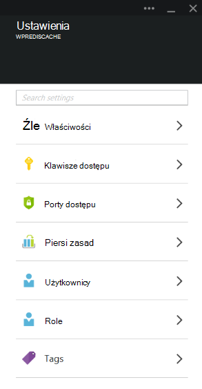

### <a name="add-redishost-app-setting"></a>Dodaj ustawienie aplikacji REDIS_HOST

Pierwszy ustawienia aplikacji do utworzenia **REDIS\_hosta** ustawienia aplikacji. To ustawienie określa miejsce docelowe, do którego poprawki przekazuje informacji w pamięci podręcznej. Wartość wymagana dla ustawienia aplikacji REDIS_HOST można pobrać z karta **Właściwości** usługi wystąpienia Redis pamięci podręcznej.

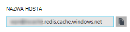

Ustawianie klucza ustawienia aplikacji, aby **REDIS\_hosta** i wartość ustawienia aplikacji do **hosta** wystąpienia Redis pamięci podręcznej.

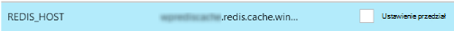

### <a name="add-rediskey-app-setting"></a>Dodaj ustawienie aplikacji REDIS_KEY

Druga ustawienia aplikacji do utworzenia **REDIS\_klucza** ustawienia aplikacji. To ustawienie zapewnia, że token uwierzytelniania wymaganych do bezpiecznego dostępu wystąpienia Redis pamięci podręcznej. Można pobrać wartość wymagane dla ustawienia aplikacji REDIS_KEY karta **klawiszy dostępu** wystąpienia Redis pamięci podręcznej.

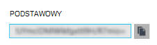

Ustawianie klucza ustawienia aplikacji, aby **REDIS\_klucza** i wartość ustawienia aplikacji do **Klucza podstawowego** wystąpienia Redis pamięci podręcznej.

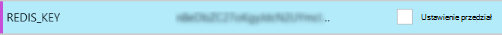

### <a name="add-memcacheshimredisenable-app-setting"></a>Dodaj ustawienie aplikacji MEMCACHESHIM_REDIS_ENABLE

Ostatnie ustawienie aplikacji służy do włączania poprawkę Memcache w aplikacjach sieci Web, który używa REDIS_HOST i REDIS_KEY nawiązać połączenie z pamięci podręcznej Redis Azure i przesyłanie dalej pamięci podręcznej połączeń. Ustaw klucz ustawienie aplikacji do **MEMCACHESHIM\_REDIS\_włączyć** i wartość **true**.

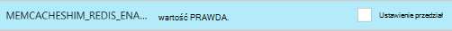

Po zakończeniu dodawania ustawień aplikacji trzech (3), kliknij przycisk **Zapisz**.

## <a name="enable-memcache-extension-for-php"></a>Włączanie rozszerzenia Memcache dla PHP

W kolejności stosowania Czytaj protokołu Memcache należy zainstalować rozszerzenie Memcache PHP — framework języka dla witryny WordPress.

### <a name="download-the-phpmemcache-extension"></a>Pobierz php_memcache rozszerzenia

Przejdź do [PECL][6]. W obszarze buforowania kategorię, kliknij przycisk [memcache][7]. W obszarze materiały do pobrania kolumny kliknij łącze DLL.

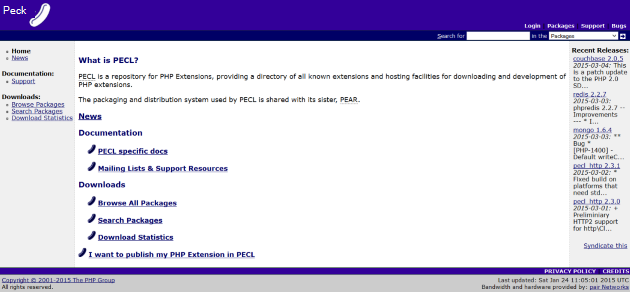

Pobierz łącze wątku inne niż bezpieczne (NTS) x86 w wersji PHP włączony dostęp w aplikacjach sieci Web. (Wartość domyślna to PHP 5.4)

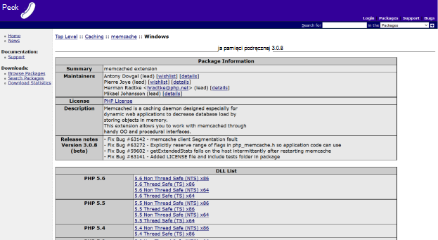

### <a name="enable-the-phpmemcache-extension"></a>Włączanie rozszerzenia php_memcache

Po pobraniu pliku Rozpakuj plik i przekaż **php\_memcache.dll** do **d:\\głównym\\witryny\\wwwroot\\pojemnika\\wewnętrzny\\ ** katalogu. Po przekazaniu php_memcache.dll do aplikacji sieci web, musisz włączyć rozszerzenia do obsługi PHP. Aby włączyć rozszerzenie Memcache w Azure Portal, otwórz karta **Ustawienia aplikacji** dla aplikacji sieci web, a następnie dodaj nowe ustawienie aplikacji przy użyciu klucza **PHP\_rozszerzenia** i wartości **pojemnika\\wewnętrzny\\php_memcache.dll**.


> [AZURE.NOTE] Jeśli aplikacji sieci web wymaga załadować wiele rozszerzeń PHP, wartość PHP_EXTENSIONS powinny być rozdzielany przecinkami wykaz ścieżki względne plików DLL.


Po zakończeniu kliknij przycisk **Zapisz**.

## <a name="install-memcache-wordpress-plugin"></a>Zainstaluj wtyczkę Memcache WordPress

> [AZURE.NOTE] Można również pobrać [Dodatek pamięci podręcznej obiektów Memcached](https://wordpress.org/plugins/memcached/) z WordPress.org.

Na stronie wtyczek WordPress kliknij przycisk **Dodaj nowy**.

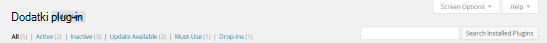

W polu wyszukiwania wpisz **memcached** , a następnie naciśnij klawisz **Enter**.

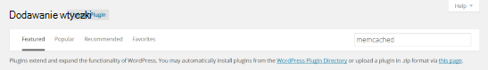

Znajdowanie **Pamięci podręcznej obiektów Memcached** na liście, a następnie kliknij przycisk **Zainstaluj teraz**.

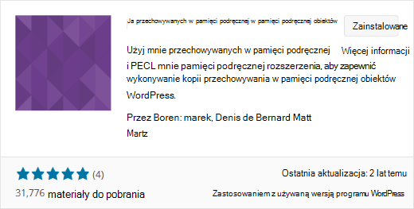

### <a name="enable-the-memcache-wordpress-plugin"></a>Włącz dodatek Memcache WordPress

>[AZURE.NOTE] Postępuj zgodnie z instrukcjami w tym blogu na [temat włączania rozszerzeniem witryny w aplikacjach sieci Web] [ 8] instalacji programu Visual Studio Team Services.

W `wp-config.php` plików, Dodaj następujący kod powyżej zatrzymaj edytowanie komentarza na końcu pliku.

```php
$memcached_servers = array(
    'default' => array('localhost:' . getenv("MEMCACHESHIM_PORT"))
);
```

Po zostały wklejone kod, Monako automatycznie zapisze dokument.

Następnym krokiem jest umożliwienie dodatek pamięci podręcznej obiektów. Jest to przez przeciąganie i upuszczanie **cache.php obiekt** z **wp — zawartość i dodatków plug-in i memcached** folderu do folderu **zawartości wp** , aby włączyć funkcję Memcache pamięci podręcznej obiektów.

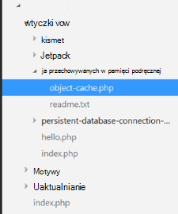

Teraz, gdy plik **cache.php obiektu** znajduje się w folderze **wp zawartości** , pamięci podręcznej obiektów Memcached jest teraz włączone.

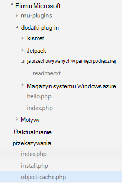

## <a name="verify-the-memcache-object-cache-plugin-is-functioning"></a>Upewnij się, że działa dodatek Memcache pamięci podręcznej obiektów

Wszystkie kroki w celu umożliwienia poprawkę Memcache aplikacje sieci Web są obecnie zakończone. Po lewej stronie grupowych jedynie jest sprawdzenie, czy dane podczas wypełniania wystąpienia Redis pamięci podręcznej.

### <a name="enable-the-non-ssl-port-support-in-azure-redis-cache"></a>Włączanie obsługi portu bez użycia protokołu SSL w pamięci podręcznej Azure Redis

>[AZURE.NOTE] Podczas tworzenia wiadomości w tym artykule polecenie Redis nie obsługuje połączenia SSL, dlatego poniższe kroki są wymagane.

W portalu Azure przejdź do wystąpienia Redis pamięci podręcznej, utworzonego dla tej aplikacji sieci web. Po otwarciu karta podręcznej kliknij ikonę **Ustawienia** .

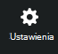

Z listy wybierz **Porty dostępu** .

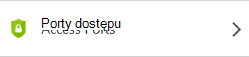

Kliknij pozycję **nie** **Zezwalaj na**dostęp tylko za pośrednictwem protokołu SSL.

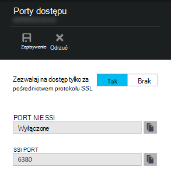

Zostanie wyświetlony port SSL nie jest teraz skonfigurowana. Kliknij przycisk **Zapisz**.

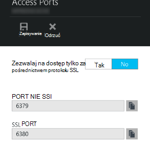

### <a name="connect-to-azure-redis-cache-from-redis-cli"></a>Nawiązywanie połączenia z pamięci podręcznej Azure Redis z interfejsu wiersza polecenia redis

>[AZURE.NOTE] W tym kroku założono, tego redis jest zainstalowany lokalnie na tym komputerze rozwoju. [Instalowanie lokalnie, przy użyciu tych instrukcjach Redis][9].

Otwórz wiersza polecenia konsoli wyboru i wpisz następujące polecenie:

```shell
redis-cli –h <hostname-for-redis-cache> –a <primary-key-for-redis-cache> –p 6379
```

Zamienianie ** &lt;hostname dla redis podręcznej&gt; ** z hostname rzeczywisty xxxxx.redis.cache.windows.net i ** &lt;podstawowego klucza redis podręcznej dla&gt; ** klawisz dostępu dla pamięci podręcznej, naciśnij klawisz **Enter**. Gdy polecenie połączy się z wystąpieniem Redis pamięci podręcznej, problemów z dowolnego polecenia redis. Poniżej ekranu po wybraniu opcji listę klawiszy.

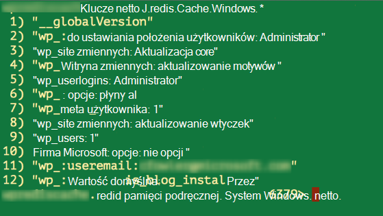

Połączenie na listę klawiszy powinna zwrócić wartości. Jeśli nie, spróbuj Przechodzenie do aplikacji sieci web i spróbuj ponownie.

## <a name="conclusion"></a>Wnioski

Gratulacje! Aplikacja WordPress ma teraz scentralizowane w pamięci podręcznej pomocnych zwiększenie produktywności. Należy pamiętać, że poprawkę Memcache aplikacje sieci Web można używać z dowolnego klienta Memcache, bez względu na język programowania lub AIF. Aby przekazać opinię lub zadawać pytania dotyczące poprawkę Memcache aplikacji sieci Web, publikowanie na [Forach MSDN] [ 10] lub [zdarzeń Stackoverflow][11].

>[AZURE.NOTE] Jeśli chcesz rozpocząć pracę z Azure aplikacji usługi przed utworzeniem konta dla konta Azure, przejdź do [Spróbuj aplikacji usługi](http://go.microsoft.com/fwlink/?LinkId=523751), którym natychmiast można utworzyć aplikację sieci web krótkotrwałe starter w aplikacji usługi. Nie kart kredytowych wymagane; nie zobowiązania.

## <a name="whats-changed"></a>Informacje o zmianach
* Przewodnika do zmiany z witryn sieci Web do usługi aplikacji Zobacz: [Usługa Azure aplikacji i ich wpływu na istniejące usługi Azure](http://go.microsoft.com/fwlink/?LinkId=529714)


[0]: ../redis-cache/cache-dotnet-how-to-use-azure-redis-cache.md#create-a-cache
[1]: http://bit.ly/1t0KxBQ
[2]: http://manage.windowsazure.com
[3]: http://portal.azure.com
[4]: ../powershell-install-configure.md
[5]: /downloads
[6]: http://pecl.php.net
[7]: http://pecl.php.net/package/memcache
[8]: http://blog.syntaxc4.net/post/2015/02/05/how-to-enable-a-site-extension-in-azure-websites.aspx
[9]: http://redis.io/download#installation
[10]: https://social.msdn.microsoft.com/Forums/home?forum=windowsazurewebsitespreview
[11]: http://stackoverflow.com/questions/tagged/azure-web-sites
[12]: /services/cache/
[13]: http://memcached.org
