<properties
   pageTitle="Tworzenie aplikacji sieci web programu ASP.NET 5 w kodzie programu Visual Studio"
   description="Ten samouczek przedstawiono procedurę tworzenia aplikacji sieci web programu ASP.NET 5 przy użyciu programu Visual Studio kodu."
   services="app-service\web"
   documentationCenter=".net"
   authors="erikre"
   manager="wpickett"
   editor="jimbe"/>

<tags
    ms.service="app-service-web" 
    ms.workload="web" 
    ms.tgt_pltfrm="dotnet" 
    ms.devlang="na" 
    ms.topic="article" 
    ms.date="02/26/2016" 
    ms.author="cephalin"/>

# Tworzenie aplikacji sieci web programu ASP.NET 5 w kodzie programu Visual Studio

## Omówienie

Ten samouczek pokazano, jak tworzyć aplikacji sieci web programu ASP.NET 5 przy użyciu [Programu Visual Studio kod (a)](http://code.visualstudio.com//Docs/whyvscode) i Wdroż [Azure aplikacji usługi](../app-service/app-service-value-prop-what-is.md). 

> [AZURE.NOTE] Mimo że w tym artykule odnosi się do aplikacji sieci web, jej dotyczy również aplikacje interfejsu API i aplikacji dla urządzeń przenośnych. 

ASP.NET 5 jest istotne zmianom programu ASP.NET. ASP.NET 5 jest nowe ramy Otwórz źródło i korzystaj z różnych platform do tworzenia aplikacji sieci web opartych na chmurze Nowoczesna za pomocą .NET. Aby uzyskać więcej informacji zobacz [Wprowadzenie do programu ASP.NET 5](http://docs.asp.net/en/latest/conceptual-overview/aspnet.html). Uzyskać informacji o aplikacjach Azure aplikacji usługi sieci web zobacz [Omówienie aplikacji sieci Web](app-service-web-overview.md).

[AZURE.INCLUDE [app-service-web-try-app-service.md](../../includes/app-service-web-try-app-service.md)]

## Wymagania wstępne  

* Zainstaluj [w PORÓWNANIU z kodu](http://code.visualstudio.com/Docs/setup).
* Zainstaluj [Node.js](http://nodejs.org) - Node.js jest platformą do tworzenia aplikacji szybką i skalowalność serwera za pomocą języka JavaScript. Węzeł jest runtime (węzeł), a [npm](http://www.npmjs.com/) jest Menedżer pakietów dla modułów węzeł. Npm użyje do scaffold aplikacji sieci web programu ASP.NET 5 w tym samouczku.
* Instalowanie cyfra — można ją zainstalować, korzystając z jednej z następujących lokalizacji: [Chocolatey](https://chocolatey.org/packages/git) lub [scm.com cyfra](http://git-scm.com/downloads). Jeśli jesteś nowym użytkownikiem cyfra, [cyfra scm.com](http://git-scm.com/downloads) i wybierz przycisk opcji **Użyj cyfra z wiersza polecenia systemu Windows**. Po zainstalowaniu cyfra, również musisz cyfra nazwę użytkownika i wysłać pocztą e-mail, ponieważ jest wymagane w dalszej części samouczka (podczas wykonywania zlecenie z kodu w PORÓWNANIU z).  

## Instalowanie programu ASP.NET 5 i DNX
ASP.NET 5-DNX (środowiska .NET wykonanie) jest szczupłej stos .NET do tworzenia nowoczesny chmury i aplikacje sieci web, które działają w systemie OS X, Linux i systemu Windows. Jego został utworzony od podstaw w górę o podanie framework rozwoju zoptymalizowane dla aplikacji, które są wdrożony w chmurze lub uruchamianie lokalnego. Składa się z moduły składniki z minimalnymi ogólnych, aby zachować elastyczność podczas tworzenia rozwiązanie.

Ten samouczek ma na celu rozpoczęcie pracy nad tworzeniem aplikacji z najnowszych wersji rozwoju ASP.NET 5 i DNX. Poniższe instrukcje są specyficzne dla systemu Windows. Bardziej szczegółowe instrukcje dotyczące instalacji dla systemu OS X Linux i systemu Windows, zobacz [Instalowanie programu ASP.NET 5 i DNX](https://code.visualstudio.com/Docs/ASPnet5#_installing-aspnet-5-and-dnx). 

1. Aby zainstalować Menedżera wersji .NET (DNVM) w systemie Windows, otwórz wiersz polecenia, a następnie uruchom następujące polecenie.

        @powershell -NoProfile -ExecutionPolicy unrestricted -Command "&{$Branch='dev';iex ((new-object net.webclient).DownloadString('https://raw.githubusercontent.com/aspnet/Home/dev/dnvminstall.ps1'))}"

    To pobieranie skryptu DNVM i umieszczanie go w katalogu profilu użytkownika. 

2. **Ponownie uruchom system Windows** , aby ukończyć instalację DNVM. 

    Po ponownym uruchomieniu systemu Windows, możesz otworzyć wiersz polecenia, aby sprawdzić lokalizację DNVM wpisując następujące czynności:

        where dnvm

    Wiersz polecenia będzie wyświetlanych ścieżki podobny do następującego.

    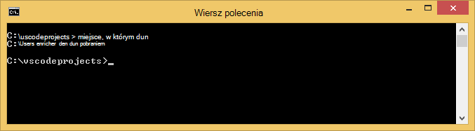

3. Teraz, gdy masz DNVM, możesz jej używać do pobierania DNX do uruchomienia aplikacji. Uruchom następujące polecenie w wierszu polecenia:

        dnvm upgrade

    Weryfikowanie usługi DNVM i wyświetlać aktywnej runtime wprowadzając poniższe polecenie w wierszu polecenia:

        dnvm list

    Wiersz polecenia zostanie wyświetlona szczegóły aktywnej runtime.

    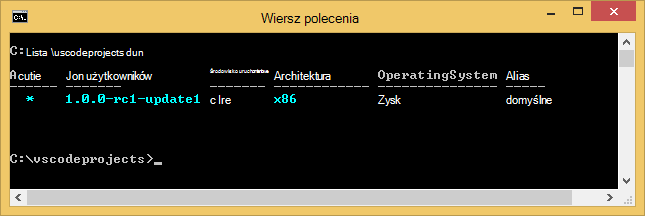

    Jeśli wymieniono więcej niż jeden DNX środowisko uruchomieniowe, można wprowadzić następujące (lub nowszej wersji) w wierszu polecenia, aby ustawić aktywnej runtime DNX. Ustaw ją na tej samej wersji, jest używana przez generator ASP.NET 5 podczas tworzenia aplikacji sieci web w dalszej części tego samouczka. *Nie trzeba zmienić aktywnej runtime, gdy jest ustawiony na dostępne najpóźniej.*

        dnvm use 1.0.0-update1 –p

> [AZURE.NOTE] Bardziej szczegółowe instrukcje dotyczące instalacji dla systemu OS X Linux i systemu Windows, zobacz [Instalowanie programu ASP.NET 5 i DNX](https://code.visualstudio.com/Docs/ASPnet5#_installing-aspnet-5-and-dnx). 

## Tworzenie aplikacji sieci web 

W tej sekcji przedstawiono sposoby scaffold nowej aplikacji sieci web programu ASP.NET aplikacji. Menedżer pakietów węzeł (npm) będą używane do zainstalowania [Yeoman](http://yeoman.io/) (narzędzie rusztowania aplikacji — równowartość w PORÓWNANIU z kodu programu Visual Studio **Plik > Nowy projekt** operacji), [Grunt](http://gruntjs.com/) (runner zadania JavaScript) i [Bower](http://bower.io/) (Menedżera pakietów po stronie klienta). 

1. Otwórz wiersz polecenia z uprawnieniami administratora i przejdź do lokalizacji, w której chcesz utworzyć projektu programu ASP.NET. Na przykład utworzyć katalogu *vscodeprojects* w katalogu głównym C:\.

2. Wprowadź następujące w wierszu polecenia, aby zainstalować Yeoman i obsługi narzędzi.

        npm install -g yo grunt-cli generator-aspnet bower

    > [AZURE.NOTE] Może zostać wyświetlony, ostrzeżenia sugerujący, że wersji npm jest nieaktualny. To ostrzeżenie nie ma wpływu tego samouczka.

3. Wprowadź poniższe czynności, aby utworzyć folder projektu i scaffold aplikacji, w wierszu polecenia.

        yo aspnet

4. Użyj klawiszy strzałek, aby wybrać typ **Podstawowe aplikacji sieci Web** z menu generator ASP.NET 5, a następnie naciśnij klawisz ** &lt;Enter >**.

    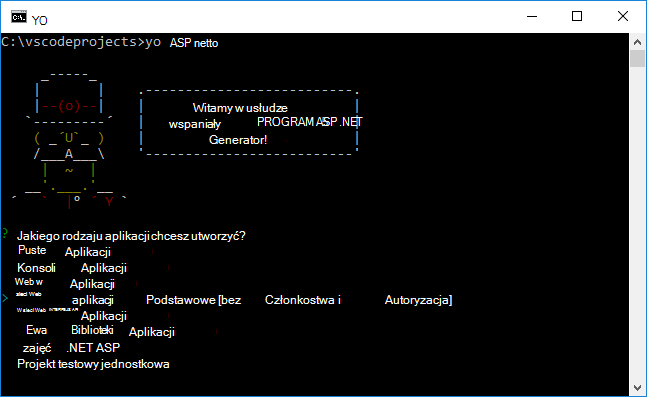

5. Ustaw nazwę nowej aplikacji sieci web programu ASP.NET **SampleWebApp**. Jak ta nazwa jest używana w całym samouczek, jeśli wybierzesz pod inną nazwą, musisz podstawić każdego wystąpienia **SampleWebApp**. Po naciśnięciu ** &lt;Enter >**, Yeoman spowoduje utworzenie nowego folderu o nazwie **SampleWebApp** i pliki niezbędne dla nowej aplikacji.

6. W wierszu polecenia Zmień katalog do nowego folderu projektu:

        cd SampleWebApp

7. Również w wierszu polecenia, aby zainstalować pakiety NuGet niezbędne do uruchamiania aplikacji, od wprowadź następujące polecenie:

        dnu restore

8. Otwieranie w PORÓWNANIU z kodu, wprowadzając poniższe polecenie w wierszu polecenia:

        code .

## Uruchamianie aplikacji sieci web lokalnie

Teraz, gdy masz już utworzone aplikacji sieci web i pobrać wszystkie pakiety NuGet dla aplikacji, aplikacji sieci web można uruchamiać lokalnie.

1. Z **Palety polecenia** w PORÓWNANIU z kodu wprowadź poniższe czynności, aby wyświetlić opcje dostępne polecenia uruchamiania:

        dnx: Run Command

    > [AZURE.NOTE] Jeśli serwer Omnisharp obecnie nie działa, rozpocznie się w górę. Wprowadź ponownie polecenie powyżej.

    Następnie wybierz następujące polecenie, aby uruchomić aplikacji sieci web:
        
        dnx web - (SampleWebApp)

    W oknie polecenia będzie wyświetlany, czy aplikacja została uruchomiona. Jeśli okno polecenia nie jest wyświetlany ten komunikat, sprawdź dolnym lewym corning w PORÓWNANIU z kodu pod kątem błędów w projekcie.
    
    > [AZURE.NOTE]Wydawania polecenia z **Palety polecenie** wymaga **>** znak na początku wiersza polecenia. Możesz wyświetlić szczegółowe informacje dotyczące polecenia **sieci web** w pliku *project.json* .   
    > Jeśli to polecenie nie jest wyświetlana lub nie jest dostępna, może być konieczne zainstalować rozszerzenie C#. Uruchamianie `>Extensions: Install Extension` i `ext install c#` zainstalować rozszerzenia C#.

2. Otwórz przeglądarkę i przejdź do następującego adresu URL.

    **http://localhost:5000**

    Na stronie domyślnej aplikacji sieci web pojawi się w następujący sposób.

    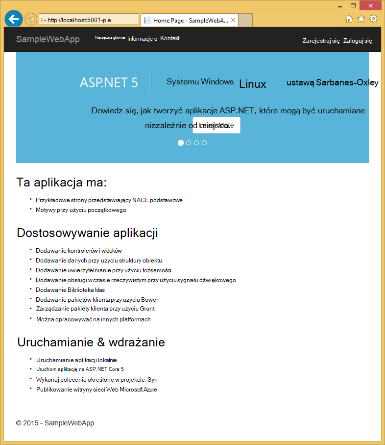

3. Zamknij przeglądarkę. W **Oknie polecenia**naciśnij **Klawisze Ctrl + C** , aby Zamknij aplikację, a następnie Zamknij **Okno poleceń**. 

## Tworzenie aplikacji sieci web w Azure Portal

Poniższe kroki przeprowadzi Cię przez proces tworzenia aplikacji sieci web w Azure Portal.

1. Zaloguj się do [portalu Azure](https://portal.azure.com).

2. Kliknij przycisk **Nowy** na górze po lewej portalu.

3. Kliknij pozycję **sieci Web aplikacje > sieci Web aplikacji**.

    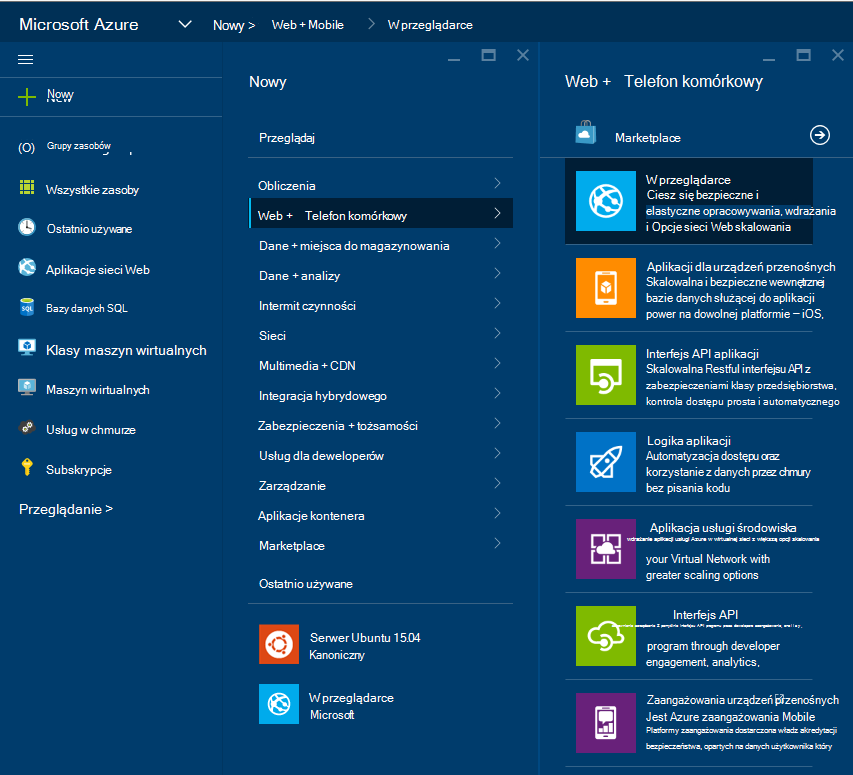

4. Wprowadź wartość dla **nazwy**, na przykład **SampleWebAppDemo**. Należy zauważyć, że ta nazwa musi być unikatowa i portalu będzie wymuszać którego, podczas próby wprowadź nazwę. W związku z tym Jeśli wybierzesz wprowadź inną wartość, musisz zastąpić tę wartość dla każdego wystąpienia **SampleWebAppDemo** , który zostanie wyświetlony w tym samouczku. 

5. Wybierz istniejący **Plan usługi aplikacji** lub Utwórz nową. Jeśli tworzysz nowy plan zaznacz cennik warstwa, lokalizację i inne opcje. Aby uzyskać więcej informacji na temat planów aplikacji usługi zobacz artykuł, [Omówienie szczegółowo planów Azure aplikacji usługi](../app-service/azure-web-sites-web-hosting-plans-in-depth-overview.md).

    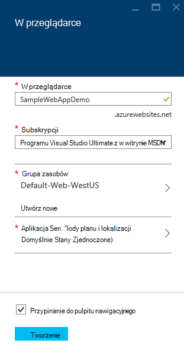

6. Kliknij przycisk **Utwórz**.

    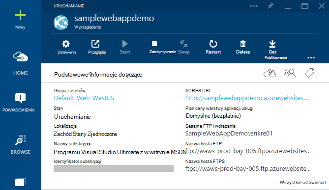

## Włączanie publikowania cyfra dla nowej aplikacji sieci web

Cyfra to system kontroli wersji rozłożone, który umożliwia wdrażanie aplikacji sieci web Azure aplikacji usługi. Będą przechowywane tworzonego dla aplikacji sieci web w lokalnym repozytorium cyfra kodu i będzie wdrażanie kodu Azure przez naciśnięcie zdalnego repozytorium.   

1. Logowanie do [portalu Azure](https://portal.azure.com).

2. Kliknij przycisk **Przeglądaj**.

3. Kliknij pozycję **Aplikacje sieci Web** , aby wyświetlić listę aplikacji sieci web skojarzonego z subskrypcją usługi Azure.

4. Wybierz aplikację sieci web utworzonej w tym samouczku.

5. Karta aplikacji sieci web, kliknij **Ustawienia** > **ciągły wdrożenia**. 

    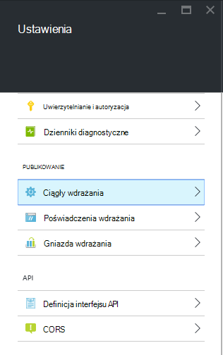

6. Kliknij pozycję **Wybierz źródło > lokalnego repozytorium cyfra**.

7. Kliknij **przycisk OK**.

    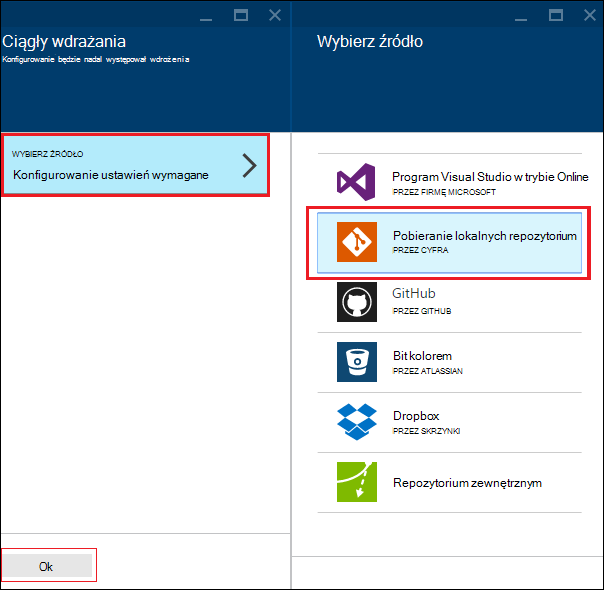

8. Jeśli nie masz poświadczeń wdrożenia do publikowania aplikacji sieci web lub aplikacji innych aplikacji usługi, skonfigurować je teraz:

    * Kliknij pozycję **Ustawienia** > **wdrażania poświadczeń**. Zostanie wyświetlona karta **Ustawianie poświadczeń wdrożenia** .

    * Tworzenie nazwy użytkownika i hasła.  To hasło będą potrzebne później, podczas konfigurowania cyfra.

    * Kliknij przycisk **Zapisz**.

9. Karta aplikacji sieci web kliknij **Ustawienia > właściwości**. Adres URL zdalnego repozytorium cyfra, który będzie Wdroż jest wyświetlany pod **Adresem URL CYFRA**.

10. Skopiuj wartość **Adres URL CYFRA** do późniejszego użycia w samouczku.

    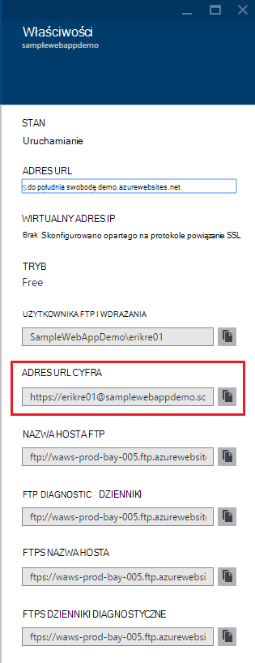

## Publikowanie aplikacji sieci web w usłudze Azure aplikacji

W tej sekcji utworzysz lokalnego repozytorium cyfra i wypychanych z tego repozytorium Azure wdrożenia Azure aplikacji sieci web.

1. W PORÓWNANIU z kodu Wybierz opcję **cyfra** na pasku nawigacyjnym po lewej stronie.

    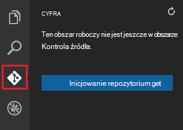

2. Wybierz pozycję **zainicjować repozytorium cyfra** , aby upewnić się, że obszar roboczy znajduje się w obszarze kontrolki źródła cyfra. 

    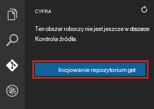

3. Otwórz okno polecenia i zmień katalogów katalog aplikacji sieci web. Wpisz następujące polecenie:

        git config core.autocrlf false

    To polecenie uniemożliwia problem informacji o tekście, gdzie zaangażowanie zakończenia CRLF i zakończenia wysuwu wiersza.

4. W kodzie w PORÓWNANIU z Dodaj wiadomość Zatwierdź, a następnie kliknij przycisk **Zatwierdź wszystkie** ikona wyboru.

    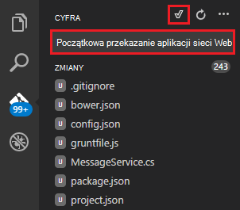

5. Po zakończeniu przetwarzania cyfra pojawi się, że nie ma żadnych plików na liście w oknie cyfra w obszarze **zmiany**. 

    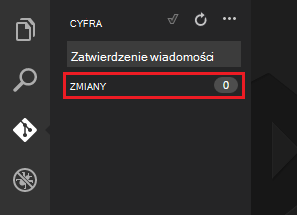

6. Zmienianie do okna polecenia miejsce, w którym wiersz polecenia punktów do katalogu miejsce, w którym znajduje się aplikacji sieci web.

7. Tworzenie odwołania do zdalnego dla naciśnięcie aktualizacje do aplikacji sieci web przy użyciu adres URL cyfra (kończy się na ".git"), który został skopiowany wcześniej.

        git remote add azure [URL for remote repository]

8. Konfigurowanie cyfra, aby zapisać poświadczenia lokalnie one zostaną automatycznie dołączone do polecenia wypychanych wynikiem kod w PORÓWNANIU z.

        git config credential.helper store

9. Przekazać zmiany do Azure, wpisując następujące polecenie. Po tym początkowe wypychanych Azure można wykonać wszystkie polecenia wypychanych z kodu w PORÓWNANIU z. 

        git push -u azure master

    Zostanie wyświetlony monit o podanie hasła utworzonego wcześniej w Azure. **Uwaga: Hasło nie będą widoczne.**

    Dane wyjściowe powyżej polecenia kończy się komunikat, że jest pomyślnego wdrożenia.

        remote: Deployment successful.
        To https://user@testsite.scm.azurewebsites.net/testsite.git
        [new branch]      master -> master

> [AZURE.NOTE] Jeśli wprowadzisz zmiany do aplikacji, możesz ponownie opublikować bezpośrednio w kodzie w PORÓWNANIU z przy użyciu wbudowanych funkcji cyfra, wybierając pozycję **Zatwierdzenie wszystkich** opcji, a po niej opcji **Push** . Znajdziesz **Push** opcja dostępna w menu rozwijanym obok przycisków **Zatwierdzenie wszystkich** i **Odśwież** .

Jeśli chcesz współpracować nad projektem, należy rozważyć naciśnięcie do GitHub między naciśnięcie Azure.

## Uruchamianie aplikacji platformy Azure
Teraz, gdy wdrożono aplikacji sieci web, Przejdźmy Uruchom aplikację podczas obsługiwany w Azure. 

Można to zrobić na dwa sposoby:

* Otwórz przeglądarkę i wpisz nazwę aplikacji sieci web w następujący sposób.   

        http://SampleWebAppDemo.azurewebsites.net
 
* W portalu Azure Znajdź karta aplikacji sieci web dla aplikacji sieci web, a następnie kliknij przycisk **Przeglądaj,** Aby wyświetlić aplikacji 
* w domyślnej przeglądarce.

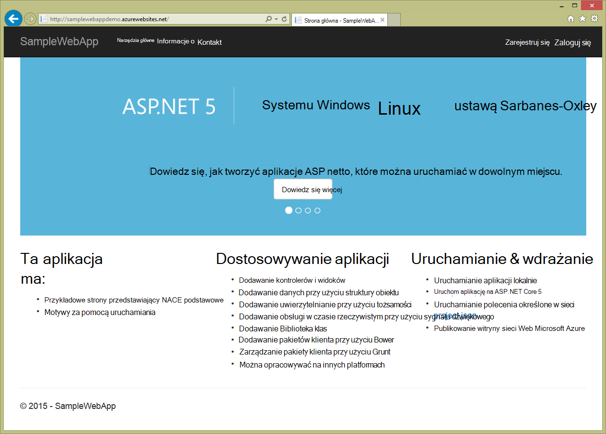

## Podsumowanie
W tym samouczku wiesz, jak utworzyć aplikację sieci web w PORÓWNANIU z kodu i Wdroż Azure. Aby uzyskać więcej informacji na temat kodu w PORÓWNANIU z, zobacz artykuł, [Dlaczego kod Visual Studio?](https://code.visualstudio.com/Docs/) Uzyskać informacji na temat aplikacji usługi sieci web apps zobacz [Omówienie aplikacji sieci Web](app-service-web-overview.md). 
