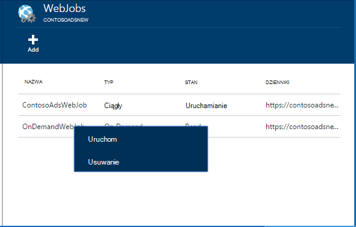

<properties 
    pageTitle="Wykonywać zadania w tle z WebJobs" 
    description="Dowiedz się, jak wykonywać zadania w tle w aplikacjach sieci web Azure." 
    services="app-service" 
    documentationCenter="" 
    authors="tdykstra" 
    manager="wpickett" 
    editor="jimbe"/>

<tags 
    ms.service="app-service" 
    ms.workload="na" 
    ms.tgt_pltfrm="na" 
    ms.devlang="na" 
    ms.topic="article" 
    ms.date="04/27/2016" 
    ms.author="tdykstra"/>

# <a name="run-background-tasks-with-webjobs"></a>Wykonywać zadania w tle z WebJobs

## <a name="overview"></a>Omówienie

Można uruchomić programów lub skryptów w WebJobs w aplikacji sieci web [Usługi aplikacji](http://go.microsoft.com/fwlink/?LinkId=529714) na trzy sposoby: na żądanie, lub zgodnie z harmonogramem. Nie ma żadnych dodatkowych kosztów umożliwia WebJobs.

W tym artykule pokazano, jak wdrożyć WebJobs przy użyciu [Azure Portal](https://portal.azure.com). Aby dowiedzieć się, jak wdrożyć przy użyciu programu Visual Studio lub proces ciągły dostarczania zobacz [jak wdrożyć Azure WebJobs do aplikacji sieci Web](websites-dotnet-deploy-webjobs.md).

Azure WebJobs SDK upraszcza wiele WebJobs zadania programowania. Aby uzyskać więcej informacji zobacz [Co to jest zestaw SDK WebJobs](websites-dotnet-webjobs-sdk.md).

 Azure funkcje (obecnie w podglądzie) jest kolejnym sposobem uruchamiania programów i skryptów w usłudze Azure aplikacji. Aby uzyskać więcej informacji zobacz [Omówienie funkcji Azure](../azure-functions/functions-overview.md).

[AZURE.INCLUDE [app-service-web-to-api-and-mobile](../../includes/app-service-web-to-api-and-mobile.md)] 

## <a name="acceptablefiles"></a>Typy plików dopuszczalne skryptów lub programów

Są akceptowane następujących typów plików:

* cmd, bat, .exe (za pomocą cmd systemu windows)
* .ps1 (przy użyciu programu powershell)
* .sh (za pomocą imprezie)
* .php (za pomocą php)
* .PY (za pomocą python)
* js (za pomocą węzła)
* .JAR (przy użyciu języka java)

## <a name="CreateOnDemand"></a>Tworzenie na żądanie WebJob w portalu

1. Karta **Aplikacji sieci Web** [Azure Portal](https://portal.azure.com), kliknij **wszystkie ustawienia > WebJobs** pokazanie karta **WebJobs** .
    
    
    
5. Kliknij przycisk **Dodaj**. Zostanie wyświetlone okno dialogowe **Dodawanie WebJob** .
    
    
    
2. W polu **Nazwa**Podaj nazwę dla WebJob. Nazwa musi rozpoczynać się od litery lub liczby i nie może zawierać znaków specjalnych innych niż "-" i "_".
    
4. W oknie dialogowym **sposobu uruchamiania** wybierz pozycję **Uruchom na żądanie**.
    
3. W oknie dialogowym **Przekazywanie plików** kliknij ikonę folderu, a następnie przejdź do pliku zip, która zawiera skrypt. Plik zip powinien zawierać usługi plik wykonywalny (.exe cmd. bat .sh .php .py js) oraz wszystkie pliki pomocnicze, aby uruchomić program lub skrypt.
    
5. Sprawdź **Utwórz** , aby przekazać skrypt do aplikacji sieci web. 
    
    Nazwa, który określony jako WebJob pojawia się na liście Karta **WebJobs** .
    
6. Aby uruchomić WebJob, kliknij prawym przyciskiem myszy jego nazwę na liście, a następnie kliknij polecenie **Uruchom**.
    
    
    
## <a name="CreateContinuous"></a>Tworzenie stale uruchomionego WebJob

1. Aby utworzyć WebJob przez cały czas wykonywania, wykonaj te same kroki związane z tworzeniem WebJob, że działa jeden raz, ale w oknie dialogowym **sposobu uruchamiania** wybierz **ciągły**.

2. Aby uruchomić lub zatrzymać ciągłe WebJob, kliknij prawym przyciskiem myszy WebJob na liście, a następnie kliknij przycisk **Uruchamianie** lub **Zatrzymywanie**.
    
> [AZURE.NOTE] Jeśli aplikacji sieci web jest uruchamiana na więcej niż jedno wystąpienie, stale uruchomionego WebJob będzie działać na wszystkich wystąpień usługi. Uruchom WebJobs na żądanie i zaplanowane na jedno wystąpienie wybrane do równoważenia obciążenia za Microsoft Azure.
    
> Dla ciągły WebJobs do uruchomienia niezawodne i na wszystkie wystąpienia włączyć zawsze * ustawienie konfiguracji dla aplikacji sieci web można zatrzymać uruchomiony po witrynie hosta Menedżer sterowania usługami jest bezczynny przez dłuższy czas.

## <a name="CreateScheduledCRON"></a>Tworzenie WebJob według harmonogramu przy użyciu wyrażenia CRON

Ta metoda jest dostępna dla aplikacji sieci Web w trybie Basic, Standard lub Premium i wymaga ustawienia **Zawsze na** są włączone w tej aplikacji.

Aby włączyć WebJob na żądanie w zaplanowanym WebJob, po prostu zawierają `settings.job` pliku w katalogu głównym pliku zip WebJob. Ten plik JSON powinien zawierać `schedule` właściwość za pomocą [wyrażenia CRON](https://en.wikipedia.org/wiki/Cron), na przykład poniżej.

Wyrażenie CRON składa się z pól 6: `{second} {minute} {hour} {day} {month} {day of the week}`.

Na przykład, aby wyzwolić usługi WebJob co 15 minut z `settings.job` woli:

```json
{
    "schedule": "0 */15 * * * *"
}
``` 

Inne przykłady harmonogram CRON:

- Co godzinę (to znaczy, gdy liczba minut jest równy 0):`0 0 * * * *` 
- Co godzinę z 9 AM do 17: 00:`0 0 9-17 * * *` 
- W 9:30 AM każdego dnia:`0 30 9 * * *`
- W 9:30 AM każdego dnia tygodnia:`0 30 9 * * 1-5`

**Uwaga**: wdrażając WebJob z programu Visual Studio, upewnij się oznaczyć usługi `settings.job` właściwości pliku jako "Kopia Jeśli nowszego".


## <a name="CreateScheduled"></a>Tworzenie WebJob według harmonogramu przy użyciu harmonogramu Azure

Następujące techniki alternatywny korzysta z harmonogramu Azure. W tym przypadku usługi WebJob nie znają dowolnego bezpośredni harmonogramu. Zamiast tego harmonogram Azure otrzymuje skonfigurowany wyzwalać usługi WebJob zgodnie z harmonogramem. 

Azure Portal jeszcze nie ma możliwość tworzenia WebJob według harmonogramu, ale do chwili dodać funkcję, możesz to zrobić za pomocą [portalu klasyczny](http://manage.windowsazure.com).

1. W [portalu klasyczny](http://manage.windowsazure.com) przejdź na stronę WebJob, a następnie kliknij przycisk **Dodaj**.

1. W oknie dialogowym **sposobu uruchamiania** wybierz pozycję **Uruchom zgodnie z harmonogramem**.
    
    ![Nowe zadanie zaplanowane][NewScheduledJob]
    
2. Wybierz **Obszar harmonogram** dla zadania, a następnie kliknij strzałkę w prawym dolnym rogu okna dialogowego, aby przejść do następnego ekranu.

3. W oknie dialogowym **Tworzenie zadania** , wybierz typ **cyklu** ma: **jednorazowego zadania** lub **cykliczne**.
    
    ![Zaplanuj cykl][SchdRecurrence]
    
4. Także wybrać termin **Uruchamianie** : **teraz** lub **w określonym czasie**.
    
    ![Zaplanuj godzinę rozpoczęcia][SchdStart]
    
5. Jeśli chcesz rozpocząć w określonym czasie, wybierz pozycję początkowe wartości czasu w obszarze **Uruchamianie**.
    
    ![Rozpocznij harmonogram w określonym czasie][SchdStartOn]
    
6. Jeśli wybierzesz zadanie cykliczne **Powtórz co** opcję, aby określić częstotliwość wystąpienie i opcję **Kończące się na** , aby określić czas zakończenia.
    
    ![Zaplanuj cykl][SchdRecurEvery]
    
7. Jeśli wybierzesz **tygodni**, możesz zaznacz pole **Na określony harmonogram** i określanie dni tygodnia, w których zadanie ma uruchomić.
    
    ![Planowanie dni tygodnia][SchdWeeksOnParticular]
    
8. Jeśli wybierz **miesięcy** i zaznacz pole wyboru **Na określony harmonogram** , można ustawić zadanie uruchamiane w szczególności numerowanej **dni** w miesiącu. 
    
    ![Zaplanuj daty określonej w miesiącu][SchdMonthsOnPartDays]
    
9. Jeśli wybierzesz **Dni tygodnia**, można wybrać których dzień lub dni tygodnia w miesiącu zadanie ma uruchomić.
    
    ![Planowanie dni tygodnia określonego w ciągu miesiąca][SchdMonthsOnPartWeekDays]
    
10. Na koniec umożliwia także opcja **wystąpień** wybierz które tydzień w miesiącu (pierwszej, drugiej, trzecim itp.) zadanie ma uruchamiać na określonej dni tygodnia.
    
    ![Planowanie dni tygodnia określonego w szczególności tygodni w ciągu miesiąca][SchdMonthsOnPartWeekDaysOccurences]
    
11. Po utworzeniu jedno lub więcej zadań, ich nazwy będą wyświetlane na karcie WebJobs z jego status, typ harmonogramu i inne informacje. Historyczne informacje dotyczące ostatnich 30 WebJobs są obsługiwane.
    
    ![Lista zadań][WebJobsListWithSeveralJobs]
    
### <a name="Scheduler"></a>Zaplanowane zadania i harmonogram Azure

Zaplanowanych zadań można dodatkowo skonfigurować na stronach harmonogram Azure [Klasyczny portalu](http://manage.windowsazure.com).

1.  Na stronie WebJobs kliknij łącze **harmonogramu** zadania, przejdź do strony portalu Azure harmonogram. 
    
    ![Łącze do harmonogramu Azure][LinkToScheduler]
    
2. Na stronie harmonogram kliknij zadanie.
    
    ![Zadania na stronie portalu harmonogramu][SchedulerPortal]
    
3. Zostanie wyświetlona strona **Akcja zadania** , w którym dodatkowo skonfigurować zadania. 
    
    ![Akcja zadania PageInScheduler][JobActionPageInScheduler]
    
## <a name="ViewJobHistory"></a>Wyświetlanie historii zadań

1. Aby wyświetlić historię wykonanie zadania, takich jak zadania utworzone za pomocą WebJobs SDK, kliknij odpowiednie łącze w kolumnie **Dzienniki** karta WebJobs. (Umożliwia Schowek skopiuj adres URL strony pliku dziennika do Schowka, w razie potrzeby.)
    
    
        
2. Kliknięcie łącza otwiera stronę szczegółów WebJob. Ta strona zawiera nazwę polecenia uruchomić ostatniego powtórzeń uruchomiony i jego sukces lub niepowodzenie. W obszarze **ostatnio używane zadania**kliknij termin, aby zobaczyć więcej szczegółów.
    
    ![WebJobDetails][WebJobDetails]
    
3. Zostanie wyświetlona strona **Szczegóły uruchamianie WebJob** . Kliknij przycisk **Przełącz wynik** tekst zawartość dziennika. Pliku dziennika jest w formacie tekstowym. 
    
    ![Działania szczegóły zadania sieci Web][WebJobRunDetails]
    
4. Aby wyświetlić tekst wyjścia w osobnym oknie przeglądarki, kliknij łącze **Pobierz** . Aby pobrać sam tekst, kliknij prawym przyciskiem myszy łącze, a następnie użyj opcji przeglądarki, aby zapisać zawartość pliku.
    
    ![Pobieranie danych wyjściowych dziennika][DownloadLogOutput]
    
5. Link **WebJobs** u góry strony zapewnia wygodny sposób, aby przejść do listy WebJobs na pulpicie nawigacyjnym historii.
    
    ![Łączenie z listą WebJobs][WebJobsLinkToDashboardList]
    
    ![Lista WebJobs na pulpicie nawigacyjnym historii][WebJobsListInJobsDashboard]
    
    Kliknięcie jednego z tych łączy umożliwia przejście do strony szczegółów WebJob dla wybranego zadania.


## <a name="WHPNotes"></a>Notatki
    
- Aplikacje sieci Web w trybie bezpłatne można limit czasu, po 20 minut, jeśli istnieją żadne żądania do witryny Menedżer sterowania usługami (wdrożenie) i portalu aplikacji sieci web nie można otwierać w Azure. Żądania rzeczywistej witryny nie zostaną zresetowane to.
- Kod zadanie ciągły trzeba napisać do uruchamiania w pętli nieskończonej.
- Ciągły zadania są uruchamiane przez cały czas tylko wtedy, gdy zależy od aplikacji sieci web.
- Podstawowe i oferty standardowy tryby zawsze na funkcji, które po włączeniu zapobiega przechodzących do stanu bezczynności aplikacji sieci web.
- Można tylko debugowanie uruchamiania stale WebJobs. Debugowanie WebJobs według harmonogramu lub na żądanie nie jest obsługiwane.

## <a name="NextSteps"></a>Następne kroki
 
Aby uzyskać więcej informacji, zobacz [Zasoby zalecane WebJobs Azure][WebJobsRecommendedResources].

[PSonWebJobs]:http://blogs.msdn.com/b/nicktrog/archive/2014/01/22/running-powershell-web-jobs-on-azure-websites.aspx
[WebJobsRecommendedResources]:http://go.microsoft.com/fwlink/?LinkId=390226

[OnDemandWebJob]: ./media/web-sites-create-web-jobs/01aOnDemandWebJob.png
[WebJobsList]: ./media/web-sites-create-web-jobs/02aWebJobsList.png
[NewContinuousJob]: ./media/web-sites-create-web-jobs/03aNewContinuousJob.png
[NewScheduledJob]: ./media/web-sites-create-web-jobs/04aNewScheduledJob.png
[SchdRecurrence]: ./media/web-sites-create-web-jobs/05SchdRecurrence.png
[SchdStart]: ./media/web-sites-create-web-jobs/06SchdStart.png
[SchdStartOn]: ./media/web-sites-create-web-jobs/07SchdStartOn.png
[SchdRecurEvery]: ./media/web-sites-create-web-jobs/08SchdRecurEvery.png
[SchdWeeksOnParticular]: ./media/web-sites-create-web-jobs/09SchdWeeksOnParticular.png
[SchdMonthsOnPartDays]: ./media/web-sites-create-web-jobs/10SchdMonthsOnPartDays.png
[SchdMonthsOnPartWeekDays]: ./media/web-sites-create-web-jobs/11SchdMonthsOnPartWeekDays.png
[SchdMonthsOnPartWeekDaysOccurences]: ./media/web-sites-create-web-jobs/12SchdMonthsOnPartWeekDaysOccurences.png
[RunOnce]: ./media/web-sites-create-web-jobs/13RunOnce.png
[WebJobsListWithSeveralJobs]: ./media/web-sites-create-web-jobs/13WebJobsListWithSeveralJobs.png
[WebJobLogs]: ./media/web-sites-create-web-jobs/14WebJobLogs.png
[WebJobDetails]: ./media/web-sites-create-web-jobs/15WebJobDetails.png
[WebJobRunDetails]: ./media/web-sites-create-web-jobs/16WebJobRunDetails.png
[DownloadLogOutput]: ./media/web-sites-create-web-jobs/17DownloadLogOutput.png
[WebJobsLinkToDashboardList]: ./media/web-sites-create-web-jobs/18WebJobsLinkToDashboardList.png
[WebJobsListInJobsDashboard]: ./media/web-sites-create-web-jobs/19WebJobsListInJobsDashboard.png
[LinkToScheduler]: ./media/web-sites-create-web-jobs/31LinkToScheduler.png
[SchedulerPortal]: ./media/web-sites-create-web-jobs/32SchedulerPortal.png
[JobActionPageInScheduler]: ./media/web-sites-create-web-jobs/33JobActionPageInScheduler.png
 
