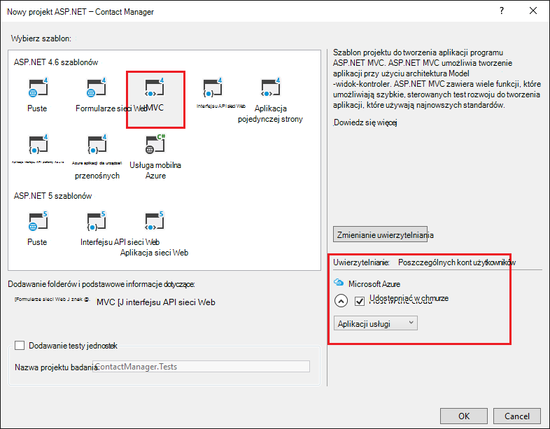
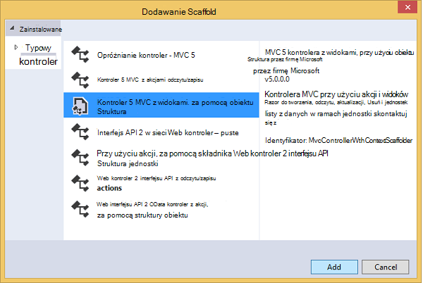

<properties 
    pageTitle="Tworzenie aplikacji programu ASP.NET MVC z auth i bazy danych SQL i wdrażanie Azure aplikacji usługi" 
    description="Dowiedz się, jak opracowywania aplikacji programu ASP.NET MVC 5 z wewnętrznej bazy danych SQL, Dodaj uwierzytelniania i autoryzacji i Wdroż Azure." 
    services="app-service\web" 
    documentationCenter=".net" 
    authors="Rick-Anderson" 
    writer="Rick-Anderson" 
    manager="wpickett" 
    editor=""/>

<tags 
    ms.service="app-service-web" 
    ms.workload="web" 
    ms.tgt_pltfrm="na" 
    ms.devlang="dotnet" 
    ms.topic="article" 
    ms.date="03/21/2016" 
    ms.author="riande"/> 

# Tworzenie aplikacji programu ASP.NET MVC z auth i bazy danych SQL i wdrażanie Azure aplikacji usługi

Ten samouczek pokazano, jak utworzyć bezpiecznego aplikacji sieci web programu ASP.NET MVC 5, umożliwiający użytkownikom logowanie się przy użyciu poświadczeń z serwisu Facebook lub Google. Aplikacja jest prosta lista kontaktów, używaną Framework jednostki ADO.NET na potrzeby dostępu do bazy danych. [Usługa Azure aplikacji](http://go.microsoft.com/fwlink/?LinkId=529714)będzie wdrożyć aplikację. 

Na wykonanie samouczka, konieczne będzie aplikacji sieci web opartych na danych bezpiecznego w górę i uruchomiony w chmurze, a za pomocą bazy danych w chmurze. Na poniższej ilustracji przedstawiono stronę logowania dla aplikacji ukończone.

![Strona logowania][rxb]

Opisano następujące zagadnienia:

* Jak utworzyć bezpiecznego projektu sieci web programu ASP.NET MVC 5 w programie Visual Studio.
* Jak uwierzytelniania i autoryzacji użytkowników, którzy zalogują się przy użyciu poświadczeń z kont usługi Google lub Facebook (social dostawcy uwierzytelnianie za pomocą [OAuth 2.0](http://oauth.net/2 "http://oauth.net/2")).
* Jak uwierzytelniania i autoryzacji użytkowników, którzy rejestracji w bazie danych zarządzane przez aplikację (lokalny uwierzytelnianie przy użyciu [Tożsamości ASP.NET](http://asp.net/identity/)).
* Jak za pomocą ADO.NET jednostki Framework 6 kod pierwszego odczytywanie i zapisywanie danych w bazie danych SQL.
* Jak wdrożyć bazę danych przy użyciu obiektu ramach kod pierwszego migracji.
* Jak przechowywanie danych relacyjnych w chmurze za pomocą bazy danych SQL Azure.
* Jak wdrożyć projektu sieci web, korzystającego z bazy danych do [aplikacji sieci web](http://go.microsoft.com/fwlink/?LinkId=529714) w usłudze Azure aplikacji.

>[AZURE.NOTE] Jest to długi samouczka. Jeśli chcesz krótkie wprowadzenie do usługi aplikacji Azure i Visual Studio projektów sieci web, zobacz [Tworzenie aplikacji sieci web programu ASP.NET w usłudze Azure aplikacji](web-sites-dotnet-get-started.md). Do rozwiązywania problemów informacje, zobacz sekcję [Rozwiązywanie problemów](#troubleshooting) .
>
>Lub jeśli chcesz rozpocząć pracę z Azure aplikacji usługi przed utworzeniem konta dla konta Azure, przejdź do pozycji [Wypróbuj aplikacji usługi](http://go.microsoft.com/fwlink/?LinkId=523751), którym natychmiast można utworzyć aplikację sieci web krótkotrwałe starter w aplikacji usługi. Nie kart kredytowych wymagane; nie zobowiązania.

## Wymagania wstępne

Aby użyć tego samouczka, potrzebne jest konto Microsoft Azure. Jeśli nie masz konta, możesz [uaktywnić programu Visual Studio subskrybentów korzyści](/pricing/member-offers/msdn-benefits-details/?WT.mc_id=A261C142F) lub [Utwórz konto w bezpłatnej wersji próbnej](/pricing/free-trial/?WT.mc_id=A261C142F).

Aby skonfigurować środowiska programowania, konieczne jest zainstalowanie [programu Visual Studio 2013 aktualizacji 5](http://go.microsoft.com/fwlink/?LinkId=390521) lub nowszy, a najnowszą wersję pakietu [SDK Azure dla środowiska .NET](http://go.microsoft.com/fwlink/?linkid=324322&clcid=0x409). W tym artykule zostały zapisane na Visual Studio aktualizacji 4 i SDK 2.8.1. Te instrukcje dotyczą Visual Studio 2015 z najnowszych [SDK Azure dla środowiska .NET](http://go.microsoft.com/fwlink/?linkid=518003&clcid=0x409) zainstalowany, ale niektóre ekrany wygląda inaczej niż ilustracje.

## Tworzenie aplikacji programu ASP.NET MVC 5

### Tworzenie projektu

1. W menu **plik** kliknij polecenie **Nowy projekt**.

    

1. W oknie dialogowym **Nowy projekt** rozwiń **C#** i wybierz **sieci Web** w obszarze **Zainstalowane szablony**, a następnie wybierz **Aplikację sieci Web programu ASP.NET**. Nazwa aplikacji **ContactManager**, a następnie kliknij **przycisk OK**.

    
 
    **Uwaga:** Upewnij się, że wprowadzone "ContactManager". Bloki kodu, które będzie można później kopiowanie przyjęto założenie, że nazwa projektu jest ContactManager. 

1. W oknie dialogowym **Nowy projekt ASP.NET** wybierz szablon **MVC** . Upewnij się, **Uwierzytelnianie** zostanie ustawiona na **Poszczególnych kont użytkowników**, **hosta w chmurze** jest zaznaczone pole wyboru i **Aplikacji usługi** jest zaznaczone.

    

1. Kliknij **przycisk OK**.

1. Zostanie wyświetlone okno dialogowe **Konfigurowanie Microsoft Azure ustawienia aplikacji Web App** . Może być konieczne, zaloguj się, jeśli nie masz już gotowe, lub wprowadź ponownie poświadczenia, jeśli wygasła nazwę użytkownika.

1. Opcjonalnie - Zmień pole wartość w polu **Nazwa aplikacji sieci Web** (patrz rysunek poniżej).

    Adres URL aplikacji sieci web będzie .azurewebsites {nazwa} .net, więc nazwa musi być unikatowa w domenie azurewebsites.net. Kreator konfiguracji proponuje unikatową nazwę, dołączając do nazwy projektu "ContactManager", a się dla tego samouczka.

5. **Grupa zasobów** listy rozwijanej wybierz istniejącej grupy lub **Utwórz nową grupę zasobów**(patrz rysunek poniżej). 

    Jeśli wolisz, można wybrać grupę zasobów, które już posiadasz. Jednak jeśli Tworzenie nowej grupy zasobów i używaj go tylko dla tego samouczka, będzie on łatwo usunąć wszystkie zasoby Azure, utworzone samouczka, po zakończeniu z nimi. Aby uzyskać informacje o grupach zasobów zobacz [Omówienie Menedżera zasobów Azure](../azure-resource-manager/resource-group-overview.md). 

5. W **aplikacji usługi plan** listy rozwijanej wybierz istniejący plan lub **Tworzenie nowej aplikacji usługi Planowanie**(patrz rysunek poniżej).

    Jeśli wolisz, możesz wybrać plan usług aplikacji, które już posiadasz. Aby uzyskać informacje o planach usługi aplikacji zobacz [Omówienie szczegółowo planów Azure aplikacji usługi](../app-service/azure-web-sites-web-hosting-plans-in-depth-overview.md). 

1. Wybierz **dodatkowe usługi Azure Eksploruj** do dodania z bazą danych SQL.

    

1. Naciśnij **+** ikonę, aby dodać bazy danych SQL.

    

1. Wybierz pozycję **Nowy** w oknie dialogowym **Konfigurowanie bazy danych SQL** :

    

1. Wprowadź nazwę dla administratorów i silnego hasła.

    

    Nazwa serwera musi być unikatowa. Może zawierać małe liter, cyfr i łączników. Nie może zawierać łącznik końcowych. Nazwa użytkownika i hasło są nowe poświadczenia tworzony dla nowego serwera. 

    Jeśli masz już z serwerem bazy danych, możesz wybrać który zamiast jednego. Serwer bazy danych są cenne zasób, a zazwyczaj chcesz utworzyć wiele baz danych na tym samym serwerze dla badania i rozwój zamiast tworzenia serwera bazy danych na bazę danych. Jednak w przypadku tego samouczka wystarczy serwer tymczasowo i tworząc na serwerze w tej samej grupy zasobów, co w witrynie sieci web możesz ułatwiają usuwanie oba zasoby aplikacji i bazy danych sieci web przez usunięcie grupa zasobów, po zakończeniu z samouczka. 

    Jeśli wybierzesz z istniejącą bazą danych, upewnij się, że aplikacji sieci web i bazy danych są w tym samym regionie.

    

4. Naciśnij przycisk **Utwórz**.

    Program Visual Studio tworzy projektu sieci web ContactManager, tworzy grupy zasobów i plan aplikacji usługi, który został wybrany, i tworzy aplikacji sieci web w usłudze Azure aplikacji o podanej nazwie.

### Ustawianie strony nagłówka i stopki

1. Otwórz plik *Layout.cshtml* w folderze *Views\Shared* w **Eksploratorze rozwiązań** .

    ![_Layout.cshtml w Eksploratorze rozwiązań][newapp004]

1. Zamień ActionLink w pliku *Layout.cshtml* poniższy kod.

    @Html.ActionLink("CMPokaz","Indeks","Kontakty", nowy {obszar =" "}, nowy { @class ="pasek nawigacyjny marki"})
                   

    Upewnij się, że Zmień trzeciego parametru z "Domu" do "Kontakty". Znaczniki powyżej utworzy łącze "Kontakty" na każdej stronie metody indeksu kontrolera kontaktów. Zmienianie nazwy aplikacji w nagłówek i stopka "Moja aplikacja ASP.NET" i "Nazwa aplikacji" do "Contact Manager" i "Pokaz CM". 
 
### Uruchom aplikację lokalnie

1. Naciśnij klawisze CTRL + F5, aby uruchomić aplikację.

    Strona główna aplikacji jest wyświetlana w domyślnej przeglądarce.

    

To wszystko, należy wykonać teraz utworzyć aplikację, która będzie Wdroż Azure. 

## Wdrażanie aplikacji Azure

1. W programie Visual Studio kliknij prawym przyciskiem myszy projektu w **Eksploratorze rozwiązań** i z menu kontekstowego wybierz pozycję **Publikuj** .

    
    
    Zostanie otwarty Kreator **Publikowania w sieci Web** .

1. W oknie dialogowym **Publikowanie sieci Web** kliknij pozycję **Publikuj**.

    

    Aplikacja utworzonej teraz jest uruchomiona w chmurze. Przy następnym wdrożyć aplikację, zostanie wdrożony tylko pliki (nowe lub zmienione).

    

## Włączanie protokołu SSL dla projektu ##

1. W **Eksploratorze rozwiązań**kliknij pozycję projekt **ContactManager** , a następnie naciśnij klawisz F4, aby otworzyć okno **Właściwości** .

3. Zmienianie **włączony protokół SSL** **wartość PRAWDA**. 

4. Skopiuj adres **SSL URL**.

    Adres URL SSL będzie https://localhost:44300 / chyba że zostało już wcześniej utworzone aplikacje sieci web SSL.

    ![Włączanie protokołu SSL][rxSSL]
 
1. W **Eksploratorze rozwiązań**kliknij prawym przyciskiem myszy projektu **Contact Manager** , a następnie kliknij polecenie **Właściwości**.

1. Kliknij kartę **sieci Web** .

1. Zmień **Adres Url programu Project** , używać **Adresu URL SSL** i Zapisz stronę (kontrolki S).

    
 
1. Sprawdź, czy program Internet Explorer jest przeglądarki, która powoduje uruchomienie programu Visual Studio, jak pokazano na poniższej ilustracji:

    

    Selektor przeglądarki umożliwia określenie przeglądarki, który powoduje uruchomienie programu Visual Studio. Można wybrać wielu przeglądarek i masz Visual Studio aktualizacja każdej przeglądarki, gdy wprowadzisz zmiany. Aby uzyskać więcej informacji, zobacz [Przy użyciu przeglądarki łącze w Visual Studio 2013](http://www.asp.net/visual-studio/overview/2013/using-browser-link).

    

1. Naciśnij klawisze CTRL + F5, aby uruchomić aplikację. Kliknij przycisk **Tak,** aby rozpocząć proces zaufanie certyfikatu z podpisem własnym, który wygenerował Express usług IIS.

     

1. Przeczytaj okno dialogowe **Ostrzeżenie o zabezpieczeniach** , a następnie kliknij przycisk **Tak** , jeśli chcesz zainstalować certyfikat reprezentujący **host lokalny**.

    

1. IE przedstawia stronę *dla użytkowników domowych* i Brak ostrzeżeń SSL.

     

     Program Internet Explorer jest dobrym rozwiązaniem, gdy używasz protokołu SSL, ponieważ akceptuje certyfikat i jest wyświetlana zawartość HTTPS bez ostrzeżenia. Microsoft Edge i Google Chrome również zaakceptować certyfikat. Firefox używa magazynu certyfikatów, aby wyświetlał ostrzeżenie.

     

## Dodawanie bazy danych do aplikacji

Następnie będzie zaktualizować aplikację, aby dodać możliwość wyświetlania i Aktualizuj kontakty i przechowywania danych w bazie danych. Aplikacja użyje Framework jednostki (EF) do utworzenia bazy danych, a także odczytywanie i aktualizowanie danych.

### Dodawanie klas modelu danych dla kontaktów

Możesz rozpocząć od tworzenia modelu proste dane w kodzie.

1. W **Eksploratorze rozwiązań**kliknij prawym przyciskiem myszy folder modeli, kliknij przycisk **Dodaj**, a następnie **zajęć**.

    

2. W oknie dialogowym **Dodawanie nowego elementu** nazwę nowego pliku klasy *Contact.cs*, a następnie kliknij przycisk **Dodaj**.

    ![Dodawanie nowego elementu, okno dialogowe][adddb002]

3. Zamień zawartość pliku Contact.cs poniższy kod.

        using System.ComponentModel.DataAnnotations;
        using System.Globalization;
        namespace ContactManager.Models
        {
            public class Contact
            {
                public int ContactId { get; set; }
                public string Name { get; set; }
                public string Address { get; set; }
                public string City { get; set; }
                public string State { get; set; }
                public string Zip { get; set; }
                [DataType(DataType.EmailAddress)]
                public string Email { get; set; }
            }
        }
**Skontaktuj się z** klasa określa dane, które będą przechowywane na każdym kontakcie, oraz klucz podstawowy, *wartość ContactID*, które są potrzebne w bazie danych.

### Tworzenie stron sieci web, które umożliwiają użytkownikom aplikacji do pracy z kontaktami

Funkcja rusztowania ASP.NET MVC mogą automatycznie generować kod, który wykonuje tworzenie, odczytywanie, aktualizowanie i usuwanie akcji (OBSŁUGIWAŁ). 

1. Tworzenie projektu **(Ctrl + Shift + B)**. (Należy utworzyć projektu przed użyciem mechanizmu rusztowania.)
 
1. W **Eksploratorze rozwiązań**kliknij prawym przyciskiem myszy folder kontrolerów i kliknij przycisk **Dodaj**, a następnie kliknij **Kontroler**.

    ![Dodawanie kontrolera w menu kontekstowe folderu kontrolery][addcode001]

5. W oknie dialogowym **Dodawanie Scaffold** wybierz **MVC kontroler 5 z widokami, za pomocą EF** , a następnie kliknij przycisk **Dodaj**.
    
    

1. W polu listy rozwijanej **Klasa modelu** zaznacz **kontakt (ContactManager.Models)**. (Patrz rysunek poniżej).

1. **Klasy kontekstu danych**wybierz pozycję **ApplicationDbContext (ContactManager.Models)**. **ApplicationDbContext** będzie używana zarówno członkostwa bazy danych, jak i dane kontaktowe.

    

1. Kliknij przycisk **Dodaj**.

   Programu Visual Studio powoduje kontrolera z metod i widoki OBSŁUGIWAŁ operacje na bazie danych dla obiektów **kontaktu** .

## Włączanie migracji, tworzenie bazy danych, Dodawanie przykładowych danych i inicjator danych ##

Następnego zadania należy włączyć funkcję [Migracji pierwszego kodu](http://msdn.microsoft.com/library/hh770484.aspx) w celu tworzenia tabel bazy danych na podstawie modelu danych, utworzone przez Ciebie.

1. W menu **Narzędzia** wybierz **Menedżera pakietów NuGet** , a następnie **Konsoli Menedżera pakietów**.

    

2. W oknie **Menedżer pakietów konsoli** wpisz następujące polecenie:

        enable-migrations

    Polecenie **Włącz migracji** tworzy folder *migracji* i umieszcza w tym folderze plik *Configuration.cs* , który można edytować w celu zapełnić bazę danych i konfigurowanie migracji. 

2. W oknie **Menedżer pakietów konsoli** wpisz następujące polecenie:

        add-migration Initial

    Polecenie **Dodaj migracji początkowy** generuje plik o nazwie ** &lt;date_stamp&gt;początkowe** w folderze *migracji* . Kod w tym pliku tworzy tabel bazy danych. Pierwszy parametr ( **początkowej** ) służy do tworzenia nazwę pliku. Widać nowych plików klas w **Eksploratorze rozwiązań**.

    W klasie **początkowej** metoda **w górę** tworzy tabelę Kontakty, a **w dół** metodę (Jeśli chcesz powrócić do poprzedniego stanu) umieści go.

3. Otwórz plik *Migrations\Configuration.cs* . 

4. Dodaj następujący `using` instrukcji. 

         using ContactManager.Models;

5. Zastąp metodę *nasion* następujący kod:

        protected override void Seed(ContactManager.Models.ApplicationDbContext context)
        {
            context.Contacts.AddOrUpdate(p => p.Name,
               new Contact
               {
                   Name = "Debra Garcia",
                   Address = "1234 Main St",
                   City = "Redmond",
                   State = "WA",
                   Zip = "10999",
                   Email = "debra@example.com",
               },
                new Contact
                {
                    Name = "Thorsten Weinrich",
                    Address = "5678 1st Ave W",
                    City = "Redmond",
                    State = "WA",
                    Zip = "10999",
                    Email = "thorsten@example.com",
                },
                new Contact
                {
                    Name = "Yuhong Li",
                    Address = "9012 State st",
                    City = "Redmond",
                    State = "WA",
                    Zip = "10999",
                    Email = "yuhong@example.com",
                },
                new Contact
                {
                    Name = "Jon Orton",
                    Address = "3456 Maple St",
                    City = "Redmond",
                    State = "WA",
                    Zip = "10999",
                    Email = "jon@example.com",
                },
                new Contact
                {
                    Name = "Diliana Alexieva-Bosseva",
                    Address = "7890 2nd Ave E",
                    City = "Redmond",
                    State = "WA",
                    Zip = "10999",
                    Email = "diliana@example.com",
                }
                );
        }

    Ten kod inicjuje (nasiona) bazy danych za pomocą informacji kontaktowych. Aby uzyskać więcej informacji na obsługiwanie bazy danych zobacz [Określanie wartości początkowej i DBs debugowanie jednostki Framework (EF)](http://blogs.msdn.com/b/rickandy/archive/2013/02/12/seeding-and-debugging-entity-framework-ef-dbs.aspx). Utwórz projekt, aby sprawdzić, czy nie występują żadne błędy kompilacji.

6. W **Konsoli Menedżera pakietów** wprowadź polecenie:

        update-database

    ![Polecenia konsoli Menedżera pakietów][addcode009]

    **Baza danych aktualizacji** uruchamia pierwszej migracji, co spowoduje utworzenie bazy danych. Domyślnie baza danych jest tworzona jako bazy danych programu SQL Server Express LocalDB. 

7. Naciśnij klawisze CTRL + F5, aby uruchomić aplikację, a następnie kliknij łącze **Pokaz CM** ; lub przejdź do https://localhost:(port#)/Cm. 

    Aplikacja są wyświetlane dane nasion i łącza edycji, szczegóły i Usuń. Można tworzyć, edytować, usuwanie i wyświetlanie danych.

    ![MVC widok danych][rx2]

## Dodawanie dostawcy uwierzytelnianie OAuth2

>[AZURE.NOTE] Aby uzyskać szczegółowe instrukcje dotyczące sposobu używania Google i Facebook deweloper witryn portalu, ten samouczek łącza do samouczków w witrynie programu ASP.NET. Jednak Google i Facebook zmienić częściej niż te samouczki są aktualizowane i są teraz nieaktualny witryn. Jeśli masz problemy z zgodnie ze wskazówkami, zobacz polecanych komentarz Disqus na końcu tego samouczka, aby uzyskać listę co zostało zmienione. 

[OAuth] (http://oauth.net/ "http://OAuth.NET/") jest otwarte protokół, który umożliwia bezpieczne autoryzacji prosty, standardowy metody z aplikacji sieci web urządzeń przenośnych i stacjonarnych. Szablon internet ASP.NET MVC używa OAuth udostępniania Facebook, Twitter, Google i firmy Microsoft jako dostawcy uwierzytelniania. Chociaż tego samouczka jest używany tylko Google jako dostawca uwierzytelniania, można łatwo modyfikować kod, aby użyć dowolnej z tych dostawców. Kroki w celu wykonania innych dostawców usług są bardzo podobne do kroków, które są widoczne w tym samouczku. Aby użyć Facebook jako dostawca uwierzytelniania, zobacz [MVC 5 aplikacji z serwisem Facebook, Twitter, LinkedIn i uwierzytelnianie Google OAuth2 logowania jednokrotnego ](http://www.asp.net/mvc/tutorials/mvc-5/create-an-aspnet-mvc-5-app-with-facebook-and-google-oauth2-and-openid-sign-on).

Oprócz uwierzytelnianie tego samouczka używa ról w celu zaimplementowania autoryzacji. Tylko tych użytkowników, które można dodać do roli *canEdit* będą mogli zmieniać dane (to znaczy, tworzenie, edytowanie lub usuwanie kontaktów).

1. Postępuj zgodnie z instrukcjami w [Aplikacji 5 MVC z serwisem Facebook, Twitter, LinkedIn i uwierzytelnianie Google OAuth2 logowania jednokrotnego](http://www.asp.net/mvc/tutorials/mvc-5/create-an-aspnet-mvc-5-app-with-facebook-and-google-oauth2-and-openid-sign-on#goog) w obszarze **dotyczący tworzenia aplikacji Google OAuth 2 Konfigurowanie aplikacji dla usługi Google dla uwierzytelnianie OAuth2**.

3. Uruchom i przetestuj aplikację, aby sprawdzić, czy można zalogować się przy użyciu funkcji uwierzytelniania Google.

2. Jeśli chcesz utworzyć przyciski społecznościowych logowania ikonami specyficzne dla dostawcy są wyświetlane [przyciski zasadzie społecznościowych logowania programu ASP.NET MVC 5](http://www.jerriepelser.com/blog/pretty-social-login-buttons-for-asp-net-mvc-5)

## Za pośrednictwem członkostwa interfejsu API

W tej sekcji dodasz użytkowników lokalnych i roli *canEdit* członkostwa w bazie danych. Tylko użytkownicy w roli *canEdit* będą mogli edytować dane. Najlepszym rozwiązaniem jest role nazwę akcje, które mogą wykonywać, więc *canEdit* jest preferowane roli o nazwie *Administrator*. Aplikacja rozwoju, można dodawać nowe role, takie jak *canDeleteMembers* zamiast mniej opisowe *superAdmin*.

1. Otwórz plik *migrations\configuration.cs* i Dodaj następujący `using` instrukcje:

        using Microsoft.AspNet.Identity;
        using Microsoft.AspNet.Identity.EntityFramework;

1. Dodaj następujące metody **AddUserAndRole** klasy:

        bool AddUserAndRole(ContactManager.Models.ApplicationDbContext context)
        {
            IdentityResult ir;
            var rm = new RoleManager<IdentityRole>
                (new RoleStore<IdentityRole>(context));
            ir = rm.Create(new IdentityRole("canEdit"));
            var um = new UserManager<ApplicationUser>(
                new UserStore<ApplicationUser>(context));
            var user = new ApplicationUser()
            {
                UserName = "user1@contoso.com",
            };
            ir = um.Create(user, "P_assw0rd1");
            if (ir.Succeeded == false)
                return ir.Succeeded;
            ir = um.AddToRole(user.Id, "canEdit");
            return ir.Succeeded;
        }

1. Nowa metoda połączeń z metody **nasion** :

        protected override void Seed(ContactManager.Models.ApplicationDbContext context)
        {
            AddUserAndRole(context);
            context.Contacts.AddOrUpdate(p => p.Name,
                // Code removed for brevity
        }

    Poniższe obrazy są pokazywane zmiany metody *nasion* :

    

    Ten kod umożliwia utworzenie nowej roli o nazwie *canEdit*— powoduje utworzenie nowego użytkownika lokalnego *user1@contoso.com*i dodanie *user1@contoso.com* do roli *canEdit* . Aby uzyskać więcej informacji zobacz [samouczki tożsamości ASP.NET](http://www.asp.net/identity/overview/features-api) w witrynie programu ASP.NET.

## Przy użyciu kodu tymczasowe do dodawania nowych użytkowników logowania społecznościowych canEdit roli  ##

W tej sekcji będą tymczasowo zmodyfikować metodę **ExternalLoginConfirmation** kontrolerze konta dodawania nowych użytkowników rejestrowanie z dostawcą OAuth do roli *canEdit* . Firma Microsoft dotyczy zapewniają narzędzie podobne do [WSAT](http://msdn.microsoft.com/library/ms228053.aspx) w przyszłości umożliwiające tworzenie i edytowanie kont użytkowników i ról. Do tego czasu można wykonywać przy użyciu kodu tymczasowe tę samą funkcję.

1. Otwórz plik **Controllers\AccountController.cs** i przejdź do metody **ExternalLoginConfirmation** .

1. Dodaj poniższe wywołanie **AddToRoleAsync** bezpośrednio przed połączenia **SignInAsync** .

        await UserManager.AddToRoleAsync(user.Id, "canEdit");

   Powyższy kod dodaje nowo zarejestrowanych użytkowników do roli "canEdit", co daje im dostępu do metod akcji, które zmiany danych (Edytuj). Poniższy fragment zawiera nowego wiersza kodu w kontekście.

          // POST: /Account/ExternalLoginConfirmation
          [HttpPost]
          [AllowAnonymous]
          [ValidateAntiForgeryToken]
          public async Task ExternalLoginConfirmation(ExternalLoginConfirmationViewModel model, string returnUrl)
          {
             if (User.Identity.IsAuthenticated)
             {
                return RedirectToAction("Index", "Manage");
             }
             if (ModelState.IsValid)
             {
                // Get the information about the user from the external login provider
                var info = await AuthenticationManager.GetExternalLoginInfoAsync();
                if (info == null)
                {
                   return View("ExternalLoginFailure");
                }
                var user = new ApplicationUser { UserName = model.Email, Email = model.Email };
                var result = await UserManager.CreateAsync(user);
                if (result.Succeeded)
                {
                   result = await UserManager.AddLoginAsync(user.Id, info.Login);
                   if (result.Succeeded)
                   {
                      await UserManager.AddToRoleAsync(user.Id, "canEdit");
                      await SignInManager.SignInAsync(user, isPersistent: false, rememberBrowser: false);
                      return RedirectToLocal(returnUrl);
                   }
                }
                AddErrors(result);
             }
             ViewBag.ReturnUrl = returnUrl;
             return View(model);
          }

W dalszej części samouczka wdrażania aplikacji Azure, gdzie można będzie dziennika przy użyciu Google lub innego dostawcy uwierzytelniania innej firmy. Spowoduje to dodanie konta nowo zarejestrowanych do roli *canEdit* . Każda osoba, która umożliwia znalezienie adresu URL aplikacji sieci web i identyfikatorze Google można zarejestrować i aktualizowanie bazy danych. Aby uniemożliwić innym osobom, które, możesz wyłączyć witryny. Będzie można sprawdzić, kto jest w roli *canEdit* sprawdzając bazy danych.

W **Konsoli Menedżera pakietów** naciśnij klawisz Strzałka w górę, aby wyświetlić następujące polecenie:

        Update-Database

Metoda **nasion** zostanie uruchomione polecenie **Bazy danych aktualizacji** i uruchamiające metodę **AddUserAndRole** dodaną wcześniej. Metoda **AddUserAndRole** tworzy użytkownik *user1@contoso.com* i dodaje ją do roli *canEdit* .

## Ochrona aplikacji przy użyciu protokołu SSL i atrybut Autoryzuj ##

W tej sekcji, możesz zastosować atrybut [Autoryzuj](http://msdn.microsoft.com/library/system.web.mvc.authorizeattribute.aspx) ograniczenia dostępu do metody akcji. Anonimowe użytkownicy będą mogli wyświetlać tylko metody akcji **indeksu** kontrolera głównym. Zarejestrowany użytkownicy będą mogli widzieć danych kontaktów ( **indeks** i **Szczegóły** strony kontrolera Cm), strony informacje i strony kontaktu. Tylko użytkownicy w roli *canEdit* będzie metody akcji dostępu, które zmiany danych.

1. Otwórz plik *App_Start\FilterConfig.cs* i zastąpić metodę *RegisterGlobalFilters* poniżej (które dodaje dwóch filtrów):

        public static void RegisterGlobalFilters(GlobalFilterCollection filters)
        {
            filters.Add(new HandleErrorAttribute());
            filters.Add(new System.Web.Mvc.AuthorizeAttribute());
            filters.Add(new RequireHttpsAttribute());
        }
        
    Kod dodaje filtr [Autoryzuj](http://msdn.microsoft.com/library/system.web.mvc.authorizeattribute.aspx) i filtr [RequireHttps](http://msdn.microsoft.com/library/system.web.mvc.requirehttpsattribute.aspx) do aplikacji. Filtr [Autoryzuj](http://msdn.microsoft.com/library/system.web.mvc.authorizeattribute.aspx) uniemożliwia użytkownikom anonimowym uzyskiwanie dostępu do dowolnego metod w aplikacji. Atrybut [AllowAnonymous](http://blogs.msdn.com/b/rickandy/archive/2012/03/23/securing-your-asp-net-mvc-4-app-and-the-new-allowanonymous-attribute.aspx) użyje Aby zaprzestać korzystania z wymogów autoryzacji kilka metod, aby anonimowi użytkownicy można zalogować się i można wyświetlać na stronie głównej. [RequireHttps](http://msdn.microsoft.com/library/system.web.mvc.requirehttpsattribute.aspx) wymaga dostęp do aplikacji sieci web za pośrednictwem protokołu HTTPS.

    Podejściem alternatywnym jest dodanie atrybut [Autoryzuj](http://msdn.microsoft.com/library/system.web.mvc.authorizeattribute.aspx) i atrybut [RequireHttps](http://msdn.microsoft.com/library/system.web.mvc.requirehttpsattribute.aspx) w każdym kontrolerze, ale uwzględniono ze względów bezpieczeństwa do dotyczą całej aplikacji. Dodając je globalnie, każdej nowej metody kontroler i akcji, dodawany jest automatycznie chronione — nie trzeba pamiętać o ich zastosowania. Aby uzyskać więcej informacji zobacz [zabezpieczania aplikacji MVC ASP.NET i nowy atrybut AllowAnonymous](http://blogs.msdn.com/b/rickandy/archive/2012/03/23/securing-your-asp-net-mvc-4-app-and-the-new-allowanonymous-attribute.aspx). 

1. Dodaj atrybut [AllowAnonymous](http://blogs.msdn.com/b/rickandy/archive/2012/03/23/securing-your-asp-net-mvc-4-app-and-the-new-allowanonymous-attribute.aspx) metody **indeksu** kontrolera Narzędzia główne. Atrybut [AllowAnonymous](http://blogs.msdn.com/b/rickandy/archive/2012/03/23/securing-your-asp-net-mvc-4-app-and-the-new-allowanonymous-attribute.aspx) umożliwia biała lista metod, które chcesz zaprzestać korzystania z autoryzacji. 

        public class HomeController : Controller
        {
          [AllowAnonymous]
          public ActionResult Index()
          {
             return View();
          }

    Po wykonaniu globalne wyszukiwanie *AllowAnonymous*pojawi się, że jest on używany w metody logowania i rejestracji konta administratora.

1. W *CmController.cs*, Dodaj `[Authorize(Roles = "canEdit")]` metod HttpGet i HttpPost, które zmiany danych (Tworzenie, edytowanie, Usuń, każdej metody akcji, z wyjątkiem indeks i szczegóły) w kontrolerze *Cm* . Poniżej przedstawiono część złożonym kodu: 

        // GET: Cm/Create
        [Authorize(Roles = "canEdit")]
        public ActionResult Create()
        {
           return View(new Contact { Address = "123 N 456 W",
            City="Great Falls", Email = "ab@cd.com", Name="Joe Smith", State="MT",
           Zip = "59405"});
        }
        // POST: Cm/Create
        // To protect from overposting attacks, please enable the specific properties you want to bind to, for 
        // more details see http://go.microsoft.com/fwlink/?LinkId=317598.
        [HttpPost]
        [ValidateAntiForgeryToken]
         [Authorize(Roles = "canEdit")]
        public ActionResult Create([Bind(Include = "ContactId,Name,Address,City,State,Zip,Email")] Contact contact)
        {
            if (ModelState.IsValid)
            {
                db.Contacts.Add(contact);
                db.SaveChanges();
                return RedirectToAction("Index");
            }
            return View(contact);
        }
        // GET: Cm/Edit/5
        [Authorize(Roles = "canEdit")]
        public ActionResult Edit(int? id)
        {
            if (id == null)
            {
                return new HttpStatusCodeResult(HttpStatusCode.BadRequest);
            }
            Contact contact = db.Contacts.Find(id);
            if (contact == null)
            {
                return HttpNotFound();
            }
            return View(contact);
        }
        
1. Naciśnij klawisze CTRL + F5, aby uruchomić aplikację.

1. Jeśli nadal zalogowany z poprzedniej sesji, kliknij łącze **Wyloguj się** .

1. Kliknij łącza **o** lub **kontakt** . Nastąpi przekierowanie do strony logowania, ponieważ w przypadku użytkowników anonimowych nie można wyświetlić te strony.

1. Kliknij łącze **zarejestrować jako nowego użytkownika** i dodawanie użytkownika lokalnego z pocztą e-mail *joe@contoso.com*. Upewnij się, *Joe* może wyświetlać domu, informacje i kontakt stron. 

    

1. Kliknij łącze *Pokaz CM* i sprawdź, czy możesz zobaczyć dane.

1. Kliknij pozycję Edytuj łącza na stronie, nastąpi przekierowanie do strony logowania (ponieważ nowego użytkownika lokalnego nie jest dodawany do roli *canEdit* ).

1. Zaloguj się jako *user1@contoso.com* przy użyciu hasła "P_assw0rd1" ("0" w "word" wynosi zero). Nastąpi przekierowanie do strony Edytowanie wcześniej wybranych. 
2. 

    Jeśli nie można zalogować się przy użyciu tego konta i hasła, spróbuj skopiować hasło z kodu źródłowego i wkleić go. Jeśli nadal nie możesz zalogować się, sprawdź kolumnę **Nazwa użytkownika** tabeli **AspNetUsers** w celu zweryfikowania *user1@contoso.com* został dodany. 

1. Sprawdź, czy można zmieniać dane.

## Wdrażanie aplikacji Azure

1. W programie Visual Studio kliknij prawym przyciskiem myszy projektu w **Eksploratorze rozwiązań** i z menu kontekstowego wybierz pozycję **Publikuj** .

    ![Publikowanie w menu kontekstowym projektu][firsdeploy003]

    Zostanie otwarty Kreator **Publikowania w sieci Web** .

1. Kliknij kartę **Ustawienia** po lewej stronie okna dialogowego **Publikuj sieć Web** . 

2. W obszarze **ApplicationDbContext** wybierz bazę danych, utworzony podczas tworzenia projektu.
   

1. W obszarze **ContactManagerContext**wybierz **Wykonywanie kodu pierwszej migracji**.

    

1. Kliknij przycisk **Publikuj**.

1. Zaloguj się jako *user1@contoso.com* (przy użyciu hasła "P_assw0rd1") i sprawdź, czy można edytować dane.

1. Wyloguj się.

1. Przejdź do [Konsoli deweloperów Google](https://console.developers.google.com/) i **poświadczenia** kartę Aktualizuj Przekieruj identyfikatory URI i JavaScript Orgins korzystania z adresów URL Azure.

1. Zaloguj się przy użyciu Google lub Facebook. Które będzie dodać konto Google lub Facebook do roli **canEdit** . Jeśli zostanie wyświetlony komunikat o błędzie HTTP 400 z tą wiadomością *przekierowania URI w wezwaniu: https://contactmanager {Moje version}.azurewebsites.net/signin-google jest niezgodny z zarejestrowanych przekierowanie identyfikatora URI.*, konieczne będzie poczekaj, aż zmiany są przenoszone. Jeśli ten błąd został wyświetlony po więcej niż kilka minut, sprawdź poprawność identyfikatory URI są poprawne.

### Zatrzymywanie aplikacji sieci web, aby zapobiec rejestrowaniu przez inne osoby  

1. W **Eksploratorze serwera**, przejdź do **Azure > aplikacji usługi > {grupy zasobów} > {aplikacji sieci web}**.

4. Kliknij prawym przyciskiem myszy aplikacji sieci web i wybierz pozycję **Zatrzymaj**. 

    Możesz też [Azure Portal](https://portal.azure.com/)możesz można przejdź do pozycji Karta aplikacji sieci web, a następnie kliknij ikonę **Zatrzymaj** w górnej części karta.

    

### Usuwanie AddToRoleAsync, publikowanie i testowanie

1. Komentarz lub usunąć poniższy kod metody **ExternalLoginConfirmation** na kontrolerze konta:

        await UserManager.AddToRoleAsync(user.Id, "canEdit");

1. Tworzenie projektu (który zapisuje zmiany plików, a następnie sprawdza, czy nie ma błędów kompilacji).

5. Kliknij prawym przyciskiem myszy projektu w **Eksploratorze rozwiązań** i wybierz pozycję **Publikuj**.

       
    
4. Kliknij przycisk **Start** . Wdrożone są tylko te pliki, które muszą zostać zaktualizowane.

5. Uruchom aplikację sieci web, z programu Visual Studio lub z portalu. **Nie można opublikować, gdy jest zatrzymana aplikacji sieci web**.

    

5. Wróć do programu Visual Studio i kliknij pozycję **Publikuj**.

3. Aplikacji Azure otwarty w domyślnej przeglądarce. Jeśli zalogowano się wylogować się, aby można było wyświetlić strony głównej jako użytkownik anonimowy.  

4. Kliknij łącze **dotyczące** . Nastąpi przekierowanie do dziennika na stronie.

5. Kliknij łącze **Rejestrowanie** w dzienniku na stronie i Utwórz konta lokalnego. Aby sprawdzić, masz dostęp do odczytu tylko stron, ale nie masz dostępu do stron, które zmiany danych (który jest chroniony przez tę rolę *canEdit* ) użyjemy tego konta lokalnego. Później samouczka spowoduje usunięcie dostępu do konta lokalnego. 

    

1. Upewnij się, że możesz przejść do strony *o* i *kontaktu* .

    

1. Kliknij łącze **Pokaz CM** , przejdź do kontroler **Cm** . Można także dołączyć *Cm* , do określonego adresu URL. 

    
 
1. Kliknij łącze Edytuj. 

    Nastąpi przekierowanie do strony logowania. 

2. W obszarze **innej usługi, aby zalogować się za pomocą**, Google kliknij lub Facebook i zaloguj się przy użyciu konta wcześniej zarejestrowany. (Jeśli pracujesz w szybko i usługi cookie sesji nie został przekroczony, będziesz się automatycznie logować się do konta Google lub Facebook poprzednio używanego.)

2. Upewnij się, że można edytować dane po zalogowaniu się do tego konta.

    **Uwaga:** Nie można się Wyloguj się z usługi Google z tej aplikacji i dziennika na konto google różnych z tej samej przeglądarki. Jeśli korzystasz z jednej przeglądarki, konieczne będzie przejdź do usługi Google i wyloguj się. Zalogowanie z innym kontem z tym samym uwierzytelnianiem innej firmy (na przykład Google) przy użyciu innej przeglądarki.

    Jeśli nie masz wypełnił imię i nazwisko informacji o koncie usługi Google, wystąpi NullReferenceException.

## Sprawdź języka SQL Azure bazy danych ##

1. W **Eksploratorze serwera**, przejdź do **Azure > bazy danych programu SQL > {database}**

2. Kliknij prawym przyciskiem myszy bazę danych, a następnie wybierz polecenie **Otwórz w Eksploratorze obiektów SQL Server**.
 
    
 
3. Jeśli wcześniej nie nawiązano połączenie z tą bazą danych, może być wyświetlony monit o Dodawanie reguły zapory, aby włączyć dostęp do swojego adresu IP w bieżącym. Adres IP zostaną wstępnie wypełnione. Wystarczy kliknąć **Dodawanie reguły zapory** , aby umożliwić dostęp.

    

3. Zaloguj się do bazy danych przy użyciu nazwy użytkownika i hasła, określone podczas tworzenia serwera bazy danych. 
 
1. Kliknij prawym przyciskiem myszy tabelę **AspNetUsers** i wybierz **Widok danych**.

    
 
1. Uwaga identyfikator z konta Google zarejestrowanych w znajdować się w roli **canEdit** i identyfikator *user1@contoso.com*. Powinny być tylko użytkownicy w roli **canEdit** . (Można będzie Sprawdź, czy w następnym kroku.)

    
 
2. W **Eksploratorze obiektów SQL Server**kliknij prawym przyciskiem myszy **AspNetUserRoles** i wybierz **Wyświetlanie danych**.

    
 
3. Sprawdź, czy **Nazwa użytkownika** jest z *user1@contoso.com* i konto Google rejestrowania. 

## Rozwiązywanie problemów

Jeśli wystąpią problemy, poniżej przedstawiono kilka wskazówek, co wypróbować.

* Błędy inicjowania obsługi administracyjnej SQL bazy danych — upewnij się, bieżącego zestawu SDK zainstalowany. Wersje przed 2.8.1 mają powodujące w niektórych scenariuszach dotyczących błędów podczas próby utworzenia serwera bazy danych lub bazę danych w PORÓWNANIU z błędem.
* Komunikat o błędzie "Operacja nie jest obsługiwana dla typu oferty Twojej subskrypcji" podczas tworzenia Azure zasobów — jak wyżej.
* Błędy podczas wdrażania — należy rozważyć, czy przechodzące przez artykuł [podstawowe wdrożenie programu ASP.NET](web-sites-dotnet-get-started.md) . Scenariusz wdrażania jest prostsze, a jeśli masz ten sam problem może być łatwiejsza do wyodrębnienia. Na przykład w niektórych środowiskach enterprise zaporę firmową może zapobiec wdrażanie sieci Web wprowadzaniu rodzaje połączeń Azure, który jest wymagany.
* Możliwość zaznaczenie parametry połączenia w Kreatorze publikowanie sieci Web po wdrożeniu - innej metody został użyty do utworzenia Azure zasobów (na przykład chcesz wdrożyć aplikację sieci web i baza danych SQL utworzony w portalu) z bazą danych SQL nie mogą być skojarzone z aplikacji sieci web. Najprostszym rozwiązaniem jest utworzenie nowej aplikacji sieci web i bazy danych przy użyciu PORÓWNANIU, jak pokazano w samouczku. Nie trzeba rozpoczęcie przerabiania samouczka — kreatora Publikowanie sieci Web możesz wybrać opcję utworzenia nowej aplikacji sieci web i zostanie wyświetlony samej dialogowym Azure zasobów tworzenie zostanie wyświetlony po utworzeniu projektu.
* Wskazówki dotyczące Google lub Facebook dzięki portalowi deweloperów są nieaktualne — Zobacz polecane komentarz Disqus na końcu tego samouczka.

## Następne kroki

Została utworzona podstawowe aplikacji sieci web ASP.NET MVC, który uwierzytelnia użytkowników. Aby uzyskać więcej informacji na temat typowych zadań uwierzytelniania i w celu zabezpieczenia ważnych danych zobacz następujące samouczki.

- [Tworzenie bezpiecznego aplikacji sieci web programu ASP.NET MVC 5 z Zaloguj Resetowanie potwierdzenia i hasła poczty e-mail](http://www.asp.net/mvc/overview/getting-started/create-an-aspnet-mvc-5-web-app-with-email-confirmation-and-password-reset)
- [Aplikacja ASP.NET MVC 5 z usługi SMS i e-mail uwierzytelnianie dwuskładnikowe](http://www.asp.net/mvc/overview/getting-started/aspnet-mvc-5-app-with-sms-and-email-two-factor-authentication)
- [Najważniejsze wskazówki dotyczące wdrażania haseł i inne dane poufne ASP.NET i Azure](http://www.asp.net/identity/overview/features-api/best-practices-for-deploying-passwords-and-other-sensitive-data-to-aspnet-and-azure) 
- [Tworzenie aplikacji programu ASP.NET MVC 5 z serwisem Facebook i uwierzytelnianie Google OAuth2](http://www.asp.net/mvc/tutorials/mvc-5/create-an-aspnet-mvc-5-app-with-facebook-and-google-oauth2-and-openid-sign-on ) Dotyczy to również instrukcje dotyczące dodawania danych profilu, aby rejestracja użytkownika bazy danych, a także szczegółowe informacje na temat korzystania z serwisu Facebook jako dostawca uwierzytelniania.
- [Wprowadzenie do programu ASP.NET MVC 5](http://www.asp.net/mvc/tutorials/mvc-5/introduction/getting-started)

Bardziej zaawansowane samouczek dotyczący sposobu używania Framework jednostki zobacz [Wprowadzenie do EF i MVC](http://www.asp.net/mvc/tutorials/getting-started-with-ef-using-mvc/creating-an-entity-framework-data-model-for-an-asp-net-mvc-application).

Ten samouczek został zapisany przez [Anderson mającej](http://blogs.msdn.com/b/rickandy/) (serwisu Twitter [@RickAndMSFT](https://twitter.com/RickAndMSFT)) z pomocą Myrcha Toma i Dorrans Marcin (serwisu Twitter [@blowdart](https://twitter.com/blowdart)). 

***Należy pozostawić opinii*** na co polubiły lub chcesz wyświetlić usprawnia nie tylko o samouczka samej, ale również dotyczące produktów, które go zaprezentowano. Swoją opinię pomogą nam Wyznaczanie priorytetów ulepszenia. Można również zażądać i głosować na nowe tematy [Pokaż mi jak przy użyciu kodu](http://aspnet.uservoice.com/forums/228522-show-me-how-with-code).

## Informacje o zmianach

* Przewodnika do zmiany z witryn sieci Web do usługi aplikacji Zobacz: [Usługa Azure aplikacji i jego wpływ na istniejące usługi Azure](http://go.microsoft.com/fwlink/?LinkId=529714)

<!-- bookmarks -->
[Add an OAuth Provider]: #addOauth
[Using the Membership API]:#mbrDB
[Create a Data Deployment Script]:#ppd
[Update the Membership Database]:#ppd2

[setupwindowsazureenv]: #bkmk_setupwindowsazure
[createapplication]: #bkmk_createmvc4app
[deployapp1]: #bkmk_deploytowindowsazure1
[deployapp11]: #bkmk_deploytowindowsazure11
[adddb]: #bkmk_addadatabase

<!-- images-->
[rx2]: ./media/web-sites-dotnet-deploy-aspnet-mvc-app-membership-oauth-sql-database/rx2.png

[rx5]: ./media/web-sites-dotnet-deploy-aspnet-mvc-app-membership-oauth-sql-database-vs2013/rx5.png
[rx6]: ./media/web-sites-dotnet-deploy-aspnet-mvc-app-membership-oauth-sql-database-vs2013/rx6.png
[rx7]: ./media/web-sites-dotnet-deploy-aspnet-mvc-app-membership-oauth-sql-database-vs2013/rx7.png
[rx8]: ./media/web-sites-dotnet-deploy-aspnet-mvc-app-membership-oauth-sql-database-vs2013/rx8.png
[rx9]: ./media/web-sites-dotnet-deploy-aspnet-mvc-app-membership-oauth-sql-database-vs2013/rx9.png

[rxb]: ./media/web-sites-dotnet-deploy-aspnet-mvc-app-membership-oauth-sql-database/rxb.png

[rxSSL]: ./media/web-sites-dotnet-deploy-aspnet-mvc-app-membership-oauth-sql-database/rxSSL.png

[rxNOT]: ./media/web-sites-dotnet-deploy-aspnet-mvc-app-membership-oauth-sql-database-vs2013/rxNOT.png
[rxNOT2]: ./media/web-sites-dotnet-deploy-aspnet-mvc-app-membership-oauth-sql-database-vs2013/rxNOT2.png

[rxNOT]: ./media/web-sites-dotnet-deploy-aspnet-mvc-app-membership-oauth-sql-database-vs2013/rxNOT.png
[rxNOT]: ./media/web-sites-dotnet-deploy-aspnet-mvc-app-membership-oauth-sql-database-vs2013/rxNOT.png
[rxNOT]: ./media/web-sites-dotnet-deploy-aspnet-mvc-app-membership-oauth-sql-database-vs2013/rxNOT.png
[rr1]: ./media/web-sites-dotnet-deploy-aspnet-mvc-app-membership-oauth-sql-database-vs2013/rr1.png

[rxPrevDB]: ./media/web-sites-dotnet-deploy-aspnet-mvc-app-membership-oauth-sql-database-vs2013/rxPrevDB.png

[rxWSnew]: ./media/web-sites-dotnet-deploy-aspnet-mvc-app-membership-oauth-sql-database-vs2013/rxWSnew2.png
[rxCreateWSwithDB]: ./media/web-sites-dotnet-deploy-aspnet-mvc-app-membership-oauth-sql-database-vs2013/rxCreateWSwithDB.png

[setup007]: ./media/web-sites-dotnet-deploy-aspnet-mvc-app-membership-oauth-sql-database-vs2013/dntutmobile-setup-azure-site-004.png

[newapp004]: ./media/web-sites-dotnet-deploy-aspnet-mvc-app-membership-oauth-sql-database/dntutmobile-createapp-004.png

[firsdeploy003]: ./media/web-sites-dotnet-deploy-aspnet-mvc-app-membership-oauth-sql-database/dntutmobile-deploy1-publish-001.png

[adddb002]: ./media/web-sites-dotnet-deploy-aspnet-mvc-app-membership-oauth-sql-database/dntutmobile-adddatabase-002.png
[addcode001]: ./media/web-sites-dotnet-deploy-aspnet-mvc-app-membership-oauth-sql-database/dntutmobile-controller-add-context-menu.png

[addcode008]: ./media/web-sites-dotnet-deploy-aspnet-mvc-app-membership-oauth-sql-database-vs2013/dntutmobile-migrations-package-manager-menu.png
[addcode009]: ./media/web-sites-dotnet-deploy-aspnet-mvc-app-membership-oauth-sql-database/dntutmobile-migrations-package-manager-console.png

[Important information about ASP.NET in Azure web apps]: #aspnetwindowsazureinfo
[Next steps]: #nextsteps

[ImportPublishSettings]: ./media/web-sites-dotnet-deploy-aspnet-mvc-app-membership-oauth-sql-database-vs2013/ImportPublishSettings.png
 
