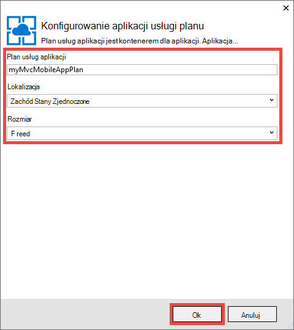
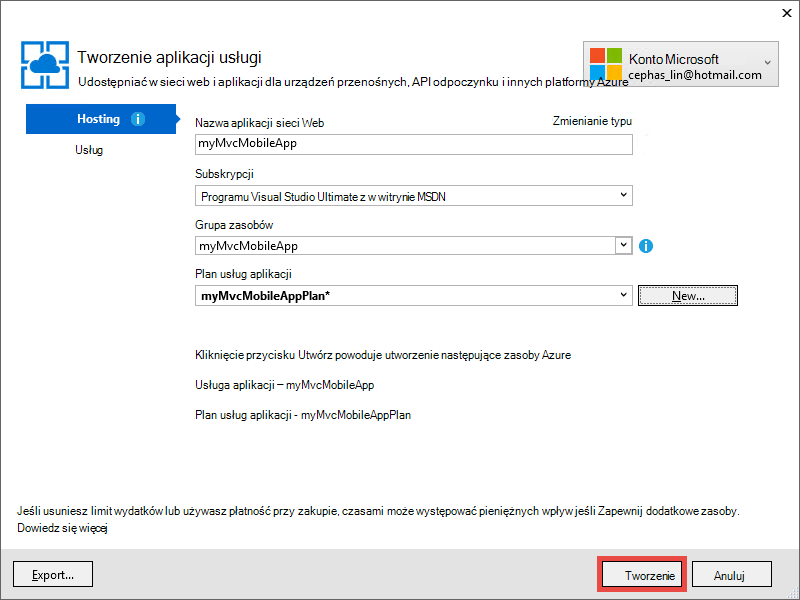

<properties 
    pageTitle="Wdrażanie aplikacji sieci web urządzeń przenośnych programu ASP.NET MVC 5 w Azure aplikacji usługi" 
    description="Samouczek, którą przedstawiono sposób wdrażanie aplikacji sieci web do usługi aplikacji Azure za pomocą funkcji urządzeń przenośnych w aplikacji sieci web programu ASP.NET MVC 5." 
    services="app-service" 
    documentationCenter=".net" 
    authors="cephalin" 
    manager="wpickett" 
    editor="jimbe"/>

<tags 
    ms.service="app-service" 
    ms.workload="na" 
    ms.tgt_pltfrm="na" 
    ms.devlang="dotnet" 
    ms.topic="article" 
    ms.date="01/12/2016" 
    ms.author="cephalin;riande"/>

# Wdrażanie aplikacji sieci web urządzeń przenośnych programu ASP.NET MVC 5 w Azure aplikacji usługi

Ten samouczek nauki podstawy do tworzenia aplikacji sieci web programu ASP.NET MVC 5 jest przyjazne mobile i Wdroż Azure aplikacji usługi. Ten samouczek, należy [Visual Studio Express 2013 dla sieci Web] [ Visual Studio Express 2013] lub professional edition programu Visual Studio, jeśli masz już który. Możesz użyć [programu Visual Studio 2015 r] a zrzutów ekranu będą inne należy użyć szablonów 4.x programu ASP.NET.

[AZURE.INCLUDE [create-account-and-websites-note](../../includes/create-account-and-websites-note.md)]

## Co będzie tworzenie

Ten samouczek, warto przenośnych funkcji prostych aplikacji konferencji listy, w której znajduje się w [projekcie starter][StarterProject]. Następujące zrzut ekranu sesji programu ASP.NET są wyświetlane w złożonym aplikacji, w emulatorze przeglądarki w narzędzi dla deweloperów programu Internet Explorer 11 F12.

![][FixedSessionsByTag]

Można użyć [Narzędzia Fiddler] i narzędzi dla deweloperów programu Internet Explorer 11 F12[ Fiddler] do debugowania aplikacji. 

## Umiejętności, które dowiesz się

Oto, czego się dowiesz:

-   Jak używać programu Visual Studio 2013 publikowanie aplikacji sieci web bezpośrednio do aplikacji sieci web w usłudze Azure aplikacji.
-   Jak szablonów programu ASP.NET MVC 5 korzystanie framework początkowego CSS, aby zwiększyć wyświetlania na urządzeniach przenośnych
-   Jak tworzyć widoki specyficzne dla mobile kierowania określone przeglądarki dla urządzeń przenośnych, takich jak iPhone i Android
-   Jak tworzyć widoki odpowiada (widoki, które odpowiadają na różnych przeglądarkach na urządzeniach)

## Konfigurowanie środowiska projektowego

Konfigurowanie środowiska programowania instalując Azure SDK dla środowiska .NET 2.5.1 lub nowszym. 

1. Aby zainstalować Azure SDK dla środowiska .NET, kliknij łącze poniżej. Jeśli nie masz programu Visual Studio 2013, jeszcze zainstalowany, zostanie zainstalowany przez łącze. Ten samouczek wymaga programu Visual Studio 2013. [Azure zestaw SDK programu Visual Studio 2013 r.][AzureSDKVs2013]
1. W oknie Instalatora platformy sieci Web kliknij przycisk **Zainstaluj** , a następnie kontynuuj instalację.

Konieczne będzie również emulatora przeglądarki dla urządzeń przenośnych. Działa dowolną z następujących czynności:

-   Emulator przeglądarki w [narzędzi dla deweloperów programu Internet Explorer 11 F12] [ EmulatorIE11] (używane wszystkie przeglądarki dla urządzeń przenośnych zrzuty ekranu). Ustawienia wstępne ciąg agenta użytkownika ma dla Windows Phone 8, Windows Phone 7 i iPad firmy Apple.
-   Emulator przeglądarki w [Google Chrome DevTools][EmulatorChrome]. Zawiera ustawień domyślnych dla wielu urządzeń z systemem Android, a także Apple iPhone, Apple iPad i Amazon Kindle Fire. Emuluje go też dotyku zdarzeń.
-   [Opera emulatora urządzeń przenośnych][EmulatorOpera]

Visual Studio projektów z C\# kodu źródłowego są dostępne w tym temacie dołączyć do:

-   [Pobieranie programu project Starter][StarterProject]
-   [Pobranie projektu zakończone][CompletedProject]

##Wdrażanie aplikacji sieci web Azure projektu starter

1.  Pobieranie aplikacji konferencji listy [projektu starter][StarterProject].

2.  Następnie w Eksploratorze Windows, kliknij prawym przyciskiem myszy pobrany plik ZIP i wybierz polecenie *Właściwości*.

3.  W oknie dialogowym **Właściwości** wybierz przycisk **Odblokuj** . (Odblokowanie zapobiega ostrzeżenie o zabezpieczeniach, wykonywana w przypadku próby skorzystania z pliku *zip* pobranego z sieci web).

4.  Kliknij prawym przyciskiem myszy plik ZIP i wybierz pozycję **Wyodrębnij wszystkie** Rozpakuj plik. 

5.  W programie Visual Studio Otwórz plik *C#\Mvc5Mobile.sln* .

6.  W oknie Eksplorator rozwiązań kliknij prawym przyciskiem myszy projektu, a następnie kliknij pozycję **Publikuj**.

    ![][DeployClickPublish]

7.  W sieci Web, publikowanie kliknij pozycję **Microsoft Azure aplikacji usługi**.

    ![][DeployClickWebSites]

8.  Jeśli jeszcze nie zostało przeprowadzone do Azure, kliknij pozycję **Dodaj konto**.

    ![][DeploySignIn]

9.  Postępuj zgodnie z instrukcjami, aby zalogować się do konta Azure.

11. Okno dialogowe usługi aplikacji powinna zostać wyświetlona zostanie jako zalogowany. Kliknij przycisk **Nowy**.

    ![][DeployNewWebsite]  

12. W polu **Nazwa aplikacji sieci Web** określ prefiks nazwy aplikacji unikatowe. Twoja nazwa aplikacji sieci web w pełni kwalifikowane będzie widoczna * &lt;prefiks >*. azurewebsites.net. Ponadto wybierz lub określ nazwę nowej grupy zasobów w **grupie zasobów**. Następnie kliknij przycisk **Nowy** , aby utworzyć nowy plan aplikacji usługi.

    ![][DeploySiteSettings]

13. Skonfiguruj nowy plan usług aplikacji, a następnie kliknij **przycisk OK**. 

    

13. W oknie dialogowym Tworzenie aplikacji usługi kliknij przycisk **Utwórz**.

     

13. Po Azure zasoby są tworzone, sieci Web publikowania, okno dialogowe zostanie wprowadzona wartość z ustawieniami dla nowej aplikacji. Kliknij przycisk **Publikuj**.

    ![][DeployPublishSite]

    Po zakończeniu programu Visual Studio publikowania projektu starter do aplikacji sieci Azure web przeglądarkę komputera stacjonarnego po otwarciu aplikacji sieci live web wyświetlane.

14. Rozpoczynanie emulatora swojej przeglądarce dla urządzeń przenośnych, skopiuj adres URL aplikacji konferencji (*<prefix>*. azurewebsites.net) do emulatorze, a następnie kliknij przycisk prawym górnym i wybierz pozycję **Przeglądaj według znaczników**. Jeśli korzystasz z jako domyślną przeglądarką Internet Explorer 11, wystarczy wpisać `F12`, następnie `Ctrl+8`, a następnie zmień profilu w przeglądarce **Windows Phone**. Na poniższej ilustracji przedstawiono widok *AllTags* w trybie pionowym (od po wybraniu opcji **Przeglądaj według znacznika**).

    ![][AllTags]

>[AZURE.TIP] Gdy można debugowanie aplikacji MVC 5 w programie Visual Studio, można publikować aplikacji sieci web Azure ponownie, aby sprawdzić aplikacji live web bezpośrednio w swojej przeglądarce dla urządzeń przenośnych lub emulatora przeglądarki.

Ekran jest bardzo czytelny na urządzeniu przenośnym. Można również są widoczne niektóre efektów wizualnych zastosowane w ramach początkowego CSS.
Kliknij łącze **ASP.NET** .

![][SessionsByTagASP.NET]

Widok tagów ASP.NET jest powiększenie dopasowany do ekranu, która początkowego dla Ciebie automatycznie. Jednak można poprawić ten widok, aby lepiej dopasować przeglądarki dla urządzeń przenośnych. Na przykład kolumny **Data** jest trudne do odczytania. W dalszej części samouczka zmienisz widoku *AllTags* , aby był przyjazne mobile.

##Struktura uruchamiania arkuszy CSS

Nowy szablon 5 MVC jest Obsługa uruchamiania. Masz już widoczne, jak natychmiast zwiększa różnych widoków w aplikacji. Na przykład na pasku nawigacyjnym u góry jest automatycznie zwijany, gdy szerokość przeglądarki jest mniejsze. W przeglądarce pulpitu należy spróbować zmienić rozmiar okna przeglądarki i zobacz, jak zmienia się na pasku nawigacyjnym jego wygląd i działanie. Jest to projekt odpowiada sieci web, który jest wbudowany w początkowego.

Aby zobaczyć, jak wyglądałby bez uruchamiania aplikacji sieci Web, otwórz *aplikacji\_rozpocząć\\BundleConfig.cs* i komentarz wierszy, które zawierają *bootstrap.js* i *bootstrap.css*. Poniższy kod zawiera dwie ostatnie wyciągi z `RegisterBundles` metody po zmianie:

     bundles.Add(new ScriptBundle("~/bundles/bootstrap").Include(
              //"~/Scripts/bootstrap.js",
              "~/Scripts/respond.js"));

    bundles.Add(new StyleBundle("~/Content/css").Include(
              //"~/Content/bootstrap.css",
              "~/Content/site.css"));

Naciśnij klawisz `Ctrl+F5` do uruchamiania aplikacji.

Obserwować, na pasku nawigacyjnym zwijany jest teraz tylko zwykłych Nieuporządkowana lista. Kliknij przycisk **Przeglądaj według znacznik** , a następnie kliknij pozycję **ASP.NET**.
W widoku emulatora urządzeń przenośnych widzą teraz, gdy nie jest już zainstalowane powiększenie do ekranu i musi przewijania na bok aby zobaczyć po prawej stronie tabeli.

![][SessionsByTagASP.NETNoBootstrap]

Cofanie zmiany i Odśwież przeglądarkę urządzeń przenośnych do sprawdzenia, czy wyświetlanie przyjazne mobile została przywrócona.

Początkowego nie dotyczy programu ASP.NET MVC 5, a w dowolnej aplikacji sieci web można korzystać z tych funkcji. Ale teraz są dostępne w szablonie projektu programu ASP.NET MVC 5, tak, aby aplikacji sieci MVC 5 Web można korzystać z początkowego domyślnie.

Aby uzyskać więcej informacji na temat uruchamiania, przejdź do [początkowego] [ BootstrapSite] witryny.

W następnej sekcji pojawi się, jak udostępniać widoki określone przeglądarki mobile.

##Zastępowanie widoków, układy i widoki częściowy

Można zastąpić dowolnym widoku (w tym układy i widoki częściowe) dla przeglądarki dla urządzeń przenośnych na ogół dla poszczególnych przeglądarki dla urządzeń przenośnych lub dowolnej konkretnej przeglądarki. Aby zapewnić widoku specyficzne dla mobile, można skopiować plik widoku i dodać *. Telefon komórkowy* do nazwy pliku. Na przykład, aby utworzyć widok dla urządzeń przenośnych *indeks* , możesz skopiować *widoków\\dla użytkowników domowych\\Index.cshtml* do *widoków\\dla użytkowników domowych\\Index.Mobile.cshtml*.

W tej sekcji utworzysz plik układu specyficzne dla mobile.

Aby rozpocząć, skopiuj *widoków\\udostępnione\\\_Layout.cshtml* do *widoków\\udostępnione\\\_Layout.Mobile.cshtml*. Otwórz * \_Layout.Mobile.cshtml* i zmienianie tytułu z **Aplikacji MVC5** **MVC5 aplikacji (komórkowy)**.

W każdym `Html.ActionLink` wymagają na pasku nawigacyjnym, należy usunąć "Przeglądanie według" w każdej łącze *ActionLink*. Poniższy kod zawiera kompletne `<ul class="nav navbar-nav">` znacznik pliku układ dla urządzenia przenośnego.

    <ul class="nav navbar-nav">
        <li>@Html.ActionLink("Home", "Index", "Home")</li>
        <li>@Html.ActionLink("Date", "AllDates", "Home")</li>
        <li>@Html.ActionLink("Speaker", "AllSpeakers", "Home")</li>
        <li>@Html.ActionLink("Tag", "AllTags", "Home")</li>
    </ul>

Kopiowanie *widoków\\dla użytkowników domowych\\AllTags.cshtml* pliku *widoków\\dla użytkowników domowych\\AllTags.Mobile.cshtml*. Otwórz nowy plik i zmień `<h2>` element z "Znaczników" do "znaczniki (M)":

    <h2>Tags (M)</h2>

Przejdź do strony znaczników przy użyciu przeglądarkę komputera stacjonarnego i używanie emulatora przeglądarki dla urządzeń przenośnych. Emulator przeglądarki dla urządzeń przenośnych zawiera dwa zmian (tytuł z * \_Layout.Mobile.cshtml* i tytuł z *AllTags.Mobile.cshtml*).

![][AllTagsMobile_LayoutMobile]

Natomiast nie zmienił wyświetlania pulpitu (z tytułami z * \_Layout.cshtml* i *AllTags.cshtml*).

![][AllTagsMobile_LayoutMobileDesktop]

##Tworzenie widoków konkretnej przeglądarki

Oprócz mobile dotyczące pulpit i widoki można tworzyć widoki dla poszczególnych przeglądarki. Na przykład można utworzyć widoków, które są przeznaczone dla telefonu iPhone lub przeglądarka w systemie Android. W tej sekcji utworzysz układu w przeglądarce telefonu iPhone i wersję iPhone widoku *AllTags* .

Otwórz plik *Global.asax* i Dodaj następujący kod do dołu `Application_Start` metody.

    DisplayModeProvider.Instance.Modes.Insert(0, new DefaultDisplayMode("iPhone")
    {
        ContextCondition = (context => context.GetOverriddenUserAgent().IndexOf
            ("iPhone", StringComparison.OrdinalIgnoreCase) >= 0)
    });

Ten kod definiuje nowy tryb wyświetlania o nazwie "iPhone" pasujących względem każdego żądania przychodzące. Jeśli przychodzące żądanie nie odpowiada warunku, zdefiniowane przez użytkownika (jeśli agenta użytkownika zawiera ciąg "iPhone"), ASP.NET MVC będzie wyglądać w widokach, którego nazwa zawiera sufiks "iPhone".

>[AZURE.NOTE] Dodając tryby wyświetlania konkretnej przeglądarki urządzeń przenośnych, takich jak w przypadku telefonu iPhone i Android, upewnij się ustawić pierwszy argument `0` (Wstaw u góry listy) aby się upewnić, że tryb konkretnej przeglądarki ma pierwszeństwo przed szablonie urządzeń przenośnych (*. Mobile.cshtml). Jeśli szablon mobile jest u góry listy, zostanie zaznaczone na tryb wyświetlania zamierzonego (pierwszy wins dopasowania i urządzeń przenośnych szablonu zgodna wszystkich przeglądarek na urządzeniach przenośnych). 

W kodzie, kliknij prawym przyciskiem myszy `DefaultDisplayMode`, wybierz pozycję **Rozwiąż**, a następnie wybierz pozycję `using System.Web.WebPages;`. Spowoduje to dodanie odwołanie do `System.Web.WebPages` nazw, czyli gdzie `DisplayModeProvider` i `DefaultDisplayMode` typy są definiowane.

![][ResolveDefaultDisplayMode]

Możesz też po prostu ręcznie dodać następujący wiersz do `using` sekcji pliku.

    using System.Web.WebPages;

Zapisz zmiany. Kopiowanie *widoków\\udostępnione\\\_Layout.Mobile.cshtml* pliku *widoków\\udostępnione\\\_Layout.iPhone.cshtml*. Otwórz nowy plik, a następnie zmień tytuł z `MVC5 Application (Mobile)` do `MVC5 Application (iPhone)`.

Kopiowanie *widoków\\dla użytkowników domowych\\AllTags.Mobile.cshtml* pliku *widoków\\dla użytkowników domowych\\AllTags.iPhone.cshtml*. W nowym pliku, zmienianie `<h2>` element z "znaczniki (M)" do "Znaczników (iPhone)".

Uruchom aplikację. Uruchom emulatora przeglądarki dla urządzeń przenośnych, upewnij się, że jego agenta użytkownika jest równa "iPhone" i przejdź do widoku *AllTags* . Jeśli używasz emulatorze w narzędzi dla deweloperów programu Internet Explorer 11 F12, skonfiguruj emulacji do następującego:

-   Profil przeglądarki = **Windows Phone**
-   Ciąg agenta użytkownika = **niestandardowe**
-   Niestandardowy ciąg = **Apple-iPhone5C1-1001.525**

Następujące zrzucie ekranu pokazano widok *AllTags* renderowane w emulatorze w narzędzi dla deweloperów programu Internet Explorer 11 F12 z agenta użytkownika niestandardowego (jest to ciąg agenta użytkownika iPhone 5 C).

![][AllTagsIPhone_LayoutIPhone]

W przeglądarce dla urządzeń przenośnych wybierz łącze **głośników** . Ponieważ nie jest widoku dla urządzeń przenośnych (*AllSpeakers.Mobile.cshtml*), domyślnego widoku głośników (*AllSpeakers.cshtml*) jest renderowany za pomocą widoku Układ dla urządzenia przenośnego (*\_Layout.Mobile.cshtml*). Jak pokazano poniżej, tytuł **Aplikacji MVC5 (komórkowy)** jest zdefiniowana w * \_Layout.Mobile.cshtml*.

![][AllSpeakers_LayoutMobile]

Można globalnie wyłączyć widok domyślny (stacjonarnych) z renderowania wewnątrz układ dla urządzenia przenośnego, ustawiając `RequireConsistentDisplayMode` do `true` w *widoków\\\_ViewStart.cshtml* pliku, tak jak poniżej:

    @{
        Layout = "~/Views/Shared/_Layout.cshtml";
        DisplayModeProvider.Instance.RequireConsistentDisplayMode = true;
    }

Gdy `RequireConsistentDisplayMode` jest ustawiona na `true`, układ dla urządzenia przenośnego (*\_Layout.Mobile.cshtml*) jest używana tylko widoku dla urządzeń przenośnych (to znaczy przypadku plik widoku formularza * **ViewName**. Mobile.cshtml*). Być może chcesz ustawić `RequireConsistentDisplayMode` do `true` Jeśli układ dla swojego urządzenia przenośnego nie działa również z widoków stacjonarnych. Zrzut ekranu poniżej pokazano, sposób renderowania strony *głośników* kiedy `RequireConsistentDisplayMode` jest ustawiona na `true` (bez ciągu "(komórkowy)" na pasku nawigacji u góry).

![][AllSpeakers_LayoutMobileOverridden]

Wyłącz Tryb jednolity wygląd w określonym widoku, ustawiając `RequireConsistentDisplayMode` do `false` w pliku widoku. Następujące adiustacji w *widoków\\dla użytkowników domowych\\AllSpeakers.cshtml* pliku zestawy `RequireConsistentDisplayMode` do `false`:

    @model IEnumerable<string>

    @{
        ViewBag.Title = "All speakers";
        DisplayModeProvider.Instance.RequireConsistentDisplayMode = false;
    }

W tej sekcji możemy zobaczył, jak utworzyć układy urządzeń przenośnych i widoki i jak tworzyć widoki dla określonych urządzeń, takich jak telefonu iPhone i układów.
Główną zaletą framework początkowego CSS jest jednak odpowiada układ, co oznacza, że pojedynczy arkusz stylów można stosować w całej pulpitu, telefonu i tabletu przeglądarki, aby utworzyć spójny wygląd i działanie. W następnej sekcji pojawi się, jak korzystać z początkowego, jak tworzyć widoki przyjazne mobile.

##Poprawa na liście głośniki

Jak pokazano tylko, widok *głośników* jest czytelny, ale łącza są małe i trudno naciśnij na urządzeniu przenośnym. W tej sekcji należy podjąć widoku *AllSpeakers* mobile przyjazne której wyświetlane łącza dużych, łatwe w nacisnąć i zawiera pole wyszukiwania, aby szybko odnaleźć głośniki.

Za pomocą stylów uruchamiania [grupy połączonej listy][] aby poprawić widoku *głośniki* . W *widoków\\dla użytkowników domowych\\AllSpeakers.cshtml*, Zamień zawartość pliku Razor kod poniżej.

     @model IEnumerable<string>

    @{
        ViewBag.Title = "All Speakers";
    }

    <h2>Speakers</h2>

    

        @foreach (var speaker in Model)
        {
            @Html.ActionLink(speaker, "SessionsBySpeaker", new { speaker }, new { @class = "list-group-item" })
        }
    

`class="list-group"` Atrybutów w `
` znacznika powoduje zastosowanie stylu listy uruchamiania i `class="input-group-item"` atrybut dotyczy każdego łącza Style elementu listy uruchamiania.

Odświeżanie przeglądarki dla urządzeń przenośnych. Zaktualizować widok wygląda następująco:

![][AllSpeakersFixed]

Style uruchamiania [grupy połączonej listy][] sprawia, że pole całe dla każdego łącza, które można kliknąć, czyli dużo większe możliwości użytkownika. Przełączanie do widoku pulpitu i obserwować spójny wygląd i działanie.

![][AllSpeakersFixedDesktop]

Mimo że wyświetlanie w przeglądarce dla urządzeń przenośnych zawiera ulepszony, jest trudno dużej liczbie głośniki. Początkowego nie zapewnia wyszukiwania filtr funkcji z gotowych do, ale można ją dodać przy użyciu kilku wierszy kodu. Należy najpierw dodać pole wyszukiwania do widoku, a następnie nawiązać połączenie przy użyciu kodu JavaScript dla funkcji filtrowania. W *widoków\\dla użytkowników domowych\\AllSpeakers.cshtml*, dodać \<formularza\> znakowanie tylko po \<h2\> znakowanie, tak jak pokazano poniżej:

    @model IEnumerable<string>

    @{
        ViewBag.Title = "All Speakers";
    }

    <h2>Speakers</h2>

    <form class="input-group">
        
        <input type="text" class="form-control" placeholder="Search speaker">
    </form>
     
    

        @foreach (var speaker in Model)
        {
            @Html.ActionLink(speaker, 
                             "SessionsBySpeaker", 
                             new { speaker }, 
                             new { @class = "list-group-item" })
        }
    

Należy zauważyć, że `<form>` i `<input>` znaczniki obu zawierać uruchamiania stylów zastosowanych do nich. `` Element dodaje uruchamiania [glyphicon][] do pola wyszukiwania.

W folderze *skryptów* dodać plik JavaScript o nazwie *filter.js*. Otwórz plik i wklej następujący kod do niego:

    $(function () {

        // reset the search form when the page loads
        $("form").each(function () {
            this.reset();
        });

        // wire up the events to the <input> element for search/filter
        $("input").bind("keyup change", function () {
            var searchtxt = this.value.toLowerCase();
            var items = $(".list-group-item");

            // show all speakers that begin with the typed text and hide others
            for (var i = 0; i < items.length; i++) {
                var val = items[i].text.toLowerCase();
                val = val.substring(0, searchtxt.length);
                if (val == searchtxt) {
                    $(items[i]).show();
                }
                else {
                    $(items[i]).hide();
                }
            }
        });
    });

Należy uwzględnić filter.js w swojej zarejestrowanych wiązki. Otwórz *aplikacji\_rozpocząć\\BundleConfig.cs* i zmienić pierwszy wiązki. Zmienianie pierwszego `bundles.Add` instrukcji (w przypadku pakietu **jquery** ) do uwzględnienia *skryptów\\filter.js*, w następujący sposób:

     bundles.Add(new ScriptBundle("~/bundles/jquery").Include(
                "~/Scripts/jquery-{version}.js",
                "~/Scripts/filter.js"));

Pakiet **jquery** jest już renderowane przy użyciu domyślnej * \_układu* widok. Później mogą korzystać z tego samego kodu JavaScript do zastosowania funkcji filtrowania do innych widoków listy.

Odśwież przeglądarki dla urządzeń przenośnych i przejdź do widoku *AllSpeakers* . W polu wyszukiwania wpisz "sc". Na liście głośników teraz powinny być filtrowane według ciąg wyszukiwania.

![][AllSpeakersFixedSearchBySC]

##Poprawa listy znaczników

Jak widok *głośników* widok *znaczników* jest czytelny, ale łącza są małe i trudne do wybierz na urządzeniu przenośnym. Wyświetlanie *znaczników* naprawić taki sam sposób można rozwiązać problem widoku *głośników* , jeśli korzystasz z zmiany kodu opisanych wcześniej, ale z następujących czynności `Html.ActionLink` składnię metody *widoków\\dla użytkowników domowych\\AllTags.cshtml*:

    @Html.ActionLink(tag, 
                     "SessionsByTag", 
                     new { tag }, 
                     new { @class = "list-group-item" })

Odświeżyć przeglądarkę komputera stacjonarnego wygląda następująco:

![][AllTagsFixedDesktop]

I odświeżone przeglądarki dla urządzeń przenośnych wygląda następująco: 

![][AllTagsFixed]

>[AZURE.NOTE] Jeśli okaże się, że oryginalne formatowanie listy jest nadal dostępna w przeglądarce dla urządzeń przenośnych i zastanawiasz się, co się stało z i uruchamiania związanych ze stylami, to struktura wcześniejszych działanie jak tworzyć widoki określonych urządzeń przenośnych. Jednak teraz, gdy tworzenie projektu odpowiada sieci web za pomocą struktury CSS początkowego Przejdź głowy i usuń te widoki specyficzne dla mobile i widoki, układ odpowiedni mobile. Po wykonaniu tego odświeżone przeglądarce urządzenia przenośnego zostanie wyświetlona uruchamiania związanych ze stylami.

##Poprawa na liście dat

Można poprawić wyświetlanie *dat* , takich jak ulepszona widoków *głośniki* i *znaczników* użycie zmiany kodu opisany, ale z następujących czynności `Html.ActionLink` składnię metody *widoków\\dla użytkowników domowych\\AllDates.cshtml*:

    @Html.ActionLink(date.ToString("ddd, MMM dd, h:mm tt"), 
                     "SessionsByDate", 
                     new { date }, 
                     new { @class = "list-group-item" })

Zostanie wyświetlony widok odświeżone przeglądarki dla urządzeń przenośnych, tak jak poniżej:

![][AllDatesFixed]

Wyświetlanie *dat* można dodatkowo poprawić, organizując wartości daty / godziny według daty. Można to zrobić przy użyciu stylów uruchamiania [panele][] . Zamień zawartość *widoków\\dla użytkowników domowych\\AllDates.cshtml* plik z następujący kod:

    @model IEnumerable<DateTime>

    @{
        ViewBag.Title = "All Dates";
    }

    <h2>Dates</h2>

    @foreach (var dategroup in Model.GroupBy(x=>x.Date))
    {
        

            

                @dategroup.Key.ToString("ddd, MMM dd")
            

            

                @foreach (var date in dategroup)
                {
                    @Html.ActionLink(date.ToString("h:mm tt"), 
                                     "SessionsByDate", 
                                     new { date }, 
                                     new { @class = "list-group-item" })
                }
            

        

    }

Kod ten tworzy osobny `
` znacznika dla każdej daty różnią się na liście i jak poprzednio używa [grupy połączonej listy][] odpowiednich łączy. Poniżej przedstawiono, jak podczas wykonywania tego kodu wygląda przeglądarki dla urządzeń przenośnych:

![][AllDatesFixed2]

Przełączanie do przeglądarkę komputera stacjonarnego. Uwaga ponownie spójnego wyglądu.

![][AllDatesFixed2Desktop]

##Poprawa widoku SessionsTable

W tej sekcji należy podjąć widoku *SessionsTable* bardziej przyjaznej mobile. Ta zmiana jest szerszej poprzedniej zmiany.

W przeglądarce dla urządzeń przenośnych, naciśnij przycisk **znacznika** , a następnie wprowadź `asp` w polu wyszukiwania.

![][AllTagsFixedSearchByASP]

Naciśnij łącze **ASP.NET** .

![][SessionsTableTagASP.NET]

Jak widać, Wyświetl jest sformatowany jako tabela, które obecnie ma być wyświetlany w przeglądarce pulpitu. Jednak jest nieco trudne do odczytania w przeglądarce dla urządzeń przenośnych. Aby rozwiązać ten problem, należy otworzyć *widoków\\dla użytkowników domowych\\SessionsTable.cshtml* , a następnie zastąpić zawartość pliku poniższy kod:

    @model IEnumerable<Mvc5Mobile.Models.Session>

    <h2>@ViewBag.Title</h2>

    

        

            @foreach (var session in Model)
            {
                

                    

                        @Html.ActionLink(session.Title, 
                                         "SessionByCode", 
                                         new { session.Code }, 
                                         new { @class="list-group-item active" })
                        

                            

                                @Html.Partial("_SpeakersLinks", session)
                            

                            

                                @session.DateText
                            

                            

                                @Html.Partial("_TagsLinks", session)
                            

                        

                    

                

            }
        

    

Kod wykonuje 3 rzeczy:

-   używa uruchamiania [grupy niestandardowej listy połączone][] pionowo, formatować informacje o sesji tak, aby wszystkie te informacje są czytelne w przeglądarce dla urządzeń przenośnych (za pomocą klas, takie jak element tekstu, lista grupy w)
-   dotyczy [system siatki][] układ, tak aby elementy sesji przepływ poziomo w przeglądarce pulpitu i w pionie w przeglądarce dla urządzeń przenośnych (za pomocą klasy kolumny md-4)
-   użyto [odpowiada narzędzia][] , aby ukryć znaczniki sesji podczas wyświetlania w przeglądarce dla urządzeń przenośnych (za pomocą klasy ukryte znaków x)

Możesz również nacisnąć łącza tytułu, aby przejść do odpowiedniej sesji. Na poniższej ilustracji odzwierciedla zmiany kodu.

![][FixedSessionsByTag]

System uruchamiania siatki, który stosowany automatycznie rozmieszcza sesje pionowo w przeglądarce dla urządzeń przenośnych. Ponadto należy zauważyć, że znaczniki nie są widoczne. Przełączanie do przeglądarkę komputera stacjonarnego.

![][SessionsTableFixedTagASP.NETDesktop]

W przeglądarce pulpitu Zwróć uwagę, znaczniki są teraz wyświetlane. Ponadto widać, że system uruchamiania siatki, który został zastosowany Rozmieszcza elementy sesji w dwóch kolumnach. Powiększenie przeglądarce pojawi się, że rozmieszczenie zmienia się na trzy kolumny.

##Poprawa widoku SessionByCode

Na koniec samodzielne rozwiązywanie widoku *SessionByCode* , aby był przyjazne mobile.

W przeglądarce dla urządzeń przenośnych, naciśnij przycisk **znacznika** , a następnie wprowadź `asp` w polu wyszukiwania.

![][AllTagsFixedSearchByASP]

Naciśnij łącze **ASP.NET** . Sesje znacznika ASP.NET są wyświetlane.

![][FixedSessionsByTag]

Wybierz link **Tworzenie jednej aplikacji strony przy użyciu programu ASP.NET i AngularJS** .

![][SessionByCode3-644]

Domyślny widok pulpitu działa poprawnie, ale można poprawić wygląd łatwo za pomocą niektórych składników Graficznym początkowego.

Otwórz *widoków\\dla użytkowników domowych\\SessionByCode.cshtml* i zastąpić zawartość adiustacji następujące:

    @model Mvc5Mobile.Models.Session

    @{
        ViewBag.Title = "Session details";
    }
    <h3>@Model.Title (@Model.Code)</h3>
    

        <strong>@Model.DateText</strong> in <strong>@Model.Room</strong>
    

    

        

            Speakers
        

        @foreach (var speaker in Model.Speakers)
        {
            @Html.ActionLink(speaker, 
                             "SessionsBySpeaker", 
                             new { speaker }, 
                             new { @class="panel-body" })
        }
    

    
@Model.Abstract

    

        

            Tags
        

        @foreach (var tag in Model.Tags)
        {
            @Html.ActionLink(tag, 
                             "SessionsByTag", 
                             new { tag }, 
                             new { @class = "panel-body" })
        }
    

Nowe znaczniki używa uruchamiania panele stylów w celu zwiększenia widoku dla urządzeń przenośnych. 

Odświeżanie przeglądarki dla urządzeń przenośnych. Poniższa ilustracja odzwierciedla zmiany kodu, które zostały wykonane:

![][SessionByCodeFixed3-644]

## Zawijanie w górę i przeglądanie

Ten samouczek zawiera pokazano, jak za pomocą programu ASP.NET MVC 5 można opracowywać aplikacje sieci Web przyjazne mobile. W tym:

-   Wdrożyć aplikację ASP.NET MVC 5 w aplikacji sieci web programu aplikacji usługi
-   Umożliwia tworzenie układu strony sieci web odpowiada w aplikacji MVC 5 uruchamiania
-   Zastępowanie układu, widoków i widoki częściowego globalnie i dla poszczególnych widoku
-   Sterowanie układem i częściowy zastępowanie za pomocą wymuszania `RequireConsistentDisplayMode` właściwości
-   Tworzenie widoków odwołujące się do przeglądarki, takie jak przeglądarka iPhone
-   Stosowanie stylów uruchamiania w kodzie Razor

## Zobacz też

-   [9 podstawowe zasady dotyczące odpowiada projektowanie witryn sieci web](http://blog.froont.com/9-basic-principles-of-responsive-web-design/)
-   [Uruchamiania][BootstrapSite]
-   [Oficjalnym uruchamiania blogu][]
-   [Samouczek uruchamiania Twitter z Republika samouczka][]
-   [Playground uruchamiania][]
-   [W3C rekomendacji sieci Web urządzeń przenośnych aplikacji najważniejsze wskazówki][]
-   [W3C Candidate zalecenia dotyczące kwerend multimediów][]

## Informacje o zmianach
* Przewodnika do zmiany z witryn sieci Web do usługi aplikacji Zobacz: [Usługa Azure aplikacji i jego wpływ na istniejące usługi Azure](http://go.microsoft.com/fwlink/?LinkId=529714)

<!-- Internal Links -->
[Deploy the starter project to an Azure web app]: #bkmk_DeployStarterProject
[Bootstrap CSS Framework]: #bkmk_bootstrap
[Override the Views, Layouts, and Partial Views]: #bkmk_overrideviews
[Create Browser-Specific Views]:#bkmk_browserviews
[Improve the Speakers List]: #bkmk_Improvespeakerslist
[Improve the Tags List]: #bkmk_improvetags
[Improve the Dates List]: #bkmk_improvedates
[Improve the SessionsTable View]: #bkmk_improvesessionstable
[Improve the SessionByCode View]: #bkmk_improvesessionbycode

<!-- External Links -->
[Visual Studio Express 2013]: http://www.visualstudio.com/downloads/download-visual-studio-vs#d-express-web
[Visual Studio 2015 r.]: https://www.visualstudio.com/downloads/download-visual-studio-vs
[AzureSDKVs2013]: http://go.microsoft.com/fwlink/p/?linkid=323510&clcid=0x409
[Fiddler]: http://www.fiddler2.com/fiddler2/
[EmulatorIE11]: http://msdn.microsoft.com/library/ie/dn255001.aspx
[EmulatorChrome]: https://developers.google.com/chrome-developer-tools/docs/mobile-emulation
[EmulatorOpera]: http://www.opera.com/developer/tools/mobile/
[StarterProject]: http://go.microsoft.com/fwlink/?LinkID=398780&clcid=0x409
[CompletedProject]: http://go.microsoft.com/fwlink/?LinkID=398781&clcid=0x409
[BootstrapSite]: http://getbootstrap.com/
[WebPIAzureSdk23NetVS13]: ./media/web-sites-dotnet-deploy-aspnet-mvc-mobile-app/WebPIAzureSdk23NetVS13.png
[Grupa połączonej listy]: http://getbootstrap.com/components/#list-group-linked
[glyphicon]: http://getbootstrap.com/components/#glyphicons
[Panele]: http://getbootstrap.com/components/#panels
[Grupa połączonych listy niestandardowej]: http://getbootstrap.com/components/#list-group-custom-content
[system siatki]: http://getbootstrap.com/css/#grid
[narzędzia odpowiada]: http://getbootstrap.com/css/#responsive-utilities
[Oficjalne uruchamiania blogu]: http://blog.getbootstrap.com/
[Samouczek uruchamiania Twitter z Republika samouczka]: http://www.tutorialrepublic.com/twitter-bootstrap-tutorial/
[Playground uruchamiania]: http://www.bootply.com/
[W3C rekomendacji sieci Web urządzeń przenośnych aplikacji najważniejsze wskazówki]: http://www.w3.org/TR/mwabp/
[W3C Candidate zalecenia dotyczące kwerend multimediów]: http://www.w3.org/TR/css3-mediaqueries/

<!-- Images -->
[DeployClickPublish]: ./media/web-sites-dotnet-deploy-aspnet-mvc-mobile-app/deploy-to-azure-website-1.png
[DeployClickWebSites]: ./media/web-sites-dotnet-deploy-aspnet-mvc-mobile-app/deploy-to-azure-website-2.png
[DeploySignIn]: ./media/web-sites-dotnet-deploy-aspnet-mvc-mobile-app/deploy-to-azure-website-3.png
[DeployUsername]: ./media/web-sites-dotnet-deploy-aspnet-mvc-mobile-app/deploy-to-azure-website-4.png
[DeployPassword]: ./media/web-sites-dotnet-deploy-aspnet-mvc-mobile-app/deploy-to-azure-website-5.png
[DeployNewWebsite]: ./media/web-sites-dotnet-deploy-aspnet-mvc-mobile-app/deploy-to-azure-website-6.png
[DeploySiteSettings]: ./media/web-sites-dotnet-deploy-aspnet-mvc-mobile-app/deploy-to-azure-website-7.png
[DeployPublishSite]: ./media/web-sites-dotnet-deploy-aspnet-mvc-mobile-app/deploy-to-azure-website-8.png
[MobileHomePage]: ./media/web-sites-dotnet-deploy-aspnet-mvc-mobile-app/mobile-home-page.png
[FixedSessionsByTag]: ./media/web-sites-dotnet-deploy-aspnet-mvc-mobile-app/SessionsByTag-ASP.NET-Fixed.png
[AllTags]: ./media/web-sites-dotnet-deploy-aspnet-mvc-mobile-app/AllTags.png
[SessionsByTagASP.NET]: ./media/web-sites-dotnet-deploy-aspnet-mvc-mobile-app/SessionsByTag-ASP.NET.png
[SessionsByTagASP.NETNoBootstrap]: ./media/web-sites-dotnet-deploy-aspnet-mvc-mobile-app/SessionsByTag-ASP.NET-NoBootstrap.png
[AllTagsMobile_LayoutMobile]: ./media/web-sites-dotnet-deploy-aspnet-mvc-mobile-app/AllTagsMobile-_LayoutMobile.png
[AllTagsMobile_LayoutMobileDesktop]: ./media/web-sites-dotnet-deploy-aspnet-mvc-mobile-app/AllTagsMobile-_LayoutMobile-Desktop.png
[ResolveDefaultDisplayMode]: ./media/web-sites-dotnet-deploy-aspnet-mvc-mobile-app/Resolve-DefaultDisplayMode.png
[AllTagsIPhone_LayoutIPhone]: ./media/web-sites-dotnet-deploy-aspnet-mvc-mobile-app/AllTagsIPhone-_LayoutIPhone.png
[AllSpeakers_LayoutMobile]: ./media/web-sites-dotnet-deploy-aspnet-mvc-mobile-app/AllSpeakers-_LayoutMobile.png
[AllSpeakers_LayoutMobileOverridden]: ./media/web-sites-dotnet-deploy-aspnet-mvc-mobile-app/AllSpeakers-_LayoutMobile-Overridden.png
[AllSpeakersFixed]: ./media/web-sites-dotnet-deploy-aspnet-mvc-mobile-app/AllSpeakers-Fixed.png
[AllSpeakersFixedDesktop]: ./media/web-sites-dotnet-deploy-aspnet-mvc-mobile-app/AllSpeakers-Fixed-Desktop.png
[AllSpeakersFixedSearchBySC]: ./media/web-sites-dotnet-deploy-aspnet-mvc-mobile-app/AllSpeakers-Fixed-SearchBySC.png
[AllTagsFixedDesktop]: ./media/web-sites-dotnet-deploy-aspnet-mvc-mobile-app/AllTags-Fixed-Desktop.png 
[AllTagsFixed]: ./media/web-sites-dotnet-deploy-aspnet-mvc-mobile-app/AllTags-Fixed.png
[AllDatesFixed]: ./media/web-sites-dotnet-deploy-aspnet-mvc-mobile-app/AllDates-Fixed.png
[AllDatesFixed2]: ./media/web-sites-dotnet-deploy-aspnet-mvc-mobile-app/AllDates-Fixed2.png
[AllDatesFixed2Desktop]: ./media/web-sites-dotnet-deploy-aspnet-mvc-mobile-app/AllDates-Fixed2-Desktop.png
[AllTagsFixedSearchByASP]: ./media/web-sites-dotnet-deploy-aspnet-mvc-mobile-app/AllTags-Fixed-SearchByASP.png
[SessionsTableTagASP.NET]: ./media/web-sites-dotnet-deploy-aspnet-mvc-mobile-app/SessionsTable-Tag-ASP.NET.png
[SessionsTableFixedTagASP.NETDesktop]: ./media/web-sites-dotnet-deploy-aspnet-mvc-mobile-app/SessionsTable-Fixed-Tag-ASP.NET-Desktop.png
[SessionByCode3-644]: ./media/web-sites-dotnet-deploy-aspnet-mvc-mobile-app/SessionByCode-3-644.png
[SessionByCodeFixed3-644]: ./media/web-sites-dotnet-deploy-aspnet-mvc-mobile-app/SessionByCode-Fixed-3-644.png
 
