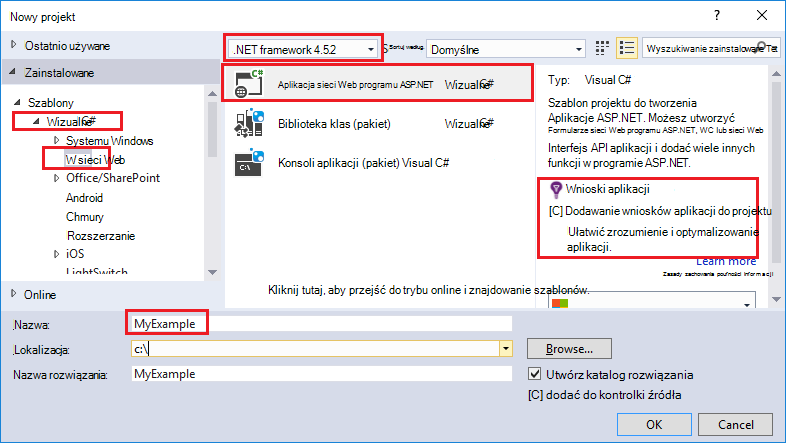

<properties
    pageTitle="Wdrażanie aplikacji ASP.NET Azure aplikacji usługi przy użyciu programu Visual Studio | Microsoft Azure"
    description="Dowiedz się, jak wdrożyć projektu sieci web programu ASP.NET do nowej aplikacji sieci web w usłudze aplikacji Azure za pomocą programu Visual Studio."
    services="app-service\web"
    documentationCenter=".net"
    authors="tdykstra"
    manager="wpickett"
    editor=""/>

<tags
    ms.service="app-service-web"
    ms.workload="web"
    ms.tgt_pltfrm="na"
    ms.devlang="dotnet"
    ms.topic="get-started-article"
    ms.date="07/22/2016"
    ms.author="rachelap"/>

# Wdrażanie aplikacji sieci web programu ASP.NET do aplikacji usługi Azure za pomocą programu Visual Studio

[AZURE.INCLUDE [tabs](../../includes/app-service-web-get-started-nav-tabs.md)]

## Omówienie

Ten samouczek przedstawiono sposób wdrożyć aplikację sieci web programu ASP.NET w [aplikacji sieci web w usłudze Azure aplikacji](app-service-web-overview.md) przy użyciu programu Visual Studio 2015 r.

Samouczek założono, że jesteś deweloperem ASP.NET występują nie doświadczenia przy użyciu Azure. Po zakończeniu, że aplikacji sieci web prostej w górę i uruchamiania w chmurze.

Opisano następujące zagadnienia:

* Jak utworzyć nową aplikację sieci web aplikacji usługi, podczas tworzenia nowego projektu sieci web w programie Visual Studio.
* Jak wdrożyć projektu sieci web do aplikacji usługi aplikacji sieci web przy użyciu programu Visual Studio.

Diagram przedstawia, co możesz zrobić w samouczku.

Na koniec samouczka sekcję [Rozwiązywanie problemów](#troubleshooting) daje pomysłów na co zrobić, jeśli coś nie zadziała, a sekcji [Następne kroki](#next-steps) znajdują się łącza do innych samouczków uwzględnianych w bardziej szczegółowo o używaniu Azure aplikacji usługi.

Jak to samouczek Wprowadzenie do projektu sieci web, który jest wyświetlany jak wdrożyć jest proste nie korzystać z bazy danych, które nie uwierzytelniania i autoryzacji. Łącza do bardziej zaawansowanych tematów wdrażania zobacz [jak wdrożyć aplikację sieci web Azure](web-sites-deploy.md).

Oprócz czas wymagany do zainstalowania Azure SDK dla .NET ten samouczek potrwa około 10 do 15 minut do wykonania.

## Wymagania wstępne

* Samouczek założono, że pracujesz z ASP.NET MVC i Visual Studio. Jeśli potrzebujesz wprowadzenie, zobacz [Wprowadzenie do programu ASP.NET MVC 5](http://www.asp.net/mvc/overview/getting-started/introduction/getting-started).

* Wymagane jest konto Azure. Możesz [utworzyć bezpłatne konto Azure](/pricing/free-trial/?WT.mc_id=A261C142F) lub [aktywowania programu Visual Studio subskrybentów korzyści](/pricing/member-offers/msdn-benefits-details/?WT.mc_id=A261C142F). 

    Jeśli chcesz rozpocząć pracę z Azure aplikacji usługi, aby utworzyć konto Azure, przejdź do [Spróbuj aplikacji usługi](http://go.microsoft.com/fwlink/?LinkId=523751). Możesz utworzyć aplikację krótkotrwałe starter w aplikacji usługi — karty kredytowej wymagane i nie zobowiązań.

## Konfigurowanie środowiska projektowego

Samouczek jest przeznaczony dla programu Visual Studio 2015 z [SDK Azure dla środowiska .NET](../dotnet-sdk.md) 2,9 lub nowszy. 

* [Pobierz najnowszą SDK Azure Visual Studio 2015 r](http://go.microsoft.com/fwlink/?linkid=518003). Zestaw SDK instalacje Visual Studio 2015, jeśli jeszcze nie masz.

    >[AZURE.NOTE] W zależności od tego, ile zależności SDK jest już na komputerze instalowania zestawu SDK może zająć dużo czasu, na kilka minut pół godziny lub więcej.

Jeśli masz Visual Studio 2013 i chcesz użyć, możesz [pobrać najnowszą SDK Azure Visual Studio 2013 r](http://go.microsoft.com/fwlink/?LinkID=324322). Niektóre ekrany może wyglądać inaczej z ilustracji.

## Konfigurowanie nowego projektu sieci web

Następnym krokiem jest utworzenie projektu sieci web w programie Visual Studio i aplikacji sieci web w usłudze Azure aplikacji. W tej sekcji samouczka można skonfigurować nowego projektu sieci web. 

1. Otwórz program Visual Studio 2015 r.

2. Kliknij pozycję **Plik > Nowy > Project**.

3. W oknie dialogowym **Nowy projekt** , kliknij przycisk **Visual C# > sieci Web > aplikacji sieci Web programu ASP.NET**.

3. Upewnij się, że jest wybrany **.NET Framework 4.5.2** framework docelowej.

4.  [Azure aplikacji wniosków](../application-insights/app-insights-overview.md) monitoruje aplikacji sieci web dla dostępności, wydajności i użycia. Według czasu domyślny pierwszej tworzy projektu sieci web po zainstalowaniu programu Visual Studio jest zaznaczone pole wyboru **Dodaj wniosków aplikacji do projektu** . Wyczyść pole wyboru, jeśli jest zaznaczona, ale nie chcesz spróbować wniosków aplikacji.

4. Nazwa aplikacji **MyExample**, a następnie kliknij **przycisk OK**.

    

5. W oknie dialogowym **Nowy projekt ASP.NET** wybierz szablon **MVC** , a następnie kliknij **Zmień uwierzytelniania**.

    Ten samouczek należy wdrożyć projektu sieci web programu ASP.NET MVC. Jeśli chcesz dowiedzieć się, jak wdrożyć projektu interfejs API sieci Web programu ASP.NET, zobacz sekcję [Następne kroki](#next-steps) . 

    

6. W oknie dialogowym **Zmienianie uwierzytelniania** kliknij pozycję **Brak uwierzytelniania**, a następnie kliknij **przycisk OK**.

    

    Ten samouczek Wprowadzenie do jest instalowany prosty aplikację, która nie Zaloguj użytkownika.

5. Upewnij się, że jest zaznaczona opcja **hosta w chmurze** i że na liście rozwijanej wybrano **Aplikacji usługi** w sekcji **Platformy Microsoft Azure** w oknie dialogowym **Nowy projekt programu ASP.NET** .

    

    Te ustawienia bezpośrednie Visual Studio, aby utworzyć aplikację sieci web Azure projektu sieci web.

6. Kliknij **przycisk OK**

## Konfigurowanie Azure zasobów dla nowej aplikacji sieci web

Teraz możesz określić Visual Studio o Azure zasoby, które mają być tworzenie.

5. W oknie dialogowym **Tworzenie aplikacji usługi** kliknij pozycję **Dodaj konto**, a następnie zaloguj się do Azure za pomocą Identyfikatora i hasło konta, którego używasz, aby zarządzać subskrypcją Azure.

    

    Jeśli już wcześniej na tym samym komputerze, nie może zostać wyświetlony przycisk **Dodaj konto** . W takim przypadku możesz pominąć ten krok lub może być konieczne ponowne wprowadzenie poświadczeń.
 
3. Wprowadź **Nazwę aplikacji sieci Web** , która jest unikatowa w domenie *azurewebsites.net* . Na przykład nazwie MyExample z liczbami w prawo, aby były unikatowe, takich jak MyExample810. Jeśli domyślną nazwę sieci web jest tworzona automatycznie, będzie ona unikatowych i można go używać.

    Jeśli ktoś inny użył już nazwa wprowadzona, zostanie wyświetlony czerwony wykrzyknik do prawej zamiast zielony znacznik wyboru, a następnie należy wprowadzić pod inną nazwą.

    Adres URL aplikacji jest to nazwa plus *. azurewebsites.net*. Na przykład nazwa jest `MyExample810`, adres URL jest `myexample810.azurewebsites.net`.

    Za pomocą niestandardowej domeny przy użyciu aplikacji Azure web. Aby uzyskać więcej informacji zobacz [Konfigurowanie niestandardowej nazwy domeny w usłudze Azure aplikacji](web-sites-custom-domain-name.md).

6. Kliknij przycisk **Nowy** obok pola **Grupa zasobów** , a następnie wprowadź "MyExample" lub inna nazwa, jeśli wolisz. 

    

    Grupa zasobów to zbiór Azure zasobów, takich jak aplikacje sieci web, bazy danych i maszyny wirtualne. Samouczek, zwykle najlepiej jest utworzyć nową grupę zasobów, ponieważ ułatwia do usunięcia w jednym kroku wszystkie Azure zasoby, które możesz utworzyć samouczka. Aby uzyskać więcej informacji zobacz [Omówienie Menedżera zasobów Azure](../azure-resource-manager/resource-group-overview.md).

4. Kliknij przycisk **Nowy** **Plan usługi aplikacji** listy rozwijanej.

    

    Zostanie wyświetlone okno dialogowe **Konfigurowanie Plan usługi aplikacji** .

    

    W następującej procedurze można skonfigurować plan aplikacji usług dla nowej grupy zasobów. Plan usług aplikacji określa zasoby obliczeń, które aplikacji sieci web działa na. Na przykład jeśli wybierzesz warstwie bezpłatne, aplikacji interfejsu API jest uruchamiany w udostępnionej maszyny wirtualne, dla niektórych poziomów płatnej uruchomiony w dedykowanej maszyny wirtualne. Aby uzyskać więcej informacji zobacz [Omówienie plany aplikacji usługi](../app-service/azure-web-sites-web-hosting-plans-in-depth-overview.md).

5. W oknie dialogowym **Konfigurowanie Plan usługi aplikacji** Jeśli wolisz wprowadź "MyExamplePlan" lub inna nazwa.

5. Na liście rozwijanej **lokalizacji** wybierz lokalizację, zbliżony do Ciebie.

    To ustawienie określa, które Azure centrum danych aplikacji będzie działać w. Ten samouczek można wybrać dowolny region i nie można wprowadzić widoczną różnicą. Ale dla aplikacji dla produkcji ma serwer sieci Web możliwie najbliżej klientów, którzy korzystają z nią, aby zminimalizować [opóźnienie](http://www.bing.com/search?q=web%20latency%20introduction&qs=n&form=QBRE&pq=web%20latency%20introduction&sc=1-24&sp=-1&sk=&cvid=eefff99dfc864d25a75a83740f1e0090).

5. W **rozmiar** listy rozwijanej kliknij pozycję **Free**.

    Ten samouczek warstwie cennik bezpłatne zapewni dobry za mało wydajności.

6. W oknie dialogowym **Konfigurowanie Plan usługi aplikacji** kliknij **przycisk OK**.

7. W oknie dialogowym **Tworzenie aplikacji usługi** kliknij przycisk **Utwórz**.

## Program Visual Studio umożliwia utworzenie aplikacji sieci web i programu project

W przez krótki czas, zwykle mniej niż minuta Visual Studio tworzy projektu sieci web i aplikacji sieci web.  

W oknie **Eksplorator rozwiązań** wyświetlane pliki i foldery w nowym projekcie.

W oknie **Wykonania usługi aplikacji Azure** wyświetlane, utworzenia aplikacji sieci web.

Okno **Eksploratora chmury** pozwala na wyświetlanie i zarządzanie nimi Azure zasobów, w tym nową aplikację sieci web, która została właśnie utworzona.

    
## Wdrażanie aplikacji sieci Azure web projektu sieci web

W tej sekcji należy wdrożyć projektu sieci web aplikacji sieci web.

1. W **Eksploratorze rozwiązań**kliknij prawym przyciskiem myszy projekt, a następnie wybierz pozycję **Publikuj**.

    

    W ciągu kilku sekund zostanie wyświetlony Kreator **Publikowanie sieci Web** . Zostanie otwarty Kreator *Publikuj profil* zawierającą ustawienia wdrażania projektu sieci web do nowej aplikacji sieci web.

    Profil publikowania zawiera nazwę użytkownika i hasło do wdrożenia.  Te poświadczenia zostały wygenerowane dla Ciebie, a nie trzeba je wprowadzać. Hasło jest szyfrowane w pliku ukrytym specyficzne dla użytkownika w `Properties\PublishProfiles` folder.
 
8. Na karcie **połączenie** w kreatorze **Publikowanie sieci Web** kliknij przycisk **Dalej**.

    

    Następny jest kartę **Ustawienia** . W tym miejscu możesz zmienić konfigurację kompilacji wdrożenia Kompilacja debugowania [zdalne](../app-service-web/web-sites-dotnet-troubleshoot-visual-studio.md#remotedebug)debugowanie. Karcie również oferuje kilka [Opcji publikowanie plików](https://msdn.microsoft.com/library/dd465337.aspx#Anchor_2).

10. Na karcie **Ustawienia** kliknij przycisk **Dalej**.

    

    Na karcie **Podgląd** to następny. W tym miejscu ma możliwość przeglądania plików trafiają do skopiowania z programu project do aplikacji interfejsu API. Projekt jest instalowany do aplikacji interfejsu API, który już wdrożono do wcześniej, są kopiowane tylko zmienionych plików. Jeśli chcesz wyświetlić listę, które mają zostać skopiowane, kliknięcie przycisku **Uruchom Podgląd** .

11. Na karcie **Podgląd** kliknij pozycję **Publikuj**.

    

    Po kliknięciu przycisku **Publikuj**Visual Studio rozpoczyna się proces kopiowania pliku na serwerze Azure. Może to potrwać minutę lub dwie.

    Okna **dane wyjściowe** i **Wykonanie usługi aplikacji Azure** Pokaż akcje wdrożenia zostały pobrane i zgłoś pomyślnego wdrożenia.

    

    Po pomyślnego wdrożenia domyślną przeglądarką jest otwierany automatycznie do określonego adresu URL aplikacji sieci web wdrożonym, a teraz działa aplikacja utworzonego w chmurze. Adres URL na pasku adresu przeglądarki pokazano, że aplikacji sieci web zostanie załadowana z Internetu.

    

    > [AZURE.TIP]Możesz włączyć obsługę **Sieci Web jeden kliknij pozycję Publikuj** narzędzi do szybkiego rozmieszczania. Kliknij pozycję **Widok > Paski narzędzi**, a następnie wybierz pozycję **Web jednego kliknij pozycję Publikuj**. Pasek narzędzi służy do wybierania profilu, kliknij przycisk, aby opublikować lub kliknij przycisk, aby otworzyć okno Kreator **Publikowanie sieci Web** .
    > 

## Rozwiązywanie problemów

Jeśli wystąpią problemy podczas wykonywania kroków tego samouczka, upewnij się, że używasz najnowszą wersję pakietu Azure SDK dla środowiska .NET. Najprostszym sposobem na tym jest [Pobieranie zestawu SDK Azure for Visual Studio 2015 r](http://go.microsoft.com/fwlink/?linkid=518003). Jeśli masz bieżącej wersji zainstalowanej Instalatora platformy sieci Web umożliwia sprawdzenie, czy instalacja nie jest potrzebna.

Jeśli jesteś w sieci firmowej i próbujesz wdrożyć usługę aplikacji Azure przez zaporę, upewnij się, że porty 443 i 8172 są otwarte dla wdrażanie sieci Web. Jeśli nie możesz otworzyć te porty, zobacz następną sekcję następnej czynności dla innych opcji wdrażania.

Po utworzeniu aplikacji sieci web programu ASP.NET działa usługa Azure aplikacji można dowiedzieć się więcej na temat funkcji programu Visual Studio, które uproszczenia rozwiązywania problemów. Aby uzyskać informacje o rejestrowaniu zdalnego debugowania i uzyskać więcej informacji, zobacz [Rozwiązywanie problemów z Azure aplikacje sieci web w programie Visual Studio](web-sites-dotnet-troubleshoot-visual-studio.md).

## Następne kroki

W tym samouczku zostały przeczytane jak tworzenie aplikacji sieci web prosta i Wdroż Azure w przeglądarce. Oto niektóre tematy pokrewne i zasoby, aby uzyskać dodatkowe informacje o usłudze Azure aplikacji:

* Monitorowanie i zarządzanie nimi aplikacji sieci web w [Azure portal](https://portal.azure.com/). 

    Aby uzyskać więcej informacji zobacz [Omówienie Azure portal](/services/management-portal/) i [Konfigurowanie aplikacji sieci web w usłudze Azure w aplikacji](web-sites-configure.md).

* Wdrażanie istniejącego projektu sieci web do nowej aplikacji sieci web przy użyciu programu Visual Studio

    Kliknij prawym przyciskiem myszy projektu w **Eksploratorze rozwiązań**, a następnie kliknij pozycję **Publikuj**. Wybierz **Usługi aplikacji Microsoft Azure** docelowej Publikuj, a następnie kliknij przycisk **Nowy**. Okna dialogowe są takie same, co widzisz w tym samouczku.

* Wdrażanie projektu sieci web z kontrolki źródła

    Aby dowiedzieć się, jak [Automatyzowanie wdrażania](http://www.asp.net/aspnet/overview/developing-apps-with-windows-azure/building-real-world-cloud-apps-with-windows-azure/continuous-integration-and-continuous-delivery) z [systemu kontroli źródła](http://www.asp.net/aspnet/overview/developing-apps-with-windows-azure/building-real-world-cloud-apps-with-windows-azure/source-control)zobacz [Wprowadzenie do aplikacji sieci web w usłudze Azure aplikacji](app-service-web-get-started.md) i [jak wdrożyć aplikację sieci web Azure](web-sites-deploy.md).

* Wdrażanie aplikacji interfejsu API usługi Azure aplikacji sieci Web programu ASP.NET interfejsu API

    Użytkownik zobaczył, jak utworzyć wystąpienie usługi aplikacji Azure głównie przeznaczony do obsługi witryny sieci Web. Aplikacja usługi oferuje funkcji do obsługi interfejsów API sieci Web, takich jak CORS pomocy technicznej i interfejsu API metadanych obsługę generowanie kodu klienta. Za pomocą funkcji interfejsu API w aplikacji sieci web, ale głównie należy udostępnić interfejs API w przypadku aplikacji usługi **aplikacji interfejsu API** będzie lepszym wyborem. Aby uzyskać więcej informacji zobacz [Wprowadzenie do aplikacji interfejsu API i ASP.NET w usłudze Azure aplikacji](../app-service-api/app-service-api-dotnet-get-started.md). 

* Dodawanie niestandardowej nazwy domeny i SSL

    Aby dowiedzieć się, jak za pomocą protokołu SSL oraz z własnej domeny (na przykład www.contoso.com zamiast contoso.azurewebsites.net) zobacz następujące zasoby:

    * [Konfigurowanie niestandardowej nazwy domeny w usłudze Azure aplikacji](web-sites-custom-domain-name.md)
    * [Włącz protokół HTTPS Azure witryny sieci Web](web-sites-configure-ssl-certificate.md)

* Usuń grupę zasobów, zawierającą aplikacji sieci web i wszystkie powiązane zasoby Azure, po zakończeniu z nimi.

    Aby dowiedzieć się, jak pracować z grup zasobów w portalu Azure zobacz [Wdrażanie zasoby z szablonami Menedżera zasobów i Azure portal](../resource-group-template-deploy-portal.md).   

*   Aby uzyskać więcej przykładów tworzenie aplikacji sieci Web programu ASP.NET w aplikacji usługi, zobacz [Tworzenie i wdrażanie aplikacji sieci web programu ASP.NET w Azure aplikacji usługi](https://github.com/Microsoft/HealthClinic.biz/wiki/Create-and-deploy-an-ASP.NET-web-app-in-Azure-App-Service) i [Tworzenie i wdrażanie aplikacji dla urządzeń przenośnych w usłudze Azure aplikacji](https://github.com/Microsoft/HealthClinic.biz/wiki/Create-and-deploy-a-mobile-app-in-Azure-App-Service) z Połącz [HealthClinic.biz](https://github.com/Microsoft/HealthClinic.biz) 2015 [Pokaz](https://blogs.msdn.microsoft.com/visualstudio/2015/12/08/connectdemos-2015-healthclinic-biz/). Aby uzyskać więcej Przewodniki Szybki Start z pokaz HealthClinic.biz zobacz [Azure Deweloper narzędzia Przewodniki Szybki Start](https://github.com/Microsoft/HealthClinic.biz/wiki/Azure-Developer-Tools-Quickstarts).
