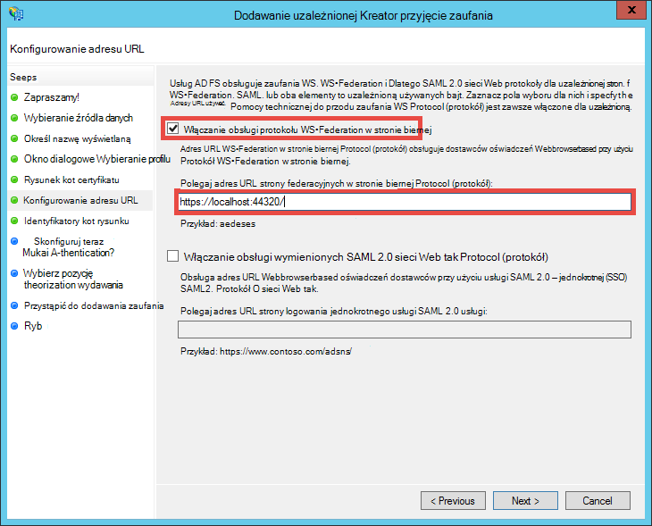

<properties 
    pageTitle="Tworzenie aplikacji Azure linii biznesowych z uwierzytelnianiem usług AD FS | Microsoft Azure" 
    description="Dowiedz się, jak utworzyć aplikację z LOB usługi aplikacji Azure, który uwierzytelnia z funkcjami lokalnymi usługi STS. Ten samouczek jest przeznaczony dla usług AD FS jako na lokalna Usługa STS." 
    services="app-service\web" 
    documentationCenter=".net" 
    authors="cephalin" 
    manager="wpickett" 
    editor=""/>

<tags 
    ms.service="app-service-web" 
    ms.devlang="dotnet" 
    ms.topic="article" 
    ms.tgt_pltfrm="na" 
    ms.workload="web" 
    ms.date="08/31/2016" 
    ms.author="cephalin"/>

# Tworzenie aplikacji Azure linii biznesowych z uwierzytelnianiem usług AD FS

W tym artykule pokazano, jak utworzyć aplikację LOB programu ASP.NET MVC w [Usłudze Azure w aplikacji](../app-service/app-service-value-prop-what-is.md) przy użyciu lokalnego [Active Directory Federation Services](http://technet.microsoft.com/library/hh831502.aspx) jako dostawcy tożsamości. W tym scenariuszu pracować, gdy chcesz utworzyć wiersz firmie w usłudze Azure aplikacji, ale organizacja wymaga katalogu dane mają być przechowywane na miejscu.

>[AZURE.NOTE] Aby uzyskać omówienie opcji uwierzytelniania i autoryzacji przedsiębiorstwa Azure aplikacji usługi zobacz [uwierzytelniania z lokalnej usługi Active Directory w Azure aplikacji](web-sites-authentication-authorization.md).

## Zostanie utworzona ##

Zostanie utworzona podstawowe aplikacji ASP.NET w aplikacjach sieci Web usługi aplikacji Azure następujące funkcje:

- Uwierzytelnia użytkowników przy użyciu usług AD FS
- Używa `[Authorize]` Aby zezwolić użytkownikom na innych działań
- Statyczna konfiguracja zarówno debugowania w programie Visual Studio i publikowanie w sieci Web usługi aplikacji (Konfigurowanie raz, debugowanie i publikować w dowolnym momencie)  

## Co jest potrzebne ##

[AZURE.INCLUDE [free-trial-note](../../includes/free-trial-note.md)]

Poniższe czynności, aby użyć tego samouczka jest potrzebny:

- Lokalnego wdrożenia usług AD FS (dla zakończenia do końca skorzystać testowym używane w tym samouczku [Testowanie Ćwiczenia: STS autonomicznej z usług AD FS w Azure maszyn wirtualnych (w przypadku tylko test)](https://blogs.msdn.microsoft.com/cephalin/2014/12/21/test-lab-standalone-sts-with-ad-fs-in-azure-vm-for-test-only/))
- Uprawnienia do tworzenia Polegaj strony zaufania w AD FS zarządzania
- Visual Studio 2013 aktualizacji 4 lub nowszy
- [Azure SDK 2.8.1](http://go.microsoft.com/fwlink/p/?linkid=323510&clcid=0x409) lub nowszy

## Za pomocą aplikacji przykładowej LOB z szablonu ##

Przykładowa aplikacja w tym samouczku [aplikacji sieci Web — WSFederation-DotNet)](https://github.com/AzureADSamples/WebApp-WSFederation-DotNet), zostanie utworzona przez zespół usługi Azure Active Directory. Ponieważ usług AD FS obsługuje federacyjnych, służy go jako szablon do tworzenia aplikacji programu LOB z łatwością. Ma następujące funkcje:

- Używa [Federacyjnych](http://msdn.microsoft.com/library/bb498017.aspx) do uwierzytelniania lokalnego wdrożenia usług AD FS
- Funkcja rejestrowania i wyrejestrowywania
- Używa [Microsoft.Owin](http://www.asp.net/aspnet/overview/owin-and-katana/an-overview-of-project-katana) (zamiast Windows Identity Foundation), czyli przyszłe programu ASP.NET i znacznie upraszcza skonfigurować dla uwierzytelniania i autoryzacji niż WIF

## Konfigurowanie aplikacji przykładowej ##

2.  Klonowanie lub pobrać rozwiązanie próbki w [Aplikacji sieci Web — WSFederation-DotNet](https://github.com/AzureADSamples/WebApp-WSFederation-DotNet) do katalogu lokalnego.

    > [AZURE.NOTE] Instrukcje u [README.md](https://github.com/AzureADSamples/WebApp-WSFederation-DotNet/blob/master/README.md) pokazano, jak skonfigurować aplikację z usługą Azure Active Directory. Ale w tym samouczku został on skonfigurowany za usług AD FS, więc zamiast tego wykonaj kroki opisane w tym miejscu.

3.  Otwórz rozwiązanie, a następnie otwórz Controllers\AccountController.cs w **Eksploratorze rozwiązań**.

    Pojawi się, że kod po prostu problemy wezwanie uwierzytelniania do uwierzytelnienia użytkownika przy użyciu federacyjnych. Wszystkie uwierzytelniania jest skonfigurowana w App_Start\Startup.Auth.cs.

4.  Otwórz App_Start\Startup.Auth.cs. W `ConfigureAuth` metody, zwróć uwagę na wiersz:

        app.UseWsFederationAuthentication(
            new WsFederationAuthenticationOptions
            {
                Wtrealm = realm,
                MetadataAddress = metadata                                      
            });

    Na świecie OWIN ten fragment to naprawdę minimalne czynności, musisz skonfigurować federacyjnych uwierzytelniania. To znacznie upraszcza i bardziej elegancki niż WIF, gdzie Web.config dodane z danymi XML w całym miejsca. Tylko informacje potrzebne jest strony ufającej (RP) identyfikator i adres URL pliku metadanych usługi usług AD FS. Oto przykład:

    -   Identyfikator RP:`https://contoso.com/MyLOBApp`
    -   Adres metadanych:`http://adfs.contoso.com/FederationMetadata/2007-06/FederationMetadata.xml`

5.  W App_Start\Startup.Auth.cs należy zmienić następujące definicje statyczne ciąg:  
    <pre class="prettyprint">
    prywatne ciąg statyczne obszaru = ConfigurationManager.AppSettings["ida:<mark>RPIdentifier</mark>"]; <mark><del>aadInstance prywatne ciąg statyczne = ConfigurationManager.AppSettings["ida:AADInstance"];</del></mark> 
     <mark><del>dzierżawy prywatne ciąg statyczne = ConfigurationManager.AppSettings["ida:Tenant"];</del></mark> 
     <mark><del>prywatne ciąg statyczne metadanych = ciąg. Format ("{0}-{1} /federationmetadata/2007-06/federationmetadata.xml", aadInstance, dzierżawy);</del></mark> 
     <mark>prywatne ciąg statyczne metadanych = ciąg. Format ("/federationmetadata/2007-06/federationmetadata.xml https:// {0}" ConfigurationManager.AppSettings["ida:ADFS"]);</mark>

    <mark><del>ciąg urząd = String.Format (CultureInfo.InvariantCulture, aadInstance, dzierżawy);</del></mark>
    </pre>

6.  Teraz wprowadź odpowiednie zmiany w pliku Web.config. Otwieranie pliku Web.config i modyfikować poniższe ustawienia aplikacji:  
    <pre class="prettyprint">
    &lt;appSettings&gt;
    &lt;add key="webpages:Version" value="3.0.0.0" /&gt;
    &lt;add key="webpages:Enabled" value="false" /&gt;
    &lt;add key="ClientValidationEnabled" value="true" /&gt;
    &lt;add key="UnobtrusiveJavaScriptEnabled" value="true" /&gt;
      <mark><del>&lt;add key="ida:Wtrealm" value="[Enter the App ID URI of WebApp-WSFederation-DotNet https://contoso.onmicrosoft.com/WebApp-WSFederation-DotNet]" /&gt;</del></mark>
      <mark><del>&lt;add key="ida:AADInstance" value="https://login.windows.net" /&gt;</del></mark>
      <mark><del>&lt;add key="ida:Tenant" value="[Enter tenant name, e.g. contoso.onmicrosoft.com]" /&gt;</del></mark>
      <mark>&lt;add key="ida:RPIdentifier" value="[Enter the relying party identifier zgodnie z konfiguracją w programie AD FS, np. https://localhost:44320-] "-&gt;</mark>
      <mark>&lt;Dodaj klucz = wartość"ida: ADFS"="[Wprowadź nazwy FQDN usług AD FS, np. adfs.contoso.com]"-&gt; </mark>        

    &lt;/appSettings&gt;
    </pre>

    Wprowadź wartości klucza według odpowiednich środowiska.

7.  Tworzenie aplikacji, aby upewnić się, że nie ma żadnych błędów.

To wszystko. Teraz aplikacja próbki jest gotowa do pracy z usług AD FS. Nadal trzeba konfigurować zaufania RP tę aplikację w programie AD FS później.

## Wdrażanie aplikacji przykładowych Azure aplikacji usługi sieci Web

W tym miejscu możesz opublikować aplikację do aplikacji sieci web w aplikacjach sieci Web usługi aplikacji przy zachowaniu środowiska debugowania. Zauważ, że użytkownik chce opublikować aplikację, zanim go ma zaufanie RP z usług AD FS, więc uwierzytelniania nadal nie działa jeszcze. Jednak jeśli możesz wykonać teraz możesz mieć adres URL aplikacji sieci web, którą można skonfigurować zaufania RP później.

1. Kliknij prawym przyciskiem myszy projektu, a następnie wybierz pozycję **Publikuj**.

    

2. Wybierz pozycję **Microsoft Azure aplikacji usługi**.
3. Jeśli jeszcze nie zalogowano się Azure, kliknij przycisk **Zaloguj się** i zalogować się za pomocą konta Microsoft Azure subskrypcji.
4. Po zalogowaniu się, kliknij przycisk **Nowy** , aby utworzyć aplikację sieci web.
5. Wypełnij wszystkie wymagane pola. Zamierzasz nawiązać połączenia lokalnego danych później, aby nie tworzyć bazy danych dla tej aplikacji sieci web.

    

6. Kliknij przycisk **Utwórz**. Po utworzeniu aplikacji sieci web, okno dialogowe publikowanie sieci Web zostanie otwarty.
7. W **Docelowy adres URL**należy zmienić **http** na **https**. Skopiuj cały adres URL do edytora tekstów w celu późniejszego użycia. Następnie kliknij pozycję **Publikuj**.

    

11. W programie Visual Studio Otwórz **Web.Release.config** w projekcie. Wstaw następujący kod XML do `<configuration>` znakowanie i Zamień wartości klucza na adres URL aplikacji sieci web publikowania.  
    <pre class="prettyprint">
&lt;appSettings&gt;
   &lt;Dodaj klucz = wartość "ida: RPIdentifier" = "<mark>[np https://mylobapp.azurewebsites.net/]</mark>" xdt:Transform = "SetAttributes" xdt:Locator="Match(key)"-&gt;
&lt;/appSettings&gt;</pre>

Po zakończeniu, masz dwie identyfikatory RP skonfigurowany w projekcie, jednym dla środowiska debugowania w programie Visual Studio i jednym dla aplikacji sieci web opublikowanych w Azure. Zaufanie RP będą skonfigurowane dla każdego z tych dwóch środowiskach w programie AD FS. Podczas debugowania, ustawienia aplikacji w Web.config są umożliwia **Debugowanie** konfiguracji Praca z usług AD FS. Kiedy jest publikowana (domyślnie konfigurację **wersji** opublikowanej), przekazaniu przekształconych Web.config zawiera zmiany ustawień aplikacji w Web.Release.config.

Jeśli chcesz dołączyć opublikowanych web app w Azure, aby debugowania (to znaczy musi przekazujesz symbole debugowania kodu w aplikacji sieci web opublikowanych), można utworzyć duplikat konfiguracji debugowania debugowania Azure, ale przy użyciu własnej Web.config przekształcenie niestandardowe (np. Web.AzureDebug.config) korzystającą z ustawień aplikacji z Web.Release.config. Pozwala na Obsługa konfiguracji statycznej w różnych środowiskach.

## Konfigurowanie uzależnionej zaufania firmy w AD FS zarządzania ##

Teraz musisz skonfigurować zaufania RP AD FS zarządzania, aby można było za pomocą aplikacji próbki i faktycznie uwierzytelniania usług AD FS. Należy skonfigurować dwóch oddzielnych zaufania RP, jedną dla środowiska debugowania i jedną dla aplikacji sieci web opublikowane.

> [AZURE.NOTE] Upewnij się, powtórz czynności dla obu środowisk usługi.

4.  Na serwerze usług AD FS Zaloguj się przy użyciu poświadczeń, które mają zarządzania prawami dostępu do usług AD FS.
5.  Otwórz program AD FS zarządzanie. Kliknij prawym przyciskiem myszy **AD FS\Trusted Relationships\Relying strona zaufanie** i wybierz pozycję **Ufaj Strona Dodaj Polegaj**.

    

5.  Na stronie **Wybieranie źródła danych** wybierz pozycję **Ręczne wprowadzanie danych o uzależnioną**. 

    

6.  Na stronie **Określanie Nazwa wyświetlana** wpisz nazwę wyświetlaną dla aplikacji, a następnie kliknij przycisk **Dalej**.
7.  Na stronie **Wybierz protokół** kliknij przycisk **Dalej**.
8.  Na stronie **Konfigurowanie certyfikatu** kliknij przycisk **Dalej**.

    > [AZURE.NOTE] Ponieważ należy używać HTTPS już, zaszyfrowane tokeny są opcjonalne. Jeśli na pewno chcesz zaszyfrować tokenów z usług AD FS na tej stronie, możesz również dodać odszyfrowywanie token logiki w kodzie. Aby uzyskać więcej informacji zobacz [Ręczne konfigurowanie pośredniczącym OWIN federacyjnych i akceptowania zaszyfrowanych tokenów](http://chris.59north.com/post/2014/08/21/Manually-configuring-OWIN-WS-Federation-middleware-and-accepting-encrypted-tokens.aspx).
  
5.  Zanim możesz przejść do następnego kroku, musisz mieć jeden zestaw informacji z projektu programu Visual Studio. W oknie dialogowym właściwości projektu Uwaga **SSL adres URL** aplikacji. 

    

6.  W programie AD FS zarządzania, na stronie **Konfigurowanie adresu URL** **Dodawanie Polegaj strona kreatora zaufania**zaznacz **włączyć obsługę protokołu federacyjnych w stronie biernej** i wpisz adres URL SSL projektu programu Visual Studio zapisany w poprzednim kroku. Następnie kliknij przycisk **Dalej**.

    

    > [AZURE.NOTE] Adres URL określa, gdzie można wysłać klienta po uwierzytelnieniu. W środowisku debugowania powinny być <code>https://localhost:&lt;port&gt;/</code>. Dla aplikacji sieci web opublikowanych należy go adres URL aplikacji sieci web.

7.  Na stronie **Konfigurowanie identyfikatorów** Sprawdź, czy projekt SSL adres URL jest już, a następnie kliknij przycisk **Dalej**. Kliknij przycisk **Dalej** do końca kreatora z opcjami domyślne.

    > [AZURE.NOTE] Dopasowywane w App_Start\Startup.Auth.cs projektu programu Visual Studio, wartość tego identyfikatora <code>WsFederationAuthenticationOptions.Wtrealm</code> podczas federacyjnych uwierzytelniania. Domyślnie adres URL aplikacji z poprzednim kroku zostanie dodane jako identyfikator RP.

8.  Konfigurowanie aplikacji RP projektu w programie AD FS zostało zakończone. Następnie możesz skonfigurować tej aplikacji, aby wysłać oświadczeniach wymagane przez aplikację. Okno dialogowe **Edytowanie reguły roszczeń** jest domyślnie otwierany za Ciebie na końcu kreatora, możesz zacząć od razu. Załóżmy skonfigurować co najmniej następujące oświadczeń (z schematów w nawiasach):

    -   Nazwa (http://schemas.xmlsoap.org/ws/2005/05/identity/claims/name) — używane przez ASP.NET do hydrate `User.Identity.Name`.
    -   Główna nazwa użytkownika (http://schemas.xmlsoap.org/ws/2005/05/identity/claims/upn) — umożliwia jednoznacznie identyfikować użytkowników w organizacji.
    -   Członkostwa w grupach jako role (http://schemas.microsoft.com/ws/2008/06/identity/claims/role) — mogą być używane z `[Authorize(Roles="role1, role2,...")]` ozdobny Aby autoryzować kontrolerów/akcje. W rzeczywistości tej metody może nie być większość performant do autoryzacji ról. Użytkownicy AD należą do setki grupy zabezpieczeń, stają się setki roszczeń ról w SAML token. Podejściem alternatywnym jest wysłanie roszczenia pojedynczej roli warunkowo w zależności od członkostwa użytkownika w określonej grupie. Jednak firma Microsoft będzie Zachowaj prostotę dla tego samouczka.
    -   Nazwa Identyfikatora (http://schemas.xmlsoap.org/ws/2005/05/identity/claims/nameidentifier) — może być używany do sprawdzania poprawności przeciw fałszowaniu. Aby uzyskać więcej informacji na temat był pracy ze sprawdzaniem poprawności przeciw fałszowaniu zobacz sekcję **Dodaj wiersz firm funkcję** Utwórz [z LOB Azure aplikacji z uwierzytelniania usługi Azure Active Directory](web-sites-dotnet-lob-application-azure-ad.md#bkmk_crud).

    > [AZURE.NOTE] Typy oświadczeń, które należy skonfigurować dla aplikacji zależy od potrzeb aplikacji. Listy oświadczeniach obsługiwane przez aplikacje usługi Azure Active Directory (to znaczy RP zaufania) na przykład, zobacz [obsługiwane Token i typy oświadczeń](http://msdn.microsoft.com/library/azure/dn195587.aspx).

8.  W oknie dialogowym Edytowanie reguły roszczeń kliknij przycisk **Dodaj regułę**.
9.  Konfigurowanie oświadczeniach nazwę, głównej nazwy użytkownika i rolę, jak pokazano w zrzut ekranu, a następnie kliknij przycisk **Zakończ**.

    

    Następnie możesz utworzyć przejściowych nazwa, identyfikator rościć sobie, wykonując kroki pokazano w [Nazwy identyfikatorów potwierdzeń SAML](http://blogs.msdn.com/b/card/archive/2010/02/17/name-identifiers-in-saml-assertions.aspx).

9.  Ponownie kliknij pozycję **Dodaj regułę** .
10. Zaznacz pole wyboru **Wyślij oświadczeń za pomocą reguły niestandardowe** , a następnie kliknij przycisk **Dalej**.
11. Wklej następujący język reguły w polu **Reguły niestandardowe** , nazwy reguły **Na identyfikator sesji** , a następnie kliknij przycisk **Zakończ**.  
    <pre class="prettyprint">
    C1: [typ == "http://schemas.microsoft.com/ws/2008/06/identity/claims/windowsaccountname"] &amp; &amp; 
    c2: [typ == "http://schemas.microsoft.com/ws/2008/06/identity/claims/authenticationinstant"] = > Dodaj (przechowywanie = "_OpaqueIdStore", typy = ("<mark>http://contoso.com/internal/sessionid</mark>"), kwerendy = "{0} { 1}. {2}. {3}. {4} ", parametr ="useEntropy", parametr = c1. Wartość, wysyłanych = c1. OriginalIssuer, wysyłanych = "", parametr = c2. Wartość);
    </pre>

    Tworzenie reguły niestandardowej powinna wyglądać podobnie do tego zrzut ekranu:

    

9.  Ponownie kliknij pozycję **Dodaj regułę** .
10. Wybierz pozycję **Przekształć przychodzących roszczeń** , a następnie kliknij przycisk **Dalej**.
11. Konfigurowanie reguły, jak pokazano w zrzut ekranu (przy użyciu typu roszczeń utworzonego w niestandardowej reguły) i kliknij przycisk **Zakończ**.

    

    Aby uzyskać szczegółowe informacje na temat kroków przejściowych roszczenia nazwa zobacz [Nazwy identyfikatorów potwierdzeń SAML](http://blogs.msdn.com/b/card/archive/2010/02/17/name-identifiers-in-saml-assertions.aspx).

12. W oknie dialogowym **Edytowanie reguły roszczeń** , kliknij przycisk **Zastosuj** . Jej powinna wyglądać podobnie następujące zrzut ekranu:

    

    > [AZURE.NOTE] Ponownie upewnij się, powtórz te kroki dla obu debugowania środowiska i opublikowanych w przeglądarce.

## Testowanie federacyjnych uwierzytelniania dla aplikacji

Możesz przystąpić do testowania logiczny uwierzytelniania aplikacji przed usług AD FS. W środowisku ćwiczenia Moje usług AD FS mam użytkownika test, który należy do grupy test w Active Directory (AD).

Aby przetestować uwierzytelniania w debugowania, należy wykonać teraz jest typu `F5`. Jeśli chcesz przetestować uwierzytelniania w aplikacji sieci web opublikowanych, przejdź do adresu URL.

Po pobraniu aplikacji sieci web, kliknij przycisk **Zaloguj**. Okno dialogowe Logowanie lub stronę logowania obsługiwane w usługach AD FS, w zależności od wybranej w usługach AD FS metody uwierzytelniania należy uzyskać teraz. Oto, co to są pobierane za Internet Explorer 11.

Po zalogowaniu się przy użyciu użytkownika w domenie AD wdrażania usług AD FS powinien zostać wyświetlony ponownie ze strony głównej **Witaj, <User Name>!** w prawym górnym rogu. Oto, co można uzyskać.

Pory zostało zakończone powodzeniem w następujący sposób:

- Aplikacja pomyślnie dotarło usług AD FS i pasujące identyfikator RP znajduje się w bazie danych usług AD FS
- Usług AD FS został pomyślnie uwierzytelniony użytkownik AD i Przekieruj, które powrót do strony głównej aplikacji
- AD FS pomyślnie wysłany oświadczeń nazwy (http://schemas.xmlsoap.org/ws/2005/05/identity/claims/name) w aplikacji, wskazywane przez fakt, że nazwa użytkownika jest wyświetlany w rogu. 

Jeśli brakuje nazwy roszczeń, czy przejrzane **Witaj,!**. Jeśli przeglądać Views\Shared\_LoginPartial.cshtml, możesz znaleźć go używa `User.Identity.Name` do wyświetlania nazwy użytkownika. Jak wspomniano wcześniej, jeśli roszczeń nazwa uwierzytelnionego użytkownika jest dostępna w SAML token, ASP.NET hydrates tej właściwości z nim. Aby wyświetlić wszystkie oświadczeń, które są wysyłane przez usług AD FS, należy umieścić punkt przerwania w Controllers\HomeController.cs, metody akcji indeksu. Po uwierzytelnieniu użytkownika inspekcja `System.Security.Claims.Current.Claims` zbioru.

 

## Autoryzuj użytkowników dla określonych kontrolerów lub akcji

Ponieważ członkostwa w grupach zostały uwzględnione jako oświadczeniach ról w konfiguracji zaufania RP, można teraz używać ich bezpośrednio w `[Authorize(Roles="...")]` ozdobny kontrolerów i akcje. W aplikacji programu LOB z wzorcem tworzenie-odczytu-aktualizacja-Delete (OBSŁUGIWAŁ) możesz zezwolić na określonych ról, aby uzyskać dostęp do każdej akcji. Teraz będzie tylko wypróbować tę funkcję w istniejącej kontrolerze Narzędzia główne.

1. Otwórz Controllers\HomeController.cs.
2. Ozdabianie `About` i `Contact` metod akcji podobne do poniższy kod, przy użyciu zabezpieczeń grupy członkostwa, które ma uwierzytelnionego użytkownika.  
    <pre class="prettyprint">
    <mark>[Autoryzuj (role = "Grupy testowej")]</mark> 
    publicznej ActionResult About() {ViewBag.Message = "Aplikacji opis stronie.";

        return View();
    }

    <mark>[Autoryzuj (role = "Administratorzy domeny")]</mark> 
    publicznej ActionResult Contact() {ViewBag.Message = "Kontaktów stronie.";

        return View();
    }  </pre>

    Ponieważ dodaniu **Testowanie użytkownika** do **Grupy testowej** w środowisku ćwiczenia Moje usług AD FS użyję grupy testowej, aby przetestować autoryzacji na `About`. Aby uzyskać `Contact`, będzie przetestować wielkości ujemne **Domain Admins**, do których nie należy **Przetestować użytkownika** .

3. Zacznij od wpisania debugowania `F5` i zaloguj się, a następnie kliknij polecenie **informacje**. Możesz teraz powinny wyświetlanie `~/About/Index` strony pomyślnie, jeśli uwierzytelnionego użytkownika jest autoryzowany dla tej akcji.
4. Teraz kliknij **kontakt**, które w moim przypadku nie powinny zezwalać na **Użytkownika testowego** akcji. Jednak przeglądarka jest przekierowywana do usług AD FS, po pewnym czasie przedstawia ten komunikat:

    

    Jeśli zbadać ten błąd w Podglądzie zdarzeń na serwerze usług AD FS, zobaczysz ten komunikat wyjątku:  
    <pre class="prettyprint">
   Microsoft.IdentityServer.Web.InvalidRequestException: MSIS7042: <mark>tej samej sesji przeglądarki klienta wprowadził żądania "6" w ciągu ostatnich 11 sekund.</mark> Aby uzyskać szczegółowe informacje, skontaktuj się z administratorem.
   w Microsoft.IdentityServer.Web.Protocols.PassiveProtocolHandler.UpdateLoopDetectionCookie (kontekst WrappedHttpListenerContext) u Microsoft.IdentityServer.Web.Protocols.WSFederation.WSFederationProtocolHandler.SendSignInResponse (kontekst WSFederationContext, odpowiedź MSISSignInResponse) u Microsoft.IdentityServer.Web.PassiveProtocolListener.ProcessProtocolRequest (ProtocolContext protocolContext, PassiveProtocolHandler protocolHandler) u Microsoft.IdentityServer.Web.PassiveProtocolListener.OnGetContext (WrappedHttpListenerContext kontekstu) </pre>

    Przyczyny tego błędu jest domyślnie MVC zwracanych 401 Unauthorized po role użytkownika nie są dozwolone. Uaktywnia to żądanie ponownego dostawcy tożsamości (AD FS). Ponieważ użytkownik jest już uwierzytelniony, usług AD FS zwraca na tej samej stronie, która następnie wydaje innego 401, tworzenia pętli przekierowywania. Zastąpi w AuthorizeAttribute `HandleUnauthorizedRequest` metody za pomocą prostych wyrażeń logicznych pokazanie coś, ma sens zamiast kontynuowaniem pętli przekierowywania.

5. Tworzenie pliku w programie project, o nazwie AuthorizeAttribute.cs i wklej następujący kod do niego.

        using System;
        using System.Web.Mvc;
        using System.Web.Routing;
        
        namespace WebApp_WSFederation_DotNet
        {
            [AttributeUsage(AttributeTargets.Class | AttributeTargets.Method, Inherited = true, AllowMultiple = true)]
            public class AuthorizeAttribute : System.Web.Mvc.AuthorizeAttribute
            {
                protected override void HandleUnauthorizedRequest(AuthorizationContext filterContext)
                {
                    if (filterContext.HttpContext.Request.IsAuthenticated)
                    {
                        filterContext.Result = new System.Web.Mvc.HttpStatusCodeResult((int)System.Net.HttpStatusCode.Forbidden);
                    }
                    else
                    {
                        base.HandleUnauthorizedRequest(filterContext);
                    }
                }
            }
        }

    Kod zastąpienia wysyła HTTP 403 (Dostęp zabroniony) zamiast HTTP 401 (Unauthorized) w przypadkach, ale uwierzytelnionego nieautoryzowanego.

6. Uruchamianie debugowania ponownie `F5`. Klikając pozycję **kontakt** teraz zawiera więcej informacji (chociaż jest nieatrakcyjnych) komunikat o błędzie:

    

7. Publikowanie aplikacji sieci Web usługi aplikacji Azure ponownie, a następnie przetestuj zachowanie żywo aplikacji.

## Nawiązywanie połączenia z danymi

Dlaczego możesz chcieć do wdrożenia aplikacji z LOB przy użyciu usług AD FS zamiast usługi Azure Active Directory jest problemy ze zgodnością z zachowanie organizacji danych poza lokalna. Może to również oznaczać, że aplikacji sieci web platformy Azure musi w wersji lokalnej bazy danych programu access, ponieważ nie wolno używać [Bazy danych SQL](/services/sql-database/) jako warstwy danych dla aplikacji sieci web.

Azure aplikacji sieci Web usługi obsługuje uzyskiwania dostępu do baz danych w wersji lokalnej z dwóch metod: [Hybrydowych połączenia](../biztalk-services/integration-hybrid-connection-overview.md) i [Wirtualnych sieci](web-sites-integrate-with-vnet.md). Aby uzyskać więcej informacji zobacz [VNET przy użyciu integracji i hybrydowego połączeniach z Azure aplikacji sieci Web usługi](https://azure.microsoft.com/blog/2014/10/30/using-vnet-or-hybrid-conn-with-websites/).

## Dodatkowe zasoby

- [Ochrona aplikacji przy użyciu protokołu SSL i atrybut Autoryzuj](web-sites-dotnet-deploy-aspnet-mvc-app-membership-oauth-sql-database.md#protect-the-application-with-ssl-and-the-authorize-attribute)
- [Typ poświadczeń uwierzytelniania usługi Active Directory w lokalnej w aplikacji Azure](web-sites-authentication-authorization.md)
- [Tworzenie aplikacji Azure linii biznesowych z uwierzytelnianiem usługi Azure Active Directory](web-sites-dotnet-lob-application-azure-ad.md)
- [Opcja organizacji uwierzytelniania lokalnego (ADFS) za pomocą programu ASP.NET w Visual Studio 2013](http://www.cloudidentity.com/blog/2014/02/12/use-the-on-premises-organizational-authentication-option-adfs-with-asp-net-in-visual-studio-2013/)
- [Migrowanie projektu sieci Web VS2013 z WIF do Katana](http://www.cloudidentity.com/blog/2014/09/15/MIGRATE-A-VS2013-WEB-PROJECT-FROM-WIF-TO-KATANA/)
- [Omówienie usługi Active Directory Federation Services](http://technet.microsoft.com/library/hh831502.aspx)
- [Specyfikacja federacyjnych 1.1](http://download.boulder.ibm.com/ibmdl/pub/software/dw/specs/ws-fed/WS-Federation-V1-1B.pdf?S_TACT=105AGX04&S_CMP=LP)

