<properties 
    pageTitle="Tworzenie aplikacji Azure linii biznesowych z uwierzytelnianiem usługi Azure Active Directory | Microsoft Azure" 
    description="Dowiedz się, jak utworzyć aplikację LOB programu ASP.NET MVC usługi aplikacji Azure, który uwierzytelnia z usługą Azure Active Directory" 
    services="app-service\web, active-directory" 
    documentationCenter=".net" 
    authors="cephalin" 
    manager="wpickett" 
    editor=""/>

<tags 
    ms.service="app-service-web" 
    ms.devlang="dotnet" 
    ms.topic="article" 
    ms.tgt_pltfrm="na" 
    ms.workload="web" 
    ms.date="09/01/2016" 
    ms.author="cephalin"/>

# Tworzenie aplikacji Azure linii biznesowych z uwierzytelnianiem usługi Azure Active Directory #

W tym artykule pokazano, jak utworzyć aplikację LOB programu .NET w [Azure aplikacji usługi sieci Web](http://go.microsoft.com/fwlink/?LinkId=529714) przy użyciu [uwierzytelniania i autoryzacji](../app-service/app-service-authentication-overview.md) funkcji. Pokazuje także jak za pomocą [Interfejsu API Azure Active Directory wykresu](https://msdn.microsoft.com/Library/Azure/Ad/Graph/api/api-catalog) zbadać katalogu danych w aplikacji.

Dzierżawy usługi Azure Active Directory, którego używasz, może być katalogu tylko do Azure. Lub [synchronizacji z usługą Active Directory lokalna](../active-directory/active-directory-aadconnect.md) może być utworzyć pojedynczy obsługi logowania jednokrotnego dla pracowników, które są lokalnego i zdalnego. W tym artykule korzysta z domyślnego katalogu dla Twojego konta Azure.

## Zostanie utworzona ##

Będzie utworzyć prostą aplikację tworzenie-odczytu-aktualizacja-Delete (OBSŁUGIWAŁ) z LOB w aplikacjach sieci Web usługi aplikacji działanie ścieżek elementów za pomocą następujących funkcji:

- Uwierzytelnia użytkowników przy użyciu usługi Azure Active Directory
- Kwerendy katalogu użytkowników i grup przy użyciu [Interfejsu API Azure Active Directory wykresu](http://msdn.microsoft.com/library/azure/hh974476.aspx)
- Korzystanie z szablonu ASP.NET MVC *Bez uwierzytelniania*

Jeśli potrzebujesz kontrola dostępu oparta na rolach (RBAC) dla aplikacji LOB z platformy Azure, zobacz [Następnego kroku](#next).

## Co jest potrzebne ##

[AZURE.INCLUDE [free-trial-note](../../includes/free-trial-note.md)]

Poniższe czynności, aby użyć tego samouczka jest potrzebny:

- Dzierżawy usługi Azure Active Directory z użytkownikami w różnych grup
- Uprawnienia do tworzenia aplikacji w dzierżawie usługi Azure Active Directory
- Visual Studio 2013 aktualizacji 4 lub nowszy
- [Azure SDK 2.8.1 lub nowszy](https://azure.microsoft.com/downloads/)

## Tworzenie i wdrażanie aplikacji sieci web Azure ##

1. Z programu Visual Studio, kliknij pozycję **plik** > **Nowy** > **projektu**.

2. Wybierz **Aplikację sieci Web programu ASP.NET**, nazwę projektu, a następnie kliknij przycisk **OK**.

3. Wybierz szablon **MVC** , a następnie zmienić uwierzytelnianie **Bez**uwierzytelniania. Upewnij się, że jest wybrany **Host w chmurze** , a następnie kliknij **przycisk OK**.

    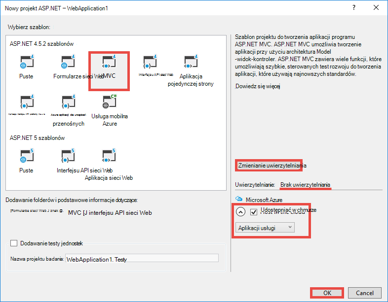

4. W oknie dialogowym **Tworzenie aplikacji usługi** kliknij **Dodaj konto** (a następnie **Dodaj konto** na liście rozwijanej) aby zalogować się do konta Azure.

5. Po zalogowaniu się Konfigurowanie aplikacji sieci web. Tworzenie grupy zasobów i nowy plan usług aplikacji, klikając przycisk **Nowy** odpowiednich. Kliknij **Eksploruj dodatkowe usługi Azure** , aby kontynuować.

    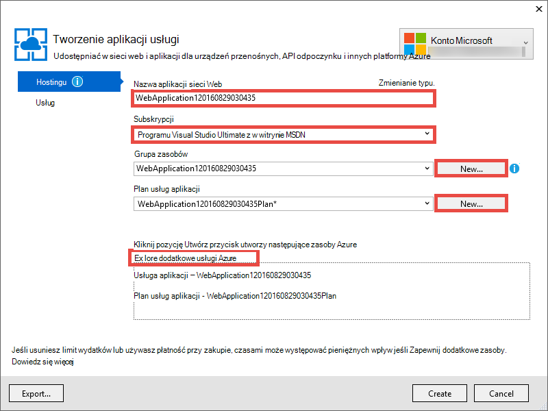

6. Na karcie **usługi** kliknij pozycję **+** Dodawanie bazy danych SQL dla aplikacji. 

    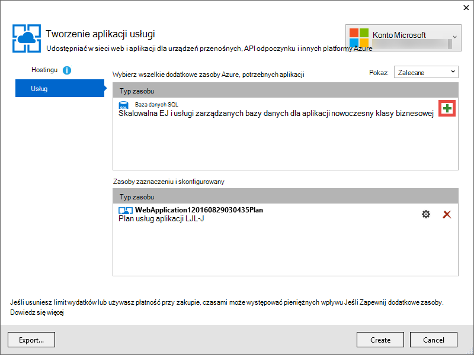

7. W **Konfigurowanie bazy danych SQL**kliknij przycisk **Nowy** , aby utworzyć wystąpienie programu SQL Server.

8. **Konfigurowanie programu SQL Server**skonfiguruj wystąpienie programu SQL Server. Następnie kliknij **przycisk OK**, **OK**i **Utwórz** , aby rozpocząć tworzenie aplikacji platformy Azure.

9. W przypadku **Wykonania usługi Azure aplikacji**widoczny po zakończeniu tworzenia aplikacji. Kliknij pozycję * *Publikuj &lt; *argumentu*> tej aplikacji sieci Web teraz**kliknij przycisk **Publikuj **. 

    Po zakończeniu działania programu Visual Studio otwarcie aplikacji publikowania w przeglądarce. 

    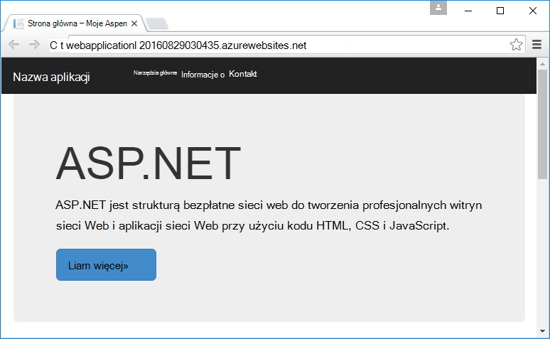

## Konfigurowanie uwierzytelniania i katalog programu access

1. Zaloguj się do [portalu Azure](https://portal.azure.com).

2. Z menu po lewej stronie kliknij pozycję **Usługi aplikacji** > **&lt;*argumentu*>** > **uwierzytelniania i autoryzacji **.

    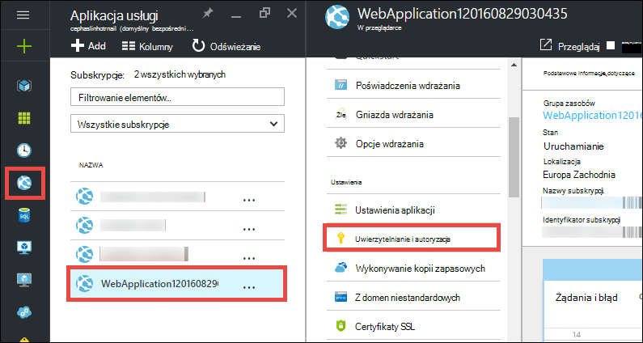

3. Włącz uwierzytelnianie usługi Azure Active Directory, klikając pozycję **na** > **Usługi Azure Active Directory** > **Express** > **przycisk OK**.

    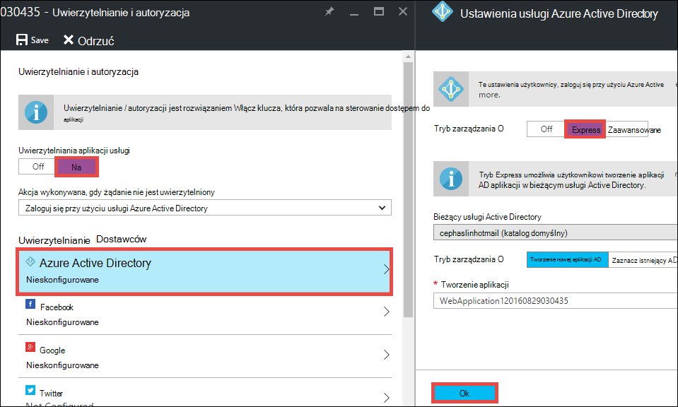

4. Kliknij przycisk **Zapisz** na pasku poleceń.

    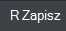

    Po pomyślnym zapisaniu ustawienia uwierzytelniania spróbuj, przechodząc do aplikacji ponownie w przeglądarce. Ustawienia domyślne wymuszania uwierzytelniania dla całej aplikacji. Jeśli jeszcze nie zostało przeprowadzone logowanie, nastąpi przekierowanie do ekranu logowania. Po zalogowaniu się, zobaczysz aplikacji zabezpieczonych przez HTTPS. Następnie należy włączyć dostęp do danych katalogu. 

5. Przejdź do [portalu klasyczny](https://manage.windowsazure.com).

6. Z menu po lewej stronie kliknij pozycję **Usługi Active Directory** > **Domyślne katalogu** > **aplikacji** > **&lt;*argumentu*> **.

    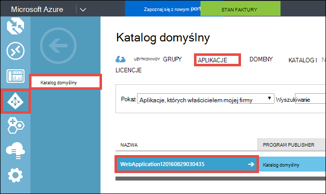

    Jest to aplikacja usługi Azure Active Directory, która aplikacji usługi utworzona dla Ciebie umożliwiające zezwolenie i funkcji uwierzytelniania.

7. Kliknij pozycję **Użytkownicy** i **grupy** , aby upewnić się, że niektóre użytkowników i grup w katalogu. Jeśli nie, Utwórz kilku użytkowników testowych i grupy.

    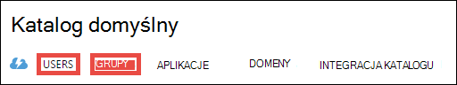

7. Kliknij przycisk **Konfiguruj** , aby skonfigurować tę aplikację.

8. Przewiń w dół do sekcji **klawiszy** i Dodaj klucz, wybierając czas trwania. Następnie kliknij **Delegowane uprawnienia** i wybierz **Odczyt katalogu danych**. Kliknij przycisk **Zapisz**.

    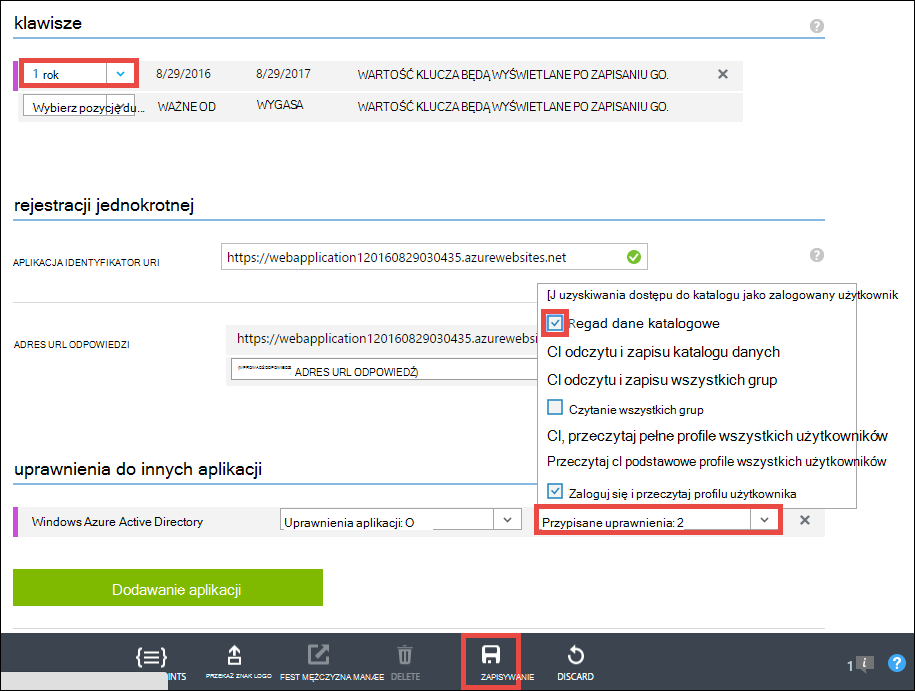

8. Po ustawienia użytkownika są zapisywane, przewiń wykonaj kopię zapasową sekcję **klucze** i kliknij przycisk **Kopiuj** , aby skopiować klucz klienta. 

    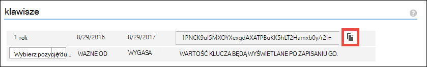

    >[AZURE.IMPORTANT] Jeśli możesz przejść do innej strony teraz, nie można uzyskać dostęp do tego klucza klienta kiedykolwiek ponownie.

9. Następnie należy skonfigurować aplikacji sieci web przy użyciu tego klucza. Zaloguj się do [Eksploratora zasobów Azure](https://resources.azure.com) za pomocą konta usługi Azure.

10. W górnej części strony kliknij pozycję **Odczytu/zapisu** , aby wprowadzić zmiany w Eksploratorze zasobu Azure.

    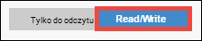

11. Znajdowanie ustawień uwierzytelniania dla aplikacji, znajdują się w subskrypcje > * *&lt;*subscriptionname*>** > **resourceGroups** > **&lt;*resourcegroupname*>** > **dostawców** > **Microsoft.Web** > **witryny** > **&lt;*argumentu*>** > **konfiguracji** > **authsettings **.

12. Kliknij przycisk **Edytuj**.

    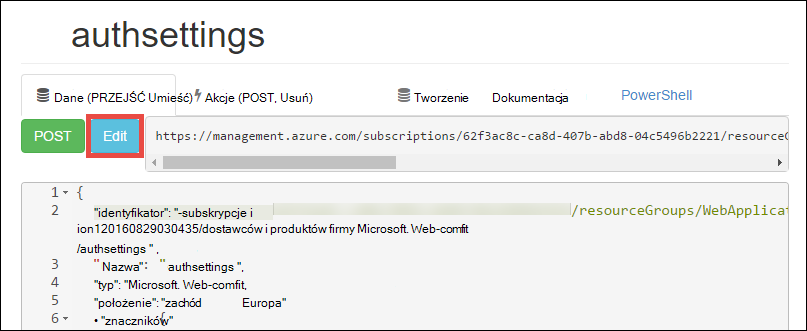

13. W okienku edycji ustaw `clientSecret` i `additionalLoginParams` właściwości w następujący sposób.

        ...
        "clientSecret": "<client key from the Azure Active Directory application>",
        ...
        "additionalLoginParams": ["response_type=code id_token", "resource=https://graph.windows.net"],
        ...

14. U góry ekranu, aby przesłać zmiany, kliknij przycisk **Umieść** .

    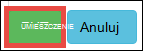

14. Teraz, aby sprawdzić, czy masz token autoryzacji, aby uzyskać dostęp z Azure Active Directory wykresu interfejsu API, wystarczy przejść do * *https://&lt;*argumentu*>.azurewebsites.net/.auth/me** w przeglądarce. Jeśli skonfigurowano wszystko poprawnie, zobacz `access_token` właściwości w odpowiedzi JSON.

    `~/.auth/me` Ścieżki adresu URL zarządza uwierzytelniania usługi aplikacji / autoryzacji, które pozwalają na wszystkie informacje związane z sesji uwierzytelnionych. Aby uzyskać więcej informacji zobacz [uwierzytelniania i autoryzacji w usłudze Azure aplikacji](../app-service/app-service-authentication-overview.md).

    >[AZURE.NOTE] `access_token` Ma okres ważności. Jednak uwierzytelniania usługi aplikacji / autoryzacji zawiera funkcje token odświeżania z `~/.auth/refresh`. Aby uzyskać więcej informacji o tym, jak używać tej funkcji zobacz     [Token usługi sklep](https://cgillum.tech/2016/03/07/app-service-token-store/).

Następnie wykonasz coś przydatne z katalogu danych.

## Dodawanie funkcji linii biznesowych do aplikacji

Teraz możesz tworzyć proste śledzenie elementów pracy OBSŁUGIWAŁ.  

5.  W folderze ~\Models Utwórz plik klasy o nazwie WorkItem.cs i zamienić `public class WorkItem {...}` z następującego kodu:

        using System.ComponentModel.DataAnnotations;

        public class WorkItem
        {
            [Key]
            public int ItemID { get; set; }
            public string AssignedToID { get; set; }
            public string AssignedToName { get; set; }
            public string Description { get; set; }
            public WorkItemStatus Status { get; set; }
        }

        public enum WorkItemStatus
        {
            Open,
            Investigating,
            Resolved,
            Closed
        }

7.  Utwórz projekt, aby udostępnić nowy model logiczny rusztowania w programie Visual Studio.

8.  Dodawanie nowego elementu scaffolded `WorkItemsController` do folderu ~\Controllers (kliknij prawym przyciskiem myszy **kontrolerów**, wskaż pozycję **Dodaj**i zaznaczenie **nowego elementu scaffolded**). 

9.  Wybierz **Kontroler 5 MVC z widokami, za pomocą struktury obiektu** , a następnie kliknij przycisk **Dodaj**.

10. Wybieranie modelu, który zostanie utworzony, a następnie kliknij pozycję **+** , a następnie **Dodaj** do Dodaj kontekst danych, a następnie kliknij przycisk **Dodaj**.

    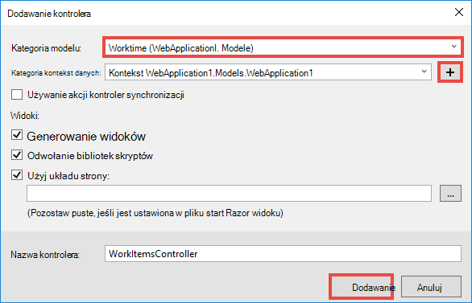

14. W ~\Views\WorkItems\Create.cshtml (elementu automatycznie scaffolded) Znajdź `Html.BeginForm` metody Pomocnik i wprowadzić następujące zmiany wyróżnione:  
<pre class="prettyprint">
    @modelWebApplication1.Models.WorkItem

    @{ViewBag.Title = &quot;tworzenie&quot;; }

    &lt;H2&gt;tworzenie&lt;/h2&gt;

    @using(Html.BeginForm (<mark>&quot;tworzenie&quot;, &quot;pozycje robocze&quot;, FormMethod.Post, nowy {identyfikator = &quot;formularz główny&quot; }</mark>)) {@Html.AntiForgeryToken()

        &lt;div class=&quot;form-horizontal&quot;&gt;
            &lt;h4&gt;WorkItem&lt;/h4&gt;
            &lt;hr /&gt;
            @Html.ValidationSummary(true, &quot;&quot;, new { @class = &quot;text-danger&quot; })
            &lt;div class=&quot;form-group&quot;&gt;
                @Html.LabelFor(model =&gt; model.AssignedToID, htmlAttributes: new { @class = &quot;control-label col-md-2&quot; })
                &lt;div class=&quot;col-md-10&quot;&gt;
                    @Html.EditorFor(model =&gt; model.AssignedToID, new { htmlAttributes = new { @class = &quot;form-control&quot;<mark>, @type = &quot;hidden&quot;</mark> } })
                    @Html.ValidationMessageFor(model =&gt; model.AssignedToID, &quot;&quot;, new { @class = &quot;text-danger&quot; })
                &lt;/div&gt;
            &lt;/div&gt;

            &lt;div class=&quot;form-group&quot;&gt;
                @Html.LabelFor(model =&gt; model.AssignedToName, htmlAttributes: new { @class = &quot;control-label col-md-2&quot; })
                &lt;div class=&quot;col-md-10&quot;&gt;
                    @Html.EditorFor(model =&gt; model.AssignedToName, new { htmlAttributes = new { @class = &quot;form-control&quot; } })
                    @Html.ValidationMessageFor(model =&gt; model.AssignedToName, &quot;&quot;, new { @class = &quot;text-danger&quot; })
                &lt;/div&gt;
            &lt;/div&gt;

            &lt;div class=&quot;form-group&quot;&gt;
                @Html.LabelFor(model =&gt; model.Description, htmlAttributes: new { @class = &quot;control-label col-md-2&quot; })
                &lt;div class=&quot;col-md-10&quot;&gt;
                    @Html.EditorFor(model =&gt; model.Description, new { htmlAttributes = new { @class = &quot;form-control&quot; } })
                    @Html.ValidationMessageFor(model =&gt; model.Description, &quot;&quot;, new { @class = &quot;text-danger&quot; })
                &lt;/div&gt;
            &lt;/div&gt;

            &lt;div class=&quot;form-group&quot;&gt;
                @Html.LabelFor(model =&gt; model.Status, htmlAttributes: new { @class = &quot;control-label col-md-2&quot; })
                &lt;div class=&quot;col-md-10&quot;&gt;
                    @Html.EnumDropDownListFor(model =&gt; model.Status, htmlAttributes: new { @class = &quot;form-control&quot; })
                    @Html.ValidationMessageFor(model =&gt; model.Status, &quot;&quot;, new { @class = &quot;text-danger&quot; })
                &lt;/div&gt;
            &lt;/div&gt;

            &lt;div class=&quot;form-group&quot;&gt;
                &lt;div class=&quot;col-md-offset-2 col-md-10&quot;&gt;
                    &lt;input type=&quot;submit&quot; value=&quot;Create&quot; class=&quot;btn btn-default&quot;<mark> id=&quot;submit-button&quot;</mark> /&gt;
                &lt;/div&gt;
            &lt;/div&gt;
        &lt;/div&gt;
    }

    &lt;Dziel&gt;
    @Html.ActionLink(&quot;powrót do listy&quot;, &quot;indeks&quot;) &lt;/div    &gt;

    @sectionSkryptów { @Scripts.Render( &quot;~/bundles/jqueryval&quot;)     <mark> &lt;skryptu&gt; 
     --kod selektora osoby lub grupy var maxResultsPerPage = 14;         Wariancja wprowadzania = document.getElementById (&quot;AssignedToName&quot;);

            // Access token from request header, and tenantID from claims identity
            var token = &quot;@Request.Headers[&quot;X-MS-TOKEN-AAD-ACCESS-TOKEN&quot;]&quot;;
            var tenant =&quot;@(System.Security.Claims.ClaimsPrincipal.Current.Claims
                            .Where(c => c.Type == &quot;http://schemas.microsoft.com/identity/claims/tenantid&quot;)
                            .Select(c => c.Value).SingleOrDefault())&quot;;

            var picker = new AadPicker(maxResultsPerPage, input, token, tenant);

            // Submit the selected user/group to be asssigned.
            $(&quot;#submit-button&quot;).click({ picker: picker }, function () {
                if (!picker.Selected())
                    return;
                $(&quot;#main-form&quot;).get()[0].elements[&quot;AssignedToID&quot;].value = picker.Selected().objectId;
            });
        &lt;/script&gt;</mark>
    }
    </pre>
    
    Należy zauważyć, że `token` i `tenant` są używane przez `AadPicker` obiektu w celu nawiązywania połączeń interfejsu API Azure Active Directory wykresu. Chcesz dodać `AadPicker` później.   
    
    >[AZURE.NOTE] Możesz także po prostu uzyskać `token` i `tenant` po stronie klienta z `~/.auth/me`, ale będzie połączenia dodatkowy serwer. Na przykład:
    >  
    >     $.ajax({
    >         dataType: "json",
    >         url: "/.auth/me",
    >         success: function (data) {
    >             var token = data[0].access_token;
    >             var tenant = data[0].user_claims
    >                             .find(c => c.typ === 'http://schemas.microsoft.com/identity/claims/tenantid')
    >                             .val;
    >         }
    >     });
    
15. Wprowadź te same zmiany z ~ \Views\WorkItems\Edit.cshtml.

15. `AadPicker` Obiekt jest zdefiniowana w skrypt, który należy dodać do projektu. Kliknij prawym przyciskiem myszy ~\Scripts folder, wskaż pozycję **Dodaj**, a następnie kliknij **plik JavaScript**. Typ `AadPickerLibrary` dla pliku i kliknij **przycisk OK**.

16. Skopiuj zawartość z [tutaj](https://raw.githubusercontent.com/cephalin/active-directory-dotnet-webapp-roleclaims/master/WebApp-RoleClaims-DotNet/Scripts/AadPickerLibrary.js) do ~ \Scripts\AadPickerLibrary.js.

    W obszarze skrypt `AadPicker` obiektu połączenia [Interfejsu API Azure Active Directory wykres](https://msdn.microsoft.com/Library/Azure/Ad/Graph/api/api-catalog) do wyszukiwania użytkowników i grup, które są zgodne z danych wejściowych.  

17. ~\Scripts\AadPickerLibrary.js używa też [dostępne widżetu autouzupełniania interfejsu użytkownika](https://jqueryui.com/autocomplete/). Dlatego należy dodać jQuery interfejs użytkownika do projektu. Kliknij prawym przyciskiem myszy projektu w, a następnie kliknij polecenie **Zarządzaj pakietów NuGet**.

18. W Menedżerze pakietu NuGet, kliknij przycisk Przeglądaj, wpisz **interfejsu użytkownika dostępne** na pasku wyszukiwania, a następnie kliknij **jQuery.UI.Combined**.

    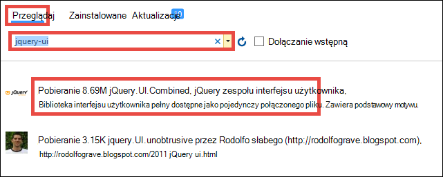

19. W okienku po prawej stronie kliknij przycisk **Zainstaluj**, a następnie kliknij **przycisk OK** , aby kontynuować.

19. Otwórz ~\App_Start\BundleConfig.cs i wprowadzić następujące zmiany wyróżnione:  
    <pre class="prettyprint">
    publiczne statyczne RegisterBundles(BundleCollection bundles) void {wiązki. Dodawanie (nowe ScriptBundle (&quot;~/bundles/jquery&quot;). Dołączanie ( &quot;~/Scripts/jquery-{version}.js&quot;<mark>, &quot;~/Scripts/jquery-ui-{version}.js&quot;, &quot;~/Scripts/AadPickerLibrary.js&quot;</mark>));

        bundles.Add(new ScriptBundle(&quot;~/bundles/jqueryval&quot;).Include(
                    &quot;~/Scripts/jquery.validate*&quot;));

        // Use the development version of Modernizr to develop with and learn from. Then, when you&#39;re
        // ready for production, use the build tool at http://modernizr.com to pick only the tests you need.
        bundles.Add(new ScriptBundle(&quot;~/bundles/modernizr&quot;).Include(
                    &quot;~/Scripts/modernizr-*&quot;));

        bundles.Add(new ScriptBundle(&quot;~/bundles/bootstrap&quot;).Include(
                    &quot;~/Scripts/bootstrap.js&quot;,
                    &quot;~/Scripts/respond.js&quot;));

        bundles.Add(new StyleBundle(&quot;~/Content/css&quot;).Include(
                    &quot;~/Content/bootstrap.css&quot;,
                    &quot;~/Content/site.css&quot;<mark>,
                    &quot;~/Content/themes/base/jquery-ui.css&quot;</mark>));
    }
    </pre>

    Istnieją inne sposoby performant zarządzanie plikami CSS i JavaScript w aplikacji. Jednak dla uproszczenia tylko zamierzasz potwierdzeń na zestawy, które są ładowane z każdego widoku.

12. Na koniec w ~ \Global.asax, Dodaj poniższy wiersz kodu w `Application_Start()` metody. `Ctrl`+`.`w przypadku każdego nazewnictwa błędu rozdzielczość go naprawić.

        AntiForgeryConfig.UniqueClaimTypeIdentifier = ClaimTypes.NameIdentifier;
    
    > [AZURE.NOTE] Ten wiersz kodu jest potrzebna, ponieważ korzysta z domyślnego szablonu MVC <code>[ValidateAntiForgeryToken]</code> ozdobny w niektórych działań. Ze względu na zachowanie opisane przez [Allen firmy Brock](https://twitter.com/BrockLAllen)     [MVC 4, AntiForgeryToken](http://brockallen.com/2012/07/08/mvc-4-antiforgerytoken-and-claims/) i roszczeń wpisu HTTP może zakończyć się niepowodzeniem poprawności tokenu przeciw fałszowaniu ponieważ:

    > - Azure Active Directory nie wysyła http://schemas.microsoft.com/accesscontrolservice/2010/07/claims/identityprovider, która jest wymagana domyślnie przez token przeciw fałszowaniu.
    > - Jeśli usługi Azure Active Directory jest synchronizowane z usług AD FS katalogu, zaufania usług AD FS domyślnie nie wysyłaj roszczeń http://schemas.microsoft.com/accesscontrolservice/2010/07/claims/identityprovider albo, mimo że można ręcznie skonfigurować usług AD FS, aby wysłać to zastrzeżenie.

    > `ClaimTypes.NameIdentifies`Określa roszczenia `http://schemas.xmlsoap.org/ws/2005/05/identity/claims/nameidentifier`, które dostarczają usługi Azure Active Directory.  

20. Teraz publikować zmiany. Kliknij prawym przyciskiem myszy projektu, a następnie kliknij pozycję **Publikuj**.

21. Kliknij pozycję **Ustawienia**, upewnij się, że jest parametry połączenia z bazą danych SQL, wybierz pozycję **Update bazy danych** wprowadź odpowiednie zmiany schematu dla modelu i kliknij przycisk **Publikuj**.

    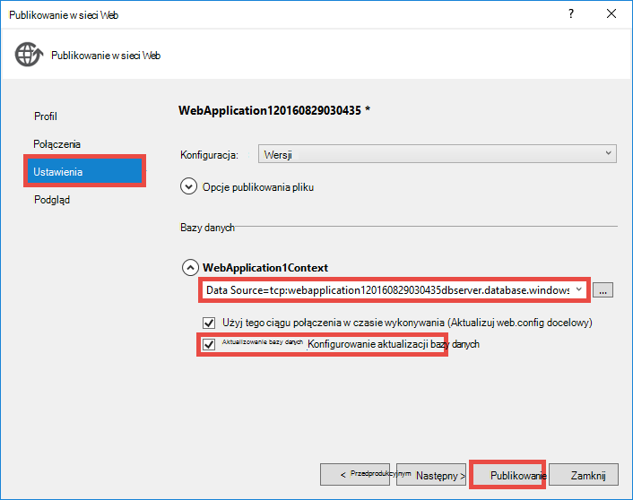

22. W przeglądarce przejdź do https://&lt;*argumentu*>.azurewebsites.net/workitems i kliknij przycisk **Utwórz nowy**.

23. Kliknij w polu **AssignedToName** . Powinien zostać wyświetlony użytkowników i grup z Twojej dzierżawy usługi Azure Active Directory, na liście rozwijanej. Można wpisać do filtrowania lub za pomocą `Up` lub `Down` klucza lub kliknij, aby wybrać użytkownika lub grupy. 

    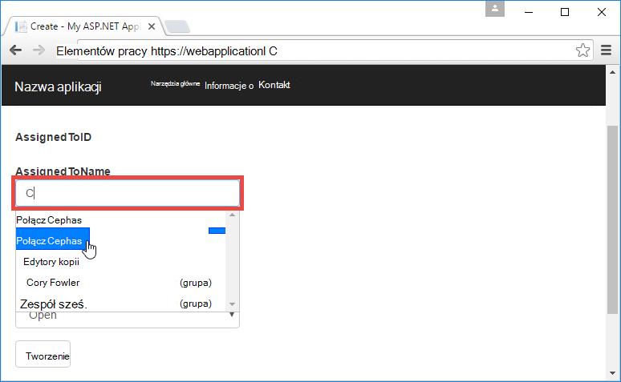

24. Kliknij przycisk **Utwórz** , aby zapisać zmiany. Następnie kliknij przycisk **Edytuj** element pracy utworzone, aby obserwować takie samo zachowanie.

Gratulacje teraz używasz aplikacji LOB z platformy Azure z dostępem do katalogu! Istnieje wiele więcej można zrobić za pomocą interfejsu API wykresu. Zobacz [informacje dotyczące interfejsu API Azure AD wykresu](https://msdn.microsoft.com/library/azure/ad/graph/api/api-catalog).

## Następny krok

Jeśli potrzebujesz kontrola dostępu oparta na rolach (RBAC) dla aplikacji LOB z platformy azure, zobacz [Aplikacji sieci Web — RoleClaims-DotNet](https://github.com/Azure-Samples/active-directory-dotnet-webapp-roleclaims) dla próbki od zespołu usługi Azure Active Directory. Przedstawiono sposób Włącz role dla aplikacji usługi Azure Active Directory, a następnie zezwolić użytkownikom `[Authorize]` ozdobny.

Jeśli aplikacji z LOB musi mieć dostęp do danych lokalnych, zobacz [Dostęp lokalnych zasobów za pomocą połączenia hybrydowych w usłudze Azure aplikacji](web-sites-hybrid-connection-get-started.md).

## Dodatkowe zasoby

- [Uwierzytelniania i autoryzacji w usłudze Azure aplikacji](../app-service/app-service-authentication-overview.md)
- [Typ poświadczeń uwierzytelniania usługi Active Directory w lokalnej w aplikacji Azure](web-sites-authentication-authorization.md)
- [Tworzenie aplikacji LOB z platformy Azure z uwierzytelnianiem usług AD FS](web-sites-dotnet-lob-application-adfs.md)
- [Uwierzytelniania aplikacji usługi i Azure Graph AD interfejsu API](https://cgillum.tech/2016/03/25/app-service-auth-aad-graph-api/)
- [Przykłady usługi Active Directory platformy Microsoft Azure i dokumentacja](https://github.com/AzureADSamples)
- [Azure Active Directory obsługiwane Token i typy oświadczeń](http://msdn.microsoft.com/library/azure/dn195587.aspx)

[Protect the Application with SSL and the Authorize Attribute]: web-sites-dotnet-deploy-aspnet-mvc-app-membership-oauth-sql-database.md#protect-the-application-with-ssl-and-the-authorize-attribute
