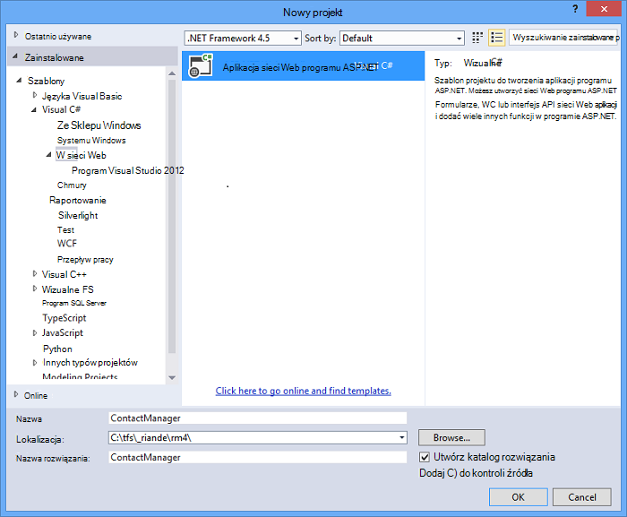
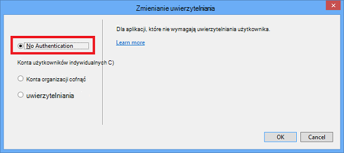
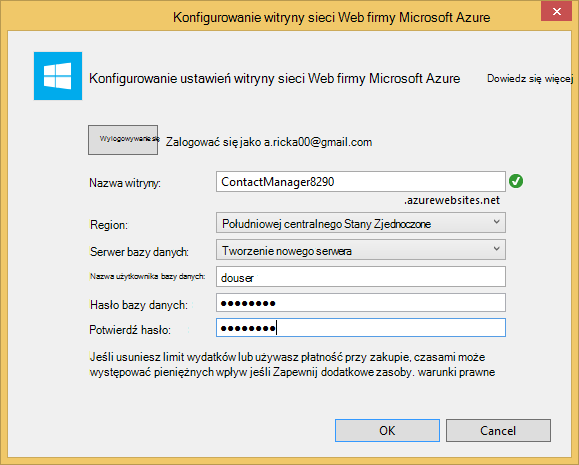
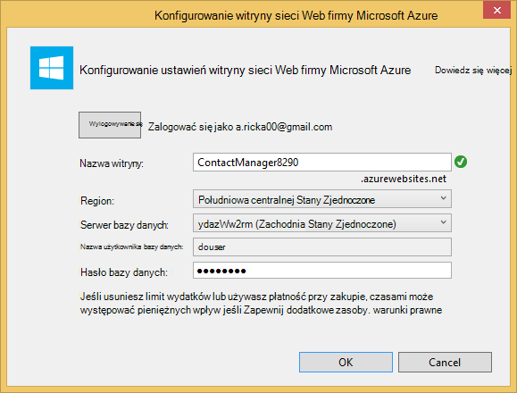
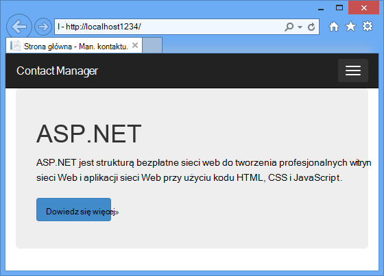
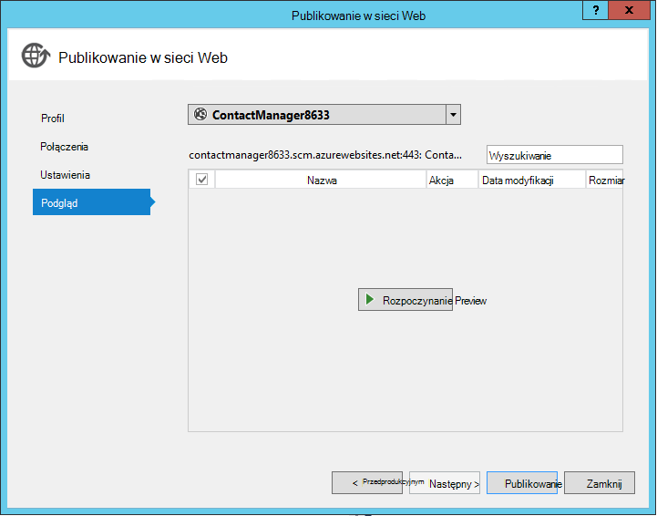
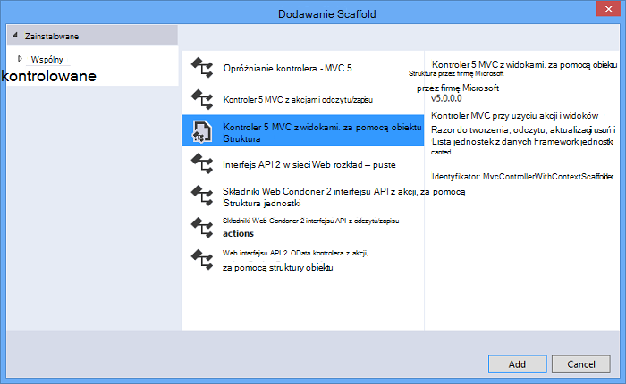
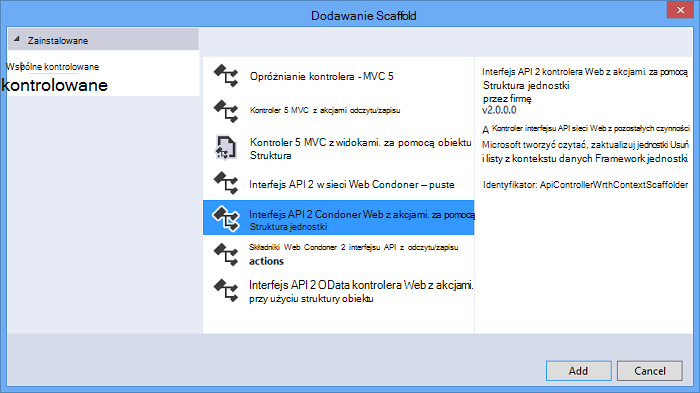
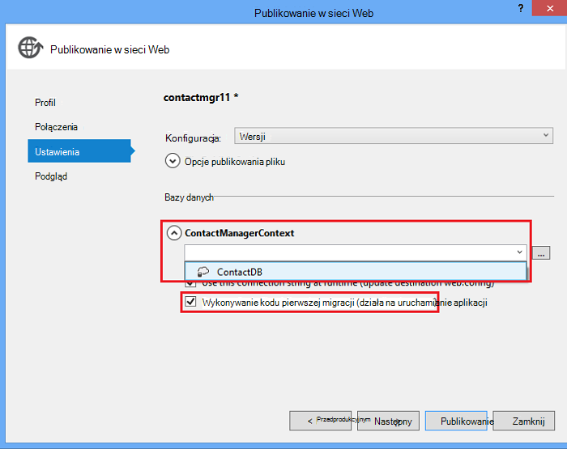

<properties 
    pageTitle="Tworzenie usługi REST, za pomocą interfejsu API sieci Web programu ASP.NET i baza danych SQL Azure aplikacji usługi" 
    description="Samouczek opisujący jak wdrożyć aplikację, która korzysta z interfejsu API sieci Web programu ASP.NET do aplikacji sieci web Azure za pomocą programu Visual Studio." 
    services="app-service\web" 
    documentationCenter=".net" 
    authors="Rick-Anderson" 
    writer="Rick-Anderson" 
    manager="wpickett" 
    editor=""/>

<tags 
    ms.service="app-service-web" 
    ms.workload="web" 
    ms.tgt_pltfrm="na" 
    ms.devlang="dotnet" 
    ms.topic="article" 
    ms.date="02/29/2016" 
    ms.author="riande"/>

# Tworzenie usługi REST, za pomocą interfejsu API sieci Web programu ASP.NET i baza danych SQL Azure aplikacji usługi

Ten samouczek pokazano, jak wdrażania aplikacji sieci web programu ASP.NET w [Usłudze Azure aplikacji](http://go.microsoft.com/fwlink/?LinkId=529714) przy użyciu Kreatora publikowania w sieci Web w Visual Studio 2013 lub program Visual Studio 2013 społeczności Edition. 

Możesz otworzyć konto Azure bezpłatnie, a jeśli nie masz jeszcze Visual Studio 2013, zestawu SDK automatycznie instaluje program Visual Studio 2013 dla Express sieci Web. Dlatego możesz rozpocząć opracowywania dla Azure całkowicie bezpłatnie.

Tego samouczka przyjęto założenie, że masz nie wcześniejszego doświadczenia w korzystaniu Azure. Na ten samouczek będą dostępne prosty przeglądania w górę i uruchamiania w chmurze.
 
Opisano następujące zagadnienia:

* Jak włączyć komputera rozwoju Azure przez zainstalowanie Azure SDK.
* Jak utworzyć projekt Visual Studio ASP.NET MVC 5 i publikowanie projektu w aplikacji Azure.
* Jak korzystać z interfejsu API sieci Web programu ASP.NET umożliwiające Restful interfejsu API.
* Jak używać bazy danych SQL do przechowywania danych w Azure.
* Jak publikować aktualizacje aplikacji Azure.

Będzie tworzyć prosta lista kontaktów aplikacji sieci web, który jest oparty na ASP.NET MVC 5 i używa Framework jednostki ADO.NET uzyskać dostęp do bazy danych. Na poniższej ilustracji przedstawiono złożonym aplikacji:

![Zrzut ekranu przedstawiający witrynę sieci web][intro001]

<!-- the next line produces the "Set up the development environment" section as see at http://azure.microsoft.com/documentation/articles/web-sites-dotnet-get-started/ -->
[AZURE.INCLUDE [create-account-and-websites-note](../../includes/create-account-and-websites-note.md)]

### Tworzenie projektu

1. Uruchom program Visual Studio 2013.
1. W menu **plik** kliknij polecenie **Nowy projekt**.
3. W oknie dialogowym **Nowy projekt** rozwiń **Visual C#** i wybierz pozycję **sieci Web** , a następnie wybierz **Aplikacji sieci Web programu ASP.NET**. Nazwa aplikacji **ContactManager** , a następnie kliknij **przycisk OK**.

    

1. W oknie dialogowym **Nowy projekt programu ASP.NET** wybierz szablon **MVC** , sprawdź **Interfejs API sieci Web** , a następnie kliknij przycisk **Zmień uwierzytelniania**.

1. W oknie dialogowym **Zmienianie uwierzytelniania** kliknij pozycję **Brak uwierzytelniania**, a następnie kliknij **przycisk OK**.

    

    Przykładowej aplikacji tworzonym nie będzie miał funkcje, które wymagają użytkowników się zalogować. Aby dowiedzieć się, jak wdrażać funkcje uwierzytelniania i autoryzacji Zobacz sekcję [Następne kroki](#nextsteps) na końcu tego samouczka. 

1. W oknie dialogowym **Nowy projekt ASP.NET** upewnij się, że jest zaznaczone pole wyboru **hosta w chmurze** , a następnie kliknij **przycisk OK**.

Jeśli masz nie wcześniej Azure, pojawi się zalogować.

1. Kreator konfiguracji sugeruje unikatową nazwę według *ContactManager* (patrz rysunek poniżej). Wybierz region najbliższym. [Azurespeed.com](http://www.azurespeed.com/ "AzureSpeed.com") umożliwia znalezienie najniższe opóźnienie centrum danych. 
2. Jeśli nie utworzono z serwerem bazy danych przed, wybierz pozycję **Utwórz nowy serwer**, wprowadź nazwę użytkownika bazy danych i hasło.

    

Jeśli masz z serwerem bazy danych, używać, aby utworzyć nową bazę danych. Serwer bazy danych są cenne zasób, a ogólnie chcesz utworzyć wiele baz danych na tym samym serwerze dla badania i rozwój zamiast tworzenia serwera bazy danych na bazę danych. Upewnij się, że witryna sieci web i bazy danych są w tym samym regionie.

### Ustawianie strony nagłówka i stopki

1. W **Eksploratorze rozwiązań**rozwiń *Views\Shared* folder, a następnie otwórz plik *_Layout.cshtml* .

    ![_Layout.cshtml w Eksploratorze rozwiązań][newapp004]

1. Zawartość pliku *Views\Shared_Layout.cshtml* należy zastąpić następujący kod:

        <!DOCTYPE html>
        <html lang="en">
        <head>
            <meta charset="utf-8" />
            <title>@ViewBag.Title - Contact Manager</title>
            <link href="~/favicon.ico" rel="shortcut icon" type="image/x-icon" />
            <meta name="viewport" content="width=device-width" />
            @Styles.Render("~/Content/css")
            @Scripts.Render("~/bundles/modernizr")
        </head>
        <body>
            <header>
                

                    

                        
@Html.ActionLink("Contact Manager", "Index", "Home")

                    

                

            </header>
            

                @RenderSection("featured", required: false)
                <section class="content-wrapper main-content clear-fix">
                    @RenderBody()
                </section>
            

            <footer>
                

                    

                        
&copy; @DateTime.Now.Year - Contact Manager

                    

                

            </footer>
            @Scripts.Render("~/bundles/jquery")
            @RenderSection("scripts", required: false)
        </body>
        </html>
            
Znaczniki powyżej zmienia nazwę aplikacji z "Moja aplikacja ASP.NET" na "Contact Manager" i powoduje usunięcie łączy **dla użytkowników domowych**, **temat** oraz **kontaktu**.

### Uruchom aplikację lokalnie

1. Naciśnij klawisze CTRL + F5, aby uruchomić aplikację.
Strona główna aplikacji jest wyświetlana w domyślnej przeglądarce.
    

To wszystko, należy wykonać teraz utworzyć aplikację, która będzie Wdroż Azure. Możesz później dodawać funkcji bazy danych.

## Wdrażanie aplikacji Azure

1. W programie Visual Studio kliknij prawym przyciskiem myszy projektu w **Eksploratorze rozwiązań** i z menu kontekstowego wybierz pozycję **Publikuj** .

    ![Publikowanie w menu kontekstowym projektu][PublishVSSolution]

    Zostanie otwarty Kreator **Publikowania w sieci Web** .

12. Kliknij przycisk **Publikuj**.

Program Visual Studio rozpocznie proces kopiowania pliku na serwerze Azure. Okno **dane wyjściowe** przedstawiono czynności wdrożenia zostały pobrane i raporty pomyślnego wdrożenia.

14. Domyślną przeglądarką zostanie otwarty automatycznie do określonego adresu URL wdrożonej witrynie.

    Aplikacja utworzonej teraz jest uruchomiona w chmurze.
    
    ![Do strony głównej wykonaj listy z platformy Azure][rxz2]

## Dodawanie bazy danych do aplikacji

Następnie będzie aktualizowanie aplikacji MVC, aby dodać możliwość wyświetlania i Aktualizuj kontakty i przechowywania danych w bazie danych. Aplikacja będzie korzystać struktury obiektu, aby utworzyć bazę danych, a także odczytywanie i aktualizowanie danych w bazie danych.

### Dodawanie klas modelu danych dla kontaktów

Możesz rozpocząć od tworzenia modelu proste dane w kodzie.

1. W **Eksploratorze rozwiązań**kliknij prawym przyciskiem myszy folder modeli, kliknij przycisk **Dodaj**, a następnie **zajęć**.

    ![Dodawanie klasy w menu kontekstowe folderu modeli][adddb001]

2. W oknie dialogowym **Dodawanie nowego elementu** nazwę nowego pliku klasy *Contact.cs*, a następnie kliknij przycisk **Dodaj**.

    ![Dodawanie nowego elementu, okno dialogowe][adddb002]

3. Zamień zawartość pliku Contacts.cs poniższy kod.

        using System.Globalization;
        namespace ContactManager.Models
        {
            public class Contact
            {
                public int ContactId { get; set; }
                public string Name { get; set; }
                public string Address { get; set; }
                public string City { get; set; }
                public string State { get; set; }
                public string Zip { get; set; }
                public string Email { get; set; }
                public string Twitter { get; set; }
                public string Self
                {
                    get { return string.Format(CultureInfo.CurrentCulture,
                         "api/contacts/{0}", this.ContactId); }
                    set { }
                }
            }
        }

**Skontaktuj się z** zajęć Określa dane, które będą przechowywane na każdym kontakcie, oraz klucz podstawowy, wartość ContactID, które są potrzebne w bazie danych. Więcej informacji o modelach danych można znaleźć w sekcji [Następne kroki](#nextsteps) na końcu tego samouczka.

### Tworzenie stron sieci web, które umożliwiają użytkownikom aplikacji do pracy z kontaktami

ASP.NET MVC funkcję rusztowania można automatycznie Generuj kod, który wykonuje tworzenie, odczytywanie, aktualizowanie i usuwanie akcji (OBSŁUGIWAŁ).

## Dodawanie kontrolera i w widoku danych

1. W **Eksploratorze rozwiązań**rozwiń folder kontrolerów.

3. Tworzenie projektu **(Ctrl + Shift + B)**. (Należy utworzyć projektu przed użyciem mechanizmu rusztowania.) 

4. Kliknij prawym przyciskiem myszy folder kontrolerów i kliknij przycisk **Dodaj**, a następnie kliknij **Kontroler**.

    ![Dodawanie kontrolera w menu kontekstowe folderu kontrolery][addcode001]

1. W oknie dialogowym **Dodawanie Scaffold** wybierz **Kontroler MVC z widokami, za pomocą struktury obiektu** , a następnie kliknij przycisk **Dodaj**.

 

6. Ustaw nazwę kontrolera **HomeController**. Wybierz **kontakt** jako swojej klasy modelu. Kliknij przycisk **nowy kontekst danych** i zaakceptuj domyślne "ContactManager.Models.ContactManagerContext" dla **nowego typu kontekst danych**. Kliknij przycisk **Dodaj**.

    Okno dialogowe zostanie wyświetlony monit: "plik o tej nazwie HomeController już kończy działanie. Czy chcesz zastąpić ją? ". Kliknij przycisk **Tak**. Firma Microsoft zostaną zastąpione kontroler dla użytkowników domowych, który został utworzony przy użyciu nowego projektu. Użyjemy nowego kontrolera dla użytkowników domowych na liście kontaktów.

    Programu Visual Studio tworzy metody kontroler i widoki OBSŁUGIWAŁ operacje na bazie danych dla obiektów **kontaktu** .

## Włączanie migracji, tworzenie bazy danych, Dodawanie przykładowych danych i inicjator danych ##

Następnego zadania należy włączyć funkcję [Migracji pierwszego kodu](http://curah.microsoft.com/55220) w celu utworzenia bazy danych, w zależności od modelu danych utworzony.

1. W menu **Narzędzia** wybierz **Menedżera pakietów biblioteki** , a następnie **Konsoli Menedżera pakietów**.

    ![Menedżer pakietów konsoli w menu Narzędzia][addcode008]

2. W oknie **Menedżer pakietów konsoli** wpisz następujące polecenie:

        enable-migrations 
  
    Polecenie **Włącz migracji** tworzy folder *migracji* i umieszcza go w tym folderze plik *Configuration.cs* , który można edytować w celu skonfigurowania migracji. 

2. W oknie **Menedżer pakietów konsoli** wpisz następujące polecenie:

        add-migration Initial

    Polecenie **Dodaj migracji początkowy** generuje klasę o nazwie ** &lt;date_stamp&gt;początkowej** który utworzy bazę danych. Pierwszy parametr ( *początkowa* ) jest dowolnego i używane do tworzenia nazwy pliku. Widać nowych plików klas w **Eksploratorze rozwiązań**.

    W klasie **początkowe** metoda **w górę** tworzy tabelę Kontakty, a **w dół** metodę (Jeśli chcesz powrócić do poprzedniego stanu) umieści go.

3. Otwórz plik *Migrations\Configuration.cs* . 

4. Dodaj następujące obszary nazw. 

         using ContactManager.Models;

5. Zastąp metodę *nasion* następujący kod:
        
        protected override void Seed(ContactManager.Models.ContactManagerContext context)
        {
            context.Contacts.AddOrUpdate(p => p.Name,
               new Contact
               {
                   Name = "Debra Garcia",
                   Address = "1234 Main St",
                   City = "Redmond",
                   State = "WA",
                   Zip = "10999",
                   Email = "debra@example.com",
                   Twitter = "debra_example"
               },
                new Contact
                {
                    Name = "Thorsten Weinrich",
                    Address = "5678 1st Ave W",
                    City = "Redmond",
                    State = "WA",
                    Zip = "10999",
                    Email = "thorsten@example.com",
                    Twitter = "thorsten_example"
                },
                new Contact
                {
                    Name = "Yuhong Li",
                    Address = "9012 State st",
                    City = "Redmond",
                    State = "WA",
                    Zip = "10999",
                    Email = "yuhong@example.com",
                    Twitter = "yuhong_example"
                },
                new Contact
                {
                    Name = "Jon Orton",
                    Address = "3456 Maple St",
                    City = "Redmond",
                    State = "WA",
                    Zip = "10999",
                    Email = "jon@example.com",
                    Twitter = "jon_example"
                },
                new Contact
                {
                    Name = "Diliana Alexieva-Bosseva",
                    Address = "7890 2nd Ave E",
                    City = "Redmond",
                    State = "WA",
                    Zip = "10999",
                    Email = "diliana@example.com",
                    Twitter = "diliana_example"
                }
                );
        }

    Kod powyżej zostanie zainicjowany bazy danych z informacjami kontaktowymi. Aby uzyskać więcej informacji na obsługiwanie bazy danych zobacz [DBs debugowania jednostki Framework (EF)](http://blogs.msdn.com/b/rickandy/archive/2013/02/12/seeding-and-debugging-entity-framework-ef-dbs.aspx).

1. W **Konsoli Menedżera pakietów** wprowadź polecenie:

        update-database

    ![Polecenia konsoli Menedżera pakietów][addcode009]

    **Baza danych aktualizacji** uruchamia pierwszej migracji, co spowoduje utworzenie bazy danych. Domyślnie baza danych jest tworzona jako bazy danych programu SQL Server Express LocalDB.

1. Naciśnij klawisze CTRL + F5, aby uruchomić aplikację. 

Aplikacja są wyświetlane dane nasion i łącza edycji, szczegóły i Usuń.

![MVC widok danych][rxz3]

## Edytuj widok

1. Otwórz plik *Views\Home\Index.cshtml* . W następnym kroku możemy zamieni wygenerowane adiustacji kod, który używa [jQuery](http://jquery.com/) i [Knockout.js](http://knockoutjs.com/). Ten nowy kod pobiera na liście kontaktów z przy użyciu interfejsu API sieci web i JSON i następnie powiązanie danych kontaktów do interfejsu użytkownika, przy użyciu knockout.js. Aby uzyskać więcej informacji zobacz sekcję [Następne kroki](#nextsteps) na końcu tego samouczka. 

2. Zamień zawartość pliku poniższy kod.

        @model IEnumerable<ContactManager.Models.Contact>
        @{
            ViewBag.Title = "Home";
        }
        @section Scripts {
            @Scripts.Render("~/bundles/knockout")
            
        }
        <ul id="contacts" data-bind="foreach: contacts">
            <li class="ui-widget-content ui-corner-all">
                <h1 data-bind="text: Name" class="ui-widget-header"></h1>
                

                

                    ,
                    
                    
                

                

                
Email?

                

                
Twitter?

                
<a data-bind="attr: { href: Self }, click: $root.removeContact" class="removeContact ui-state-default ui-corner-all">Remove</a>

            </li>
        </ul>
        <form id="addContact" data-bind="submit: addContact">
            <fieldset>
                <legend>Add New Contact</legend>
                <ol>
                    <li>
                        <label for="Name">Name</label>
                        <input type="text" name="Name" />
                    </li>
                    <li>
                        <label for="Address">Address</label>
                        <input type="text" name="Address" >
                    </li>
                    <li>
                        <label for="City">City</label>
                        <input type="text" name="City" />
                    </li>
                    <li>
                        <label for="State">State</label>
                        <input type="text" name="State" />
                    </li>
                    <li>
                        <label for="Zip">Zip</label>
                        <input type="text" name="Zip" />
                    </li>
                    <li>
                        <label for="Email">E-mail</label>
                        <input type="text" name="Email" />
                    </li>
                    <li>
                        <label for="Twitter">Twitter</label>
                        <input type="text" name="Twitter" />
                    </li>
                </ol>
                <input type="submit" value="Add" />
            </fieldset>
        </form>

3. Kliknij prawym przyciskiem myszy folder zawartości i kliknij przycisk **Dodaj**, a następnie kliknij **Nowy element**.

    ![Dodawanie arkusza stylów w menu kontekstowe zawartości folderów][addcode005]

4. W oknie dialogowym **Dodawanie nowego elementu** wprowadź **Styl** w polu wyszukiwania prawym górnym rogu, a następnie wybierz pozycję **Arkusz stylów**.
    ![Dodawanie nowego elementu, okno dialogowe][rxStyle]

5. Określ nazwę pliku *Contacts.css* i kliknij przycisk **Dodaj**. Zamień zawartość pliku poniższy kod.
    
        .column {
            float: left;
            width: 50%;
            padding: 0;
            margin: 5px 0;
        }
        form ol {
            list-style-type: none;
            padding: 0;
            margin: 0;
        }
        form li {
            padding: 1px;
            margin: 3px;
        }
        form input[type="text"] {
            width: 100%;
        }
        #addContact {
            width: 300px;
            float: left;
            width:30%;
        }
        #contacts {
            list-style-type: none;
            margin: 0;
            padding: 0;
            float:left;
            width: 70%;
        }
        #contacts li {
            margin: 3px 3px 3px 0;
            padding: 1px;
            float: left;
            width: 300px;
            text-align: center;
            background-image: none;
            background-color: #F5F5F5;
        }
        #contacts li h1
        {
            padding: 0;
            margin: 0;
            background-image: none;
            background-color: Orange;
            color: White;
            font-family: Trebuchet MS, Tahoma, Verdana, Arial, sans-serif;
        }
        .removeContact, .viewImage
        {
            padding: 3px;
            text-decoration: none;
        }

    Użyjemy tego arkusza stylów dla układu, kolorów i stylów są używane w aplikacji Menedżera kontaktów.

6. Otwórz plik *App_Start\BundleConfig.cs* .

7. Dodaj następujący kod, aby zarejestrować dodatek(http://knockoutjs.com/index.html "KO") [odcinania].

        bundles.Add(new ScriptBundle("~/bundles/knockout").Include(
                    "~/Scripts/knockout-{version}.js"));
    Ten przykładowy przy użyciu odcinania w celu uproszczenia dynamiczne kodu JavaScript, która obsługuje szablony ekranu.

8. Modyfikowanie pozycję treści i arkuszy css, aby zarejestrować arkusz stylów *contacts.css* . Zmień następujący wiersz:

                 bundles.Add(new StyleBundle("~/Content/css").Include(
                   "~/Content/bootstrap.css",
                   "~/Content/site.css"));
Aby:

        bundles.Add(new StyleBundle("~/Content/css").Include(
                   "~/Content/bootstrap.css",
                   "~/Content/contacts.css",
                   "~/Content/site.css"));

1. W konsoli Menedżera pakietów, uruchom następujące polecenie, aby zainstalować odcinania.

        Install-Package knockoutjs

## Dodawanie kontrolera interfejsu API sieci Web — Restful

1. W **Eksploratorze rozwiązań**kliknij prawym przyciskiem myszy kontrolerów i kliknij przycisk **Dodaj** , a następnie **kontroler...** 

1. W oknie dialogowym **Dodawanie Scaffold** wprowadź **Kontroler 2 interfejsu API sieci Web z akcjami, przy użyciu struktury obiektu** , a następnie kliknij przycisk **Dodaj**.

    

4. W oknie dialogowym **Dodawanie kontroler** wprowadź "ContactsController" jako nazwy kontrolera. Wybierz pozycję "Kontaktu (ContactManager.Models)" **Klasa modelu**.  Zachować wartość domyślną dla **klasy kontekst danych**. 

6. Kliknij przycisk **Dodaj**.

### Uruchom aplikację lokalnie

1. Naciśnij klawisze CTRL + F5, aby uruchomić aplikację.

    ![Strony indeksu][intro001]

2. Wprowadź kontaktu, a następnie kliknij przycisk **Dodaj**. Aplikacja zwraca do strony głównej i wyświetla kontakty, które zostały wprowadzone.

    ![Strona indeks z elementów listy zadań do wykonania][addwebapi004]

3. W przeglądarce Dołącz **/api/contacts** do adresu URL.

    Pozostały adres URL będzie wyglądać podobnie http://localhost:1234-interfejsu api i kontakty. RESTful interfejsu API sieci web możesz dodać zwraca przechowywane kontakty. Firefox i Chrome są wyświetlane dane w formacie XML.

    ![Strona indeks z elementów listy zadań do wykonania][rxFFchrome]
    

    IE zostanie wyświetlony monit o otwarcie lub zapisanie kontakty.

    ![Okno dialogowe zapisywania interfejsu API sieci Web][addwebapi006]
    
    
    Zwrócone kontakty można otworzyć w Notatniku lub w przeglądarce.
    
    Te dane wyjściowe może być używana przez innej aplikacji, takich jak strony sieci web dla urządzeń przenośnych lub aplikacji.

    ![Okno dialogowe zapisywania interfejsu API sieci Web][addwebapi007]

    **Ostrzeżenie o zabezpieczeniach**: W tym momencie aplikacja jest niebezpiecznej i podatne na ataki CSRF. W dalszej części samouczka luka ta zostanie usunięty. Aby uzyskać więcej informacji, zobacz [ataki interfejsu zapobieganie międzywitrynowe żądanie fałszowaniu (CSRF)][prevent-csrf-attacks].
## Zabezpieczanie XSRF

Żądanie międzywitrynowe fałszowaniu (nazywane także XSRF lub CSRF) jest atakiem przed aplikacji sieci web hostowanej zgodnie z którą złośliwe witryny sieci Web, można wpływać interakcji między przeglądarką klienta i witrynę sieci Web zaufane w tej przeglądarce. Ataki te są możliwe, ponieważ przeglądarki sieci web będzie wysyłać tokenów uwierzytelniania automatycznie z każdego żądania do witryny sieci Web. Przykład kanonicznego jest cookie uwierzytelniania, takich jak ASP. Biletów uwierzytelniania formularzy w sieci. Jednak tych ataki można kierować witryny sieci Web za pomocą dowolnego mechanizm uwierzytelniania trwałych (na przykład uwierzytelniania systemu Windows, podstawowe i tak dalej).

Ataki XSRF różni się od atakiem wyłudzaniu informacji. Wyłudzania wymagają interakcji z ofiarą. W celu wyłudzania informacji złośliwy witryny sieci Web będzie symulowanie docelowej witryny sieci Web, a ofiarą jest fooled do ujawnienia informacji poufnych osobie. W atakiem XSRF nie należy często bez interakcji z ofiarą. Zamiast tej jest Polegaj na przeglądarce automatycznego wysyłania wszystkich odpowiednich plików cookie do miejsca docelowego w sieci Web.

Aby uzyskać więcej informacji zobacz [Otwartego projektu zabezpieczeń aplikacji sieci Web](https://www.owasp.org/index.php/Main_Page) (OWASP) [XSRF](https://www.owasp.org/index.php/Cross-Site_Request_Forgery_(CSRF)).

1. W **Eksploratorze rozwiązań**prawym przyciskiem myszy **ContactManager** projektu i kliknij przycisk **Dodaj** , a następnie kliknij **zajęć**.

2. Plikowi nazwę *ValidateHttpAntiForgeryTokenAttribute.cs* i Dodaj następujący kod:

        using System;
        using System.Collections.Generic;
        using System.Linq;
        using System.Net;
        using System.Net.Http;
        using System.Web.Helpers;
        using System.Web.Http.Controllers;
        using System.Web.Http.Filters;
        using System.Web.Mvc;
        namespace ContactManager.Filters
        {
            public class ValidateHttpAntiForgeryTokenAttribute : AuthorizationFilterAttribute
            {
                public override void OnAuthorization(HttpActionContext actionContext)
                {
                    HttpRequestMessage request = actionContext.ControllerContext.Request;
                    try
                    {
                        if (IsAjaxRequest(request))
                        {
                            ValidateRequestHeader(request);
                        }
                        else
                        {
                            AntiForgery.Validate();
                        }
                    }
                    catch (HttpAntiForgeryException e)
                    {
                        actionContext.Response = request.CreateErrorResponse(HttpStatusCode.Forbidden, e);
                    }
                }
                private bool IsAjaxRequest(HttpRequestMessage request)
                {
                    IEnumerable<string> xRequestedWithHeaders;
                    if (request.Headers.TryGetValues("X-Requested-With", out xRequestedWithHeaders))
                    {
                        string headerValue = xRequestedWithHeaders.FirstOrDefault();
                        if (!String.IsNullOrEmpty(headerValue))
                        {
                            return String.Equals(headerValue, "XMLHttpRequest", StringComparison.OrdinalIgnoreCase);
                        }
                    }
                    return false;
                }
                private void ValidateRequestHeader(HttpRequestMessage request)
                {
                    string cookieToken = String.Empty;
                    string formToken = String.Empty;
                    IEnumerable<string> tokenHeaders;
                    if (request.Headers.TryGetValues("RequestVerificationToken", out tokenHeaders))
                    {
                        string tokenValue = tokenHeaders.FirstOrDefault();
                        if (!String.IsNullOrEmpty(tokenValue))
                        {
                            string[] tokens = tokenValue.Split(':');
                            if (tokens.Length == 2)
                            {
                                cookieToken = tokens[0].Trim();
                                formToken = tokens[1].Trim();
                            }
                        }
                    }
                    AntiForgery.Validate(cookieToken, formToken);
                }
            }
        }

1. Dodaj następującą instrukcję *przy użyciu* administratorowi zamówień, aby mieć dostęp do atrybutu **[ValidateHttpAntiForgeryToken]** .

        using ContactManager.Filters;

1. Dodaj atrybut **[ValidateHttpAntiForgeryToken]** metod wpisu **ContactsController** w celu ich ochrony przed zagrożeniami XSRF. Doda go do metod akcji "PutContact", "PostContact" i **DeleteContact** .

        [ValidateHttpAntiForgeryToken]
            public IHttpActionResult PutContact(int id, Contact contact)
            {

1. Zaktualizuj sekcji *skrypty* pliku *Views\Home\Index.cshtml* , który zawiera kod, aby pobrać tokenów XSRF.

         @section Scripts {
            @Scripts.Render("~/bundles/knockout")
            
         }

## Publikowanie aktualizacji aplikacji Azure i baza danych SQL

Aby opublikować aplikację, możesz Powtórz powyższe czynności, które zostały wykonane wcześniej.

1. W **Eksploratorze rozwiązań**kliknij prawym przyciskiem myszy projektu, a następnie wybierz pozycję **Publikuj**.

    ![Publikowanie][rxP]

5. Kliknij kartę **Ustawienia** .
    

1. W obszarze **ContactsManagerContext(ContactsManagerContext)**kliknij ikonę **v** , aby zmienić *Parametry połączenia zdalnego* parametry połączenia dla bazy danych kontaktów. Kliknij pozycję **ContactDB**.

    

7. Zaznacz pole wyboru w przypadku **Wykonywania migracji pierwszy kod (działa na uruchamianie aplikacji)**.

1. Kliknij przycisk **Dalej** , a następnie kliknij pozycję **Podgląd**. Program Visual Studio Wyświetla listę plików, które zostaną dodane lub zaktualizowane.

8. Kliknij przycisk **Publikuj**.
Po zakończeniu rozmieszczania przeglądarka otworzy się do strony głównej aplikacji.

    ![Strona indeksu z żadnych kontaktów][intro001]

    Visual Studio publikowanie proces automatycznie skonfigurowany parametry połączenia w pliku *Web.config* wdrożonym, aby wskazywały z bazą danych SQL. On również skonfigurowany migracji pierwszy kod automatycznie po raz pierwszy aplikacja uzyskuje dostęp do bazy danych po wdrożeniu uaktualnienie do najnowszej wersji bazy danych.

    W wyniku tej konfiguracji kod pierwszego baza danych utworzona przez uruchomienie kodu w klasie **początkowej** , który został utworzony wcześniej. Jak to aplikacja próbowała dostęp do bazy danych po wdrożeniu po raz pierwszy.

9. Wprowadź kontaktu, tak jak po uruchomieniu aplikacji lokalnie, aby zweryfikować, że pomyślnie rozmieszczania bazy danych.

Gdy pojawi się, że element, który zostanie wprowadzona zostanie zapisana i pojawi się na stronie Menedżera kontaktów, pamiętaj, że były przechowywane w bazie danych.

![Strony indeksu kontaktów][addwebapi004]

Aplikacja jest teraz uruchomiona w chmurze, przechowywanie danych za pomocą bazy danych SQL. Po zakończeniu testowania aplikacji platformy Azure, usuń ją. Aplikacja jest publiczna, a nie ma mechanizmu ograniczyć dostęp.

>[AZURE.NOTE] Jeśli chcesz rozpocząć pracę z Azure aplikacji usługi przed utworzeniem konta dla konta Azure, przejdź do [Spróbuj aplikacji usługi](http://go.microsoft.com/fwlink/?LinkId=523751), którym natychmiast można utworzyć aplikację sieci web krótkotrwałe starter w aplikacji usługi. Nie kart kredytowych wymagane; nie zobowiązania.

## Następne kroki

Rzeczywistej aplikacji wymaga uwierzytelniania i autoryzacji, a członkostwo bazy danych można użyć do tego celu. Samouczek [wdrożyć aplikację bezpiecznego MVC ASP.NET z OAuth, członkostwa i baza danych SQL](web-sites-dotnet-deploy-aspnet-mvc-app-membership-oauth-sql-database.md) jest oparty na tym samouczku i pokazano, jak wdrożyć aplikację sieci web z bazą danych członkostwa.

Inny sposób przechowywania danych w aplikacji Azure jest za pomocą Azure miejscem do magazynowania, które zapewniają magazynowanie danych-relacyjnych w postaci obiektów blob i tabel. Poniższe łącza udostępniają więcej informacji na interfejs API sieci Web, ASP.NET MVC i Windows Azure.
 

* [Wprowadzenie do programu Framework jednostki za pomocą MVC][EFCodeFirstMVCTutorial]
* [Wprowadzenie do programu ASP.NET MVC 5](http://www.asp.net/mvc/tutorials/mvc-5/introduction/getting-started)
* [Z pierwszej ASP.NET interfejsu API sieci Web](http://www.asp.net/web-api/overview/getting-started-with-aspnet-web-api/tutorial-your-first-web-api)
* [Debugowanie WAWS](web-sites-dotnet-troubleshoot-visual-studio.md)

Ten samouczek i przykładowej aplikacji został zapisany przez [Anderson mającej](http://blogs.msdn.com/b/rickandy/) (serwisu Twitter [@RickAndMSFT](https://twitter.com/RickAndMSFT)) z pomocą Myrcha Toma i Dorrans Marcin (serwisu Twitter [@blowdart](https://twitter.com/blowdart)). 

Sprawdź Opuść opinie dotyczące możesz polubiły lub chcesz wyświetlić ulepszone, nie tylko o samouczka samej, ale również dotyczące produktów, które go zaprezentowano. Swoją opinię pomogą nam Wyznaczanie priorytetów ulepszenia. Firma Microsoft interesuje zwłaszcza sprawdzanie, ile odsetek w większą automatyzację procesu konfigurowania i wdrażania członkostwa w bazie danych. 

## Informacje o zmianach
* Przewodnika do zmiany z witryn sieci Web do usługi aplikacji Zobacz: [Usługa Azure aplikacji i jego wpływ na istniejące usługi Azure](http://go.microsoft.com/fwlink/?LinkId=529714)

<!-- bookmarks -->
[Add an OAuth Provider]: #addOauth
[Add Roles to the Membership Database]:#mbrDB
[Create a Data Deployment Script]:#ppd
[Update the Membership Database]:#ppd2
[setupdbenv]: #bkmk_setupdevenv
[setupwindowsazureenv]: #bkmk_setupwindowsazure
[createapplication]: #bkmk_createmvc4app
[deployapp1]: #bkmk_deploytowindowsazure1
[adddb]: #bkmk_addadatabase
[addcontroller]: #bkmk_addcontroller
[addwebapi]: #bkmk_addwebapi
[deploy2]: #bkmk_deploydatabaseupdate

<!-- links -->
[EFCodeFirstMVCTutorial]: http://www.asp.net/mvc/tutorials/getting-started-with-ef-using-mvc/creating-an-entity-framework-data-model-for-an-asp-net-mvc-application
[dbcontext-link]: http://msdn.microsoft.com/library/system.data.entity.dbcontext(v=VS.103).aspx

<!-- images-->
[rxE]: ./media/web-sites-dotnet-rest-service-aspnet-api-sql-database/rxE.png
[rxP]: ./media/web-sites-dotnet-rest-service-aspnet-api-sql-database/rxP.png
[rx22]: ./media/web-sites-dotnet-rest-service-aspnet-api-sql-database/
[rxb2]: ./media/web-sites-dotnet-rest-service-aspnet-api-sql-database/rxb2.png
[rxz]: ./media/web-sites-dotnet-rest-service-aspnet-api-sql-database/rxz.png
[rxzz]: ./media/web-sites-dotnet-rest-service-aspnet-api-sql-database/rxzz.png
[rxz2]: ./media/web-sites-dotnet-rest-service-aspnet-api-sql-database/rxz2.png
[rxz3]: ./media/web-sites-dotnet-rest-service-aspnet-api-sql-database/rxz3.png
[rxStyle]: ./media/web-sites-dotnet-rest-service-aspnet-api-sql-database/rxStyle.png
[rxz4]: ./media/web-sites-dotnet-rest-service-aspnet-api-sql-database/rxz4.png
[rxz44]: ./media/web-sites-dotnet-rest-service-aspnet-api-sql-database/rxz44.png
[rxNewCtx]: ./media/web-sites-dotnet-rest-service-aspnet-api-sql-database/rxNewCtx.png
[rxPrevDB]: ./media/web-sites-dotnet-rest-service-aspnet-api-sql-database/rxPrevDB.png
[rxOverwrite]: ./media/web-sites-dotnet-rest-service-aspnet-api-sql-database/rxOverwrite.png
[rxPWS]: ./media/web-sites-dotnet-rest-service-aspnet-api-sql-database/rxPWS.png
[rxNewCtx]: ./media/web-sites-dotnet-rest-service-aspnet-api-sql-database/rxNewCtx.png
[rxAddApiController]: ./media/web-sites-dotnet-rest-service-aspnet-api-sql-database/rxAddApiController.png
[rxFFchrome]: ./media/web-sites-dotnet-rest-service-aspnet-api-sql-database/rxFFchrome.png
[intro001]: ./media/web-sites-dotnet-rest-service-aspnet-api-sql-database/dntutmobil-intro-finished-web-app.png
[rxCreateWSwithDB]: ./media/web-sites-dotnet-rest-service-aspnet-api-sql-database/rxCreateWSwithDB.png
[setup007]: ./media/web-sites-dotnet-rest-service-aspnet-api-sql-database/dntutmobile-setup-azure-site-004.png
[setup009]: ../Media/dntutmobile-setup-azure-site-006.png
[newapp002]: ./media/web-sites-dotnet-rest-service-aspnet-api-sql-database/dntutmobile-createapp-002.png
[newapp004]: ./media/web-sites-dotnet-rest-service-aspnet-api-sql-database/dntutmobile-createapp-004.png
[firsdeploy007]: ./media/web-sites-dotnet-rest-service-aspnet-api-sql-database/dntutmobile-deploy1-publish-005.png
[firsdeploy009]: ./media/web-sites-dotnet-rest-service-aspnet-api-sql-database/dntutmobile-deploy1-publish-007.png
[adddb001]: ./media/web-sites-dotnet-rest-service-aspnet-api-sql-database/dntutmobile-adddatabase-001.png
[adddb002]: ./media/web-sites-dotnet-rest-service-aspnet-api-sql-database/dntutmobile-adddatabase-002.png
[addcode001]: ./media/web-sites-dotnet-rest-service-aspnet-api-sql-database/dntutmobile-controller-add-context-menu.png
[addcode002]: ./media/web-sites-dotnet-rest-service-aspnet-api-sql-database/dntutmobile-controller-add-controller-dialog.png
[addcode004]: ./media/web-sites-dotnet-rest-service-aspnet-api-sql-database/dntutmobile-controller-modify-index-context.png
[addcode005]: ./media/web-sites-dotnet-rest-service-aspnet-api-sql-database/dntutmobile-controller-add-contents-context-menu.png
[addcode007]: ./media/web-sites-dotnet-rest-service-aspnet-api-sql-database/dntutmobile-controller-modify-bundleconfig-context.png
[addcode008]: ./media/web-sites-dotnet-rest-service-aspnet-api-sql-database/dntutmobile-migrations-package-manager-menu.png
[addcode009]: ./media/web-sites-dotnet-rest-service-aspnet-api-sql-database/dntutmobile-migrations-package-manager-console.png
[addwebapi004]: ./media/web-sites-dotnet-rest-service-aspnet-api-sql-database/dntutmobile-webapi-added-contact.png
[addwebapi006]: ./media/web-sites-dotnet-rest-service-aspnet-api-sql-database/dntutmobile-webapi-save-returned-contacts.png
[addwebapi007]: ./media/web-sites-dotnet-rest-service-aspnet-api-sql-database/dntutmobile-webapi-contacts-in-notepad.png
[Add XSRF Protection]: #xsrf
[WebPIAzureSdk20NetVS12]: ./media/web-sites-dotnet-rest-service-aspnet-api-sql-database/WebPIAzureSdk20NetVS12.png
[Add XSRF Protection]: #xsrf
[ImportPublishSettings]: ./media/web-sites-dotnet-rest-service-aspnet-api-sql-database/ImportPublishSettings.png
[ImportPublishProfile]: ./media/web-sites-dotnet-rest-service-aspnet-api-sql-database/ImportPublishProfile.png
[PublishVSSolution]: ./media/web-sites-dotnet-rest-service-aspnet-api-sql-database/PublishVSSolution.png
[ValidateConnection]: ./media/web-sites-dotnet-rest-service-aspnet-api-sql-database/ValidateConnection.png
[WebPIAzureSdk20NetVS12]: ./media/web-sites-dotnet-rest-service-aspnet-api-sql-database/WebPIAzureSdk20NetVS12.png
[prevent-csrf-attacks]: http://www.asp.net/web-api/overview/security/preventing-cross-site-request-forgery-(csrf)-attacks
 
