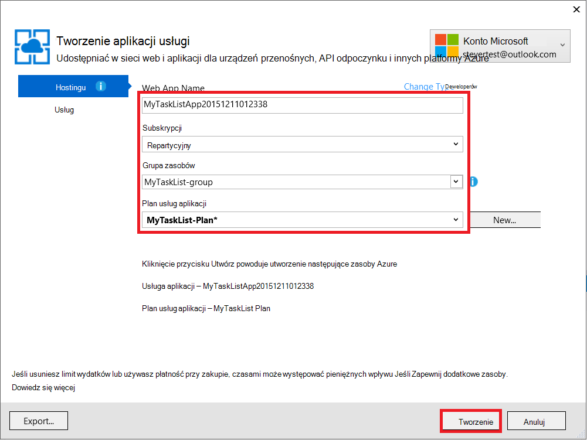
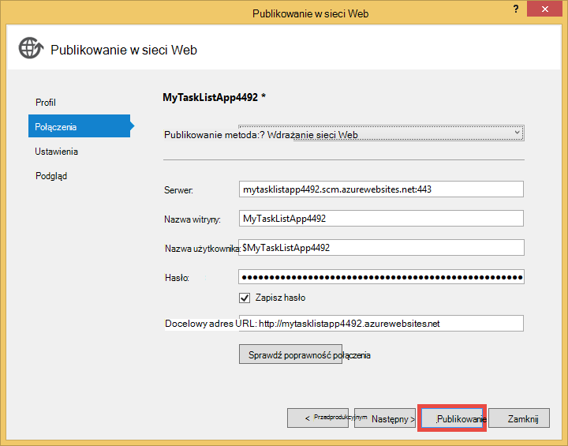

<properties 
    pageTitle="Tworzenie aplikacji sieci web w Azure łączącym się MongoDB uruchomione na komputerze wirtualnych" 
    description="Samouczek opisujący sposób używania cyfra Aby wdrożyć aplikację ASP.NET Azure aplikacji usługi połączony z MongoDB na maszyn wirtualnych Azure."
    tags="azure-portal" 
    services="app-service\web, virtual-machines" 
    documentationCenter=".net" 
    authors="cephalin" 
    manager="wpickett" 
    editor=""/>

<tags 
    ms.service="app-service-web" 
    ms.workload="web" 
    ms.tgt_pltfrm="na" 
    ms.devlang="dotnet" 
    ms.topic="article" 
    ms.date="02/29/2016" 
    ms.author="cephalin"/>

# Tworzenie aplikacji sieci web w Azure łączącym się MongoDB uruchomione na komputerze wirtualnych

Cyfra można wdrażać aplikacji ASP.NET Azure aplikacji usługi sieci Web. W tym samouczku utworzy aplikacji listy zadań, która nawiązuje połączenie z bazą danych MongoDB uruchomione na komputerze wirtualnej platformy Azure prosty zewnętrzną MVC ASP.NET.  [MongoDB] [ MongoDB] to popularne Otwórz źródło bazy danych NoSQL wysokiej wydajności. Po uruchamiania i testowania aplikacji ASP.NET na komputerze dewelopera, przekazujesz aplikacji usługi sieci Web aplikacji przy użyciu cyfra.

>[AZURE.NOTE] Jeśli chcesz rozpocząć pracę z Azure aplikacji usługi przed utworzeniem konta dla konta Azure, przejdź do [Spróbuj aplikacji usługi](http://go.microsoft.com/fwlink/?LinkId=523751), którym natychmiast można utworzyć aplikację sieci web krótkotrwałe starter w aplikacji usługi. Nie kart kredytowych wymagane; nie zobowiązania.

## Wiedzy tła ##

Ten samouczek, ale nie są wymagane jest przydatny wiedzy z następujących czynności:

* C# sterownik MongoDB. Aby uzyskać więcej informacji o tworzeniu aplikacji C# przed MongoDB, zobacz MongoDB [Języka CSharp języka Centrum][MongoC#LangCenter]. 
* ASP .NET framework aplikacji sieci web. Dowiedz się, wszystko na temat go w [witrynie sieci Web programu ASP.net][ASP.NET].
* ASP .NET MVC framework aplikacji sieci web. Dowiedz się, wszystko na temat go w [witrynie sieci Web programu ASP.NET MVC][MVCWebSite].
* Azure. Można rozpocząć czytanie u [Azure][WindowsAzure].

## Wymagania wstępne ##

- [Program Visual Studio Express 2013 dla sieci Web]  [ VSEWeb] lub [program Visual Studio 2013] [VSUlt]
- [Azure SDK dla środowiska .NET](http://go.microsoft.com/fwlink/p/?linkid=323510&clcid=0x409)
- Aktywną subskrypcję Microsoft Azure

[AZURE.INCLUDE [create-account-and-websites-note](../../includes/create-account-and-websites-note.md)]

 
## Tworzenie maszyny wirtualnej i zainstalować MongoDB ##

Ten samouczek założono, że został utworzony maszyny wirtualnej w Azure. Po utworzeniu maszyny wirtualnej musisz zainstalować MongoDB na tym komputerze wirtualnej:

* Aby utworzyć maszyny wirtualnej systemu Windows i zainstalować MongoDB, zobacz [MongoDB zainstalować na komputerze wirtualnych z systemem Windows Server platformy Azure][InstallMongoOnWindowsVM].

Po utworzeniu maszyny wirtualnej platformy Azure i zainstalowany MongoDB należy zapamiętać nazwę DNS maszyny wirtualnej ("testlinuxvm.cloudapp.net", na przykład) oraz portu zewnętrznego dla MongoDB określony w punkt końcowy.  Konieczne będzie w dalszej części samouczka.

## Tworzenie aplikacji ##

W tej sekcji będzie utworzyć aplikację programu ASP.NET o nazwie "Moje listy zadań" przy użyciu programu Visual Studio i wykonaj początkowej rozmieszczania Azure aplikacji usługi sieci Web. Spowoduje uruchomienie aplikacji lokalnie, ale będzie nawiązywanie połączenia z komputera wirtualnych Azure i skorzystać utworzone wystąpienie MongoDB.

1. W programie Visual Studio kliknij przycisk **Nowy projekt**.

    ![Rozpoczynanie nowego projektu strony][StartPageNewProject]

1. W oknie **Nowego projektu** , w okienku po lewej stronie wybierz pozycję **Visual C#**, a następnie wybierz **sieci Web**. W środkowym okienku zaznacz **Aplikacji sieci Web programu ASP.NET**. U dołu nazwę projektu "MyTaskListApp", a następnie kliknij **przycisk OK**.

    ![Okno dialogowe nowego projektu][NewProjectMyTaskListApp]

1. W oknie dialogowym **Nowy projekt ASP.NET** wybierz **MVC**, a następnie kliknij **przycisk OK**.

    ![Wybierz szablon MVC][VS2013SelectMVCTemplate]

1. Jeśli jeszcze nie zalogowano do Microsoft Azure, pojawi się zalogować. Postępuj zgodnie z instrukcjami, aby zalogować się do Azure.
2. Po zalogowaniu się możesz rozpocząć konfigurowanie aplikacji sieci web aplikacji usługi. Określ **nazwę aplikacji sieci Web**, **plan usług aplikacji**, **Grupa zasobów**i **Region**, a następnie kliknij przycisk **Utwórz**.

    

1. Po projektu kończy tworzenia, poczekaj, aż aplikacji sieci web ma być utworzony w Azure aplikacji usługi, jak wskazano w oknie **Wykonania usługi Azure aplikacji** . Następnie kliknij przycisk **Publikuj MyTaskListApp dla tej aplikacji sieci Web**.

1. Kliknij przycisk **Publikuj**.

    

    Po opublikowaniu jako domyślnej aplikacji ASP.NET Azure aplikacji usługi sieci Web zostanie uruchomiony w przeglądarce.

## Instalowanie sterowników MongoDB C#

MongoDB oferuje obsługę po stronie klienta dla aplikacji C# za pomocą sterownika, który należy zainstalować na komputerze lokalnym dewelopera. Sterownik C# jest dostępne za pośrednictwem NuGet.

Aby zainstalować sterownik MongoDB C#:

1. W **Eksploratorze rozwiązań**kliknij prawym przyciskiem myszy projektu **MyTaskListApp** i wybierz pozycję **Zarządzaj NuGetPackages**.

    ![Zarządzanie pakietów NuGet][VS2013ManageNuGetPackages]

2. W oknie **Zarządzanie pakietów NuGet** w okienku po lewej stronie kliknij pozycję **Online**. W polu **Wyszukiwania Online** po prawej stronie wpisz "mongodb.driver".  Kliknij przycisk **Zainstaluj** , aby go zainstalować.

    ![Wyszukaj MongoDB C# sterownik][SearchforMongoDBCSharpDriver]

3. Kliknij pozycję **akceptuję** Zaakceptuj 10gen, Inc. postanowienia.

4. Po zainstalowaniu sterownika, kliknij przycisk **Zamknij** .
    ![MongoDB C# sterownik zainstalowany][MongoDBCsharpDriverInstalled]

Sterownik MongoDB C# jest zainstalowany.  Odwołania do bibliotek **MongoDB.Bson**, **MongoDB.Driver**i **MongoDB.Driver.Core** zostały dodane do projektu.

![Odwołania MongoDB C# sterownik][MongoDBCSharpDriverReferences]

## Dodawanie modelu ##
W **Eksploratorze rozwiązań**kliknij prawym przyciskiem myszy folder *modeli* i **Dodaj** nową **zajęć** i nadaj mu nazwę *TaskModel.cs*.  W *TaskModel.cs*zamienić istniejący kod następujący kod:

    using System;
    using System.Collections.Generic;
    using System.Linq;
    using System.Web;
    using MongoDB.Bson.Serialization.Attributes;
    using MongoDB.Bson.Serialization.IdGenerators;
    using MongoDB.Bson;
    
    namespace MyTaskListApp.Models
    {
        public class MyTask
        {
            [BsonId(IdGenerator = typeof(CombGuidGenerator))]
            public Guid Id { get; set; }
    
            [BsonElement("Name")]
            public string Name { get; set; }
    
            [BsonElement("Category")]
            public string Category { get; set; }
    
            [BsonElement("Date")]
            public DateTime Date { get; set; }
    
            [BsonElement("CreatedDate")]
            public DateTime CreatedDate { get; set; }
    
        }
    }

## Dodawanie Warstwa dostępu do danych ##
W **Eksploratorze rozwiązań**kliknij prawym przyciskiem myszy *MyTaskListApp* projektu i **Dodaj** **Nowy Folder** o nazwie *DAL*.  Kliknij prawym przyciskiem myszy *DAL* folder i **Dodaj** nową **zajęć**. Nazwij plik klasy *Dal.cs*.  W *Dal.cs*zamienić istniejący kod następujący kod:

    using System;
    using System.Collections.Generic;
    using System.Linq;
    using System.Web;
    using MyTaskListApp.Models;
    using MongoDB.Driver;
    using MongoDB.Bson;
    using System.Configuration;
    
    
    namespace MyTaskListApp
    {
        public class Dal : IDisposable
        {
            private MongoServer mongoServer = null;
            private bool disposed = false;
    
            // To do: update the connection string with the DNS name
            // or IP address of your server. 
            //For example, "mongodb://testlinux.cloudapp.net"
            private string connectionString = "mongodb://mongodbsrv20151211.cloudapp.net";
    
            // This sample uses a database named "Tasks" and a 
            //collection named "TasksList".  The database and collection 
            //will be automatically created if they don't already exist.
            private string dbName = "Tasks";
            private string collectionName = "TasksList";
    
            // Default constructor.        
            public Dal()
            {
            }
    
            // Gets all Task items from the MongoDB server.        
            public List<MyTask> GetAllTasks()
            {
                try
                {
                    var collection = GetTasksCollection();
                    return collection.Find(new BsonDocument()).ToList();
                }
                catch (MongoConnectionException)
                {
                    return new List<MyTask>();
                }
            }
    
            // Creates a Task and inserts it into the collection in MongoDB.
            public void CreateTask(MyTask task)
            {
                var collection = GetTasksCollectionForEdit();
                try
                {
                    collection.InsertOne(task);
                }
                catch (MongoCommandException ex)
                {
                    string msg = ex.Message;
                }
            }
    
            private IMongoCollection<MyTask> GetTasksCollection()
            {
                MongoClient client = new MongoClient(connectionString);
                var database = client.GetDatabase(dbName);
                var todoTaskCollection = database.GetCollection<MyTask>(collectionName);
                return todoTaskCollection;
            }
    
            private IMongoCollection<MyTask> GetTasksCollectionForEdit()
            {
                MongoClient client = new MongoClient(connectionString);
                var database = client.GetDatabase(dbName);
                var todoTaskCollection = database.GetCollection<MyTask>(collectionName);
                return todoTaskCollection;
            }
    
            # region IDisposable
    
            public void Dispose()
            {
                this.Dispose(true);
                GC.SuppressFinalize(this);
            }
    
            protected virtual void Dispose(bool disposing)
            {
                if (!this.disposed)
                {
                    if (disposing)
                    {
                        if (mongoServer != null)
                        {
                            this.mongoServer.Disconnect();
                        }
                    }
                }
    
                this.disposed = true;
            }
    
            # endregion
        }
    }

## Dodawanie kontrolera ##
Otwórz plik *Controllers\HomeController.cs* w **Eksploratorze rozwiązań** i zastąpić istniejący kod z następujących czynności:

    using System;
    using System.Collections.Generic;
    using System.Linq;
    using System.Web;
    using System.Web.Mvc;
    using MyTaskListApp.Models;
    using System.Configuration;
    
    namespace MyTaskListApp.Controllers
    {
        public class HomeController : Controller, IDisposable
        {
            private Dal dal = new Dal();
            private bool disposed = false;
            //
            // GET: /MyTask/
    
            public ActionResult Index()
            {
                return View(dal.GetAllTasks());
            }
    
            //
            // GET: /MyTask/Create
    
            public ActionResult Create()
            {
                return View();
            }
    
            //
            // POST: /MyTask/Create
    
            [HttpPost]
            public ActionResult Create(MyTask task)
            {
                try
                {
                    dal.CreateTask(task);
                    return RedirectToAction("Index");
                }
                catch
                {
                    return View();
                }
            }
    
            public ActionResult About()
            {
                return View();
            }
    
            # region IDisposable
    
            new protected void Dispose()
            {
                this.Dispose(true);
                GC.SuppressFinalize(this);
            }
    
            new protected virtual void Dispose(bool disposing)
            {
                if (!this.disposed)
                {
                    if (disposing)
                    {
                        this.dal.Dispose();
                    }
                }
    
                this.disposed = true;
            }
    
            # endregion
    
        }
    }

## Konfigurowanie stylów ##
Aby zmienić tytuł u góry strony, otwórz *Views\Shared\\_Layout.cshtml* plików w **Eksploratorze rozwiązań** i zastąpić "Nazwa aplikacji" w nagłówku pasek nawigacyjny "Moje zadania listy aplikacji", aby wygląda następująco:

    @Html.ActionLink("My Task List Application", "Index", "Home", null, new { @class = "navbar-brand" })

Aby skonfigurować menu listę zadań, otwórz plik *\Views\Home\Index.cshtml* i zastąpić istniejący kod następujący kod:
    
    @model IEnumerable<MyTaskListApp.Models.MyTask>
    
    @{
        ViewBag.Title = "My Task List";
    }
    
    <h2>My Task List</h2>
    
    <table border="1">
        <tr>
            <th>Task</th>
            <th>Category</th>
            <th>Date</th>
            
        </tr>
    
    @foreach (var item in Model) {
        <tr>
            <td>
                @Html.DisplayFor(modelItem => item.Name)
            </td>
            <td>
                @Html.DisplayFor(modelItem => item.Category)
            </td>
            <td>
                @Html.DisplayFor(modelItem => item.Date)
            </td>
            
        </tr>
    }
    
    </table>
    
  @Html.Partial("Create", new MyTaskListApp.Models.MyTask())

Aby dodać możliwość utworzyć nowe zadanie, kliknij prawym przyciskiem myszy *Views\Home\\ * folder i **Dodaj** **Widok**.  Nazwa widoku, *Tworzenie*. Zastąp kod następujące czynności:

    @model MyTaskListApp.Models.MyTask
    
    
    
    
    
    @using (Html.BeginForm("Create", "Home")) {
        @Html.ValidationSummary(true)
        <fieldset>
            <legend>New Task</legend>
    
            

                @Html.LabelFor(model => model.Name)
            

            

                @Html.EditorFor(model => model.Name)
                @Html.ValidationMessageFor(model => model.Name)
            

    
            

                @Html.LabelFor(model => model.Category)
            

            

                @Html.EditorFor(model => model.Category)
                @Html.ValidationMessageFor(model => model.Category)
            

    
            

                @Html.LabelFor(model => model.Date)
            

            

                @Html.EditorFor(model => model.Date)
                @Html.ValidationMessageFor(model => model.Date)
            

    
            

                <input type="submit" value="Create" />
            

        </fieldset>
    }

**Eksplorator rozwiązań** powinna wyglądać następująco:

![Eksplorator rozwiązań][SolutionExplorerMyTaskListApp]

## Ustawianie parametrów połączenia MongoDB ##
W **Eksploratorze rozwiązań**Otwórz plik *DAL/Dal.cs* . Znajdź następujący wiersz kodu:

    private string connectionString = "mongodb://<vm-dns-name>";

Zamienianie `<vm-dns-name>` z nazwą DNS maszyny wirtualnej uruchomiony MongoDB utworzony w kroku [tworzenia maszyny wirtualnej i zainstaluj MongoDB][] tego samouczka.  Aby znaleźć nazwę DNS komputera wirtualnych, przejdź do portalu Azure, wybierz pozycję **maszyn wirtualnych**i Znajdź **Nazwę DNS**.

Jeśli nazwa DNS maszyny wirtualnej jest "testlinuxvm.cloudapp.net" i MongoDB oczekuje na domyślny port 27017, linia parametry połączenia kodu będzie wyglądać:

    private string connectionString = "mongodb://testlinuxvm.cloudapp.net";

Jeśli punkt końcowy maszyn wirtualnych określa innego portu zewnętrznego dla MongoDB, możesz zmiennoprzecinkową port w parametrach połączenia:

    private string connectionString = "mongodb://testlinuxvm.cloudapp.net:12345";

Aby uzyskać więcej informacji o MongoDB parametry połączenia, zobacz [połączenia][MongoConnectionStrings].

## Testowanie wdrożenia lokalne ##

Aby uruchomić aplikację na komputerze dewelopera, wybierz pozycję **Rozpocznij debugowanie** z menu **Debugowanie** lub trafienie **F5**. Usług IIS Express uruchamia się i przeglądarki zostanie otwarty i uruchamianie strony głównej aplikacji.  Możesz dodać nowe zadanie, które zostaną dodane do bazy danych MongoDB na komputerze wirtualnej platformy Azure.

![Moja aplikacja listy zadań][TaskListAppBlank]

## Publikowanie w aplikacjach sieci Web Azure aplikacji usługi

W tej sekcji będą opublikować zmiany Azure aplikacji usługi sieci Web.

1. W Eksploratorze rozwiązań ponownie kliknij prawym przyciskiem myszy **MyTaskListApp** , a następnie kliknij pozycję **Publikuj**.
2. Kliknij przycisk **Publikuj**.

    Powinien zostać wyświetlony aplikacji sieci web działającej w usłudze Azure aplikacji i dostęp do bazy danych MongoDB w maszyn wirtualnych Azure.

## Podsumowanie ##

Teraz zostały pomyślnie wdrożone aplikacji ASP.NET Azure aplikacji usługi sieci Web. Aby wyświetlić aplikacji sieci web:

1. Logowanie do portalu Azure.
2. Kliknij pozycję **aplikacje sieci Web**. 
3. Wybieranie aplikacji sieci web na liście **Aplikacji sieci Web** .

Aby uzyskać więcej informacji o tworzeniu aplikacji C# przed MongoDB, zobacz [Centrum języka języka CSharp][MongoC#LangCenter]. 

[AZURE.INCLUDE [app-service-web-whats-changed](../../includes/app-service-web-whats-changed.md)]
 

<!-- HYPERLINKS -->

[AzurePortal]: http://manage.windowsazure.com
[WindowsAzure]: http://www.windowsazure.com
[MongoC#LangCenter]: http://docs.mongodb.org/ecosystem/drivers/csharp/
[MVCWebSite]: http://www.asp.net/mvc
[ASP.NET]: http://www.asp.net/
[MongoConnectionStrings]: http://www.mongodb.org/display/DOCS/Connections
[MongoDB]: http://www.mongodb.org
[InstallMongoOnWindowsVM]: ../virtual-machines/virtual-machines-windows-classic-install-mongodb.md
[VSEWeb]: http://www.microsoft.com/visualstudio/eng/2013-downloads#d-2013-express
[VSUlt]: http://www.microsoft.com/visualstudio/eng/2013-downloads

<!-- IMAGES -->

[StartPageNewProject]: ./media/web-sites-dotnet-store-data-mongodb-vm/NewProject.png
[NewProjectMyTaskListApp]: ./media/web-sites-dotnet-store-data-mongodb-vm/NewProjectMyTaskListApp.png
[VS2013SelectMVCTemplate]: ./media/web-sites-dotnet-store-data-mongodb-vm/VS2013SelectMVCTemplate.png
[VS2013DefaultMVCApplication]: ./media/web-sites-dotnet-store-data-mongodb-vm/VS2013DefaultMVCApplication.png
[VS2013ManageNuGetPackages]: ./media/web-sites-dotnet-store-data-mongodb-vm/VS2013ManageNuGetPackages.png
[SearchforMongoDBCSharpDriver]: ./media/web-sites-dotnet-store-data-mongodb-vm/SearchforMongoDBCSharpDriver.png
[MongoDBCsharpDriverInstalled]: ./media/web-sites-dotnet-store-data-mongodb-vm/MongoDBCsharpDriverInstalled.png
[MongoDBCSharpDriverReferences]: ./media/web-sites-dotnet-store-data-mongodb-vm/MongoDBCSharpDriverReferences.png
[SolutionExplorerMyTaskListApp]: ./media/web-sites-dotnet-store-data-mongodb-vm/SolutionExplorerMyTaskListApp.png
[TaskListAppBlank]: ./media/web-sites-dotnet-store-data-mongodb-vm/TaskListAppBlank.png
[WAWSCreateWebSite]: ./media/web-sites-dotnet-store-data-mongodb-vm/WAWSCreateWebSite.png
[WAWSDashboardMyTaskListApp]: ./media/web-sites-dotnet-store-data-mongodb-vm/WAWSDashboardMyTaskListApp.png
[Image9]: ./media/web-sites-dotnet-store-data-mongodb-vm/RepoReady.png
[Image10]: ./media/web-sites-dotnet-store-data-mongodb-vm/GitInstructions.png
[Image11]: ./media/web-sites-dotnet-store-data-mongodb-vm/GitDeploymentComplete.png

<!-- TOC BOOKMARKS -->
[Tworzenie maszyny wirtualnej i zainstalować MongoDB]: #virtualmachine
[Create and run the My Task List ASP.NET application on your development computer]: #createapp
[Create an Azure web site]: #createwebsite
[Deploy the ASP.NET application to the web site using Git]: #deployapp
 