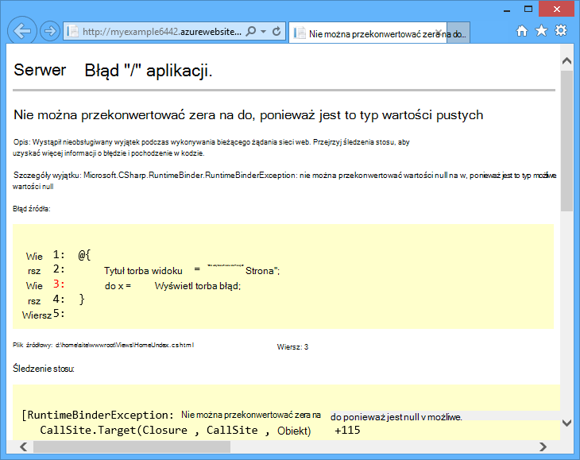
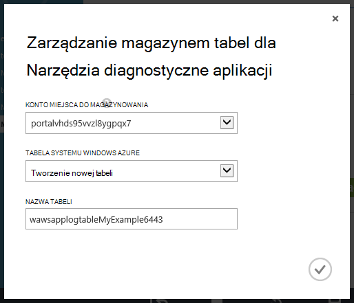
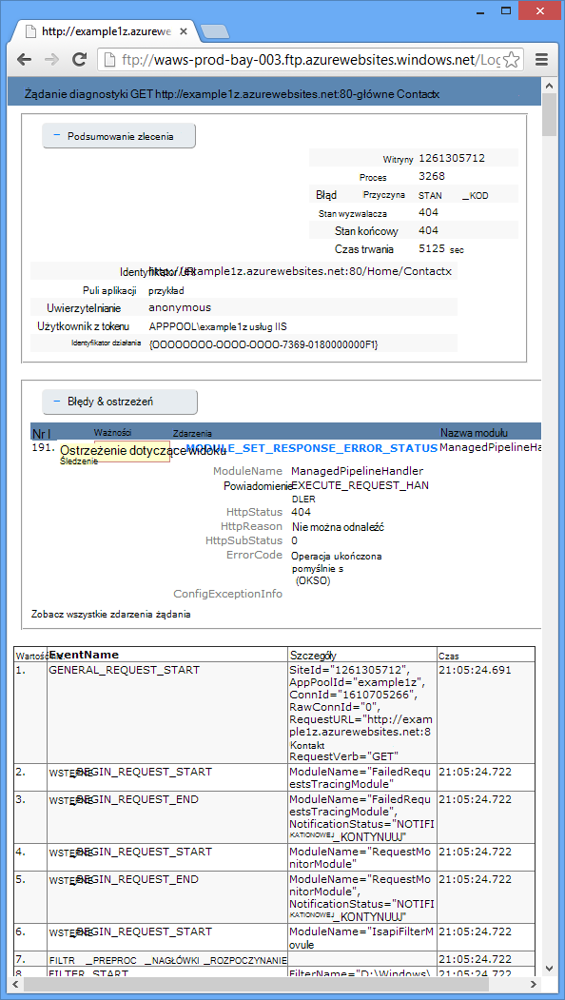

<properties 
    pageTitle="Rozwiązywanie problemów z aplikacji sieci web w usłudze aplikacji Azure za pomocą programu Visual Studio" 
    description="Dowiedz się, jak rozwiązywać problemy z aplikacji Azure web za pomocą zdalnego debugowania, śledzenie i rejestrowanie narzędzia, wbudowanych program Visual Studio 2013." 
    services="app-service" 
    documentationCenter=".net" 
    authors="tdykstra" 
    manager="wpickett" 
    editor=""/>

<tags 
    ms.service="app-service" 
    ms.workload="na" 
    ms.tgt_pltfrm="na" 
    ms.devlang="dotnet" 
    ms.topic="article" 
    ms.date="08/29/2016" 
    ms.author="rachelap"/>

# Rozwiązywanie problemów z aplikacji sieci web w usłudze aplikacji Azure za pomocą programu Visual Studio

## Omówienie

Ten samouczek pokazano, jak za pomocą narzędzi programu Visual Studio, które debugowania aplikacji sieci web w [Aplikacji usługi](http://go.microsoft.com/fwlink/?LinkId=529714), uruchamiając w [Tryb wykrywania błędów](http://www.visualstudio.com/get-started/debug-your-app-vs.aspx) zdalnie lub wyświetlając Dzienniki aplikacji i dzienniki serwera sieci web.

[AZURE.INCLUDE [app-service-web-to-api-and-mobile](../../includes/app-service-web-to-api-and-mobile.md)]

Opisano następujące zagadnienia:

* Które funkcje zarządzania aplikacji Azure web są dostępne w programie Visual Studio.
* Jak za pomocą widoku zdalny Visual Studio szybkie zmiany w aplikacji zdalnego w sieci web.
* Jak uruchomić tryb debugowania zdalnie podczas projektu jest uruchomiony w Azure, zarówno dla aplikacji sieci web i WebJob.
* Jak utworzyć dzienników aplikacji, a następnie wyświetlać je podczas aplikacji tworzy je.
* Jak wyświetlić dzienniki serwera sieci web, w tym szczegółowe komunikaty o błędach i nie Śledzenie żądań.
* Jak wysłać dzienniki diagnostyczne w celu przechowywania Azure konta i ich wyświetlania.

Jeśli masz program Visual Studio Ultimate, możesz również używać [IntelliTrace](http://msdn.microsoft.com/library/vstudio/dd264915.aspx) dla debugowania. IntelliTrace nie jest objęta w tym samouczku.

## Wymagania wstępne

Ten samouczek współpracuje środowisko projektowania, projektu sieci web i Azure web app, który skonfigurowano w [wprowadzenie Azure i ASP.NET][GetStarted]. Dla sekcji WebJobs musisz aplikacji, w której można tworzyć w [Wprowadzenie Azure WebJobs SDK][GetStartedWJ].

Przykłady kodu przedstawiona w tym samouczku dla aplikacji sieci web C# MVC, ale procedury rozwiązywania problemów są takie same dla aplikacji Visual Basic i formularzy sieci Web.

Samouczek założono, że korzystasz z programu Visual Studio 2015 lub 2013. Jeśli używasz programu Visual Studio 2013 funkcje WebJobs wymagają [aktualizacji 4](http://go.microsoft.com/fwlink/?LinkID=510314) lub nowszy. 

Przesyłanie strumieniowe dzienniki funkcja działa tylko w przypadku aplikacji przeznaczonych dla .NET Framework 4 lub nowszy.

## Konfiguracja aplikacji sieci Web i zarządzanie

Program Visual Studio umożliwia dostęp do niektóre funkcje zarządzania aplikacji sieci web i ustawienia konfiguracji dostępne w [Azure Portal](http://go.microsoft.com/fwlink/?LinkId=529715). W tej sekcji pojawi się, jakie opcje są dostępne za pomocą **Eksploratora serwera**. Aby zobaczyć najnowsze funkcje integracji Azure, także wypróbować **Eksploratora chmury** . W menu **Widok** , możesz otworzyć obu systemu windows. 

1. Jeśli możesz już nie są zalogowane do Azure w programie Visual Studio, kliknij przycisk **Połącz z Azure** w **Eksploratorze serwera**.

    Alternatywny jest zainstalowanie certyfikatu zarządzania, który umożliwia dostęp do swojego konta. Jeśli wybierzesz zainstalować certyfikat, kliknij prawym przyciskiem myszy węzeł **Azure** w **Eksploratorze serwera**, a następnie kliknij **filtr subskrypcji i Zarządzaj** w menu kontekstowym. W oknie dialogowym **Zarządzaj subskrypcjami Azure** kliknij kartę **Certyfikaty** , a następnie kliknij przycisk **Importuj**. Postępuj zgodnie z instrukcjami, aby pobrać, a następnie zaimportować plik subskrypcji (zwanych również pliku *.publishsettings* ) dla Twojego konta Azure.

    > [AZURE.NOTE]
    > Jeśli pobierzesz pliku subskrypcji, zapisz go w folderze spoza Twojej katalogów kodu źródła (na przykład w folderze pobrane), a następnie usuń go, po zakończeniu importowania. Złośliwy użytkownik uzyskuje dostęp do pliku subskrypcji można edytować, tworzenie i usuwanie usługi Azure.

    Aby uzyskać więcej informacji na temat nawiązywania połączenia z zasobami Azure z programu Visual Studio zobacz [Zarządzanie kontami, subskrypcji i role administracyjne](http://go.microsoft.com/fwlink/?LinkId=324796#BKMK_AccountVCert).

2. W **Eksploratorze Server**rozwiń **Azure** , a następnie rozwiń listę **Aplikacji usługi**.

3. Rozwiń grupy zasobów, która zawiera aplikacji sieci web utworzonej w [wprowadzenie Azure i ASP.NET][GetStarted], a następnie kliknij prawym przyciskiem myszy węzeł aplikacji sieci web i kliknij pozycję **Ustawienia widoku**.

    

    Zostanie wyświetlona karta **Azure aplikacji sieci Web** i widać z sieci web aplikację konfiguracji i zarządzanie zadaniami, które są dostępne w programie Visual Studio.

    

    W tym samouczku ma być używany rejestrowania i śledzenia listy rozwijane. Również użyjesz zdalnego debugowania, ale będzie skorzystać z innej metody, aby ją włączyć.
   
    Aby uzyskać informacje o polach ustawień aplikacji i parametry połączenia, w tym oknie, zobacz [Azure aplikacji sieci Web: jak ciągi aplikacji i pracy ciągów połączenia](http://blogs.msdn.com/b/windowsazure/archive/2013/07/17/windows-azure-web-sites-how-application-strings-and-connection-strings-work.aspx).

    Jeśli chcesz wykonać zadanie zarządzania aplikacji sieci web, które nie można wykonać w tym oknie, kliknij przycisk **Otwórz w portalu zarządzania** Otwórz okno przeglądarki, aby Azure portal.

## Pliki aplikacji sieci web programu Access w Eksploratorze serwera

Zazwyczaj wdrażanie projektu sieci web z `customErrors` flagi w pliku Web.config ustaw `On` lub `RemoteOnly`, co oznacza nie otrzymujesz komunikat o błędzie przydatne, gdy coś przechodzi problem. Wiele błędów wszystkich, które otrzymujesz jest to strona jak jeden z następujących pól.

**Błąd serwera "/" aplikacji:**

**Wystąpił błąd:**

**Witryny sieci Web nie można wyświetlić strony**

Często najłatwiejszym sposobem znalezienia przyczynę błędu jest umożliwienie szczegółowe komunikaty o błędach, które pierwszego dnia poprzedzającego zrzuty ekranu wyjaśniono, jak wykonać. Wymagające zmiany w pliku Web.config wdrożonym. Możesz edytować plik *Web.config* w projekcie i ponownie wdróż projektu, lub utworzyć [Przekształcanie Web.config](http://www.asp.net/mvc/tutorials/deployment/visual-studio-web-deployment/web-config-transformations) i wdrażanie Kompilacja debugowania, ale jest szybszy sposób: w **Eksploratorze rozwiązań** można bezpośrednio umożliwia wyświetlanie i edytowanie plików w aplikacji zdalnego w sieci web przy użyciu funkcji *widoku zdalny* .

1. W **Eksploratorze Server**rozwiń **Azure**, rozwiń **Aplikacji usługi**, rozszerzanie aplikacji sieci web znajdujący się w grupie zasobów, a następnie rozwiń węzeł dla aplikacji sieci web.

    Zobacz węzły, które umożliwiają dostęp do zawartości plików aplikacji sieci web i plików dziennika.

2. Rozwiń węzeł **pliki** , a następnie kliknij dwukrotnie plik *Web.config* .

    

    Program Visual Studio jest otwierany plik Web.config z aplikacji zdalnego w sieci web i wyświetli [zdalnego] obok nazwy pliku na pasku tytułu.

3. Dodaj następujący wiersz do `system.web` elementu:

    `<customErrors mode="Off"></customErrors>`

    

4. Odśwież przeglądarkę, który jest wyświetlany komunikat o błędzie nieprzydatne, a teraz zostanie wyświetlony szczegółowy komunikat o błędzie, taki jak na poniższym przykładzie:

    

    (Komunikat o błędzie wyświetlany został utworzony przez dodanie wiersza wyświetlane w kolorze czerwonym do *Views\Home\Index.cshtml*).

Edytowanie pliku Web.config jest tylko jeden przykładowe scenariusze, w których możliwość czytać i edytować pliki w aplikacji sieci Azure web ułatwienia rozwiązania problemu.

## Zdalny debugowania aplikacji sieci web

Jeśli szczegółowy komunikat o błędzie nie zawiera informacji wystarczających i nie można ponownie utworzyć ten błąd lokalnie, rozwiązywanie problemów z w inny sposób jest uruchomienie w trybie debugowania zdalnie. Można ustawić punktów kontrolnych, bezpośrednio manipulować pamięci, kroków kod a nawet zmienić ścieżkę kodu. 

Zdalne debugowanie nie działa w wersji Express programu Visual Studio.

W tej sekcji przedstawiono sposób debugowania zdalnie przy użyciu programu project, można tworzyć w [wprowadzenie Azure i ASP.NET][GetStarted].

1. Otwieranie projektu sieci web utworzonej w [wprowadzenie Azure i ASP.NET][GetStarted].

1. Otwórz *Controllers\HomeController.cs*.

2. Usuwanie `About()` metody i wstaw poniższy kod w tym miejscu.

        public ActionResult About()
        {
            string currentTime = DateTime.Now.ToLongTimeString();
            ViewBag.Message = "The current time is " + currentTime;
            return View();
        }

2. [Ustaw punkt przerwania](http://www.visualstudio.com/get-started/debug-your-app-vs.aspx) na `ViewBag.Message` linii.

1. W **Eksploratorze rozwiązań**kliknij prawym przyciskiem myszy projektu, a następnie kliknij pozycję **Publikuj**.

2. Na liście rozwijanej **profilu** wybierz tego samego profilu, których użyto w [wprowadzenie Azure i ASP.NET][GetStarted].

3. Kliknij kartę **Ustawienia** Zmień **konfigurację** **debugowania**i kliknij pozycję **Publikuj**.

    

4. Po wdrożeniu wykończenie i przeglądarki zostanie otwarty Azure adres URL aplikacji sieci web, zamknij przeglądarkę.

5. W **Eksploratorze serwera**kliknij prawym przyciskiem myszy aplikacji sieci web, a następnie kliknij **Dołącz debugowania**. 

    

    Przeglądarka automatycznie otworzy do strony głównej w Azure. Może być konieczne poczekaj 20 sekund podczas Azure konfiguruje ten serwer do debugowania. Opóźnienie występuje tylko podczas pierwszego uruchomienia w trybie debugowania w aplikacji sieci web. Kolejne razy w ciągu 48 godzin po uruchomieniu debugowanie będzie opóźnienie.

    **Uwaga:** Jeśli masz problemy ze Uruchamianie debugowania, spróbuj to zrobić przy użyciu **Eksploratora chmury** zamiast **Server Explorer**.

6. W menu kliknij polecenie **informacje** .

    Program Visual Studio przestaje punkt przerwania i kod działa w Azure, nie ma na komputerze lokalnym.

7. Umieść wskaźnik myszy na `currentTime` zmienną, aby wyświetlić wartość czasu.

    

    Razem, gdy zostanie wyświetlony po raz Azure server, które może być w innej strefie czasowej niż komputera lokalnego.

8. Wprowadź nową wartość dla `currentTime` zmiennych, takich jak "Uruchomione w Azure".

5. Naciśnij klawisz F5, aby nadal działać.

    Na stronie informacje z platformy Azure Wyświetla nową wartość wprowadzona w zmiennej bieżącagodzina.

    

## Zdalny WebJobs debugowania

W tej sekcji przedstawiono sposób debugowania zdalnie przy użyciu aplikacji sieci web i programu project, tworzonych w [Wprowadzenie Azure WebJobs SDK](websites-dotnet-webjobs-sdk.md). 

Funkcje wyświetlane w tej sekcji są dostępne tylko w Visual Studio 2013 z aktualizacjami 4 lub nowszy. 

Zdalne debugowanie działa wyłącznie z WebJobs ciągły. WebJobs według harmonogramu i na żądanie nie jest obsługiwane w debugowania.

1. Otwieranie projektu sieci web utworzonej w [Wprowadzenie Azure WebJobs SDK][GetStartedWJ].

1. W programie project ContosoAdsWebJob Otwórz *Functions.cs*.

2. [Ustaw punkt przerwania](http://www.visualstudio.com/get-started/debug-your-app-vs.aspx) na pierwszej instrukcji w `GnerateThumbnail` metody.

    

1. W **Eksploratorze rozwiązań**kliknij prawym przyciskiem myszy projektu sieci web (nie projekt WebJob), a następnie kliknij pozycję **Publikuj**.

2. Na liście rozwijanej **profilu** wybierz tego samego profilu, których użyto w [Wprowadzenie Azure WebJobs SDK](websites-dotnet-webjobs-sdk.md).

3. Kliknij kartę **Ustawienia** Zmień **konfigurację** **debugowania**i kliknij pozycję **Publikuj**.

    Wdrożenie programu Visual Studio, sieci web i WebJob projektów, a w przeglądarce zostanie otwarta Azure adres URL aplikacji sieci web.

5. W **Eksploratorze Server** rozwiń **Azure > aplikacji usługi > grupy zasobów > aplikacji sieci web > WebJobs > ciągły**, a następnie kliknij prawym przyciskiem myszy **ContosoAdsWebJob**.

7. Kliknij przycisk **Dołącz debugowania**. 

    

    Przeglądarka automatycznie otworzy do strony głównej w Azure. Może być konieczne poczekaj 20 sekund podczas Azure konfiguruje ten serwer do debugowania. Opóźnienie występuje tylko podczas pierwszego uruchomienia w trybie debugowania w aplikacji sieci web. Przy następnym dołączyć debugowania będzie opóźnienie, po wykonaniu w ciągu 48 godzin.

6. W przeglądarce sieci web zostanie otwarty na stronę główną firmy Contoso reklam Utwórz nowy ad. 

    Tworzenie ad powoduje kolejki wiadomości można utworzyć, która zostanie pobrana przez WebJob i przetwarzania. Gdy WebJobs SDK wywołuje funkcję przetwarzania wiadomości kolejki, kod będzie odwołań do przerwania.

7. Podczas debugowania podziały u swojego przerwania, można sprawdzić i zmieniać wartości zmiennych w trakcie programu chmury. Na poniższej ilustracji debugowania pokazuje zawartość obiekt blobInfo, do którego przekazano do metody GenerateThumbnail.

    
 
5. Naciśnij klawisz F5, aby nadal działać.

    Metoda GenerateThumbnail kończy się tworzenie miniaturę.

6. W przeglądarce Odśwież stronę indeksu i zobaczyć miniaturę.

6. W programie Visual Studio naciśnij klawisze SHIFT + F5, aby zatrzymać debugowania.

7. W **Eksploratorze serwera**kliknij prawym przyciskiem myszy węzeł ContosoAdsWebJob, a następnie kliknij pozycję **Widok pulpitu nawigacyjnego**.

8. Zaloguj się przy użyciu poświadczeń Azure, a następnie kliknij nazwę WebJob, aby przejść do strony dla swojej WebJob. 

    

    Pulpit nawigacyjny wskazuje, że funkcja GenerateThumbnail ostatnio wykonany.

    (Przy następnym kliknięciu **Widoku pulpitu nawigacyjnego**, nie musisz zalogować się i przeglądarce pozwala przejść bezpośrednio do strony dla swojej WebJob.)

9. Kliknij nazwę funkcji, aby wyświetlić szczegółowe informacje o wykonywaniu funkcji.

    

Jeśli do funkcji [napisane dzienniki](websites-dotnet-webjobs-sdk-storage-queues-how-to.md#logs), można kliknąć przycisk **ToggleOutput** , aby je wyświetlić.

## Uwagi dotyczące zdalnego debugowania

* Działa w trybie debugowania produkcji nie jest zalecane. Jeśli aplikacji sieci web produkcji nie skalowania dla wielu wystąpień serwera, debugowanie uniemożliwi serwer sieci web odpowiadać na inne żądania. Jeśli masz wiele wystąpień serwera sieci web po dołączeniu do debugowania zostanie wyświetlony losowe wystąpienie, a masz żaden sposób, aby upewnić się, że żądania kolejnych przeglądarki zostaną przekierowane do tego wystąpienia. Ponadto zwykle nie wdrożeniem Kompilacja debugowania produkcji i optymalizacje kompilatora dla wersji kompilacjach może być niemożliwe pokazać, co się dzieje wiersz po wierszu w kodzie źródła. Przy rozwiązywaniu problemów produkcji, zasób zalecane jest aplikacji sieci web i śledzenie dzienniki serwera.

* Unikanie długie zatrzymaniem co punktów kontrolnych podczas zdalnego debugowania. Azure traktuje procesem, który jest zablokowany przez dłużej niż kilka minut jako proces nie odpowiada i zamyka go.

* Gdy debugowanie, serwer wysyła dane do programu Visual Studio, które mogą mieć wpływ na przepustowość opłaty. Aby uzyskać informacji na temat przepustowości stawki zobacz [Azure ceny](/pricing/calculator/).

* Upewnij się, że `debug` atrybut `compilation` element w pliku *Web.config* jest ustawiona na PRAWDA. Jest ustawiona na PRAWDA domyślnie podczas publikowania konfigurację kompilacji debugowania.

        <system.web>
          <compilation debug="true" targetFramework="4.5" />
          <httpRuntime targetFramework="4.5" />
        </system.web>

* Jeśli okaże się, że debugowania nie Wkrocz kod, który ma zostać debugowanie, może być konieczne ustawienie tylko moje kodu.  Aby uzyskać więcej informacji zobacz [ograniczenia, aby tylko moje kodu](http://msdn.microsoft.com/library/vstudio/y740d9d3.aspx#BKMK_Restrict_stepping_to_Just_My_Code).

* Po włączeniu funkcji debugowania zdalnego, oraz po 48 godzin ta funkcja jest automatycznie wyłączane czasomierza rozpoczyna się na serwerze. Ten limit 48 godzin jest wykonywane ze względów bezpieczeństwa i wydajności. Możesz łatwo włączyć funkcję ponownie dowolną liczbę razy. Zaleca się pozostawić go wyłączona, gdy nie są aktywnie debugowania.

* Możesz ręcznie dołączyć debugowania do dowolnego procesu, nie tylko procesu sieci web app (w3wp.exe). Aby uzyskać więcej informacji na temat używania trybu debugowania w programie Visual Studio zobacz [Debugowanie w programie Visual Studio](http://msdn.microsoft.com/library/vstudio/sc65sadd.aspx).

## Omówienie dzienniki diagnostyczne

Aplikacja ASP.NET, która działa w aplikacji sieci web Azure można utworzyć następujące rodzaje dzienników:

* **Dzienniki śledzenia aplikacji** 
  Aplikacja tworzy te dzienniki, dzwoniąc metody klasy [System.Diagnostics.Trace](http://msdn.microsoft.com/library/system.diagnostics.trace.aspx) .
* **Dzienniki serwera sieci Web** 
  Serwer sieci web tworzy wpis dziennika dla każdego żądania HTTP aplikacji sieci web.
* **Szczegółowe rejestrowaniu wiadomości** 
  Serwer sieci web tworzy strony HTML z kilka dodatkowych informacji o niepowodzeniu żądania HTTP (takie, które powodują kodu stanu 400 lub nowszej). 
* **Nie powiodło się żądanie dzienników śledzenia** 
  Serwer sieci web tworzy plik XML z śledzenia szczegółowe informacje dotyczące żądania HTTP nie powiodło się. Serwer sieci web także pliku XSL na format XML w przeglądarce.
  
Rejestrowanie ma wpływ na wydajność aplikacji sieci web, więc Azure umożliwia włączenie lub wyłączenie każdego typu dziennika, stosownie do potrzeb. Dla Dzienniki aplikacji można określić, że powinny być zapisywane tylko dzienniki powyżej poziom ważności. Podczas tworzenia nowej aplikacji sieci web, domyślnie wszystkie rejestrowanie jest wyłączona.

Dzienniki są zapisywane do plików w folderze *LogFiles* w systemie plików aplikacji sieci web i są dostępne za pośrednictwem FTP. Dzienniki serwera sieci Web i aplikacji można też napisać do konta magazynu platformy Azure. Można zachować większej liczby dzienników na koncie miejsca do magazynowania, nie jest możliwe w systemie plików. Jesteś ograniczone maksymalnie do 100 megabajtów dzienniki, korzystając z systemu plików. (Tylko w przypadku przechowywania krótkoterminowy są dzienniki systemu plików. Azure usuwa stare pliki dziennika, aby zrobić miejsce dla nowych plików po osiągnięciu limitu).  

## Tworzenie i wyświetlanie dzienników aplikacji

W tej sekcji, wykonaj następujące czynności:

* Dodawanie instrukcje dotyczące śledzenia do projektu sieci web utworzonej w [wprowadzenie Azure i ASP.NET][GetStarted].
* Po uruchomieniu projektu lokalnie, przejrzyj dzienniki.
* Wyświetl dzienniki, jak są one generowane przez aplikację z platformy Azure. 

Aby uzyskać informacje na temat tworzenia aplikacji loguje się WebJobs, zobacz [jak pracować z magazynu kolejki Azure za pomocą WebJobs SDK -, jak napisać dzienniki](websites-dotnet-webjobs-sdk-storage-queues-how-to.md#logs). Poniższe instrukcje wyświetlanie dzienników i kontrolowanie, jak są przechowywane w Azure dotyczą również utworzone przez WebJobs Dzienniki aplikacji. 

### Dodawanie instrukcje dotyczące śledzenia do aplikacji

1. Otwórz *Controllers\HomeController.cs*, a następnie Zamień `Index`, `About`, i `Contact` metod następujący kod, aby można było dodać `Trace` instrukcji i `using` poufności informacji dotyczące `System.Diagnostics`:

        public ActionResult Index()
        {
            Trace.WriteLine("Entering Index method");
            ViewBag.Message = "Modify this template to jump-start your ASP.NET MVC application.";
            Trace.TraceInformation("Displaying the Index page at " + DateTime.Now.ToLongTimeString());
            Trace.WriteLine("Leaving Index method");
            return View();
        }
        
        public ActionResult About()
        {
            Trace.WriteLine("Entering About method");
            ViewBag.Message = "Your app description page.";
            Trace.TraceWarning("Transient error on the About page at " + DateTime.Now.ToShortTimeString());
            Trace.WriteLine("Leaving About method");
            return View();
        }
        
        public ActionResult Contact()
        {
            Trace.WriteLine("Entering Contact method");
            ViewBag.Message = "Your contact page.";
            Trace.TraceError("Fatal error on the Contact page at " + DateTime.Now.ToLongTimeString());
            Trace.WriteLine("Leaving Contact method");
            return View();
        }       

2. Dodawanie `using System.Diagnostics;` instrukcji do górnej części pliku.
                
### Wyświetlanie lokalnie wynik śledzenia

3. Naciśnij klawisz F5, aby uruchomić aplikację w trybie debugowania.

    Domyślne odbiornika śledzenia zapisuje wszystkie wyniki śledzenia do okna **dane wyjściowe** , razem z innymi wyjścia debugowania. Na poniższej ilustracji przedstawiono wyniki instrukcji śledzenia, które dodano do `Index` metody.

    

    Poniższe kroki pokazują jak wyświetlić wyniki śledzenia na stronie sieci web bez kompilowania w trybie debugowania.

2. Otwórz plik Web.config (znajdujący się w folderze programu project) i Dodaj `<system.diagnostics>` elementu na końcu pliku tuż przed zamknięciem `</configuration>` elementu:

        <system.diagnostics>
            <trace>
              <listeners>
                <add name="WebPageTraceListener"
                    type="System.Web.WebPageTraceListener, 
                    System.Web, 
                    Version=4.0.0.0, 
                    Culture=neutral,
                    PublicKeyToken=b03f5f7f11d50a3a" />
              </listeners>
            </trace>
          </system.diagnostics>

    `WebPageTraceListener` Umożliwia wyświetlania Śledź dane wyjściowe, przechodząc do `/trace.axd`.

3. Dodawanie <a href="http://msdn.microsoft.com/library/vstudio/6915t83k(v=vs.100).aspx">elementu śledzenia</a> w obszarze `<system.web>` w pliku Web.config, takich jak na poniższym przykładzie:

        <trace enabled="true" writeToDiagnosticsTrace="true" mostRecent="true" pageOutput="false" />

3. Naciśnij klawisze CTRL + F5, aby uruchomić aplikację.

4. Na pasku adresu w oknie przeglądarki Dodawanie *trace.axd* do adresu URL, a następnie naciśnij klawisz Enter (adres URL będzie wyglądać podobnie do http://localhost:53370/trace.axd).

5. Na stronie **Śledzenia aplikacji** kliknij pozycję **Wyświetl szczegóły** w pierwszym wierszu (nie linia BrowserLink).

    

    Zostanie wyświetlona strona **Żądanie szczegóły** i w sekcji **Informacje o śledzeniu** zobaczysz wyniki instrukcji śledzenia, które dodano do `Index` metody.

    

    Domyślnie `trace.axd` jest dostępna tylko lokalnie. Jeśli chcesz udostępnić za pomocą aplikacji zdalnego w sieci web, można dodać `localOnly="false"` do `trace` element w pliku *Web.config* , jak pokazano w poniższym przykładzie:

        <trace enabled="true" writeToDiagnosticsTrace="true" localOnly="false" mostRecent="true" pageOutput="false" />

    Jednak włączenie `trace.axd` produkcji aplikacji sieci web zwykle nie jest zalecane ze względów bezpieczeństwa, a w poniższych sekcjach pojawi się prostsze przeczytaj dzienników śledzenia w aplikacji sieci web Azure.

### Wyświetlanie informacji śledzenia platformy Azure

1. W **Eksploratorze rozwiązań**kliknij prawym przyciskiem myszy projektu sieci web, a następnie kliknij pozycję **Publikuj**.

2. W oknie dialogowym **Publikowanie sieci Web** kliknij pozycję **Publikuj**.

    Po Visual Studio publikuje aktualizację, zostanie otwarte okno przeglądarki do strony głównej (przy założeniu, że nie możesz wyczyścić **Docelowy adres URL** na karcie **połączenia** ).

3. W **Eksploratorze serwera**kliknij prawym przyciskiem myszy aplikacji sieci web i wybierz pozycję **Wyświetl dzienniki Streaming**. 

    

    W oknie **dane wyjściowe** wyświetlane są połączone z usługą streaming dziennika i dodanie wiersza powiadomienie co minutę wybiegającą bez dziennika do wyświetlenia.

    

4. W oknie przeglądarki, który zawiera strony głównej aplikacji kliknij **kontakt**.

    W ciągu kilku sekund wyjście z poziomu błędu śledzenia zostanie dodany do `Contact` metoda pojawia się w oknie **dane wyjściowe** .

    

    Program Visual Studio jest wyświetlanych tylko śledzenia poziom błędu, ponieważ jest to domyślne ustawienie po włączeniu dziennik monitorowanie usługi. Po utworzeniu nowej aplikacji sieci web Azure całego rejestrowania jest domyślnie wyłączona, jak pokazano przy otwieraniu wcześniej na stronie ustawienia:

    

    Jednak po wybraniu **Wyświetlanie dzienników Streaming**Visual Studio automatycznie zmienianie **Logging(File System) aplikacji** **błędu**, co oznacza, że są zgłaszane dzienniki poziom błędu. Aby wyświetlić wszystkie dzienniki śledzenia, można zmienić to ustawienie na **pełne**. Gdy wybierzesz poziom ważności niższej niż błędu, również są zgłaszane wszystkie dzienniki poziomu ważności. Dlatego wybierz pozycję pełne, możesz też wyświetlić informacje, ostrzeżenia i dzienników błędów.  

4. W **Eksploratorze serwera**kliknij prawym przyciskiem myszy aplikacji sieci web, a następnie kliknij **Ustawienia widoku** , tak samo jak wcześniej.

5. Zmienianie **Aplikacji rejestrowania (File System)** **pełne**, a następnie kliknij przycisk **Zapisz**.
 
    

6. W oknie przeglądarki, który jest teraz widoczna stronie **kontakt** kliknij pozycję **Narzędzia główne**, a następnie kliknij pozycję **o**, a następnie kliknij **kontakt**.

    W ciągu kilku sekund okno **dane wyjściowe** pokazuje wszystkie wydruku śledzenie.

    

    W tej sekcji włączyć i wyłączyć rejestrowanie przy użyciu ustawienia Azure web app. Można także włączyć i wyłączyć śledzenie detektory modyfikując plik Web.config. Jednak modyfikowanie pliku Web.config powoduje, że domeny aplikacji do Kosza, gdy włączenie rejestrowania przy użyciu konfiguracji aplikacji sieci web nie to zrobić. Jeśli problem zajmuje dużo czasu w celu odtworzenia, lub jest przerw, odtwarzania domeny aplikacji może być "Poprawka" oraz wymusza poczekaj, aż pojawia się ponownie. Włączanie diagnostyki platformy Azure nie wykonaj następujące czynności, aby rozpocząć od razu przechwytywanie informacji o błędach.

### Funkcje okna dane wyjściowe

Na karcie **Dzienniki Azure** okna **dane wyjściowe** zawiera kilka przycisków i pola tekstowego:

Te należy wykonać następujące funkcje:

* Wyczyść okna **dane wyjściowe** .
* Włącz lub Wyłącz zawijanie.
* Uruchamiać i zatrzymywać monitorowania dzienników.
* Określ, które dzienniki monitorowanie.
* Pobierz dzienniki.
* Filtrowanie dzienniki na podstawie ciągu wyszukiwania lub wyrażenie.
* Zamknij okno **dane wyjściowe** .

Jeśli wprowadzisz wyszukiwania ciągu lub wyrażenie, Visual Studio umożliwia filtrowanie informacji rejestrowania po stronie klienta. Oznacza to, że możesz wprowadzić kryteria po dzienniki są wyświetlane w oknie **dane wyjściowe** i kryteriów filtrowania można zmieniać bez konieczności wygenerować dzienniki.

## Wyświetlanie dzienników serwera sieci web

Dzienniki serwera sieci Web rejestrowanie wszystkich czynności HTTP dla aplikacji sieci web. Aby można było widoczne w oknie **dane wyjściowe** , które trzeba je włączyć dla aplikacji sieci web i określić Visual Studio, które chcesz monitorować je. 

1. Na karcie **Konfiguracja aplikacji sieci Web Azure** , otwartego Eksploratora **Serwera**Zmienianie rejestrowania serwera sieci Web **na**, a następnie kliknij **Zapisz**.

    

2. W oknie **wyniku** kliknij przycisk **Określ, która Azure rejestruje monitorowanie** .
    
    

3. W oknie dialogowym **Opcje rejestrowania Azure** wybierz pozycję **Dzienniki serwera sieci Web**, a następnie kliknij **przycisk OK**.

    

4. W oknie przeglądarki, który pokazuje aplikacji sieci web kliknij pozycję **Narzędzia główne**, a następnie kliknij polecenie **informacje**, a następnie kliknij **kontakt**.

    Dzienniki aplikacji zazwyczaj są wyświetlane przede wszystkim, a po nim dzienniki serwera sieci web. Może być konieczne Poczekaj chwilę dzienniki do są wyświetlane. 

    

Domyślnie po włączeniu dzienniki serwera sieci web przy użyciu programu Visual Studio Azure zapisuje dzienniki w systemie plików. Alternatywnym Azure portal umożliwia określenie ten serwer sieci web, który dzienniki powinny być zapisywane w kontenerze blob na koncie miejsca do magazynowania.

Jeśli serwer sieci web logowania do konta usługi Azure miejsca do magazynowania za pomocą portalu, a następnie wyłącz rejestrowanie w programie Visual Studio, po ponownym włączeniu rejestrowania w programie Visual Studio ustawień konta miejsca do magazynowania zostaną przywrócone. 

## Wyświetlanie dzienników wiadomości szczegółowe błędów

Dzienniki błędów szczegółowe Podaj pewne dodatkowe informacje na temat żądania HTTP, które powodują błąd kody odpowiedzi (400 lub powyżej). Aby można było je wyświetlić w oknie **dane wyjściowe** , musisz włączyć je dla aplikacji sieci web i określić Visual Studio, które chcesz monitorować je.

1. Na karcie **Konfiguracja aplikacji sieci Web Azure** , otwartego Eksploratora **Serwera**zmienianie **Szczegółowe komunikaty o błędach** **w**, a następnie kliknij **Zapisz**.

    

2. W oknie **wyniku** kliknij przycisk **Określ, która Azure rejestruje monitorowanie** .

3. W oknie dialogowym **Opcje rejestrowania Azure** kliknij **wszystkie dzienniki**, a następnie kliknij **przycisk OK**.

    

4. Na pasku adresu w oknie przeglądarki Dodawanie nadmiarowe znaki spowodować błąd 404 adres URL (na przykład `http://localhost:53370/Home/Contactx`), a następnie naciśnij klawisz Enter.

    Po kilku sekundach dziennik błędów szczegółowe pojawia się w oknie Visual Studio **dane wyjściowe** .

    

    Control + kliknij łącze, aby wyświetlić dziennik wyjściowy sformatowane w przeglądarce:

    

## Pobierz dzienniki systemu plików

Wszelkie dzienniki, które można monitorować w oknie **dane wyjściowe** można również pobrać jako pliku *zip* . 

1. W oknie **wyniku** kliknij pozycję **Pobierz dzienniki Streaming**.

    

    Eksplorator plików po otwarciu folderu *do pobrania* z wybraną kartą plik pobrany.

    

2. Wyodrębnianie pliku *zip* , a zobaczysz następującą strukturę folderów:

    

    * *Txt w folderze *LogFiles\Application* * są dzienniki śledzenia aplikacji.
    * Dzienniki serwera sieci Web są dostępne w *.log* , pliki w folderze *LogFiles\http\RawLogs* . Narzędzie, takie jak [Parsera dziennika](http://www.microsoft.com/download/details.aspx?displaylang=en&id=24659) umożliwia wyświetlanie i modyfikowanie tych plików.
    * Szczegółowe rejestrowaniu wiadomości są pliki *HTML* w folderze *LogFiles\DetailedErrors* .

    (Folder *wdrożenia* jest tworzonych przez kontrolki źródła publikowania; nie ma wszelkich sytuacji związanych z publikowania programu Visual Studio. Folder *cyfra* dotyczy śledzenia związane z kontrolki źródła usługa Przesyłanie strumieniowe plików do publikowania i dziennika.)  

## Wyświetlanie dzienników miejsca do magazynowania

Dzienniki śledzenia aplikacji mogą być również wysyłane na konto Azure miejsca do magazynowania, a ich wyświetlania w programie Visual Studio. Aby wykonać utworzysz konto miejsca do magazynowania, Włączanie dzienników miejsca do magazynowania w portalu klasyczny, a ich wyświetlania na karcie **Dzienniki** okna **Aplikacji sieci Web Azure** .

Możesz wysłać dzienniki, aby niektóre lub wszystkie z trzech miejsc docelowych:

* System plików.
* Magazyn tabel konta.
* Magazyn obiektów blob konta.

Możesz określić poziom ważności różnych dla każdego miejsca docelowego. 

Tabele ułatwiają wyświetlanie szczegółów dzienniki w trybie online i obsługują streaming; Możesz kwerendy dzienniki w tabelach i zobaczyć nowe dzienniki przy ich tworzeniu. Blob ułatwiają Aby pobrać dzienniki w plikach i analizować je przy użyciu usługi HDInsight, ponieważ HDInsight wie, jak pracować z magazynem obiektów blob. Aby uzyskać więcej informacji zobacz **Hadoop i MapReduce** w [Opcje magazynowania danych (konstrukcyjnych rzeczywisty chmury aplikacje z Azure)](http://www.asp.net/aspnet/overview/developing-apps-with-windows-azure/building-real-world-cloud-apps-with-windows-azure/data-storage-options).

Obecnie masz dzienniki systemu pliku ustawiony poziom pełne; Poniższe kroki przeprowadził Cię przez proces konfigurowania dzienników poziomu informacji, aby przejść do magazynu tabele. Informacje o poziomie oznacza, że wszystkie dzienniki utworzone przez wywołanie `Trace.TraceInformation`, `Trace.TraceWarning`, i `Trace.TraceError` będą wyświetlane, ale nie dzienniki utworzone przez wywołanie `Trace.WriteLine`.

Konta miejsca do magazynowania oferują więcej miejsca do magazynowania i przechowywania długotrwałe dzienników w porównaniu z systemu plików. Zaletą wysyłanie dzienników śledzenia aplikacji do miejsca do magazynowania jest uzyskanie trochę dodatkowych informacji z każdego dziennika, którego nie można uzyskać od dzienniki systemu plików.

5. Kliknij prawym przyciskiem myszy **miejsca do magazynowania** w węźle Azure, a następnie kliknij **Utwórz konto miejsca do magazynowania**.

3. W oknie dialogowym **Utwórz konto miejsca do magazynowania** wprowadź nazwę konta magazynu. 

    Nazwa musi być musi być unikatowa (żadne inne konto Azure magazynowania mogą mieć tej samej nazwy). Wprowadzona nazwa jest już używana uzyskasz możliwość go zmienić.

    Adres URL dostępu do konta miejsca do magazynowania będzie *{Nazwa}*. core.windows.net. 

5. Ustaw listy rozwijanej **regionu lub grupy koligacji** obszaru znajduje się najbliżej użytkownika.

    To ustawienie określa, które Azure centrum danych będzie przechowywana konta miejsca do magazynowania. Ten samouczek wyboru nie można wprowadzić widoczną różnicą, ale dla aplikacji sieci web produkcji ma serwera sieci web i konta miejsca do magazynowania w tym samym regionie, aby zminimalizować opłaty wyjściowe opóźnienie i danych. W regionie jak najbliżej przeglądarki dostęp do aplikacji sieci web w celu zminimalizowania opóźnienie powinna działać w aplikacji sieci web (który utworzysz później).

6. Ustaw listy rozwijanej **replikacji** **lokalnie zbędne**. 

    Po włączeniu replikacji geo konta magazynu zawartości przechowywanej są replikowane pomocniczej centrum danych, aby możliwe było awaryjne przeniesienie do tej lokalizacji, w przypadku głównych awarii w lokalizacji podstawowej. Replikacja Geo może spowodować dodatkowe koszty. W przypadku kont badania i rozwój ogólnie nie chcesz zapłacić za geo replikacji. Aby uzyskać więcej informacji zobacz [Tworzenie, zarządzanie, lub usunąć konto miejsca do magazynowania](../storage-create-storage-account/#replication-options).

5. Kliknij przycisk **Utwórz**. 

      

1. W oknie programu Visual Studio **Azure aplikacji sieci Web** kliknij kartę **Dzienniki** , a następnie kliknij **Skonfigurować rejestrowanie w portalu zarządzania**.

    <!-- todo:screenshot of new portal if the VS page link goes to new portal -->
    

    Spowoduje to otwarcie na karcie **Konfiguruj** w klasycznym portalu dla aplikacji sieci web.

2. Na karcie **Konfigurowanie** portalu klasyczny przewiń w dół do sekcji diagnostyki aplikacji, a następnie zmień **Aplikacji rejestrowania (magazyn tabel)** , **w**.

3. Zmienić **poziom rejestrowania** **informacji**.

4. Kliknij pozycję **Zarządzaj magazynem tabel**.

    

    W oknie dialogowym **Zarządzanie magazynem tabeli aplikacji diagnostyki pakietu** możesz wybrać konta miejsca do magazynowania, jeśli masz więcej niż jedną. Możesz utworzyć nową tabelę lub użycie istniejącej.

    

6. W polu **Zarządzaj magazynem tabel dotyczące diagnostyki aplikacji** kliknij znacznik wyboru, aby zamknąć okno.

6. Na karcie **Konfigurowanie** portalu klasyczny kliknij przycisk **Zapisz**.

7. W oknie przeglądarki, wyświetlającego aplikacji sieci web aplikacji kliknij pozycję **Narzędzia główne**, a następnie kliknij pozycję **o**, a następnie kliknij **kontakt**.

    Informacje o rejestrowaniu wyprodukowano, przeglądając te strony sieci web zostaną zapisane na koncie miejsca do magazynowania.

8. Na karcie **Dzienniki** okna **Aplikacji sieci Web Azure** w programie Visual Studio kliknij przycisk **Odśwież** w obszarze **Podsumowanie diagnostyczne**.

    

    Domyślnie sekcji **Podsumowanie diagnostyczne** Wyświetla dzienniki ostatnich 15 minut. Możesz zmienić okres, aby wyświetlić więcej dzienników. 

    (Jeśli zostanie wyświetlony komunikat o błędzie "nie znaleziono tabeli", sprawdź, czy zostały wybrane do stron, które wykonaj śledzenie po włączeniu, **Aplikacja rejestrowania (Magazynowanie)** , a po kliknięciu przycisku **Zapisz**.)

    

    Zwróć uwagę, że w tym widoku wyświetlane **Identyfikator procesu** i **Identyfikatorem wątku** dla każdego dziennika, który nie jest wyświetlany w dziennikach systemu plików. Dodatkowe pola można wyświetlić, korzystając bezpośrednio w tabeli Azure miejsca do magazynowania.

8. Kliknij pozycję **Wyświetl wszystkie dzienniki aplikacji**.

    Tabela dziennika śledzenia pojawi się w oknie Podgląd tabeli Azure miejsca do magazynowania.
   
    (Jeśli zostanie wyświetlony komunikat o błędzie "sekwencji zawiera żadnych elementów", otwórz **Eksploratora serwera**, rozwiń węzeł dla Twojego konta miejsca do magazynowania w węźle **Azure** , a następnie kliknij prawym przyciskiem myszy **tabele** i kliknij przycisk **Odśwież**.)

    

    W tym widoku wyświetlane dodatkowe pola, że nie jest widoczna w innych widokach. Ten widok umożliwia również filtrować dzienników przy użyciu specjalnych interfejsu użytkownika Konstruktora kwerend dla tworzenia kwerendy. Aby uzyskać więcej informacji zobacz Praca z zasobami tabeli — filtrowanie jednostki [Przeglądanie zasobów miejsca do magazynowania w Eksploratorze serwera](http://msdn.microsoft.com/library/ff683677.aspx).

7. Aby wyszukać dane w pojedynczym wierszu, kliknij dwukrotnie jeden z wierszy.

    

## Wyświetlanie dzienników śledzenia żądań zakończonych niepowodzeniem

Dzienniki śledzenia żądań zakończonych niepowodzeniem są przydatne, gdy trzeba zrozumieć szczegóły, jak IIS obsługuje żądania HTTP w scenariuszach, takich jak problemów uwierzytelniania lub ponowne zapisywanie adresów URL. 

Aplikacje Azure web za pomocą tę samą funkcję śledzenia żądań zakończonych niepowodzeniem, która została już dostępne w programie IIS 7.0 lub nowszy. Nie masz dostępu do ustawień programu IIS, które skonfigurować, które błędy rejestrowane są, jednak. Po włączeniu śledzenia żądań zakończonych niepowodzeniem są przechwytywane wszystkie błędy. 

Możesz włączyć śledzenie żądań zakończonych niepowodzeniem przy użyciu programu Visual Studio, ale nie można ich wyświetlania w programie Visual Studio. Dzienniki te są plikami XML. Przesyłanie strumieniowe usługi rejestrowania monitoruje tylko plików, które są uznawane za czytelne w trybie zwykłego tekstu: pliki *txt*, *HTML*i *.log* .

Dzienniki śledzenia żądań zakończonych niepowodzeniem można wyświetlić w przeglądarce bezpośrednio za pośrednictwem FTP lub lokalnie, po użyciu narzędzia FTP je pobrać na komputer lokalny. W tej sekcji będą wyświetlane w przeglądarce bezpośrednio.

1. Na karcie **Konfiguracja** okna **Aplikacji sieci Web Azure** otwartego Eksploratora **Serwera**zmienianie **Failed żądanie śledzenia** **na**, a następnie kliknij **Zapisz**.

    

4. Na pasku adresu w oknie przeglądarki, który zawiera aplikacji sieci web Dodawanie nadmiarowe znaki do adresu URL, a następnie naciśnij klawisz Enter spowodować błąd 404.

    Ta opcja powoduje dziennika śledzenia żądań zakończonych niepowodzeniem ma zostać utworzony, a poniższe kroki określają wyświetlić lub pobrać dziennika.

2. W programie Visual Studio na karcie **Konfiguracja** okna **Aplikacji sieci Web Azure** kliknij przycisk **Otwórz w portalu zarządzania**.

3. W karta **Ustawienia** [Azure Portal](https://portal.azure.com) dla aplikacji sieci web kliknij **wdrażania poświadczeń**, a następnie wpisz nową nazwę użytkownika i hasło.

    

    ** Po zalogowaniu się, należy użyć nazwy użytkownika pełny z prefiksem do niego nazwę aplikacji sieci web. Na przykład jeśli witryna jest "myexample" Wprowadź "myid" jako nazwę użytkownika, możesz zalogować się jako "myexample\myid".

5. W nowym oknie przeglądarki przejdź do adresu URL, który jest wyświetlany w obszarze **Nazwa hosta FTP** lub **Nazwa hosta FTPS** w karta **Aplikacji sieci Web** dla aplikacji sieci web. 

6. Zaloguj się przy użyciu poświadczeń FTP utworzone wcześniej (w tym prefiks nazwy aplikacji sieci web dla nazwy użytkownika).

    Przeglądarka zawiera folder główny aplikacji sieci web.

6. Otwórz *LogFiles* folder.

    

7. Otwórz folder o nazwie W3SVC plus wartość liczbową.

    

    Folder zawiera pliki XML występują błędy, które zostały zarejestrowane po włączeniu śledzenia żądań zakończonych niepowodzeniem oraz plik XSL, który przeglądarki służące do formatowania XML.

    

8. Kliknij plik XML żądania nie powiodło się, które mają być wyświetlane informacje śledzenia dla.

    Na poniższej ilustracji przedstawiono część informacji śledzenie problemu próbki.

    

## Następne kroki

Użytkownik zobaczył, jak Visual Studio ułatwia przeglądanie dzienników utworzone przez aplikację sieci web Azure. W poniższych sekcjach przedstawiono łącza do większej ilości zasobów na tematy pokrewne:

* Rozwiązywanie problemów z aplikacji Azure web
* Debugowanie w programie Visual Studio 
* Zdalne debugowanie platformy Azure
* Śledzenie w aplikacjach ASP.NET
* Analizowanie dzienniki serwera sieci web
* Analiza nie powiodła się dzienników śledzenia żądanie
* Debugowanie usług w chmurze

### Rozwiązywanie problemów z aplikacji Azure web

Aby uzyskać więcej informacji na temat rozwiązywania problemów z aplikacji web apps w usłudze Azure aplikacji zobacz następujące zasoby:

* [Monitorowanie aplikacji sieci web](/manage/services/web-sites/how-to-monitor-websites/)
* [Badanie przecieki pamięci w aplikacjach sieci Web Azure w programie Visual Studio 2013](http://blogs.msdn.com/b/visualstudioalm/archive/2013/12/20/investigating-memory-leaks-in-azure-web-sites-with-visual-studio-2013.aspx). Microsoft ALM wpis w blogu o funkcjach programu Visual Studio do analizowania problemów zarządzanych pamięci.
* [Azure web apps narzędzia online, które należy wiedzieć o](/blog/2014/03/28/windows-azure-websites-online-tools-you-should-know-about-2/). Wpis w blogu, Amitowi firmy Apple.

Aby uzyskać pomoc dotyczącą określonych pytania dotyczące rozwiązywania problemów należy rozpocząć wątku w jednym z następujących fora:

* [Azure forum w witrynie sieci Web programu ASP.NET](http://forums.asp.net/1247.aspx/1?Azure+and+ASP+NET).
* [Azure forum w witrynie MSDN](http://social.msdn.microsoft.com/Forums/windowsazure/).
* [StackOverflow.com](http://www.stackoverflow.com).

### Debugowanie w programie Visual Studio 

Aby uzyskać więcej informacji na temat używania trybu debugowania w programie Visual Studio Zobacz temacie MSDN [Debugowanie w programie Visual Studio](http://msdn.microsoft.com/library/vstudio/sc65sadd.aspx) i [Debugowanie porady przy użyciu programu Visual Studio 2010](http://weblogs.asp.net/scottgu/archive/2010/08/18/debugging-tips-with-visual-studio-2010.aspx).

### Zdalne debugowanie platformy Azure

Aby uzyskać więcej informacji dotyczących zdalnego debugowania dla aplikacji sieci web Azure i WebJobs zobacz następujące zasoby:

* [Wprowadzenie do zdalnego debugowania Azure aplikacji usługi aplikacji Web Apps](/blog/2014/05/06/introduction-to-remote-debugging-on-azure-web-sites/).
* [Wprowadzenie do zdalnego debugowania Azure usługi sieci Web aplikacji część 2 - wewnątrz zdalnego debugowania](/blog/2014/05/07/introduction-to-remote-debugging-azure-web-sites-part-2-inside-remote-debugging/)
* [Wprowadzenie do zdalnego debugowania na Azure aplikacji usługi sieci Web część 3 — środowisko wielu wystąpień i CYFRA](/blog/2014/05/08/introduction-to-remote-debugging-on-azure-web-sites-part-3-multi-instance-environment-and-git/)
* [WebJobs debugowanie (wideo)](https://www.youtube.com/watch?v=ncQm9q5ZFZs&list=UU_SjTh-ZltPmTYzAybypB-g&index=1)

Jeśli interfejs API sieci Web Azure lub usługi Mobile wewnętrznej korzysta z aplikacji sieci web i musisz debugowanie, który, zobacz [Debugowanie .NET w wewnętrznej bazie danych w programie Visual Studio](http://blogs.msdn.com/b/azuremobile/archive/2014/03/14/debugging-net-backend-in-visual-studio.aspx).

### Śledzenie w aplikacjach ASP.NET

Dostępne są nie dokładne i aktualne wprowadzenie do programu ASP.NET śledzenia w Internecie. Najważniejsze, które można wykonywać jest wprowadzenie starego materiałów wprowadzający napisane specjalnie dla formularzy sieci Web, ponieważ MVC nie została jeszcze istnieje, a dodatkowo który nowszego blogu wpisów prezentujące na problemy specyficzne dla. Warto zacząć od są następujące zasoby:

* [Monitorowanie i telemetrycznego (konstrukcyjnych chmury rzeczywisty aplikacje z Azure)](http://www.asp.net/aspnet/overview/developing-apps-with-windows-azure/building-real-world-cloud-apps-with-windows-azure/monitoring-and-telemetry).  Rozdziału książki elektronicznej z zalecenia dotyczące śledzenia w chmurze Azure aplikacji.
* [Śledzenie programu ASP.NET](http://msdn.microsoft.com/library/ms972204.aspx) 
  Stary, ale nadal dobrym źródłem podstawowe wprowadzenie do tematu.
* [Detektory śledzenia](http://msdn.microsoft.com/library/4y5y10s7.aspx) 
  Informacji na temat śledzenia detektory, ale nie wspomnieć [WebPageTraceListener](http://msdn.microsoft.com/library/system.web.webpagetracelistener.aspx).
* [Przewodnik: Integrowanie śledzenia programu ASP.NET z System.Diagnostics śledzenia](http://msdn.microsoft.com/library/b0ectfxd.aspx) 
  To zbyt jest stary, ale zawiera pewne dodatkowe informacje, które wprowadzający artykule nie omówiono.
* [Śledzenie ASP.NET MVC Razor widoków](http://blogs.msdn.com/b/webdev/archive/2013/07/16/tracing-in-asp-net-mvc-razor-views.aspx) 
  Oprócz śledzenia w widokach Razor, wpis również wyjaśniono, jak utworzyć filtr błędu w celu logowania wszystkie wyjątki nieobsługiwanego w aplikacji MVC. Aby uzyskać informacje dotyczące logowania się wszystkie wyjątki nieobsługiwanego w aplikacji sieci Web formularzy, zobacz przykład Global.asax w [Rozbudowany przykład dla obsługi błędów](http://msdn.microsoft.com/library/bb397417.aspx) w witrynie MSDN. MVC lub formularzach sieci Web Jeśli chcesz zalogować pewnymi wyjątkami jej obsługi uwzględnione je w ramach domyślne można efektywnej i ponownego zgłoszenia tak jak w poniższym przykładzie:

        try
        {
           // Your code that might cause an exception to be thrown.
        }
        catch (Exception ex)
        {
            Trace.TraceError("Exception: " + ex.ToString());
            throw;
        } 

* [Przesyłanie strumieniowe śledzenia diagnostyki logowania z Azure wiersza polecenia (plus obraz!)](http://www.hanselman.com/blog/StreamingDiagnosticsTraceLoggingFromTheAzureCommandLinePlusGlimpse.aspx) 
  Jak wykonywać za pomocą wiersza polecenia jakie w tym samouczku pokazano, jak w programie Visual Studio. [Obraz](http://www.hanselman.com/blog/IfYoureNotUsingGlimpseWithASPNETForDebuggingAndProfilingYoureMissingOut.aspx) jest narzędziem do debugowania aplikacji ASP.NET. 
* [Za pomocą aplikacji sieci Web, rejestrowanie i diagnostyce - z David Ebbo](/documentation/videos/azure-web-site-logging-and-diagnostics/) i [Przesyłanie strumieniowe dzienniki w aplikacjach sieci Web — z David Ebbo](/documentation/videos/log-streaming-with-azure-web-sites/) 
  Klipy wideo, Scotta Hanselman i David Ebbo.

Rejestrowanie błędów alternatywę dla pisania kodu śledzenia jest za pomocą struktury rejestrowanie Otwórz źródło, takich jak [ELMAH](http://nuget.org/packages/elmah/). Aby uzyskać więcej informacji zobacz [blog Scotta Hanselman wpisy o ELMAH](http://www.hanselman.com/blog/NuGetPackageOfTheWeek7ELMAHErrorLoggingModulesAndHandlersWithSQLServerCompact.aspx).

Należy również zauważyć, że nie musisz użyć programu ASP.NET lub System.Diagnostics śledzenie, jeśli chcesz uzyskać streaming dzienniki z platformy Azure. Azure usługę sieci web app przesyłanie strumieniowe dziennika będzie Przesyłaj strumieniowo dowolnego pliku *txt*, *HTML*lub *.log* , które znajdzie się w folderze *LogFiles* . W związku z tym można utworzyć własny system rejestrowania, który zapisuje w systemie plików aplikacji sieci web, a plik zostaną automatycznie strumieniowo i pobierane. Wszystko, co trzeba zrobić to kod aplikacji zapisu, który tworzy pliki w folderze *d:\home\logfiles* . 

### Analizowanie dzienniki serwera sieci web

Aby uzyskać więcej informacji o analizie dzienniki serwera sieci web zobacz następujące zasoby:

* [Narzędziu LogParser](http://www.microsoft.com/download/details.aspx?id=24659) 
  Narzędzie do wyświetlania danych w dzienniki serwera sieci web (pliki*.log* ).
* [Rozwiązywania problemów z wydajnością programu IIS lub błędów aplikacji przy użyciu narzędziu LogParser](http://www.iis.net/learn/troubleshoot/performance-issues/troubleshooting-iis-performance-issues-or-application-errors-using-logparser) 
  Wprowadzenie do narzędzia parsera dziennika, który służy do analizowania dzienniki serwera sieci web.
* [Blog dotyczący wpisów przez Roberta McMurray przy użyciu narzędziu LogParser](http://blogs.msdn.com/b/robert_mcmurray/archive/tags/logparser/) 
* [Kod stanu HTTP w programie IIS 7.0, usług IIS 7.5 i 8.0 usług IIS](http://support.microsoft.com/kb/943891)

### Analiza nie powiodła się dzienników śledzenia żądanie

W witrynie sieci Web Microsoft TechNet zawiera [Failed żądanie śledzenie za pomocą](http://www.iis.net/learn/troubleshoot/using-failed-request-tracing) sekcji, która mogą być przydatne dla wiedzieć, jak za pomocą dzienników. Jednak niniejsza dokumentacja omówiono głównie Konfigurowanie śledzenia żądań zakończonych niepowodzeniem w programie IIS, które nie można wykonywać w aplikacjach sieci Web Azure.

[GetStarted]: web-sites-dotnet-get-started.md
[GetStartedWJ]: websites-dotnet-webjobs-sdk.md
 
