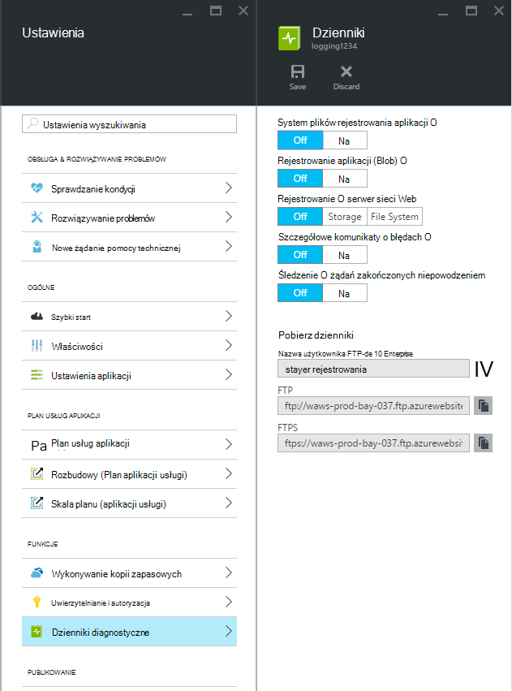
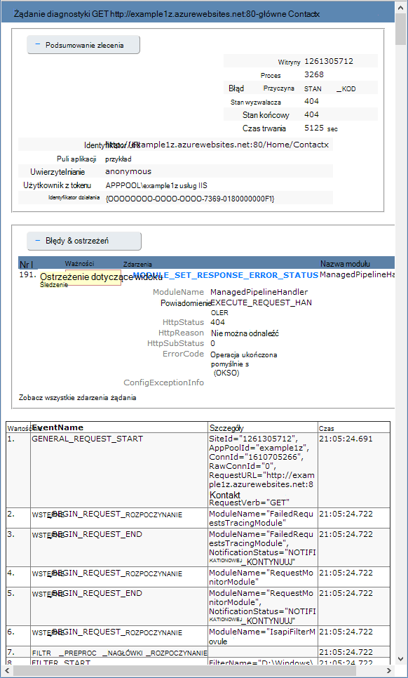

<properties
    pageTitle="Włącz rejestrowanie diagnostyczne dla aplikacji sieci web w usłudze Azure aplikacji"
    description="Dowiedz się, jak włączyć rejestrowanie diagnostyczne i dodać oprzyrządowania do aplikacji, a także jak uzyskać dostęp do informacji, rejestrowane przez Azure."
    services="app-service"
    documentationCenter=".net"
    authors="cephalin"
    manager="wpickett"
    editor="jimbe"/>

<tags
    ms.service="app-service"
    ms.workload="na"
    ms.tgt_pltfrm="na"
    ms.devlang="na"
    ms.topic="article"
    ms.date="06/06/2016"
    ms.author="cephalin"/>

# Włącz rejestrowanie diagnostyczne dla aplikacji sieci web w usłudze Azure aplikacji

## Omówienie

Azure zawiera wbudowane narzędzia diagnostyczne pomagające debugowania [aplikacji usługi sieci web app](http://go.microsoft.com/fwlink/?LinkId=529714). W tym artykule dowiesz się, jak włączyć rejestrowanie diagnostyczne i dodać oprzyrządowania do aplikacji, a także jak uzyskać dostęp do informacji, rejestrowane przez Azure.

W tym artykule używa [Azure Portal](https://portal.azure.com)Azure programu PowerShell lub interfejsu wiersza polecenia Azure (polecenie Azure) do pracy z dzienniki diagnostyczne. Aby uzyskać informacje na temat pracy z dzienników diagnostycznych przy użyciu programu Visual Studio zobacz [Rozwiązywanie problemów z Azure w programie Visual Studio](web-sites-dotnet-troubleshoot-visual-studio.md).

[AZURE.INCLUDE [app-service-web-to-api-and-mobile](../../includes/app-service-web-to-api-and-mobile.md)]

## Narzędzia diagnostyczne serwer sieci Web i diagnostyki aplikacji

Aplikacje sieci web aplikacji usługi zapewniają funkcje diagnostyczne informacji rejestrowania zarówno z serwerem sieci web i aplikacji sieci web. Logicznie są one podzielone na **diagnostyki serwer sieci web** i **diagnostyce aplikacji**.

### Narzędzia diagnostyczne serwera sieci Web

Możesz włączyć lub wyłączyć następujące rodzaje dzienników:

- **Włączenie rejestrowania szczegółowych informacji o błędzie** — szczegółowe informacje o błędzie kodów stanu HTTP, wskazujące awarii (kod stanu 400 lub nowszej). To może zawierać informacje, które mogą być pomocne ustalić, dlaczego serwer zwrócił kod błędu.
- **Niepowodzenie śledzenie żądania** — szczegółowe informacje o niepowodzeniu żądania, w tym śledzenia składników usług IIS używane do przetwarzania żądania oraz czas każdego składnika. Może to być przydatne, jeśli próbujesz zwiększyć wydajność witryny lub określić, co powoduje konkretnego problemu HTTP mają zostać zwrócone.
- **Rejestrowanie serwera sieci web** — informacje dotyczące transakcji HTTP [W3C rozszerzony format pliku dziennika](http://msdn.microsoft.com/library/windows/desktop/aa814385.aspx). Jest to przydatne podczas ustalania ogólnego metryki witryny, takie jak liczba żądań obsłużonych lub liczbę żądań pochodzą z określonego adresu IP.

### Narzędzia diagnostyczne aplikacji

Narzędzia diagnostyczne aplikacji pozwala na przechwytywanie informacji generowanych przez aplikację sieci web. Aplikacje ASP.NET mogą używać klasy [System.Diagnostics.Trace](http://msdn.microsoft.com/library/36hhw2t6.aspx) rejestrowanie informacji w dzienniku diagnostyki aplikacji. Na przykład:

    System.Diagnostics.Trace.TraceError("If you're seeing this, something bad happened");

W czasie wykonywania można pobrać te dzienniki, aby pomóc w rozwiązywaniu problemów. Aby uzyskać więcej informacji zobacz [Rozwiązywanie problemów z Azure aplikacje sieci web w programie Visual Studio](web-sites-dotnet-troubleshoot-visual-studio.md).

Aplikacje sieci web aplikacji usługi także rejestrować informacje na temat wdrażania, podczas publikowania zawartości w aplikacji sieci web. Dzieje się tak automatycznie i nie ma żadnych ustawień konfiguracji wdrożenia logowania. Rejestrowanie wdrażania pozwala na ustalenie, dlaczego wdrożenie nie powiodło się. Na przykład jeśli używasz skryptu niestandardowego wdrażania, można użyć rejestrowanie wdrożenia ustalenie, dlaczego skrypt kończy się niepowodzeniem.

## Jak włączyć diagnostyki

Aby włączyć diagnostyki w [Azure Portal](https://portal.azure.com), przejdź do pozycji Karta dla aplikacji sieci web, a następnie kliknij pozycję **Ustawienia > dzienniki diagnostyczne**.

<!-- todo:cleanup dogfood addresses in screenshot -->

Po włączeniu **Narzędzia diagnostyczne aplikacji** możesz również wybrać **poziom**. To ustawienie pozwala na filtrowanie informacji przechwycone **informacyjne**, **ostrzeżenia** lub **błędu** informacje. Ustawienie tutaj **pełne** można rejestrować wszystkie informacje o tworzone przez aplikację.

> [AZURE.NOTE] W przeciwieństwie do zmiany pliku web.config, włączanie diagnostyki aplikacji lub zmieniając poziomy dzienniku diagnostycznym nie odtworzyć domeny aplikacji, którą aplikacja działa w obrębie.

Na karcie **Konfigurowanie** aplikacji sieci Web [portal klasyczny](https://manage.windowsazure.com) można wybrać **miejsca do magazynowania** lub **systemu plików** do **serwera logowania**. Wybieranie **miejsca do magazynowania** umożliwia wybierz konto miejsca do magazynowania, a następnie kontener obiektów blob, który dzienniki będą zapisywane. Inne dzienniki dotyczące **diagnostyki witryny** są zapisywane w systemie plików.

Karta **Konfigurowanie** aplikacji sieci Web [portal klasyczny](https://manage.windowsazure.com) zawiera również dodatkowe ustawienia dotyczące diagnostyki aplikacji:

* **System plików** - przechowuje informacje diagnostyczne aplikacji w systemie plików aplikacji sieci web. Te pliki mogą być dostępna dla firmy FTP lub pobrany jako archiwum Zip przy użyciu Azure programu PowerShell lub interfejsu wiersza polecenia Azure (polecenie Azure).
* **Magazyn tabel** — przechowuje informacje diagnostyczne aplikacji w określonej nazwie konta na platformie Azure i tabel.
* **Magazyn obiektów blob** - przechowuje informacje diagnostyczne aplikacji w określonym kontenerze konta na platformie Azure i obiektów blob.
* **Okres przechowywania** — domyślnie dzienniki nie są automatycznie usuwane z **magazynem obiektów blob**. Wybierz **zestaw zasad przechowywania** i wprowadź liczbę dni przechowywania dzienników, jeśli chcesz automatycznie usuwać dzienników.

>[AZURE.NOTE] Jeśli zostanie [ponownie wygenerować klawiszy dostępu konta miejsca do magazynowania](storage-create-storage-account.md#view-copy-and-regenerate-storage-access-keys), należy ponownie konfigurację odpowiednich rejestrowania się za pomocą klawiszy zaktualizowane. Aby to zrobić:
>
> 1. Na karcie **Konfigurowanie** Ustaw funkcji rejestrowania odpowiednich **wyłączone**. Zapisz ustawienia.
> 2. Włącz rejestrowanie do obiektów blob konta miejsca do magazynowania lub tabeli ponownie. Zapisz ustawienia.

Dowolną kombinację systemu plików, Magazyn tabel lub magazyn obiektów blob mogą być włączone w tym samym czasie, a masz konfiguracje poziomu poszczególnych dziennika. Możesz na przykład rejestrowanie błędów i ostrzeżeń do blob miejsca do magazynowania jako rozwiązanie długoterminowe rejestrowania podczas włączania rejestrowanie system plików z poziomu pełne.

Podczas trzech lokalizację zapewnić te same informacje podstawowe dla zarejestrowane zdarzenia, **Magazyn tabel** i **Magazyn obiektów blob** dziennika dodatkowe informacje, takie jak identyfikator wystąpienia, identyfikator wątku i bardziej szczegółowego sygnatura czasowa (format osi) niż logowania do **systemu plików**.

> [AZURE.NOTE] Informacje zawarte w **Magazyn tabel** lub **Magazyn obiektów blob** są dostępne tylko za pomocą klienta miejsca do magazynowania lub aplikacja, z której można pracować bezpośrednio z tych systemów miejsca do magazynowania. Na przykład Visual Studio 2013 zawiera Eksploratora magazynu, używany do Eksplorowanie tabeli lub blob magazynowania i HDInsight można uzyskać dostęp do danych przechowywanych w magazynie obiektów blob. Można także napisać aplikację, która uzyskuje dostęp do magazynu Azure przy użyciu jednego z [SDK Azure](/downloads/#).

> [AZURE.NOTE] Narzędzia diagnostyczne można także włączyć z Azure programu PowerShell przy użyciu polecenia cmdlet **Set-AzureWebsite** . Jeśli nie zainstalowano programu PowerShell Azure lub nie skonfigurowano go, aby korzystać z subskrypcji Azure, zobacz, [jak za pomocą programu PowerShell Azure](/develop/nodejs/how-to-guides/powershell-cmdlets/).

##Jak: Pobierz dzienniki

Informacje diagnostyczne przechowywana w systemie plików aplikacji sieci web można uzyskać dostęp bezpośrednio przy użyciu FTP. Może być również pobrany jako archiwum Zip przy użyciu Azure programu PowerShell lub interfejsu wiersza polecenia Azure.

Dzienniki są przechowywane w strukturą katalogów jest następująca:

* **Dzienniki aplikacji** - /LogFiles/aplikacji /. Ten folder zawiera jeden lub więcej plików tekstowych, zawierającego informacje tworzone przez rejestrowania aplikacji.

* **Nie powiodło się żądanie śledzenia** — / LogFiles/W3SVC ###. Ten folder zawiera pliku XSL oraz jeden lub więcej plików XML. Upewnij się, pobieranie pliku XSL w tym samym katalogu jako pliki XML, ponieważ plik XSL zawiera funkcje formatowania i filtrowania zawartości plików XML, podczas wyświetlania w programie Internet Explorer.

* **Dzienniki błędów szczegółowe** - /LogFiles/DetailedErrors /. Ten folder zawiera jeden lub więcej plików htm, które zapewniają szczegółowe informacje, które wystąpiły błędy HTTP.

* **Dzienniki serwera sieci web** — /LogFiles/http/RawLogs. Ten folder zawiera jeden lub więcej plików tekst sformatowany przy użyciu [W3C rozszerzony format pliku dziennika](http://msdn.microsoft.com/library/windows/desktop/aa814385.aspx).

* **Dzienniki wdrożenia** - / LogFiles/cyfra. Ten folder zawiera dzienniki generowane przez procesów wdrażania wewnętrznych, używany przez aplikacje sieci web Azure, a także dzienniki w przypadku wdrożeń cyfra.

### FTP

Aby uzyskać dostęp do informacji diagnostycznych przy użyciu FTP, odwiedź stronę **pulpit nawigacyjny** aplikacji sieci web w [portalu klasyczny](https://manage.windowsazure.com). W sekcji **Szybkie rzut** dostępu do plików dziennika przy użyciu FTP za pomocą łącza **FTP dzienniki diagnostyczne** . Wpis **Użytkownika wdrożenia/FTP** Wyświetla nazwę użytkownika, który ma być używany do uzyskiwania dostępu do witryny FTP.

> [AZURE.NOTE] Jeśli nie ustawiono wpis **Użytkownika wdrożenia/FTP** lub pamiętasz hasła dla tego użytkownika, przy użyciu **poświadczeń wdrożenia** Resetuj w sekcji **Szybkie rzut** **pulpitu nawigacyjnego**można utworzyć nowego użytkownika i hasło.

### Pobieranie przy użyciu programu PowerShell Azure

Aby pobrać pliki dziennika, Uruchom nowe wystąpienie programu Azure PowerShell i użyj następującego polecenia:

    Save-AzureWebSiteLog -Name webappname

To spowoduje zapisanie dzienników dla aplikacji sieci web określony przez **-Nazwa** parametru w pliku o nazwie **logs.zip** w bieżącym katalogu.

> [AZURE.NOTE] Jeśli nie zainstalowano programu PowerShell Azure lub nie skonfigurowano go, aby korzystać z subskrypcji Azure, zobacz, [jak za pomocą programu PowerShell Azure](/develop/nodejs/how-to-guides/powershell-cmdlets/).

### Pobierz z Azure interfejsu wiersza polecenia

Aby pobrać pliki dziennika przy użyciu interfejsu wiersza polecenia Azure, otwórz nowy wiersz polecenia, programu PowerShell, imprezie lub sesja i wpisz następujące polecenie:

    azure site log download webappname

To zapisze dzienników dla aplikacji sieci web o nazwie "webappname" w pliku o nazwie **diagnostics.zip** w bieżącym katalogu.

> [AZURE.NOTE] Jeśli nie zainstalowano interfejs wiersza polecenia Azure (polecenie Azure) lub nie skonfigurowano go, aby korzystać z subskrypcji Azure, zobacz, [jak za pomocą polecenie Azure](../xplat-cli-install.md).

## Jak: Wyświetl dzienniki w aplikacji wniosków

Visual Studio aplikacji wniosków dostarcza narzędzi do filtrowania i przeszukiwanie dzienników i korelacji dzienniki z żądania i inne zdarzenia.

1. Dodawanie SDK wniosków aplikacji do projektu w programie Visual Studio.
 * W Eksploratorze rozwiązań kliknij prawym przyciskiem myszy projektu, a następnie wybierz pozycję Dodaj wniosków aplikacji. Otrzymasz wskazówki, kroki, obejmujące tworzenie zasobu wniosków aplikacji. [Dowiedz się więcej](../application-insights/app-insights-asp-net.md)
2. Dodawanie pakietu odbiornika śledzenia do projektu.
 * Kliknij prawym przyciskiem myszy projektu i wybierz pozycję Zarządzaj NuGet pakietów. Wybierz pozycję `Microsoft.ApplicationInsights.TraceListener` [Dowiedz się więcej](../application-insights/app-insights-asp-net-trace-logs.md)
3. Przekaż projektu, a następnie uruchom go, aby wygenerować danych dziennika.
4. W [Azure Portal](https://portal.azure.com/)przejdź do nowego zasobu wniosków aplikacji, a następnie otwórz **wyszukiwania**. Zobaczysz danych dziennika, wraz z żądania, zastosowania i innych telemetrycznego. Niektóre telemetrycznego może potrwać kilka minut otrzymują: kliknij przycisk Odśwież. [Dowiedz się więcej](../application-insights/app-insights-diagnostic-search.md)

[Dowiedz się więcej o wydajności śledzenie z wniosków aplikacji](../application-insights/app-insights-azure-web-apps.md)

##Jak: strumienia dzienników

Podczas tworzenia aplikacji, często jest przydatne wyświetlić informacje o logowaniu w czasie w pobliżu rzeczywistym. Można to osiągnąć przy strumieniowego przesyłania informacji rejestrowania do środowiska programowania przy użyciu Azure programu PowerShell lub interfejsu wiersza polecenia Azure.

> [AZURE.NOTE] Niektóre typy buforu rejestrowania zapisać plik dziennika, co może spowodować kolejność zdarzeń w strumieniu. Na przykład wpis dziennika aplikacji, który jest wyświetlany, gdy użytkownik wizyty strony mogą być wyświetlane w strumieniu przed odpowiedniego wpisu dziennika HTTP żądania strony.

> [AZURE.NOTE] Streaming dziennika również strumienia informacje zapisane dowolny plik tekstowy przechowywany w **D:\\głównym\\LogFiles\\ ** folder.

### Przesyłanie strumieniowe z programem PowerShell Azure

Aby strumienia informacji rejestrowania, Uruchom nowe wystąpienie programu Azure PowerShell i użyj następującego polecenia:

    Get-AzureWebSiteLog -Name webappname -Tail

Spowoduje to połączenie do aplikacji sieci web określony przez **-Nazwa** parametru i rozpocząć przesyłanie strumieniowe informacji do okna programu PowerShell w dzienniku zdarzeń występują w aplikacji sieci web. Wszelkie informacje zapisane pliki kończące się txt, .log lub htm, które są przechowywane w katalogu /LogFiles (d: lub Narzędzia główne i pliki dziennika) będzie strumieniowo do konsoli lokalnej.

Aby filtrować określone zdarzenia, takie jak błędy, użyj **-wiadomości** parametru. Na przykład:

    Get-AzureWebSiteLog -Name webappname -Tail -Message Error

Aby filtrować typy określonych log, takie jak HTTP, użyj **-ścieżka** parametru. Na przykład:

    Get-AzureWebSiteLog -Name webappname -Tail -Path http

Aby wyświetlić listę dostępnych ścieżek, należy użyć parametru - ListPath.

> [AZURE.NOTE] Jeśli nie zainstalowano programu PowerShell Azure lub nie skonfigurowano go, aby korzystać z subskrypcji Azure, zobacz, [jak za pomocą programu PowerShell Azure](/develop/nodejs/how-to-guides/powershell-cmdlets/).

### Przesyłanie strumieniowe z Azure interfejsu wiersza polecenia

Aby strumienia informacji rejestrowania, otwórz nowy wiersz polecenia, programu PowerShell, imprezie lub sesja i wpisz następujące polecenie:

    azure site log tail webappname

To będzie łączyć się aplikacji sieci web o nazwie "webappname" i rozpocząć przesyłanie strumieniowe informacji do okna w dzienniku zdarzeń występują w aplikacji sieci web. Wszelkie informacje zapisane pliki kończące się txt, .log lub htm, które są przechowywane w katalogu /LogFiles (d: lub Narzędzia główne i pliki dziennika) będzie strumieniowo do konsoli lokalnej.

Aby filtrować określone zdarzenia, takie jak błędy, użyj **— Filtr** parametru. Na przykład:

    azure site log tail webappname --filter Error

Aby filtrować typy określonych log, takie jak HTTP, użyj **— ścieżka** parametru. Na przykład:

    azure site log tail webappname --path http

> [AZURE.NOTE] Jeśli nie zainstalowano interfejs wiersza polecenia Azure lub nie skonfigurowano go, aby korzystać z subskrypcji Azure, zobacz [jak się za pomocą Azure interfejsu wiersza polecenia](../xplat-cli-install.md).

##Jak: opis dzienniki diagnostyczne

### Dzienniki diagnostyczne aplikacji

Narzędzia diagnostyczne aplikacji informacje są przechowywane w określonym formacie aplikacji .NET, w zależności od tego, czy przechowywać dzienniki systemu plików, Magazyn tabel lub magazyn obiektów blob. Podstawowy zestaw danych przechowywanych jest taka sama na wszystkich trzech typów magazynowania — Data i godzina wystąpienia zdarzenia, identyfikator procesu, który przygotował wydarzenia, typ zdarzenia (informacje, ostrzeżenie, błąd) oraz komunikat zdarzenia.

__System plików__

Każdy wiersz logowania do systemu plików lub odebranego przy użyciu streaming będzie w następującym formacie:

    {Date}  PID[{process id}] {event type/level} {message}

Na przykład zdarzenie błędu zostanie wyświetlony podobny do następującego:

    2014-01-30T16:36:59  PID[3096] Error       Fatal error on the page!

Rejestrowanie w systemie plików udostępnia podstawowe informacje z trzech metod dostępnych, dostarczając tylko godzinę, identyfikator procesu, poziom zdarzeń i wiadomości.

__Magazyn tabel__

Podczas logowania magazyn tabel, dodatkowe właściwości są używane do ułatwienia wyszukiwania danych przechowywanych w tabeli, a także bardziej szczegółowe informacje na zdarzenie. Dla każdej jednostki (wiersza) przechowywane w tabeli są używane następujące właściwości (kolumny).

Nazwa właściwości|Wartości i formatowanie
---|---
PartitionKey|Data/godzina zdarzenia w formacie yyyyMMddHH
RowKey|Wartość identyfikator GUID musi jednoznacznie identyfikować tego obiektu
Sygnatura czasowa|Data i godzina wystąpienia zdarzenia
EventTickCount|Data i godzina wystąpienia zdarzenia, w formacie osi (większą dokładność)
ApplicationName|Nazwa aplikacji sieci web
Poziom|Poziom zdarzeń (np. błąd, ostrzeżenie, informacje)
Identyfikator zdarzenia|Identyfikator zdarzenia to zdarzenie

Wartość domyślna równa 0, jeśli żaden określony
Identyfikator wystąpienia|Wystąpienia wystąpienia nawet na aplikacji sieci web
PID|Identyfikator procesu
TID|Identyfikator wątku wątku, że wyprodukowano wydarzenia
Komunikat|Komunikat szczegółów zdarzenia

__Magazyn obiektów blob__

Podczas logowania blob miejsca do magazynowania, dane są przechowywane w formacie wartości rozdzielanych przecinkami (CSV). Podobnie jak magazyn tabel dodatkowych pól są rejestrowane o bardziej szczegółowe informacje dotyczące zdarzenia. Dla każdego wiersza w formacie CSV są używane następujące właściwości:

Nazwa właściwości|Wartości i formatowanie
---|---
Data|Data i godzina wystąpienia zdarzenia
Poziom|Poziom zdarzeń (np. błąd, ostrzeżenie, informacje)
ApplicationName|Nazwa aplikacji sieci web
Identyfikator wystąpienia|Wystąpienia aplikacji sieci web, w której zdarzenie
EventTickCount|Data i godzina wystąpienia zdarzenia, w formacie osi (większą dokładność)
Identyfikator zdarzenia|Identyfikator zdarzenia to zdarzenie

Wartość domyślna równa 0, jeśli żaden określony
PID|Identyfikator procesu
TID|Identyfikator wątku wątku, że wyprodukowano wydarzenia
Komunikat|Komunikat szczegółów zdarzenia

Dane przechowywane w obiektów blob powinien wyglądać podobnie do następującej:

    date,level,applicationName,instanceId,eventTickCount,eventId,pid,tid,message
    2014-01-30T16:36:52,Error,mywebapp,6ee38a,635266966128818593,0,3096,9,An error occurred

> [AZURE.NOTE] W pierwszym wierszu dziennika będzie zawierać nagłówki kolumn, jak w poniższym przykładzie.

### Żądanie śledzenia nie powiodła się

Nie powiodło się żądanie, które śledzenia są przechowywane w plikach XML o nazwie __fr ### XML__. Aby ułatwić wyświetlanie zarejestrowane informacje o nazwie __freb.xsl__ arkusz stylów XSL znajduje się w tym samym katalogu jako pliki XML. Otwieranie pliku XML w programie Internet Explorer przy użyciu arkusza stylów XSL zapewniają sformatowany wyświetlania informacji o śledzeniu. Powoduje wyświetlenie podobny do następującego:

### Dzienniki błędów szczegółowe

Dzienniki błędów szczegółowe są dokumentów HTML, które zawierają bardziej szczegółowe informacje na temat błędów HTTP, które wystąpiły. Ponieważ są one po prostu dokumentów HTML, można je wyświetlać w przeglądarce sieci web.

### Dzienniki serwera sieci Web

Dzienniki serwera sieci web są formatowane za pomocą [W3C rozszerzony format pliku dziennika](http://msdn.microsoft.com/library/windows/desktop/aa814385.aspx). Te informacje można odczytywać przy użyciu edytora tekstu lub przeanalizować za pomocą narzędzi, takich jak [Parsera dziennika](http://go.microsoft.com/fwlink/?LinkId=246619).

> [AZURE.NOTE] Pliki dziennika tworzone przez aplikacje sieci web Azure nie obsługują pól __s-computername__, __s ip__lub __cs wersji__ .

##Następne kroki

- [Monitorowanie aplikacji sieci Web](/manage/services/web-sites/how-to-monitor-websites/)
- [Rozwiązywanie problemów z aplikacjami Azure web w programie Visual Studio](web-sites-dotnet-troubleshoot-visual-studio.md)
- [Analizowanie Dzienniki aplikacji sieci web w HDInsight](http://gallery.technet.microsoft.com/scriptcenter/Analyses-Windows-Azure-web-0b27d413)

> [AZURE.NOTE] Jeśli chcesz rozpocząć pracę z Azure aplikacji usługi przed utworzeniem konta dla konta Azure, przejdź do [Spróbuj aplikacji usługi](http://go.microsoft.com/fwlink/?LinkId=523751), którym natychmiast można utworzyć aplikację sieci web krótkotrwałe starter w aplikacji usługi. Nie kart kredytowych wymagane; nie zobowiązania.

## Informacje o zmianach
* Przewodnika do zmiany z witryn sieci Web do usługi aplikacji Zobacz: [Usługa Azure aplikacji i jego wpływ na istniejące usługi Azure](http://go.microsoft.com/fwlink/?LinkId=529714)
* Przewodnika do zmiany portalu starego do nowego portalu zobacz: [odwołanie do nawigowania między Azure portal](http://go.microsoft.com/fwlink/?LinkId=529715)
 
