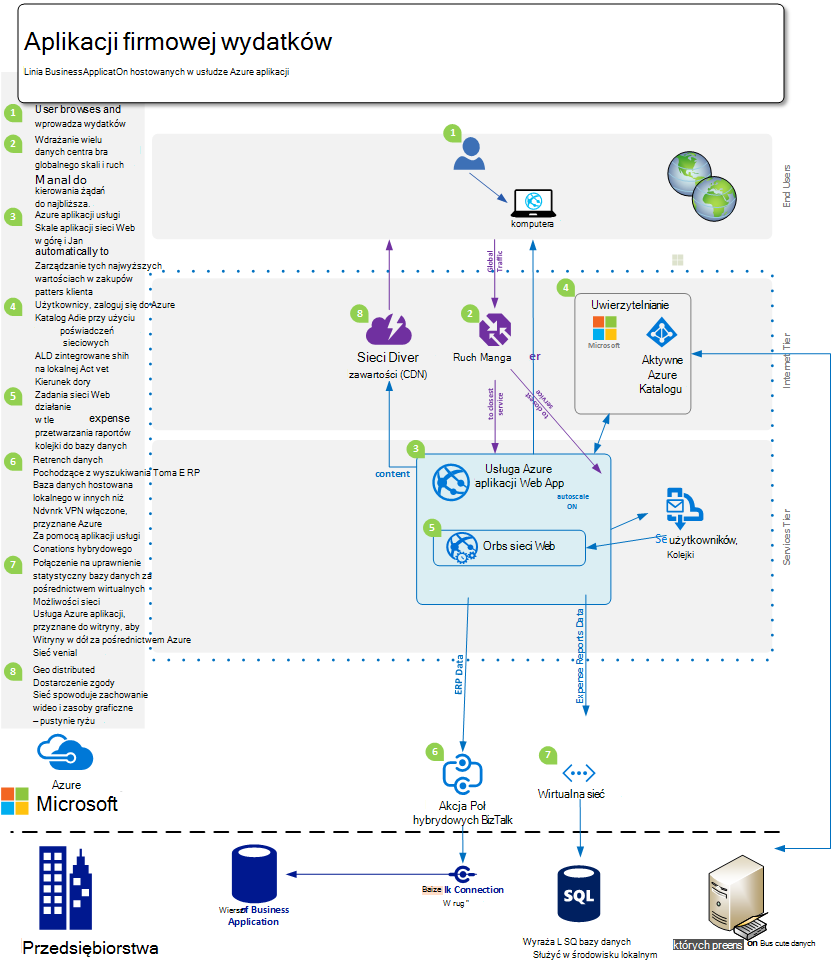
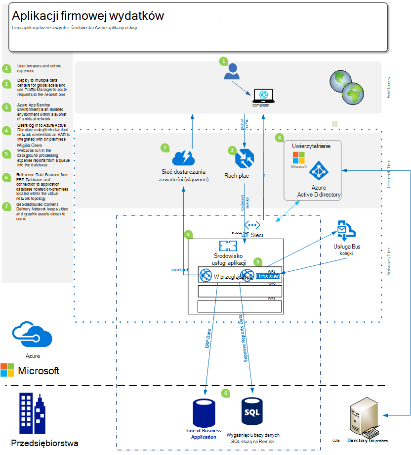
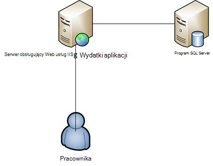

<properties 
    pageTitle="Oferty aplikacje sieci Web Azure usługi aplikacji dla przedsiębiorstw" 
    description="Pokazano, jak za pomocą Azure aplikacji usług sieci Web umożliwia tworzenie rozwiązań witryny sieci Web dla swojej firmy" 
    services="app-service\web" 
    documentationCenter="" 
    authors="apwestgarth" 
    manager="wpickett" 
    editor=""/>

<tags 
    ms.service="app-service-web" 
    ms.workload="web" 
    ms.tgt_pltfrm="na" 
    ms.devlang="na" 
    ms.topic="article" 
    ms.date="07/29/2016" 
    ms.author="anwestg"/>

# Azure aplikacji usługi sieci Web Apps oferty dla przedsiębiorstwa dokument #

Potrzeba zmniejszyć koszty i dostarczanie rozwiązań informatycznych szybsze w środowisku szybkiego rozwoju tworzy wyzwania dla deweloperów, informatycy i menedżerów. Użytkownicy rosnącej złożoności szukany swoimi aplikacjami sieci web linii biznesowych (LOB) szybkie, odpowiada i dostępne z dowolnego urządzenia. W tym samym czasie firmy próbujesz wielką na zwiększenie produktywności i wydajności, pochodzącej z Integracja z chmury i usług mobilnych, może to być operacje tak proste jak rejestracji jednokrotnej na urządzeniach za pomocą usługi Active Directory współpracę usługi Office 365 przy użyciu danych pobierane z aplikacją LOB wewnętrznych, która z kolei pobiera danych z firmy stosowania usług Salesforce. [Azure aplikacji usługi sieci Web](http://go.microsoft.com/fwlink/?LinkId=529714) jest usługa w chmurze klasy korporacyjnej do tworzenia, testowania i z sieci web i aplikacji dla urządzeń przenośnych, API sieci Web i ogólnego witryn sieci Web. Może służyć do uruchamiania firmowej witryny sieci Web, witryn intranetowych, aplikacji i cyfrowego kampanii marketingowych w sieci globalnej centrach danych zoptymalizowana pod kątem skala i dostępności, wraz z obsługą integracji ciągły i DevOps nowoczesne rozwiązania.  

Ten dokument jest wyróżniana możliwości specjalnie ograniczony do uruchamiania LOB aplikacji sieci Web obejmujących migracji istniejących aplikacji sieci web i wdrażanie nowych LOB aplikacji sieci web na platformie usługi [Aplikacji sieci Web](/services/app-service/web/) . 

## Grupy odbiorców ##

Informatycy, architektów i menedżerowie, którzy chcą przeprowadzić migrację do obciążenia web chmury obecnie uruchomionych lokalnego. Obciążenia sieci Web może obejmować firm pracownikowi albo biznesowych w aplikacjach sieci web partnerów.

## Wprowadzenie ##

Aplikacji sieci Web usługi jest idealnym platformy umożliwiająca do obsługi zarówno aplikacji sieci web wewnętrznych i zewnętrznych, jak i usługi zapewnia efektywne pod względem kosztów, wysoce skalowalna zarządzanych rozwiązanie, co umożliwia skoncentrowanie się na dostarczanie wartości biznesowej dla użytkowników, a nie wydatków dużo czasu i środków utrzymania i obsługi oddzielić środowiskach. Aplikacje sieci Web oferuje elastyczną platformę, w którym chcesz wdrożyć aplikacji sieci web przedsiębiorstwa oferuje możliwość uwierzytelnić lokalnej usługi Active Directory za pośrednictwem integracji z Microsoft Azure Active Directory w dalszym ciągu obsługuje wdrożeń szybkie i łatwe tworzenie Użyj swojego wewnętrznego ciągły integracji i wdrażania rozwiązania, podczas automatyczne skalowanie w miarę potrzeb biznesowych — wszystko w zarządzanych platformy, która umożliwia skoncentrowanie się na aplikacji i nie infrastruktury. 

## Definicja problem ##

Pozioma IT zmienia się szybko, z Przenieś od umieszczenia na serwerach tradycyjnych z ich wysokich kosztów kapitałowych na czas realizacji długi do jednego, która używa na żądanie za pomocą usług, które stosowane automatycznie do obsługi obciążenia. O wezwaniu działów informatycznych w celu zmniejszenia kosztów i wydatków za infrastruktury i konserwacji z fokusem na skrócenie KAPITAŁOWYCH podczas jednocześnie zwiększa elastyczność. Na koniec obowiązywania starszych platformach infrastruktury, takie jak Windows Server 2003, jest prowadzące działów informatycznych, aby zapoznać się z chmury migracji jako potencjalny sposób w celu uniknięcia kosztów kapitałowych nowe długoterminową. W przeszłości dyrektorów ds spowodowałby zakupów decyzje dotyczące innych działów; jednak rosnącej złożoności CMOs i innych firm jednostki głowy wykonywaną aktywnych rola w sposób wydatków ich budżetów i co to jest zwrot z inwestycji ich. Rosnącej złożoności firmy muszą być o wiele bardziej przenośne niż kiedykolwiek pracowników pracuje zdalnie, wydatków więcej czasu klientom konieczności uzyskiwania dostępu do systemów problemów bezpłatne pracowników.

Firma wymaga zmiany, co miesiąc, co tydzień, codziennie. Błyskawiczne globalnej Skaluj z usług zaktualizowane regularnych pełny z nowych funkcji, dostarczane przez inną osobę lub wewnętrznie odnaleźć firmy.  W niektórych przypadkach firmy również odnaleźć możliwości do wyodrębnienia swoje aplikacje i dostęp do zasobów, o ile umożliwiając korzystanie z urządzeń publicznej chmury. Użytkownicy mają wyższą oczekiwań, z wielu pozwalający korzystać z usług w ich życiu prywatnym, takich jak usługi Office 365. Spodziewają mają dostęp do usług zaawansowanych funkcji podobne, na bieżąco, w ich życia pracy. Aby poradzić sobie z tym żądanie IT musi wygląd, aby pomóc firmie, aby włączyć tę przez zaznaczenie oraz integracja z innych firm usług, staranne Wybieranie platformy, które można dostosować do potrzeb biznesowych jednocześnie również będące zaufanego z ograniczona całkowity koszt użytkowania.

Szukasz członkom zespołu deweloperów do przeprowadzania natychmiastowe korzyści, przedstawiania nowe funkcje częste. Wyszukaj z platformą kosztów skutecznych, niezawodne, której można zintegrować z ich istniejących test narzędzia i wskazówki dotyczące — rozwój, zwolnij; i pracy razem z działów informatycznych zautomatyzować wdrażania, zarządzania i alertu wszystko w celu zero przestoje.

<a href="highlevel" />
## Rozwiązanie wysokiego poziomu ##

Platformy sieci Web i struktury rosnącej złożoności są używane do opracowywania, testowanie i obsługiwanie linią aplikacji biznesowych.  Typowe linią aplikacji biznesowych, takich jak system wydatków pracowników wewnętrznych często składającej się wyłącznie z aplikacji sieci web z kopii bazy danych do przechowywania danych połączonych z aplikacją.

Usługa aplikacji Web Apps jest dobrym rozwiązaniem do obsługi takie aplikacje oferujący skalowalna i niezawodne infrastruktury, która jest zarządzana i poprawkami z w pobliżu zero ręczne i przestoje. Platforma Microsoft Azure udostępnia wiele opcji przechowywania danych do obsługi aplikacji sieci web hostowana w aplikacji sieci Web z Microsoft Azure SQL Database zarządzanych skalowalna relacyjne bazy danych jako a usługi, aby popularnych usług z partnerami, takich jak bazy danych MySQL ClearDB i MongoDB.

Jest to korzystanie z istniejących inwestycji w swojej siedzibie. W scenariuszu przykład systemem wydatków pracowników, możesz zachować sklepu danych w wewnętrznych infrastruktury. Może to być Integracja z systemami wewnętrznych (raportowania, płac, rozliczenia itd.) lub spełniają wymagania zarządzania IT.  Aplikacje sieci Web udostępnia szereg metod umożliwiających na łączenie się infrastruktury w środowisku lokalnym:

- [Środowiska usługi aplikacji](app-service-app-service-environment-intro.md) — środowiska usługi aplikacji (ASE) są nową funkcję Premium, który został ostatnio dodać do oferująca usługi aplikacji Microsoft Azure.  ASEs Podaj w pełni odizolowanych i dedykowane środowisko bezpieczne uruchamiania aplikacji Azure aplikacji usługi w większej skali wysoka a doświadczonym izolacji i bezpieczny dostęp sieciowy   
- [Połączenia hybrydowym](../biztalk-services/integration-hybrid-connection-overview.md) — hybrydowych połączenia są funkcją programu Microsoft Azure BizTalk Services i włączyć aplikacje sieci Web nawiązania połączenia w środowisku lokalnym zasobów bezpieczne, na przykład programu SQL Server, MySQL, API sieci Web i usług sieci web niestandardowe. 
- [Wirtualna integrację z sieciami](https://azure.microsoft.com/blog/2014/09/15/azure-websites-virtual-network-integration/) — integracja aplikacji sieci Web z wirtualną sieć Azure umożliwia łączenie aplikacji sieci web z wirtualną sieć Azure, która z kolei może być połączony z infrastruktury w środowisku lokalnym przez sieć VPN witryny do witryny. 

Następujące plany przedstawić przykład rozwiązanie wysokiego poziomu z opcjami łączności dla zasobów lokalnych.  Pierwszy przykład przedstawia, jak można to osiągnąć przy użyciu standardowych funkcji Azure aplikacji usługi i drugi pokazano, jak można to osiągnąć za pomocą premium oferowania środowiska usługi aplikacji.

Korzystanie z funkcji standardowej aplikacji usługi:

Przy użyciu środowiska usługi aplikacji:

## Korzyści dla firm ##

Usługa aplikacji Web Apps udostępnia szereg korzyści firm, które umożliwiają funkcja ma być o wiele bardziej efektywny i adaptacyjne w przedstawiania dla potrzeb biznesowych. 

### PaaS Model ###

Usługa aplikacji Web Apps jest oparty na platformie jako model usługi, która udostępnia wiele oszczędności kosztów i wydajności pracy.  Nie są już potrzebne wydatki godzin Zarządzanie maszyny wirtualne, poprawianie systemy operacyjne i RAM. Aplikacje sieci Web jest automatycznie patched środowisko, dzięki czemu można skupić się na zarządzanie aplikacjami sieci web i nie maszyny wirtualne, pozostawiając Podaj firmy członkom zespołu.

PaaS Model wspieranie aplikacji Web Apps umożliwia lekarze metodologii DevOps do realizacji założonych. Jako firma oznacza to pełny zarządzania i integrację z całym całego cyklu życia aplikacji, w tym rozwoju, testowanie, wersji, monitorowania i zarządzania i pomocy technicznej. 

Dla członkom zespołu deweloperów można skonfigurować ciągły integracji i wdrożenie przepływu pracy programu Visual Studio Team Services, GitHub, TeamCity, Hudson lub BitBucket włączania automatyczne tworzenie, testowanie i wdrażania umożliwiające szybsze wersji cykli, o ile zmniejszania tarcie objęte zwolnieniem w istniejącej infrastruktury. Aplikacje sieci Web umożliwia tworzenie wielu badania i przygotowania środowiska dla wersji przepływu pracy, nie są już potrzebne rezerwowanie lub przydzielić sprzętu do tych celów, możesz tworzyć możliwie jak najwięcej środowiska potrzeby i definiowanie własnych promocji, aby zwolnić przepływu pracy. Służbowe, które można zdecydować, zwolnij do przedziału test z kontrolki źródła, wykonywanie serii badań i po pomyślnym zakończeniu promowania do przedziału etapu i Zamień na końcu produkcji bez przestojów z zwiększenia korzyści, jakie aplikacje sieci web hostowana w aplikacjach sieci Web są wstępnie załadowane i hot zapewnienie najwyższy poziom zadowolenia.  Ponadto firmy można wykorzystać testowanie w produkcji możliwości aplikacji sieci Web usługi bezpośredni sekcji ruchu do różnych przedział, Sprawdź wprowadzone zmiany, przed przełączanie cały ruch do nowej instalacji lub przywracanie cały ruch do poprzedniego wdrożenia. 

Operacje członkom zespołu można postawić pewność, że są one najlepiej pozycji reakcji na problemy z dowolnej aplikacji sieci web hostowana w aplikacjach sieci Web przy użyciu wbudowanego w funkcjach monitorowania i alerty. Należy zespołów operacyjnych już masz zainwestowanego w analizy i monitorowania rozwiązań takich od firmy Microsoft Visual Studio aplikacji wniosków, nowe Relic i AppDynamics. Są również w pełni są obsługiwane w aplikacjach sieci Web, umożliwiając ciągłości i znajomych środowiskach, z której monitorowanie aplikacji sieci web.

Na końcu aplikacji Web Apps zapewnia funkcje automatycznego wykonywania kopii zapasowej do app(s) i hostowanej baz danych bezpośrednio do kontenera magazyn obiektów Blob platformy Azure. Zapewnia łatwy sposób i bardzo kosztów skutecznej metody umożliwiające odzyskiwanie po awarii, zmniejszając zespolonej na lokalnej sprzętu i oprogramowania.

### Łatwość migracji ###

Pakietach i obrotu jest problem z kluczem dla firm, ponieważ przyspieszyć cykli wersji sprzętu i systemów operacyjnych. Być może masz wiele serwerów Windows Server 2003 R2, które pochodzą w celu obsługi w 2015, ale nadal znajdują aplikacji klucza sieci web dla swojej firmy? Usługa aplikacji Web Apps to doskonałe candidate, na którym do obsługi tych aplikacji sieci web, a także uporządkować nieruchomości sprzętu firm. Aplikacje sieci Web umożliwia dostęp do zakresu wymagania dotyczące sprzętu, które są zarządzane i obsługiwane w ramach usługi, co eliminuje konieczność współczynnik wymiana i zarządzania koszty w ramach budżetu infrastruktury.  Migracji można być możliwie najprostsze kopii i wkleić operacji istniejącego wdrożenia do aplikacji sieci Web lub bardziej złożone migracji, gdzie za pomocą Asystenta migracji aplikacji sieci Web spowoduje dodanie wartości. Aplikacje sieci web migracją spodobać pełny zakres usług Azure integracji usługi dodatkowe w aplikacjach sieci web. Na przykład można rozważyć dodanie usługi Azure Active Directory w celu kontrolowania dostępu do aplikacji według stowarzyszenie użytkowników do grup zabezpieczeń. Inny przykład może być dodanie usług pamięci podręcznej, aby zwiększyć wydajność i zmniejszyć opóźnienie, zapewniające ogólnej lepiej środowisko użytkownika. 

### Hostingu klasy przedsiębiorstwa ###

Usługi aplikacji Web Apps udostępnia platformę stabilny i niezawodne, które zostały sprawdzone Aby radzić sobie z wielu różnych firm musi z małych wewnętrznych projektowania i testowania obciążeń pracą, skalować bardzo duży ruch witryn sieci Web. Korzystając z aplikacji Web Apps, wykonywania za pomocą samego hostingu platformy klasy przedsiębiorstwa używanej przez firmę Microsoft jako firma korzysta z dla dużej wartości obciążenia sieci web. Aplikacje sieci Web, wraz z wszystkich usług na platformie Azure utworzono z zabezpieczenia i zgodność z przepisami, takich jak ISO (ISO/IEC 27001:2005); SOC1 i poświadczenia SSAE SOC2 3402 16-ISAE, HIPAA BAA, PCI i Fedramp bardzo centralnym każdego elementu i funkcji, aby uzyskać więcej informacji można znaleźć [http://aka.ms/azurecompliance](/support/trust-center/compliance/). 

Platformy Microsoft Azure umożliwia roli podstawie autoryzacji kontrolki umożliwiające poziomy enterprise kontrolki zasobów w aplikacjach sieci Web. RBAC daje przedsiębiorstw uprawnienia do wykonania własne zasady zarządzania dostępu dla wszystkich swoich aktywów w środowisku Azure przypisywanie użytkowników do grup i z kolei przypisując wymagane uprawnienia do nich przed środków trwałych, takich jak aplikacji sieci web. Aby uzyskać więcej informacji o RBAC platformy Azure zobacz [http://aka.ms/azurerbac](../active-directory/role-based-access-control-configure.md). Wykorzystując aplikacji sieci Web, możesz mieć pewność, wdrażania aplikacji sieci web w środowisku bezpieczne i masz Pełna kontrola, na których terytorium aktywów są rozmieszczane. 

Azure środowiska usługi aplikacji [http://aka.ms/aseintro](http://aka.ms/aseintro) są nowa opcja plan usługi premium dla przedsiębiorstw chcą korzystać z Azure aplikacji usługi i tych Podaj w pełni odizolowanych i dedykowane środowiska.  Dzięki temu przedsiębiorstwa do wdrażanie aplikacji, które mogą korzystać z bardzo wysoki skali przy jednoczesnym także o pełną kontrolę nad ruch przychodzący i wychodzący sieci i ASEs umożliwiają aplikacjom mają szybkich bezpiecznego połączenia wirtualnej sieci do zasobów lokalnych.

Usługa aplikacji Web Apps są również możliwość pełnego wykorzystania inwestycji w środowisku lokalnym, oferując możliwość łączenia z powrotem do zasobów wewnętrznych, zawierających na przykład magazynu danych lub środowisko programu SharePoint. Zgodnie z opisem w [rozwiązaniu wysokiego poziomu](#highlevel) można wprowadzić do nawiązywania połączeń do usług i infrastruktury lokalnej za pomocą połączeń hybrydowych i wirtualnych łączność sieciowa.

### Globalna skala ###

Usługa aplikacji Web Apps jest globalnej i skalowalna platforma, włączanie aplikacji sieci web powiększać i dostosować do potrzeb rozwoju firmy szybko i z minimalnymi długoterminową planowania i koszt. Typowe w lokalnej infrastrukturze scenariuszy, rozszerzeń i wzrostem zarówno lokalnie i geograficznie może zająć dużo zarządzania, planowania i wydatków udzielenia i zarządzania nimi dodatkowa infrastruktura. Aplikacje sieci Web oferuje możliwość skalowania aplikacji sieci web z i przypływ wymagania. Na przykład za pomocą aplikacji wydatków na przykład dla większości miesiąca użytkownicy korzystają uproszczonej aplikacji, ale jako termin każdego miesiąca dla przesłanych elementów wydatków należy wprowadzić i zastosowania zwiększa w swojej aplikacji, aplikacje sieci Web ma możliwość automatycznie dodawać więcej infrastruktury aplikacji i następnie po obciążenie ma subsided ponownie go można skalować powrót do infrastruktury według planu bazowego, zdefiniowanych.

Aplikacje sieci Web jest dostępne globalnie w 24 centrach danych na całym świecie i rosnącej. Aby uzyskać najbardziej uaktualniony wykaz regionów i lokalizacji zobacz [http://aka.ms/azlocations](http://aka.ms/azlocations). Z aplikacjami sieci Web firmy można łatwo osiągnąć globalne i Skala. W miarę firmy do nowych regionów, raportowania pulpity nawigacyjne aplikacji, których używasz i hosta w aplikacjach sieci Web można łatwo wdrożyć do dodatkowych centrach danych i obsługi użytkowników lokalnych szybciej przez połączenie aplikacji Web Apps i Menedżer ruchu Azure wszystkie dodane zaletą skalowalna infrastruktura pod możliwość umowy, a następnie rozwiń węzeł musi mieć zmiany oddziałów regionalnych.
 
## Szczegóły rozwiązania ##

Przyjrzyjmy się z przykładem scenariusz migracji aplikacji. To przedstawiono szczegółowe informacje o jak funkcje aplikacji sieci Web usługi dostępne są ze sobą zapewniające doskonałe rozwiązanie i wartości biznesowej.
 
W tym przykładzie linią aplikacji biznesowych, które będzie można omawiane firma Microsoft stanowi raportowania aplikacji, która umożliwia pracownikom przesyłanie ich wydatki zwrot wydatków. Aplikacja znajduje się w systemie Windows Server 2003 R2 uruchomiony IIS6 i baza danych jest baza danych programu SQL Server 2005. Przyczyny wybrany starsze serwera spoczywa nadchodzących zakończenia programu usługi dla Windows Server 2003 R2 i SQL Server 2005, a mamy [Narzędzia](http://aka.ms/websitesmigration) oraz [wskazówki](http://aka.ms/websitesmigrationresources) automatycznie migrowania obciążenia do Azure. Z tym pamiętać deseniu w tym przykładzie użyto dotyczą szerokości verity scenariuszy migracji. 

### Migrowanie istniejącej aplikacji ###

Krok jedną ogólne rozwiązanie przenoszenia aplikacją LOB programu do aplikacji sieci Web jest zidentyfikowanie istniejące zbiory aplikacji i architektury. Przykład tego dokumentu jest aplikacji sieci web ASP.NET hostowana na serwerze usług IIS w bazie danych hostowana w osobnym SQL Server, jak pokazano na poniższej ilustracji. Pracownicy logowania do systemu przy użyciu kombinacji nazwy użytkownika i hasła, wprowadź szczegółowe informacje wydatków i przekaż zeskanowanych kopii potwierdzenia, do bazy danych dla każdego elementu wydatków. 
 

#### Elementy do rozważenia ####

Po migracji aplikacji w środowisku lokalnym, warto pamiętać kilka ograniczeń aplikacji sieci Web. Oto niektóre tematy klucza, o których warto pamiętać podczas migracji aplikacji sieci web do aplikacji sieci Web ([http://aka.ms/websitesmigrationresources](http://aka.ms/websitesmigrationresources)):

-   Port powiązań — Web Apps obsługuje tylko portu 80 dla protokołu HTTP i 443 dla ruchu HTTPS. Jeśli aplikacja korzysta z innego portu, a następnie po migracji aplikacji spowoduje, że używanie portu 80 dla protokołu HTTP i portu 443 dla ruchu HTTPS. Często jest to bezpieczna problem jest wspólny na wdrożenia lokalne nawiązać korzystanie z różnych portów w celu rozwiązania Użyj nazwy domeny, zwłaszcza w środowiskach projektowania i testowania
-   Uwierzytelnianie — Web Apps obsługuje uwierzytelnianie anonimowe domyślnie i uwierzytelniania formularzy określonych przez aplikację. Aplikacje sieci Web mogą oferować uwierzytelniania systemu Windows, gdy aplikacja jest zintegrowany z usługi Azure Active Directory i ADFS tylko. Jest to funkcja, który został omówiony w bardziej szczegółowo [w tym miejscu](http://aka.ms/azurebizapp) 
-   Globalnej pamięci podręcznej zestawu podstawie zestawów — aplikacje sieci Web nie zezwala na wdrażania zestawów do pamięci podręcznej (globalnej). W związku z tym, jeśli migrowana aplikacji korzysta z tych funkcji lokalnych, należy rozważyć przeniesienie zestawów do folderu bin aplikacji.
-   Usług IIS5 Tryb zgodności — aplikacje sieci Web nie obsługuje tryb zgodności usług IIS5 i jako takie każdego wystąpienia aplikacji sieci Web i wszystkie aplikacje sieci web w obszarze wystąpienie aplikacji Web Apps nadrzędnego są uruchamiane w ten sam proces roboczy w jednej puli aplikacji.
-   Używanie bibliotek COM — aplikacje sieci Web nie zezwala na rejestracji składników COM na platformie. W związku z tym jeśli aplikacja jest używanie składników COM, te musi ponownego w kod zarządzany i wdrażane w aplikacji.
-   Filtry ISAPI — filtrów ISAPI są obsługiwane w aplikacjach sieci Web. Muszą być używany jako część aplikacji, a w pliku web.config aplikacji sieci web. Aby uzyskać więcej informacji zobacz [http://aka.ms/azurewebsitesxdt](web-sites-transform-extend.md). 

Po tych tematów zostały uwzględnione, aplikacji sieci web jest gotowa do chmury. Nie martw się, a jeśli niektóre tematy nie są w pełni spełnione, narzędzia do migracji nadaje starań do migracji. 

Następne kroki w procesie migracji są do tworzenia aplikacji usługi aplikacji sieci web i bazy danych SQL Azure. Istnieje wiele rozmiarów wystąpień aplikacji sieci Web z różną liczbę rdzenie Procesora i pamięci RAM kwoty dostępne umożliwiające wybranie zgodnie z wymaganiami aplikacji sieci web. Aby uzyskać więcej informacji i ceny, zobacz [http://aka.ms/azurewebsitesskus](/pricing/details/websites/). Analogicznie Microsoft Azure SQL Database caters do wszystkich potrzeb biznesowych z różnych poziomów usług i poziomów wydajności w celu spełnienia wymagań. Więcej informacji można znaleźć w [http://aka.ms/azuresqldbskus](/pricing/details/sql-database/). Po utworzeniu aplikacji jest przekazane do usługi sieci Web aplikacji, albo za pośrednictwem FTP lub WebDeploy, a następnie przesuń w bazie danych.

W tym migracji rozwiązanie używa bazy danych SQL Azure, ale to jest nie tylko bazy danych, który jest obsługiwany w Azure. Firmy, można także wprowadzić stosowania DocumentDB Azure MySQL, MongoDB i wiele innych za pośrednictwem dodatki, które można kupić w [Magazynie Azure](/marketplace/partner-program/). 

Podczas tworzenia bazy danych SQL Azure dostępnych jest kilka opcji do importowania istniejącej bazy danych z lokalnego serwera z Generowanie skryptu istniejącej bazy danych za pomocą [warstwy danych aplikacji eksportu i importu](http://aka.ms/dacpac). 

Bazy danych aplikacji wydatków zostało utworzone przez utworzenie nowej bazy danych SQL Azure, łączenie z bazą danych przy użyciu programu SQL Server Management Studio, a następnie uruchamiając skrypt, aby utworzyć schemat bazy danych, a następnie wypełnij go z danymi z lokalnej bazy danych.

Ostatnim krokiem w pierwszym etapie migracji wymaga aktualizowania parametry połączenia z bazą danych dla aplikacji. Można to osiągnąć przez Azure portal. Dla każdej aplikacji sieci web możesz zmienić ustawienia dotyczące aplikacji, w tym dowolne ciągi połączenia używane przez aplikację nawiązywania połączenia z dowolnej bazy danych używane.

### Rozwiązania alternatywne do korzystania z bazy danych SQL Azure ###

Platformy Azure oferuje kilka rozwiązań alternatywnych wobec jako aplikacje podstawowego bazy danych sieci web przy użyciu bazy danych SQL Azure, jest to znaczy umożliwiające różne obciążenia za pomocą rozwiązania NoSQL lub włączyć platformy do własnych potrzeb danych biznesowych. Na przykład firma może zawierać dane nie mogą być przechowywane poza lub w środowisku chmury publicznej i w związku z tym powinien wyglądać Obsługa używania ich w lokalnej bazy danych.

#### Łączność z lokalnych zasobów ####
Usługi aplikacji Web Apps oferuje wiele opcji do łączenia się z zasobów lokalnych, takich jak bazy danych, włączania ponownego użycia istniejącej infrastruktury wysokiej wartości. Wymienione poniżej są następujące opcje:

- Samodzielnie i utworzone w podsieci wirtualnej sieci, w związku z tym włączenie środowiska można komunikować się z prywatnych punkty końcowe znajdujących się na tej samej sieci wirtualnych - [http://aka.ms/appserviceasenetworking](http://aka.ms/appserviceasenetworking) środowiskach aplikacji usługi
- Wirtualna integracji sieci Web aplikacji obsługuje integrację między aplikacjami sieci Web i Azure wirtualnej sieci, zezwolenia na dostęp do zasobów w sieci wirtualnej, które, jeśli połączenie w sieci lokalnej z witryny do witryny sieci VPN, umożliwia łączność bezpośrednio do usługi w przypadku systemów lokalnej.
- Hybrydowe połączenia są funkcją usługi Azure BizTalk i łatwy sposób nawiązywania połączenia z poszczególnych lokalnych zasobów, takich jak program SQL Server, MySQL, HTTP sieci Web API i najbardziej niestandardowych usług sieci Web.

#### Skala i elastyczność ####

W miarę biznesu jego pracowników za pośrednictwem nabycia lub organiczny — przyrost naturalny, więc zbyt musi web skali aplikacji do spełnienia tych wymagań nowy. Faktycznie dzisiaj jest typowych, aby zobaczyć jeszcze większą rozkładu znajdują się zespołów i zdalnych pracowników, na przykład wymusić firmy z biura w Stanach Zjednoczonych, Europie i Azji, ze sprzedażą urządzeń przenośnych w wiele więcej terytoriów. Aplikacje sieci Web ma możliwości obsługi elastyczne zmiany skalę wygodnie i automatycznie.

Usługa aplikacji Web Apps umożliwia aplikacji sieci web, należy skonfigurować przeskalować automatycznie przez portal Azure, w zależności od dwóch wektorów — zaplanowane czasu lub przez użycie Procesora. Skalowanie automatyczne aplikacji sieci Web umożliwia skuteczne kosztów i bardzo elastyczne zaspokojenia większych zmian w zastosowania dla wszystkich aplikacji biznesowych, w aplikacjach sieci web, na przykład naszych wydatków raportowania systemu do marketingowej witryny sieci Web, która usługa wysoka serii ruch przez krótki czas promocji. Aby uzyskać więcej informacji i wskazówki dotyczące skalowania aplikacji sieci web przy użyciu aplikacji sieci Web zobacz [jak skala witryn sieci Web](web-sites-scale.md).

Oprócz skalowania elastycznie aplikacji sieci Web ogólnego platformy umożliwia ciągłości i elastyczność za pośrednictwem rozkład możliwych aplikacji sieci web i ich składników majątku w wielu centrach danych i regionach geograficznych.

## Podsumowanie ##
Usługi aplikacji Web Apps oferuje elastyczne, koszt skutecznych odpowiada rozwiązanie do dynamicznego potrzeb biznesowych w środowisku szybkiego rozwoju. Web Apps ułatwia firmy zwiększenie produktywności i wydajności przez za pomocą zarządzanych platformy z nowoczesny możliwości DevOps i ograniczona wskazówki zarządzania, zapewniając możliwości przedsiębiorstwa w skali, odporność, zabezpieczenia i integracja z lokalnego aktywów.

## Zalecenie ##
Aby uzyskać więcej informacji na temat usługi Azure aplikacji usługi sieci Web, odwiedź witrynę [http://aka.ms/enterprisewebsites](/services/websites/enterprise/) miejsce, w którym mogą być sprowadzana więcej informacji i logowania dla wersji próbnej dzisiaj o [http://aka.ms/azuretrial](/pricing/free-trial/) , aby korzystać z usługi i Odkrywanie zalet dla swojej firmy.

[AZURE.INCLUDE [app-service-web-whats-changed](../../includes/app-service-web-whats-changed.md)]

[AZURE.INCLUDE [app-service-web-try-app-service](../../includes/app-service-web-try-app-service.md)]
 
 
