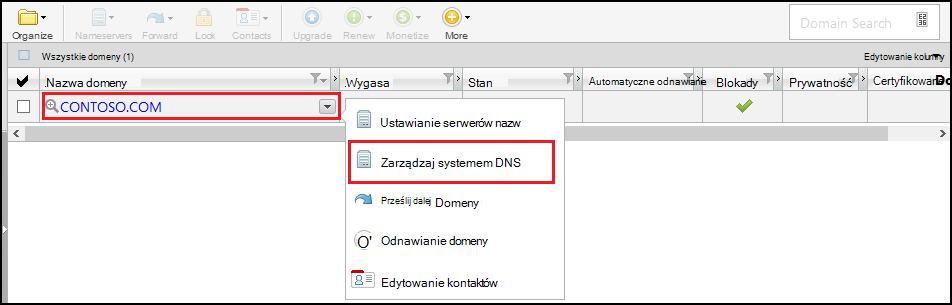
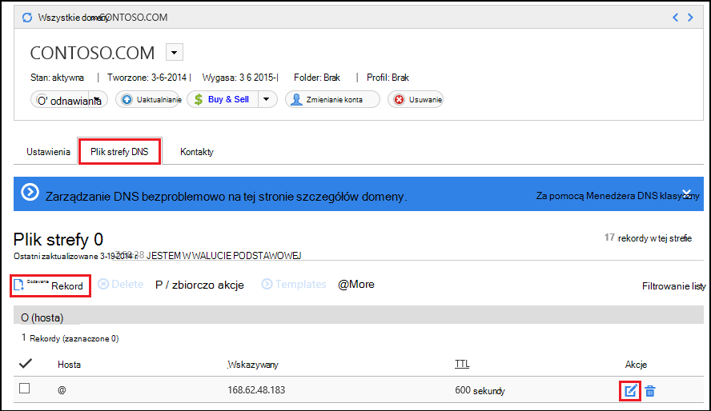
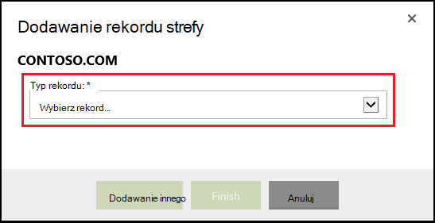
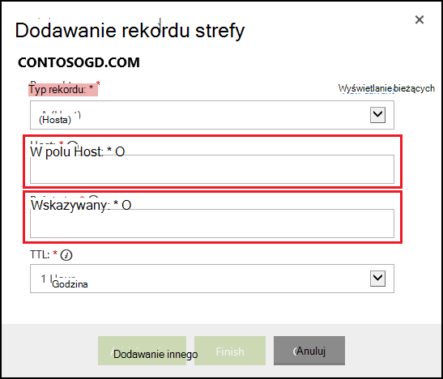

<properties
    pageTitle="Konfigurowanie niestandardowej nazwy domeny w usłudze Azure aplikacji (GoDaddy)"
    description="Dowiedz się, jak używać nazwy domeny w witrynie GoDaddy z aplikacjami Web Azure"
    services="app-service"
    documentationCenter=""
    authors="erikre"
    manager="wpickett"
    editor="jimbe"/>

<tags
    ms.service="app-service"
    ms.workload="na"
    ms.tgt_pltfrm="na"
    ms.devlang="na"
    ms.topic="article"
    ms.date="01/12/2016"
    ms.author="cephalin"/>

# Konfigurowanie niestandardowej nazwy domeny w usłudze Azure aplikacji (zakupione bezpośrednio w witrynie GoDaddy)

[AZURE.INCLUDE [web-selector](../../includes/websites-custom-domain-selector.md)]

[AZURE.INCLUDE [intro](../../includes/custom-dns-web-site-intro.md)]

Jeśli zakupiono domeny za pośrednictwem sieci Web usługi aplikacji Azure następnie odwołują się do ostatniego kroku [Kupowanie domeny w przypadku aplikacji sieci Web](custom-dns-web-site-buydomains-web-app.md).

Ten artykuł zawiera instrukcje na temat korzystania z niestandardowej nazwy domeny kupionej bezpośrednio z [GoDaddy](https://godaddy.com) z [Aplikacji sieci Web usługi](http://go.microsoft.com/fwlink/?LinkId=529714).

[AZURE.INCLUDE [introfooter](../../includes/custom-dns-web-site-intro-notes.md)]

##Opis rekordy DNS

[AZURE.INCLUDE [understandingdns](../../includes/custom-dns-web-site-understanding-dns-raw.md)]

## Dodawanie rekordu DNS dla domeny niestandardowej

Aby skojarzyć własnej domeny z aplikacji sieci web w aplikacji usługi, musisz dodać nowy wpis w tabeli DNS dla domeny niestandardowej za pomocą narzędzi dostępnych w witrynie GoDaddy. Wykonaj następujące czynności, aby zlokalizować narzędzia systemu DNS dla witrynie go Daddy

1. Zaloguj się do swoje konto w witrynie go Daddy, a następnie wybierz pozycję **Moje konto** , a następnie **Zarządzaj moich domen**. Na koniec wybierz menu rozwijane dla nazwy domeny, którego chcesz używać razem z aplikacji sieci Azure web i wybierz pozycję **Zarządzaj systemem DNS**.

    

2. Na stronie **szczegółów domeny** przewiń do karty **Plik strefy DNS** . Jest to sekcji Dodawanie i modyfikowanie rekordów DNS dla nazwy domeny.

    

    Wybierz pozycję **Dodaj rekord** , aby dodać istniejący rekord.

    Aby **edytować** istniejący rekord wybierz ikonę pióra i papieru znajdującą się obok rekordu.

    > [AZURE.NOTE] Przed dodaniem nowych rekordów, Uwaga GoDaddy utworzyła już rekordy DNS dla popularne domen podrzędnych (nazywanych **hosta** w edytorze) takich jak **wiadomości e-mail**, **plików** **poczty**i innych osób. Jeśli nazwę, której chcesz użyć, już istnieje, należy zmodyfikować istniejący rekord zamiast tworzenia nowej witryny.

4. Podczas dodawania rekordu, należy najpierw zaznaczyć tego typu rekordu.

    

    Następnie należy podać **hosta** (domeny niestandardowej lub poddomenę) i jakie it **wskazywany**.

    

    * Podczas dodawania **rekord (hosta)** : należy ustawić pola **Host** dowolnego **@** (jest to nazwa domeny głównej, na przykład **contoso.com**) *(symbol wieloznaczny dla pasujących wiele domen podrzędnych) lub poddomenę chcesz użyć (na przykład * *ciągu "www"**.) Należy ustawić * *wskazywany** pola Adres IP aplikacji sieci Azure web.

    * Podczas dodawania **rekordu CNAME (alias)** — należy ustawić pola **Host** do niej poddomenę, którego chcesz użyć. Na przykład **"www"**. Należy ustawić pola **wskazywany** **. azurewebsites.net** nazwy domeny aplikacji sieci Azure web. Na przykład **contoso.azurewebsites.net**.

5. Kliknij przycisk **Dodaj innego**.
6. Wybierz pozycję **TXT** jako typ rekordu, a następnie określ wartość **hosta** **@** i wartość **wskazywany** ** &lt;yourwebappname&gt;. azurewebsites.net**.

    > [AZURE.NOTE] Ten rekord TXT jest używana przez Azure do sprawdzania poprawności prawa własności domeny opisane rekordu A lub pierwszego rekordu TXT. Jeśli domeny ma zostały zamapowane w Azure Portal aplikacji sieci web, można usunąć ten wpis rekordu TXT.

5. Po zakończeniu dodawania lub modyfikowanie rekordów, kliknij przycisk **Zakończ** , aby zapisać zmiany.

## Włączanie nazwy domeny w aplikacji sieci web

[AZURE.INCLUDE [modes](../../includes/custom-dns-web-site-enable-on-web-site.md)]

>[AZURE.NOTE] Jeśli chcesz rozpocząć pracę z Azure aplikacji usługi przed utworzeniem konta dla konta Azure, przejdź do [Spróbuj aplikacji usługi](http://go.microsoft.com/fwlink/?LinkId=523751), którym natychmiast można utworzyć aplikację sieci web krótkotrwałe starter w aplikacji usługi. Nie kart kredytowych wymagane; nie zobowiązania.

## Informacje o zmianach
* Przewodnika do zmiany z witryn sieci Web do usługi aplikacji Zobacz: [Usługa Azure aplikacji i jego wpływ na istniejące usługi Azure](http://go.microsoft.com/fwlink/?LinkId=529714)
