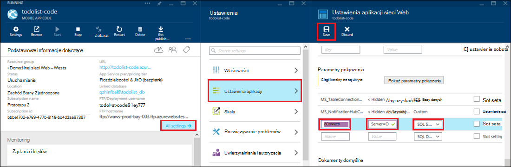

<properties 
    pageTitle="Dostęp do zasobów lokalnych hybrydowych połączenia przy użyciu Azure aplikacji usługi" 
    description="Tworzenie połączenia między aplikacji sieci web w usłudze Azure aplikacji i zasobów lokalnych, korzystającego z statyczne port TCP" 
    services="app-service" 
    documentationCenter="" 
    authors="cephalin" 
    manager="wpickett" 
    editor="mollybos"/>

<tags 
    ms.service="app-service" 
    ms.workload="na" 
    ms.tgt_pltfrm="na" 
    ms.devlang="na" 
    ms.topic="article" 
    ms.date="02/03/2016" 
    ms.author="cephalin"/>

#Dostęp do zasobów lokalnych hybrydowych połączenia przy użyciu Azure aplikacji usługi

Aplikacja Azure aplikacji usługi można nawiązać każdego zasobu lokalnego, który używa statycznej port TCP, takich jak program SQL Server, MySQL HTTP sieci Web API i większość niestandardowych usług sieci Web. W tym artykule pokazano, jak utworzyć połączenie hybrydowych między usługą aplikacji i bazy danych programu SQL Server lokalnego.

> [AZURE.NOTE] Aplikacje sieci Web część funkcji hybrydowych połączeń jest dostępne tylko w [Azure Portal](https://portal.azure.com). Aby utworzyć połączenie w usługach BizTalk, zobacz [Hybrydowych połączenia](http://go.microsoft.com/fwlink/p/?LinkID=397274). 
> 
> Zawartość ta dotyczy również programu aplikacji Mobile w usłudze Azure w aplikacji. 

## Wymagania wstępne
- Subskrypcję usługi Azure. Aby uzyskać bezpłatnej subskrypcji zobacz [Azure bezpłatnej wersji próbnej](https://azure.microsoft.com/pricing/free-trial/). 
 
    Jeśli chcesz rozpocząć pracę z Azure aplikacji usługi przed utworzeniem konta dla konta Azure, przejdź do [Spróbuj aplikacji usługi](http://go.microsoft.com/fwlink/?LinkId=523751), którym natychmiast można utworzyć aplikację sieci web krótkotrwałe starter w aplikacji usługi. Nie kart kredytowych wymagane; nie zobowiązania.

- Aby użyć programu SQL Server lub SQL Server Express bazy danych lokalnych z połączeniem hybrydowe, TCP/IP musi być włączona na porcie statyczne. Używanie w przypadku wystąpienia domyślnego w programie SQL Server jest zalecane, ponieważ korzysta ona z portu statycznego 1433. Aby uzyskać informacje o instalowaniu i konfigurowaniu programu SQL Server Express do użytku z połączeniami hybrydowych zobacz [Nawiązywanie połączenia z lokalnego serwera SQL Azure witrynie sieci web za pomocą funkcji hybrydowych połączenia](http://go.microsoft.com/fwlink/?LinkID=397979).

- Komputer, na którym jest instalowany agenta hybrydowych Connection Manager lokalnego opisanych w dalszej części tego artykułu:

    - Muszą mieć możliwość nawiązywania połączenia z Azure przez port 5671
    - Musi mieć możliwość uzyskania *hostname*:*numer_portu* zasobu lokalnego. 

> [AZURE.NOTE] Kroki opisane w tym artykule założono, że używasz przeglądarki z komputera, na którym będzie przechowywana agenta połączenia hybrydowych lokalnego.

## Tworzenie aplikacji sieci web w Azure Portal ##

> [AZURE.NOTE] Jeśli utworzono już aplikacji sieci web lub wewnętrznej bazy danych aplikacji Mobile w Portal Azure, który ma być używany dla tego samouczka, można od razu przejść do [tworzenia połączenia hybrydowych i usługą BizTalk](#CreateHC) i uruchamiać stamtąd.

1. W lewym górnym rogu [Azure Portal](https://portal.azure.com)kliknij przycisk **Nowy** > **Web + Mobile** > **Aplikacji sieci Web**.
    
    ![Nowa aplikacja sieci web][NewWebsite]
    
2. Na karta **aplikacji Web app** podać adres URL, a następnie kliknij przycisk **Utwórz**. 
    
    ![Nazwa witryny sieci Web][WebsiteCreationBlade]
    
3. Po chwili jest tworzona aplikacja sieci web i zostanie wyświetlony jego karta aplikacji sieci web. Karta jest pionowo przewijaniem pulpit nawigacyjny, który umożliwia zarządzanie witryną.
    
    ![Z witryny sieci Web][WebSiteRunningBlade]
    
4. Aby sprawdzić, czy witryny, możesz kliknij ikonę **Przeglądaj** , aby wyświetlić domyślnej strony.
    
    ![Kliknij przycisk Przeglądaj, aby wyświetlić aplikacji sieci web][Browse]
    
    ![Domyślne strony aplikacji sieci web][DefaultWebSitePage]
    
Następnie możesz utworzyć połączenie hybrydowych i usługi BizTalk dla aplikacji sieci web.

## Tworzenie połączenia funkcji hybrydowych i usługą BizTalk ##

1. W swojej karta aplikacji sieci web kliknij pozycję **wszystkie ustawienia** > **sieci** > **skonfigurować połączenie hybrydowych punktów końcowych**.
    
    ![Hybrydowe połączenia][CreateHCHCIcon]
    
2. Na hybrydowych karta połączeń kliknij przycisk **Dodaj**.
    
    <!-- ![Add a hybrid connnection][CreateHCAddHC]
-->
    
3. Zostanie wyświetlona karta **Dodawanie połączenia hybrydowych** .  Ponieważ jest to pierwszy połączenie hybrydowe, **nowe połączenie hybrydowych** wyświetlana jest wartość, a dla Ciebie zostanie wyświetlona karta **Tworzenie hybrydowych połączenia** .
    
    ![Tworzenie połączenia funkcji hybrydowych][TwinCreateHCBlades]
    
    Na **Tworzenie hybrydowych połączenia karta**:
    - W polu **Nazwa**Podaj nazwę dla tego połączenia.
    - **Nazwa hosta**wprowadź nazwę komputera lokalnego obsługującego zasobu.
    - **Portu**wprowadź numer portu używanego do zasobów lokalnych (1433 wystąpienia domyślnego programu SQL Server).
    - Kliknij pozycję **uzasadnieniem dla firm — Porozmawiaj usługi**

4. Zostanie wyświetlona karta **Tworzenie usługi BizTalk** . Wprowadź nazwę dla usługi BizTalk, a następnie kliknij **przycisk OK**.
    
    ![Tworzenie usługi BizTalk][CreateHCCreateBTS]
    
    Karta **Tworzenie usługi BizTalk** zamyka i wyświetlasz karta **Tworzenie hybrydowych połączenia** .
    
5. Na tworzenie karta połączenia hybrydowe kliknij **przycisk OK**. 
    
    ![Kliknij przycisk OK][CreateBTScomplete]
    
6. Po zakończeniu procesu, obszar powiadomień w portalu informuje, pomyślnie utworzone połączenie.
    <!---zadania

    Wszystko zakończy się niepowodzeniem na tym etapie. Nie można utworzyć usługi BizTalk w portalu dogfood. Przełącz się do portalu klasyczny (pełnego portalu) i utworzył usługę BizTalk, ale nie powiodła się umożliwiają łączenie etapów ich — po zakończeniu kroku Poł hybrydowych tworzenie zostanie wyświetlony następujący komunikat o błędzie nie można utworzyć połączenia hybrydowych RelecIoudHC. Nie można odnaleźć typ zasobu w obszarze nazw "Microsoft.BizTaIkServices dla interfejsu api wersji 2014-06-01".
    
    Komunikat o błędzie wskazuje, że nie można znaleźć typu, nie wystąpienie.
    ![Powiadomienie o powodzeniu][CreateHCSuccessNotification]
    -->
7. Na karta aplikacji sieci web ikona **połączenia hybrydowych** teraz wskazuje, utworzenia połączenia hybrydowych 1.
    
    ![Połączenia hybrydowego jednego utworzonego][CreateHCOneConnectionCreated]
    
W tym momencie została ukończona ważną częścią infrastruktury połączenia hybrydowego chmury. Następnie utworzysz odpowiedniego fragmentu lokalnego.

## Instalowanie lokalnego hybrydowych Connection Manager, aby nawiązać połączenie ##

1. Karta aplikacji sieci web, wybierz polecenie **wszystkie ustawienia** > **sieci** > **skonfigurować połączenie hybrydowych punktów końcowych**. 
    
    ![Ikona połączenia hybrydowego][HCIcon]
    
2. Na karta **połączenia hybrydowych** w kolumnie **Stan** dla ostatnio dodanego punktu końcowego zawiera **nie masz połączenia**. Kliknij połączenie, aby go skonfigurować.
    
    ![Nie masz połączenia][NotConnected]
    
    Zostanie wyświetlona karta połączenia hybrydowych.
    
    ![NotConnectedBlade][NotConnectedBlade]
    
3. Na karta kliknij przycisk **Ustawienia odbiornika**.
    
    ![Kliknij pozycję Ustawienia odbiornika][ClickListenerSetup]
    
4. Zostanie wyświetlona karta **hybrydowych właściwości połączenia** . W obszarze **Lokalnego hybrydowych Connection Manager**wybierz pozycję **kliknij tutaj, aby zainstalować**.
    
    ![Kliknij tutaj, aby zainstalować][ClickToInstallHCM]
    
5. W oknie Uruchamianie aplikacji Ostrzeżenie o zabezpieczeniach wybierz pozycję **Uruchom** , aby kontynuować.
    
    ![Wybierz pozycję Uruchom, aby kontynuować][ApplicationRunWarning]
    
6.  W oknie dialogowym **Kontrola konta użytkownika** wybierz pozycję **Tak**.
    
    ![Wybierz pozycję Tak][UAC]
    
7. Hybrydowe Connection Manager jest pobranego i zainstalowanego za Ciebie. 
    
    ![Instalowanie][HCMInstalling]
    
8. Po zakończeniu instalacji kliknij przycisk **Zamknij**.
    
    ![Kliknij przycisk Zamknij][HCMInstallComplete]
    
    Na karta **połączenia hybrydowych** w kolumnie **Stan** zawiera **połączony**. 
    
    ![Stan połączenia][HCStatusConnected]

Teraz, gdy hybrydowych infrastruktury połączenie zostanie zakończone, można utworzyć aplikację hybrydowe, który z nich korzysta. 

>[AZURE.NOTE]Poniżej pokazano, jak użyć połączenia hybrydowego z projektem wewnętrznej bazy danych programu .NET aplikacje Mobile.

## Konfigurowanie projekcie .NET aplikacji Mobile wewnętrznej bazy danych w celu połączenia z bazą danych programu SQL Server

W aplikacji usługi projektu wewnętrznej bazy danych .NET aplikacje Mobile jest tylko aplikacji sieci web programu ASP.NET z dodatkowych SDK aplikacje Mobile zainstalowano i zainicjowano. Aby użyć aplikacji sieci web jako wewnętrznej bazy danych aplikacji Mobile, musisz [pobrać i zainicjować wewnętrznej bazy danych .NET aplikacje Mobile SDK](../app-service-mobile/app-service-mobile-dotnet-backend-how-to-use-server-sdk.md#install-sdk).  

W przypadku aplikacji Mobile należy zdefiniować parametry połączenia dla lokalnej bazy danych i modyfikowanie wewnętrznej bazy danych dla tego połączenia. 

1. W Eksploratorze rozwiązań w programie Visual Studio Otwórz plik Web.config dla programu .NET aplikacji Mobile wewnętrznej bazy danych, odszukaj sekcję **connectionStrings** , Dodaj nowy wpis Klient SQL następująco wskazujący do lokalnej bazy danych programu SQL Server:

        <add name="OnPremisesDBConnection"
         connectionString="Data Source=OnPremisesServer,1433;
         Initial Catalog=OnPremisesDB;
         User ID=HybridConnectionLogin;
         Password=<**secure_password**>;
         MultipleActiveResultSets=True"
         providerName="System.Data.SqlClient" />

    Pamiętaj, aby zamienić `<**secure_password**>` w tym ciągu przy użyciu hasła utworzoną dla *HybridConnectionLogin*.

3. Kliknij przycisk **Zapisz** w programie Visual Studio, aby zapisać plik Web.config.

    > [AZURE.NOTE]To ustawienie połączenia jest używana podczas uruchamiania na komputerze lokalnym. Gdy działa Azure, to ustawienie jest zastąpione przez ustawienie połączenia zdefiniowane w portalu.

4. Rozwiń folder **modeli** i Otwórz plik modelu danych, które kończy się na *Context.cs*.

6. Modyfikowanie konstruktora wystąpienia **DbContext** w celu przekazania wartość `OnPremisesDBConnection` do podstawowej konstruktora **DbContext** , podobne do następujących wstawki kodu:

        public class hybridService1Context : DbContext
        {
            public hybridService1Context()
                : base("OnPremisesDBConnection")
            {
            }
        }

    Usługa użyje teraz nowe połączenie z bazą danych programu SQL Server.

## Aktualizowanie wewnętrznej bazy danych aplikacji Mobile umożliwia parametry połączenia lokalnego

Następnie należy dodać ustawienie aplikacji ten nowy ciąg połączenia mogą być używane z platformy Azure.  

1. Wróć do [Azure portal](https://portal.azure.com) w kod wewnętrznej bazy danych aplikacji sieci web dla aplikacji Mobile kliknij **wszystkie ustawienia**, a następnie **Ustawienia aplikacji**.

3. Karta **Ustawienia aplikacji sieci Web** , przewiń **Parametry połączenia** i Dodaj nowy ciąg połączenia **Programu SQL Server** o nazwie `OnPremisesDBConnection` z wartością, takich jak `Server=OnPremisesServer,1433;Database=OnPremisesDB;User ID=HybridConnectionsLogin;Password=<**secure_password**>`.

    Zamienianie `<**secure_password**>` przy użyciu bezpiecznego hasła dla lokalnej bazy danych.

    

2. Naciśnij klawisz **Zapisywanie** zapisać połączenia hybrydowych i parametry połączenia, który właśnie utworzony.

Na tym etapie można opublikować programu project server i nowe połączenie testowe z istniejących klientów aplikacji Mobile. Odczyt danych i zapisane w bazie danych lokalnych przy użyciu połączenia protokołu hybrydowych.

## Następne kroki ##

- Informacje na temat tworzenia aplikacji sieci web ASP.NET korzystającego z połączenia hybrydowych zobacz [Nawiązywanie połączenia z lokalnego serwera SQL Azure witrynie sieci web za pomocą funkcji hybrydowych połączenia](http://go.microsoft.com/fwlink/?LinkID=397979). 

### Dodatkowe zasoby

[Omówienie połączeń hybrydowego](http://go.microsoft.com/fwlink/p/?LinkID=397274)

[Tomasz dołączony wprowadza hybrydowych połączeń (wideo kanału 9)](http://channel9.msdn.com/Shows/Azure-Friday/Josh-Twist-introduces-hybrid-connections)

[Witryny sieci web połączenia hybrydowego](https://azure.microsoft.com/services/biztalk-services/)

[Usługi BizTalk: Karty pulpitu nawigacyjnego, Monitor, skali, konfigurowanie i połączenia hybrydowego](../biztalk-services/biztalk-dashboard-monitor-scale-tabs.md)

[Tworzenie w chmurze hybrydowego rzeczywistych z Bezproblemowa przenoszenia aplikacji (9 kanału wideo)](http://channel9.msdn.com/events/TechEd/NorthAmerica/2014/DCIM-B323#fbid=)

[Nawiązywanie połączenia z lokalnego serwera SQL z usługi Mobile Azure za pomocą funkcji hybrydowych połączenia (wideo kanału 9)](http://channel9.msdn.com/Series/Windows-Azure-Mobile-Services/Connect-to-an-on-premises-SQL-Server-from-Azure-Mobile-Services-using-Hybrid-Connections)

## Informacje o zmianach
* Przewodnika do zmiany z witryn sieci Web do usługi aplikacji Zobacz: [Usługa Azure aplikacji i jego wpływ na istniejące usługi Azure](http://go.microsoft.com/fwlink/?LinkId=529714)

<!-- IMAGES -->
[New]:./media/web-sites-hybrid-connection-get-started/B01New.png
[NewWebsite]:./media/web-sites-hybrid-connection-get-started/B02NewWebsite.png
[WebsiteCreationBlade]:./media/web-sites-hybrid-connection-get-started/B03WebsiteCreationBlade.png
[WebSiteRunningBlade]:./media/web-sites-hybrid-connection-get-started/B04WebSiteRunningBlade.png
[Browse]:./media/web-sites-hybrid-connection-get-started/B05Browse.png
[DefaultWebSitePage]:./media/web-sites-hybrid-connection-get-started/B06DefaultWebSitePage.png
[CreateHCHCIcon]:./media/web-sites-hybrid-connection-get-started/C01CreateHCHCIcon.png
[CreateHCAddHC]:./media/web-sites-hybrid-connection-get-started/C02CreateHCAddHC.png
[TwinCreateHCBlades]:./media/web-sites-hybrid-connection-get-started/C03TwinCreateHCBlades.png
[CreateHCCreateBTS]:./media/web-sites-hybrid-connection-get-started/C04CreateHCCreateBTS.png
[CreateBTScomplete]:./media/web-sites-hybrid-connection-get-started/C05CreateBTScomplete.png
[CreateHCSuccessNotification]:./media/web-sites-hybrid-connection-get-started/C06CreateHCSuccessNotification.png
[CreateHCOneConnectionCreated]:./media/web-sites-hybrid-connection-get-started/C07CreateHCOneConnectionCreated.png
[HCIcon]:./media/web-sites-hybrid-connection-get-started/D01HCIcon.png
[NotConnected]:./media/web-sites-hybrid-connection-get-started/D02NotConnected.png
[NotConnectedBlade]:./media/web-sites-hybrid-connection-get-started/D03NotConnectedBlade.png
[ClickListenerSetup]:./media/web-sites-hybrid-connection-get-started/D04ClickListenerSetup.png
[ClickToInstallHCM]:./media/web-sites-hybrid-connection-get-started/D05ClickToInstallHCM.png
[ApplicationRunWarning]:./media/web-sites-hybrid-connection-get-started/D06ApplicationRunWarning.png
[UAC]:./media/web-sites-hybrid-connection-get-started/D07UAC.png
[HCMInstalling]:./media/web-sites-hybrid-connection-get-started/D08HCMInstalling.png
[HCMInstallComplete]:./media/web-sites-hybrid-connection-get-started/D09HCMInstallComplete.png
[HCStatusConnected]:./media/web-sites-hybrid-connection-get-started/D10HCStatusConnected.png
 