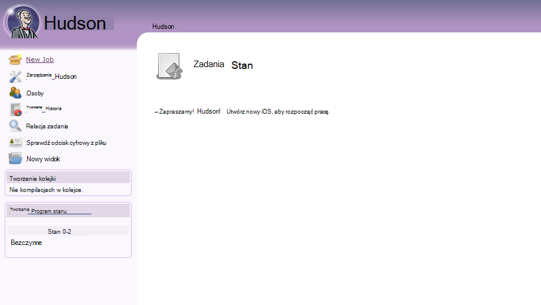
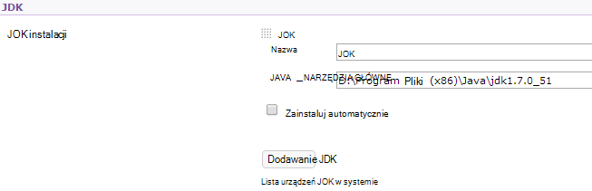
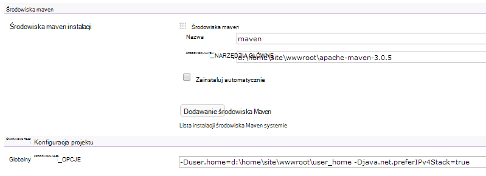

<properties 
    pageTitle="Przekazać niestandardową aplikację sieci web Java Azure" 
    description="Tym samouczku pokazano, jak przekazać niestandardową aplikację sieci web Java do Azure aplikacji usługi sieci Web." 
    services="app-service\web" 
    documentationCenter="java" 
    authors="rmcmurray" 
    manager="wpickett" 
    editor=""/>

<tags 
    ms.service="app-service-web" 
    ms.workload="web" 
    ms.tgt_pltfrm="na" 
    ms.devlang="Java" 
    ms.topic="article" 
    ms.date="08/11/2016" 
    ms.author="robmcm"/>

# Przekazać niestandardową aplikację sieci web Java Azure

W tym temacie wyjaśniono, jak przekazać niestandardową aplikację sieci web Java do [Usługa Azure aplikacji] Web Apps. Zawiera informacje, które dotyczą dowolnej aplikacji sieci web lub witrynie sieci Web języka Java, a także kilka przykładów dla określonej aplikacji.

Należy zauważyć, że Azure przedstawiono sposób tworzenia aplikacji sieci web języka Java za pomocą interfejsu użytkownika konfiguracji Azure Portal i usługi Azure Marketplace opisane na [Tworzenie aplikacji sieci web języka Java w usłudze Azure aplikacji](web-sites-java-get-started.md). Ten samouczek dotyczy scenariusze, w których nie chcesz używać konfiguracji Azure Portal interfejsu użytkownika lub Azure Marketplace.  

## Wskazówki dotyczące konfigurowania

Poniżej opisano ustawienia oczekiwany niestandardowe aplikacje sieci web Java Azure.

- Port HTTP, używany przez proces Java jest dynamicznie przypisywany.  Proces, należy użyć portu zmiennej środowiska `HTTP_PLATFORM_PORT`.
- Wszystkie porty słuchać oprócz jednej odbiornika protokołu HTTP powinna być wyłączona.  W Tomcat, który zawiera zamknięcia, HTTPS i AJP porty.
- Kontener musi być skonfigurowany tylko ruchu IPv4.
- Polecenie **uruchamiania** aplikacji musi być ustawiona w konfiguracji.
- Aplikacje, które wymagają katalogów z Napisz potrzebę uprawnienie znajdować się w katalogu zawartości aplikacji sieci web Azure, który jest **D:\home**.  Zmienna środowiska `HOME` odwołuje się do D:\home.  

W pliku web.config, można ustawić zmienne środowiska odpowiednio do potrzeb.

## Konfiguracja httpPlatform Web.config

Poniżej opisano format **httpPlatform** w web.config.
                                 
**argumenty** (Domyślny = ""). Argumenty plik wykonywalny lub skrypt określony w ustawieniach **processPath** .

Przykłady (jak pokazano z **processPath** dostępny):

    processPath="%HOME%\site\wwwroot\bin\tomcat\bin\catalina.bat"
    arguments="start"
    
    processPath="%JAVA_HOME\bin\java.exe"
    arguments="-Djava.net.preferIPv4Stack=true -Djetty.port=%HTTP\_PLATFORM\_PORT% -Djetty.base=&quot;%HOME%\site\wwwroot\bin\jetty-distribution-9.1.0.v20131115&quot; -jar &quot;%HOME%\site\wwwroot\bin\jetty-distribution-9.1.0.v20131115\start.jar&quot;"

**processPath** - ścieżka do plik wykonywalny lub skrypt, który spowoduje uruchomienie procesu wykrywanie żądania HTTP.

Przykłady:

    processPath="%JAVA_HOME%\bin\java.exe"

    processPath="%HOME%\site\wwwroot\bin\tomcat\bin\startup.bat"

    processPath="%HOME%\site\wwwroot\bin\tomcat\bin\catalina.bat"
                                                                                       
**rapidFailsPerMinute** (Domyślny = 10.) Liczba procesu określonego w **processPath** może awarie minutę. Jeśli ten limit zostanie przekroczony, **HttpPlatformHandler** przestanie uruchamiania procesu pozostałą część minuty.
                                    
**requestTimeout** (Domyślny = "00: 02:00".) Czas trwania, dla którego **HttpPlatformHandler** będzie czekać na odpowiedzi od procesu nasłuchują na `%HTTP_PLATFORM_PORT%`.

**startupRetryCount** (Domyślny = 10.) Liczba **HttpPlatformHandler** próbuje uruchomić proces określonego w **processPath**. Zobacz **startupTimeLimit** , aby uzyskać więcej informacji.

**startupTimeLimit** (Domyślny = 10 sekund.) Okres, dla którego **HttpPlatformHandler** będzie czekać na plik wykonywalny skrypt, aby uruchomić proces nasłuchują na porcie.  Jeśli ten limit czasu zostanie przekroczony, **HttpPlatformHandler** skasować proces i spróbuj uruchomić go ponownie **startupRetryCount** razy.
                                                                                      
**stdoutLogEnabled** (Domyślny = "true".) Jeśli ma wartość PRAWDA, **stdout** i **stderr** procesu określonego w ustawieniu **processPath** zostaną przekierowane do pliku określonego w **stdoutLogFile** (zobacz sekcja **stdoutLogFile** ).
                                    
**stdoutLogFile** (Default="d:\home\LogFiles\httpPlatformStdout.log".) Ścieżka pliku bezwzględne, dla którego **stdout** i **stderr** z określonym w **processPath** procesie będą rejestrowane.
                                    
> [AZURE.NOTE] `%HTTP_PLATFORM_PORT%`to specjalne symbolu zastępczego, który należy określić jako część **argumenty** lub jako część listy **environmentVariables** **httpPlatform** . Ten tekst zostanie zastąpiony przez port wewnętrznie generowane przez **HttpPlatformHandler** tak, aby określony **processPath** proces można nasłuchują na tym porcie.

## Wdrożenie

Aplikacji sieci web opartych na Java aplikacje web oparte można łatwo wdrożyć przez większość samej oznacza, że są używane z informacji usług internetowych.  FTP, cyfra i Kudu są obsługiwane jako mechanizmy wdrażania, tak jak zintegrowane funkcje Menedżer sterowania usługami aplikacji sieci web. Działa WebDeploy jako protokół, jednak zgodnie z języka Java nie jest opracowane w programie Visual Studio WebDeploy nie mieści się z przypadków użycia wdrażania aplikacji sieci web języka Java.

## Konfiguracja aplikacji przykładów

Dla następujących aplikacji, plik web.config i aplikacji konfiguracji ma postać przykłady, aby wyświetlić jak włączyć aplikacji Java na aplikacji sieci Web usługi.

### Tomcat
Istnieją dwie odmiany na Tomcat, które są dostarczane z aplikacji sieci Web usługi, nadal jest bardzo możliwe przekazywanie określone wystąpienia klienta. Poniżej przedstawiono przykładowy instalację Tomcat z innego języka Java maszyn wirtualnych (maszyny wirtualnej Java).

    <?xml version="1.0" encoding="UTF-8"?>
    <configuration>
      <system.webServer>
        <handlers>
          <add name="httpPlatformHandler" path="*" verb="*" modules="httpPlatformHandler" resourceType="Unspecified" />
        </handlers>
        <httpPlatform processPath="%HOME%\site\wwwroot\bin\tomcat\bin\startup.bat" 
            arguments="">
          <environmentVariables>
            <environmentVariable name="CATALINA_OPTS" value="-Dport.http=%HTTP_PLATFORM_PORT%" />
            <environmentVariable name="CATALINA_HOME" value="%HOME%\site\wwwroot\bin\tomcat" />
            <environmentVariable name="JRE_HOME" value="%HOME%\site\wwwroot\bin\java" /> <!-- optional, if not specified, this will default to %programfiles%\Java -->
            <environmentVariable name="JAVA_OPTS" value="-Djava.net.preferIPv4Stack=true" />
          </environmentVariables>
        </httpPlatform>
      </system.webServer>
    </configuration>

Na tej stronie Tomcat istnieje kilka zmian w konfiguracji, które należy wykonać. Server.xml musi być edytowane, aby ustawić:

-   Zamknięcie portu = -1
-   Port łącznik HTTP = ${port.http}
-   Adres łącznika HTTP = "127.0.0.1"
-   Komentarz HTTPS i AJP łączników
-   Ustawienia protokołu IPv4 można także ustawić w pliku catalina.properties, w którym można dodać`java.net.preferIPv4Stack=true`
    
Direct3d połączeń nie są obsługiwane w aplikacji sieci Web usługi. Aby wyłączyć te, dodaj następującą opcję Java aplikacji powinny sprawić, takie połączenia:`-Dsun.java2d.d3d=false`

### Molo

Tak jak w przypadku dla Tomcat, klienci przekazać swoje własne wystąpienia dla molo. W przypadku uruchamiania pełnej instalacji molo, konfiguracji będzie miała następującą postać:

    <?xml version="1.0" encoding="UTF-8"?>
    <configuration>
      <system.webServer>
        <handlers>
          <add name="httppPlatformHandler" path="*" verb="*" modules="httpPlatformHandler" resourceType="Unspecified" />
        </handlers>
        <httpPlatform processPath="%JAVA_HOME%\bin\java.exe" 
             arguments="-Djava.net.preferIPv4Stack=true -Djetty.port=%HTTP_PLATFORM_PORT% -Djetty.base=&quot;%HOME%\site\wwwroot\bin\jetty-distribution-9.1.0.v20131115&quot; -jar &quot;%HOME%\site\wwwroot\bin\jetty-distribution-9.1.0.v20131115\start.jar&quot;"
            startupTimeLimit="20"
          startupRetryCount="10"
          stdoutLogEnabled="true">
        </httpPlatform>
      </system.webServer>
    </configuration>

Konfiguracja molo trzeba zmienić w start.ini, aby ustawić `java.net.preferIPv4Stack=true`.

### Springboot
Aby można było uzyskiwać Springboot aplikacja zostanie trzeba przekazać plik SŁOIK lub też i Dodaj następujący plik web.config. Plik web.config przechodzi w folderze wwwroot. W pliku web.config dostosować argumenty wskaż plik SŁOIK, w poniższym przykładzie, w którym plik SŁOIK znajduje się w tym folderze wwwroot.  

    <?xml version="1.0" encoding="UTF-8"?>
    <configuration>
      <system.webServer>
        <handlers>
          <add name="httpPlatformHandler" path="*" verb="*" modules="httpPlatformHandler" resourceType="Unspecified" />
        </handlers>
        <httpPlatform processPath="%JAVA_HOME%\bin\java.exe"
            arguments="-Djava.net.preferIPv4Stack=true -Dserver.port=%HTTP_PLATFORM_PORT% -jar &quot;%HOME%\site\wwwroot\my-web-project.jar&quot;">
        </httpPlatform>
      </system.webServer>
    </configuration>

### Hudson

Nasze test używany też Hudson 3.1.2 i domyślne wystąpienie Tomcat 7.0.50, ale bez przeprowadzania konfiguracji za pomocą interfejsu użytkownika.  Ponieważ Hudson jest narzędzie do tworzenia oprogramowania, zaleca się zainstalować go na dedykowane wystąpienia, w której można ustawić flagę **(AlwaysOn)** w aplikacji sieci web.

1. W katalogu głównym aplikacji sieci web, to znaczy **d:\home\site\wwwroot**, Utwórz katalog **Używanie** (o ile nie zostały dodane), a następnie umieść Hudson.war w **d:\home\site\wwwroot\webapps**.
2. Pobierz apache środowiska maven 3.0.5 (zgodne z Hudson) i umieszczanie go w **d:\home\site\wwwroot**.
3. Tworzenie web.config w **d:\home\site\wwwroot** i wklej następujące zagadnienia:
    
        <?xml version="1.0" encoding="UTF-8"?>
        <configuration>
          <system.webServer>
            <handlers>
              <add name="httppPlatformHandler" path="*" verb="*" 
        modules="httpPlatformHandler" resourceType="Unspecified" />
            </handlers>
            <httpPlatform processPath="%AZURE_TOMCAT7_HOME%\bin\startup.bat"
        startupTimeLimit="20"
        startupRetryCount="10">
        <environmentVariables>
          <environmentVariable name="HUDSON_HOME" 
        value="%HOME%\site\wwwroot\hudson_home" />
          <environmentVariable name="JAVA_OPTS" 
        value="-Djava.net.preferIPv4Stack=true -Duser.home=%HOME%/site/wwwroot/user_home -Dhudson.DNSMultiCast.disabled=true" />
        </environmentVariables>            
            </httpPlatform>
          </system.webServer>
        </configuration>

    Na tym etapie można ponownie uruchomić aplikacji sieci web, zostały wprowadzone zmiany.  Połącz ze http://yourwebapp/hudson zacząć Hudson.

4. Po Hudson konfiguruje dla siebie, powinien zostać wyświetlony ekran następujące czynności:

    
    
5. Dostęp do strony konfiguracji Hudson: kliknij pozycję **Zarządzaj Hudson**, a następnie kliknij **Skonfigurować System**.
6. Konfigurowanie JDK, tak jak pokazano poniżej:

    

7. Konfigurowanie środowiska Maven, tak jak pokazano poniżej:

    

8. Zapisz ustawienia. Hudson powinien być teraz skonfigurowana i gotowa do użycia.

Aby uzyskać dodatkowe informacje na temat Hudson zobacz [http://hudson-ci.org](http://hudson-ci.org).

### Liferay

Liferay jest obsługiwana w aplikacji sieci Web usługi. Ponieważ Liferay może wymagać znacznej pamięci, aplikacji sieci web musi obsługiwać na średnich i dużych dedykowane pracownikiem, które zapewniają miejsca. Liferay również trwa kilka minut w celu otwarcia. Z tego powodu zaleca się ustawianie aplikacji sieci web do **Zawsze włączone**.  

Następujące pliki z Tomcat przy użyciu Liferay 6.1.2, którego połączone GA3 Edition społeczności, były edytowane po pobraniu Liferay:

**Server.XML**

- Zmień port zamknięcia -1.
- Zmienianie HTTP łącznika do      `<Connector port="${port.http}" protocol="HTTP/1.1" connectionTimeout="600000" address="127.0.0.1" URIEncoding="UTF-8" />`
- Komentarz łącznik AJP.

W folderze **liferay\tomcat-7.0.40\webapps\ROOT\WEB-INF\classes** Utwórz plik o nazwie **ext.properties portalu**. Ten plik musi zawierać jeden wiersz, jak pokazano poniżej:

    liferay.home=%HOME%/site/wwwroot/liferay

Na tym samym poziomie katalogu folderowi tomcat 7.0.40 Utwórz plik o nazwie **web.config** o następującej treści:

    <?xml version="1.0" encoding="UTF-8"?>
    <configuration>
      <system.webServer>
        <handlers>
    <add name="httpPlatformHandler" path="*" verb="*"
         modules="httpPlatformHandler" resourceType="Unspecified" />
        </handlers>
        <httpPlatform processPath="%HOME%\site\wwwroot\tomcat-7.0.40\bin\catalina.bat" 
                      arguments="run" 
                      startupTimeLimit="10" 
                      requestTimeout="00:10:00" 
                      stdoutLogEnabled="true">
          <environmentVariables>
      <environmentVariable name="CATALINA_OPTS" value="-Dport.http=%HTTP_PLATFORM_PORT%" />
      <environmentVariable name="CATALINA_HOME" value="%HOME%\site\wwwroot\tomcat-7.0.40" />
            <environmentVariable name="JRE_HOME" value="D:\Program Files\Java\jdk1.7.0_51" /> 
            <environmentVariable name="JAVA_OPTS" value="-Djava.net.preferIPv4Stack=true" />
          </environmentVariables>
        </httpPlatform>
      </system.webServer>
    </configuration>

W obszarze Blokuj **httpPlatform** **requestTimeout** jest ustawiona na "00: 10:00".  Może być ograniczona, ale to może powodować wyświetlanie błędy Przekroczono limit czasu podczas ładowania jest Liferay.  Jeśli wartość ta zostanie zmieniona, następnie **connectionTimeout** w tomcat server.xml należy również zmienić.  

Warto zauważyć, że JRE_HOME environnment varariable jest określony w web.config powyżej, aby wskazywały JDK 64-bitowej. Wartość domyślna to 32-bitowej, ale ponieważ Liferay może wymagać wysokiego poziomu pamięci, zaleca się używanie JDK 64-bitowej.

Po wprowadzeniu tych zmian, ponownie uruchom aplikację sieci web z Liferay, następnie należy otworzyć http://yourwebapp. Liferay portal jest dostępny na poziomie głównym aplikacji sieci web. 

## Następne kroki

Aby uzyskać więcej informacji o Liferay zobacz [http://www.liferay.com](http://www.liferay.com).

Aby uzyskać więcej informacji na temat języka Java zobacz [Centrum deweloperów języka Java](/develop/java/).

[AZURE.INCLUDE [app-service-web-whats-changed](../../includes/app-service-web-whats-changed.md)]

[AZURE.INCLUDE [app-service-web-try-app-service](../../includes/app-service-web-try-app-service.md)]
 
 
<!-- External Links -->
[Azure aplikacji usługi]: http://go.microsoft.com/fwlink/?LinkId=529714
