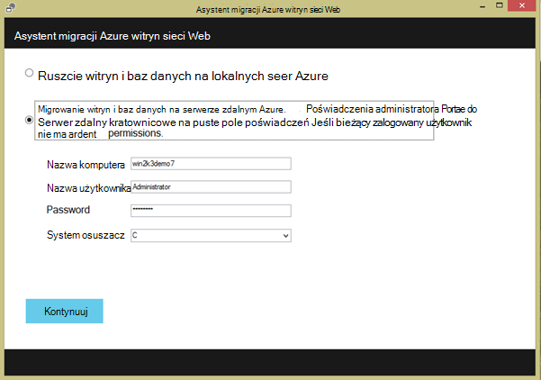

<properties 
    pageTitle="Migrowanie aplikacji sieci web programu enterprise do Azure aplikacji usługi" 
    description="Pokazuje, jak za pomocą Asystenta migracji aplikacji sieci Web szybko przeprowadzić migrację istniejącej witryny sieci Web usług IIS do Azure aplikacji usługi sieci Web" 
    services="app-service" 
    documentationCenter="" 
    authors="cephalin" 
    writer="cephalin" 
    manager="wpickett" 
    editor=""/>

<tags 
    ms.service="app-service" 
    ms.workload="na" 
    ms.tgt_pltfrm="na" 
    ms.devlang="na" 
    ms.topic="article" 
    ms.date="07/01/2016" 
    ms.author="cephalin"/>

# Migrowanie aplikacji sieci web programu enterprise do Azure aplikacji usługi

Możesz łatwo przeprowadzić migrację z istniejącej witryny sieci Web uruchomienia na Internet Information Service (IIS) 6 lub nowszego, aby [Aplikacji sieci Web usługi](http://go.microsoft.com/fwlink/?LinkId=529714). 

>[AZURE.IMPORTANT] Windows Server 2003 z Tobą Zakończenie wsparcia na 14 lipca 2015 r. Jeśli obecnie przechowujesz Twojej witryny sieci Web na serwerze usług IIS to Windows Server 2003, aplikacji sieci Web jest niskiego ryzyka, kosztach, i sposobem niskim tarcia zachowania witrynami sieci Web usługi online i Asystenta migracji aplikacji sieci Web mogą pomóc zautomatyzować procesu migracji za Ciebie. 

[Asystenta migracji aplikacji sieci Web](https://www.movemetothecloud.net/) można analizować instalacji serwera IIS, które witryny, możesz przeprowadzić migrację do usługi aplikacji, wyróżnianie elementów, których nie można migrować lub są obsługiwane na platformie, a następnie migrowania witryn sieci Web i skojarzone bazy danych usługi Azure.

[AZURE.INCLUDE [app-service-web-to-api-and-mobile](../../includes/app-service-web-to-api-and-mobile.md)]

## Elementy zweryfikowana podczas analizy zgodności ##
Asystent migracji tworzy raport gotowości do identyfikowania wszelkie potencjalne przyczyny dotyczą lub blokowania problemy, które mogą utrudnić pomyślną migrację z lokalnego programu IIS do Azure aplikacji usługi sieci Web. Niektóre z najważniejszych elementów obowiązujących są:

-   Port powiązań — Web Apps obsługuje tylko Port 80 HTTP i 443 portów dla ruchu HTTPS. Inny port konfiguracje będą ignorowane i ruch będą kierowane do 80 i 443. 
-   Uwierzytelnianie — Web Apps obsługuje uwierzytelnianie anonimowe domyślnie i uwierzytelniania formularzy określone przez aplikację. Uwierzytelnianie systemu Windows mogą być używane przez integracji z usługi Azure Active Directory i ADFS tylko. Wszystkie inne formy uwierzytelniania — na przykład uwierzytelnianie podstawowe — nie są obecnie obsługiwane. 
-   Globalnej pamięci podręcznej zestawów (GAC) — globalnej pamięci podręcznej zestawu nie jest obsługiwane w aplikacjach sieci Web. Aplikacja odwołuje się do zespołów, które zwykle Wdroż globalnej pamięci podręcznej zestawu, należy wdrożyć do folderu bin aplikacji w aplikacjach sieci Web. 
-   Usług IIS5 Tryb zgodności — nie jest to obsługiwane w aplikacjach sieci Web. 
-   Uruchamianie puli aplikacji — w aplikacjach sieci Web, każdej witryny i jej aplikacji podrzędnych w tej samej puli aplikacji. Jeśli witryna ma wiele aplikacji podrzędnych korzystanie z wielu pul aplikacji, konsolidowanie je do jednej puli aplikacji przy użyciu ustawień typowych lub migrowania każdej aplikacji do aplikacji sieci web w osobnym.
-   Składniki COM — aplikacje sieci Web nie jest możliwe rejestracji składników COM na platformie. Jeśli Twojej witryny sieci Web lub aplikacji za pomocą składników COM, musisz ponownie je wpisać kod zarządzany i wdrażanie ich z witryny internetowej lub aplikacji.
-   Filtry ISAPI — aplikacje sieci Web może obsługiwać stosowania filtrów ISAPI. Należy wykonać następujące czynności:
    -   Wdrażanie dll przy użyciu aplikacji sieci web 
    -   Zarejestruj się w bibliotekach DLL, przy użyciu [Web.config](http://www.iis.net/configreference/system.webserver/isapifilters)
    -   Umieść plik applicationHost.xdt w katalogu głównym witryny o zawartości poniżej:

            <?xml version="1.0"?>
            <configuration xmlns:xdt="http://schemas.microsoft.com/XML-Document-Transform">
            <configSections>
                <sectionGroup name="system.webServer">
                  <section name="isapiFilters" xdt:Transform="SetAttributes(overrideModeDefault)" overrideModeDefault="Allow" />
                </sectionGroup>
              </configSections>
            </configuration>

        Więcej przykładów sposobu użycia przekształcenia dokumentu XML z witryną sieci Web zobacz [Przekształcanie witryny sieci Web usługi Microsoft Azure](http://blogs.msdn.com/b/waws/archive/2014/06/17/transform-your-microsoft-azure-web-site.aspx).

-   Inne składniki, takich jak program SharePoint, rozszerzenia serwera FrontPage (FPSE), FTP, nie zostaną objęte migracją certyfikatów SSL.

## Jak za pomocą Asystenta migracji aplikacji sieci Web ##
Kroki od tej sekcji do przykładu, aby przeprowadzić migrację kilka witryn sieci Web używające bazy danych programu SQL Server i uruchomione na komputerze systemu Windows Server 2003 R2 (IIS 6.0) w wersji lokalnej:

1.  Na serwerze usług IIS lub komputerze klienta przejdź do [https://www.movemetothecloud.net/](https://www.movemetothecloud.net/) 

    

2.  Zainstaluj Asystenta migracji aplikacji sieci Web, klikając przycisk **Dedykowany serwer usług IIS** . Więcej opcji będą opcje w najbliższej przyszłości. 
4.  Kliknij przycisk **Zainstaluj narzędzie** , aby zainstalować Asystenta migracji aplikacji sieci Web na komputerze.

    

    >[AZURE.NOTE] Możesz również kliknąć pozycję **Pobierz dla instalacji trybu offline** do pobrania pliku ZIP dotyczące instalowania na serwerach nie jest połączony z Internetem. Lub możesz kliknąć pozycję **Przekaż istniejący raport gotowości do migracji**, czyli zaawansowanych opcji do pracy z istniejącego migracji gotowości do raportu, który został już wygenerowany (omówienie później).

5.  Na ekranie **Instalacja aplikacji** kliknij pozycję **Zainstaluj** , aby zainstalować na komputerze. Będzie również zainstalować odpowiadające im zależności, takich jak wdrożyć sieci Web, DacFX i usług IIS, w razie potrzeby. 

    

    Po zainstalowaniu Asystenta migracji aplikacji sieci Web jest automatycznie uruchamiany.
  
6.  Wybierz pozycję **Migrowanie witryn i baz danych na serwerze zdalnym Azure**. Wprowadź poświadczenia administracyjne dla serwera zdalnego i kliknij przycisk **Kontynuuj**. 

    

    Oczywiście można przeprowadzić migrację z lokalnego serwera. Opcja zdalnego jest przydatny, gdy chcesz przeprowadzić migrację witryny sieci Web na serwerze usług IIS produkcji.
 
    W tym momencie Przeprowadź inspekcję narzędzia do migracji konfiguracji serwera programu IIS, takich jak witryny, aplikacje puli aplikacji i zależności do identyfikowania candidate witryn sieci Web do migracji. 

8.  Zrzut ekranu poniżej przedstawiono trzy witryny sieci Web — **Domyślna witryna sieci Web**, **TimeTracker**i **CommerceNet4**. Każdy z nich ma powiązanej bazy danych, który chcemy przeprowadzić migrację. Zaznacz wszystkie witryny, które chcesz oceny, a następnie kliknij przycisk **Dalej**.

    
 
9.  Kliknij przycisk **Przekaż** , aby przekazać Raport gotowości. Kliknięcie przycisku **Zapisz plik lokalnie**, możesz później uruchamianie narzędzia do migracji i przekaż Raport gotowości zapisany, jak wspomniano wcześniej.

    
 
    Po przesłaniu Raport gotowości Azure wykonuje analizy gotowości i wyniki zostaną wyświetlone. Przeczytaj informacje oceny dla każdej witryny sieci Web i upewnij się, czy opis lub usunąć wszystkie problemy przed kontynuowaniem. 
 
    

12. Kliknij pozycję **Rozpocznij migracji** zacząć migracji. Nastąpi przekierowanie do Azure, aby zalogować się do swojego konta. Należy pamiętać, że zalogowanie się przy użyciu konta, które ma aktywną subskrypcję Azure. Jeśli nie masz konta usługi Azure następnie możesz zalogować do bezpłatnej wersji próbnej [tutaj](https://azure.microsoft.com/pricing/free-trial/?WT.srch=1&WT.mc_ID=SEM_). 

13. Wybierz konta dzierżawy, Azure subskrypcji i region, do którego używanie aplikacji migracją Azure sieci web i baz danych, a następnie kliknij **Rozpocznij migrację**. Możesz wybrać witryny, aby przeprowadzić migrację później.

    

14. Na następnym ekranie zostanie można wprowadzić zmiany do migracji ustawień domyślnych, takich jak:

    - Użyj istniejącej bazy danych SQL Azure lub Utwórz nową bazę danych SQL Azure i skonfigurować swoje poświadczenia
    - Wybierz pozycję witryny sieci Web do migrowania
    - Definiowanie nazw dla aplikacji sieci web Azure i ich połączonej bazy danych SQL
    - Dostosowywanie ustawień globalnych i ustawień na poziomie witryny

    Zrzut ekranu poniżej pokazano wszystkich witryn sieci Web zaznaczona do migracji z ustawieniami domyślnymi.

    

    >[AZURE.NOTE] pole wyboru **Włącz usługi Azure Active Directory** w ustawieniach niestandardowej aplikacji sieci Azure web można zintegrować z [Usługi Azure Active Directory](active-directory-whatis.md) ( **Katalog domyślne**). Aby uzyskać więcej informacji na synchronizacji usługi Azure Active Directory z usługą Active Directory w wersji lokalnej zobacz [Integracja katalogów](http://msdn.microsoft.com/library/jj573653).

16.  Gdy wprowadzisz wszystkie żądane zmiany, kliknij przycisk **Utwórz** , aby rozpocząć proces migracji. Narzędzia do migracji tworzenie bazy danych SQL Azure i Azure web app, a potem publikować zawartość witryny sieci Web i baz danych. Postęp migracji wyraźnie są wyświetlane w narzędziu do migracji, a zostanie wyświetlony ekran podsumowania na końcu szczegóły migracji witryn, czy zostały pomyślnie, odwołuje się do aplikacji web Azure nowo utworzone. 

    Jeśli jakiś błąd występuje podczas migracji, narzędzia do migracji wyraźnie wskaże błąd i wycofywania zmian. Ponadto można wysłać raport o błędach bezpośrednio do zespołu inżynierów, klikając przycisk **Wyślij raport o błędach** , stos wywołań przechwycony błąd i tworzyć treść wiadomości. 

    

    Jeśli migracja zakończyło się powodzeniem bez błędów, można również kliknij przycisk **Wyrażanie opinii** o podanie opinię bezpośrednio. 
 
20. Kliknij łącza, aby aplikacje Azure web i sprawdź, czy migracja powiodła się.

21. Teraz można zarządzać aplikacji migracją sieci web w usłudze Azure aplikacji. Aby to zrobić, zaloguj się do usługi [Azure Portal](https://portal.azure.com).

22. Azure Portal otwórz karta aplikacji sieci Web, aby wyświetlić serwisach migracją (wyświetlane jako aplikacje sieci web), a następnie kliknij jeden z nich, aby rozpocząć zarządzanie aplikacji sieci web, takich jak konfigurowanie ciągły publikowania, tworzenie kopii zapasowych, autoscaling i monitorowania zastosowania lub wydajności.

    

>[AZURE.NOTE] Jeśli chcesz rozpocząć pracę z Azure aplikacji usługi przed utworzeniem konta dla konta Azure, przejdź do [Spróbuj aplikacji usługi](http://go.microsoft.com/fwlink/?LinkId=523751), którym natychmiast można utworzyć aplikację sieci web krótkotrwałe starter w aplikacji usługi. Nie kart kredytowych wymagane; nie zobowiązania.

## Informacje o zmianach
* Przewodnika do zmiany z witryn sieci Web do usługi aplikacji Zobacz: [Usługa Azure aplikacji i jego wpływ na istniejące usługi Azure](http://go.microsoft.com/fwlink/?LinkId=529714)
 
