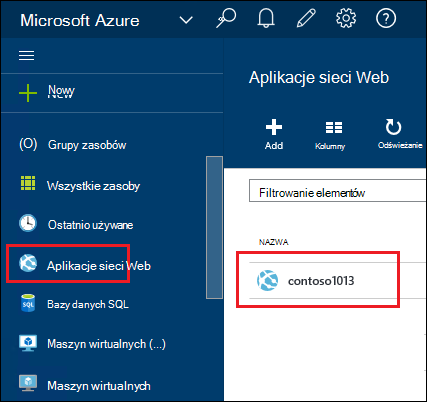
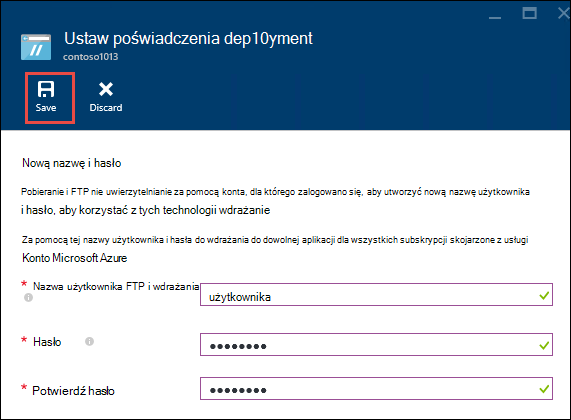
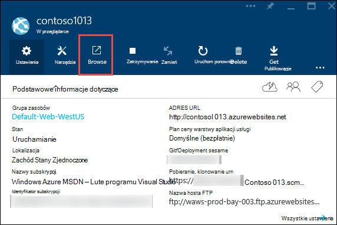
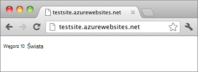

<properties
    pageTitle="Tworzenie aplikacji sieci web Node.js w usłudze Azure aplikacji | Microsoft Azure"
    description="Dowiedz się, jak wdrożyć aplikację Node.js do aplikacji sieci web w usłudze Azure aplikacji."
    services="app-service\web"
    documentationCenter="nodejs"
    authors="rmcmurray"
    manager="wpickett"
    editor=""/>

<tags
    ms.service="app-service-web"
    ms.workload="web"
    ms.tgt_pltfrm="na"
    ms.devlang="nodejs"
    ms.topic="hero-article"
    ms.date="08/11/2016"
    ms.author="robmcm"/>

# Tworzenie aplikacji sieci web Node.js Azure aplikacji usługi

> [AZURE.SELECTOR]
- [.NET](web-sites-dotnet-get-started.md)
- [Node.js](web-sites-nodejs-develop-deploy-mac.md)
- [Java](web-sites-java-get-started.md)
- [PHP - cyfra](web-sites-php-mysql-deploy-use-git.md)
- [PHP - FTP](web-sites-php-mysql-deploy-use-ftp.md)
- [Python](web-sites-python-ptvs-django-mysql.md)

Ten samouczek przedstawiono sposób tworzenia prostej aplikacji [Node.js](http://nodejs.org) i wdrożyć go w [Usłudze Azure aplikacji](../app-service/app-service-value-prop-what-is.md) [web app](app-service-web-overview.md) przy użyciu [cyfra](http://git-scm.com). Z instrukcjami podanymi w tym samouczku mogą występować we wszystkich systemach operacyjnych, który jest możliwe uruchamianie Node.js.

Opisano następujące zagadnienia:

* Jak utworzyć aplikację sieci web w usłudze Azure aplikacji przy użyciu Azure Portal.
* Jak wdrożyć aplikację Node.js do aplikacji sieci web przez naciśnięcie do repozytorium cyfra aplikacji sieci web.

Wypełniony wniosek zapisuje krótki ciąg "Witaj świecie" do przeglądarki.

![Przeglądarki z komunikatem "Witaj świecie".][helloworld-completed]

Samouczki i przykładowy kod z bardziej złożonych aplikacji Node.js lub inne tematy dotyczące sposobu używania Node.js platformy Azure zobacz [Centrum deweloperów Node.js](/develop/nodejs/).

> [AZURE.NOTE]
> Aby użyć tego samouczka, potrzebne jest konto Microsoft Azure. Jeśli nie masz konta, możesz [uaktywnić programu Visual Studio subskrybentów korzyści](/en-us/pricing/member-offers/msdn-benefits-details/?WT.mc_id=A261C142F) lub [Utwórz konto w bezpłatnej wersji próbnej](/en-us/pricing/free-trial/?WT.mc_id=A261C142F).
>
> Jeśli chcesz rozpocząć pracę z Azure aplikacji usługi, aby utworzyć konto Azure, przejdź do [Spróbuj aplikacji usługi](http://go.microsoft.com/fwlink/?LinkId=523751). Od razu można utworzyć aplikację sieci web krótkotrwałe starter w aplikacji usługi — karty kredytowej wymagane i nie zobowiązań.

## Tworzenie aplikacji sieci web i włączenia publikowania cyfra

Wykonaj poniższe czynności, aby utworzyć aplikację sieci web w usłudze Azure aplikacji i włączenia publikowania cyfra. 

[Cyfra](http://git-scm.com/) jest system kontroli rozłożone wersję używanego do wdrożenia witryny sieci Web Azure. Będą przechowywane tworzonego dla aplikacji sieci web w lokalnym repozytorium cyfra kodu i będzie wdrażanie kodu Azure przez naciśnięcie zdalnego repozytorium. Ta metoda wdrażania jest funkcją aplikacji usługi aplikacji sieci web.  

1. Zaloguj się do [portalu Azure](https://portal.azure.com).

2. Kliknij ikonę **+ Nowa** w górnym lewym rogu Azure Portal.

3. Kliknij pozycję **Web + Mobile**, a następnie kliknij **aplikacji sieci Web**.

    ![][portal-quick-create]

4. Wprowadź nazwę dla aplikacji sieci web w polu **aplikacji sieci Web** .

    Ta nazwa musi być unikatowa w domenie azurewebsites.net, ponieważ adres URL aplikacji sieci web będzie {nazwa}. azurewebsites.net. Jeśli wprowadzona nazwa nie jest unikatowy, czerwony wykrzyknik pojawi się w polu tekstowym.

5. Wybierz **subskrypcję**.

6. Wybierz **Grupę zasobów** lub Utwórz nowy.

    Aby uzyskać więcej informacji dotyczących grup zasobów zobacz [Omówienie Menedżera zasobów Azure](../azure-resource-manager/resource-group-overview.md).

7. Wybierz **Plan i lokalizacja usługi aplikacji** lub Utwórz nowy.

    Aby uzyskać więcej informacji o planach usługi aplikacji zobacz [Omówienie planów Azure aplikacji usługi](../azure-web-sites-web-hosting-plans-in-depth-overview.md)

8. Kliknij przycisk **Utwórz**.
   
    ![][portal-quick-create2]

    Na chwilę, zwykle mniej niż minuta Azure kończy się tworzenie nowej aplikacji sieci web.

9. Kliknij pozycję **sieci Web aplikacje > {nowej aplikacji sieci web}**.

    

10. W karta **aplikacji sieci Web** kliknij część **wdrożenia** .

    ![][deployment-part]

11. W karta **Ciągły wdrażania** kliknij przycisk **Wybierz źródło**

12. Kliknij **Lokalnego repozytorium cyfra**, a następnie kliknij **przycisk OK**.

    ![][setup-git-publishing]

13. Skonfiguruj poświadczenia wdrożenia, jeśli jeszcze tego nie zrobiono.

    . Karta aplikacji sieci Web, kliknij **Ustawienia > poświadczenia wdrożenia**.

    ![][deployment-credentials]
 
    b. Tworzenie nazwy użytkownika i hasła. 
    
    

14. W karta aplikacji sieci Web kliknij pozycję **Ustawienia**, a następnie kliknij polecenie **Właściwości**.
 
    Aby opublikować, będzie push zdalnego repozytorium cyfra. Adres URL repozytorium znajduje się pod **Adresem URL CYFRA**. Ten adres URL, które będą używane w dalszej części samouczka.

    ![][git-url]

## Tworzenie i testowanie aplikacji lokalnie

W tej sekcji utworzysz plik **server.js** , który zawiera nieco zmodyfikowaną wersję w przykładzie "Witaj świecie" z [nodejs.org]. Kod dodaje process.env.PORT jako port, aby odsłuchać na podczas pracy w aplikacji sieci web Azure.

1. Utwórz folder o nazwie *helloworld*.

2. Umożliwia utworzenie nowego pliku o nazwie **server.js** w katalogu *helloworld* edytora tekstów.

2. Skopiuj poniższy kod do pliku **server.js** , a następnie zapisz plik:

        var http = require('http')
        var port = process.env.PORT || 1337;
        http.createServer(function(req, res) {
          res.writeHead(200, { 'Content-Type': 'text/plain' });
          res.end('Hello World\n');
        }).listen(port);

3. Otwórz wiersz polecenia i użyj następującego polecenia, aby uruchomić aplikację sieci web lokalnie.

        node server.js

4. Otwórz przeglądarkę sieci web i przejdź do http://localhost:1337. 

    Strony sieci Web, w której są wyświetlane "Witaj świecie" pojawia się, jak pokazano w poniższej zrzut ekranu.

    ![Przeglądarki z komunikatem "Witaj świecie".][helloworld-localhost]

## Publikowanie aplikacji

1. Jeśli jeszcze tego nie zrobiono, zainstaluj cyfra.

    Instrukcje dotyczące instalacji dla posiadanej platformy zobacz [cyfra pobieranie strony](http://git-scm.com/download).

1. Z poziomu wiersza polecenia przejdź do katalogu **helloworld** katalogi i wpisz następujące polecenie, aby zainicjować lokalnego repozytorium cyfra.

        git init

2. Dodawanie plików do repozytorium, należy użyć następujących poleceń:

        git add .
        git commit -m "initial commit"

3. Dodaj cyfra zdalnego dla naciśnięcie aktualizacje do aplikacji sieci web utworzonej poprzednio, przy użyciu następującego polecenia:

        git remote add azure [URL for remote repository]

4. Przekazać zmiany do Azure za pomocą następującego polecenia:

        git push azure master

    Zostanie wyświetlony monit o podanie hasła utworzony wcześniej. Wynik jest podobny do następującego przykładu.

        Counting objects: 3, done.
        Delta compression using up to 8 threads.
        Compressing objects: 100% (2/2), done.
        Writing objects: 100% (3/3), 374 bytes, done.
        Total 3 (delta 0), reused 0 (delta 0)
        remote: New deployment received.
        remote: Updating branch 'master'.
        remote: Preparing deployment for commit id '5ebbe250c9'.
        remote: Preparing files for deployment.
        remote: Deploying Web.config to enable Node.js activation.
        remote: Deployment successful.
        To https://user@testsite.scm.azurewebsites.net/testsite.git
         * [new branch]      master -> master

5. Aby wyświetlić aplikacji, kliknij przycisk **Przeglądaj** w części **Aplikacji sieci Web** w portalu Azure.

    

    

## Publikowanie zmian w aplikacji

1. Otwórz plik **server.js** w edytorze tekstów i zmień "Witaj World\n" na "Witaj Azure\n". 

2. Zapisz plik.

2. Z poziomu wiersza polecenia przejdź do katalogu **helloworld** katalogów, a następnie uruchom następujące polecenia:

        git add .
        git commit -m "changing to hello azure"
        git push azure master

    Zostanie wyświetlony monit o podanie hasła ponownie.

3. Odśwież okno przeglądarki, która odwiedzone adres URL aplikacji sieci web.

    ![Strona sieci web "Witaj Azure"][helloworld-completed]

## Przywracanie wdrożeniu

Z karta **aplikacji sieci Web** możesz kliknąć pozycję **Ustawienia > ciągły wdrożenia** Aby wyświetlić historię wdrożenia w karta **wdrożenia** . Jeśli chcesz przywrócić wcześniejszych wdrożenia, możesz go zaznaczyć, a następnie kliknij **ponownie wdróż** w karta **Szczegółów wdrażania** .

## Następne kroki

Zostały wdrożyć aplikację Node.js do aplikacji sieci web w usłudze Azure aplikacji. Aby uzyskać więcej informacji na temat sposobu uruchamiania Node.js aplikacji w aplikacji usługi aplikacji sieci web, zobacz [Azure aplikacji usługi sieci Web: Node.js](http://blogs.msdn.com/b/silverlining/archive/2012/06/14/windows-azure-websites-node-js.aspx) i [Określanie wersji Node.js w aplikacji Azure](../nodejs-specify-node-version-azure-apps.md).

Node.js zawiera sformatowanego ekosystemu modułów, które mogą być używane przez aplikacje. Aby dowiedzieć się, jak działają aplikacje sieci Web w przypadku modułów, zobacz [Używanie Node.js moduły z aplikacjami Azure](../nodejs-use-node-modules-azure-apps.md).

Jeśli wystąpią problemy z aplikacją, po wdrożeniu Azure, zobacz [sposób debugowania aplikacji Node.js Azure aplikacji usługi](web-sites-nodejs-debug.md) uzyskać informacji na temat diagnozowania problemu.

W tym artykule użyto Azure Portal, aby utworzyć aplikację sieci web. Do wykonywania operacji, możesz używać [interfejsu wiersza polecenia Azure](../xplat-cli-install.md) lub [Azure programu PowerShell](../powershell-install-configure.md) .

Aby uzyskać więcej informacji na temat tworzenia aplikacji Node.js Azure, zobacz [Centrum deweloperów Node.js](/develop/nodejs/).

[helloworld-completed]: ./media/web-sites-nodejs-develop-deploy-mac/helloazure.png
[helloworld-localhost]: ./media/web-sites-nodejs-develop-deploy-mac/helloworldlocal.png
[portal-quick-create]: ./media/web-sites-nodejs-develop-deploy-mac/create-quick-website.png
[portal-quick-create2]: ./media/web-sites-nodejs-develop-deploy-mac/create-quick-website2.png
[setup-git-publishing]: ./media/web-sites-nodejs-develop-deploy-mac/setup_git_publishing.png
[go-to-dashboard]: ./media/web-sites-nodejs-develop-deploy-mac/go_to_dashboard.png
[deployment-part]: ./media/web-sites-nodejs-develop-deploy-mac/deployment-part.png
[deployment-credentials]: ./media/web-sites-nodejs-develop-deploy-mac/deployment-credentials.png
[git-url]: ./media/web-sites-nodejs-develop-deploy-mac/git-url.png
