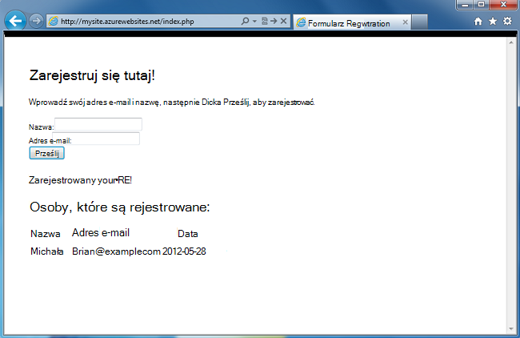
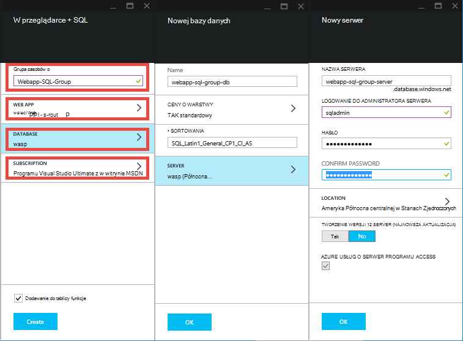
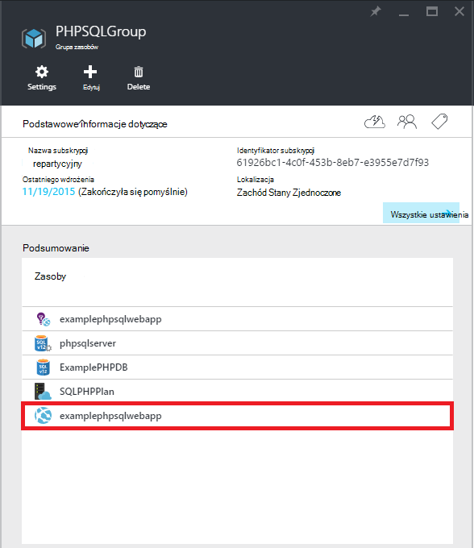
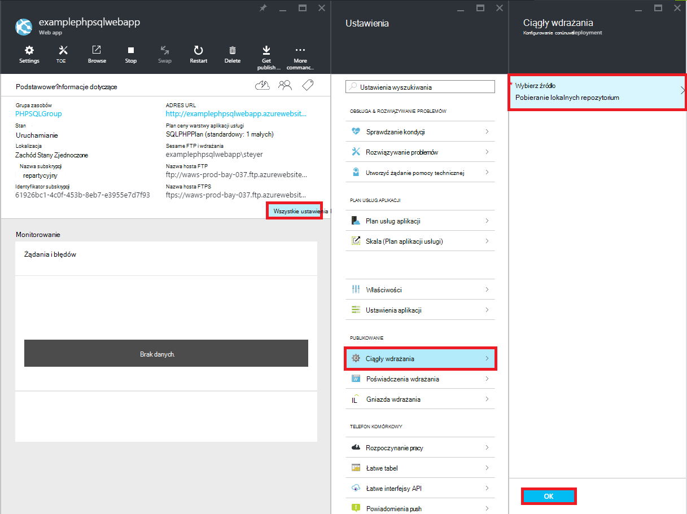
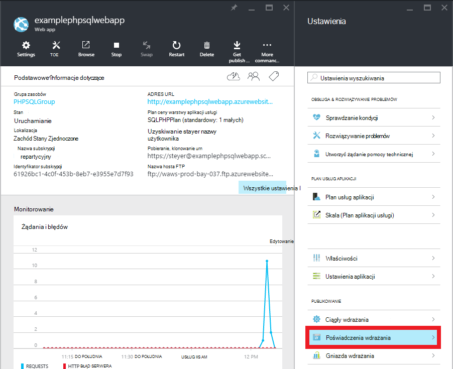
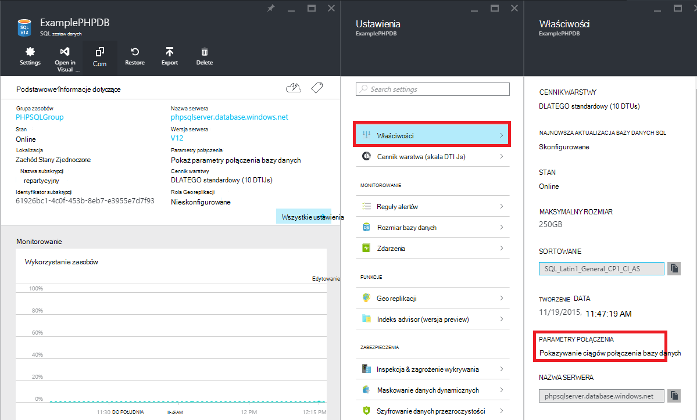

<properties 
    pageTitle="Tworzenie aplikacji sieci web PHP SQL i wdrażanie usługi aplikacji Azure za pomocą cyfra" 
    description="Samouczek, którego dowiesz się, jak utworzyć aplikację sieci web PHP, które są przechowywane dane w bazie danych SQL Azure i użyć cyfra rozmieszczania Azure aplikacji usługi." 
    services="app-service\web, sql-database" 
    documentationCenter="php" 
    authors="rmcmurray" 
    manager="wpickett" 
    editor=""/>

<tags 
    ms.service="app-service-web" 
    ms.workload="web" 
    ms.tgt_pltfrm="na" 
    ms.devlang="PHP" 
    ms.topic="article" 
    ms.date="08/11/2016" 
    ms.author="robmcm"/>

# Tworzenie aplikacji sieci web PHP SQL i wdrażanie usługi aplikacji Azure za pomocą cyfra

W tym samouczku pokazano, jak utworzyć aplikację sieci web PHP [Azure aplikacji usługi](http://go.microsoft.com/fwlink/?LinkId=529714) połączony z bazą danych SQL Azure i jak wdrożyć go przy użyciu cyfra. Tego samouczka przyjęto założenie, masz [PHP][install-php], [SQL Server Express][install-SQLExpress], [Sterowniki firmy Microsoft dla programu SQL Server dla PHP](http://www.microsoft.com/download/en/details.aspx?id=20098), a [cyfra] [ install-git] zainstalowany na Twoim komputerze. Po wykonaniu tego przewodnika, konieczne będzie aplikacji sieci web PHP SQL Azure działa.

> [AZURE.NOTE]
> Można zainstalować i skonfigurować PHP, SQL Server Express i Drivers firmy Microsoft dla programu SQL Server dla PHP za pomocą [Instalatora platformy sieci Web firmy Microsoft](http://www.microsoft.com/web/downloads/platform.aspx).

Dowiesz się:

* Jak utworzyć Azure web app i za pomocą [Azure Portal](http://go.microsoft.com/fwlink/?LinkId=529715)bazy danych SQL. Ponieważ PHP jest domyślnie włączona w aplikacjach sieci Web usługi aplikacji, nic się nie specjalnych jest wymagane do uruchomienia kodzie PHP.
* Jak opublikować i ponowne publikowanie aplikacji Azure za pomocą cyfra.
 
Wykonując tego samouczka, zostanie utworzona aplikacji sieci web rejestracji prostych w PHP. Aplikacja będzie obsługiwana w witrynie sieci Web Azure. Zrzut ekranu przedstawiający wypełniony wniosek jest poniżej:

[AZURE.INCLUDE [create-account-and-websites-note](../../includes/create-account-and-websites-note.md)]

>[AZURE.NOTE] Jeśli chcesz rozpocząć pracę z Azure aplikacji usługi przed utworzeniem konta dla konta Azure, przejdź do [Spróbuj aplikacji usługi](http://go.microsoft.com/fwlink/?LinkId=523751), którym natychmiast można utworzyć aplikację sieci web krótkotrwałe starter w aplikacji usługi. Nie kart kredytowych wymagane; nie zobowiązania.

##Tworzenie aplikacji sieci web Azure i Konfigurowanie publikowania cyfra

Wykonaj poniższe czynności, aby utworzyć aplikację sieci web Azure i bazy danych SQL:

1. Zaloguj się do [portalu Azure](https://portal.azure.com/).

2. Otwórz, które Azure Marketplace, klikając ikonę **Nowa** w górnym lewym rogu pulpitu nawigacyjnego, kliknij polecenie **Zaznacz wszystko** obok Marketplace i wybierając pozycję **Web + Mobile**.
    
3. Na rynku wybierz opcję **Web + Mobile**.

4. Kliknij ikonę **aplikacji Web app + SQL** .

5. Po przeczytaniu opis aplikacji Web app + aplikacji SQL, wybierz pozycję **Utwórz**.

6. Kliknij na każdej części (**Grupa zasobów**, **Aplikacji sieci Web**, **bazy danych**i **subskrypcji**) i wprowadź lub wybierz wartości dla wymagane pola:
    
    - Wprowadź nazwę adresu URL w dowolnym miejscu   
    - Konfigurowanie poświadczeń serwera bazy danych
    - Wybierz region znajduje się najbliżej użytkownika

    

7. Po zakończeniu definiowania aplikacji sieci web, kliknij przycisk **Utwórz**.

    Po utworzeniu aplikacji sieci web przycisk **powiadomienia** zostaną flash zielony **SUKCESU** i otwórz karta Grupa zasobów, aby pokazać zarówno w aplikacji sieci web, jak i w bazie danych SQL w grupie.

4. Kliknij ikonę aplikacji sieci web w karta Grupa zasobów, aby otworzyć karta aplikacji sieci web.

    

5. W obszarze **Ustawienia** kliknij pozycję **wdrożenie ciągły** > **Konfigurowanie wymagane ustawienia**. Zaznacz **Lokalnego repozytorium cyfra** i kliknij **przycisk OK**.

    

    Jeśli nie skonfigurowano repozytorium cyfra przed, musisz podać nazwę użytkownika i hasło. Aby to zrobić, kliknij przycisk **Ustawienia** > **wdrażania poświadczeń** w karta aplikacji sieci web.

    

6. Za pomocą kliknięcia **Ustawienia** na **Właściwości** , aby wyświetlić adres URL zdalnej cyfra, musisz użyć do późniejszego wdrożenia aplikacji PHP.

##Uzyskiwanie informacji o połączeniu bazy danych SQL

Do połączyć się wystąpieniem bazy danych SQL, który jest połączony z aplikacji sieci web usługi będą potrzebne informacje o połączeniu, określonej podczas tworzenia bazy danych. Aby uzyskać informacje o połączeniu bazy danych SQL, wykonaj następujące czynności:

1. Po powrocie do karta Grupa zasobów kliknij ikonę bazy danych SQL.

2. Karta bazy danych SQL, kliknij **Ustawienia** > **Właściwości**, następnie kliknij polecenie **Pokaż parametry połączenia bazy danych**. 

    
    
3. W sekcji **PHP** wynikowe okno dialogowe, zanotuj wartości `Server`, `SQL Database`, i `User Name`. Te wartości będzie używał później, podczas publikowania aplikacji sieci web PHP Azure aplikacji usługi.

##Tworzenie i testowanie aplikacji lokalnie

Aplikacja rejestracji jest proste aplikacji PHP, która umożliwia rejestrowanie zdarzenia podając Twoja nazwa i adres e-mail. Informacje dotyczące poprzednich zarejestrowane są wyświetlane w tabeli. Rejestracja informacje są przechowywane w przypadku wystąpienia bazy danych SQL. Aplikacja składa się z dwóch plików (skopiować i wkleić kod dostępne poniżej):

* **index.php**: zostanie wyświetlony formularz rejestracji i Tabela zawierająca informacje o rejestratorem.
* **createtable.php**: tworzy tabelę bazy danych SQL dla aplikacji. Ten plik będzie używana tylko raz.

Aby uruchomić aplikację lokalnie, wykonaj poniższe czynności. Należy zauważyć, że w tej procedurze założono PHP i SQL Server Express konfigurowanie na komputerze lokalnym i czy włączono [rozszerzenia chroniona nazwa pochodzenia dla programu SQL Server][pdo-sqlsrv].

1. Tworzenie bazy danych programu SQL Server o nazwie `registration`. Możesz to zrobić na `sqlcmd` wiersza polecenia za pomocą tych poleceń:

        >sqlcmd -S localhost\sqlexpress -U <local user name> -P <local password>
        1> create database registration
        2> GO   

2. W katalogu głównym aplikacji należy utworzyć dwa pliki w nim — jeden o nazwie `createtable.php` i jeden o nazwie `index.php`.

3. Otwórz `createtable.php` plik w edytorze tekstów lub IDE i dodawanie kodu poniżej. Kod, jaki będzie można używać do tworzenia `registration_tbl` w tabeli `registration` bazy danych.

        <?php
        // DB connection info
        $host = "localhost\sqlexpress";
        $user = "user name";
        $pwd = "password";
        $db = "registration";
        try{
            $conn = new PDO( "sqlsrv:Server= $host ; Database = $db ", $user, $pwd);
            $conn->setAttribute( PDO::ATTR_ERRMODE, PDO::ERRMODE_EXCEPTION );
            $sql = "CREATE TABLE registration_tbl(
            id INT NOT NULL IDENTITY(1,1) 
            PRIMARY KEY(id),
            name VARCHAR(30),
            email VARCHAR(30),
            date DATE)";
            $conn->query($sql);
        }
        catch(Exception $e){
            die(print_r($e));
        }
        echo "<h3>Table created.</h3>";
        ?>

    Należy zauważyć, że będzie konieczne zaktualizowanie wartości dla <code>$user</code> i <code>$pwd</code> z lokalnego programu SQL Server nazwę użytkownika i hasło.

4. W terminal w katalogu głównym aplikacji wpisz następujące polecenie:

        php -S localhost:8000

4. Otwórz przeglądarkę sieci web i przejdź do **http://localhost:8000/createtable.php**. Spowoduje to utworzenie `registration_tbl` tabeli w bazie danych.

5. Otwórz plik **index.php** w edytorze tekstów lub IDE i Dodaj podstawowe kod HTML i arkuszy CSS na stronie (kod PHP zostanie dodany w późniejszym czynności).

        <html>
        <head>
        <Title>Registration Form</Title>
        
        </head>
        <body>
        <h1>Register here!</h1>
        
Fill in your name and email address, then click <strong>Submit</strong> to register.

        <form method="post" action="index.php" enctype="multipart/form-data" >
              Name  <input type="text" name="name" id="name"/> 
              Email <input type="text" name="email" id="email"/> 
              <input type="submit" name="submit" value="Submit" />
        </form>
        <?php

        ?>
        </body>
        </html>

6. W obrębie tagów PHP Dodaj kod PHP nawiązywania połączenia z bazą danych.

        // DB connection info
        $host = "localhost\sqlexpress";
        $user = "user name";
        $pwd = "password";
        $db = "registration";
        // Connect to database.
        try {
            $conn = new PDO( "sqlsrv:Server= $host ; Database = $db ", $user, $pwd);
            $conn->setAttribute( PDO::ATTR_ERRMODE, PDO::ERRMODE_EXCEPTION );
        }
        catch(Exception $e){
            die(var_dump($e));
        }

    Ponownie, należy zaktualizować wartości <code>$user</code> i <code>$pwd</code> z lokalnym MySQL nazwę użytkownika i hasło.

7. Po kod połączenia bazy danych Dodaj kod służące do wstawiania informacji o rejestracji do bazy danych.

        if(!empty($_POST)) {
        try {
            $name = $_POST['name'];
            $email = $_POST['email'];
            $date = date("Y-m-d");
            // Insert data
            $sql_insert = "INSERT INTO registration_tbl (name, email, date) 
                           VALUES (?,?,?)";
            $stmt = $conn->prepare($sql_insert);
            $stmt->bindValue(1, $name);
            $stmt->bindValue(2, $email);
            $stmt->bindValue(3, $date);
            $stmt->execute();
        }
        catch(Exception $e) {
            die(var_dump($e));
        }
        echo "<h3>Your're registered!</h3>";
        }

8. Ponadto po kodzie powyżej, Dodaj kod do pobierania danych z bazy danych.

        $sql_select = "SELECT * FROM registration_tbl";
        $stmt = $conn->query($sql_select);
        $registrants = $stmt->fetchAll(); 
        if(count($registrants) > 0) {
            echo "<h2>People who are registered:</h2>";
            echo "<table>";
            echo "<tr><th>Name</th>";
            echo "<th>Email</th>";
            echo "<th>Date</th></tr>";
            foreach($registrants as $registrant) {
                echo "<tr><td>".$registrant['name']."</td>";
                echo "<td>".$registrant['email']."</td>";
                echo "<td>".$registrant['date']."</td></tr>";
            }
            echo "</table>";
        } else {
            echo "<h3>No one is currently registered.</h3>";
        }

Teraz można przejść do **http://localhost:8000/index.php** , aby przetestować aplikację.

##Publikowanie aplikacji

Po przetestowaniu aplikacji lokalnie, możesz opublikować go do aplikacji sieci Web usługi aplikacji za pomocą cyfra. Jednak należy najpierw zaktualizuj informacje o połączeniu bazy danych w aplikacji. Za pomocą informacji o połączeniu bazy danych, które zostały uzyskane wcześniej (w sekcji **informacje o połączeniu pobieranie baza danych SQL** ) zaktualizuj następujące informacje w **zarówno** `createdatabase.php` i `index.php` pliki z odpowiednimi wartościami:

    // DB connection info
    $host = "tcp:<value of Server>";
    $user = "<value of User Name>";
    $pwd = "<your password>";
    $db = "<value of SQL Database>";

> [AZURE.NOTE]
> W <code>$host</code>, wartość serwera musi poprzedzać z <code>tcp:</code>.

Teraz możesz przystąpić do Konfigurowanie publikowania cyfra i publikowanie aplikacji.

> [AZURE.NOTE]
> Są to te same kroki zwrócić uwagę na końcu sekcji **Tworzenie aplikacji sieci web Azure i Konfigurowanie publikowania cyfra** powyżej.

1. Otwórz GitBash (lub terminal, jeśli cyfra znajduje się w swojej `PATH`), zmienianie katalogów katalog główny aplikacji (katalog **Rejestracja** ) i uruchom następujące polecenia:

        git init
        git add .
        git commit -m "initial commit"
        git remote add azure [URL for remote repository]
        git push azure master

    Pojawi się monit o podanie hasła, utworzony wcześniej.

2. Przejdź do **http://[web name].azurewebsites.net/createtable.php aplikacji** , aby utworzyć tabelę bazy danych SQL dla aplikacji.
3. Przejdź do **http://[web name].azurewebsites.net/index.php aplikacji** , aby rozpocząć korzystanie z aplikacji.

Po opublikowaniu aplikacji, możesz rozpocząć wprowadzanie zmian i publikować za pomocą cyfra. 

##Publikowanie zmian w aplikacji

Aby opublikować zmiany w aplikacji, wykonaj następujące czynności:

1. Wprowadź zmiany w aplikacji lokalnie.
2. Otwórz GitBash (lub terminal it cyfra znajduje się w swojej `PATH`), zmienianie katalogów katalog główny aplikacji i uruchom następujące polecenia:

        git add .
        git commit -m "comment describing changes"
        git push azure master

    Pojawi się monit o podanie hasła, utworzony wcześniej.

3. Przejdź do **http://[web name].azurewebsites.net/index.php aplikacji** , aby zobaczyć zmiany.

## Informacje o zmianach
* Przewodnika do zmiany z witryn sieci Web do usługi aplikacji Zobacz: [Usługa Azure aplikacji i jego wpływ na istniejące usługi Azure](http://go.microsoft.com/fwlink/?LinkId=529714)

[install-php]: http://www.php.net/manual/en/install.php
[install-SQLExpress]: http://www.microsoft.com/download/details.aspx?id=29062
[install-Drivers]: http://www.microsoft.com/download/details.aspx?id=20098
[install-git]: http://git-scm.com/
[pdo-sqlsrv]: http://php.net/pdo_sqlsrv
 
