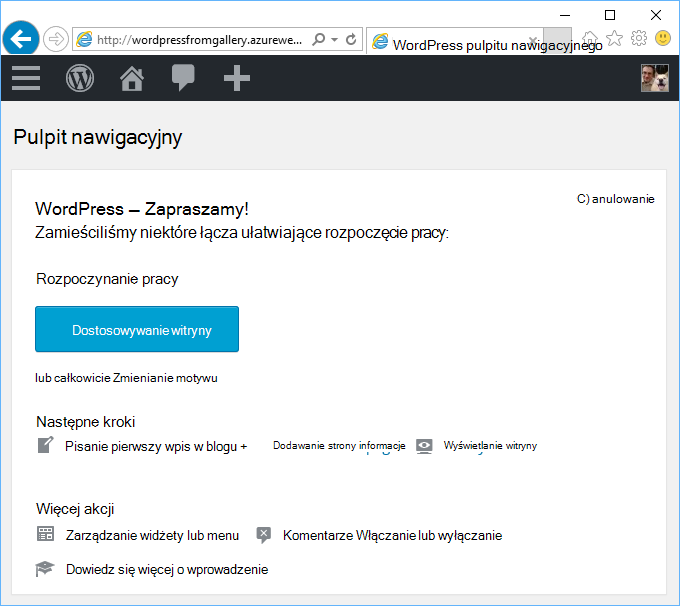
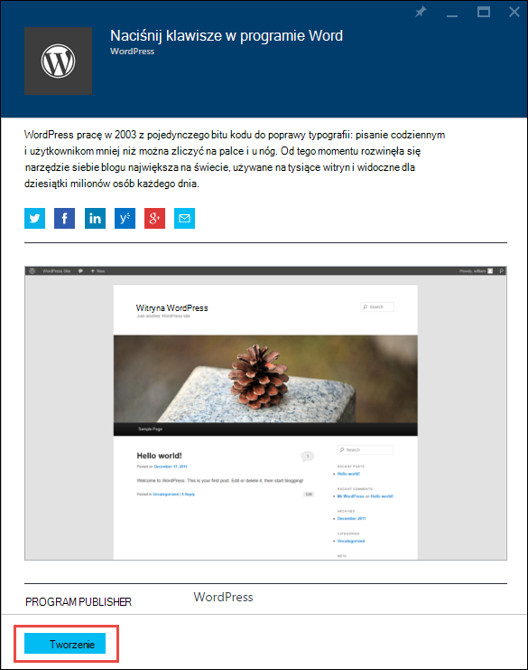
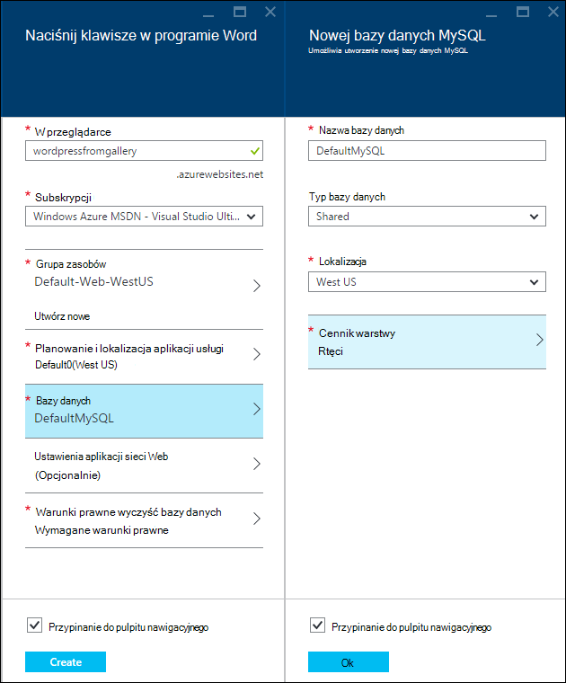
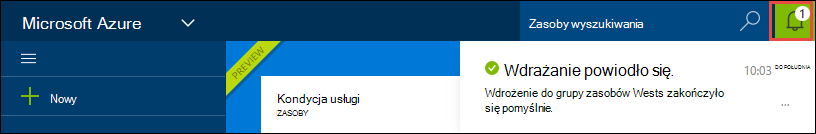
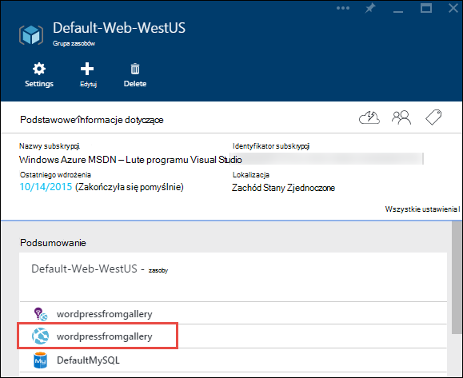
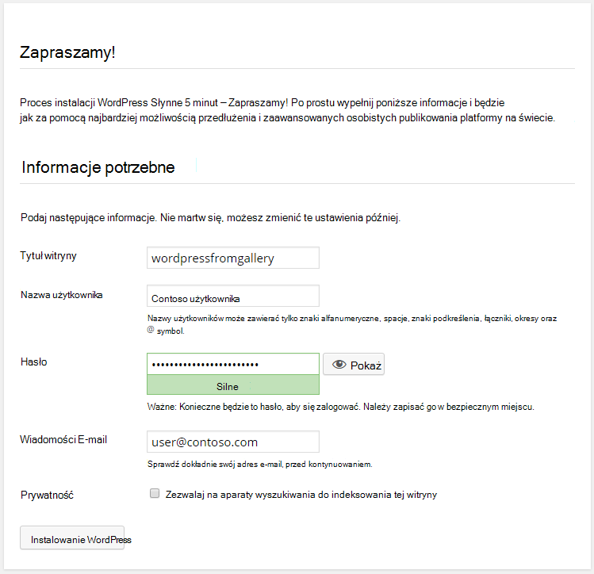

<properties
    pageTitle="Tworzenie aplikacji sieci web WordPress w usłudze Azure aplikacji | Microsoft Azure"
    description="Dowiedz się, jak utworzyć nowej aplikacji sieci web Azure dla blogu WordPress za pomocą Azure Portal."
    services="app-service\web"
    documentationCenter="php"
    authors="rmcmurray"
    manager="wpickett"
    editor=""/>

<tags
    ms.service="app-service-web"
    ms.workload="na"
    ms.tgt_pltfrm="na"
    ms.devlang="PHP"
    ms.topic="hero-article"
    ms.date="08/11/2016"
    ms.author="robmcm"/>

# Tworzenie aplikacji sieci web WordPress Azure aplikacji usługi

[AZURE.INCLUDE [tabs](../../includes/app-service-web-get-started-nav-tabs.md)]

Ten samouczek pokazano, jak wdrożyć WordPress blogu z Azure Marketplace.

Po zakończeniu z samouczka będą dostępne jego własnej witrynie blogu WordPress w górę i uruchamiania w chmurze.

Opisano następujące zagadnienia:

* Jak znaleźć szablonu aplikacji w Azure Marketplace.
* Jak utworzyć aplikację sieci web usługi aplikacji Azure, który jest oparty na tym szablonie.
* Jak skonfigurować ustawienia Azure aplikacji usług dla nowej aplikacji sieci web i bazy danych.

Azure Marketplace udostępnia szeroką gamę aplikacji web popularne opracowane przez firmę Microsoft, innej firmy i inicjatywy oprogramowania Otwórz źródło. Aplikacje sieci web utworzono na szeroką gamę popularne struktury, takich jak [PHP](/develop/nodejs/) w tym WordPress przykład, [.NET](/develop/net/), [Node.js](/develop/nodejs/), [Java](/develop/java/)i [Python](/develop/python/)kilka. Aby utworzyć aplikację sieci web z usługi Azure Marketplace tylko oprogramowania, które są potrzebne jest przeglądarki, która [Azure Portal](https://portal.azure.com/). 

Witryna WordPress, który można wdrożyć w tym samouczku używa MySQL bazy danych. Jeśli chcesz użyć bazy danych SQL dla bazy danych, zobacz [Nami projektu](http://projectnami.org/). **Nami projektu** jest również dostępne za pośrednictwem witryny Marketplace programu.

> [AZURE.NOTE]
> Aby użyć tego samouczka, potrzebne jest konto Microsoft Azure. Jeśli nie masz konta, możesz [uaktywnić programu Visual Studio subskrybentów korzyści](/pricing/member-offers/msdn-benefits-details/?WT.mc_id=A261C142F) lub [Utwórz konto w bezpłatnej wersji próbnej](/en-us/pricing/free-trial/?WT.mc_id=A261C142F).
>
> Jeśli chcesz rozpocząć pracę z Azure aplikacji usługi, aby utworzyć konto Azure, przejdź do [Spróbuj aplikacji usługi](http://go.microsoft.com/fwlink/?LinkId=523751). Od razu można utworzyć aplikację sieci web krótkotrwałe starter w aplikacji usługi — karty kredytowej wymagane i nie zobowiązań.

## Wybierz pozycję WordPress i konfigurowanie usługi aplikacji Azure

1. Zaloguj się do [portalu Azure](https://portal.azure.com/).

2. Kliknij przycisk **Nowy**.
    
    ![Utwórz nowe][5]
    
3. Wyszukiwanie **WordPress**, a następnie kliknij pozycję **WordPress**. Jeśli chcesz używać bazy danych SQL zamiast MySQL, wyszukaj **Nami projektu**.

    ![WordPress z listy][7]
    
5. Po przeczytaniu opis aplikacji WordPress, kliknij przycisk **Utwórz**.

    

4. Wprowadź nazwę dla aplikacji sieci web w polu **aplikacji sieci Web** .

    Ta nazwa musi być unikatowa w domenie azurewebsites.net, ponieważ adres URL aplikacji sieci web będzie {nazwa}. azurewebsites.net. Jeśli wprowadzona nazwa nie jest unikatowy, czerwony wykrzyknik pojawi się w polu tekstowym.

8. Jeśli masz więcej niż jedną subskrypcję, wybierz ten, którego chcesz użyć. 

5. Wybierz **Grupę zasobów** lub Utwórz nowy.

    Aby uzyskać więcej informacji dotyczących grup zasobów zobacz [Omówienie Menedżera zasobów Azure](../azure-resource-manager/resource-group-overview.md).

5. Wybierz **Plan i lokalizacja usługi aplikacji** lub Utwórz nowy.

    Aby uzyskać więcej informacji o planach usługi aplikacji zobacz [Omówienie planów Azure aplikacji usługi](../azure-web-sites-web-hosting-plans-in-depth-overview.md) 

7. Kliknij **bazę danych**, a następnie w **Nowej bazy danych MySQL** karta Podaj wartości wymaganych do konfigurowania bazy danych MySQL.

    . Wprowadź nową nazwę lub pozostaw domyślną nazwę.

    b. Pozostaw **Typ bazy danych** **udostępniony**.

    c. Wybierz tej samej lokalizacji, który wybrano dla aplikacji sieci web.

    d. Wybierz poziom cennik. Dla tego samouczka jest prawidłowy rtęci (bezpłatnie z minimalnymi połączeń dozwolonych i miejsca na dysku).

8. W karta **Nowej bazy danych MySQL** kliknij **przycisk OK**. 

8. W karta **WordPress** Zaakceptuj warunki prawne, a następnie kliknij przycisk **Utwórz**. 

    

    Azure aplikacji usługi tworzy aplikacji sieci web, zazwyczaj w ciągu mniej niż minuty. Możesz obejrzeć postępu, klikając ikonę dzwonka w górnej części strony portalu.

    

## Uruchamianie i zarządzanie nimi aplikacji sieci web WordPress
    
7. Po zakończeniu tworzenia aplikacji sieci web przejdź w Portal Azure do grupy zasobów, w której utworzono aplikacji, a widoczne aplikacji sieci web i bazy danych.

    Dodatkowe zasób z ikoną żarówka jest [Wniosków aplikacji](/services/application-insights/), która udostępnia monitorowania usług dla aplikacji sieci web.

1. W karta **Grupa zasobów** kliknij linię aplikacji sieci web.

    

2. W karta aplikacji sieci Web kliknij przycisk **Przeglądaj**.

    ![adres URL witryny][browse]

3. Na stronie WordPress **powitalnej** wprowadź informacje o konfiguracji wymaganych przez WordPress, a następnie kliknij **WordPress instalacji**.

    

4. Zaloguj się przy użyciu poświadczeń utworzonego na stronie **powitalnej** .  

5. Zostanie wyświetlona strona pulpitu nawigacyjnego do witryny.    

    

## Następne kroki

Użytkownik zobaczył, jak tworzyć i wdrażanie aplikacji sieci web PHP z galerii. Aby uzyskać więcej informacji o korzystaniu z platformy Azure PHP zobacz [Centrum deweloperów PHP](/develop/php/).

Aby uzyskać więcej informacji na temat pracy z aplikacji sieci Web usługi, zobacz łącza po lewej stronie strony (w przypadku wielu przeglądarki w systemie windows) lub u góry strony (dla systemu windows wąskie przeglądarek). 

## Informacje o zmianach
* Przewodnikiem do zmiany z witryn sieci Web do usługi aplikacji zobacz [Usługa Azure aplikacji i ich wpływu na istniejące usługi Azure](http://go.microsoft.com/fwlink/?LinkId=529714).

[5]: ./media/web-sites-php-web-site-gallery/startmarketplace.png
[7]: ./media/web-sites-php-web-site-gallery/search-web-app.png
[browse]: ./media/web-sites-php-web-site-gallery/browse-web.png
