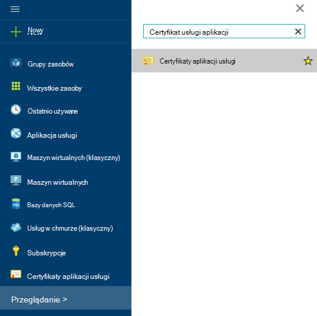
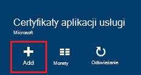
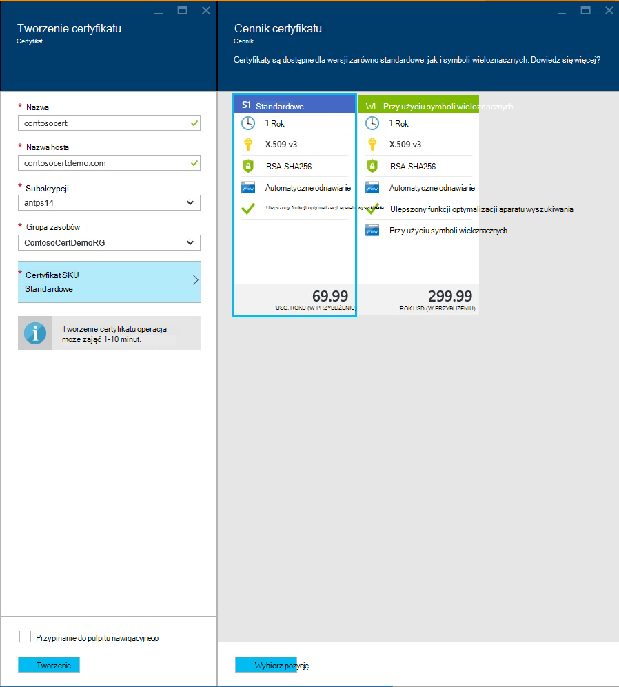
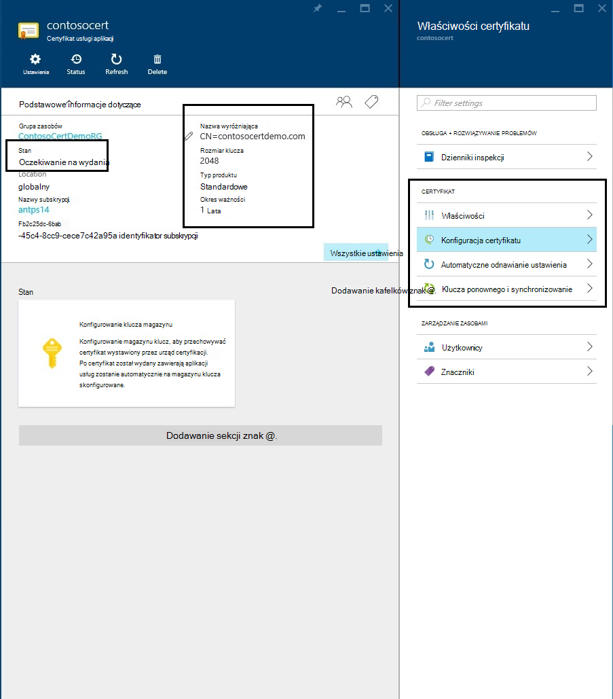
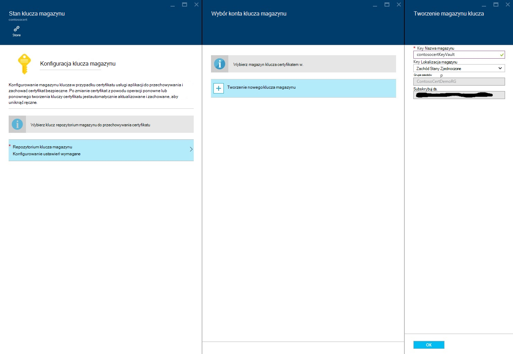
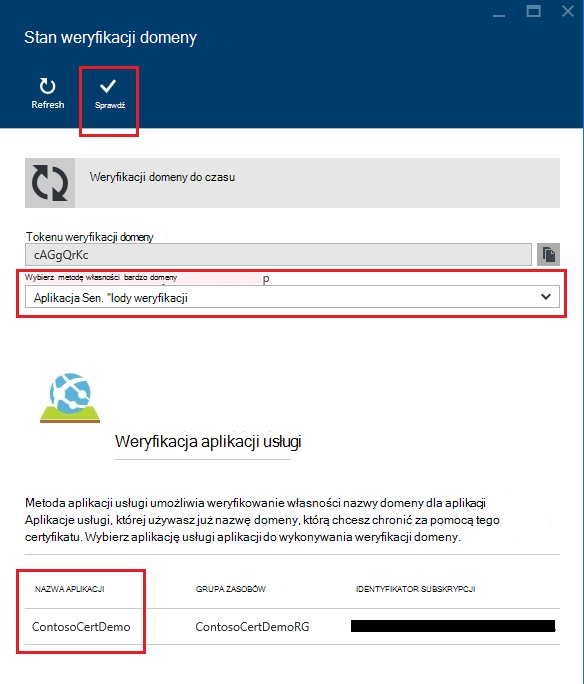
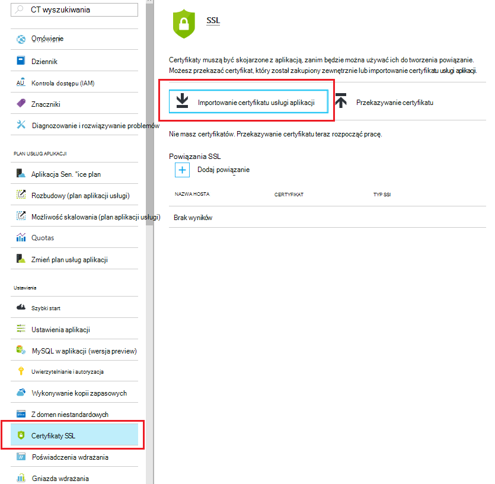
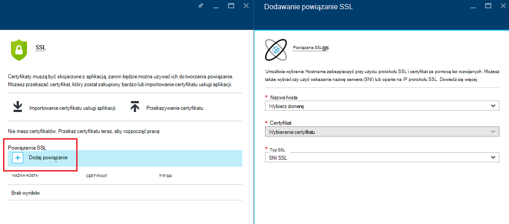
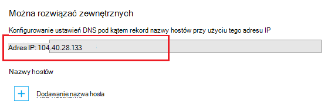
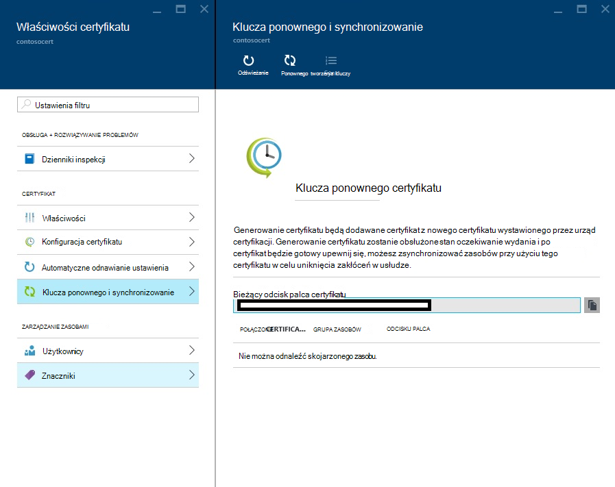

<properties
    pageTitle="Zakup i konfigurowanie certyfikatu SSL dla usługi Azure aplikacji"
    description="Dowiedz się, jak kupić i konfigurowanie certyfikatu SSL dla usługi Azure aplikacji."
    services="app-service"
    documentationCenter=".net"
    authors="apurvajo"
    manager="stefsch"
    editor="cephalin"
    tags="buy-ssl-certificates"/>

<tags
    ms.service="app-service"
    ms.workload="na"
    ms.tgt_pltfrm="na"
    ms.devlang="na"
    ms.topic="article"
    ms.date="09/19/2016"
    ms.author="apurvajo"/>

#Zakup i konfigurowanie certyfikatu SSL dla usługi Azure aplikacji

> [AZURE.SELECTOR]
- [Zakup certyfikatu SSL platformy Azure](web-sites-purchase-ssl-web-site.md)
- [Używanie certyfikatu SSL z innego miejsca](web-sites-configure-ssl-certificate.md)

Domyślnie **[Azure aplikacji usługi](http://go.microsoft.com/fwlink/?LinkId=529714)** już umożliwia HTTPS na dla aplikacji sieci web przy użyciu certyfikatu symboli *. azurewebsites.net domeny. Jeśli nie zamierzasz skonfigurować domenę niestandardową, można skorzystać z domyślny certyfikat HTTPS. Jednak, na przykład wszystkich * [domeny wieloznaczne](https://casecurity.org/2014/02/26/pros-and-cons-of-single-domain-multi-domain-and-wildcard-certificates), nie jest bezpieczny domeny niestandardowej za pomocą własnego certyfikatu. Azure aplikacji usługi zawiera teraz naprawdę uproszczone sposób zakupu i zarządzać nimi certyfikat SSL bezpośrednio z Azure Portal bez opuszczania portalu.  
W tym artykule wyjaśniono, jak kupić i konfigurowanie certyfikatu SSL **[Azure aplikacji usług](http://go.microsoft.com/fwlink/?LinkId=529714)** w 3 prostych krokach. 

> [AZURE.NOTE]
> Nie można używać certyfikatów SSL niestandardowe nazwy domen przy użyciu bezpłatnego i udostępnianie aplikacji sieci web. Musisz skonfigurować w aplikacji sieci web w trybie Basic, Standard lub Premium, które mogą ulec zmianie, ile konta dla subskrypcji. Aby uzyskać więcej informacji, zobacz **[Szczegóły ceny aplikacji sieci Web](https://azure.microsoft.com/pricing/details/web-sites/)** .

##Omówienie
> [AZURE.NOTE]
> Nie Spróbuj kupić certyfikat SSL korzystania z subskrypcji, który nie ma aktywnej karty kredytowej skojarzone z nim. Może to spowodować, że Twoja subskrypcja zostanie wyłączona. 

##<a>Kupowanie, przechowywanie i przypisz certyfikat SSL dla domeny niestandardowej</a>
Aby włączyć HTTPS dla domeny niestandardowej, na przykład contoso.com, należy najpierw ** [Konfigurowanie niestandardowej nazwy domeny w usłudze aplikacji Azure.](web-sites-custom-domain-name.md)**

Przed żądania certyfikatu SSL, należy najpierw określić nazw domen, które będą zabezpieczone certyfikat. Określi jakiego rodzaju certyfikat musi uzyskać. Jeśli chcesz po prostu bezpiecznego nazwę domeny pojedynczej, takie jak contoso.com lub www.contoso.com standardowe (podstawowy) wystarcza certyfikatu. Jeśli chcesz zabezpieczyć wielu nazw domen, na przykład contoso.com, www.contoso.com i mail.contoso.com, następnie można uzyskać ** [certyfikat symboli wieloznacznych](http://en.wikipedia.org/wiki/Wildcard_certificate)**

##Krok 0: Umieść rzędu certyfikat SSL

W tym kroku dowiesz się, jak zamówienie dla certyfikatu SSL w dowolnym miejscu.

1.  W **[Azure Portal](https://portal.azure.com/)**kliknij przycisk Przeglądaj i wpisz "Certyfikaty usługi aplikacji" w pasek wyszukiwania i wybierz "Certyfikaty usługi aplikacji" z wyników, a następnie kliknij przycisk Dodaj. 

    

    

2.  Wprowadź **przyjazną nazwę** certyfikatu SSL.

3.  Wprowadź **nazwę hosta**
> [AZURE.NOTE]
    Jest to jeden z najważniejszych elementów proces zakupu. Upewnij się wprowadzić nazwę właściwego hosta (niestandardowej domeny), którą chcesz chronić przy użyciu tego certyfikatu. **Nie** można dołączyć nazwa hosta z ciągu "www". Na przykład jeśli niestandardowej nazwy domeny jest www.contoso.com, a następnie wpisz w polu Nazwa hosta contoso.com, dany certyfikat chronić zarówno w ciągu "www", jak i w katalogu głównego domeny. 
    
4.  Wybierz **subskrypcję**. 

    Jeśli masz wiele subskrypcji, następnie upewnij się utworzyć certyfikat SSL w tej samej subskrypcji, używany dla swojej domeny niestandardowej lub aplikacji sieci Web w danym.
       
5.  Wybierz lub Utwórz nową **grupę zasobów**.

    Grupy zasobów umożliwiają zarządzanie zasoby pokrewne Azure jako jednostki i są przydatne podczas ustalania oparta na rolach zasad kontroli dostępu do (RBAC) dla aplikacji. Aby uzyskać więcej informacji zobacz Zarządzanie Azure zasobów.
     
6.  Wybierz **certyfikat SKU** 

    Na koniec wybierz certyfikat SKU, która odpowiada Twoim potrzebom i kliknij przycisk Utwórz. Obecnie Azure aplikacji usługi umożliwia uzyskanie dwóch różnych wersji produktu • S1 — Standardowy certyfikat z 1-letni okres ważności i automatycznego odnawiania  
           • W1 — certyfikat przy użyciu symboli wieloznacznych z 1 roku ważności i automatycznego odnawiania      
    Aby uzyskać więcej informacji, zobacz **[Szczegóły ceny aplikacji sieci Web](https://azure.microsoft.com/pricing/details/web-sites/)** .

> [AZURE.NOTE]
> Tworzenie certyfikatu SSL będzie trwać od 1 do 10 minut. Ten proces wykonuje wiele kroków w tle, które w przeciwnym razie są bardzo trudne przeprowadzić ręcznie.  

##Krok 1: Z certyfikatem w Azure klucza magazynu

W tym kroku dowiesz się, jak należy umieścić sklepu certyfikat SSL został zakupiony do magazynu klucza Azure wybranych przez użytkownika.

1.  Po zakończeniu zakupu certyfikat SSL będzie konieczne ręczne otwieranie karta zasobu **Certyfikaty usługi aplikacji** przy użyciu przeglądania ponownie (zobacz krok 1 powyżej)   

    

    Można zauważyć, że istnieje kilka większej liczby kroków, które należy wykonać przed rozpoczęciem pracy, za pomocą tego certyfikatów stan certyfikatu jest **"wydania oczekiwanie"** .
 
2. Kliknij wewnątrz karta właściwości certyfikatu i kliknij przycisk **"krok 1: przechowywanie"** certyfikatem tego magazynu klucza Azure **"Konfiguracja certyfikatów"** .

3.  Kliknij przycisk karta **"klucza magazynu stan"** na **"klucza magazynu repozytorium"** wybierz istniejące magazynu klucz do przechowywania ten certyfikat **lub "Tworzenie nowego klucza magazynu"** tworzenia nowego klucza magazynu w tej samej grupy zasobów i subskrypcji.
 
    
 
    > [AZURE.NOTE]
    Azure magazynu klucza ma minimalne opłaty do przechowywania ten certyfikat. Zobacz **[Azure klucza magazynu ceny szczegóły](https://azure.microsoft.com/pricing/details/key-vault/)** , aby uzyskać więcej informacji.

4. Po wybraniu repozytorium magazynu klucza certyfikatem w wtyczce i zapisać go, klikając przycisk **"Przechowywanie"** w górnej części karta **"klucza magazynu stan"** .  

    Ten należy wykonać krok do przechowywania certyfikat został zakupiony z magazynu klucza Azure wybranych przez użytkownika. Po odświeżeniu karta powinna być widoczna, zielony sprawdzanie oznaczanie przed także ten krok.
    
##Krok 2: Zweryfikuj własność domeny

W tym kroku dowiesz się, jak wykonywać weryfikacji własności domeny umieszczoną aby certyfikat SSL. 

1.  Polecenie **"krok 2: weryfikowanie"** krok z karta **"Konfiguracja certyfikatów"** . Istnieje 4 typy domeny weryfikacji obsługiwane przez aplikację usługi certyfikatów.

    * **Weryfikacja aplikacji usługi** 
    
        * Jeśli masz już jest najwygodniejsze proces **domeny niestandardowej przypisane do aplikacji usługi.** Ta metoda spowoduje wyświetlenie listy się wszystkich aplikacji usługi aplikacjami, które spełniają te kryteria. 
           Na przykład w tym przypadku **contosocertdemo.com** jest domenę niestandardową przydzielonych do aplikacji usługi aplikacji o nazwie **"ContosoCertDemo"** i w związku z tym jest tylko aplikacji usługi aplikacji tu wymienione. Jeśli dokonano wdrażania wielu region, a następnie pojawi się lista je wszystkie w regionach.
        
           Metodę weryfikacji jest tylko dostępne w przypadku zakupów Standardowy certyfikat (podstawowy). W przypadku certyfikatów przy użyciu symboli wieloznacznych pominąć i przejść do opcji B, C i D poniżej.
        * Kliknij przycisk **"Weryfikuj"** , aby wykonać ten krok.
        * Polecenie **"Odśwież"** , aby zaktualizować stan certyfikatu, po zakończeniu weryfikacji. Może upłynąć kilka minut weryfikacji.
        
             

    * **Weryfikacji domeny** 

        * To jest najwygodniejsze proces **tylko wtedy, gdy** masz **[zakupiony własnej domeny z usługi aplikacji Azure.](custom-dns-web-site-buydomains-web-app.md)**
        
        * Kliknij przycisk **"Weryfikuj"** , aby wykonać ten krok.
        
        * Polecenie **"Odśwież"** , aby zaktualizować stan certyfikatu, po zakończeniu weryfikacji. Może upłynąć kilka minut weryfikacji.

    * **Weryfikacja pocztą**
        
        * Już została wysłana wiadomość e-mail na adresy E-mail skojarzonego z tej domeny niestandardowej.
         
        * Otwórz wiadomość e-mail i kliknij łącze weryfikacji, aby ukończyć proces weryfikacji wiadomości E-mail. 
        
        * Jeśli chcesz ponownie wyślij tę wiadomość e-mail, kliknij przycisk **"ponowne wysyłanie wiadomości E-mail"** .
         
    * **Weryfikacja ręczna**    
                 
        1. **Weryfikacja strony sieci Web HTML**
        
            * Utwórz plik HTML o nazwie **{Tokenu weryfikacji domeny}**HTML (możesz skopiować tokenu z on domeny sprawdzenie stanu karta)
            
            * Zawartość tego pliku powinny być dokładną nazwę samego **Tokenu weryfikacji domeny**.
            
            * Przekazać tego pliku w katalogu głównym serwera sieci web obsługującego domeny.
            
            * Polecenie **"Odśwież"** , aby zaktualizować stan certyfikatu, po zakończeniu weryfikacji. Może upłynąć kilka minut weryfikacji.
            
            Na przykład jeśli zakupu to standardowy certyfikat dla contosocertdemo.com z tokenu weryfikacji domeny **"cAGgQrKc"** następnie żądania sieci web do **"http://contosocertdemo.com/cAGgQrKc.html"** powinna zwrócić **cAGgQrKc.**
        2. **Weryfikacji rekordu DNS TXT**

            * Korzystanie z Menedżera DNS Utwórz rekord TXT na poddomeny **"DZC"** na wartość równą **domeny sprawdzenie Token.**
            
            * Polecenie **"Odśwież"** , aby zaktualizować stan certyfikatu, po zakończeniu weryfikacji. Może upłynąć kilka minut weryfikacji.
                              
            Na przykład, aby można było sprawdzana poprawność certyfikatu symboli za pomocą hostname ** \*. contosocertdemo.com** lub ** \*. subdomain.contosocertdemo.com** i tokenu weryfikacji domeny **cAGgQrKc**potrzebne do utworzenia rekordu TXT na dzc.contosocertdemo.com z wartością **cAGgQrKc.**     

##Krok 3: Przypisywanie certyfikatu do aplikacji usługi aplikacji

W tym kroku dowiesz się, jak przypisać to nowo zakupionych certyfikat do aplikacji usługi aplikacji. 

> [AZURE.NOTE]
> Przed wykonaniem kroki opisane w tej sekcji, musi mieć skojarzony niestandardowej nazwy domeny z aplikacji. Aby uzyskać więcej informacji zobacz ** [Konfigurowanie niestandardowej nazwy domeny dla aplikacji sieci web](web-sites-custom-domain-name.md)**

1.  W przeglądarce, otwórz ** [Azure Portal.](https://portal.azure.com/)**
2.  Kliknij opcję **Aplikacji usługi** po lewej stronie.
3.  Kliknij nazwę aplikacji, do którego chcesz przypisać ten certyfikat. 
4.  W obszarze **Ustawienia**kliknij **certyfikatów SSL**
5.  Kliknij pozycję **Importowanie certyfikatu usługi aplikacji** i wybierz certyfikat, który został zakupiony

    

6. W **powiązań ssl** sekcji kliknij **Dodawanie powiązań**
7. W karta **Dodać powiązanie SSL** umożliwia wybierz nazwę domeny, aby zabezpieczyć przy użyciu protokołu SSL i certyfikat za pomocą list rozwijanych. Możesz także wybrać czy użyć **[Wskazanie nazwa serwera (SNI)](http://en.wikipedia.org/wiki/Server_Name_Indication)** lub oparte na IP protokołu SSL.

    

       •    IP based SSL associates a certificate with a domain name by mapping the dedicated public IP address of the server to the domain name. This requires each domain name (contoso.com, fabricam.com, etc.) associated with your service to have a dedicated IP address. This is the traditional          method of associating SSL certificates with a web server.
       •    SNI based SSL is an extension to SSL and **[Transport Layer Security](http://en.wikipedia.org/wiki/Transport_Layer_Security)** (TLS) that allows multiple domains to share the same IP address, with separate security certificates for each domain. Most modern browsers (including Internet Explorer, Chrome, Firefox and Opera) support SNI, however older browsers may not support SNI. For more information on SNI, see the **[Server Name Indication](http://en.wikipedia.org/wiki/Server_Name_Indication)** article on Wikipedia.
       
7. Kliknij przycisk **Dodaj oprawa** , aby zapisać zmiany i włączyć obsługę protokołu SSL.

Jeśli wybrano **SSL oparte na IP** i domeny niestandardowej jest skonfigurowany przy użyciu rekordu A, należy wykonać następujące dodatkowe kroki:

* Po skonfigurowaniu powiązanie SSL oparte na IP, dedykowany adres IP jest przypisany do aplikacji. Ten adres IP można znaleźć na stronie **domeny niestandardowej** w obszarze Ustawienia aplikacji, nad sekcji **nazwy hostów** . Zostaną wyświetlone jako **Zewnętrzny adres IP**
    
    

    Należy zauważyć, że ten adres IP będzie inny niż wirtualny adres IP wcześniej umożliwia konfigurowanie rekordu A dla swojej domeny. Jeśli zostały skonfigurowane do używania SNI podstawie SSL lub nie są skonfigurowane do używania protokołu SSL, adres nie będzie on wymieniony dla tego wpisu.
    
2. Korzystając z narzędzi dostępnych z rejestratorem nazwy domeny, zmodyfikuj rekord A dla niestandardowej nazwy domeny wskazywały na adres IP w poprzednim kroku.
W tym momencie powinno być możliwe odwiedź stronę aplikacji za pomocą HTTPS:// zamiast HTTP:// w celu zweryfikowania, że certyfikat został poprawnie skonfigurowany.

##Klucza ponownego i synchronizowanie certyfikatu

1. Ze względów bezpieczeństwa Jeśli konieczna klucza ponownego certyfikatu następnie po prostu wybierz opcję **"klucza ponownego i Synchronizuj"** z **"właściwości certyfikatu"** karta. 

2. Kliknij przycisk **"Klucza ponownego"** , aby rozpocząć proces. Ten proces może potrwać 1-10 minut. 

    

3. Generowanie certyfikatu będą dodawane certyfikat z nowego certyfikatu wystawionego przez urząd certyfikacji.
4. Nie zostanie obciążona dla Rekeying dla ważności certyfikatu. 
5. Generowanie certyfikatu przejdzie przez Państwo oczekujące wydania. 
6. Gdy certyfikat będzie gotowy upewnij się, że możesz synchronizować zasobów przy użyciu tego certyfikatu, aby zapobiec zakłócenia w pracy z usługą.
7. Opcja synchronizacji nie jest dostępne w przypadku certyfikatów, które nie są jeszcze przypisane do aplikacji sieci Web. 

## Więcej zasobów ##
- [Włącz protokół HTTPS w aplikacji w usłudze Azure aplikacji](web-sites-configure-ssl-certificate.md)
- [Zakup i konfigurowanie niestandardowej nazwy domeny w usłudze Azure aplikacji](custom-dns-web-site-buydomains-web-app.md)
- [Centrum zaufania programu Microsoft Azure](/support/trust-center/security/)
- [Opcje konfiguracji odblokowywane w witryn sieci Web Azure](http://azure.microsoft.com/blog/2014/01/28/more-to-explore-configuration-options-unlocked-in-windows-azure-web-sites/)
- [Portal Azure zarządzania](https://manage.windowsazure.com)

>[AZURE.NOTE] Jeśli chcesz rozpocząć pracę z Azure aplikacji usługi przed utworzeniem konta dla konta Azure, przejdź do [Spróbuj aplikacji usługi](http://go.microsoft.com/fwlink/?LinkId=523751), którym natychmiast można utworzyć aplikację sieci web krótkotrwałe starter w aplikacji usługi. Nie kart kredytowych wymagane; nie zobowiązania.

