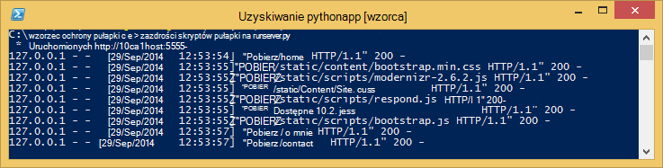

<properties 
    pageTitle="Tworzenie aplikacji sieci web z kolbą platformy Azure" 
    description="Samouczek, w której przedstawiono uruchomionych aplikacji sieci web Python Azure." 
    services="app-service\web" 
    documentationCenter="python"
    tags="python"
    authors="huguesv" 
    manager="wpickett" 
    editor=""/>

<tags 
    ms.service="app-service-web" 
    ms.workload="web" 
    ms.tgt_pltfrm="na" 
    ms.devlang="python" 
    ms.topic="article" 
    ms.date="02/20/2016"
    ms.author="huvalo"/>

# Tworzenie aplikacji sieci web z kolbą platformy Azure

Ten samouczek opisano, jak rozpocząć pracę w programie Python [Azure aplikacji usługi sieci Web](http://go.microsoft.com/fwlink/?LinkId=529714).  Aplikacje sieci Web udostępnia ograniczoną bezpłatne hosting i szybkiego rozmieszczania i Python!  W miarę aplikacji można przełączyć się hostingu płatnej, a także można zintegrować z wszystkich innych usług Azure.

Utworzysz aplikacji przy użyciu struktury web kolby (zobacz alternatywnych wersji tego samouczka [Django](web-sites-python-create-deploy-django-app.md) i [butelki](web-sites-python-create-deploy-bottle-app.md)).  Będzie tworzenie witryny sieci Web z galerii Azure, skonfigurować wdrożenie cyfra i klonowanie repozytorium lokalnie.  Następnie uruchomisz aplikacji lokalnie, wprowadź zmiany, zatwierdzanie i przekazać je do Azure.  Samouczek pokazano, jak to zrobić z systemem Windows lub komputerów Mac i Linux.

[AZURE.INCLUDE [create-account-and-websites-note](../../includes/create-account-and-websites-note.md)]

>[AZURE.NOTE] Jeśli chcesz rozpocząć pracę z Azure aplikacji usługi przed utworzeniem konta dla konta Azure, przejdź do [Spróbuj aplikacji usługi](http://go.microsoft.com/fwlink/?LinkId=523751), którym natychmiast można utworzyć aplikację sieci web krótkotrwałe starter w aplikacji usługi. Nie kart kredytowych wymagane; nie zobowiązania.

## Wymagania wstępne

- System Windows, Mac lub Linux
- Python 2.7 lub 3.4
- setuptools pip, virtualenv (tylko 2.7 Python)
- Cyfra
- [Narzędzia Python programu Visual Studio][] Uwaga (PTVS) -: jest to opcjonalne

**Uwaga**: publikowanie TFS nie jest obecnie obsługiwane w przypadku projektów Python.

### Systemu Windows

Jeśli nie masz jeszcze Python 2.7 lub 3.4 zainstalowanych (32-bitowa), zaleca się zainstalowanie [SDK Azure dla Python 2.7] lub [SDK Azure dla Python 3.4] za pomocą Instalatora platformy sieci Web.  To jest instalowana 32-bitową wersję Python setuptools, pip, virtualenv, itp (Python 32-bitowa jest zainstalowanych na komputerach Azure hosta).  Możesz również przejść Python z [python.org].

Cyfra zalecamy [Cyfra dla systemu Windows] lub [GitHub dla systemu Windows].  Jeśli używasz programu Visual Studio umożliwia zintegrowaną obsługę cyfra.

Ponadto zaleca się zainstalowanie [Python 2.2 narzędzia programu Visual Studio].  To jest opcjonalne, ale jeśli masz [Visual Studio], łącznie z bezpłatnego 2013 społeczności programu Visual Studio lub Visual Studio Express 2013 dla sieci Web, następnie zapewni to doskonałe IDE Python.

### Mac i Linux

Powinny mieć Python i cyfra już zainstalowany, ale upewnij się, że masz Python 2.7 lub 3.4.

## Tworzenie aplikacji sieci Web na Azure Portal

Pierwszym krokiem podczas tworzenia aplikacji jest utworzenie aplikacji sieci web przez [Azure Portal](https://portal.azure.com). 

1. Zaloguj się do portalu Azure i kliknij przycisk **Nowy** w lewym dolnym rogu. 
2. Kliknij pozycję **Web + Mobile**.
3. W polu wyszukiwania wpisz "python".
4. W wynikach wyszukiwania zaznacz **kolby**, a następnie kliknij przycisk **Utwórz**.
5. Konfigurowanie nowej aplikacji kolby, takich jak tworzenie nowego planu aplikacji usługi i nowej grupy zasobów dla niego. Następnie kliknij przycisk **Utwórz**.
6. Konfigurowanie publikowania cyfra dla aplikacji sieci web nowo utworzonego zgodnie z instrukcjami w [Lokalnym rozmieszczania cyfra Azure aplikacji usługi](app-service-deploy-local-git.md).

## Omówienie aplikacji

### Cyfra repozytorium zawartości

Poniżej przedstawiono plików, które można znaleźć w początkowej repozytorium cyfra, które będą możemy klonowanie w następnej sekcji.

    \FlaskWebProject\__init__.py
    \FlaskWebProject\views.py
    \FlaskWebProject\static\content\
    \FlaskWebProject\static\fonts\
    \FlaskWebProject\static\scripts\
    \FlaskWebProject\templates\about.html
    \FlaskWebProject\templates\contact.html
    \FlaskWebProject\templates\index.html
    \FlaskWebProject\templates\layout.html

Główne źródła dla aplikacji.  Składa się z 3 stron (o kontakcie indeks) z Układ wzorca.  Zawartość statyczną i skryptów zawierają początkowego, jquery, modernizr i odpowiedź.

    \runserver.py

Obsługa rozwoju lokalnego serwera. Umożliwia lokalnie uruchomić aplikację.

    \FlaskWebProject.pyproj
    \FlaskWebProject.sln

Pliki programu Project do użytku z [Python Tools for Visual Studio].

    \ptvs_virtualenv_proxy.py

Serwer proxy usług IIS dla środowiska wirtualne i PTVS zdalnego, obsługa debugowania.

    \requirements.txt

Zewnętrzne pakiety wymagane przez tę aplikację. Skrypt wdrożenia będzie pip zainstalować pakiety wymienione w tym pliku.
 
    \web.2.7.config
    \web.3.4.config

Pliki konfiguracji usług IIS.  Skrypt wdrożenia będzie używać odpowiednich web.x.y.config i skopiuj go jako web.config.

### Pliki opcjonalne - Dostosowywanie wdrażania

[AZURE.INCLUDE [web-sites-python-customizing-deployment](../../includes/web-sites-python-customizing-deployment.md)]

### Pliki opcjonalne - środowisko uruchomieniowe Python

[AZURE.INCLUDE [web-sites-python-customizing-runtime](../../includes/web-sites-python-customizing-runtime.md)]

### Dodatkowe pliki na serwerze

Niektóre pliki istnieje na serwerze, ale nie są dodawane do repozytorium cyfra.  Te są tworzone przez skrypt wdrożenia.

    \web.config

Plik konfiguracyjny usług IIS.  Utworzone na podstawie web.x.y.config każdej wdrożenia.

    \env\

Środowisko wirtualne Python.  Utworzone podczas wdrażania, jeżeli zgodne środowisko wirtualne nie ma jeszcze w tej aplikacji.  Pakiety wymienione w requirements.txt są pip zainstalowany, ale pip pominie instalacji, jeśli pakiety są już zainstalowane.

Następne 3 sekcjach opisano sposoby przystąpić do tworzenia aplikacji sieci web w różnych środowiskach 3:

- Systemu Windows, korzystając z narzędzi Python programu Visual Studio
- Systemu Windows, z wiersza polecenia
- Mac i Linux z wiersza polecenia

## Programowania aplikacji sieci Web Python — Windows — Tools for Visual Studio

### Klonowanie repozytorium

Najpierw klonowanie repozytorium przy użyciu adresu URL, na Azure Portal. Aby uzyskać więcej informacji zobacz [Lokalnego wdrożenia cyfra usłudze Azure w aplikacji](app-service-deploy-local-git.md).

Otwórz plik rozwiązania (.sln), który znajduje się w katalogu głównym repozytorium.

### Tworzenie wirtualnych środowiska

Teraz utworzymy wirtualnego środowiska w celu rozwoju lokalnego.  Kliknij prawym przyciskiem myszy, wybierz pozycję **Środowiskach Python** **Dodawanie wirtualnego środowiska...**.

- Upewnij się, nazwę środowiska jest `env`.

- Wybierz pozycję interpretera podstawowej.  Upewnij się użyć tej samej wersji Python, który jest zaznaczone dla aplikacji sieci web (w runtime.txt lub karta **Ustawienia aplikacji** aplikacji sieci web w Azure Portal).

- Upewnij się, że zaznaczono opcję, aby pobrać i zainstalować pakiety.

Kliknij przycisk **Utwórz**.  To będzie utworzyć wirtualne środowisko, a następnie zainstaluj zależności wymienionych w requirements.txt.

### Uruchamianie przy użyciu serwera opracowywania

Naciśnij klawisz F5, aby rozpocząć debugowanie i przeglądarki sieci web zostanie otwarty na stronę uruchomionej na komputerze lokalnym.

Punkty kontrolne można ustawić w źródeł, za pomocą systemu windows czujki itp.  Zobacz [Narzędzia Python dokumentacji programu Visual Studio] , aby uzyskać więcej informacji na temat różnych funkcji.

### Wprowadzanie zmian

Teraz możesz poeksperymentować wprowadzenie zmian w aplikacji źródeł i/lub szablony.

Po przetestowaniu zmiany, należy je zatwierdzić do repozytorium cyfra:

### Zainstalować pakiety więcej

Aplikacja może być zależności poza Python i kolby.

Możesz zainstalować dodatkowe pakiety przy użyciu pip.  Aby zainstalować pakiet, kliknij prawym przyciskiem myszy środowisko wirtualne i wybierz pozycję **Zainstaluj pakiet Python**.

Na przykład, aby zainstalować Azure SDK dla Python, które umożliwia dostęp do przechowywania Azure, bus usługi i innych usług Azure, wprowadź `azure`:

Kliknij prawym przyciskiem myszy wirtualnego środowiska i wybierz pozycję **Generuj requirements.txt** , aby zaktualizować requirements.txt.

Następnie Zatwierdź zmiany w requirements.txt do repozytorium cyfra.

### Wdrażanie Azure

Aby wyzwolić wdrożeniu, kliknij przycisk **Synchronizuj** lub **Push**.  Synchronizacja działa zarówno i wypychania.

Pierwszy wdrożenia zajmie trochę czasu, jak utworzy wirtualnego środowiska, zainstaluj pakiety itd.

Program Visual Studio nie pokazuje postęp wdrożenia.  Jeśli chcesz Przejrzyj wyniki, zobacz sekcję [Rozwiązywanie problemów — wdrożenia](#troubleshooting-deployment).

Przejdź do adresu URL Azure, aby wyświetlić swoje zmiany.

## Wiersz polecenia rozwoju — Windows — aplikacji sieci Web

### Klonowanie repozytorium

Najpierw klonowanie repozytorium przy użyciu adresu URL, na Azure Portal i dodawanie repozytorium Azure jako zdalny. Aby uzyskać więcej informacji zobacz [Lokalnego wdrożenia cyfra usłudze Azure w aplikacji](app-service-deploy-local-git.md).

    git clone <repo-url>
    cd <repo-folder>
    git remote add azure <repo-url> 

### Tworzenie wirtualnych środowiska

Utworzymy nowego wirtualnego środowiska w celu programistycznych (nie dodawać je do repozytorium).  Środowiska wirtualne w Python nie są relocatable, aby każdej używająca na pasku aplikacji będą tworzyć własne lokalnie.

Upewnij się użyć tej samej wersji Python, który jest zaznaczone dla aplikacji sieci web (w runtime.txt lub karta **Ustawienia aplikacji** aplikacji sieci web w Azure Portal).

Aby uzyskać Python 2.7:

    c:\python27\python.exe -m virtualenv env

Aby uzyskać Python 3.4:

    c:\python34\python.exe -m venv env

Zainstaluj wszystkie zewnętrzne pakiety wymagane przez aplikację. Plik requirements.txt w katalogu głównym repozytorium służy do instalowania pakietów w środowisku wirtualnej:

    env\scripts\pip install -r requirements.txt

### Uruchamianie przy użyciu serwera opracowywania

Można uruchomić aplikację, w obszarze serwer dla programistów przy użyciu następującego polecenia:

    env\scripts\python runserver.py

Na konsoli zostanie wyświetlony adres URL i wykrywa port serwera:

Następnie otwórz przeglądarkę sieci web do tego adresu URL.

### Wprowadzanie zmian

Teraz możesz poeksperymentować wprowadzenie zmian w aplikacji źródeł i/lub szablony.

Po przetestowaniu zmiany, należy je zatwierdzić do repozytorium cyfra:

    git add <modified-file>
    git commit -m "<commit-comment>"

### Zainstalować pakiety więcej

Aplikacja może być zależności poza Python i kolby.

Możesz zainstalować dodatkowe pakiety przy użyciu pip.  Na przykład aby zainstalować Azure SDK dla Python, które umożliwia dostęp do przechowywania Azure, bus usługi i innych usług Azure, wpisz:

    env\scripts\pip install azure

Upewnij się zaktualizować requirements.txt:

    env\scripts\pip freeze > requirements.txt

Zatwierdź zmiany:

    git add requirements.txt
    git commit -m "Added azure package"

### Wdrażanie Azure

Aby wyzwolić wdrożeniu, należy przekazać zmiany do Azure:

    git push azure master

Zostaną wyświetlone dane wyjściowe skrypt wdrożenia, łącznie z wirtualnego środowiska tworzenia instalacji opakowań, tworzenie web.config.

Przejdź do adresu URL Azure, aby wyświetlić swoje zmiany.

## Wiersz polecenia rozwoju Mac i Linux — aplikacji sieci Web

### Klonowanie repozytorium

Najpierw klonowanie repozytorium przy użyciu adresu URL, na Azure Portal i dodawanie repozytorium Azure jako zdalny. Aby uzyskać więcej informacji zobacz [Lokalnego wdrożenia cyfra usłudze Azure w aplikacji](app-service-deploy-local-git.md).

    git clone <repo-url>
    cd <repo-folder>
    git remote add azure <repo-url> 

### Tworzenie wirtualnych środowiska

Utworzymy nowego wirtualnego środowiska w celu programistycznych (nie dodawać je do repozytorium).  Środowiska wirtualne w Python nie są relocatable, aby każdej używająca na pasku aplikacji będą tworzyć własne lokalnie.

Upewnij się użyć tej samej wersji Python, który jest zaznaczone dla aplikacji sieci web (w runtime.txt lub karta **Ustawienia aplikacji** aplikacji sieci web w Azure Portal).

Aby uzyskać Python 2.7:

    python -m virtualenv env

Aby uzyskać Python 3.4:

    python -m venv env
lub Koperta pyvenv

Zainstaluj wszystkie zewnętrzne pakiety wymagane przez aplikację. Plik requirements.txt w katalogu głównym repozytorium służy do instalowania pakietów w środowisku wirtualnej:

    env/bin/pip install -r requirements.txt

### Uruchamianie przy użyciu serwera opracowywania

Można uruchomić aplikację, w obszarze serwer dla programistów przy użyciu następującego polecenia:

    env/bin/python runserver.py

Na konsoli zostanie wyświetlony adres URL i wykrywa port serwera:

Następnie otwórz przeglądarkę sieci web do tego adresu URL.

### Wprowadzanie zmian

Teraz możesz poeksperymentować wprowadzenie zmian w aplikacji źródeł i/lub szablony.

Po przetestowaniu zmiany, należy je zatwierdzić do repozytorium cyfra:

    git add <modified-file>
    git commit -m "<commit-comment>"

### Zainstalować pakiety więcej

Aplikacja może być zależności poza Python i kolby.

Możesz zainstalować dodatkowe pakiety przy użyciu pip.  Na przykład aby zainstalować Azure SDK dla Python, które umożliwia dostęp do przechowywania Azure, bus usługi i innych usług Azure, wpisz:

    env/bin/pip install azure

Upewnij się zaktualizować requirements.txt:

    env/bin/pip freeze > requirements.txt

Zatwierdź zmiany:

    git add requirements.txt
    git commit -m "Added azure package"

### Wdrażanie Azure

Aby wyzwolić wdrożeniu, należy przekazać zmiany do Azure:

    git push azure master

Zostaną wyświetlone dane wyjściowe skrypt wdrożenia, łącznie z wirtualnego środowiska tworzenia instalacji opakowań, tworzenie web.config.

Przejdź do adresu URL Azure, aby wyświetlić swoje zmiany.

## Rozwiązywanie problemów — instalacji pakietu

[AZURE.INCLUDE [web-sites-python-troubleshooting-package-installation](../../includes/web-sites-python-troubleshooting-package-installation.md)]

## Rozwiązywanie problemów — środowisko wirtualne

[AZURE.INCLUDE [web-sites-python-troubleshooting-virtual-environment](../../includes/web-sites-python-troubleshooting-virtual-environment.md)]

## Następne kroki

Wykonaj te łącza, aby dowiedzieć się więcej o kolby i Python narzędzia programu Visual Studio: 
 
- [Dokumentacja kolby]
- [Narzędzia Python dokumentacji programu Visual Studio]

Aby uzyskać informacje na temat korzystania z magazynem tabel platformy Azure i MongoDB:

- [Kolbę i MongoDB Azure narzędziami Python programu Visual Studio]
- [Kolbę i Magazyn tabel platformy Azure Azure narzędziami Python programu Visual Studio]

Aby uzyskać więcej informacji zobacz też [Centrum deweloperów Python](/develop/python/).

## Informacje o zmianach
* Przewodnika do zmiany z witryn sieci Web do usługi aplikacji Zobacz: [Usługa Azure aplikacji i jego wpływ na istniejące usługi Azure](http://go.microsoft.com/fwlink/?LinkId=529714)

<!--Link references-->
[Kolbę i MongoDB Azure narzędziami Python programu Visual Studio]: https://github.com/microsoft/ptvs/wiki/Flask-and-MongoDB-on-Azure
[Kolbę i Magazyn tabel platformy Azure Azure narzędziami Python programu Visual Studio]: web-sites-python-ptvs-flask-table-storage.md

<!--External Link references-->
[Azure SDK dla Python 2.7]: http://go.microsoft.com/fwlink/?linkid=254281
[Azure SDK dla Python 3.4]: http://go.microsoft.com/fwlink/?linkid=516990
[Python.org]: http://www.python.org/
[Cyfra dla systemu Windows]: http://msysgit.github.io/
[GitHub dla systemu Windows]: https://windows.github.com/
[Narzędzia Python programu Visual Studio]: http://aka.ms/ptvs
[Python narzędzia 2.2 programu Visual Studio]: http://go.microsoft.com/fwlink/?LinkID=624025
[Programu Visual Studio]: http://www.visualstudio.com/
[Narzędzia Python dokumentacji programu Visual Studio]: http://aka.ms/ptvsdocs
[Dokumentacja kolby]: http://flask.pocoo.org/ 
 
