<properties 
    pageTitle="Butelki i Magazyn tabel platformy Azure Azure narzędziami Python 2.2 programu Visual Studio" 
    description="Dowiedz się, jak utworzyć aplikację butelki przechowującego dane w magazynie tabel platformy Azure za pomocą narzędzia Python programu Visual Studio i wdrażanie aplikacji sieci web do Azure aplikacji usługi sieci Web." 
    services="app-service\web" 
    documentationCenter="python" 
    authors="huguesv" 
    manager="wpickett" 
    editor=""/>

<tags 
    ms.service="app-service-web" 
    ms.workload="web" 
    ms.tgt_pltfrm="na" 
    ms.devlang="python" 
    ms.topic="article" 
    ms.date="07/07/2016"
    ms.author="huvalo"/>

# Butelki i Magazyn tabel platformy Azure Azure narzędziami Python 2.2 programu Visual Studio 

W tym samouczku użyjemy [Python Tools for Visual Studio] celu utworzenia prostej ankiet aplikacji sieci web przy użyciu jednego z PTVS przykładowe szablony. Ten samouczek jest także dostępny jako [wideo](https://www.youtube.com/watch?v=GJXDGaEPy94).

Aplikacji sieci web ankiet określa analizę jej repozytorium, więc można łatwo przełączać między różnymi rodzajami repozytoria (w pamięci, Magazyn tabel platformy Azure, MongoDB).

Firma Microsoft dowiesz się, jak utworzyć konto Azure miejsca do magazynowania, jak skonfigurować aplikację sieci web, aby korzystać z magazynem tabel platformy Azure oraz jak publikowanie aplikacji sieci web [Azure aplikacji usługi sieci Web](http://go.microsoft.com/fwlink/?LinkId=529714).

Zobacz [Centrum deweloperów Python] dla więcej artykułów, które obejmują rozwoju Azure usługi sieci Web aplikacji z PTVS butelki, kolby i Django struktury sieci web za pomocą usługi MongoDB, Magazyn tabel platformy Azure, MySQL i baza danych SQL. W tym artykule omówiono aplikacji usługi, czynności są podobne podczas tworzenia [Usług w chmurze Azure].

## Wymagania wstępne

 - Visual Studio 2015 r.
 - [Python narzędzia 2.2 programu Visual Studio]
 - [Python narzędzi 2.2 przykłady Visual Studio VSIX]
 - [Narzędzia Azure SDK w PORÓWNANIU z 2015 r.]
 - [Python 2.7 32-bitowej] lub [Python 3.4 32-bitowej]

[AZURE.INCLUDE [create-account-and-websites-note](../../includes/create-account-and-websites-note.md)]

>[AZURE.NOTE] Jeśli chcesz rozpocząć pracę z Azure aplikacji usługi przed utworzeniem konta dla konta Azure, przejdź do [Spróbuj aplikacji usługi](http://go.microsoft.com/fwlink/?LinkId=523751), którym natychmiast można utworzyć aplikację sieci web krótkotrwałe starter w aplikacji usługi. Nie kart kredytowych wymagane; nie zobowiązania.

## Tworzenie projektu

W tej sekcji utworzymy projektu programu Visual Studio przy użyciu szablonu próbki. Firma Microsoft będą tworzyć środowisko wirtualne i zainstaluj wymagane pakiety. Następnie firma Microsoft będzie uruchomić aplikację lokalnie, przy użyciu repozytorium w pamięci domyślne.

1.  W programie Visual Studio zaznacz **plik**, **Nowy projekt**.

1.  Szablony programu project z [Python 2.2 narzędzia dla programu Visual Studio próbki VSIX] są dostępne w obszarze **Python**, **próbki**. Wybierz **Projekt Web butelki ankiet** i kliknij przycisk OK, aby utworzyć projekt.

    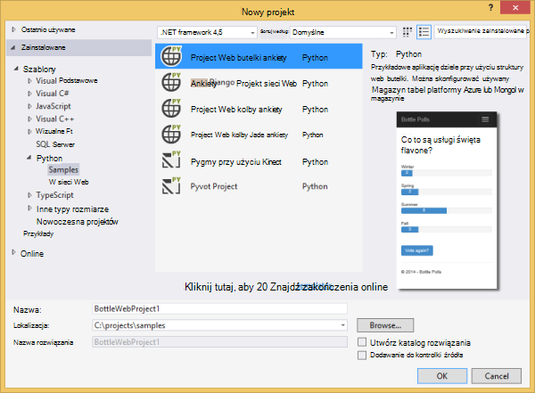

1.  Możesz zostanie wyświetlony monit o zainstalowanie zewnętrznych pakietów. Wybierz pozycję **Zainstaluj w środowisku wirtualną**.

    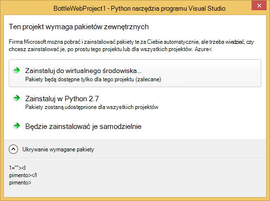

1.  Wybierz pozycję **Python 2.7** lub **Python 3.4** jako podstawa interpretera.

    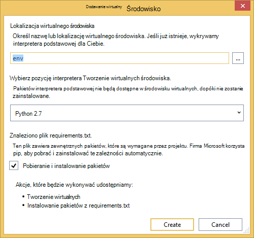

1.  Upewnij się, że aplikacja działa, naciskając klawisz `F5`. Domyślnie aplikacja używa repozytorium w pamięci, które nie wymaga konfiguracji. Wszystkie dane zostaną utracone po zatrzymaniu serwer sieci web.

1.  Kliknij pozycję **Tworzenie ankiety próbki**, a następnie kliknij na ankietę i głosowania.

    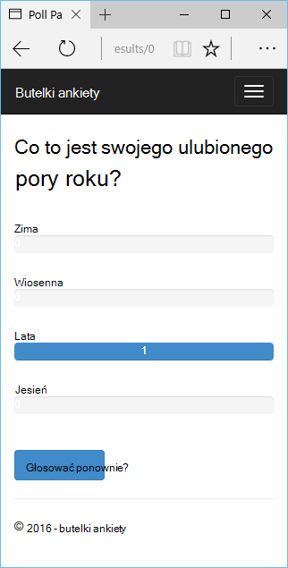

## Utwórz konto Azure miejsca do magazynowania

Aby użyć operacji miejsca do magazynowania, potrzebne jest konto Azure miejsca do magazynowania. Możesz utworzyć konta miejsca do magazynowania, wykonując następujące kroki.

1.  Logowanie do [portalu Azure](https://portal.azure.com/).

1. Kliknij ikonę **Nowy** w górnym lewym rogu portalu, a następnie kliknij **danych + miejsca do magazynowania** > **Konta miejsca do magazynowania**.  Kliknij przycisk **Utwórz** , a następnie określ unikatową nazwę konta magazynu i tworzenie nowej [grupy zasobów](../azure-resource-manager/resource-group-overview.md) dla niego.

    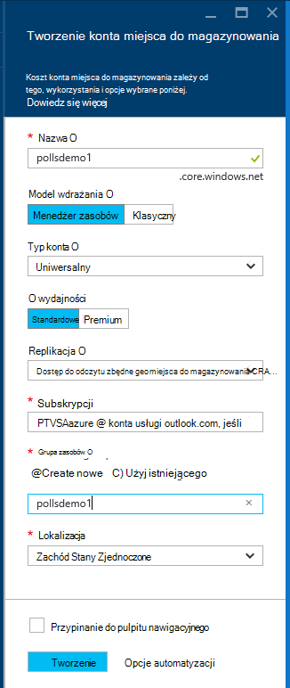

    Po utworzeniu konta miejsca do magazynowania przycisk **powiadomienia** zostaną flash zielony **SUKCESU** i karta konta miejsca do magazynowania jest otwarty, aby pokazać, że należy go do nowej grupy zasobów utworzonej.

1. Kliknij część **klawiszy dostępu** karta konta miejsca do magazynowania. Zanotuj nazwę konta i klucz1.

    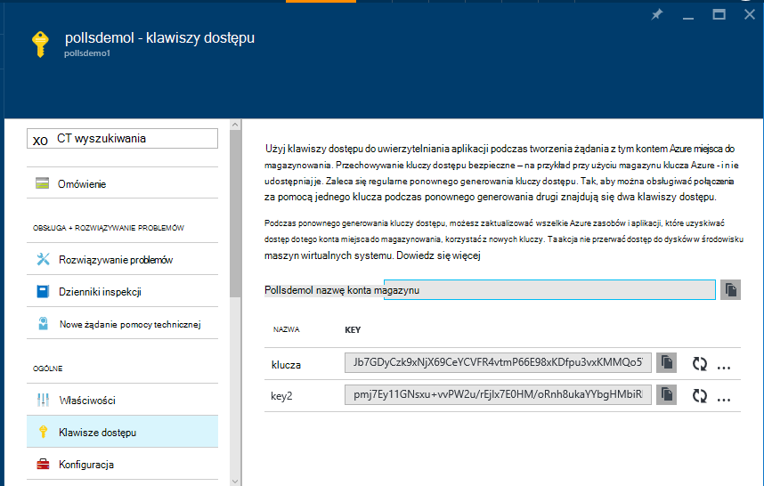

    Potrzebujemy te informacje, aby skonfigurować projektu w następnej sekcji.

## Konfigurowanie projektu

W tej sekcji firma Microsoft będzie skonfigurować naszych aplikacji w celu korzystania z konta miejsca do magazynowania, który właśnie utworzony. Następnie firma Microsoft będzie uruchomić aplikację lokalnie.

1.  W programie Visual Studio kliknij prawym przyciskiem myszy węzeł projektu w Eksploratorze rozwiązań i wybierz polecenie **Właściwości**. Kliknij kartę **Debugowanie** .

    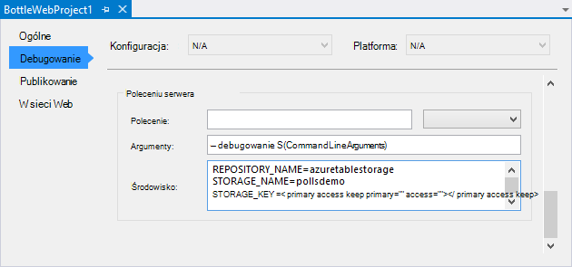

1.  Ustawianie wartości zmiennych środowiska wymagane przez aplikację w **Debugowanie polecenia Server** **środowiska**.

        REPOSITORY_NAME=azuretablestorage
        STORAGE_NAME=<storage account name>
        STORAGE_KEY=<primary access key>

    Spowoduje to ustawienie zmienne środowiska po możesz **Rozpocząć debugowanie**. Jeśli chcesz, aby zmiennych można określić, kiedy można **Rozpocząć bez debugowania**, ustawianie tych samych wartości w obszarze **Polecenia Uruchom serwer** także.

    Ponadto można zdefiniować zmiennych środowiska za pomocą Panelu sterowania systemu Windows. To jest lepszym rozwiązaniem, jeśli chcesz uniknąć przechowywanie poświadczeń w kodu źródłowego / pliku projektu. Należy zauważyć, że będzie konieczne ponowne uruchomienie programu Visual Studio dla nowych wartości środowiska mają być dostępne dla aplikacji.

1.  Kod, który wykonuje repozytorium magazyn tabel platformy Azure znajduje się w **models/azuretablestorage.py**. Zobacz [dokumentację] , aby uzyskać więcej informacji na temat używania usługi tabeli z Python.

1.  Uruchom aplikację z `F5`. Ankiety utworzone za pomocą **Tworzenie ankiety próbki** i dane wysyłane przez głosowanie będą szeregowo w magazynie tabel platformy Azure.

    > [AZURE.NOTE] Środowisko wirtualne 2.7 Python może spowodować podział wyjątku w programie Visual Studio.  Naciśnij klawisz `F5` do kontynuowania ładowania projektu sieci web. 

1.  Przejdź do strony **o** , aby sprawdzić, czy aplikacja używa repozytorium **Magazyn tabel platformy Azure** .

    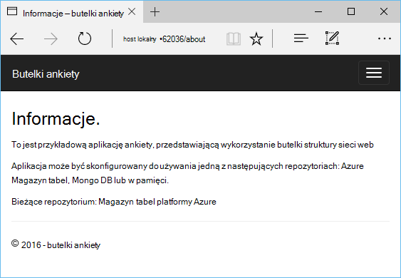

## Eksplorowanie magazyn tabel platformy Azure

Jest łatwe do wyświetlania i edytowania tabel miejsca do magazynowania przy użyciu Eksploratora chmury w programie Visual Studio. W tej sekcji użyjemy Server Explorer na wyświetlanie zawartości tabel aplikacji ankiety.

> [AZURE.NOTE] W tym celu Microsoft Azure Tools musi być zainstalowany, które są dostępne jako część [SDK Azure dla środowiska .NET].

1.  Otwórz **Eksploratora chmury**. Rozwijanie **Kont miejsca do magazynowania**, konto miejsca do magazynowania, a następnie **tabel**.

    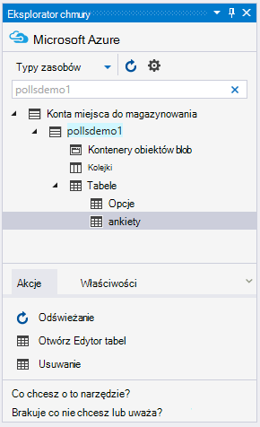

1.  Kliknij dwukrotnie na tabeli **ankiety** lub **opcji** , aby wyświetlić zawartość tabeli w oknie dokumentu, a także podmioty Dodaj/Usuń i Edytuj.

    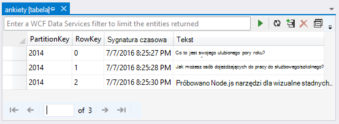

## Publikowanie aplikacji sieci web w usłudze Azure aplikacji

Zestaw SDK programu .NET Azure zawiera łatwym sposobem wdrażanie aplikacji sieci web do usługi aplikacji Azure.

1.  W **Eksploratorze rozwiązań**kliknij prawym przyciskiem myszy węzeł projektu i wybierz pozycję **Publikuj**.

    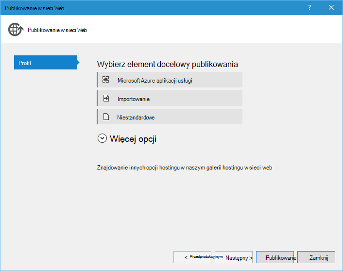

1.  Kliknij pozycję **Microsoft Azure aplikacje sieci Web**.

1.  Wybierz polecenie **Nowy** , aby utworzyć nową aplikację sieci web.

1.  Wypełnij następujące pola i kliknij przycisk **Utwórz**.
    -   **Nazwa aplikacji sieci Web**
    -   **Plan usług aplikacji**
    -   **Grupa zasobów**
    -   **Region**
    -   Pozostaw **serwer bazy danych** do **żadnej bazy danych**

1.  Zaakceptuj wszystkie inne ustawienia domyślne i kliknij pozycję **Publikuj**.

1.  Przeglądarki sieci web zostanie otwarty automatycznie aplikacji sieci web opublikowane. Po przejściu do strony, informacje widoczne korzysta z repozytorium **W pamięci** , nie repozytorium **Magazyn tabel platformy Azure** .

    Jest tak, ponieważ zmienne środowiska nie są ustawione na wystąpienie aplikacji sieci Web w usłudze Azure aplikacji, więc używa wartości domyślne określone w **settings.py**.

## Skonfiguruj wystąpienie aplikacji sieci Web

W tej sekcji firma Microsoft będzie skonfigurować środowisko zmienne dla danego wystąpienia aplikacji sieci Web.

1.  W [Azure Portal], otwórz karta aplikacji sieci web, klikając przycisk **Przeglądaj** > **Aplikacji usług** > nazwy aplikacji sieci web.

1.  W aplikacji sieci web karta kliknij polecenie **Wszystkie ustawienia**, a następnie kliknij pozycję **Ustawienia aplikacji**.

1.  Przewiń w dół do sekcji **Ustawienia aplikacji** i ustaw wartości dla **REPOZYTORIUM\_nazwa**, **miejsca do magazynowania\_nazwy** i **miejsca do magazynowania\_klucza** zgodnie z opisem w poprzedniej sekcji **Konfigurowanie projektu** .

    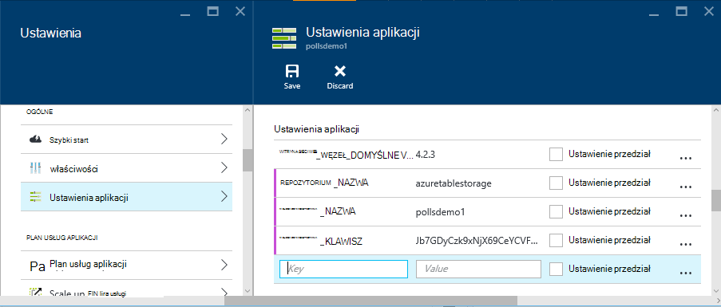

1.  Wybierz polecenie **Zapisz**. Po otrzymaniu powiadomienia, czy zmiany zostały zastosowane, kliknij na **Przeglądanie** z karta głównym aplikacji sieci Web.

1.  Powinien zostać wyświetlony aplikacji sieci web działają zgodnie z oczekiwaniami, przy użyciu repozytorium **Magazyn tabel platformy Azure** .

    Gratulacje!

    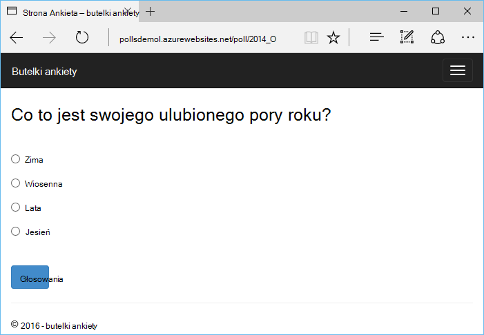

## Następne kroki

Wykonaj te łącza, aby dowiedzieć się więcej o narzędziach Python dla programu Visual Studio, butelki i Magazyn tabel platformy Azure.

- [Narzędzia Python dokumentacji programu Visual Studio]
  - [Projekty sieci Web]
  - [Projekty usługi w chmurze]
  - [Zdalne debugowanie na platformy Microsoft Azure]
- [Butelki dokumentacji]
- [Azure miejsca do magazynowania]
- [Azure SDK dla Python]
- [Jak korzystać z usług przechowywania tabeli Python]

## Informacje o zmianach
* Przewodnika do zmiany z witryn sieci Web do usługi aplikacji Zobacz: [Usługa Azure aplikacji i jego wpływ na istniejące usługi Azure](http://go.microsoft.com/fwlink/?LinkId=529714)

<!--Link references-->
[Centrum deweloperów Python]: /develop/python/
[Usług w chmurze Azure]: ../cloud-services-python-ptvs.md
[Dokumentacja]: ../storage-python-how-to-use-table-storage.md
[Jak korzystać z usług przechowywania tabeli Python]: ../storage-python-how-to-use-table-storage.md

<!--External Link references-->
[Azure Portal]: https://portal.azure.com
[Azure SDK dla środowiska .NET]: http://azure.microsoft.com/downloads/
[Narzędzia Python programu Visual Studio]: http://aka.ms/ptvs
[Python narzędzia 2.2 programu Visual Studio]: http://go.microsoft.com/fwlink/?LinkId=624025
[Python narzędzi 2.2 przykłady Visual Studio VSIX]: http://go.microsoft.com/fwlink/?LinkId=624025
[Narzędzia Azure SDK w PORÓWNANIU z 2015 r.]: http://go.microsoft.com/fwlink/?LinkId=518003
[Python 2.7 32-bitowej]: http://go.microsoft.com/fwlink/?LinkId=517190 
[Python 3.4 32-bitowej]: http://go.microsoft.com/fwlink/?LinkId=517191
[Narzędzia Python dokumentacji programu Visual Studio]: http://aka.ms/ptvsdocs
[Butelki dokumentacji]: http://bottlepy.org/docs/dev/index.html
[Zdalne debugowanie na platformy Microsoft Azure]: http://go.microsoft.com/fwlink/?LinkId=624026
[Projekty sieci Web]: http://go.microsoft.com/fwlink/?LinkId=624027
[Projekty usługi w chmurze]: http://go.microsoft.com/fwlink/?LinkId=624028
[Azure miejsca do magazynowania]: http://azure.microsoft.com/documentation/services/storage/
[Azure SDK dla Python]: https://github.com/Azure/azure-sdk-for-python
 
