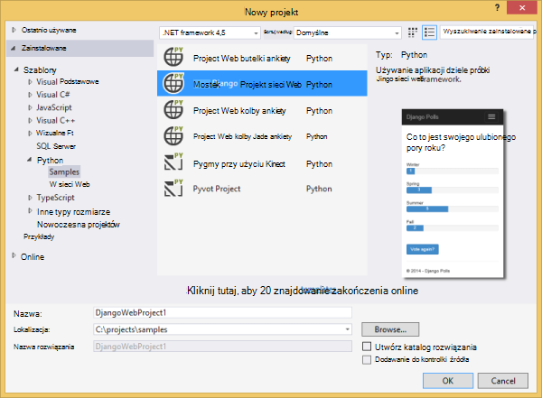
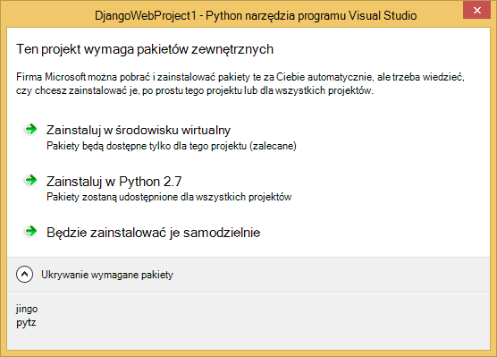
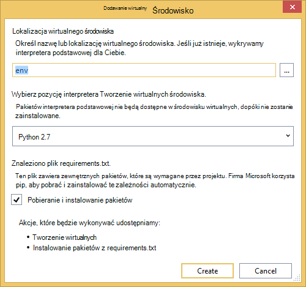
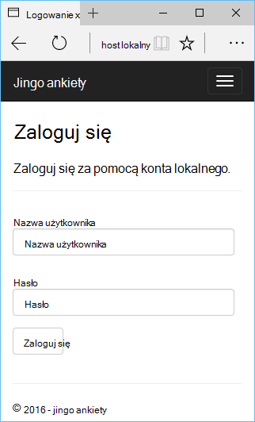
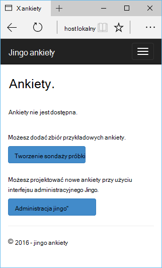
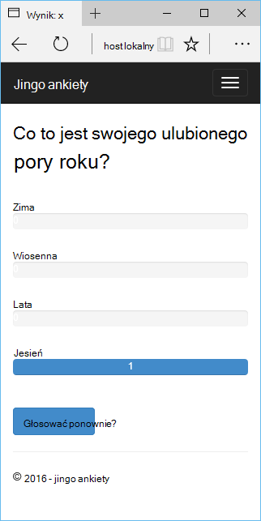
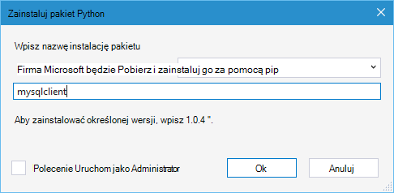
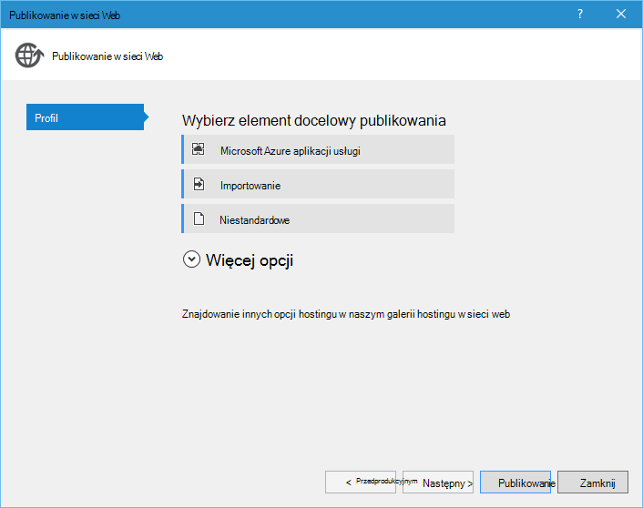
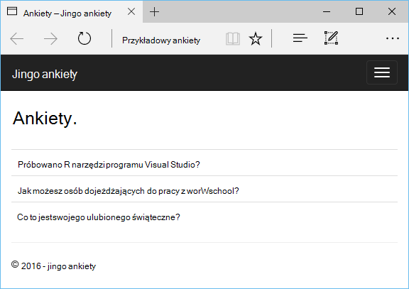

<properties 
    pageTitle="Django i MySQL Azure narzędziami Python 2.2 programu Visual Studio" 
    description="Dowiedz się, jak używać narzędzia Python programu Visual Studio do tworzenia aplikacji sieci web Django są przechowywane dane w wystąpieniu bazy danych MySQL i Wdroż Azure aplikacji usługi sieci Web." 
    services="app-service\web" 
    documentationCenter="python" 
    authors="huguesv" 
    manager="wpickett" 
    editor=""/>

<tags 
    ms.service="app-service-web" 
    ms.workload="web" 
    ms.tgt_pltfrm="na" 
    ms.devlang="python"
    ms.topic="get-started-article" 
    ms.date="07/07/2016"
    ms.author="huvalo"/>

# Django i MySQL Azure narzędziami Python 2.2 programu Visual Studio 

[AZURE.INCLUDE [tabs](../../includes/app-service-web-get-started-nav-tabs.md)]

W tym samouczku za pomocą [Narzędzia Python programu Visual Studio] (PTVS) tworzysz aplikację sieci web prosty ankiet przy użyciu jednego z PTVS przykładowe szablony. Dowiesz się, jak używać usługi MySQL hostowanej Azure, sposobu konfigurowania aplikacji sieci web, aby użyć MySQL i jak publikowanie aplikacji sieci web [Azure aplikacji usługi sieci Web](http://go.microsoft.com/fwlink/?LinkId=529714).

> [AZURE.NOTE] Informacje zawarte w tym samouczku jest również dostępne w poniższym klipie wideo:
> 
> [PTVS 2.1: Django aplikacji z MySQL][video]

Zobacz [Centrum deweloperów Python] dla więcej artykułów, które obejmują rozwoju Azure usługi sieci Web aplikacji z PTVS butelki, kolby i Django struktury sieci web za pomocą usługi Magazyn tabel platformy Azure, MySQL i baza danych SQL. W tym artykule omówiono aplikacji usługi, czynności są podobne podczas tworzenia [Usług w chmurze Azure].

## Wymagania wstępne

 - Visual Studio 2015 r.
 - [Python 2.7 32-bitowej] lub [Python 3.4 32-bitowej]
 - [Python narzędzia 2.2 programu Visual Studio]
 - [Python narzędzi 2.2 przykłady Visual Studio VSIX]
 - [Narzędzia Azure SDK w PORÓWNANIU z 2015 r.]
 - Django 1,9 lub nowszy

[AZURE.INCLUDE [create-account-and-websites-note](../../includes/create-account-and-websites-note.md)]

<!-- This note should not render as part of the the previous include. -->

> [AZURE.NOTE] Jeśli chcesz rozpocząć pracę z Azure aplikacji usługi przed utworzeniem konta dla konta Azure, przejdź do [Spróbuj aplikacji usługi](http://go.microsoft.com/fwlink/?LinkId=523751), którym natychmiast można utworzyć aplikację sieci web krótkotrwałe starter w aplikacji usługi. Karta kredytowa nie jest wymagane, a nie zobowiązania są wymagane.

## Tworzenie projektu

W tej sekcji utworzysz projektu programu Visual Studio przy użyciu szablonu próbki. Można tworzyć środowisko wirtualne i zainstalować pakiety wymagane. Utworzysz lokalną bazę danych przy użyciu sqlite. Następnie będzie lokalnie uruchomić aplikację.

1. W programie Visual Studio zaznacz **plik**, **Nowy projekt**.

1. Szablony programu project z [Python 2.2 narzędzia dla programu Visual Studio próbki VSIX] są dostępne w obszarze **Python**, **próbki**. Wybierz **Projekt Web Django ankiety** i kliknij przycisk OK, aby utworzyć projekt.

    

1. Możesz zostanie wyświetlony monit o zainstalowanie zewnętrznych pakietów. Wybierz pozycję **Zainstaluj w środowisku wirtualną**.

    

1. Wybierz pozycję **Python 2.7** lub **Python 3.4** jako podstawa interpretera.

    

1. W **Eksploratorze rozwiązań**kliknij prawym przyciskiem myszy węzeł projektu i wybierz **Python**, a następnie wybierz pozycję **Migracja Django**.  Następnie wybierz pozycję **Django Tworzenie administratora**.

1. To otwarcie konsoli zarządzania Django i utworzyć bazę danych sqlite w folderze projektu. Postępuj zgodnie z instrukcjami, aby utworzyć użytkownika.

1. Upewnij się, że aplikacja działa, naciskając klawisz `F5`.

1. Kliknij pozycję **Zaloguj się** na pasku nawigacyjnym u góry.

    

1. Wprowadź poświadczenia dla użytkownika, którego utworzono podczas synchronizacji bazy danych.

    

1. Kliknij przycisk **Utwórz przykładowe ankiety**.

    

1. Kliknij na ankietę i głosowania.

    

## Tworzenie bazy danych MySQL

W bazie danych utworzysz hostowanej bazy danych ClearDB MySQL Azure.

Alternatywnym można tworzyć własne maszyny wirtualnej działa Azure, a następnie zainstalować i administrowanie MySQL samodzielnie.

Bazy danych można utworzyć z planem bezpłatne, wykonując następujące kroki.

1. Zaloguj się do [portalu Azure].

1. W górnej części okienka nawigacji kliknij przycisk **Nowy**, a następnie kliknij **danych + miejsca do magazynowania**, a następnie kliknij **Bazy danych MySQL**. 

1. Konfigurowanie nowej bazy danych MySQL przez utworzenie nowej grupy zasobów i wybierz odpowiednią lokalizację dla niego.

1. Po utworzeniu bazy danych MySQL, kliknij polecenie **Właściwości** w karta bazy danych.

1. Użyj przycisku Kopiuj, aby umieścić wartości **Parametrów połączenia** ze Schowka.

## Konfigurowanie projektu

W tej sekcji będzie skonfigurować naszych aplikacji sieci web do bazy danych MySQL właśnie utworzonego. Będzie również zainstalować dodatkowe pakiety Python wymaganych do bazy danych MySQL za pomocą Django. Następnie będzie lokalnie uruchomić aplikacji sieci web.

1. W programie Visual Studio Otwórz **settings.py**z folderu *NazwaProjektu* . W edytorze tymczasowo Wklej parametry połączenia. Parametry połączenia znajduje się w następującym formacie:

        Database=<NAME>;Data Source=<HOST>;User Id=<USER>;Password=<PASSWORD>

    Zmienianie domyślnej bazy danych MySQL za pomocą **aparatu** i ustaw wartości dla **nazwy**, **użytkownika**, **hasło** i **hosta** z **CONNECTIONSTRING**.

        DATABASES = {
            'default': {
                'ENGINE': 'django.db.backends.mysql',
                'NAME': '<Database>',
                'USER': '<User Id>',
                'PASSWORD': '<Password>',
                'HOST': '<Data Source>',
                'PORT': '',
            }
        }

1. W Eksploratorze rozwiązań w **Środowiskach Python**kliknij prawym przyciskiem myszy wirtualnego środowiska i wybierz pozycję **Zainstaluj pakiet Python**.

1. Zainstaluj pakiet `mysqlclient` przy użyciu **pip**.

    

1. W **Eksploratorze rozwiązań**kliknij prawym przyciskiem myszy węzeł projektu i wybierz **Python**, a następnie wybierz pozycję **Migracja Django**.  Następnie wybierz pozycję **Django Tworzenie administratora**.

    Spowoduje to utworzenie tabel dla bazy danych MySQL, utworzonego w poprzedniej sekcji. Postępuj zgodnie z instrukcjami, aby utworzyć użytkownika, która nie musi być zgodne użytkownika w bazie danych sqlite utworzone w pierwszej sekcji tego artykułu.

1. Uruchom aplikację z `F5`. Ankiety utworzone za pomocą **Tworzenie ankiety próbki** i dane wysyłane przez głosowanie będą szeregowo bazy danych MySQL.

## Publikowanie aplikacji sieci web w usłudze Azure aplikacji

Zestaw SDK programu .NET Azure zawiera łatwym sposobem wdrażanie aplikacji sieci web do usługi aplikacji Azure.

1. W **Eksploratorze rozwiązań**kliknij prawym przyciskiem myszy węzeł projektu i wybierz pozycję **Publikuj**.

    

1. Kliknij polecenie **Microsoft Azure aplikacji usługi**.

1. Wybierz polecenie **Nowy** , aby utworzyć nową aplikację sieci web.

1. Wypełnij następujące pola, a następnie kliknij przycisk **Utwórz**:
    - **Nazwa aplikacji sieci Web**
    - **Plan usług aplikacji**
    - **Grupa zasobów**
    - **Region**
    - Pozostaw **serwer bazy danych** do **żadnej bazy danych**

1. Zaakceptuj wszystkie inne ustawienia domyślne i kliknij pozycję **Publikuj**.

1. Przeglądarki sieci web zostanie otwarty automatycznie aplikacji sieci web opublikowane. Powinien zostać wyświetlony aplikacji sieci web działają zgodnie z oczekiwaniami, za pomocą bazy danych **MySQL** , obsługiwanej Azure.

    

    Gratulacje! Został pomyślnie opublikowany aplikacji sieci web opartych na MySQL Azure.

## Następne kroki

Wykonaj te łącza, aby dowiedzieć się więcej o narzędziach Python dla programu Visual Studio, Django i MySQL.

- [Narzędzia Python dokumentacji programu Visual Studio]
  - [Projekty sieci Web]
  - [Projekty usługi w chmurze]
  - [Zdalne debugowanie na platformy Microsoft Azure]
- [Dokumentacja Django]
- [MySQL]

Aby uzyskać więcej informacji zobacz [Centrum deweloperów Python](/develop/python/).

<!--Link references-->

[Centrum deweloperów Python]: /develop/python/
[Usług w chmurze Azure]: ../cloud-services-python-ptvs.md

<!--External Link references-->

[Azure Portal]: https://portal.azure.com
[Narzędzia Python programu Visual Studio]: http://aka.ms/ptvs
[Python narzędzia 2.2 programu Visual Studio]: http://go.microsoft.com/fwlink/?LinkID=624025
[Python narzędzi 2.2 przykłady Visual Studio VSIX]: http://go.microsoft.com/fwlink/?LinkID=624025
[Narzędzia Azure SDK w PORÓWNANIU z 2015 r.]: http://go.microsoft.com/fwlink/?LinkId=518003
[Python 2.7 32-bitowej]: http://go.microsoft.com/fwlink/?LinkId=517190 
[Python 3.4 32-bitowej]: http://go.microsoft.com/fwlink/?LinkId=517191
[Narzędzia Python dokumentacji programu Visual Studio]: http://aka.ms/ptvsdocs
[Zdalne debugowanie na platformy Microsoft Azure]: http://go.microsoft.com/fwlink/?LinkId=624026
[Projekty sieci Web]: http://go.microsoft.com/fwlink/?LinkId=624027
[Projekty usługi w chmurze]: http://go.microsoft.com/fwlink/?LinkId=624028
[Dokumentacja Django]: https://www.djangoproject.com/
[MySQL]: http://www.mysql.com/
[video]: http://youtu.be/oKCApIrS0Lo
