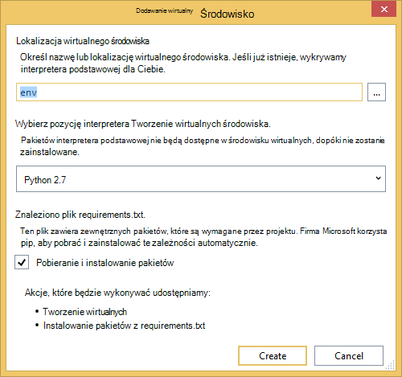
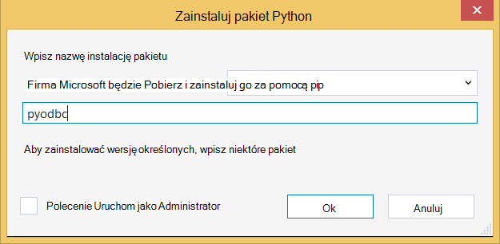

<properties 
    pageTitle="Django i baza danych SQL Azure, korzystając z narzędzi Python 2.2 programu Visual Studio" 
    description="Dowiedz się, jak używać narzędzia Python programu Visual Studio do tworzenia aplikacji sieci web Django są przechowywane dane w wystąpieniu bazy danych SQL i Wdroż Azure aplikacji usługi sieci Web." 
    services="app-service\web" 
    tags="python"
    documentationCenter="python" 
    authors="huguesv" 
    manager="wpickett" 
    editor=""/>

<tags 
    ms.service="app-service-web" 
    ms.workload="web" 
    ms.tgt_pltfrm="na" 
    ms.devlang="python" 
    ms.topic="article" 
    ms.date="07/07/2016"
    ms.author="huguesv"/>

# Django i baza danych SQL Azure, korzystając z narzędzi Python 2.2 programu Visual Studio 

W tym samouczku użyjemy [Python Tools for Visual Studio] celu utworzenia prostej ankiet aplikacji sieci web przy użyciu jednego z PTVS przykładowe szablony. Ten samouczek jest także dostępny jako [wideo](https://www.youtube.com/watch?v=ZwcoGcIeHF4).

Firma Microsoft dowiesz się, jak korzystać z bazą danych SQL hostowanej Azure, jak skonfigurować aplikację sieci web, aby korzystać z bazą danych SQL oraz jak publikowanie aplikacji sieci web [Azure aplikacji usługi sieci Web](http://go.microsoft.com/fwlink/?LinkId=529714).

Zobacz [Centrum deweloperów Python] dla więcej artykułów, które obejmują rozwoju Azure usługi sieci Web aplikacji z PTVS butelki, kolby i Django struktury sieci web za pomocą usługi Magazyn tabel platformy Azure, MySQL i baza danych SQL. W tym artykule omówiono aplikacji usługi, czynności są podobne podczas tworzenia [Usług w chmurze Azure].

## Wymagania wstępne

 - Visual Studio 2015 r.
 - [Python 2.7 32-bitowej]
 - [Python narzędzia 2.2 programu Visual Studio]
 - [Python narzędzi 2.2 przykłady Visual Studio VSIX]
 - [Narzędzia Azure SDK w PORÓWNANIU z 2015 r.]
 - Django 1,9 lub nowszy

[AZURE.INCLUDE [create-account-and-websites-note](../../includes/create-account-and-websites-note.md)]

>[AZURE.NOTE] Jeśli chcesz rozpocząć pracę z Azure aplikacji usługi przed utworzeniem konta dla konta Azure, przejdź do [Spróbuj aplikacji usługi](http://go.microsoft.com/fwlink/?LinkId=523751), którym natychmiast można utworzyć aplikację sieci web krótkotrwałe starter w aplikacji usługi. Nie kart kredytowych wymagane; nie zobowiązania.

## Tworzenie projektu

W tej sekcji utworzymy projektu programu Visual Studio przy użyciu szablonu próbki. Firma Microsoft będzie tworzyć środowisko wirtualne i zainstaluj wymagane pakiety. Utworzymy lokalnej bazy danych przy użyciu sqlite. Następnie możemy lokalnie uruchamiany aplikacji sieci web.

1.  W programie Visual Studio zaznacz **plik**, **Nowy projekt**.

1.  Szablony programu project z [Python 2.2 narzędzia dla programu Visual Studio próbki VSIX] są dostępne w obszarze **Python**, **próbki**. Wybierz **Projekt Web Django ankiety** i kliknij przycisk OK, aby utworzyć projekt.

    

1.  Możesz zostanie wyświetlony monit o zainstalowanie zewnętrznych pakietów. Wybierz pozycję **Zainstaluj w środowisku wirtualną**.

    

1.  Wybierz pozycję **Python 2.7** jako podstawa interpretera.

    

1.  W **Eksploratorze rozwiązań**kliknij prawym przyciskiem myszy węzeł projektu i wybierz **Python**, a następnie wybierz pozycję **Migracja Django**.  Następnie wybierz pozycję **Django Tworzenie administratora**.

1.  To otwarcie konsoli zarządzania Django i utworzyć bazę danych sqlite w folderze projektu. Postępuj zgodnie z instrukcjami, aby utworzyć użytkownika.

1.  Upewnij się, że aplikacja działa, naciskając klawisz <kbd>F5</kbd>.

1.  Kliknij pozycję **Zaloguj się** na pasku nawigacyjnym u góry.

    

1.  Wprowadź poświadczenia dla użytkownika, którego utworzono podczas synchronizacji bazy danych.

    

1.  Kliknij przycisk **Utwórz przykładowe ankiety**.

    

1.  Kliknij ankiety i głosowania.

    

## Tworzenie bazy danych SQL

W bazie danych utworzymy bazy danych programu Azure SQL.

Bazy danych można utworzyć, wykonując następujące kroki.

1.  Logowanie do [portalu Azure].

1.  U dołu okienka nawigacji kliknij przycisk **Nowy**. , kliknij pozycję **dane + miejsca do magazynowania** > **Bazy danych SQL**.

1.  Konfigurowanie nowej bazy danych SQL przez utworzenie nowej grupy zasobów i wybierz odpowiednią lokalizację dla niego.

1.  Po utworzeniu bazy danych SQL, kliknij przycisk **Otwórz w programie Visual Studio** w karta bazy danych.
2.  Kliknij przycisk **Konfiguruj zapory**.
3.  W karta **Ustawienia zapory** Dodaj zestawu reguł zapory z **IP rozpoczęcie** i **Koniec IP** publiczny adres IP komputera rozwoju. Kliknij przycisk **Zapisz**.

    Dzięki temu będzie połączenia z serwerem bazy danych z komputera rozwoju.

4.  W programie karta bazy danych kliknij polecenie **Właściwości**, a następnie kliknij przycisk **Pokaż parametry połączenia bazy danych**. 

2.  Użyj przycisku Kopiuj, aby umieścić wartość **ADO.NET** w Schowku.

## Konfigurowanie projektu

W tej sekcji firma Microsoft będzie skonfigurować naszych aplikację sieci web, aby korzystać z bazy danych SQL, który właśnie utworzony. Firma Microsoft będzie również zainstalować dodatkowe pakiety Python wymaganych do bazy danych SQL za pomocą Django. Następnie możemy lokalnie uruchamiany aplikacji sieci web.

1.  W programie Visual Studio Otwórz **settings.py**z folderu *NazwaProjektu* . W edytorze tymczasowo Wklej parametry połączenia. Parametry połączenia znajduje się w następującym formacie:

        Server=<ServerName>,<ServerPort>;Database=<DatabaseName>;User ID=<UserName>;Password={your_password_here};Encrypt=True;TrustServerCertificate=False;Connection Timeout=30;

Edytowanie definicji `DATABASES` Aby użyć wartości powyżej.

        DATABASES = {
            'default': {
                'ENGINE': 'sql_server.pyodbc',
                'NAME': '<DatabaseName>',
                'USER': '<UserName>',
                'PASSWORD': '{your_password_here}',
                'HOST': '<ServerName>',
                'PORT': '<ServerPort>',
                'OPTIONS': {
                    'driver': 'SQL Server Native Client 11.0',
                    'MARS_Connection': 'True',
                }
            }
        }

1.  W Eksploratorze rozwiązań w **Środowiskach Python**kliknij prawym przyciskiem myszy wirtualnego środowiska i wybierz pozycję **Zainstaluj pakiet Python**.

1.  Zainstaluj pakiet `pyodbc` przy użyciu **pip**.

    

1.  Zainstaluj pakiet `django-pyodbc-azure` przy użyciu **pip**.

    

1.  W **Eksploratorze rozwiązań**kliknij prawym przyciskiem myszy węzeł projektu i wybierz **Python**, a następnie wybierz pozycję **Migracja Django**.  Następnie wybierz pozycję **Django Tworzenie administratora**.

    Spowoduje to utworzenie tabel dla bazy danych SQL utworzonego w poprzedniej sekcji. Postępuj zgodnie z instrukcjami, aby utworzyć użytkownika, która nie musi być zgodne użytkownika w bazie danych sqlite utworzone w pierwszej sekcji.

1.  Uruchom aplikację z `F5`. Ankiety utworzone za pomocą **Tworzenie ankiety próbki** i dane wysyłane przez głosowanie będą szeregowo w bazie danych SQL.

## Publikowanie aplikacji sieci web w usłudze Azure aplikacji

Zestaw SDK programu .NET Azure zawiera łatwym sposobem wdrażanie aplikacji sieci web w sieci web Azure aplikacji usługi sieci Web.

1.  W **Eksploratorze rozwiązań**kliknij prawym przyciskiem myszy węzeł projektu i wybierz pozycję **Publikuj**.

    

1.  Kliknij pozycję **Microsoft Azure aplikacje sieci Web**.

1.  Wybierz polecenie **Nowy** , aby utworzyć nową aplikację sieci web.

1.  Wypełnij następujące pola i kliknij przycisk **Utwórz**.
    -   **Nazwa aplikacji sieci Web**
    -   **Plan usług aplikacji**
    -   **Grupa zasobów**
    -   **Region**
    -   Pozostaw **serwer bazy danych** do **żadnej bazy danych**

1.  Zaakceptuj wszystkie inne ustawienia domyślne i kliknij pozycję **Publikuj**.

1.  Przeglądarki sieci web zostanie otwarty automatycznie aplikacji sieci web opublikowane. Powinien zostać wyświetlony aplikacji sieci web działa zgodnie z oczekiwaniami, za pomocą bazy danych **SQL** hostowanej Azure.

    Gratulacje!

    

## Następne kroki

Wykonaj te łącza, aby dowiedzieć się więcej o narzędziach Python dla programu Visual Studio, Django i baza danych SQL.

- [Narzędzia Python dokumentacji programu Visual Studio]
  - [Projekty sieci Web]
  - [Projekty usługi w chmurze]
  - [Zdalne debugowanie na platformy Microsoft Azure]
- [Dokumentacja Django]
- [Baza danych SQL]

## Informacje o zmianach
* Przewodnika do zmiany z witryn sieci Web do usługi aplikacji Zobacz: [Usługa Azure aplikacji i jego wpływ na istniejące usługi Azure](http://go.microsoft.com/fwlink/?LinkId=529714)

<!--Link references-->
[Centrum deweloperów Python]: /develop/python/
[Usług w chmurze Azure]: ../cloud-services-python-ptvs.md

<!--External Link references-->
[Azure Portal]: https://portal.azure.com
[Narzędzia Python programu Visual Studio]: http://aka.ms/ptvs
[Python narzędzia 2.2 programu Visual Studio]: http://go.microsoft.com/fwlink/?LinkID=624025
[Python narzędzi 2.2 przykłady Visual Studio VSIX]: http://go.microsoft.com/fwlink/?LinkID=624025
[Narzędzia Azure SDK w PORÓWNANIU z 2015 r.]: http://go.microsoft.com/fwlink/?LinkId=518003
[Python 2.7 32-bitowej]: http://go.microsoft.com/fwlink/?LinkId=517190 
[Narzędzia Python dokumentacji programu Visual Studio]: http://aka.ms/ptvsdocs
[Zdalne debugowanie na platformy Microsoft Azure]: http://go.microsoft.com/fwlink/?LinkId=624026
[Projekty sieci Web]: http://go.microsoft.com/fwlink/?LinkId=624027
[Projekty usługi w chmurze]: http://go.microsoft.com/fwlink/?LinkId=624028
[Dokumentacja Django]: https://www.djangoproject.com/
[Baza danych SQL]: /documentation/services/sql-database/
