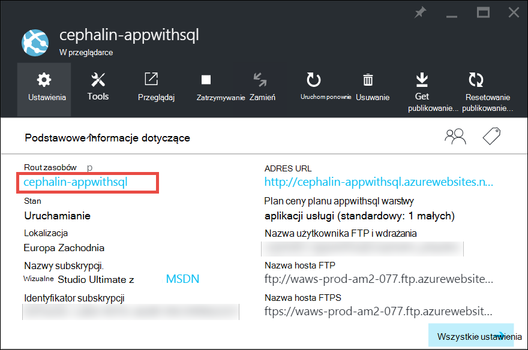
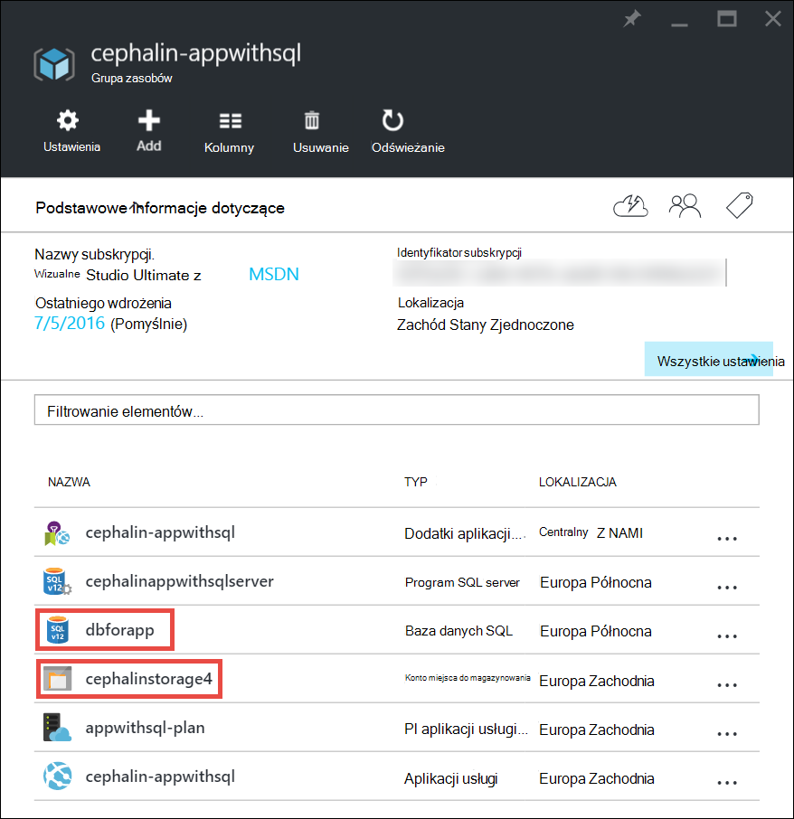
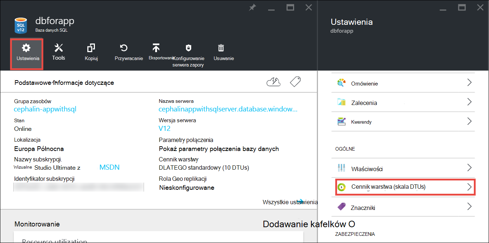
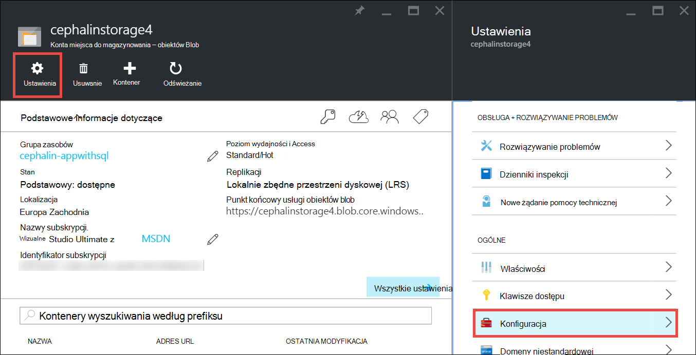

<properties
    pageTitle="Rozbudowy aplikacji platformy Azure | Microsoft Azure"
    description="Dowiedz się, jak rozbudowy aplikacji w usłudze aplikacji Azure do dodawania wydajność i funkcji."
    services="app-service"
    documentationCenter=""
    authors="cephalin"
    manager="wpickett"
    editor="mollybos"/>

<tags
    ms.service="app-service"
    ms.workload="na"
    ms.tgt_pltfrm="na"
    ms.devlang="na"
    ms.topic="article"
    ms.date="07/05/2016"
    ms.author="cephalin"/>

# Rozbudowy aplikacji platformy Azure #

W tym artykule pokazano, jak skalowanie aplikacji w usłudze Azure aplikacji. Istnieją dwa przepływy pracy dla skali skalowanie, w górę i skalę się i w tym artykule wyjaśniono, skali zapasowych przepływu pracy.

- [Rozbudowy](https://en.wikipedia.org/wiki/Scalability#Horizontal_and_vertical_scaling): Uzyskaj więcej Procesora, pamięci, miejsca na dysku i dodatkowe funkcje, takie jak dedykowane wirtualnych maszyn, domen niestandardowych i certyfikatów, przemieszczenia gniazda, autoscaling i innych elementów. Skalowanie w górę, zmieniając warstwie cennik plan usług aplikacji, należący do aplikacji.
- [Skala się](https://en.wikipedia.org/wiki/Scalability#Horizontal_and_vertical_scaling): Zwiększ liczbę wystąpień maszyn wirtualnych, które uruchamianie aplikacji.
Można skalować się maksymalnie 20 wystąpienia, w zależności od usługi cennik warstwy. [Środowiska usługi aplikacji](../app-service/app-service-app-service-environments-readme.md) w warstwie **Premium** Dodatkowo wzrośnie liczba poza skalowanie do 50 wystąpień. Aby uzyskać więcej informacji na temat Skalowanie zewnętrzne zobacz [Skalowanie licznik wystąpień ręcznie lub automatycznie](../monitoring-and-diagnostics/insights-how-to-scale.md). Można znaleźć informacje o tym, jak za pomocą autoscaling, czyli przeskalować licznik wystąpień automatycznie na podstawie wstępnie zdefiniowanych reguł i harmonogramów.

Ustawienia skali zająć tylko sekund zastosować i wpływa na wszystkie aplikacje w [aplikacji usługi planu](../app-service/azure-web-sites-web-hosting-plans-in-depth-overview.md).
Ich nie trzeba zmienić kod lub ponownego wdrażania aplikacji.

Aby uzyskać informacji na temat ceny i funkcje poszczególnych planów usługi aplikacji zobacz [Szczegóły cennik usługi aplikacji](/pricing/details/web-sites/).  

> [AZURE.NOTE] Przed przełączeniem plan usług aplikacji z poziomu **wolny** , musisz najpierw usunąć [wydatków limity](/pricing/spending-limits/) w miejscu Azure subskrypcji. Aby wyświetlić lub zmienić opcje subskrypcji usługi Microsoft Azure aplikacji usługi, zobacz [Microsoft Azure subskrypcje][azuresubscriptions].

## Rozbudowy z poziomu cen

1. W przeglądarce, otwórz [Azure portal][portal].

2. W Twojej aplikacji karta kliknij polecenie **wszystkie ustawienia**, a następnie kliknij **Skala w górę**.

    ![Przejdź do rozbudowy Azure aplikacji.][ChooseWHP]

4. Wybierz do warstwy, a następnie kliknij przycisk **Wybierz**.

    Na karcie **powiadomień** zostanie flash zielony **SUKCESU** po wykonaniu operacji.

## Skalowanie zasoby pokrewne
Jeśli aplikacji zależy od innych usług, takich jak bazy danych SQL Azure lub miejsce do magazynowania Azure, można też skalować tych zasobów, w zależności od potrzeb. Te zasoby nie są skalowany z planem aplikacji usługi i musi być skalowana osobno.

1. **Podstawowe informacje dotyczące**kliknij łącze **Grupa zasobów** .

    

2. W obszarze **Podsumowanie** karta **Grupa zasobów** kliknij pozycję zasób, który chcesz skalować. Następujące zrzucie ekranu pokazano zasobami bazy danych SQL i Magazyn Azure.

    

3. Dla zasobu bazy danych SQL, kliknij pozycję **Ustawienia** > poziomu**poziomu ceny służący** do skalowania ceny.

    

    Możesz również włączyć [geo replikacji](../sql-database/sql-database-geo-replication-overview.md) wystąpienia bazy danych SQL.

    Dla zasobu magazyn Azure, kliknij pozycję **Ustawienia** > **konfiguracji** rozbudowy opcjach miejsca do magazynowania.

    

## Dowiedz się więcej o funkcje programistyczne
W zależności od poziomu cen są dostępne następujące funkcje zorientowane na Deweloper:

### Liczba bitów ###

- **Podstawowe**, **Standard**i **Premium** poziomy obsługi aplikacji 64-bitowych i 32-bitowej.
- **Udostępnione** planu warstwy i **wolnym** obsługuje tylko 32-bitowych aplikacji.

### Obsługa debugowania ###

- Obsługa debugowania jest dostępna dla trybów **wolny**, **Udostępnianie**i **podstawowe** w jedno połączenie na plan usług aplikacji.
- Obsługa debugowania jest dostępna dla trybów **standardowego** i **Premium** w pięciu połączeń równoczesne na plan usług aplikacji.

## Więcej informacji na temat innych funkcji

- Aby uzyskać szczegółowe informacje o wszystkich pozostałych funkcji w planach usługi aplikacji, w tym ceny i funkcje przydatne dla wszystkich użytkowników (w tym deweloperzy) zobacz [Szczegóły cennik usługi aplikacji](/pricing/details/web-sites/).

>[AZURE.NOTE] Jeśli chcesz rozpocząć pracę z Azure aplikacji usługi, aby utworzyć konto Azure, przejdź do [Spróbuj aplikacji usługi](http://go.microsoft.com/fwlink/?LinkId=523751) , którym natychmiast można utworzyć aplikację sieci web krótkotrwałe starter w aplikacji usługi. Nie kart kredytowych są wymagane i istnieje nie zobowiązań.

## Następne kroki

- Aby rozpocząć pracę z Azure, zobacz [Microsoft Azure bezpłatnej wersji próbnej](/pricing/free-trial/).
- Informacje dotyczące ceny, pomocy technicznej i Umowa dotycząca poziomu usług można znaleźć w poniższych łączy.

    [Przenosi dane szczegółowe informacje o cenach](/pricing/details/data-transfers/)

    [Plany Azure pomocy technicznej firmy Microsoft](/support/plans/)

    [Umów dotyczących poziomu usług](/support/legal/sla/)

    [Szczegóły ceny bazy danych SQL](/pricing/details/sql-database/)

    [Maszyn wirtualnych i chmury rozmiarów usługi Microsoft Azure][vmsizes]

    [Szczegóły ceny aplikacji usługi](/pricing/details/app-service/)

    [Aplikacja usługi ceny szczegóły - połączenia SSL](/pricing/details/web-sites/#ssl-connections)

- Informacje na temat usługi aplikacji Azure najważniejsze wskazówki, w tym tworzenia architekturę skalowalna a mechanizm dla [najlepsze rozwiązania: Azure aplikacji sieci Web usługi](http://blogs.msdn.com/b/windowsazure/archive/2014/02/10/best-practices-windows-azure-websites-waws.aspx).

- W przypadku klipów wideo na temat skalowania aplikacji usługi aplikacji zobacz następujące zasoby:

    - [Kiedy przeskalować Azure witrynami sieci Web — z Schackow Stefana](/documentation/videos/azure-web-sites-free-vs-standard-scaling/)
    - [Automatyczne skalowanie Azure witryn sieci Web, Procesora lub według harmonogramu — z Schackow Stefana](/documentation/videos/auto-scaling-azure-web-sites/)
    - [Jak Azure skali witryn sieci Web — Schackow Stefana](/documentation/videos/how-azure-web-sites-scale/)

<!-- LINKS -->
[vmsizes]:/pricing/details/app-service/
[SQLaccountsbilling]:http://go.microsoft.com/fwlink/?LinkId=234930
[azuresubscriptions]:http://go.microsoft.com/fwlink/?LinkID=235288
[portal]: https://portal.azure.com/

<!-- IMAGES -->
[ChooseWHP]: ./media/web-sites-scale/scale1ChooseWHP.png
[ChooseBasicInstances]: ./media/web-sites-scale/scale2InstancesBasic.png
[SaveButton]: ./media/web-sites-scale/05SaveButton.png
[BasicComplete]: ./media/web-sites-scale/06BasicComplete.png
[ScaleStandard]: ./media/web-sites-scale/scale3InstancesStandard.png
[Autoscale]: ./media/web-sites-scale/scale4AutoScale.png
[SetTargetMetrics]: ./media/web-sites-scale/scale5AutoScaleTargetMetrics.png
[SetFirstRule]: ./media/web-sites-scale/scale6AutoScaleFirstRule.png
[SetSecondRule]: ./media/web-sites-scale/scale7AutoScaleSecondRule.png
[SetThirdRule]: ./media/web-sites-scale/scale8AutoScaleThirdRule.png
[SetRulesFinal]: ./media/web-sites-scale/scale9AutoScaleFinal.png
[ResourceGroup]: ./media/web-sites-scale/scale10ResourceGroup.png
[ScaleDatabase]: ./media/web-sites-scale/scale11SQLScale.png
[GeoReplication]: ./media/web-sites-scale/scale12SQLGeoReplication.png
