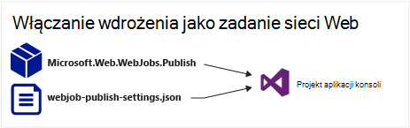
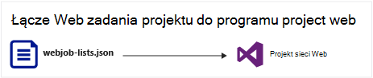
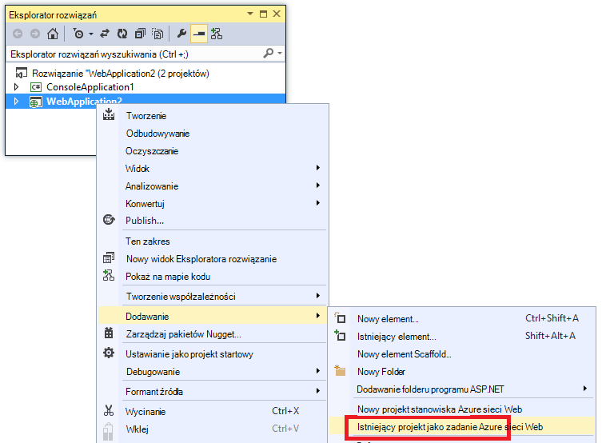
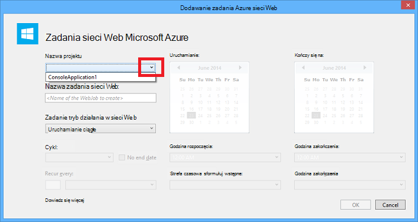
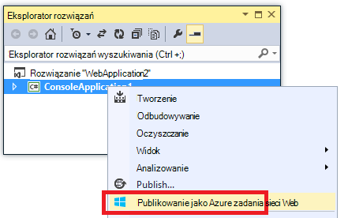
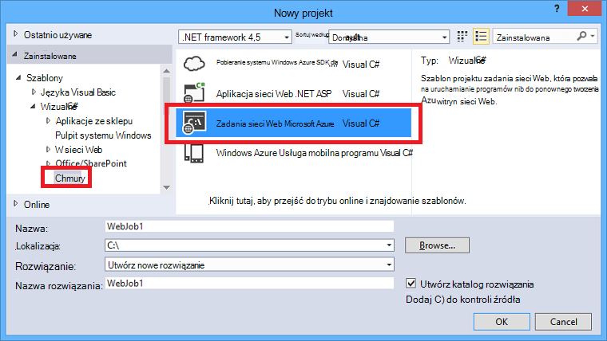
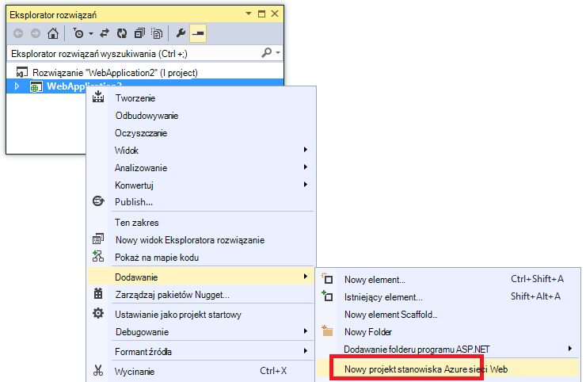
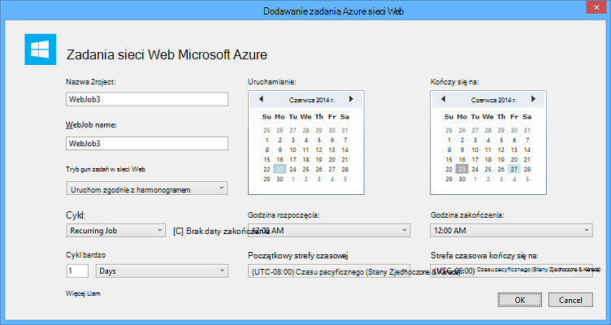

<properties 
    pageTitle="Wdrażanie WebJobs przy użyciu programu Visual Studio" 
    description="Dowiedz się, jak wdrożyć Azure WebJobs Azure usługi sieci Web aplikacji przy użyciu programu Visual Studio." 
    services="app-service" 
    documentationCenter="" 
    authors="tdykstra" 
    manager="wpickett" 
    editor="jimbe"/>

<tags 
    ms.service="app-service" 
    ms.devlang="dotnet" 
    ms.topic="article" 
    ms.tgt_pltfrm="na" 
    ms.workload="na" 
    ms.date="04/27/2016" 
    ms.author="tdykstra"/>

# Wdrażanie WebJobs przy użyciu programu Visual Studio

## Omówienie

W tym temacie wyjaśniono, jak za pomocą programu Visual Studio Wdroż projekt aplikacji konsoli aplikacji sieci web w [Aplikacji usługi](http://go.microsoft.com/fwlink/?LinkId=529714) [Azure WebJob](http://go.microsoft.com/fwlink/?LinkId=390226). Aby dowiedzieć się, jak wdrożyć WebJobs za pomocą [Azure Portal](https://portal.azure.com)zobacz [zadania w tle uruchomić z WebJobs](web-sites-create-web-jobs.md).

Gdy Visual Studio wdrożono projekt z obsługą WebJobs aplikacji konsoli, wykonuje dwa zadania:

* Kopiuje środowisko uruchomieniowe pliki do odpowiedniego folderu w aplikacji sieci web (*App_Data/zadań i ciągły* dla WebJobs ciągły, *App_Data/zadań i wyzwalane* WebJobs według harmonogramu i na żądanie).
* Skonfigurowany [zadania harmonogramu Azure](#scheduler) WebJobs zaplanowany do uruchomienia przez określony czas. (To nie jest potrzebny dla WebJobs ciągły.)

Projekt z obsługą WebJobs obejmuje następujące elementy dodawane do niego:

* Pakiet NuGet [Microsoft.Web.WebJobs.Publish](http://www.nuget.org/packages/Microsoft.Web.WebJobs.Publish/) .
* Plik [webjob — publikowanie settings.json](#publishsettings) , który zawiera ustawienia wdrażania i harmonogram. 

Możesz dodać te elementy do istniejącego projektu aplikacji konsoli lub utworzyć nowy projekt z obsługą WebJobs aplikacji konsoli za pomocą szablonu. 

Wdrażanie projektu jako WebJob przez siebie lub połączyć je z projektu sieci web tak, aby automatycznie wdraża przy każdym wdrażanie projektu sieci web. Aby połączyć projektów, Visual Studio zawiera nazwę projektu z obsługą WebJobs w pliku [webjobs list.json](#webjobslist) w programie project web.

## Wymagania wstępne

WebJobs wdrażania funkcje są dostępne w Visual Studio 2015, podczas instalowania Azure SDK dla środowiska .NET:

* [Azure SDK dla środowiska .NET (Visual Studio 2015)](http://go.microsoft.com/fwlink/?linkid=518003).

## Włączanie wdrażania WebJobs dla istniejącego projektu aplikacji konsoli

Dostępne są dwie opcje:

* [Włącz automatyczne wdrażanie w programie web project](#convertlink).

    Istniejący projekt aplikacji konsoli tak skonfigurować program go automatycznie wdraża jako WebJob przy umieszczaniu projektu sieci web. Użyj tej opcji, gdy chcesz uruchomić usługi WebJob w tym samym web app, w którym uruchomić aplikacji sieci web pokrewne.

* [Włączanie wdrażania bez projektu sieci web](#convertnolink).

    Konfigurowanie istniejącego projektu aplikacji konsoli do wdrożenia jako WebJob przez siebie, nie łącze do projektu sieci web. Użyj tej opcji, jeśli chcesz uruchomić WebJob w aplikacji sieci web przez siebie, przy użyciu aplikacji sieci web, nie działa w aplikacji sieci web. Można to zrobić, aby móc skalowanie zasobów WebJob niezależnie od zasobów aplikacji sieci web.

### Włącz automatyczne wdrażanie WebJobs w programie web project
  
1. Kliknij prawym przyciskiem myszy w **Eksploratorze rozwiązań**projektu sieci web, a następnie kliknij przycisk **Dodaj** > **Istniejącego projektu jako Azure WebJob**.

    
    
    Zostanie wyświetlone okno dialogowe [Dodawanie WebJob Azure](#configure) .

1. Na liście rozwijanej **Nazwa projektu** wybierz projekt aplikacji konsoli, aby dodać jako WebJob.

    

2. Kończenie okna dialogowego [Dodawanie WebJob Azure](#configure) , a następnie kliknij **przycisk OK**. 

### Włączanie wdrożenia WebJobs bez projektu sieci web
  
1. Kliknij prawym przyciskiem myszy projekt aplikacji konsoli w **Eksploratorze rozwiązań**, a następnie kliknij polecenie **Publikuj jako Azure WebJob**. 

    
    
    Zostanie wyświetlone okno dialogowe [Dodawanie WebJob Azure](#configure) z projektem wybranym w polu **Nazwa projektu** .

2.  Wypełnij okno dialogowe [Dodawanie WebJob Azure](#configure) , a następnie kliknij **przycisk OK**.

    Zostanie wyświetlony Kreator **Publikowanie sieci Web** .  Jeśli nie chcesz, aby opublikować natychmiast, zamknij kreatora. Ustawienia, które zostały wprowadzone są zapisywane dla, gdy chcesz [wdrożyć projektu](#deploy).

## Tworzenie nowego projektu z obsługą WebJobs

Aby utworzyć nowy projekt z obsługą WebJobs, można za pomocą aplikacji konsoli szablon projektu i włączyć WebJobs wdrażania, zgodnie z opisem w [poprzedniej sekcji](#convert). Alternatywnie można użyć szablonu nowego projektu WebJobs:

* [Użyj szablonu nowego projektu WebJobs dla niezależnych WebJob](#createnolink)

    Tworzenie projektu i skonfiguruj go do wdrożenia samodzielnie jako WebJob, nie Link do projektu sieci web. Użyj tej opcji, jeśli chcesz uruchomić WebJob w aplikacji sieci web przez siebie, przy użyciu aplikacji sieci web, nie działa w aplikacji sieci web. Można to zrobić, aby móc skalowanie zasobów WebJob niezależnie od zasobów aplikacji sieci web.

* [Użyj szablonu nowego projektu WebJobs dla WebJob połączone z projektu sieci web](#createlink)

    Utwórz projekt, który jest skonfigurowany do wdrożenia automatycznie jako WebJob po wdrożeniu projektu sieci web, w tym samym rozwiązaniu. Użyj tej opcji, gdy chcesz uruchomić usługi WebJob w tym samym web app, w którym uruchomić aplikacji sieci web pokrewne.

> [AZURE.NOTE] Szablon nowego projektu WebJobs automatycznie instaluje pakiety NuGet i zawiera kod w *Plik Program.cs* dla zestawu [WebJobs SDK](http://www.asp.net/aspnet/overview/developing-apps-with-windows-azure/getting-started-with-windows-azure-webjobs). Jeśli nie chcesz używać WebJobs SDK lub ma być według harmonogramu, zamiast ciągły WebJob, usuwanie lub zmiana `host.RunAndBlock` instrukcji w *Plik Program.cs*.

### Użyj szablonu nowego projektu WebJobs dla niezależnych WebJob
  
1. Kliknij pozycję **plik** > **Nowego projektu**, a następnie w oknie dialogowym **Nowy projekt** kliknij pozycję **chmury** > **Microsoft Azure WebJob**.

    
    
2. Postępuj zgodnie z instrukcjami przedstawionym wcześniej, aby [Aplikacja konsoli programu project projekt niezależny WebJobs](#convertnolink).

### Użyj szablonu nowego projektu WebJobs dla WebJob połączone z projektu sieci web

1. Kliknij prawym przyciskiem myszy w **Eksploratorze rozwiązań**projektu sieci web, a następnie kliknij przycisk **Dodaj** > **Nowy projekt WebJob Azure**.

    

    Zostanie wyświetlone okno dialogowe [Dodawanie WebJob Azure](#configure) .

2. Wypełnij okno dialogowe [Dodawanie WebJob Azure](#configure) , a następnie kliknij **przycisk OK**.

## Okno dialogowe Dodawanie WebJob Azure

Okno dialogowe **Dodawanie WebJob Azure** umożliwia wprowadź nazwę WebJob i Planowanie ustawień usługi WebJob. 

Pola w tym oknie dialogowym odpowiadają pól, okno dialogowe **Nowe zadanie** Azure Portal. Aby uzyskać więcej informacji zobacz [zadania w tle uruchom z WebJobs](web-sites-create-web-jobs.md).

WebJob według harmonogramu (a nie dla WebJobs ciągły) Visual Studio tworzy zbiór [Azure harmonogramu](/services/scheduler/) zadania, jeśli jedną jeszcze nie istnieje, a jego tworzy zadanie w kolekcji:

* Zbiór harmonogram zadania jest o nazwie *WebJobs-{regionname}* gdzie *{regionname}* odnosi się do obszaru sieci web app jest obsługiwana w. Na przykład: WebJobs WestUS.
* Zadanie harmonogramu nosi nazwę *{webappname}-{webjobname}*. Na przykład: MyWebJob Moja_aplikacja_sieci_web. 
 
>[AZURE.NOTE]
> 
>* Dla informacji na temat wdrażania wiersza polecenia zobacz [Włączanie wiersza polecenia lub ciągły dostarczania WebJobs Azure](/blog/2014/08/18/enabling-command-line-or-continuous-delivery-of-azure-webjobs/).
>* Jeśli skonfigurować **Zadania cyklicznego** i ustaw opcję częstotliwość cyklu liczbę minut, usługa Azure harmonogram nie jest bezpłatna. Inne częstotliwości (godziny, dni i tak dalej) są bezpłatne.
>* Jeśli wdrażanie WebJob, a następnie okazało się, że chcesz zmienić typ WebJob i ponownego wdrażania, musisz usunąć plik webjobs — publikowanie settings.json. Spowoduje to Visual Studio pokazuj opcje publikowania, co umożliwia zmianę typu WebJob.
>* Jeśli wdrażanie WebJob i później zmienić sposób wykonywania z ciągły-ciągły lub odwrotnie, Visual Studio tworzy ponownego wdrożenia WebJob nowej platformy Azure. Jeśli zmienisz inne ustawienia harmonogramu, ale Opuść tryb działania takie same lub przełączanie się między zaplanowane i na żądanie, Visual Studio aktualizowania istniejącego zadania zamiast utworzyć nowy.

## webjob publikowanie settings.json

Podczas konfigurowania aplikacji konsoli wdrożenia WebJobs programu Visual Studio instaluje pakiet NuGet [Microsoft.Web.WebJobs.Publish](http://www.nuget.org/packages/Microsoft.Web.WebJobs.Publish/) i planowania informacje są przechowywane w pliku *webjob publikowanie settings.json* w folderze *Właściwości* projektu projektu WebJobs. Oto przykład tego pliku:

        {
          "$schema": "http://schemastore.org/schemas/json/webjob-publish-settings.json",
          "webJobName": "WebJob1",
          "startTime": "2014-06-23T00:00:00-08:00",
          "endTime": "2014-06-27T00:00:00-08:00",
          "jobRecurrenceFrequency": "Minute",
          "interval": 5,
          "runMode": "Scheduled"
        }

Ten plik można edytować bezpośrednio i Visual Studio zawiera technologii IntelliSense. Schemat plik jest przechowywany w [http://schemastore.org](http://schemastore.org/schemas/json/webjob-publish-settings.json) i można je tam.  

>[AZURE.NOTE]
>
>* Jeśli skonfigurować **Zadania cyklicznego** i ustaw opcję częstotliwość cyklu liczbę minut, usługa Azure harmonogram nie jest bezpłatna. Inne częstotliwości (godziny, dni i tak dalej) są bezpłatne.

## webjobs list.json

Podczas tworzenia łącza z obsługą WebJobs projektu do projektu sieci web, programu Visual Studio przechowuje nazwę projektu WebJobs w pliku *webjobs list.json* w folderze *Właściwości* projektu sieci web. Lista może zawierać wiele projektów WebJobs, jak pokazano w poniższym przykładzie:

        {
          "$schema": "http://schemastore.org/schemas/json/webjobs-list.json",
          "WebJobs": [
            {
              "filePath": "../ConsoleApplication1/ConsoleApplication1.csproj"
            },
            {
              "filePath": "../WebJob1/WebJob1.csproj"
            }
          ]
        }

Ten plik można edytować bezpośrednio i Visual Studio zawiera technologii IntelliSense. Schemat plik jest przechowywany w [http://schemastore.org](http://schemastore.org/schemas/json/webjobs-list.json) i można je tam.
  
## Wdrażanie projektu WebJobs

Projekt WebJobs, który jest połączone z projektu sieci web automatycznie wdraża w programie web project. Uzyskać informacji na temat wdrażania projektu sieci web zobacz [jak wdrożyć do aplikacji sieci Web](web-sites-deploy.md).

Do wdrażania projektu WebJobs, kliknij prawym przyciskiem myszy projektu w **Eksploratorze rozwiązań**, a następnie kliknij polecenie **Publikuj jako Azure WebJob**. 

    
Dla niezależnych WebJob samego kreatora **Publikowanie sieci Web** , który jest używany w przypadku projektów sieci web jest wyświetlany, ale przy użyciu mniejszej liczby ustawień można zmienić.

## Następne kroki

Ten artykuł zawiera omówienie sposobu wdrażania WebJobs przy użyciu programu Visual Studio. Aby uzyskać więcej informacji na temat wdrażania Azure WebJobs zobacz [wdrożenia Azure WebJobs - zalecane zasoby](http://www.asp.net/aspnet/overview/developing-apps-with-windows-azure/azure-webjobs-recommended-resources#deploying).
