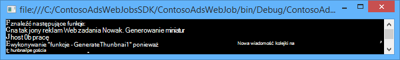

<properties
    pageTitle="Tworzenie .NET WebJob w Azure aplikacji usługi | Microsoft Azure"
    description="Tworzenie wielu aplikacji przy użyciu programu ASP.NET MVC i Azure. Przednia działa Zakończ w aplikacji sieci web w usłudze Azure aplikacji i wewnętrznej bazy danych jest uruchamiany jako WebJob. Aplikacja używa Framework jednostki, bazy danych SQL i kolejek Azure miejsca do magazynowania i obiektów blob."
    services="app-service"
    documentationCenter=".net"
    authors="tdykstra"
    manager="wpickett"
    editor="mollybos"/>

<tags
    ms.service="app-service"
    ms.workload="na"
    ms.tgt_pltfrm="na"
    ms.devlang="na"
    ms.topic="article"
    ms.date="10/28/2016"
    ms.author="tdykstra"/>

# Tworzenie .NET WebJob w Azure aplikacji usługi

Ten samouczek pokazano, jak pisać kod prostej aplikacji ASP.NET MVC 5 wielu korzystającego z [Zestawu SDK WebJobs](websites-dotnet-webjobs-sdk.md).

Przeznaczenie [WebJobs SDK](websites-webjobs-resources.md) jest uprościć tworzonego umożliwiającą wykonywanie typowych zadań, że WebJob można wykonać, takie jak przetwarzanie obrazu, w kolejce przetwarzania kodu, RSS agregacji konserwacja plików i wysyłanie wiadomości e-mail. WebJobs SDK zawiera wbudowane funkcje do pracy z magazyn Azure i Bus usługi, planowanie zadań i obsługi błędów i wielu innych typowych scenariuszy. Ponadto go opracowano z myślą o być extensible, a jest [Otwórz źródło repozytorium rozszerzenia](https://github.com/Azure/azure-webjobs-sdk-extensions/wiki/Binding-Extensions-Overview).

Przykładowa aplikacja jest biuletynach reklamami. Użytkownicy mogą można przekazywać obrazy reklam, a proces wewnętrznej bazy danych konwertuje obrazy na miniatury. Na stronie listy ad pokazano miniatur oraz na stronie szczegółów ad pełnego rozmiaru obrazu. Poniżej przedstawiono zrzut ekranu:

Ta aplikacja przykładowa współdziała z [kolejki Azure](http://www.asp.net/aspnet/overview/developing-apps-with-windows-azure/building-real-world-cloud-apps-with-windows-azure/queue-centric-work-pattern) i [blob Azure](http://www.asp.net/aspnet/overview/developing-apps-with-windows-azure/building-real-world-cloud-apps-with-windows-azure/unstructured-blob-storage). Samouczku pokazano, jak wdrożyć aplikację [Azure aplikacji usługi](http://go.microsoft.com/fwlink/?LinkId=529714) i [Bazy danych SQL Azure](http://msdn.microsoft.com/library/azure/ee336279).

## Wymagania wstępne

Samouczek założono, że wiesz, jak pracować z projektami [ASP.NET MVC 5](http://www.asp.net/mvc/tutorials/mvc-5/introduction/getting-started) w programie Visual Studio.

Samouczek został zapisany Visual Studio 2013 r. Jeśli nie masz już programu Visual Studio, jego zostanie zainstalowany dla Ciebie automatycznie po zainstalowaniu Azure SDK dla środowiska .NET.

Samouczek można używać za pomocą programu Visual Studio 2015, ale przed uruchomieniem aplikacji lokalnie trzeba zmienić `Data Source` część w plików Web.config i App.config z ciągu połączenia SQL Server LocalDB `Data Source=(localdb)\v11.0` do `Data Source=(LocalDb)\MSSQLLocalDB`. 

> [AZURE.NOTE] Potrzebne jest konto Azure do użycia tego samouczka:
  >
  > + Możesz [otworzyć konto Azure bezpłatnie](https://azure.microsoft.com/pricing/free-trial/?WT.mc_id=A261C142F): uzyskiwanie środków Umożliwia wypróbowanie płatnych usług Azure, a nawet w przypadku, gdy są używane nawet przechowujesz konta i użyj wolny Azure usług, takich jak witryny sieci Web. Karta kredytowa nigdy nie zostanie obciążona, chyba że jawnie Zmienianie ustawień i poproś o naliczane.
  >
  > + Można [aktywować korzyści subskrybentów MSDN](https://azure.microsoft.com/pricing/member-offers/msdn-benefits-details/?WT.mc_id=A261C142F): subskrypcji MSDN i zapewnia środków co miesiąc, używanej usługi Azure płatnej.
  >
  >Jeśli chcesz rozpocząć pracę z Azure aplikacji usługi przed utworzeniem konta dla konta Azure, przejdź do [Spróbuj aplikacji usługi](http://go.microsoft.com/fwlink/?LinkId=523751), którym natychmiast można utworzyć aplikację sieci web krótkotrwałe starter w aplikacji usługi. Nie kart kredytowych wymagane; nie zobowiązania.

## Dowiesz się

Samouczek przedstawia sposób wykonywania następujących zadań:

* Włącz komputer rozwoju Azure instalując Azure SDK.
* Utwórz projekt aplikacji konsoli, która powoduje automatyczne wdrożenie jako WebJob Azure przy umieszczaniu projektu sieci web skojarzone.
* Testowanie WebJobs SDK wewnętrznej bazy danych lokalnie na tym komputerze rozwoju.
* Publikowanie aplikacji z WebJobs wewnętrznej bazie danych w aplikacji sieci web w aplikacji usługi.
* Przekazywanie plików i zapisywanie ich w usłudze Azure obiektów Blob.
* Praca z kolejki magazyn Azure i obiektów blob przy użyciu zestawu SDK WebJobs Azure.

## Architektura aplikacji

Przykładowe aplikację [deseń wyśrodkowany na kolejki pracy](http://www.asp.net/aspnet/overview/developing-apps-with-windows-azure/building-real-world-cloud-apps-with-windows-azure/queue-centric-work-pattern) do wyłączonym reaktorze pracy obciążenie Procesora tworzenia miniatury z procesem wewnętrznej bazy danych.

Aplikacja przechowuje reklam w bazie danych SQL, tworzyć tabele i uzyskać dostęp do danych za pomocą obiektu ramach kod pierwszego. Dla każdego ad bazy danych są przechowywane dwa adresy URL: jeden dla obrazu w pełnym wymiarze i jeden miniaturę.

Gdy użytkownik przekazywanie obrazu, aplikacji sieci web przechowywanie obrazu w [Azure blob](http://www.asp.net/aspnet/overview/developing-apps-with-windows-azure/building-real-world-cloud-apps-with-windows-azure/unstructured-blob-storage), a są przechowywane dane ad w bazie danych przy użyciu adresu URL, wskazującego na to. W tym samym czasie zapisuje wiadomości w kolejce Azure. W procesie wewnętrznej bazy danych działającego jako WebJob Azure WebJobs SDK sprawdza kolejki dla nowych wiadomości. Gdy pojawi się nowa wiadomość, WebJob tworzy miniatury dla danego obrazu i aktualizacje miniatur pola bazy danych adres URL dla tego ad. Poniżej przedstawiono diagram przedstawiający interakcja części aplikacji:

[AZURE.INCLUDE [install-sdk](../../includes/install-sdk-2015-2013.md)]

Samouczki instrukcje dotyczą Azure SDK dla środowiska .NET 2.7.1 lub nowszym.

## Tworzenie konta magazynu platformy Azure

Konto Azure magazynowania udostępnia zasoby do przechowywania danych w kolejce i obiektów blob w chmurze. Również jest używane przez WebJobs SDK w do przechowywania danych rejestrowania pulpitu nawigacyjnego.

W aplikacji rzeczywistych przeważnie tworzą osobnych kont dla aplikacji danych i rejestrowanie danych i osobne konta dla badań i danych produkcyjnych. Ten samouczek za pomocą tylko jednego konta.

1. Otwórz okno **Eksploratora serwera** w programie Visual Studio.

2. Kliknij prawym przyciskiem myszy węzeł **Azure** , a następnie kliknij pozycję **Połącz z platformy Microsoft Azure**.

3. Zaloguj się przy użyciu swoich poświadczeń Azure.

5. Kliknij prawym przyciskiem myszy **miejsca do magazynowania** w węźle Azure, a następnie kliknij **Utwórz konto miejsca do magazynowania**.

3. W oknie dialogowym **Utwórz konto miejsca do magazynowania** wprowadź nazwę konta magazynu.

    Nazwa musi być musi być unikatowa (żadne inne konto Azure magazynowania mogą mieć tej samej nazwy). Wprowadzona nazwa jest już używana uzyskasz możliwość go zmienić.

    Adres URL dostępu do konta miejsca do magazynowania będzie *{Nazwa}*. core.windows.net.

5. Ustaw listy rozwijanej **regionu lub grupy koligacji** obszaru znajduje się najbliżej użytkownika.

    To ustawienie określa, które Azure centrum danych będzie przechowywana konta miejsca do magazynowania. Ten samouczek wyboru nie należy widoczną różnicą. Jednak dla aplikacji sieci web dla produkcji ma serwera sieci web i konta miejsca do magazynowania w tym samym regionie, aby zminimalizować opłaty wyjściowe opóźnienie i danych. Aplikacji sieci web (który utworzysz później) centrum danych powinien być możliwie najbliżej przeglądarki w celu zminimalizowania opóźnienie dostęp do aplikacji sieci web.

6. Ustaw listy rozwijanej **replikacji** **lokalnie zbędne**.

    Po włączeniu replikacji geo konta miejsca do magazynowania przechowywaną zawartość jest replikowane pomocniczej centrum danych, aby możliwe było awaryjne przeniesienie do tej lokalizacji, w przypadku głównych awarii w lokalizacji podstawowej. Replikacja Geo może spowodować dodatkowe koszty. W przypadku kont badania i rozwój ogólnie nie chcesz zapłacić za geo replikacji. Aby uzyskać więcej informacji zobacz [Tworzenie, zarządzanie, lub usunąć konto miejsca do magazynowania](../storage-create-storage-account/#replication-options).

5. Kliknij przycisk **Utwórz**.

    

## Pobierz aplikację

1. Pobierz i rozpakuj plik [wykonane rozwiązanie](http://code.msdn.microsoft.com/Simple-Azure-Website-with-b4391eeb).

2. Uruchom program Visual Studio.

3. Z menu **plik** wybierz pozycję **Otwórz > projektu i rozwiązanie**, wskaż miejsce, w którym został pobrany rozwiązanie, a następnie otwórz plik rozwiązania.

4. Naciśnij klawisze CTRL + SHIFT + B, aby utworzyć rozwiązanie.

    Domyślnie program Visual Studio automatycznie przywraca zawartość pakietu NuGet, który nie został włączony w pliku *zip* . Jeśli pakiety nie spowoduje przywrócenia, zainstalować je ręcznie, przechodząc do okno dialogowe **Zarządzanie pakietami NuGet rozwiązania** i klikając przycisk **Przywróć** u góry po prawej.

5. W **Eksploratorze rozwiązań**upewnij się, że **ContosoAdsWeb** jest wybrany projekt startowy.

## Konfigurowanie aplikacji przy użyciu konta miejsca do magazynowania

1. Otwórz plik *Web.config* w programie project ContosoAdsWeb.

    Plik zawiera parametry połączenia SQL i parametry połączenia Azure miejsca do magazynowania do pracy z obiektami blob i kolejki.

    Wskazuje SQL parametry połączenia z bazą danych [Programu SQL Server Express LocalDB](http://msdn.microsoft.com/library/hh510202.aspx) .

    Parametry połączenia miejsca do magazynowania jest przykładowi, który zawiera symbole zastępcze dla konta miejsca do magazynowania klucza nazwy i access. Możesz będzie zastąpić przy użyciu parametrów połączenia, zawierającą nazwę i klucz konta miejsca do magazynowania.  

    <pre class="prettyprint">&lt;connectionStrings&gt;
   &lt;Dodaj nazwę = connectionString "ContosoAdsContext" = "źródła danych = \v11.0 (localdb); Wstępne wykazu = ContosoAds; Zintegrowane zabezpieczenia = PRAWDA; MultipleActiveResultSets = PRAWDA; "providerName="System.Data.SqlClient "-&gt;
   &lt;Dodaj nazwę = connectionString"AzureWebJobsStorage"=" DefaultEndpointsProtocol = https; Nazwa konta =<mark>[nazwa konta]</mark>; AccountKey =<mark>[accesskey]</mark>"-&gt; 
    &lt;/connectionStrings      &gt;</pre>

    Parametry połączenia miejsca do magazynowania nosi nazwę AzureWebJobsStorage, ponieważ jest to nazwa używanego przez WebJobs SDK domyślnie. Tej samej nazwie jest używany w tym miejscu, więc należy ustawić tylko jedną wartość ciągu połączenia w środowisku Azure.

2. W **Eksploratorze serwera**kliknij prawym przyciskiem myszy konta miejsca do magazynowania w węźle **miejsca do magazynowania** , a następnie kliknij **Właściwości**.

    

3. W oknie **Właściwości** kliknij **Klawisze konta miejsca do magazynowania**, a następnie kliknij przycisk wielokropka.

    

4. Skopiuj **Parametry połączenia**.

    

5. Zastąp ciąg połączenia miejsca do magazynowania w pliku *Web.config* parametry połączenia, który został właśnie skopiowany. Upewnij się, że możesz zaznaczyć cały tekst wewnątrz cudzysłowów, ale bez cudzysłowów przed wklejeniem.

6. Otwórz plik *App.config* w programie project ContosoAdsWebJob.

    Ten plik ma dwa ciągi połączenia miejsca do magazynowania, jedną dla danych aplikacji i jedną dla rejestrowania. Za pomocą kont przechowywania danych aplikacji i rejestrowania i możesz użyć [wielu kont miejsca do magazynowania dla danych](https://github.com/Azure/azure-webjobs-sdk/blob/master/test/Microsoft.Azure.WebJobs.Host.EndToEndTests/MultipleStorageAccountsEndToEndTests.cs). Ten samouczek za pomocą konta jednego miejsca do magazynowania. Parametry połączenia zawierają symbole zastępcze dla kluczy konta miejsca do magazynowania. 
    <pre class="prettyprint">&lt;Konfiguracja&gt; 
    &lt;connectionStrings&gt;
   &lt;Dodaj nazwę = connectionString "AzureWebJobsDashboard" = "DefaultEndpointsProtocol = https; Nazwa konta =<mark>[nazwa konta]</mark>; AccountKey =<mark>[accesskey]</mark>"-&gt;
   &lt;Dodaj nazwę = connectionString"AzureWebJobsStorage"=" DefaultEndpointsProtocol = https; Nazwa konta =<mark>[nazwa konta]</mark>; AccountKey =<mark>[accesskey]</mark>"-&gt;
   &lt;Dodaj nazwę = connectionString"ContosoAdsContext"=" źródła danych = \v11.0 (localdb); Wstępne wykazu = ContosoAds; Zintegrowane zabezpieczenia = PRAWDA; MultipleActiveResultSets = PRAWDA; " -&gt; 
    &lt;/connectionStrings&gt;
   &lt;uruchamiania&gt;
   &lt;wersji supportedRuntime = sku "4.0" = ". NETFramework, wersja = v4.5 "/&gt; 
    &lt;/startup&gt;
&lt;/Configuration                             &gt;</pre>

    Domyślnie WebJobs SDK wyszukuje o nazwie AzureWebJobsStorage i AzureWebJobsDashboard parametry połączenia. Alternatywnie możesz [połączenie ciąg jednak chcesz i przekazać je w jawnie do sklepu `JobHost` obiektu](websites-dotnet-webjobs-sdk-storage-queues-how-to.md#config).

7. Zamień oba ciągi połączenia miejsca do magazynowania przy użyciu parametrów połączenia, który został skopiowany wcześniej.

8. Zapisz wprowadzone zmiany.

## Uruchom aplikację lokalnie

1. Aby rozpocząć frontend web aplikacji, naciśnij klawisze CTRL + F5.

    Domyślną przeglądarką po otwarciu strony głównej. (Projektu sieci web jest uruchomiony, ponieważ zostały wprowadzone projekt startowy.)

    

2. Aby rozpocząć WebJob wewnętrznej bazy danych aplikacji, kliknij prawym przyciskiem myszy projektu ContosoAdsWebJob w **Eksploratorze rozwiązań**, a następnie kliknij **Debugowanie** > **Uruchom nowe wystąpienie**.

    Okno aplikacji konsoli zostanie wyświetlona a wiadomości rejestrowania wskazuje, że obiekt WebJobs SDK JobHost zaczął do uruchomienia.

    

3. W przeglądarce kliknij przycisk **Utwórz Ad**.

4. Wprowadź niektóre dane test wybierz obraz, aby przekazać i kliknij przycisk **Utwórz**.

    

    Aplikacja przechodzi na stronę indeks, ale nie pokazuje miniatury dla nowych ad, ponieważ przetworzenia nie stało się jeszcze.

    W międzyczasie po krótkim oczekiwania wiadomości rejestrowania w oknie aplikacji konsoli Pokazuje, że kolejki wiadomość została odebrana i została przetworzona.

    

5. Po wiadomości rejestrowania w oknie aplikacji konsoli, Odśwież stronę indeksu, aby zobaczyć miniaturę.

    

6. Kliknij pozycję **Szczegóły** dla swojego ad, aby wyświetlić obrazu w pełnym wymiarze.

    

Aplikacja została były uruchomione na komputerze lokalnym i korzysta z programu SQL Server bazy danych znajdującej się na komputerze, ale współpracuje z kolejki i BLOB w chmurze. W poniższej sekcji będzie uruchomić aplikację w chmurze, za pomocą bazy danych w chmurze, a także blob chmury i kolejki.  

## Uruchom aplikację w chmurze

Wykonaj poniższe czynności, aby uruchomić aplikację w chmurze:

* Wdrażanie aplikacji sieci Web. Program Visual Studio automatycznie tworzy nową aplikację sieci web w aplikacji usługi i wystąpienie bazy danych SQL.
* Konfigurowanie aplikacji sieci web za pomocą konta Azure SQL bazy danych i miejsca do magazynowania.

Po utworzeniu niektórych reklam podczas pracy w chmurze, zostanie wyświetlona na pulpicie nawigacyjnym WebJobs SDK wyświetlić sformatowany monitorowania funkcji, które ma do oferowania.

### Wdrażanie aplikacji sieci Web

1. Zamknij przeglądarkę i okna aplikacji konsoli.

2. W **Eksploratorze rozwiązań**kliknij prawym przyciskiem myszy ContosoAdsWeb projektu, a następnie kliknij **Publikuj**.

3. W kroku **profilu** kreatora **Publikowanie sieci Web** kliknij pozycję **aplikacje sieci web Microsoft Azure**.

    

4. Zaloguj się do Azure Jeśli nadal nie są zalogowane.

5. Kliknij przycisk **Nowy**.

    Okno dialogowe może wyglądać nieco inaczej w zależności od zainstalowanej wersji zestawu SDK Azure dla środowiska .NET.

    

6. W oknie dialogowym **Tworzenie aplikacji sieci web na platformy Microsoft Azure** wpisz unikatową nazwę w polu **Nazwa aplikacji sieci Web** .

    Tutaj wprowadź pełny adres URL będzie zawierał plus. azurewebsites.net (jak pokazano obok pola tekstowego **Nazwa aplikacji sieci Web** ). Na przykład jeśli nazwa aplikacji sieci web jest ContosoAds, adres URL będzie ContosoAds.azurewebsites.net.

7. Na liście rozwijanej [plan usług aplikacji](../app-service/azure-web-sites-web-hosting-plans-in-depth-overview.md) wybierz pozycję **Utwórz nowy plan aplikacji usługi**. Wprowadź nazwę dla planu aplikacji usługi, takie jak ContosoAdsPlan.

8. Na liście rozwijanej [Grupa zasobów](../azure-resource-manager/resource-group-overview.md) wybierz pozycję **Utwórz nową grupę zasobów**.

9. Wprowadź nazwę grupy zasobów, takich jak ContosoAdsGroup.

10. Na liście rozwijanej **Region** wybierz tego samego regionu, wybrana dla Twojego konta miejsca do magazynowania.

    To ustawienie określa, które Azure centrum danych aplikacji sieci web będzie działać w. Zachowanie konto aplikacji i miejsca do magazynowania sieci web, w tym samym centrum danych minimalizuje opłaty wyjściowe opóźnienie i danych.

11. Na liście rozwijanej **serwer bazy danych** wybierz pozycję **Utwórz nowy serwer**.

12. Wprowadź nazwę serwera bazy danych, takich jak contosoadsserver + liczby lub Twoja nazwa wprowadź nazwę serwera unikatowe. 

    Nazwa serwera musi być unikatowa. Może zawierać małe liter, cyfr i łączników. Nie może zawierać łącznik końcowych. 

    Możesz też subskrypcji już ma serwer, można wybrać serwer z listy rozwijanej.

12. Wprowadź administratorem **bazy danych nazwy użytkownika** i **hasła bazy danych**.

    W przypadku wybrania **nowej bazy danych programu SQL server** , nie wprowadzając istniejącą nazwę i hasło tutaj wprowadzania nową nazwę i hasło, którego definiowania teraz w celu późniejszego użycia podczas uzyskiwania dostępu do bazy danych. W przypadku wybrania serwera, który został wcześniej utworzony zostanie wyświetlony monit o podanie hasła do konta administratora już utworzone.

13. Kliknij przycisk **Utwórz**.

    

    Program Visual Studio tworzy rozwiązanie, projektu sieci web, aplikacji sieci web platformy Azure i wystąpienie bazy danych SQL Azure.

14. W kroku **połączenia** kreatora **Publikowanie sieci Web** kliknij przycisk **Dalej**.

    

15. W kroku **Ustawienia** wyczyść pole wyboru **Użyj tego ciągu połączenia w czasie rzeczywistym** , a następnie kliknij przycisk **Dalej**.

    

    Nie należy ustawić parametry połączenia SQL, ponieważ skonfigurujesz tę wartość w środowisku Azure później za pomocą okna dialogowego Publikuj.

    Możesz zignorować ostrzeżenia na tej stronie.

    * Zwykle konta miejsca do magazynowania używanych podczas uruchamiania w Azure będzie inny niż ten, którego używasz, gdy działa lokalnie, ale ten samouczek używasz ten sam w obu środowiskach. Dlatego parametry połączenia AzureWebJobsStorage nie trzeba można przekształcić. Nawet jeśli chcesz używać z konta innego miejsca do magazynowania w chmurze, nie musisz Przekształcanie parametry połączenia, ponieważ korzysta z aplikacji ustawienie Azure środowiska podczas platformy Azure. Zobaczysz to w dalszej części samouczka.

    * Ten samouczek, które nie mają być wprowadzania zmian w modelu danych na potrzeby ContosoAdsContext bazy danych dlatego jest bez konieczności za pomocą obiektu Framework kod pierwszego migracji do wdrożenia. Kod najpierw automatycznie tworzy nowy termin pierwszej bazy danych, aplikacja próbuje uzyskać dostęp do danych programu SQL.

    Ten samouczek wartości domyślne opcje w obszarze **Opcje publikowania pliku** jest poprawna.

16. W kroku **Podgląd** kliknij pozycję **Uruchom Podgląd**.

    

    Możesz zignorować ostrzeżenie o żadnych baz danych publikowany. Jednostki Framework kod pierwszy jest tworzona baza danych; nie musi być opublikowany.

    W oknie podglądu pokazuje, że pliki binarne i Konfiguracja plików z programu project WebJob zostaną skopiowane do folderu *app_data\jobs\continuous* aplikacji sieci web.

    

17. Kliknij przycisk **Publikuj**.

    Program Visual Studio wdrożenie aplikacji i otwiera adres URL strony głównej w przeglądarce.

    Nie będzie można korzystać z aplikacji sieci web, dopóki nie zostaną ustawione parametry połączenia w środowisku Azure w następnej sekcji. Zostanie wyświetlona strona błędu lub strony głównej w zależności od sieci web app i bazy danych opcje tworzenia wybrana wcześniej.

### Konfigurowanie aplikacji sieci web za pomocą konta Azure SQL bazy danych i miejsca do magazynowania.

Jest ze względów bezpieczeństwa w celu [uniknięcia umieszczania informacje poufne, takie jak parametry połączenia w plikach, które są przechowywane w repozytoria kodu źródłowego](http://www.asp.net/aspnet/overview/developing-apps-with-windows-azure/building-real-world-cloud-apps-with-windows-azure/source-control#secrets). Azure umożliwia to zrobić: parametry połączenia i innych wartości ustawień można ustawić w środowisku Azure i Konfiguracja programu ASP.NET interfejsy API wybierz automatycznie te wartości po uruchomieniu aplikacji platformy Azure. Te wartości można ustawić w Azure za pomocą **Eksploratora serwera**, Azure Portal, środowiska Windows PowerShell lub interfejsu wiersza polecenia między platformami. Aby uzyskać więcej informacji zobacz [jak ciągi aplikacji i pracy ciągów połączenia](/blog/2013/07/17/windows-azure-web-sites-how-application-strings-and-connection-strings-work/).

W tej sekcji umożliwiają **Server Explorer** ustawić wartości parametrów połączenia w Azure.

7. W **Eksploratorze serwera**, kliknij prawym przyciskiem myszy aplikacji sieci web w obszarze **Azure > aplikacji usługi > {grupy zasobów}**, a następnie kliknij pozycję **Ustawienia widoku**.

    Na karcie **Konfiguracja** zostanie otwarte okno **Azure Web App** .

9. Zmienianie nazwy parametrów połączenia DefaultConnection do ContosoAdsContext.

    Po utworzeniu aplikacji sieci web z powiązanej bazy danych, jest już wartość ciągu poprawnego połączenia Azure automatyczne utworzenie ten ciąg połączenia. Tylko nazwę chcesz zmienić, aby kodzie wyszukiwania.

9. Dodawanie dwóch nowych ciągów połączenia, o nazwie AzureWebJobsStorage i AzureWebJobsDashboard. Ustaw typ niestandardowy, a następnie ustaw wartość ciągu połączenia na tej samej wartości używanej wcześniej pliki *Web.config* i *App.config* . (Upewnij się, zawiera ciąg całe połączenie, nie tylko kod dostępu i nie należy używać znaków cudzysłowu).

    Te parametry połączenia są używane przez WebJobs SDK, jedną dla danych aplikacji, a drugi do rejestrowania. Jak pokazano powyżej, jedną dla danych aplikacji jest również używana przez kod frontonu sieci web.

9. Kliknij przycisk **Zapisz**.

    

10. W **Eksploratorze serwera**kliknij prawym przyciskiem myszy aplikacji sieci web, a następnie kliknij **zatrzymać**.

12. Po zatrzymaniu aplikacji sieci web, ponownie kliknij prawym przyciskiem myszy aplikacji sieci web, a następnie kliknij polecenie **Uruchom**.

    WebJob uruchamia się automatycznie, gdy publikowania, ale zatrzymania wprowadzasz zmianę konfiguracji. Aby uruchomić go ponownie, możesz ponownie uruchom aplikację sieci web lub uruchom ponownie WebJob w [Azure Portal](http://go.microsoft.com/fwlink/?LinkId=529715). Zazwyczaj zalecamy ponowne uruchomienie aplikacji sieci web po zmianie konfiguracji.

9. Odśwież okno przeglądarki, która ma adres URL aplikacji sieci web na pasku adresu.

    Zostanie wyświetlona strona główna.

10. Tworzenie ad, tak jak po uruchomieniu aplikacji lokalnie.

    Na stronie indeks pokazuje bez miniatur na początku.

11. Odśwież stronę po kilku sekundach, i jest wyświetlana miniaturę.

    Jeśli nie widać miniaturę, może być konieczne Poczekaj chwilę dla WebJob go ponownie. Jeżeli po na chwilę nadal nie widać miniaturę po odświeżeniu strony, WebJob nie został uruchomiony automatycznie. W takim przypadku przejdź na kartę WebJobs na stronie [portalu klasyczny](https://manage.windowsazure.com) dla aplikacji sieci web, a następnie kliknij polecenie **Uruchom**.

### Wyświetlanie pulpitu nawigacyjnego WebJobs SDK

1. W [portalu klasyczny](https://manage.windowsazure.com)wybierz aplikacji sieci web.

2. Kliknij kartę **WebJobs** .

3. Kliknij adres URL w kolumnie dzienniki dla swojego WebJob.

    

    Po otwarciu nowej karcie w przeglądarce WebJobs SDK pulpitu nawigacyjnego. Pulpit nawigacyjny zawiera czy WebJob działa i przedstawiono listę funkcji w kodzie, którego dotyczy WebJobs SDK.

4. Kliknij jeden z funkcji, aby wyświetlić szczegółowe informacje o jego wykonanie.

    

    

    Przycisk **Funkcji powtarzania** na tej stronie powoduje framework WebJobs SDK, aby ponownie wywołaj, a oferuje możliwość zmiany danych przekazane do funkcji najpierw.

>[AZURE.NOTE] Po zakończeniu badania, usuwanie aplikacji sieci web i wystąpienie bazy danych SQL. Aplikacja sieci web jest bezpłatna, ale wystąpienie bazy danych SQL i konto miejsca do magazynowania naliczania opłat (minimalnego ze względu na mały rozmiar). Ponadto pozostawienie uruchamiania aplikacji sieci web, każda osoba, która umożliwia znalezienie adresu URL tworzenie i wyświetlanie reklam. W portalu klasycznego przejdź na kartę **pulpit nawigacyjny** dla aplikacji sieci web, a następnie kliknij przycisk **Usuń** w dolnej części strony. Można następnie zaznacz pole wyboru, aby usunąć wystąpienie bazy danych SQL w tym samym czasie. Jeśli chcesz tymczasowo uniemożliwić innym osobom dostęp do aplikacji sieci web, zamiast tego kliknij przycisk **Zatrzymaj** . W takim przypadku opłaty będzie Naliczanie konta bazy danych SQL i miejsca do magazynowania. Możesz wykonać podobnej procedury, aby usunąć konto SQL bazy danych i miejsca do magazynowania, gdy nie są już potrzebne.

## Tworzenie aplikacji od podstaw

W tej sekcji, wykonaj następujące czynności:

* Utworzyć rozwiązanie programu Visual Studio z projektu sieci web.
* Dodawanie projektu Biblioteka klas Warstwa dostępu do danych, które mają być udostępniane między frontonu i wewnętrznej bazy danych.
* Dodaj projekt aplikacji konsoli do wewnętrznej bazy danych, rozmieszczenia WebJobs włączone.
* Dodawanie pakietów NuGet.
* Ustawianie odwołania do projektu.
* Skopiuj kod i konfiguracji pliki aplikacji z poziomu aplikacji pobrany, nad którym pracowano z w poprzedniej sekcji samouczka.
* Przejrzyj części kod, które współpracują z obiektami blob Azure i kolejki i WebJobs SDK.

### Tworzenie rozwiązania programu Visual Studio z projektu sieci web i klasy biblioteki projektu

1. W programie Visual Studio, wybierz pozycję **Nowy,** > **projektu** w menu **plik** .

2. W oknie dialogowym **Nowy projekt** , wybierz pozycję **Visual C#** > **Web** > **Aplikacji sieci Web programu ASP.NET**.

3. Nazwa projektu ContosoAdsWeb, nazwę rozwiązanie ContosoAdsWebJobsSDK (Zmień nazwę rozwiązanie, jeśli umieszczasz w tym samym folderze co pobrany rozwiązanie), a następnie kliknij **przycisk OK**.

    

5. W oknie dialogowym **Nowy projekt ASP.NET** wybierz szablon MVC, a następnie wyczyść pole wyboru **hosta w chmurze** w obszarze **Microsoft Azure**.

    Wybieranie **hosta w chmurze** umożliwia Visual Studio w celu automatycznego utworzenia nowej aplikacji sieci web Azure i baza danych SQL. Ponieważ utworzone one wcześniej, nie trzeba więc podczas tworzenia projektu. Jeśli chcesz utworzyć nową, zaznacz pole wyboru. Następnie można skonfigurować nową aplikację sieci web i baza danych SQL taki sam sposób, co wcześniej po wdrożeniu aplikacji.

5. Kliknij przycisk **Zmień uwierzytelniania**.

    

7. W oknie dialogowym **Zmienianie uwierzytelniania** wybierz pozycję **Brak uwierzytelniania**, a następnie kliknij **przycisk OK**.

    

8. W oknie dialogowym **Nowy projekt programu ASP.NET** kliknij **przycisk OK**.

    Program Visual Studio tworzy rozwiązanie i projektu sieci web.

9. W **Eksploratorze rozwiązań**, kliknij prawym przyciskiem myszy rozwiązanie (nie projekt), a następnie wybierz pozycję **Dodaj** > **Nowego projektu**.

11. W oknie dialogowym **Dodawanie nowego projektu** , wybierz pozycję **Visual C#** > **Komputerze z systemem Windows** > szablon**Biblioteka klas** .  

10. Nazwa projektu *ContosoAdsCommon*, a następnie kliknij **przycisk OK**.

    Ten projekt będzie zawierać kontekst Framework jednostki i modelu danych, które będą używane frontonu i wewnętrznej. Alternatywnie możesz Definiowanie klas związanych z EF w programie project web i odwoływać się do tego projektu z programu project WebJob. Ale następnie projektu WebJob wymaga odwołanie do zespołów w sieci web, które nie potrzebuje.

### Dodawanie aplikacji konsoli projektu, który ma wdrożenia WebJobs włączone

1. Kliknij prawym przyciskiem myszy projektu sieci web (nie rozwiązania lub projektu Biblioteka klas), a następnie kliknij przycisk **Dodaj** > **Nowy projekt WebJob Azure**.

    

2. W oknie dialogowym **Dodawanie WebJob Azure** wprowadź ContosoAdsWebJob jako **nazwę projektu** i **nazwę WebJob**. Pozostaw **tryb działania WebJob** ustawiona do **Uruchamiania stale**.

3.  Kliknij **przycisk OK**.

    Program Visual Studio umożliwia utworzenie aplikacji konsoli, który jest skonfigurowany do wdrożenia jako WebJob, gdy wdrażanie projektu sieci web. Aby to zrobić, wykonać następujące zadania po utworzeniu projektu:

    * Dodane pliku *webjob — publikowanie settings.json* w folderze WebJob projektu właściwości.
    * Dodane pliku *webjobs list.json* w folderze właściwości projektu sieci web.
    * Zainstalowano pakiet Microsoft.Web.WebJobs.Publish NuGet w programie project WebJob.

    Aby uzyskać więcej informacji na temat tych zmian zobacz [jak wdrożyć WebJobs przy użyciu programu Visual Studio](websites-dotnet-deploy-webjobs.md).

### Dodawanie pakietów NuGet

Szablon nowego projektu w projekcie WebJob automatycznie instaluje pakiet WebJobs SDK NuGet [Microsoft.Azure.WebJobs](http://www.nuget.org/packages/Microsoft.Azure.WebJobs) i jego zależności.

Jedna z zależności WebJobs SDK, które jest instalowane automatycznie w programie project WebJob jest Azure miejsca do magazynowania klienta biblioteki (SCL). Potrzebny dodać go do projektu sieci web do pracy z obiektami blob i kolejki.

1. Otwórz okno dialogowe **Zarządzanie pakietami NuGet** rozwiązania.

2. W okienku po lewej stronie wybierz **zainstalowano pakiety**.

3. Znajdź pakiet *Magazyn Azure* , a następnie kliknij pozycję **Zarządzaj**.

4. W oknie dialogowym **Wybierz projekty** zaznacz pole wyboru **ContosoAdsWeb** , a następnie kliknij **przycisk OK**.

    Wszystkie trzy projekty umożliwia pracę z danymi w bazie danych SQL struktury obiektu.

5. W okienku po lewej stronie wybierz **Online**.

6. Znajdowanie pakietu NuGet *EntityFramework* i zainstaluj go we wszystkich trzech projektach.

### Ustawianie projektu odwołania

Zarówno w sieci web, jak i projektów WebJob Praca z bazy danych SQL, oba muszą odwołanie do projektu ContosoAdsCommon.

1. W programie project ContosoAdsWeb należy ustawić odwołanie do projektu ContosoAdsCommon. (Kliknij prawym przyciskiem myszy ContosoAdsWeb projektu, a następnie kliknij przycisk **Dodaj** > **odwołania**. W oknie dialogowym **Menedżer odwołania** wybierz **rozwiązanie** > **Projekty** > **ContosoAdsCommon**, a następnie kliknij **przycisk OK**.)

1. W programie project ContosoAdsWebJob należy ustawić odwołanie do projektu ContosAdsCommon.

    Projekt WebJob wymaga odwołania do pracy z obrazami i uzyskiwania dostępu do parametry połączenia.

3. W programie project ContosoAdsWebJob, należy ustawić odwołanie `System.Drawing` i `System.Configuration`.

### Dodawanie kodu i konfiguracji plików

Nie są wyświetlane w tym samouczku sposobu [tworzenia kontrolerów MVC i widoków za pomocą rusztowania](http://www.asp.net/mvc/tutorials/mvc-5/introduction/getting-started), jak [napisać kod Framework jednostki działające z bazy danych programu SQL Server](http://www.asp.net/mvc/tutorials/getting-started-with-ef-using-mvc)lub [podstawy asynchroniczne programowania w 4,5 ASP.NET](http://www.asp.net/aspnet/overview/developing-apps-with-windows-azure/building-real-world-cloud-apps-with-windows-azure/web-development-best-practices#async). Aby liście zrobić nie zostanie Kopiuj kod i konfiguracji pliki z pobranego rozwiązanie do nowego rozwiązania. Po wykonaniu tej czynności, w poniższych sekcjach Pokaż i wyjaśnić kluczowych fragmentów kodu.

Dodawanie plików do projektu lub folder, kliknij prawym przyciskiem myszy projektu lub folder, a następnie kliknij przycisk **Dodaj** > **Istniejący element**. Zaznacz pliki i kliknij przycisk **Dodaj**. Jeśli zostanie wyświetlony monit, czy chcesz zamienić istniejące pliki, kliknij przycisk **Tak**.

1. W programie project ContosoAdsCommon Usuń plik *Class1.cs* i dodać w jego miejscu następujące pliki z pobranego programu project.

    - *AD.CS*
    - *ContosoAdscontext.cs*
    - *BlobInformation.cs*  

2. W programie project ContosoAdsWeb Dodaj następujące pliki z pobranego programu project.

    - *Web.config*
    - *Global.asax.CS*  
    - W folderze *kontrolery* : *AdController.cs*
    - W folderze *Views\Shared* : plik *_Layout.cshtml*
    - W folderze *Views\Home* : *Index.cshtml*
    - W folderze *Views\Ad* (najpierw utwórz folder): pięć plików *.cshtml*  

3. W programie project ContosoAdsWebJob Dodaj następujące pliki z pobranego programu project.

    - *App.config* (Zmień filtr typu pliku do **Wszystkich plików**)
    - *Plik program.CS*
    - *Functions.CS*

Można teraz tworzenie, uruchamianie i wdrażanie aplikacji, zgodnie z instrukcjami we wcześniejszej części samouczka. Przed tym, jednak zatrzymać WebJob, który wciąż działa w pierwszej wdrożony w aplikacji sieci web. W przeciwnym razie tego WebJob będzie przetwarzał wiadomości w kolejce utworzone lokalnie lub za pomocą aplikacji działa w nowej aplikacji sieci web, ponieważ są wszystkie przy użyciu tego samego konta miejsca do magazynowania.

## Przejrzyj kod aplikacji

W poniższych sekcjach opisano kod dotyczące pracy z obiektów blob WebJobs SDK i miejsca do magazynowania Azure i kolejki.

> [AZURE.NOTE] Specyficzne dla zestawu SDK WebJobs kodu przejdź do sekcji [Plik Program.cs i Functions.cs](#programcs) .

### ContosoAdsCommon - Ad.cs

Plik Ad.cs definiuje wyliczenia dla kategorii ad i klasy jednostki POCO ad informacji.

        public enum Category
        {
            Cars,
            [Display(Name="Real Estate")]
            RealEstate,
            [Display(Name = "Free Stuff")]
            FreeStuff
        }

        public class Ad
        {
            public int AdId { get; set; }

            [StringLength(100)]
            public string Title { get; set; }

            public int Price { get; set; }

            [StringLength(1000)]
            [DataType(DataType.MultilineText)]
            public string Description { get; set; }

            [StringLength(1000)]
            [DisplayName("Full-size Image")]
            public string ImageURL { get; set; }

            [StringLength(1000)]
            [DisplayName("Thumbnail")]
            public string ThumbnailURL { get; set; }

            [DataType(DataType.Date)]
            [DisplayFormat(DataFormatString = "{0:yyyy-MM-dd}", ApplyFormatInEditMode = true)]
            public DateTime PostedDate { get; set; }

            public Category? Category { get; set; }
            [StringLength(12)]
            public string Phone { get; set; }
        }

### ContosoAdsCommon - ContosoAdsContext.cs

Klasa ContosoAdsContext Określa, że klasa Ad jest używana w zbiorze DbSet Framework jednostki są przechowywane w bazie danych SQL.

        public class ContosoAdsContext : DbContext
        {
            public ContosoAdsContext() : base("name=ContosoAdsContext")
            {
            }
            public ContosoAdsContext(string connString)
                : base(connString)
            {
            }
            public System.Data.Entity.DbSet<Ad> Ads { get; set; }
        }

Klasa ma dwa konstruktorów. Pierwszy jest używane w programie web project i nazwa parametry połączenia, który jest przechowywany w pliku Web.config lub środowiska wykonawczego Azure. Druga konstruktora umożliwia przekazywanie w parametrach połączenia rzeczywiste. Które są potrzebne przez program project WebJob, ponieważ nie ma pliku Web.config. Pokazano wcześniej miejsce, w którym są przechowywane ten ciąg połączenia, a zobaczysz później, jak kod pobiera parametry połączenia, gdy metoda tworzy klasy DbContext.

### ContosoAdsCommon - BlobInformation.cs

`BlobInformation` Klasy służy do przechowywania informacji na temat obiektów blob obraz w kolejce wiadomości.

        public class BlobInformation
        {
            public Uri BlobUri { get; set; }

            public string BlobName
            {
                get
                {
                    return BlobUri.Segments[BlobUri.Segments.Length - 1];
                }
            }
            public string BlobNameWithoutExtension
            {
                get
                {
                    return Path.GetFileNameWithoutExtension(BlobName);
                }
            }
            public int AdId { get; set; }
        }

### ContosoAdsWeb - Global.asax.cs

Kod, który jest wywoływana z `Application_Start` metoda tworzy kontenerem obiektów blob *obrazy* i kolejki *obrazy* , jeśli jeszcze nie istnieje. Dzięki temu, że przy każdym uruchomieniu przy użyciu nowego konta miejsca do magazynowania, kontener obiektów blob wymagane i kolejki są tworzone automatycznie.

Kod, uzyskuje dostęp do konta miejsca do magazynowania przy użyciu parametrów połączenia miejsca do magazynowania z pliku *Web.config* lub środowiska wykonawczego Azure.

        var storageAccount = CloudStorageAccount.Parse
            (ConfigurationManager.ConnectionStrings["AzureWebJobsStorage"].ToString());

A następnie go pobiera odwołanie do kontenera obiektów blob *obrazy* , tworzy kontenera, jeśli jeszcze nie istnieje, a ustawia uprawnienia dostępu do nowego kontenera. Domyślnie nowe kontenery umożliwiają tylko klientom przy użyciu poświadczeń konta miejsca do magazynowania dostęp obiektów blob. Aplikacji sieci web musi blob jako publicznej, aby umożliwia wyświetlanie obrazów za pomocą adresy URL wskazujące na blob obraz.

        var blobClient = storageAccount.CreateCloudBlobClient();
        var imagesBlobContainer = blobClient.GetContainerReference("images");
        if (imagesBlobContainer.CreateIfNotExists())
        {
            imagesBlobContainer.SetPermissions(
                new BlobContainerPermissions
                {
                    PublicAccess = BlobContainerPublicAccessType.Blob
                });
        }

Podobne kod pobiera odwołanie do kolejki *thumbnailrequest* i tworzy nową kolejkę. W tym przypadku bez zmian uprawnienia są potrzebne. 

        CloudQueueClient queueClient = storageAccount.CreateCloudQueueClient();
        var imagesQueue = queueClient.GetQueueReference("thumbnailrequest");
        imagesQueue.CreateIfNotExists();

### ContosoAdsWeb - _Layout.cshtml

Plik *_Layout.cshtml* ustawia nazwę aplikacji, w nagłówku i stopce i tworzy wpis menu "AD".

### ContosoAdsWeb - Views\Home\Index.cshtml

Plik *Views\Home\Index.cshtml* Wyświetla łącza kategorii na stronie głównej. Łączy przekazać wartość liczby całkowitej `Category` wyliczenia w zmiennej ciągu kwerendy do strony reklam indeksu.

        <li>@Html.ActionLink("Cars", "Index", "Ad", new { category = (int)Category.Cars }, null)</li>
        <li>@Html.ActionLink("Real estate", "Index", "Ad", new { category = (int)Category.RealEstate }, null)</li>
        <li>@Html.ActionLink("Free stuff", "Index", "Ad", new { category = (int)Category.FreeStuff }, null)</li>
        <li>@Html.ActionLink("All", "Index", "Ad", null, null)</li>

### ContosoAdsWeb - AdController.cs

W *AdController.cs* pliku połączeń konstruktora `InitializeStorage` metodę w celu utworzenia Azure miejsca do magazynowania klienta biblioteki obiektów, które dostarczają interfejsu API do pracy z obiektami blob i kolejek.

Następnie kod pobiera odwołanie do kontenera obiektów blob *obrazy* , jak pokazano powyżej w *Global.asax.cs*. Podczas w tym ustawia domyślny, [Spróbuj ponownie zasady](http://www.asp.net/aspnet/overview/developing-apps-with-windows-azure/building-real-world-cloud-apps-with-windows-azure/transient-fault-handling) odpowiednie dla aplikacji sieci web. Domyślną zasadę ponów próbę wykładniczego wycofywania może się zawieszać aplikacji sieci web przez dłużej niż minuty na kolejne próby przejściowych błędu. Zasady ponów próbę określony w tym miejscu czeka 3 sekundy po każdej poszukać prób maksymalnie 3.

        var blobClient = storageAccount.CreateCloudBlobClient();
        blobClient.DefaultRequestOptions.RetryPolicy = new LinearRetry(TimeSpan.FromSeconds(3), 3);
        imagesBlobContainer = blobClient.GetContainerReference("images");

Podobne kod pobiera odwołanie do niej *obrazy* .

        CloudQueueClient queueClient = storageAccount.CreateCloudQueueClient();
        queueClient.DefaultRequestOptions.RetryPolicy = new LinearRetry(TimeSpan.FromSeconds(3), 3);
        imagesQueue = queueClient.GetQueueReference("blobnamerequest");

Większość kod kontrolera jest typowe dotyczące pracy z modelem danych Framework jednostki za pomocą klasy DbContext. Wyjątkiem jest HttpPost `Create` metodę, która przekazywanie pliku i zapisuje go w magazynie obiektów blob. Spinacz modelu zawiera obiekt [HttpPostedFileBase](http://msdn.microsoft.com/library/system.web.httppostedfilebase.aspx) metody.

        [HttpPost]
        [ValidateAntiForgeryToken]
        public async Task<ActionResult> Create(
            [Bind(Include = "Title,Price,Description,Category,Phone")] Ad ad,
            HttpPostedFileBase imageFile)

Jeśli użytkownik wybrał plik do przekazania, kod wysyła plik, zapisuje go w obiektów blob i aktualizuje rekord bazy danych Ad przy użyciu adresu URL, który wskazuje to.

        if (imageFile != null && imageFile.ContentLength != 0)
        {
            blob = await UploadAndSaveBlobAsync(imageFile);
            ad.ImageURL = blob.Uri.ToString();
        }

Kod, który oznacza przekazywanie znajduje się w `UploadAndSaveBlobAsync` metody. Tworzy nazwę GUID obiektów blob, przekazywanie i zapisuje plik i zwraca odwołanie do zapisanych obiektów blob.

        private async Task<CloudBlockBlob> UploadAndSaveBlobAsync(HttpPostedFileBase imageFile)
        {
            string blobName = Guid.NewGuid().ToString() + Path.GetExtension(imageFile.FileName);
            CloudBlockBlob imageBlob = imagesBlobContainer.GetBlockBlobReference(blobName);
            using (var fileStream = imageFile.InputStream)
            {
                await imageBlob.UploadFromStreamAsync(fileStream);
            }
            return imageBlob;
        }

Po HttpPost `Create` metoda przekazywania blob i aktualizuje bazę danych, tworzy wiadomość kolejki w celu poinformowania proces wewnętrznej, że obraz jest gotowy do konwersji na miniaturę.

        BlobInformation blobInfo = new BlobInformation() { AdId = ad.AdId, BlobUri = new Uri(ad.ImageURL) };
        var queueMessage = new CloudQueueMessage(JsonConvert.SerializeObject(blobInfo));
        await thumbnailRequestQueue.AddMessageAsync(queueMessage);

Kod HttpPost `Edit` metoda jest podobna, z wyjątkiem, że jeśli użytkownik wybierze nowego pliku obrazu dowolnego blob, znajdują się już na tym ad muszą zostać usunięte.

        if (imageFile != null && imageFile.ContentLength != 0)
        {
            await DeleteAdBlobsAsync(ad);
            imageBlob = await UploadAndSaveBlobAsync(imageFile);
            ad.ImageURL = imageBlob.Uri.ToString();
        }

Poniżej przedstawiono kod, który usuwa obiektów blob po usunięciu ad:

        private async Task DeleteAdBlobsAsync(Ad ad)
        {
            if (!string.IsNullOrWhiteSpace(ad.ImageURL))
            {
                Uri blobUri = new Uri(ad.ImageURL);
                await DeleteAdBlobAsync(blobUri);
            }
            if (!string.IsNullOrWhiteSpace(ad.ThumbnailURL))
            {
                Uri blobUri = new Uri(ad.ThumbnailURL);
                await DeleteAdBlobAsync(blobUri);
            }
        }
        private static async Task DeleteAdBlobAsync(Uri blobUri)
        {
            string blobName = blobUri.Segments[blobUri.Segments.Length - 1];
            CloudBlockBlob blobToDelete = imagesBlobContainer.GetBlockBlobReference(blobName);
            await blobToDelete.DeleteAsync();
        }

### ContosoAdsWeb - Views\Ad\Index.cshtml i Details.cshtml

Plik *Index.cshtml* zostaną wyświetlone miniatury danymi ad:

        

Plik *Details.cshtml* wyświetla obrazu w pełnym wymiarze:

        

### ContosoAdsWeb - Views\Ad\Create.cshtml i Edit.cshtml

Pliki *Create.cshtml* i *Edit.cshtml* określ formularz kodowania umożliwiający kontroler uzyskanie `HttpPostedFileBase` obiektu.

        @using (Html.BeginForm("Create", "Ad", FormMethod.Post, new { enctype = "multipart/form-data" }))

`<input>` Element informuje przeglądarkę, aby zapewnić okno dialogowe wyboru pliku.

        <input type="file" name="imageFile" accept="image/*" class="form-control fileupload" />

### ContosoAdsWebJob - plik Program.cs

Po uruchomieniu WebJob, `Main` metoda wywołuje WebJobs SDK `JobHost.RunAndBlock` metody, aby rozpocząć wykonywanie wyzwalane funkcje w bieżącym wątku.

        static void Main(string[] args)
        {
            JobHost host = new JobHost();
            host.RunAndBlock();
        }

### Metoda GenerateThumbnail ContosoAdsWebJob - Functions.cs-

WebJobs SDK połączeń tej metody można użyć po odebraniu wiadomości kolejki. Metoda tworzy miniaturę i umieszcza miniaturę adresu URL w bazie danych.

        public static void GenerateThumbnail(
        [QueueTrigger("thumbnailrequest")] BlobInformation blobInfo,
        [Blob("images/{BlobName}", FileAccess.Read)] Stream input,
        [Blob("images/{BlobNameWithoutExtension}_thumbnail.jpg")] CloudBlockBlob outputBlob)
        {
            using (Stream output = outputBlob.OpenWrite())
            {
                ConvertImageToThumbnailJPG(input, output);
                outputBlob.Properties.ContentType = "image/jpeg";
            }

            // Entity Framework context class is not thread-safe, so it must
            // be instantiated and disposed within the function.
            using (ContosoAdsContext db = new ContosoAdsContext())
            {
                var id = blobInfo.AdId;
                Ad ad = db.Ads.Find(id);
                if (ad == null)
                {
                    throw new Exception(String.Format("AdId {0} not found, can't create thumbnail", id.ToString()));
                }
                ad.ThumbnailURL = outputBlob.Uri.ToString();
                db.SaveChanges();
            }
        }

* `QueueTrigger` Atrybut kieruje SDK WebJobs połączenie tej metody można użyć po otrzymaniu nowej wiadomości w kolejce thumbnailrequest.

        [QueueTrigger("thumbnailrequest")] BlobInformation blobInfo,

    `BlobInformation` Obiekt w kolejce wiadomości jest automatycznie rozszeregowanym do `blobInfo` parametru. Po zakończeniu metodę wiadomości kolejki zostanie usunięty. Jeśli metoda nie powiedzie się przed zakończeniem, wiadomości kolejki nie zostanie usunięty; Po wygaśnięciu dzierżawy 10 minut, wiadomość jest wydane do pobrania ponownie i przetwarzania. Ta sekwencja nie należy powtórzyć czas nieokreślony, jeśli wiadomość zawsze powoduje wyjątek. Po 5 niepowodzenie próbach przetwarzania wiadomości, wiadomość zostanie przeniesiona do kolejki o nazwie {NazwaKolejki}-poison. Konfiguruje się maksymalna liczba prób.

* Dwa `Blob` atrybuty zapewniają obiektów, które są powiązane z obiektami blob: jeden-do-istniejących obiektów blob obrazu i jedną do nowego blob miniatur, w którym ta metoda tworzy.

        [Blob("images/{BlobName}", FileAccess.Read)] Stream input,
        [Blob("images/{BlobNameWithoutExtension}_thumbnail.jpg")] CloudBlockBlob outputBlob)

    Nazwy obiektów blob pochodzą z właściwości `BlobInformation` obiektu odebranego w kolejce wiadomości (`BlobName` i `BlobNameWithoutExtension`). Aby uzyskać pełny zestaw funkcji biblioteki klienta miejsca do magazynowania, możesz użyć `CloudBlockBlob` klasy do pracy z obiektami blob. Jeśli chcesz ponownie użyć kodu napisanego do pracy z `Stream` obiektów, możesz użyć `Stream` zajęć.

Aby uzyskać więcej informacji na temat tworzenia funkcje, które atrybuty WebJobs SDK za pomocą zobacz następujące zasoby:

* [Jak używać magazyn kolejek Azure z zestawu SDK WebJobs](websites-dotnet-webjobs-sdk-storage-queues-how-to.md)
* [Jak korzystać z zestawu SDK WebJobs magazyn obiektów blob platformy Azure](websites-dotnet-webjobs-sdk-storage-blobs-how-to.md)
* [Jak korzystać z zestawu SDK WebJobs magazyn tabel platformy Azure](websites-dotnet-webjobs-sdk-storage-tables-how-to.md)
* [Jak używać Bus usługi Azure z zestawu SDK WebJobs](websites-dotnet-webjobs-sdk-service-bus.md)

> [AZURE.NOTE]
>
> * Jeśli aplikacji sieci web działa na wielu maszyny wirtualne, wielu WebJobs będzie działać jednocześnie, a w niektórych przypadkach może to powodować te same dane przetwarzane kilka razy. Nie jest problem, jeśli korzystasz z wbudowanych kolejki, blob i wyzwalaczy Bus usługi. Zestaw SDK gwarantuje, że funkcje będą przetwarzane tylko raz dla każdej wiadomości lub obiektów blob.
>
> * Aby dowiedzieć się, jak wdrażać bezpiecznie zamknięty zobacz [Bezpiecznie zamknięty](websites-dotnet-webjobs-sdk-storage-queues-how-to.md#graceful).
>
> * Kod w `ConvertImageToThumbnailJPG` metody (niewidoczne) używa klas w `System.Drawing` nazw w celu uproszczenia. Jednak klas w tym obszarze nazw są przeznaczone do użycia w formularzach systemu Windows. Nie są obsługiwane do użytku w usłudze Windows lub ASP.NET. Aby uzyskać więcej informacji na temat opcji obrazu zobacz [Dynamiczne generowanie obrazu](http://www.hanselman.com/blog/BackToBasicsDynamicImageGenerationASPNETControllersRoutingIHttpHandlersAndRunAllManagedModulesForAllRequests.aspx) i [Głębokości wewnątrz Dopasowywanie rozmiaru obrazów](http://www.hanselminutes.com/313/deep-inside-image-resizing-and-scaling-with-aspnet-and-iis-with-imageresizingnet-author-na).

## Następne kroki

W tym samouczku zostały przeczytane prostej aplikacji wielu używaną WebJobs SDK na potrzeby przetwarzania wewnętrznej bazy danych. W tej części podano kilka wskazówek, aby uzyskać dodatkowe informacje o wielu aplikacji i ASP.NET WebJobs.

### Brakujące funkcje

Aplikacja została zachowana prosty samouczek — Wprowadzenie. Rzeczywistych aplikacji czy zaimplementować [uruchomienie zależności](http://www.asp.net/mvc/tutorials/hands-on-labs/aspnet-mvc-4-dependency-injection) i [repozytorium i jednostka pracy desenie](http://www.asp.net/mvc/tutorials/getting-started-with-ef-using-mvc/advanced-entity-framework-scenarios-for-an-mvc-web-application#repo), za pomocą [interfejsu logowania](http://www.asp.net/aspnet/overview/developing-apps-with-windows-azure/building-real-world-cloud-apps-with-windows-azure/monitoring-and-telemetry#log), zarządzanie zmian w modelu danych przy użyciu [EF kod pierwszego migracji](http://www.asp.net/mvc/tutorials/getting-started-with-ef-using-mvc/migrations-and-deployment-with-the-entity-framework-in-an-asp-net-mvc-application) i [EF połączenia elastyczność](http://www.asp.net/mvc/tutorials/getting-started-with-ef-using-mvc/connection-resiliency-and-command-interception-with-the-entity-framework-in-an-asp-net-mvc-application) umożliwia zarządzanie błędów sieci.

### Skalowanie WebJobs

WebJobs uruchamiane w kontekście aplikacji sieci web i nie są skalowalna oddzielnie. Na przykład jeśli masz jedno wystąpienie aplikacji sieci web Standard, masz tylko jedno wystąpienie procesu tła uruchomiony i korzysta z niektórych zasobów serwera (Procesora, pamięci itp.), które w przeciwnym razie będzie można udostępniać zawartość sieci web.

Jeśli ruch zależy od czasu lub dzień tygodnia i przetwarzanie wewnętrznej bazy danych należy poczekać, można zaplanować WebJobs programu do uruchomienia w czasie ruch danych. Załaduj nadal jest zbyt duża dla tego rozwiązania, możesz uruchomić wewnętrznej bazy danych jako WebJob w dedykowanej aplikacji sieci web oddzielnych do tego celu. Aplikacji sieci web wewnętrznej bazy danych może wzrosnąć następnie niezależnie od aplikacji sieci web serwera sieci Web.

Aby uzyskać więcej informacji zobacz [Skalowanie WebJobs](websites-webjobs-resources.md#scale).

### Unikanie web app przekroczenia limitu czasu zatrzymywania rozwijane

Aby upewnić się, zawsze działają usługi WebJobs i uruchomionych dla wszystkich wystąpień aplikacji sieci web, musisz włączyć funkcję [(AlwaysOn)](http://weblogs.asp.net/scottgu/archive/2014/01/16/windows-azure-staging-publishing-support-for-web-sites-monitoring-improvements-hyper-v-recovery-manager-ga-and-pci-compliance.aspx) .

### Przy użyciu zestawu SDK WebJobs poza WebJobs

Program, który używa WebJobs SDK nie ma uruchomić w Azure w WebJob. Można uruchamiać lokalnie, a także można uruchamiać w innych środowiskach, takich jak roli Pracownik usługi w chmurze lub usługą systemu Windows. Jednak są dostępne tylko na pulpicie nawigacyjnym WebJobs SDK za pośrednictwem aplikacji Azure web. Aby za pomocą pulpitu nawigacyjnego musisz łączenie aplikacji sieci web z kontem miejsca do magazynowania, używanego przez ustawienie AzureWebJobsDashboard parametry połączenia na karcie **Konfigurowanie** portalu klasyczny. Następnie uzyskiwać do pulpitu nawigacyjnego za pomocą następujący adres URL:

https://{webappname}.SCM.azurewebsites.NET/azurejobs/#/Functions

Aby uzyskać więcej informacji zobacz [wyświetlany na pulpicie nawigacyjnym rozwoju lokalne z zestawu SDK WebJobs](http://blogs.msdn.com/b/jmstall/archive/2014/01/27/getting-a-dashboard-for-local-development-with-the-webjobs-sdk.aspx), ale pamiętaj, że jest wyświetlany starymi nazwami parametry połączenia.

### Więcej dokumentacji WebJobs

Aby uzyskać więcej informacji zobacz [Azure WebJobs dokumentacji zasoby](http://go.microsoft.com/fwlink/?LinkId=390226).
