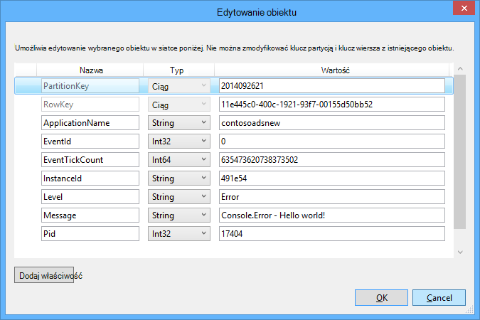

<properties 
    pageTitle="Jak używać magazyn kolejek Azure z zestawu SDK WebJobs" 
    description="Dowiedz się, jak magazyn kolejek Azure za pomocą WebJobs SDK. Tworzenie i usuwanie kolejki; Wstawianie, wgląd, pobieranie i usuwanie wiadomości w kolejce i nie tylko." 
    services="app-service\web, storage" 
    documentationCenter=".net" 
    authors="tdykstra" 
    manager="wpickett" 
    editor="jimbe"/>

<tags 
    ms.service="app-service-web" 
    ms.workload="web" 
    ms.tgt_pltfrm="na" 
    ms.devlang="dotnet" 
    ms.topic="article" 
    ms.date="06/01/2016" 
    ms.author="tdykstra"/>

# <a name="how-to-use-azure-queue-storage-with-the-webjobs-sdk"></a>Jak używać kolejki Azure miejsca do magazynowania z zestawu SDK WebJobs

## <a name="overview"></a>Omówienie

Ten przewodnik zawiera C# przykłady kodu, których pokazująca, jak korzystać z wersji Azure WebJobs SDK 1.x z usługą Azure kolejki magazyn.

Przewodnik założono, możesz dowiedzieć się, [jak utworzyć projekt WebJob w programie Visual Studio z parametry połączenia, które wskaż konto miejsca do magazynowania](websites-dotnet-webjobs-sdk-get-started.md#configure-storage) lub z [wieloma kontami miejsca do magazynowania](https://github.com/Azure/azure-webjobs-sdk/blob/master/test/Microsoft.Azure.WebJobs.Host.EndToEndTests/MultipleStorageAccountsEndToEndTests.cs).

Większość fragmenty kodu Pokaż tylko funkcje, nie kodu, tworzącego `JobHost` obiektu, jak w poniższym przykładzie:

        static void Main(string[] args)
        {
            JobHost host = new JobHost();
            host.RunAndBlock();
        }
        
Przewodnik obejmuje następujące tematy:

-   [Jak funkcja wyzwalacza po odebraniu wiadomości kolejki](#trigger)
    - Ciąg wiadomości w kolejce
    - Wiadomości w kolejce POCO
    - Funkcje asynchroniczne
    - Typy atrybut QueueTrigger współdziała z
    - Algorytm ankieta
    - Wielu wystąpień
    - Równoległego
    - Uzyskiwanie kolejki lub kolejka komunikatów metadanych
    - Bezpiecznie zamknięty
-   [Jak utworzyć wiadomość kolejki podczas przetwarzania wiadomości kolejki](#createqueue)
    - Ciąg wiadomości w kolejce
    - Wiadomości w kolejce POCO
    - Tworzenie wielu wiadomości lub w funkcjach asynchroniczne
    - Typy atrybut kolejki współdziała z
    - Używanie atrybutów WebJobs SDK w treści funkcji
-   [Jak odczytywanie i zapisywanie obiektów blob podczas przetwarzania wiadomości kolejki](#blobs)
    - Ciąg wiadomości w kolejce
    - Wiadomości w kolejce POCO
    - Typy atrybut obiektów Blob współdziała z
-   [Jak obsługiwać wiadomości](#poison)
    - Obsługi automatyczne uszkodzonych komunikatów
    - Obsługi ręcznego uszkodzonych komunikatów
-   [Jak ustawić opcje konfiguracji](#config)
    - Parametry połączenia zestawu SDK w kodzie
    - Konfigurowanie ustawień QueueTrigger
    - Ustawianie wartości dla WebJobs SDK konstruktora parametrów w kodzie
-   [Jak ręcznie wyzwalanie funkcji](#manual)
-   [Jak pisać dzienników](#logs) 
-   [Sposób obsługi błędów i konfigurowania limitów czasu](#errors)
-   [Następne kroki](#nextsteps)

## <a id="trigger"></a>Jak funkcja wyzwalacza po odebraniu wiadomości kolejki

Aby napisać funkcję, która wymaga WebJobs SDK po odebraniu wiadomości kolejki, użyj `QueueTrigger` atrybut. Konstruktor atrybutu ma parametr ciąg określający nazwę kolejki ankieta. Możesz również [ustawić nazwę kolejki dynamiczne](#config).

### <a name="string-queue-messages"></a>Ciąg wiadomości w kolejce

W poniższym przykładzie kolejki zawiera wiadomości w ciągu, więc `QueueTrigger` jest stosowana do parametru ciągu o nazwie `logMessage` zawierający zawartość wiadomości kolejki. Funkcja [zapisuje wiadomości dziennika do pulpitu nawigacyjnego](#logs).
 

        public static void ProcessQueueMessage([QueueTrigger("logqueue")] string logMessage, TextWriter logger)
        {
            logger.WriteLine(logMessage);
        }

Oprócz `string`, parametr może być tablicą bajt `CloudQueueMessage` obiektu lub POCO, który zdefiniujesz.

### <a name="poco-plain-old-clr-objecthttpenwikipediaorgwikiplainoldclrobject-queue-messages"></a>POCO [(zwykły stary obiekt CLR](http://en.wikipedia.org/wiki/Plain_Old_CLR_Object)) w kolejce wiadomości

W poniższym przykładzie wiadomość kolejki zawiera JSON dla `BlobInformation` obiekt, który zawiera `BlobName` właściwości. Zestaw SDK deserializes automatycznie obiekt.

        public static void WriteLogPOCO([QueueTrigger("logqueue")] BlobInformation blobInfo, TextWriter logger)
        {
            logger.WriteLine("Queue message refers to blob: " + blobInfo.BlobName);
        }

Zestaw SDK używa [pakiet Newtonsoft.Json NuGet](http://www.nuget.org/packages/Newtonsoft.Json) szeregować i deserializować wiadomości. Jeśli tworzysz wiadomości w kolejce programu, która nie korzysta z zestawu SDK WebJobs, można napisać kod, jak w następującym przykładzie, aby utworzyć wiadomość kolejki POCO, które można analizować zestawu SDK. 

        BlobInformation blobInfo = new BlobInformation() { BlobName = "log.txt" };
        var queueMessage = new CloudQueueMessage(JsonConvert.SerializeObject(blobInfo));
        logQueue.AddMessage(queueMessage);

### <a name="async-functions"></a>Funkcje asynchroniczne

Następujące asynchronicznych funkcji [zapisuje dziennika do pulpitu nawigacyjnego](#logs).

        public async static Task ProcessQueueMessageAsync([QueueTrigger("logqueue")] string logMessage, TextWriter logger)
        {
            await logger.WriteLineAsync(logMessage);
        }

Funkcje asynchroniczne może potrwać [token anulowania](http://www.asp.net/mvc/overview/performance/using-asynchronous-methods-in-aspnet-mvc-4#CancelToken), jak pokazano w poniższym przykładzie, który kopiuje obiektów blob. (Aby uzyskać wyjaśnienie `queueTrigger` symbol zastępczy, zobacz sekcję [obiektów blob](#blobs) .)

        public async static Task ProcessQueueMessageAsyncCancellationToken(
            [QueueTrigger("blobcopyqueue")] string blobName, 
            [Blob("textblobs/{queueTrigger}",FileAccess.Read)] Stream blobInput,
            [Blob("textblobs/{queueTrigger}-new",FileAccess.Write)] Stream blobOutput,
            CancellationToken token)
        {
            await blobInput.CopyToAsync(blobOutput, 4096, token);
        }

### <a id="qtattributetypes"></a>Typy atrybut QueueTrigger współdziała z

Możesz użyć `QueueTrigger` następujących typów:

* `string`
* Typ POCO seryjnych jako JSON
* `byte[]`
* `CloudQueueMessage`

### <a id="polling"></a>Algorytm ankieta

Zestaw SDK zawiera losowe wykładniczego wycofywania algorytmu zmniejszyć efekt idle kolejki sondowanie kosztów transakcja miejsca do magazynowania.  Po znalezieniu wiadomości zestawu SDK czeka dwie sekundy, a następnie sprawdza następnej wiadomości; Po znalezieniu wiadomości nie czeka około cztery sekund przed próbą ponownie. Po kolejnych nieudanej próby komunikat kolejki czas oczekiwania w dalszym ciągu zwiększanie aż osiągnie ona maksymalny czas oczekiwania, który domyślnie minutę. [Czas oczekiwania maksymalna jest konfigurowany](#config).

### <a id="instances"></a>Wielu wystąpień

Jeśli aplikacji sieci web działa na wielu wystąpień, ciągły WebJob działa na każdym komputerze i każdym komputerze będzie zaczekać, aż wyzwalaczami i spróbuj uruchomić funkcje. Wyzwalacza kolejki WebJobs SDK automatycznie zapobiega funkcji przetwarzania wiadomości kolejki wielokrotnie; funkcje nie mają do zapisania się idempotent. Jeśli chcesz upewnić się, że tylko jedno wystąpienie funkcji jest uruchamiany nawet wtedy, gdy istnieje wiele wystąpień aplikacji sieci web hosta, możesz użyć `Singleton` atrybut. 

### <a id="parallel"></a>Równoległego

Jeśli masz wiele funkcji nasłuchują na różnych kolejkach zestawu SDK nawiąże połączenie ich równolegle po odebraniu wiadomości jednocześnie. 

Ograniczenie dotyczy po odebraniu wielu wiadomości dla pojedynczej kolejki. Domyślnie zestawu SDK otrzymuje partię 16 wiadomości w kolejce naraz i wykonuje funkcję przetwarza je równolegle. [Rozmiar partii jest konfigurowany](#config). Kiedy liczba przetwarzanych uzyskuje w dół do połowie rozmiaru partii, zestawu SDK pobiera innej partii i rozpoczynają przetwarzanie tych wiadomości. Dlatego maksymalna liczba wiadomości równoczesne przetwarzane dla każdej funkcji jest jednym pół godziny i rozmiar partii. Ten limit dotyczy oddzielnie poszczególnych funkcji, która ma `QueueTrigger` atrybut. 

Jeśli nie chcesz równoległego dla wiadomości odebranych w jednej kolejki można ustawić rozmiar partii 1. Zobacz też **mieć większą kontrolę nad przetwarzanie kolejki** w [RTM Azure WebJobs SDK 1.1.0](/blog/azure-webjobs-sdk-1-1-0-rtm/).

### <a id="queuemetadata"></a>Uzyskiwanie kolejki lub kolejka komunikatów metadanych

Możesz uzyskać następujące właściwości wiadomości przez dodanie parametrów w podpisie metody:

* `DateTimeOffset`expirationTime
* `DateTimeOffset`insertionTime
* `DateTimeOffset`nextVisibleTime
* `string`queueTrigger (zawiera tekst wiadomości)
* `string`Identyfikator
* `string`popReceipt
* `int`dequeueCount

Jeśli chcesz pracować bezpośrednio z magazynu Azure interfejsu API, można również dodać `CloudStorageAccount` parametru.

Poniższy przykład zapisuje wszystkie te metadane informacje dziennika aplikacji. W tym przykładzie zarówno logMessage, jak i queueTrigger zawierają zawartość wiadomości kolejki.

        public static void WriteLog([QueueTrigger("logqueue")] string logMessage,
            DateTimeOffset expirationTime,
            DateTimeOffset insertionTime,
            DateTimeOffset nextVisibleTime,
            string id,
            string popReceipt,
            int dequeueCount,
            string queueTrigger,
            CloudStorageAccount cloudStorageAccount,
            TextWriter logger)
        {
            logger.WriteLine(
                "logMessage={0}\n" +
            "expirationTime={1}\ninsertionTime={2}\n" +
                "nextVisibleTime={3}\n" +
                "id={4}\npopReceipt={5}\ndequeueCount={6}\n" +
                "queue endpoint={7} queueTrigger={8}",
                logMessage, expirationTime,
                insertionTime,
                nextVisibleTime, id,
                popReceipt, dequeueCount,
                cloudStorageAccount.QueueEndpoint,
                queueTrigger);
        }

Poniżej przedstawiono przykładowy dziennik napisanego przez przykładowy kod:

        logMessage=Hello world!
        expirationTime=10/14/2014 10:31:04 PM +00:00
        insertionTime=10/7/2014 10:31:04 PM +00:00
        nextVisibleTime=10/7/2014 10:41:23 PM +00:00
        id=262e49cd-26d3-4303-ae88-33baf8796d91
        popReceipt=AgAAAAMAAAAAAAAAfc9H0n/izwE=
        dequeueCount=1
        queue endpoint=https://contosoads.queue.core.windows.net/
        queueTrigger=Hello world!

### <a id="graceful"></a>Bezpiecznie zamknięty

Funkcja, która działa w ciągły WebJob może zaakceptować `CancellationToken` parametr, który umożliwia do powiadomienia o tym, funkcja ma być zamykane WebJob systemu operacyjnego. To powiadomienie służy do upewnij się, że funkcja nie nieoczekiwane zakończenie w taki sposób, aby liście danych niespójna.

W poniższym przykładzie pokazano, jak sprawdzić, czy zbliżającym się zakończenie WebJob w funkcji.

    public static void GracefulShutdownDemo(
                [QueueTrigger("inputqueue")] string inputText,
                TextWriter logger,
                CancellationToken token)
    {
        for (int i = 0; i < 100; i++)
        {
            if (token.IsCancellationRequested)
            {
                logger.WriteLine("Function was cancelled at iteration {0}", i);
                break;
            }
            Thread.Sleep(1000);
            logger.WriteLine("Normal processing for queue message={0}", inputText);
        }
    }

**Uwaga:** Pulpit nawigacyjny nie może być poprawnie wyświetlana jest stan i dane wyjściowe funkcji, które został zamknięty.
 
Aby uzyskać więcej informacji zobacz [WebJobs bezpiecznie zamknięty](http://blog.amitapple.com/post/2014/05/webjobs-graceful-shutdown/#.VCt1GXl0wpR).   

## <a id="createqueue"></a>Jak utworzyć wiadomość kolejki podczas przetwarzania wiadomości kolejki

Aby napisać funkcję, która umożliwia utworzenie nowej wiadomości kolejki, użyj `Queue` atrybut. Jak `QueueTrigger`, należy przekazać w polu Nazwa kolejki w postaci ciągu lub możesz [ustawić nazwę kolejki dynamiczne](#config).

### <a name="string-queue-messages"></a>Ciąg wiadomości w kolejce

Poniższy przykład kodu nie asynchroniczne tworzy nową wiadomość kolejki w kolejce o nazwie "outputqueue", z taką samą zawartość jak kolejki komunikat w kolejce o nazwie "inputqueue". (Asynchroniczne za pomocą funkcji `IAsyncCollector<T>` jak pokazano w dalszej części w tej sekcji.)


        public static void CreateQueueMessage(
            [QueueTrigger("inputqueue")] string queueMessage,
            [Queue("outputqueue")] out string outputQueueMessage )
        {
            outputQueueMessage = queueMessage;
        }
  
### <a name="poco-plain-old-clr-objecthttpenwikipediaorgwikiplainoldclrobject-queue-messages"></a>POCO [(zwykły stary obiekt CLR](http://en.wikipedia.org/wiki/Plain_Old_CLR_Object)) w kolejce wiadomości

Aby utworzyć wiadomość kolejki, która zawiera POCO zamiast ciągu, należy przekazać typ POCO jako parametru wyjściowego do `Queue` Konstruktor atrybutu.
 
        public static void CreateQueueMessage(
            [QueueTrigger("inputqueue")] BlobInformation blobInfoInput,
            [Queue("outputqueue")] out BlobInformation blobInfoOutput )
        {
            blobInfoOutput = blobInfoInput;
        }

Zestaw SDK serializes automatycznie obiekt JSON. Wiadomości kolejki zawsze jest tworzona, nawet jeśli obiekt ma wartość null.

### <a name="create-multiple-messages-or-in-async-functions"></a>Tworzenie wielu wiadomości lub w funkcjach asynchroniczne

Aby utworzyć wiele wiadomości, należy typ parametru dla kolejki dane wyjściowe `ICollector<T>` lub `IAsyncCollector<T>`, jak pokazano w poniższym przykładzie.

        public static void CreateQueueMessages(
            [QueueTrigger("inputqueue")] string queueMessage,
            [Queue("outputqueue")] ICollector<string> outputQueueMessage,
            TextWriter logger)
        {
            logger.WriteLine("Creating 2 messages in outputqueue");
            outputQueueMessage.Add(queueMessage + "1");
            outputQueueMessage.Add(queueMessage + "2");
        }

Każda wiadomość kolejki zostanie utworzony natychmiast po `Add` metoda jest wywoływana.

### <a name="types-that-the-queue-attribute-works-with"></a>Typy atrybut kolejki współdziała z

Możesz użyć `Queue` atrybut na następujące typy parametrów:

* `out string`(tworzy kolejki wiadomości, jeśli wartość parametru jest różne od null, gdy funkcja kończy działanie)
* `out byte[]`(na przykład działa `string`) 
* `out CloudQueueMessage`(na przykład działa `string`) 
* `out POCO`(typu można tworzy wiadomość z obiektu o wartości null w przypadku parametrycznej null po zakończeniu funkcję)
* `ICollector`
* `IAsyncCollector`
* `CloudQueue`(w przypadku tworzenia wiadomości ręcznie bezpośrednio przy użyciu interfejsu API magazynu Azure)

### <a id="ibinder"></a>Używanie atrybutów WebJobs SDK w treści funkcji

Jeśli potrzebujesz niektórych pracy w swojej funkcji przed użyciem atrybut WebJobs SDK, takich jak `Queue`, `Blob`, lub `Table`, możesz użyć `IBinder` interfejsu.

W poniższym przykładzie trwa wiadomości kolejki wejściowej i tworzy nową wiadomość o tej samej zawartości w kolejce dane wyjściowe. Nazwa kolejki wynik jest ustawiany przez kod w treści funkcji.

        public static void CreateQueueMessage(
            [QueueTrigger("inputqueue")] string queueMessage,
            IBinder binder)
        {
            string outputQueueName = "outputqueue" + DateTime.Now.Month.ToString();
            QueueAttribute queueAttribute = new QueueAttribute(outputQueueName);
            CloudQueue outputQueue = binder.Bind<CloudQueue>(queueAttribute);
            outputQueue.AddMessage(new CloudQueueMessage(queueMessage));
        }

`IBinder` Interfejsu można także z `Table` i `Blob` atrybuty.

## <a id="blobs"></a>Jak odczytywanie i zapisywanie obiektów blob i tabel podczas przetwarzania wiadomości kolejki

`Blob` i `Table` atrybuty pozwalają na odczytywanie i zapisywanie obiektów blob i tabel. Przykłady w tej sekcji dotyczą obiektów blob. Dla przykłady kodu, pokazujące wyzwolić procesów, podczas tworzenia lub aktualizowania obiektów blob Dowiedz się, [jak korzystać z magazynem obiektów blob Azure z zestawu SDK WebJobs](websites-dotnet-webjobs-sdk-storage-blobs-how-to.md), a dla przykłady kodu, których odczytywanie i zapisywanie tabel, zobacz, [jak używać magazyn tabel platformy Azure z zestawu SDK WebJobs](websites-dotnet-webjobs-sdk-storage-tables-how-to.md).

### <a name="string-queue-messages-triggering-blob-operations"></a>Wiadomości w kolejce ciąg powodujące operacje obiektów blob

Wiadomości kolejki zawierającego ciąg `queueTrigger` to symbol zastępczy, możesz użyć w `Blob` atrybutu `blobPath` parametr, który zawiera treść wiadomości. 

W poniższym przykładzie użyto `Stream` obiektów do odczytu i zapisu blob. Wiadomości kolejki jest nazwą obiektów blob znajdujące się w kontenerze textblobs. Kopię blob z "-nowy" dołączane do nazwy zostanie utworzona w tym samym kontenerze. 

        public static void ProcessQueueMessage(
            [QueueTrigger("blobcopyqueue")] string blobName, 
            [Blob("textblobs/{queueTrigger}",FileAccess.Read)] Stream blobInput,
            [Blob("textblobs/{queueTrigger}-new",FileAccess.Write)] Stream blobOutput)
        {
            blobInput.CopyTo(blobOutput, 4096);
        }

`Blob` Atrybutu ma konstruktora `blobPath` parametr określający nazwę kontenera i obiektów blob. Aby uzyskać więcej informacji na temat ten symbol zastępczy Zobacz, [jak korzystać z magazynem obiektów blob Azure z zestawu SDK WebJobs](websites-dotnet-webjobs-sdk-storage-blobs-how-to.md) 

Gdy atrybut decorates `Stream` obiektu, określa inny parametr konstruktora `FileAccess` trybu odczytu, zapisu lub odczytu/zapisu. 

W poniższym przykładzie użyto `CloudBlockBlob` obiektu do usunięcia obiektów blob. Wiadomości kolejki to nazwa obiektu blob.

        public static void DeleteBlob(
            [QueueTrigger("deleteblobqueue")] string blobName,
            [Blob("textblobs/{queueTrigger}")] CloudBlockBlob blobToDelete)
        {
            blobToDelete.Delete();
        }

### <a id="pocoblobs"></a>POCO [(zwykły stary obiekt CLR](http://en.wikipedia.org/wiki/Plain_Old_CLR_Object)) w kolejce wiadomości

Aby POCO przechowywane jako JSON w kolejce wiadomości, można używać symboli zastępczych, których nazwa właściwości obiektu w `Queue` atrybutu `blobPath` parametru. Za pomocą [nazwy właściwości metadanych kolejki](#queuemetadata) jako symbole zastępcze. 

Poniższy przykład kopiuje obiektów blob do nowych obiektów blob z innym rozszerzeniem. Komunikat kolejki jest `BlobInformation` obiekt, który zawiera `BlobName` i `BlobNameWithoutExtension` właściwości. Nazwy właściwości są używane jako symbole zastępcze w ścieżce blob dla `Blob` atrybuty. 
 
        public static void CopyBlobPOCO(
            [QueueTrigger("copyblobqueue")] BlobInformation blobInfo,
            [Blob("textblobs/{BlobName}", FileAccess.Read)] Stream blobInput,
            [Blob("textblobs/{BlobNameWithoutExtension}.txt", FileAccess.Write)] Stream blobOutput)
        {
            blobInput.CopyTo(blobOutput, 4096);
        }

Zestaw SDK używa [pakiet Newtonsoft.Json NuGet](http://www.nuget.org/packages/Newtonsoft.Json) szeregować i deserializować wiadomości. Jeśli tworzysz wiadomości w kolejce programu, która nie korzysta z zestawu SDK WebJobs, można napisać kod, jak w następującym przykładzie, aby utworzyć wiadomość kolejki POCO, które można analizować zestawu SDK.

        BlobInformation blobInfo = new BlobInformation() { BlobName = "boot.log", BlobNameWithoutExtension = "boot" };
        var queueMessage = new CloudQueueMessage(JsonConvert.SerializeObject(blobInfo));
        logQueue.AddMessage(queueMessage);

Jeśli potrzebujesz niektórych prac w funkcja przed wiązanie obiektów blob do obiektu, można użyć atrybutu w treści funkcji, [jak pokazano powyżej dla atrybutu kolejki](#ibinder).

### <a id="blobattributetypes"></a>Typy, które umożliwiają atrybut obiektów Blob o
 
`Blob` Atrybut można używać następujących typów:

* `Stream`(odczytu lub zapisu, określona przy użyciu parametru konstruktora FileAccess)
* `TextReader`
* `TextWriter`
* `string`(do odczytu)
* `out string`(pisanie; tworzy obiektów blob tylko wtedy, gdy parametr ciągu jest różne od null, gdy funkcja zwraca)
* POCO (do odczytu)
* limit POCO (pisanie; zawsze tworzy blob, tworzy jako obiekt o wartości null, jeśli parametr POCO ma wartość null, gdy funkcja zwraca wartość)
* `CloudBlobStream`(Zapisz)
* `ICloudBlob`(odczytu lub zapisu)
* `CloudBlockBlob`(odczytu lub zapisu) 
* `CloudPageBlob`(odczytu lub zapisu) 

## <a id="poison"></a>Jak obsługiwać wiadomości

Wiadomości, której zawartość powoduje, że funkcja niepowodzenie są nazywane *wiadomości*. Gdy funkcja nie powiedzie się, wiadomości kolejki nie zostanie usunięty i ostatecznie zostaje pobrana ponownie powoduje cykl ma być powtarzane. Zestaw SDK można automatycznie przerwać cyklu po ograniczoną liczbę iteracji, lub możesz zrobić to ręcznie.

### <a name="automatic-poison-message-handling"></a>Obsługi automatyczne uszkodzonych komunikatów

Zestaw SDK nawiąże połączenie funkcji maksymalnie 5 razy przetwarzania wiadomości kolejki. Jeśli piątym spróbuj kończy się niepowodzeniem, wiadomość zostanie przeniesiona do poison kolejki. [Maksymalna liczba prób jest konfigurowany](#config). 

Poison kolejki nosi nazwę *{originalqueuename}*-poison. Można wpisać funkcję proces wiadomości z poison kolejki, rejestrowanie je lub wysyłając powiadomienie tego ręcznego uwagę jest potrzebna. 

W poniższym przykładzie `CopyBlob` funkcja zakończy się niepowodzeniem, gdy wiadomość kolejki zawiera nazwy obiektów blob, która nie istnieje. W takiej sytuacji wiadomość zostanie przeniesiona do kolejki copyblobqueue poison z kolejki copyblobqueue. `ProcessPoisonMessage` Zarejestrować Trująca wiadomość.

        public static void CopyBlob(
            [QueueTrigger("copyblobqueue")] string blobName,
            [Blob("textblobs/{queueTrigger}", FileAccess.Read)] Stream blobInput,
            [Blob("textblobs/{queueTrigger}-new", FileAccess.Write)] Stream blobOutput)
        {
            blobInput.CopyTo(blobOutput, 4096);
        }
        
        public static void ProcessPoisonMessage(
            [QueueTrigger("copyblobqueue-poison")] string blobName, TextWriter logger)
        {
            logger.WriteLine("Failed to copy blob, name=" + blobName);
        }

Na poniższej ilustracji przedstawiono wyjścia konsoli z tych funkcji podczas przetwarzania poison wiadomości.


### <a name="manual-poison-message-handling"></a>Obsługi ręcznego uszkodzonych komunikatów

Liczba pobrana wiadomość do przetwarzania można uzyskać, dodając `int` parametr o nazwie `dequeueCount` z funkcji. Następnie możesz sprawdzić statystykę kolejki w kodzie funkcji i wykonywać własne poison wiadomościami gdy liczba przekracza próg, jak pokazano w poniższym przykładzie.

        public static void CopyBlob(
            [QueueTrigger("copyblobqueue")] string blobName, int dequeueCount,
            [Blob("textblobs/{queueTrigger}", FileAccess.Read)] Stream blobInput,
            [Blob("textblobs/{queueTrigger}-new", FileAccess.Write)] Stream blobOutput,
            TextWriter logger)
        {
            if (dequeueCount > 3)
            {
                logger.WriteLine("Failed to copy blob, name=" + blobName);
            }
            else
            {
            blobInput.CopyTo(blobOutput, 4096);
            }
        }

## <a id="config"></a>Jak ustawić opcje konfiguracji

Możesz użyć `JobHostConfiguration` typu, aby ustawić następujące opcje konfiguracji:

* Ustaw parametry połączenia SDK w kodzie.
* Konfigurowanie `QueueTrigger` ustawień, takich jak maksymalna liczba usuwania z kolejki.
* Pobierz nazwy kolejek z konfiguracji.

### <a id="setconnstr"></a>Parametry połączenia zestawu SDK w kodzie

Ustawienie parametry połączenia SDK w kodzie umożliwia własnych nazw parametrów połączenia w plikach konfiguracji lub zmienne środowiska, jak pokazano w poniższym przykładzie.

        static void Main(string[] args)
        {
            var _storageConn = ConfigurationManager
                .ConnectionStrings["MyStorageConnection"].ConnectionString;
        
            var _dashboardConn = ConfigurationManager
                .ConnectionStrings["MyDashboardConnection"].ConnectionString;
        
            var _serviceBusConn = ConfigurationManager
                .ConnectionStrings["MyServiceBusConnection"].ConnectionString;
        
            JobHostConfiguration config = new JobHostConfiguration();
            config.StorageConnectionString = _storageConn;
            config.DashboardConnectionString = _dashboardConn;
            config.ServiceBusConnectionString = _serviceBusConn;
            JobHost host = new JobHost(config);
            host.RunAndBlock();
        }

### <a id="configqueue"></a>Konfigurowanie ustawień QueueTrigger

Możesz skonfigurować następujące ustawienia, które dotyczą kolejki przetwarzania wiadomości:

- Maksymalna liczba wiadomości, które są pobierane jednocześnie do wykonania równolegle (wartość domyślna to 16).
- Maksymalna liczba prób przed wysłaniem wiadomości kolejki do kolejki poison (wartość domyślna to 5).
- Maksymalny czas oczekiwania przed sondowanie ponownie, gdy kolejka jest pusta (wartość domyślna to 1 minuta).

W poniższym przykładzie pokazano, jak skonfigurować następujące ustawienia:

        static void Main(string[] args)
        {
            JobHostConfiguration config = new JobHostConfiguration();
            config.Queues.BatchSize = 8;
            config.Queues.MaxDequeueCount = 4;
            config.Queues.MaxPollingInterval = TimeSpan.FromSeconds(15);
            JobHost host = new JobHost(config);
            host.RunAndBlock();
        }

### <a id="setnamesincode"></a>Ustawianie wartości dla WebJobs SDK konstruktora parametrów w kodzie

Czasem warto Określ nazwę kolejki, nazwy obiektów blob lub kontenera lub tabeli w kodzie zamiast kodowane nadaj mu nazwę. Na przykład można określić nazwę kolejki `QueueTrigger` w zmiennej konfiguracji pliku lub środowiska. 

Można to zrobić przez przekazanie `NameResolver` obiektu, aby `JobHostConfiguration` typu. Możesz umieścić specjalne symbole zastępcze ujęte w znaki procentu (%) w polu Parametry Konstruktora atrybut WebJobs SDK i `NameResolver` kod określa rzeczywiste wartości można używać zamiast tych symboli zastępczych.

Załóżmy, że chcesz używać kolejki o nazwie logqueuetest w środowisku testowym i jeden nazwany logqueueprod produkcji. Zamiast nazwy kolejki stałe, chcesz określić nazwę wpisu w `appSettings` zbioru, zawierających nazwy kolejki rzeczywiste. Jeśli `appSettings` klucza jest logqueue, funkcja może wyglądać jak w poniższym przykładzie.

        public static void WriteLog([QueueTrigger("%logqueue%")] string logMessage)
        {
            Console.WriteLine(logMessage);
        }

Usługi `NameResolver` klasy następnie można uzyskać nazwę kolejki z `appSettings` jak pokazano w poniższym przykładzie:

        public class QueueNameResolver : INameResolver
        {
            public string Resolve(string name)
            {
                return ConfigurationManager.AppSettings[name].ToString();
            }
        }

Należy przekazać `NameResolver` klasy w celu `JobHost` obiektu, jak pokazano w poniższym przykładzie.

        static void Main(string[] args)
        {
            JobHostConfiguration config = new JobHostConfiguration();
            config.NameResolver = new QueueNameResolver();
            JobHost host = new JobHost(config);
            host.RunAndBlock();
        }
 
**Uwaga:** Nazwy obiektów blob, tabel i kolejki rozpoznawania zawsze nosi nazwę funkcji, ale rozpoznawania nazw kontenera obiektów blob tylko podczas uruchamiania aplikacji. Nie można zmienić nazwy kontenera obiektów blob podczas uruchamiania zadania. 

## <a id="manual"></a>Jak ręcznie wyzwalanie funkcji

Aby wyzwolić funkcji ręcznie, za pomocą `Call` lub `CallAsync` metoda `JobHost` obiektu i `NoAutomaticTrigger` atrybutów na tej funkcji, jak pokazano w poniższym przykładzie. 

        public class Program
        {
            static void Main(string[] args)
            {
                JobHost host = new JobHost();
                host.Call(typeof(Program).GetMethod("CreateQueueMessage"), new { value = "Hello world!" });
            }
        
            [NoAutomaticTrigger]
            public static void CreateQueueMessage(
                TextWriter logger, 
                string value, 
                [Queue("outputqueue")] out string message)
            {
                message = value;
                logger.WriteLine("Creating queue message: ", message);
            }
        }

## <a id="logs"></a>Jak pisać dzienników

Pulpit nawigacyjny zawiera dzienniki w dwóch miejscach: na stronie WebJob i stron dla poszczególnych wywołań WebJob. 


Dane wyjściowe z konsoli metod połączenia w funkcji lub w `Main()` metoda pojawia się na stronie pulpitu nawigacyjnego WebJob, a nie na stronie wywołania określonej metody. Dane wyjściowe obiektu TextWriter pobranego z parametrem w podpisie metody pojawi się na stronie pulpitu nawigacyjnego wywołania metody.

Nie można połączyć wyjścia konsoli wywołania konkretnej metody, ponieważ konsola jest pojedynczym wątku, gdy wiele funkcji zadania może być uruchomiona w tym samym czasie. Dlatego zestawu SDK zawiera każdego wywołania funkcji wraz z obiektem dziennika writer.

Aby zapisać [Dzienniki śledzenia aplikacji](web-sites-dotnet-troubleshoot-visual-studio.md#logsoverview), należy użyć `Console.Out` (tworzy Dzienniki oznaczone jako informacje) i `Console.Error` (tworzy Dzienniki oznaczone jako błąd). Alternatywny jest użycie [śledzenia lub TraceSource](http://blogs.msdn.com/b/mcsuksoldev/archive/2014/09/04/adding-trace-to-azure-web-sites-and-web-jobs.aspx), która udostępnia pełne, ostrzeżenia i krytyczne poziomy oprócz informacje i błędów. Dzienniki śledzenia aplikacji są wyświetlane w plikach dziennika aplikacji sieci web, Azure tabel lub blob Azure w zależności od sposobu skonfigurowania aplikacji sieci Azure web. Podobnie jak dla wszystkich wyjścia konsoli, ostatnio Dzienniki aplikacji 100 również są wyświetlane w strony pulpitu nawigacyjnego w WebJob, a nie do strony wywołanie funkcji. 

Wyjścia konsoli jest wyświetlany na pulpicie nawigacyjnym tylko wtedy, gdy program jest uruchomiony w WebJob Azure, nie, jeśli program działa lokalnie lub w niektórych innych środowiska.

Wyłączanie rejestrowania pulpitu nawigacyjnego scenariuszach wysokiej wydajności. Domyślnie zestawu SDK zapisuje dzienniki miejsca do magazynowania, a to działanie można zmniejszyć wydajność podczas przetwarzania wiele wiadomości. Aby wyłączyć rejestrowanie, ustaw wartość null, jak pokazano w poniższym przykładzie ciąg połączenia pulpitu nawigacyjnego.

        JobHostConfiguration config = new JobHostConfiguration();       
        config.DashboardConnectionString = "";        
        JobHost host = new JobHost(config);
        host.RunAndBlock();

W poniższym przykładzie pokazano kilka sposobów, aby zapisać dzienniki:

        public static void WriteLog(
            [QueueTrigger("logqueue")] string logMessage,
            TextWriter logger)
        {
            Console.WriteLine("Console.Write - " + logMessage);
            Console.Out.WriteLine("Console.Out - " + logMessage);
            Console.Error.WriteLine("Console.Error - " + logMessage);
            logger.WriteLine("TextWriter - " + logMessage);
        }

Na pulpicie nawigacyjnym SDK WebJobs, wynikiem `TextWriter` pokazano obiekt w górę po przejściu do strony dla konkretnej funkcja wywołania i kliknij przycisk **Przełącz wyjście**:


Na pulpicie nawigacyjnym SDK WebJobs 100 ostatnich wierszy konsoli wyjściowy Pokaż w górę, po kliknięciu **Przełącznik dane wyjściowe**i przejdź do strony dla WebJob (a nie dla wywołania funkcji).
 


W ciągły WebJob Dzienniki aplikacji widoczne w/danych/zadania/ciągły /*{webjobname}*/job_log.txt w systemie plików aplikacji sieci web.

        [09/26/2014 21:01:13 > 491e54: INFO] Console.Write - Hello world!
        [09/26/2014 21:01:13 > 491e54: ERR ] Console.Error - Hello world!
        [09/26/2014 21:01:13 > 491e54: INFO] Console.Out - Hello world!

Platformy Azure blob aplikacji dzienniki wygląda tak: 2014-09-26T21:01:13,Information,contosoadsnew,491e54,635473620738373502,0,17404,17,Console.Write - Witaj świecie!, 2014-09-26T21:01:13,Error,contosoadsnew,491e54,635473620738373502,0,17404,19,Console.Error - Witaj świecie!, 2014-09-26T21:01:13,Information,contosoadsnew,491e54,635473620738529920,0,17404,17,Console.Out - Witaj świecie!,

W tabeli programu Azure `Console.Out` i `Console.Error` dzienniki wyglądać podobnie do następującej:




Jeśli chcesz Podłącz własne rejestratora, zobacz [w tym przykładzie](http://github.com/Azure/azure-webjobs-sdk-samples/blob/master/BasicSamples/MiscOperations/Program.cs).

## <a id="errors"></a>Sposób obsługi błędów i konfigurowania limitów czasu

WebJobs SDK zawiera również [przekroczenia limitu czasu](http://github.com/Azure/azure-webjobs-sdk-samples/blob/master/BasicSamples/MiscOperations/Functions.cs) atrybut, który umożliwia powodować funkcję anulowany, jeśli nie zakończył się w określonym czasie. I jeśli chcesz podnieść alertu w przypadku zbyt wiele błędów w określonym czasie, możesz użyć `ErrorTrigger` atrybut. Oto [przykład ErrorTrigger](https://github.com/Azure/azure-webjobs-sdk-extensions/wiki/Error-Monitoring).

```
public static void ErrorMonitor(
[ErrorTrigger("00:01:00", 1)] TraceFilter filter, TextWriter log,
[SendGrid(
    To = "admin@emailaddress.com",
    Subject = "Error!")]
 SendGridMessage message)
{
    // log last 5 detailed errors to the Dashboard
   log.WriteLine(filter.GetDetailedMessage(5));
   message.Text = filter.GetDetailedMessage(1);
}
```

Można także dynamicznie wyłączyć i włączyć funkcje do kontrolki, czy ta osoba może być uruchomiona, za pomocą przełącznika konfiguracji, który może być ustawienie aplikacji lub nazwy zmiennej środowiska. Przykładowy kod, zobacz `Disable` atrybut w [repozytorium WebJobs SDK próbki](https://github.com/Azure/azure-webjobs-sdk-samples/blob/master/BasicSamples/MiscOperations/Functions.cs).

## <a id="nextsteps"></a>Następne kroki

Ten przewodnik udostępniła przykłady kodu, pokazujące sposób obsługi typowe scenariusze dotyczące pracy z kolejek Azure. Aby uzyskać więcej informacji o używaniu Azure WebJobs i WebJobs SDK, zobacz [Azure WebJobs zalecane zasoby](http://go.microsoft.com/fwlink/?linkid=390226).
 
