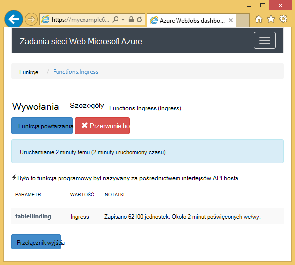
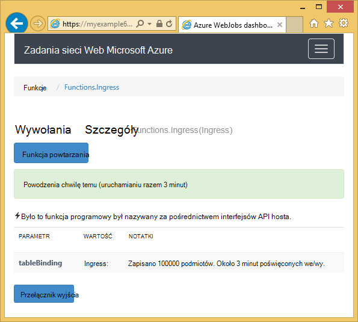

<properties 
    pageTitle="Jak korzystać z zestawu SDK WebJobs magazyn tabel platformy Azure" 
    description="Dowiedz się, jak magazyn tabel platformy Azure za pomocą WebJobs SDK. Tworzenie tabel, dodawać jednostki do tabel i przeczytaj istniejących tabel." 
    services="app-service\web, storage" 
    documentationCenter=".net" 
    authors="tdykstra" 
    manager="wpickett" 
    editor="jimbe"/>

<tags 
    ms.service="app-service-web" 
    ms.workload="web" 
    ms.tgt_pltfrm="na" 
    ms.devlang="dotnet" 
    ms.topic="article" 
    ms.date="06/01/2016" 
    ms.author="tdykstra"/>

# Jak korzystać z WebJobs SDK magazyn tabel platformy Azure

## Omówienie

Ten przewodnik zawiera C# przykłady pokazujące odczytywanie i zapisywanie Azure magazyn tabel przy użyciu wersji [WebJobs SDK](websites-dotnet-webjobs-sdk.md) 1.x.

Przewodnik założono, możesz dowiedzieć się, [jak utworzyć projekt WebJob w programie Visual Studio z parametry połączenia, które wskaż konta miejsca do magazynowania](websites-dotnet-webjobs-sdk-get-started.md) lub z [wieloma kontami miejsca do magazynowania](https://github.com/Azure/azure-webjobs-sdk/blob/master/test/Microsoft.Azure.WebJobs.Host.EndToEndTests/MultipleStorageAccountsEndToEndTests.cs).
        
Niektóre Pokaż wstawki kodu `Table` atrybutu używanego w funkcje, które są [nazywane ręcznie](websites-dotnet-webjobs-sdk-storage-queues-how-to.md#manual), oznacza to, że nie przy użyciu jednego z atrybutów wyzwalacza. 

## Dodawanie obiektów do tabeli

Aby dodać obiektów do tabeli, użyj `Table` atrybutów z `ICollector<T>` lub `IAsyncCollector<T>` parametru miejsce, w którym `T` Określa schemat jednostki, w której chcesz dodać. Konstruktor atrybutu ma parametr ciąg określający nazwę tabeli. 

Poniższy przykładowy kod dodaje `Person` obiektów do tabeli o nazwie *Ingress*.

        [NoAutomaticTrigger]
        public static void IngressDemo(
            [Table("Ingress")] ICollector<Person> tableBinding)
        {
            for (int i = 0; i < 100000; i++)
            {
                tableBinding.Add(
                    new Person() { 
                        PartitionKey = "Test", 
                        RowKey = i.ToString(), 
                        Name = "Name" }
                    );
            }
        }

Zwykle typ korzystania z `ICollector` pochodzi z `TableEntity` lub wykonuje `ITableEntity`, ale nie musi być. Jedną z następujących `Person` klasy pracy z kodem wyświetlane w poprzednim `Ingress` metody.

        public class Person : TableEntity
        {
            public string Name { get; set; }
        }

        public class Person
        {
            public string PartitionKey { get; set; }
            public string RowKey { get; set; }
            public string Name { get; set; }
        }

Jeśli chcesz pracować bezpośrednio z magazynu Azure interfejsu API, możesz dodać `CloudStorageAccount` parametr w podpisie metody.

## Monitorowania w czasie rzeczywistym

Ponieważ funkcje ingress danych często procesu dużych ilości danych, na pulpicie nawigacyjnym WebJobs SDK zawiera dane czasu rzeczywistego monitorowania. Sekcji **Dziennik wywołania** informuje, czy funkcja jest nadal uruchomiony.

Na stronie **Szczegółów wywołania** raportów funkcji postępu (liczba jednostek napisane) jest uruchomiony, i daje możliwość je przerwać. 

Po zakończeniu działania funkcji na stronie **Szczegółów wywołania** raportów liczba wierszy zapisywanych.

## Jak odczytać wiele jednostek z tabeli

Aby odczytać tabeli, użyj `Table` atrybutów z `IQueryable<T>` parametru wpisuje `T` pochodzi z `TableEntity` lub wykonuje `ITableEntity`.

Poniższy przykład kodu odczytuje i rejestruje wszystkie wiersze z `Ingress` tabeli:
 
        public static void ReadTable(
            [Table("Ingress")] IQueryable<Person> tableBinding,
            TextWriter logger)
        {
            var query = from p in tableBinding select p;
            foreach (Person person in query)
            {
                logger.WriteLine("PK:{0}, RK:{1}, Name:{2}", 
                    person.PartitionKey, person.RowKey, person.Name);
            }
        }

### Jak odczytać całość z tabeli

Istnieje `Table` Konstruktor atrybutu z dwoma parametrami dodatkowe, które umożliwiają określenie klucz partycją i klucz wiersza, gdy chcesz powiązać podmiot jednej tabeli.

Poniższy przykład kodu odczytuje wiersz tabeli dla `Person` jednostki na podstawie partition klucz i wiersz klucza wartości otrzymanych w kolejce wiadomości:  

        public static void ReadTableEntity(
            [QueueTrigger("inputqueue")] Person personInQueue,
            [Table("persontable","{PartitionKey}", "{RowKey}")] Person personInTable,
            TextWriter logger)
        {
            if (personInTable == null)
            {
                logger.WriteLine("Person not found: PK:{0}, RK:{1}",
                        personInQueue.PartitionKey, personInQueue.RowKey);
            }
            else
            {
                logger.WriteLine("Person found: PK:{0}, RK:{1}, Name:{2}",
                        personInTable.PartitionKey, personInTable.RowKey, personInTable.Name);
            }
        }

`Person` Klasy w tym przykładzie nie trzeba zaimplementować `ITableEntity`.

## Jak korzystać z interfejsu API magazynu .NET bezpośrednio do pracy z tabeli

Można również użyć `Table` atrybutów z `CloudTable` obiektu w celu uzyskania większej elastyczności w pracy z tabelą.

Poniższy kod przykładowy przy użyciu `CloudTable` obiekt, aby dodać do tabeli *Ingress* całość. 
 
        public static void UseStorageAPI(
            [Table("Ingress")] CloudTable tableBinding,
            TextWriter logger)
        {
            var person = new Person()
                {
                    PartitionKey = "Test",
                    RowKey = "100",
                    Name = "Name"
                };
            TableOperation insertOperation = TableOperation.Insert(person);
            tableBinding.Execute(insertOperation);
        }

Aby uzyskać więcej informacji o używaniu `CloudTable` obiektu, Dowiedz się, [jak używać magazyn tabel z .NET](../storage/storage-dotnet-how-to-use-tables.md). 

## Tematy pokrewne objętych artykule kolejki

Aby uzyskać informacje o obsługę przetwarzania tabeli wyzwalane przez wiadomości kolejki lub scenariuszy WebJobs SDK nie określonych tabeli przetwarzanie, zobacz [jak korzystania z magazynu Azure kolejki z zestawu SDK WebJobs](websites-dotnet-webjobs-sdk-storage-queues-how-to.md). 

Tematy w tym artykule omówione są następujące:

* Funkcje asynchroniczne
* Wielu wystąpień
* Bezpiecznie zamknięty
* Używanie atrybutów WebJobs SDK w treści funkcji
* Ustaw parametry połączenia SDK w kodzie
* Ustawianie wartości dla WebJobs SDK konstruktora parametrów w kodzie
* Funkcja wyzwalacza ręcznie
* Pisanie dzienników

## Następne kroki

Ten przewodnik udostępniła przykłady kodu, pokazujące sposób obsługi typowe scenariusze dotyczące pracy z tabelami Azure. Aby uzyskać więcej informacji o używaniu Azure WebJobs i WebJobs SDK, zobacz [Azure WebJobs zalecane zasoby](http://go.microsoft.com/fwlink/?linkid=390226).
 
