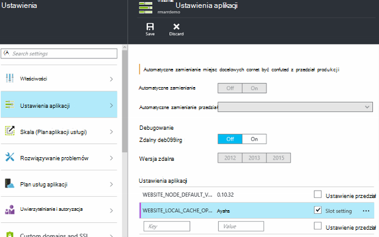

<properties
   pageTitle="Omówienie lokalnej pamięci podręcznej aplikacji usługi Azure | Microsoft Azure"
   description="W tym artykule opisano, jak włączyć, zmienianie rozmiaru i stan funkcji lokalnej pamięci podręcznej Azure aplikacji usługi zapytania"
   services="app-service"
   documentationCenter="app-service"
   authors="SyntaxC4"
   manager="yochayk"
   editor=""
   tags="optional"
   keywords=""/>

<tags
   ms.service="app-service"
   ms.devlang="multiple"
   ms.topic="article"
   ms.tgt_pltfrm="na"
   ms.workload="na"
   ms.date="03/04/2016"
   ms.author="cfowler"/>

# <a name="azure-app-service-local-cache-overview"></a>Omówienie lokalnej pamięci podręcznej aplikacji usługi Azure

Zawartości aplikacji sieci web Azure są przechowywane w magazynie Azure i jest wyświetlana w górę w sposób trwały jako zawartości udostępnionej. Ten projekt jest przeznaczona do pracy z szeroką gamę aplikacji i ma następujące atrybuty:  

* Zawartość jest udostępniane wielu wystąpień maszyn wirtualnych (maszyn wirtualnych) aplikacji sieci web.
* Zawartość jest trwały i którą można modyfikować, uruchamiając aplikacji sieci web.
* Pliki dziennika i pliki danych diagnostycznych są dostępne w tym samym folderze zawartości udostępnionej.
* Bezpośrednio publikowania nowej zawartości aktualizacji zawartości folderu. Można od razu wyświetlić tę samą zawartość za pośrednictwem witryny sieci Web Menedżer sterowania usługami i uruchomionego aplikacji sieci web (zwykle niektórych technologii, takich jak ASP.NET zainicjować ponowne uruchomienie aplikacji sieci web na uzyskiwanie najnowszej treści niektóre zmiany pliku).

Gdy wiele aplikacji sieci web za pomocą jedną lub wszystkie z tych funkcji, niektóre aplikacje sieci web, wystarczy wysokiej wydajności, tylko do odczytu magazynu zawartości, które mogą uruchamiać z o wysokiej dostępności. Te aplikacje mogą korzystać z wystąpieniem maszyn wirtualnych określonych lokalnej pamięci podręcznej.

Funkcja lokalnej pamięci podręcznej Azure aplikacji usługi zapewnia widoku roli sieci web zawartości. Ta zawartość jest pamięci podręcznej zapisu — ale Odrzuć zawartości miejsca do magazynowania utworzonym asynchroniczne podczas uruchamiania witryny. Gdy pamięci podręcznej będzie gotowa, witryny jest włączane do uruchamiania w pamięci podręcznej zawartości. Aplikacje sieci Web, które działają w lokalnej pamięci podręcznej są następujące korzyści:

* Są one błędy opóźnienia występujące, gdy będą uzyskiwać dostęp do zawartości ilość miejsca do magazynowania Azure.
* Są one błędy zaplanowane uaktualnienia lub niezaplanowane awariami i inne zakłócenia z nośnikami Azure, występujących na serwerach, które obsługują zawartości udostępnionej.
* Mają mniej uruchomieniu aplikacji ze względu na zmiany Udostępnij miejsca do magazynowania.

## <a name="how-local-cache-changes-the-behavior-of-app-service"></a>Jak lokalnej pamięci podręcznej powoduje zmianę zachowania aplikacji usługi

* Lokalnej pamięci podręcznej jest kopię /site i /siteextensions folderów aplikacji sieci web. Zostanie utworzony w lokalnym wystąpieniu maszyn wirtualnych podczas uruchamiania aplikacji sieci web. Rozmiar lokalnej pamięci podręcznej dla aplikacji sieci web jest ograniczone do 300 MB domyślnie, ale można zwiększyć do 1 GB.
* Lokalnej pamięci podręcznej jest odczytu i zapisu. Jednak wszelkie zmiany zostaną odrzucone podczas aplikacji sieci web jest przenoszony maszyn wirtualnych lub otrzymuje ponownego uruchamiania. Nie należy używać lokalnej pamięci podręcznej dla aplikacji, które krytyczne dane są przechowywane w magazynie zawartości.
* Aplikacje sieci Web można kontynuować pisanie pliki dziennika i dane diagnostyczne tak samo, jak obecnie. Pliki dziennika i dane, jednak są przechowywane lokalnie na maszyn wirtualnych. Następnie są one kopiowane na okresowo w magazynie zawartości udostępnionej. Kopiuj do udostępnionego magazynu zawartości jest najlepszego nakładu--zapisu, który tworzy kopię mogą zostać utracone ukończenia przerwa awarie wystąpienia maszyn wirtualnych.
* Ma zmiany w strukturze folderów w folderach LogFiles i danych dla aplikacji sieci web, korzystających z lokalnej pamięci podręcznej. W przestrzeni dyskowej LogFiles i dane występujące po tym wzorzec nazewnictwa "identyfikator" + sygnatura czasowa teraz są podfolderami. Odpowiada wszystkich podfolderów w przypadku wystąpienia maszyn wirtualnych miejsce, w którym jest uruchomiony lub zostało uruchomione w aplikacji sieci web.  
* Publikowanie zmian w aplikacji sieci web przy użyciu mechanizmu publikowania będą publikować w magazynie zawartości udostępnionej. Jest to działanie zamierzone ponieważ chcemy ma być trwałe opublikowanych zawartość. Aby odświeżyć w lokalnej pamięci podręcznej aplikacji sieci web, należy ponownie uruchomić. Czy to wydawać nadmiarowe krok? Aby wprowadzić do zarządzania cyklem Bezproblemowa, zobacz informacje w dalszej części tego artykułu.
* D:\Home będzie wskazywać lokalnej pamięci podręcznej. Nadal będzie D:\Local wskazująca tymczasowego przechowywania określonych maszyn wirtualnych.
* Domyślny widok zawartości witryny Menedżer sterowania usługami będzie się magazynie zawartości udostępnionej.

## <a name="enable-local-cache-in-app-service"></a>Włączanie lokalnej pamięci podręcznej w aplikacji usługi

Lokalnej pamięci podręcznej możesz skonfigurować przy użyciu kombinacji ustawień zastrzeżone aplikacji. Możesz skonfigurować następujące ustawienia aplikacji, korzystając z następujących metod:

* [Azure portal](#Configure-Local-Cache-Portal)
* [Azure Menedżera zasobów](#Configure-Local-Cache-ARM)

### <a name="configure-local-cache-by-using-the-azure-portal"></a>Konfigurowanie lokalnej pamięci podręcznej za pomocą portalu Azure
<a name="Configure-Local-Cache-Portal"></a>

Możesz włączyć lokalnej pamięci podręcznej na podstawie na sieci web — aplikacji za pomocą tego ustawienia aplikacji:`WEBSITE_LOCAL_CACHE_OPTION` = `Always`  



### <a name="configure-local-cache-by-using-azure-resource-manager"></a>Konfigurowanie lokalnej pamięci podręcznej przy użyciu Menedżera zasobów Azure
<a name="Configure-Local-Cache-ARM"></a>

```
...

{
    "apiVersion": "2015-08-01",
    "type": "config",
    "name": "appsettings",
    "dependsOn": [
        "[resourceId('Microsoft.Web/sites/', variables('siteName'))]"
    ],
    "properties": {
        "WEBSITE_LOCAL_CACHE_OPTION": "Always",
        "WEBSITE_LOCAL_CACHE_SIZEINMB": "300"
    }
}

...
```

## <a name="change-the-size-setting-in-local-cache"></a>Zmienianie ustawień rozmiaru w lokalnej pamięci podręcznej

Domyślnie rozmiar lokalnej pamięci podręcznej wynosi **300 MB**. Ta opcja uwzględnia /site i /siteextensions foldery, które są kopiowane z magazynu zawartości, a także lokalnie utworzone foldery dzienników i danych. Aby zwiększyć ten limit, użyj ustawienia aplikacji `WEBSITE_LOCAL_CACHE_SIZEINMB`. Można zwiększyć rozmiar maksymalnie **1 GB** (1000 MB) dla aplikacji sieci web.

## <a name="best-practices-for-using-app-service-local-cache"></a>Najważniejsze wskazówki dotyczące korzystania z lokalnej pamięci podręcznej aplikacji usługi

Firma Microsoft zaleca używanie lokalnej pamięci podręcznej w połączeniu z funkcją [Środowiskach tymczasowego](../app-service-web/web-sites-staged-publishing.md) .

* Dodaj _lepkich_ ustawienie aplikacji `WEBSITE_LOCAL_CACHE_OPTION` z wartością `Always` do swojego przedział **produkcji** . Jeśli korzystasz z `WEBSITE_LOCAL_CACHE_SIZEINMB`, również dodać jako lepkich ustawienia usługi przedział produkcji.
* Tworzenie przedział **tymczasowego** i publikowanie usługi przedział tymczasowego. Zwykle nie ustawisz tymczasowy przedział, aby włączyć płynną cyklu życia kompilacji wdrażanie test przemieszczania, jeśli zostanie wyświetlony korzyści wynikających z lokalnej pamięci podręcznej dla niej produkcji za pomocą lokalnej pamięci podręcznej.
*   Testowanie witryny usługi przedział tymczasowego.  
*   Gdy skończysz, problemów [operacji wymiany](../app-service-web/web-sites-staged-publishing.md#to-swap-deployment-slots) między usługi gniazd roboczych i produkcyjnych.  
*   Ustawienia lepkich obejmują nazwę i lepkich do przedziału. Dlatego po przedział tymczasowego otrzymuje zamienione na produkcji, będzie dziedziczą ustawienia aplikacji lokalnej pamięci podręcznej. Nowo zamieniony przedział produkcji zostanie uruchomiony lokalnej pamięci podręcznej po upływie kilku minut i będzie rozgrzane jako część warmup przedział po wymiany. Dlatego po zakończeniu wymiany przedział usługi przedział produkcji ma działać w lokalnej pamięci podręcznej.

## <a name="frequently-asked-questions-faq"></a>Często zadawane pytania

### <a name="how-can-i-tell-if-local-cache-applies-to-my-web-app"></a>Jak sprawdzić, jeśli lokalnej pamięci podręcznej dotyczy aplikacji sieci web?

Jeśli aplikacji sieci web wymaga wysokiej wydajności, niezawodne magazynu zawartości, nie używa magazynu zawartości do pisania krytycznych danych w czasie rzeczywistym i jest mniejsza niż 1 GB w całkowity rozmiar, następnie odpowiedź brzmi "tak"! Aby uzyskać całkowity rozmiar foldery /site i /siteextensions, służy rozszerzenia witryny "Użycie dysku aplikacje sieci Web Azure".  

### <a name="how-can-i-tell-if-my-site-has-switched-to-using-local-cache"></a>Jak sprawdzić, jeśli Moja witryna przełączył do korzystania z lokalnej pamięci podręcznej?

Jeśli korzystasz z lokalnej pamięci podręcznej funkcji ze środowiskami tymczasowego, operacja wymiany nie zostanie ukończona, dopóki jest rozgrzane lokalnej pamięci podręcznej. Aby sprawdzić, czy witryny jest uruchomiony przed lokalnej pamięci podręcznej, możesz sprawdzić zmiennej środowiska proces roboczy `WEBSITE_LOCALCACHE_READY`. Aby uzyskać dostęp do zmiennej środowiska proces roboczy na wielu wystąpień, wykonaj instrukcje na stronie [zmiennej środowiska proces pracownika](https://github.com/projectkudu/kudu/wiki/Process-Threads-list-and-minidump-gcdump-diagsession#process-environment-variable) .  

### <a name="i-just-published-new-changes-but-my-web-app-does-not-seem-to-have-them-why"></a>Właśnie jest opublikowany nowych zmian, ale prawdopodobnie nie ma ich aplikacji sieci web. Dlaczego?

Jeśli aplikacji sieci web korzysta z lokalnej pamięci podręcznej, należy ponownie uruchomić witryny, aby uzyskać najnowsze zmiany. Nie chcesz, aby opublikować zmiany w witrynie produkcji? Zobacz Opcje przedział w poprzedniej sekcji najważniejszych wskazówek.

### <a name="where-are-my-logs"></a>Gdzie są Moje dzienniki?

Z lokalnej pamięci podręcznej usługi Dzienniki i foldery danych wyglądają nieco inaczej. Jednak strukturę do podfolderów pozostaje taki sam, z wyjątkiem, że podfoldery są nestled w obszarze podfolder z formatu "maszyn wirtualnych identyfikator" + sygnatura czasowa.

### <a name="i-have-local-cache-enabled-but-my-web-app-still-gets-restarted-why-is-that-i-thought-local-cache-helped-with-frequent-app-restarts"></a>Mam włączone lokalnej pamięci podręcznej, ale Moja aplikacja sieci web nadal otrzymuje ponownie uruchomić. Dlaczego tak jest? Myślę, że lokalnej pamięci podręcznej pomocne przy uruchomieniu aplikacji częste.

Lokalnej pamięci podręcznej zapobiec uruchomieniu aplikacji sieci web magazynowaniem. Jednak aplikacji sieci web można nadal przechodzić ponownego uruchamiania podczas zaplanowanej infrastruktury uaktualnienia maszyn wirtualnych. Ogólna uruchomieniu aplikacji, związanych z lokalnej pamięci podręcznej włączony procesem powinny być mniej.
