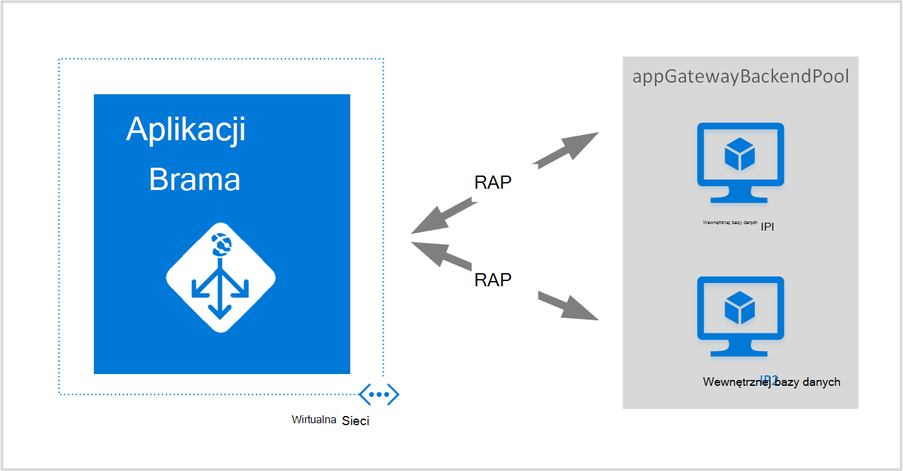
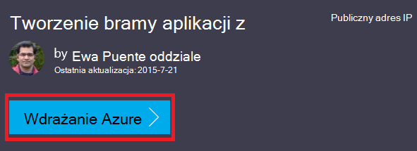
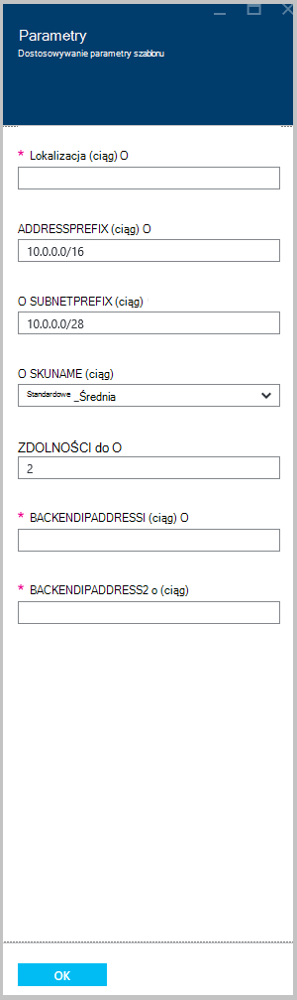

<properties
   pageTitle="Tworzenie bramy aplikacji przy użyciu szablonów Menedżera zasobów Azure | Microsoft Azure"
   description="Ta strona zawiera instrukcje, aby utworzyć bramy aplikacji Azure za pomocą szablonu Azure Menedżera zasobów"
   documentationCenter="na"
   services="application-gateway"
   authors="georgewallace"
   manager="carmonm"
   editor="tysonn"/>
<tags
   ms.service="application-gateway"
   ms.devlang="na"
   ms.topic="article"
   ms.tgt_pltfrm="na"
   ms.workload="infrastructure-services"
   ms.date="10/25/2016"
   ms.author="gwallace"/>

# Tworzenie bramy aplikacji za pomocą szablonu Azure Menedżera zasobów

> [AZURE.SELECTOR]
- [Azure portal](application-gateway-create-gateway-portal.md)
- [Azure PowerShell Menedżera zasobów](application-gateway-create-gateway-arm.md)
- [Azure klasycznego programu PowerShell](application-gateway-create-gateway.md)
- [Azure szablonu Menedżera zasobów](application-gateway-create-gateway-arm-template.md)
- [Polecenie Azure](application-gateway-create-gateway-cli.md)

Azure brama aplikacji jest równoważenia obciążenia warstwy-7. Zapewnia on awaryjnym przeniesieniu routingu wydajności żądania HTTP między różnych serwerów, czy są one na chmurze lub lokalnego. Brama aplikacji oferuje wiele funkcji aplikacji dostarczenia kontroler (ADC), w tym równoważenia obciążenia HTTP koligacji sesji plików cookie, Secure Sockets Layer (SSL) offload sondy zdrowia niestandardowe, obsługę wielu witryn i wiele innych. Aby uzyskać pełną listę obsługiwanych funkcji, odwiedź stronę [Omówienie bramy aplikacji](application-gateway-introduction.md)

Jak pobrać i modyfikowanie istniejącego szablonu Menedżera zasobów Azure z GitHub i wdrażanie szablonu z GitHub, programu PowerShell i polecenie Azure.

W przypadku po prostu rozmieszczania szablonu Menedżera zasobów Azure bezpośrednio z GitHub bez żadnych zmian, przejdź do wdrożenia szablonu na podstawie GitHub.

## Scenariusz

W tym scenariuszu spowoduje:

- Tworzenie bramy aplikacji z dwoma wystąpieniami.
- Tworzenie wirtualnych sieci o nazwie VirtualNetwork1 z zastrzeżone blok CIDR 10.0.0.0/16.
- Tworzenie podsieci o nazwie Appgatewaysubnet, której używa 10.0.0.0/28 jako jego blok CIDR.
- Konfigurowanie dwóch wcześniej skonfigurowane adresy IP wewnętrznej dla serwerów sieci web do równoważenia obciążenia ruchu. W tym przykładzie szablonu wewnętrznej adresy IP są 10.0.1.10 i 10.0.1.11.

>[AZURE.NOTE] Te ustawienia są parametry tego szablonu. Aby dostosować szablon, można zmienić reguły, odbiornika i SSL, który pozwala otwierać azuredeploy.json.

## Pobieranie i opis szablonu Azure Menedżera zasobów

Możesz pobrać istniejącego szablonu Azure Menedżera zasobów w celu tworzenia wirtualnej sieci i podsieci dwa z GitHub, wprowadź odpowiednie zmiany, może być i użyć jej ponownie. Aby to zrobić, wykonaj następujące czynności:

1. Przejdź do [tworzenia aplikacji bramy](https://github.com/Azure/azure-quickstart-templates/tree/master/101-application-gateway-create).
2. Kliknij **azuredeploy.json**, a następnie kliknij opcję **RAW**.
3. Zapisz plik w lokalnym folderze na komputerze.
4. Użytkownicy zaznajomieni z szablonami Menedżera zasobów Azure, przejdź do kroku 7.
5. Otwórz plik, który został zapisany i przeglądać zawartość w obszarze **Parametry** w wierszu 5. Azure parametrów szablonu Menedżera zasobów zapewniają symbolu zastępczego wartości, które można wypełniać podczas wdrażania.

  	| Parametr | Opis |
  	|---|---|
  	| **Lokalizacja** | Azure region, w której jest tworzona bramy aplikacji |
  	| **VirtualNetwork1** | Nazwę nowego wirtualnej sieci |
  	| **addressPrefix** | Przestrzeń adresów wirtualnych sieci, w formacie CIDR |
  	| **ApplicationGatewaysubnet** | Nazwa podsieci bramy aplikacji |
  	| **subnetPrefix** | Blokowanie CIDR podsieci bramy aplikacji |
  	| **skuname** | Jednostka SKU wystąpienie rozmiar |
  	| **wydajność** | Liczba wystąpień |
  	| **backendaddress1** | Adres IP pierwszego serwera sieci web |
  	| **backendaddress2** | Adres IP drugi serwer sieci web |

    >[AZURE.IMPORTANT] Azure szablony Menedżera zasobów w GitHub można zmienić w czasie. Upewnij się, wybierz szablon przed użyciem.

6. Zaznacz zawartość w obszarze **zasoby** i zwróć uwagę na następujące czynności:

    - **Typ**. Typ zasobu zostanie utworzony w szablonie. W tym przypadku typ jest **Microsoft.Network/applicationGateways**, co stanowi bramy aplikacji.
    - **Nazwa**. Nazwa zasobu. Zwróć uwagę, użyj **[parameters('applicationGatewayName')]**, co oznacza, że nazwa ma postać wprowadzania przez użytkownika lub pliku parametrów podczas wdrażania.
    - **Właściwości**. Lista właściwości dla zasobu. Ten szablon używa wirtualnej sieci i publiczny adres IP podczas tworzenia aplikacji bramy.

7. Przejdź do [https://github.com/Azure/azure-quickstart-templates/blob/master/101-application-gateway-create/](https://github.com/Azure/azure-quickstart-templates/blob/master/101-application-gateway-create).
8. Kliknij **azuredeploy paremeters.json**, a następnie kliknij opcję **RAW**.
9. Zapisz plik w lokalnym folderze na komputerze.
10. Otwórz plik, który został zapisany i zmodyfikuj wartości parametrów. Umożliwia wdrażanie bramy aplikacji opisaną w naszym scenariuszu następujące wartości.

        {
        "$schema": "http://schema.management.azure.com/schemas/2015-01-01/deploymentParameters.json#",
        {
        "location" : {
        "value" : "West US"
        },
        "addressPrefix": {
        "value": "10.0.0.0/16"
        },
        "subnetPrefix": {
        "value": "10.0.0.0/24"
        },
        "skuName": {
        "value": "Standard_Small"
        },
        "capacity": {
        "value": 2
        },
        "backendIpAddress1": {
        "value": "10.0.1.10"
        },
        "backendIpAddress2": {
        "value": "10.0.1.11"
        }
        }

11. Zapisz plik. Istnieje możliwość przetestowania JSON szablony i parametrów przy użyciu online narzędzia sprawdzania poprawności JSON, takie jak [JSlint.com](http://www.jslint.com/).

## Wdrażanie szablonu Menedżera zasobów Azure przy użyciu programu PowerShell

Jeśli po raz pierwszy używasz Azure programu PowerShell, zobacz, [jak zainstalować i skonfigurować Azure programu PowerShell](../powershell-install-configure.md) i postępuj zgodnie z instrukcjami, aby zalogować się do Azure i wybierz subskrypcję.

### Krok 1

    Login-AzureRmAccount

### Krok 2

Sprawdzanie subskrypcji dla tego konta.

    Get-AzureRmSubscription

Zostanie wyświetlony monit o poświadczenia uwierzytelniania.

### Krok 3

Wybranie Azure subskrypcji korzystać.

    Select-AzureRmSubscription -Subscriptionid "GUID of subscription"

### Krok 4

W razie potrzeby utwórz grupę zasobów za pomocą polecenia cmdlet **New-AzureResourceGroup** . W poniższym przykładzie możesz utworzyć grupę zasobów o nazwie AppgatewayRG w lokalizacji wschodniego USA.

    New-AzureRmResourceGroup -Name AppgatewayRG -Location "East US"

Uruchom polecenie cmdlet **New-AzureRmResourceGroupDeployment** wdrażania nowych wirtualnej sieci przy użyciu poprzedniej szablonu i pliki parametr pobrane i modyfikować.

    New-AzureRmResourceGroupDeployment -Name TestAppgatewayDeployment -ResourceGroupName AppgatewayRG `
        -TemplateFile C:\ARM\azuredeploy.json -TemplateParameterFile C:\ARM\azuredeploy-parameters.json

## Wdrażanie szablonu Menedżera zasobów Azure za pomocą interfejsu wiersza polecenia Azure

Aby wdrożyć szablon Menedżera zasobów Azure pobranego przy użyciu interfejsu wiersza polecenia Azure, wykonaj następujące czynności:

### Krok 1

Jeśli po raz pierwszy używasz polecenie Azure, zobacz [zainstalować i skonfigurować polecenie Azure](../xplat-cli-install.md) i postępuj zgodnie z instrukcjami do miejsca, w którym wybierz swoje konto Azure i subskrypcji.

### Krok 2

Uruchom polecenie **Konfiguracja azure tryb** , aby przełączyć się do trybu Menedżera zasobów, tak jak pokazano poniżej.

    azure config mode arm

Oto oczekiwany wynik polecenia powyżej:

    info:   New mode is arm

### Krok 3

W razie potrzeby uruchom polecenie **Utwórz grupę azure** , aby utworzyć nową grupę zasobów, jak pokazano poniżej. Zwróć uwagę, dane wyjściowe polecenia. Lista wyświetlana po wynik wyjaśniono parametry używane. Aby uzyskać więcej informacji dotyczących grup zasobów odwiedź stronę [Omówienie Menedżera zasobów Azure](../azure-resource-manager/resource-group-overview.md).

    azure group create -n appgatewayRG -l eastus

**-n (lub — nazwa)**. Nazwa nowej grupy zasobów. W naszym scenariuszu jest *appgatewayRG*.

**-l (lub — lokalizacja)**. Azure region, w której jest tworzona nowej grupy zasobów. W naszym scenariuszu jest *eastus*.

### Krok 4

Uruchom polecenie cmdlet **Tworzenie grupy azure wdrożenia** wdrażania nowych wirtualnej sieci przy użyciu szablonu i parametr pliki pobrane i modyfikować powyżej. Lista wyświetlana po wynik wyjaśniono parametry używane.

    azure group deployment create -g appgatewayRG -n TestAppgatewayDeployment -f C:\ARM\azuredeploy.json -e C:\ARM\azuredeploy-parameters.json

## Wdrażanie szablonu Menedżera zasobów Azure za pomocą, kliknij przycisk deploy

Kliknij przycisk deploy jest kolejnym sposobem na używanie szablonów Azure Menedżera zasobów. Jest łatwym sposobem Portal Azure za pomocą szablonów.

### Krok 1

Przejdź do artykułu [Tworzenie bramy aplikacji z publiczny adres IP](https://azure.microsoft.com/documentation/templates/101-application-gateway-public-ip/).

### Krok 2

Kliknij pozycję **Wdrażanie Azure**.

### Krok 3

Wypełnij parametry szablonu wdrożenia w portalu, a następnie kliknij **przycisk OK**.

### Krok 4

Wybierz **warunki prawne** , a następnie kliknij przycisk **Kup**.

### Krok 5

Na karta wdrożenia niestandardowy kliknij przycisk **Utwórz**.

## Następne kroki

Jeśli chcesz skonfigurować odciążanie protokołu SSL, zobacz [Konfigurowanie bramy aplikacji dla protokołu SSL offload](application-gateway-ssl.md).

Jeśli chcesz skonfigurować bramy aplikacji do użytku z równoważenia obciążenia wewnętrznych, zobacz [Tworzenie bramy aplikacji przy użyciu usługi równoważenia obciążenia wewnętrzny (ILB)](application-gateway-ilb.md).

Jeśli chcesz więcej informacji na temat ogólnego ładowanie opcje bilansowania, odwiedź stronę:

- [Usługi równoważenia obciążenia Azure](https://azure.microsoft.com/documentation/services/load-balancer/)
- [Azure Menedżer ruchu](https://azure.microsoft.com/documentation/services/traffic-manager/)
