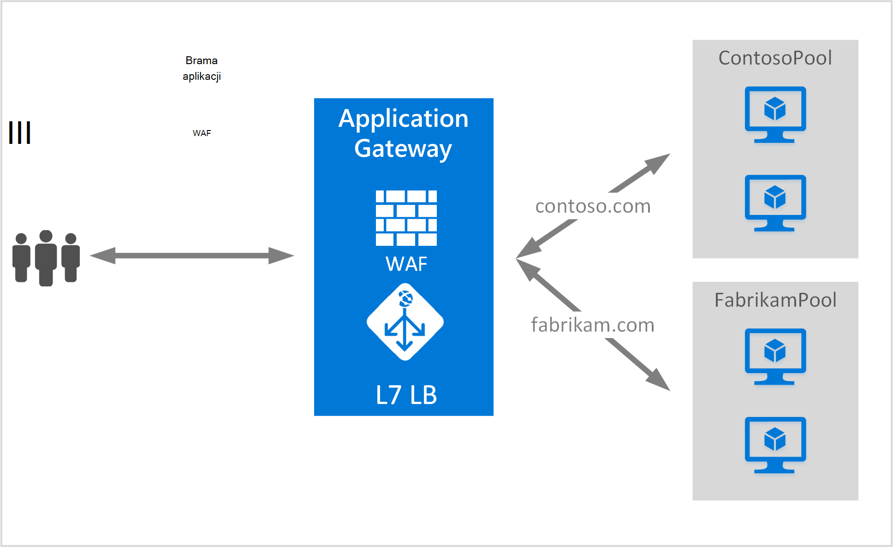

<properties
   pageTitle="Tworzenie bramy aplikacji do obsługi wielu witryn | Microsoft Azure"
   description="Ta strona zawiera instrukcje dotyczące tworzenia, konfigurowanie bramy Azure aplikacji do obsługi wielu aplikacji sieci web na tej samej bramie."
   documentationCenter="na"
   services="application-gateway"
   authors="amsriva"
   manager="rossort"
   editor="amsriva"/>
<tags
   ms.service="application-gateway"
   ms.devlang="na"
   ms.topic="article"
   ms.tgt_pltfrm="na"
   ms.workload="infrastructure-services"
   ms.date="10/25/2016"
   ms.author="amsriva"/>

# Tworzenie bramy aplikacji do obsługi wielu aplikacji sieci web

> [AZURE.SELECTOR]
- [Azure portal](application-gateway-create-multisite-portal.md)
- [Azure PowerShell Menedżera zasobów](application-gateway-create-multisite-azureresourcemanager-powershell.md)

Wiele hostingu witryny umożliwia wdrażanie więcej niż jedna aplikacja sieci web na tej samej bramie aplikacji. Zależy obecności nagłówek hosta w przychodzące żądanie HTTP, aby określić, które odbiornik może odbierać danych. Odbiornik następnie kieruje ruch do puli odpowiednie wewnętrznej bazy danych, zgodnie z konfiguracją w definicji reguł bramy. W aplikacjach sieci web SSL włączone bram aplikacji zależy od rozszerzenia wskazanie nazwa serwera (SNI) wybierz poprawny detektor ruchu w sieci web. Powszechnie używane do obsługi wielu witryn jest załadowanie saldo żądań domeny innej witryny sieci web na innym serwerze wewnętrznej pul. Podobnie wiele poddomen tej samej domeny głównej może być również obsługiwane na tej samej bramie aplikacji.

## Scenariusz

W poniższym przykładzie bramy aplikacji służy ruch contoso.com i fabrikam.com z dwóch pul wewnętrznej serwera: contoso puli server i fabrikam puli serwera. Podobne konfiguracji może służyć do hosta poddomen, takich jak app.contoso.com i blog.contoso.com.

## Przed rozpoczęciem

1. Zainstaluj najnowszą wersję pakietu poleceń cmdlet programu PowerShell Azure za pomocą Instalatora platformy sieci Web. Możesz pobrać i zainstalować najnowszą wersję z sekcji **Programu Windows PowerShell** [do pobrania strony](https://azure.microsoft.com/downloads/).
2. Serwery dodane do puli wewnętrznej używać bramy aplikacji, musi istnieć lub ich punkty końcowe utworzono w wirtualnej sieci w osobnej podsieci lub za pomocą publicznej IP-VIP przydzielone.

## Wymagania dotyczące

- **Wewnętrznej puli server:** Lista adresów IP serwerów wewnętrznej. Adresy IP wymienione albo powinna należeć do podsieci, wirtualną sieć lub powinny być publicznej IP-VIP. Można także FQDN.
- **Ustawienia puli serwera wewnętrznej:** Co Pula ma ustawienia, takie jak portu, Protocol (protokół) i koligacji systemem plików cookie. Te ustawienia są powiązane z puli i zostaną zastosowane do wszystkich serwerów w puli.
- **Frontonu portu:** Ten port jest publicznej otwierany na bramie aplikacji. Ruch trafienia tego portu, a następnie jest kierowany do jednego z serwerów wewnętrznej.
- **Odbiornika:** Odbiornik ma port zewnętrzną, protokół (Http lub Https, wartości te są uwzględniania wielkości liter) oraz nazwę certyfikatu SSL (jeśli Konfigurowanie protokołu SSL offload). Dla bramy aplikacji obsługującej wiele witryn nazwa hosta i SNI wskaźniki są także dodawane.
- **Reguły:** Reguła powiąże odbiornika puli serwera wewnętrznej i określa, które puli serwera wewnętrznej dane powinny być kierowane do, gdy trafienia w szczególności odbiornika.

## Tworzenie bramy aplikacji

Poniżej przedstawiono kroki potrzebne do utworzenia bramy aplikacji:

1. Tworzenie grupy zasobów dla Menedżera zasobów.
2. Tworzenie wirtualnych sieci, podsieci i publiczny adres IP bramy aplikacji.
3. Tworzenie obiektu konfiguracji bramy aplikacji.
4. Tworzenie aplikacji zasobów bramy.

## Tworzenie grupy zasobów dla Menedżera zasobów

Upewnij się, że używasz najnowszej wersji programu Azure PowerShell. Więcej informacji znajduje się w [Przy użyciu programu Windows PowerShell przy użyciu Menedżera zasobów](../powershell-azure-resource-manager.md).

### Krok 1

Zaloguj się do Azure

    Login-AzureRmAccount

Zostanie wyświetlony monit o poświadczenia uwierzytelniania.

### Krok 2

Sprawdzanie subskrypcji dla tego konta.

    Get-AzureRmSubscription

### Krok 3

Wybranie Azure subskrypcji korzystać.

    Select-AzureRmSubscription -SubscriptionName "Name of subscription"

### Krok 4

Tworzenie grupy zasobów (Pomiń ten krok, jeśli korzystasz z istniejącej grupy zasobów).

    New-AzureRmResourceGroup -Name appgw-RG -location "West US"

Alternatywnie można także utworzyć znaczniki dla grupy zasobów dla bramy aplikacji:

    $resourceGroup = New-AzureRmResourceGroup -Name appgw-RG -Location "West US" -Tags @{Name = "testtag"; Value = "Application Gateway multiple site"}

Azure Menedżera zasobów wymaga, aby wszystkie grupy zasobów określ lokalizację. Lokalizacja ta jest używana jako domyślnej lokalizacji dla zasobów w danej grupy zasobów. Upewnij się, że wszystkie polecenia do tworzenia bramy aplikacji za pomocą tej samej grupy zasobów.

W powyższym przykładzie możemy utworzyć grupę zasobów o nazwie "appgw-RG" z lokalizacją "Zachód stanach".

>[AZURE.NOTE] Jeśli musisz skonfigurować niestandardowe sonda Centrum aplikacji, zobacz [Tworzenie bramy aplikacji z sondy niestandardowych przy użyciu programu PowerShell](application-gateway-create-probe-ps.md). Odwiedź [sondy niestandardowych i monitorowanie kondycji](application-gateway-probe-overview.md) Aby uzyskać więcej informacji.

## Tworzenie wirtualnych sieci i podsieci

W poniższym przykładzie pokazano, jak utworzyć wirtualną sieć za pomocą Menedżera zasobów. W tym kroku są tworzone dwa podsieci. Pierwszą podsieć dotyczy samej bramie aplikacji. Brama aplikacji wymaga osobnej podsieci do przechowywania jej wystąpienia. Innych bram aplikacji mogą być rozmieszczone w tej podsieci. Drugą podsieć służy do przechowywania serwerów wewnętrznej bazy danych aplikacji.

### Krok 1

Przypisz 10.0.0.0/24 zakres adres zmiennej podsieci może być używany do przechowywania bramy aplikacji.

    $subnet = New-AzureRmVirtualNetworkSubnetConfig -Name appgatewaysubnet -AddressPrefix 10.0.0.0/24

### Krok 2

Przypisz 10.0.1.0/24 zakres adresów do zmiennej podsieć2 ma być używany dla pul wewnętrznej bazy danych.

    $subnet2 = New-AzureRmVirtualNetworkSubnetConfig -Name backendsubnet -AddressPrefix 10.0.1.0/24

### Krok 3

Tworzenie wirtualnych sieci o nazwie "appgwvnet" w zasobów grupy "appgw-rg" w regionie Zachód Stany Zjednoczone 10.0.0.0/16 prefiks za pomocą 10.0.0.0/24 podsieci i 10.0.1.0/24.

    $vnet = New-AzureRmVirtualNetwork -Name appgwvnet -ResourceGroupName appgw-RG -Location "West US" -AddressPrefix 10.0.0.0/16 -Subnet $subnet,$subnet2

### Krok 4

Przypisywanie podsieci zmiennej następne kroki, co spowoduje utworzenie bramy aplikacji.

    $appgatewaysubnet = Get-AzureRmVirtualNetworkSubnetConfig -Name appgatewaysubnet -VirtualNetwork $vnet
    $backendsubnet = Get-AzureRmVirtualNetworkSubnetConfig -Name backendsubnet -VirtualNetwork $vnet

## Tworzenie publiczny adres IP frontonu konfiguracji

Tworzenie publicznej zasobu IP "publicIP01" w zasobów grupy "appgw-rg" w regionie Zachód USA.

    $publicip = New-AzureRmPublicIpAddress -ResourceGroupName appgw-RG -name publicIP01 -location "West US" -AllocationMethod Dynamic

Adres IP jest przypisany do bramy aplikacji podczas uruchamiania usługi.

## Tworzenie aplikacji konfiguracji bramy

Przed utworzeniem bramy aplikacji, musisz skonfigurować wszystkie pozycje konfiguracji. Poniższe kroki Tworzenie pozycji konfiguracji, które są wymagane przez zasób bramy aplikacji.

### Krok 1

Tworzenie konfiguracji IP bramy dla aplikacji o nazwie "gatewayIP01". Po uruchomieniu aplikacji bramy przejmuje adres IP z podsieci skonfigurowane i kierowanie ruchu sieciowego do adresów IP w puli adresów IP wewnętrznej. Należy pamiętać, że każde wystąpienie ma jeden adres IP.

    $gipconfig = New-AzureRmApplicationGatewayIPConfiguration -Name gatewayIP01 -Subnet $appgatewaysubnet

### Krok 2

Konfigurowanie puli adresów IP wewnętrznej o nazwie "pool01" i "pool2" z adresami IP "10.0.1.100, 10.0.1.101,10.0.1.102" do "pool1" i "10.0.1.103 10.0.1.104, 10.0.1.105" na "pool2".

    $pool1 = New-AzureRmApplicationGatewayBackendAddressPool -Name pool01 -BackendIPAddresses 10.0.1.100, 10.0.1.101, 10.0.1.102
    $pool2 = New-AzureRmApplicationGatewayBackendAddressPool -Name pool02 -BackendIPAddresses 10.0.1.103, 10.0.1.104, 10.0.1.105

W tym przykładzie istnieją dwa pul wewnętrznej, aby skierować ruch sieciowy według żądanej witryny. Jednej puli odbiera ruchu z witryny "contoso.com" i innych puli otrzymuje ruchu z witryny "fabrikam.com". Należy zastąpić poprzedniego adresy IP, aby dodać własne punkty końcowe adres IP aplikacji. Zamiast adresów IP można także użyć publiczne adresy IP, nazwy FQDN lub NIC maszyn wirtualnych wystąpień wewnętrznej bazy danych. Użyj "-BackendFQDNs" parametru w programie PowerShell, aby określić nazwy FQDN zamiast adresy IP.

### Krok 3

Konfigurowanie ustawień bramy aplikacji "poolsetting01" i "poolsetting02" dla ruchu sieciowego równoważenia obciążenia w puli wewnętrznej. W tym przykładzie możesz skonfigurować ustawienia różnych puli wewnętrznej puli wewnętrznej. Każda pula wewnętrznej może mieć własne ustawienia puli wewnętrznej.

    $poolSetting01 = New-AzureRmApplicationGatewayBackendHttpSettings -Name "besetting01" -Port 80 -Protocol Http -CookieBasedAffinity Disabled -RequestTimeout 120
    $poolSetting02 = New-AzureRmApplicationGatewayBackendHttpSettings -Name "besetting02" -Port 80 -Protocol Http -CookieBasedAffinity Enabled -RequestTimeout 240

### Krok 4

Konfigurowanie IP frontonu z publicznej końcowym IP.

    $fipconfig01 = New-AzureRmApplicationGatewayFrontendIPConfig -Name "frontend1" -PublicIPAddress $publicip

### Krok 5

Skonfiguruj zewnętrzną port dla bramy aplikacji.

    $fp01 = New-AzureRmApplicationGatewayFrontendPort -Name "fep01" -Port 443

### Krok 6

Konfigurowanie dwóch certyfikatów SSL dwie witryny sieci Web w że chwilę do pomocy technicznej w tym przykładzie. Jeden certyfikat jest ruchu contoso.com, a druga ruchu fabrikam.com. Te certyfikaty powinny być urząd certyfikacji wystawianych certyfikatów witryn sieci Web. Certyfikaty z podpisem własnym są obsługiwane, ale nie jest zalecane dla ruchu produkcji.

    $cert01 = New-AzureRmApplicationGatewaySslCertificate -Name contosocert -CertificateFile <file path> -Password <password>
    $cert02 = New-AzureRmApplicationGatewaySslCertificate -Name fabrikamcert -CertificateFile <file path> -Password <password>

### Krok 7

Konfigurowanie dwa detektory dwie witryny sieci web, w tym przykładzie. W tym kroku konfiguruje detektory dla publiczny adres IP, port i hosta używany do odbierania ruch przychodzący. Nazwa hosta parametr jest wymagane do obsługi wielu witryn i powinna być równa odpowiednie witryny sieci Web, dla której zostanie odebrana ruchu. Parametr RequireServerNameIndication powinna być ustawiona na wartość PRAWDA dla witryny sieci Web, którego potrzebujesz pomocy dotyczącej SSL scenariusz z wieloma hosta. Jeśli obsługa protokołu SSL jest wymagany, należy również określić certyfikat SSL używany do zabezpieczania ruchu dla tej aplikacji sieci web. Kombinacja FrontendIPConfiguration, FrontendPort i nazwa hosta musi być unikatowa w odbiorniku. Każdy odbiornik może obsługiwać jeden certyfikat.

    $listener01 = New-AzureRmApplicationGatewayHttpListener -Name "listener01" -Protocol Https -FrontendIPConfiguration $fipconfig01 -FrontendPort $fp01 -HostName "contoso11.com" -RequireServerNameIndication true  -SslCertificate $cert01
    $listener02 = New-AzureRmApplicationGatewayHttpListener -Name "listener02" -Protocol Https -FrontendIPConfiguration $fipconfig01 -FrontendPort $fp01 -HostName "fabrikam11.com" -RequireServerNameIndication true -SslCertificate $cert02

### Krok 8

Utwórz dwa ustawienia regułę dla aplikacji sieci web dwóch w tym przykładzie. Reguły wiąże się ze sobą detektory, pul wewnętrznej bazy danych i ustawienia protokołu http. W tym kroku konfiguruje bramę aplikacji do podstawowe reguły rozsyłania, jedną dla każdej witryny sieci Web. Ruch do każdej witryny sieci Web zostanie odebrane przez jego skonfigurowanego odbiornika, a następnie są kierowane do jej puli skonfigurowaną wewnętrznej bazy danych, za pomocą właściwości określonego w BackendHttpSettings.

    $rule01 = New-AzureRmApplicationGatewayRequestRoutingRule -Name "rule01" -RuleType Basic -HttpListener $listener01 -BackendHttpSettings $poolSetting01 -BackendAddressPool $pool1
    $rule02 = New-AzureRmApplicationGatewayRequestRoutingRule -Name "rule02" -RuleType Basic -HttpListener $listener02 -BackendHttpSettings $poolSetting02 -BackendAddressPool $pool2

### Krok 9

Konfigurowanie liczby wystąpień i rozmiar bramy aplikacji.

    $sku = New-AzureRmApplicationGatewaySku -Name "Standard_Medium" -Tier Standard -Capacity 2

## Tworzenie bramy aplikacji

Tworzenie bramy aplikacji ze wszystkimi obiektami konfiguracji z powyższych kroków.

    $appgw = New-AzureRmApplicationGateway -Name appgwtest -ResourceGroupName appgw-RG -Location "West US" -BackendAddressPools $pool1,$pool2 -BackendHttpSettingsCollection $poolSetting01, $poolSetting02 -FrontendIpConfigurations $fipconfig01 -GatewayIpConfigurations $gipconfig -FrontendPorts $fp01 -HttpListeners $listener01, $listener02 -RequestRoutingRules $rule01, $rule02 -Sku $sku -SslCertificates $cert01, $cert02

>[AZURE.IMPORTANT] Inicjowania obsługi bramy aplikacji jest długotrwałych operacji i może zająć trochę czasu, aby zakończyć.

## Uzyskaj nazwę DNS bramy aplikacji

Po utworzeniu bramy, następnym krokiem jest skonfigurowanie komunikacji zewnętrznej. Gdy używasz publiczny adres IP, brama aplikacji wymaga przypisywany dynamicznie nazwa DNS, która nie jest przyjazny. Aby upewnić się, że użytkownicy końcowi naciśnij klawisz aplikacji bramy rekord CNAME może służyć do wskaż punkt końcowy publicznej bramy aplikacji. [Konfigurowanie niestandardowej nazwy domeny dla platformy Azure](../cloud-services/cloud-services-custom-domain-name-portal.md). W tym celu należy pobrać szczegóły bramy aplikacji i jego skojarzony nazwy IP/DNS za pomocą elementu PublicIPAddress dołączone do bramy aplikacji. Należy użyć nazwy DNS bramy aplikacji do utworzenia rekordu CNAME, która wskazuje aplikacji sieci web dwóch do tej nazwy DNS. Użyj rekordów A nie jest zalecane, ponieważ VIP może się zmienić po ponownym uruchomieniu aplikacji bramy.
    
    Get-AzureRmPublicIpAddress -ResourceGroupName appgw-RG -Name publicIP01
        
    Name                     : publicIP01
    ResourceGroupName        : appgw-RG
    Location                 : westus
    Id                       : /subscriptions/<subscription_id>/resourceGroups/appgw-RG/providers/Microsoft.Network/publicIPAddresses/publicIP01
    Etag                     : W/"00000d5b-54ed-4907-bae8-99bd5766d0e5"
    ResourceGuid             : 00000000-0000-0000-0000-000000000000
    ProvisioningState        : Succeeded
    Tags                     : 
    PublicIpAllocationMethod : Dynamic
    IpAddress                : xx.xx.xxx.xx
    PublicIpAddressVersion   : IPv4
    IdleTimeoutInMinutes     : 4
    IpConfiguration          : {
                                 "Id": "/subscriptions/<subscription_id>/resourceGroups/appgw-RG/providers/Microsoft.Network/applicationGateways/appgwtest/frontendIP
                               Configurations/frontend1"
                               }
    DnsSettings              : {
                                 "Fqdn": "00000000-0000-xxxx-xxxx-xxxxxxxxxxxx.cloudapp.net"
                               }

## Następne kroki

Dowiedz się, jak chronić serwisach bramy [aplikacji — zapory aplikacji sieci Web](application-gateway-webapplicationfirewall-overview.md)