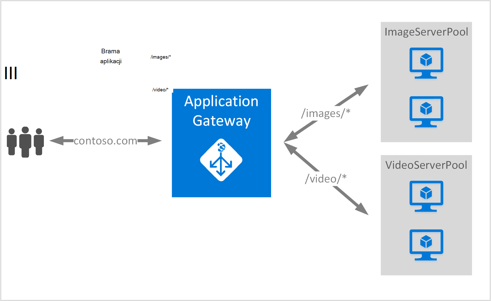

<properties
   pageTitle="Tworzenie bramy aplikacji przy użyciu reguł rozsyłania adresów URL | Microsoft Azure"
   description="Ta strona zawiera instrukcje dotyczące tworzenia, konfigurowanie bramy Azure aplikacji przy użyciu reguł rozsyłania adresu URL"
   documentationCenter="na"
   services="application-gateway"
   authors="georgewallace"
   manager="jdial"
   editor="tysonn"/>
<tags
   ms.service="application-gateway"
   ms.devlang="na"
   ms.topic="article"
   ms.tgt_pltfrm="na"
   ms.workload="infrastructure-services"
   ms.date="10/25/2016"
   ms.author="gwallace"/>

# Tworzenie bramy aplikacji przy użyciu routingu opartego na protokole ścieżki 

> [AZURE.SELECTOR]
- [Azure portal](application-gateway-create-url-route-portal.md)
- [Azure PowerShell Menedżera zasobów](application-gateway-create-url-route-arm-ps.md)

Routingu opartego na protokole ścieżkę adresu URL umożliwia kojarzenie trasy w oparciu o ścieżki adresu URL żądania Http. Sprawdza, czy istnieje trasa do puli wewnętrznej skonfigurowane dla list adres URL w polu Brama aplikacji, a wysyłać ruch sieciowy do zdefiniowanej puli wewnętrznej. Powszechnie używane dla routingu opartego na adres URL jest załadowanie żądań saldo różne typy zawartości na innym serwerze wewnętrznej pul.

Adresy URL routingu wprowadza nowy typ reguły do bramy aplikacji. Brama aplikacji występują dwa typy reguł: podstawowe i PathBasedRouting. Typ reguły podstawowe oferuje usługę okrężny puli wewnętrznej podczas PathBasedRouting oprócz rozkładu okrężnego, uwzględnia również ścieżka wzorzec adresu URL żądania podczas wybierania puli wewnętrznej bazy danych.

>[AZURE.IMPORTANT] PathPattern: Lista wzorców ścieżka zgodnie z. Każdy musi rozpoczynać się- i umieszczanie tylko "\*" jest dozwolona znajduje się na końcu. Przykłady prawidłowych są /xyz /xyz* lub /xyz/*. Parametry używane do dopasowania ścieżka nie zawiera tekst po pierwszym "?" lub "#" i te znaki, które nie są dozwolone. 

## Scenariusz
W poniższym przykładzie bramy aplikacji służy ruch contoso.com dwóch pul wewnętrznej serwera: puli serwera wideo i obraz puli serwera.

Żądania dla http://contoso.com/image,* są kierowane do puli server obrazu (pool1) i http://contoso.com/video* są kierowane do puli serwera wideo (pool2). Domyślna pula server (pool1) jest zaznaczone, jeśli żadna z wzorców ścieżki.

## Przed rozpoczęciem

1. Zainstaluj najnowszą wersję pakietu poleceń cmdlet programu PowerShell Azure za pomocą Instalatora platformy sieci Web. Możesz pobrać i zainstalować najnowszą wersję z sekcji **Programu Windows PowerShell** [do pobrania strony](https://azure.microsoft.com/downloads/).
2. Tworzenie wirtualnych sieci i podsieci dla bramy aplikacji. Upewnij się, że nie maszyn wirtualnych lub we wdrożeniach w chmurze z podsieci. Brama aplikacji musi być samoczynnie w podsieci wirtualnej sieci.
3. Serwery dodane do puli wewnętrznej używać bramy aplikacji, musi istnieć lub ich punkty końcowe utworzono w wirtualnej sieci lub z publicznej IP-VIP przydzielone.

## Co to jest wymagane do utworzenia bramy aplikacji?

- **Wewnętrznej puli server:** Lista adresów IP serwerów wewnętrznej. Adresy IP wymienione albo powinna należeć do podsieci, wirtualną sieć lub powinny być publicznej IP-VIP.
- **Ustawienia puli serwera wewnętrznej:** Co Pula ma ustawienia, takie jak portu, Protocol (protokół) i koligacji systemem plików cookie. Te ustawienia są powiązane z puli i zostaną zastosowane do wszystkich serwerów w puli.
- **Zewnętrzną portu:** Ten port jest publicznej otwarcia na bramie aplikacji. Ruch trafienia tego portu, a następnie przekierowaniem do jednego z serwerów wewnętrznej.
- **Odbiornika:** Odbiornik ma port zewnętrzną, protokół (Http lub Https są uwzględniania wielkości liter), a nazwa certyfikatu SSL (jeśli Konfigurowanie protokołu SSL offload).
- **Reguły:** Reguła powiąże odbiornika puli serwera wewnętrznej i określa, które puli serwera wewnętrznej dane powinny być kierowane do, gdy trafienia w szczególności odbiornika.

## Tworzenie bramy aplikacji

Różnica między przy użyciu klasycznej Azure i Menedżera zasobów Azure jest kolejność, w której można tworzyć bramy aplikacji oraz elementy, które trzeba skonfigurować.

Przy użyciu Menedżera zasobów wszystkie elementy, które ułatwiają bramy aplikacji są skonfigurowane indywidualnie, a następnie umieść ze sobą, aby utworzyć zasób bramy aplikacji.

Poniżej przedstawiono kroki, które są potrzebne do utworzenia bramy aplikacji:

1. Tworzenie grupy zasobów dla Menedżera zasobów.
2. Tworzenie wirtualnych sieci, podsieci i publiczny adres IP bramy aplikacji.
3. Tworzenie obiektu konfiguracji bramy aplikacji.
4. Tworzenie aplikacji zasobów bramy.

## Tworzenie grupy zasobów dla Menedżera zasobów

Upewnij się, że używasz najnowszej wersji programu Azure PowerShell. Dodatkowe informacje są dostępne po [Przy użyciu programu Windows PowerShell przy użyciu Menedżera zasobów](../powershell-azure-resource-manager.md).

### Krok 1

Zaloguj się do Azure

    Login-AzureRmAccount

Zostanie wyświetlony monit o poświadczenia uwierzytelniania. 

### Krok 2

Sprawdzanie subskrypcji dla tego konta.

    Get-AzureRmSubscription

### Krok 3

Wybranie Azure subskrypcji korzystać.  

    Select-AzureRmSubscription -Subscriptionid "GUID of subscription"

### Krok 4

Tworzenie grupy zasobów (Pomiń ten krok, jeśli korzystasz z istniejącej grupy zasobów).

    New-AzureRmResourceGroup -Name appgw-RG -Location "West US"

Alternatywnie można także utworzyć znaczniki dla grupy zasobów dla bramy aplikacji:
    
    $resourceGroup = New-AzureRmResourceGroup -Name appgw-RG -Location "West US" -Tags @{Name = "testtag"; Value = "Application Gateway URL routing"} 

Azure Menedżera zasobów wymaga, aby wszystkie grupy zasobów określ lokalizację. To jest używany jako domyślnej lokalizacji dla zasobów w danej grupy zasobów. Upewnij się, że wszystkie polecenia do tworzenia bramy aplikacji za pomocą tej samej grupy zasobów.

W powyższym przykładzie możemy utworzyć grupę zasobów o nazwie "appgw RG" i lokalizacja "Zachód z NAMI".

>[AZURE.NOTE] Jeśli musisz skonfigurować niestandardowe sonda Centrum aplikacji, zobacz [Tworzenie bramy aplikacji z sondy niestandardowych przy użyciu programu PowerShell](application-gateway-create-probe-ps.md). Zapoznaj się z [sondy niestandardowych i monitorowanie kondycji](application-gateway-probe-overview.md) więcej informacji.

## Tworzenie wirtualnych sieci i podsieci bramy aplikacji

W poniższym przykładzie pokazano, jak utworzyć wirtualną sieć za pomocą Menedżera zasobów.

### Krok 1

Przypisz 10.0.0.0/24 zakres adresów do zmiennej podsieci można użyć do utworzenia wirtualnej sieci.

    $subnet = New-AzureRmVirtualNetworkSubnetConfig -Name subnet01 -AddressPrefix 10.0.0.0/24

### Krok 2

Tworzenie wirtualnych sieci o nazwie "appgwvnet" w zasobów grupy "appgw-rg" w regionie Zachód USA 10.0.0.0/16 prefiks za pomocą 10.0.0.0/24 podsieci.

    $vnet = New-AzureRmVirtualNetwork -Name appgwvnet -ResourceGroupName appgw-RG -Location "West US" -AddressPrefix 10.0.0.0/16 -Subnet $subnet

### Krok 3

Przypisywanie podsieci zmiennej następne kroki, co spowoduje utworzenie bramy aplikacji.

    $subnet=$vnet.Subnets[0]

## Tworzenie publiczny adres IP zewnętrzną konfiguracji

Tworzenie publicznej zasobu IP "publicIP01" w zasobów grupy "appgw-rg" w regionie Zachód USA.

    $publicip = New-AzureRmPublicIpAddress -ResourceGroupName appgw-RG -name publicIP01 -location "West US" -AllocationMethod Dynamic

Adres IP jest przypisany do bramy aplikacji podczas uruchamiania usługi.

## Tworzenie aplikacji konfiguracji bramy

Wszystkie pozycje konfiguracji musisz skonfigurować przed utworzeniem bramy aplikacji. Poniższe kroki Tworzenie pozycji konfiguracji, które są wymagane przez zasób bramy aplikacji.

### Krok 1

Tworzenie konfiguracji IP bramy dla aplikacji o nazwie "gatewayIP01". Po uruchomieniu aplikacji bramy przejmuje adres IP z podsieci skonfigurowane i kierowanie ruchu sieciowego do adresów IP w puli adresów IP wewnętrznej. Należy pamiętać, że każde wystąpienie ma jeden adres IP.

    $gipconfig = New-AzureRmApplicationGatewayIPConfiguration -Name gatewayIP01 -Subnet $subnet

### Krok 2

Konfigurowanie puli adresów IP wewnętrznej o nazwie "pool01" i "pool2" z adresami IP "134.170.185.46, 134.170.188.221,134.170.185.50" na "pool1" i "134.170.186.46, 134.170.189.221,134.170.186.50" na "pool2".

    $pool1 = New-AzureRmApplicationGatewayBackendAddressPool -Name pool01 -BackendIPAddresses 134.170.185.46, 134.170.188.221,134.170.185.50

    $pool2 = New-AzureRmApplicationGatewayBackendAddressPool -Name pool02 -BackendIPAddresses 134.170.186.46, 134.170.189.221,134.170.186.50

W tym przykładzie istnieją dwa pul wewnętrznej, aby skierować ruch sieciowy na podstawie ścieżki adresu URL. Jednej puli odbiera ruch od ścieżki adresu URL "/ wideo" i innych puli odbierać danych z ścieżka "/ obrazu". Zamień poprzedniego adresy IP, aby dodać własne punkty końcowe adres IP aplikacji. 

### Krok 3

Skonfiguruj ustawienia bramy aplikacji "poolsetting01" i "poolsetting02" dla ruchu sieciowego równoważenia obciążenia w puli wewnętrznej. W tym przykładzie możesz skonfigurować ustawienia różnych puli wewnętrznej puli wewnętrznej. Każda pula wewnętrznej może mieć własne ustawienia puli wewnętrznej.

    $poolSetting01 = New-AzureRmApplicationGatewayBackendHttpSettings -Name "besetting01" -Port 80 -Protocol Http -CookieBasedAffinity Disabled -RequestTimeout 120

    $poolSetting02 = New-AzureRmApplicationGatewayBackendHttpSettings -Name "besetting02" -Port 80 -Protocol Http -CookieBasedAffinity Enabled -RequestTimeout 240

### Krok 4

Konfigurowanie IP frontonu z publicznej końcowym IP.

    $fipconfig01 = New-AzureRmApplicationGatewayFrontendIPConfig -Name "frontend1" -PublicIPAddress $publicip

### Krok 5 

Skonfiguruj frontonu port dla bramy aplikacji.

    $fp01 = New-AzureRmApplicationGatewayFrontendPort -Name "fep01" -Port 80
### Krok 6

Konfigurowanie odbiornika. W tym kroku konfiguruje detektor publiczny adres IP i port używany do odbierania przychodzący ruch sieciowy. 
 
    $listener = New-AzureRmApplicationGatewayHttpListener -Name "listener01" -Protocol Http -FrontendIPConfiguration $fipconfig01 -FrontendPort $fp01

### Krok 7 

Konfigurowanie ścieżki reguły URL puli wewnętrznej. W tym kroku konfiguruje ścieżkę względną używane przez bramę aplikacji, aby zdefiniować mapowanie między ścieżki adresu URL, które puli wewnętrznej przypisano do obsługi ruchu przychodzącego.

W poniższym przykładzie tworzy dwie reguły: jedno dla "-obraz-" ścieżki routingu ruchu do wewnętrznej "pool1" i symbol "/ wideo /" ścieżki routingu ruchu do wewnętrznej "pool2".
    
    $imagePathRule = New-AzureRmApplicationGatewayPathRuleConfig -Name "pathrule1" -Paths "/image/*" -BackendAddressPool $pool1 -BackendHttpSettings $poolSetting01

    $videoPathRule = New-AzureRmApplicationGatewayPathRuleConfig -Name "pathrule2" -Paths "/video/*" -BackendAddressPool $pool2 -BackendHttpSettings $poolSetting02

Konfiguracji mapy ścieżka reguły konfiguruje również domyślnej puli adres wewnętrznej, jeśli ścieżka nie pasować do żadnej reguły wstępnie zdefiniowanych ścieżek. 

    $urlPathMap = New-AzureRmApplicationGatewayUrlPathMapConfig -Name "urlpathmap" -PathRules $videoPathRule, $imagePathRule -DefaultBackendAddressPool $pool1 -DefaultBackendHttpSettings $poolSetting02

### Krok 8

Utworzyć ustawienie reguły. W tym kroku konfiguruje bramy aplikacji do używania routingu opartego na ścieżkę adresu URL.

    $rule01 = New-AzureRmApplicationGatewayRequestRoutingRule -Name "rule1" -RuleType PathBasedRouting -HttpListener $listener -UrlPathMap $urlPathMap

### Krok 9

Konfigurowanie liczby wystąpień i rozmiar bramy aplikacji.

    $sku = New-AzureRmApplicationGatewaySku -Name "Standard_Small" -Tier Standard -Capacity 2

## Tworzenie bramy aplikacji

Tworzenie bramy aplikacji ze wszystkimi obiektami konfiguracji z powyższych kroków.

    $appgw = New-AzureRmApplicationGateway -Name appgwtest -ResourceGroupName appgw-RG -Location "West US" -BackendAddressPools $pool1,$pool2 -BackendHttpSettingsCollection $poolSetting01, $poolSetting02 -FrontendIpConfigurations $fipconfig01 -GatewayIpConfigurations $gipconfig -FrontendPorts $fp01 -HttpListeners $listener -UrlPathMaps $urlPathMap -RequestRoutingRules $rule01 -Sku $sku

## Uzyskaj nazwę DNS bramy aplikacji

Po utworzeniu bramy, następnym krokiem jest skonfigurowanie komunikacji zewnętrznej. Gdy używasz publiczny adres IP, brama aplikacji wymaga przypisywany dynamicznie nazwa DNS, która nie jest przyjazny. Aby upewnić się, że użytkownicy końcowi naciśnij klawisz aplikacji bramy rekord CNAME może służyć do wskaż punkt końcowy publicznej bramy aplikacji. [Konfigurowanie niestandardowej nazwy domeny dla platformy Azure](../cloud-services/cloud-services-custom-domain-name-portal.md). W tym celu należy pobrać szczegóły bramy aplikacji i jego skojarzony nazwy IP/DNS za pomocą elementu PublicIPAddress dołączone do bramy aplikacji. Należy użyć nazwy DNS bramy aplikacji do utworzenia rekordu CNAME, która wskazuje aplikacji sieci web dwóch do tej nazwy DNS. Użyj rekordów A nie jest zalecane, ponieważ VIP może się zmienić po ponownym uruchomieniu aplikacji bramy.
    
    Get-AzureRmPublicIpAddress -ResourceGroupName appgw-RG -Name publicIP01
        
    Name                     : publicIP01
    ResourceGroupName        : appgw-RG
    Location                 : westus
    Id                       : /subscriptions/<subscription_id>/resourceGroups/appgw-RG/providers/Microsoft.Network/publicIPAddresses/publicIP01
    Etag                     : W/"00000d5b-54ed-4907-bae8-99bd5766d0e5"
    ResourceGuid             : 00000000-0000-0000-0000-000000000000
    ProvisioningState        : Succeeded
    Tags                     : 
    PublicIpAllocationMethod : Dynamic
    IpAddress                : xx.xx.xxx.xx
    PublicIpAddressVersion   : IPv4
    IdleTimeoutInMinutes     : 4
    IpConfiguration          : {
                                 "Id": "/subscriptions/<subscription_id>/resourceGroups/appgw-RG/providers/Microsoft.Network/applicationGateways/appgwtest/frontendIP
                               Configurations/frontend1"
                               }
    DnsSettings              : {
                                 "Fqdn": "00000000-0000-xxxx-xxxx-xxxxxxxxxxxx.cloudapp.net"
                               }

## Następne kroki

Jeśli chcesz dowiedzieć się, odciążania Secure Sockets Layer (SSL), zobacz [Konfigurowanie bramy aplikacji dla protokołu SSL offload](application-gateway-ssl-arm.md).