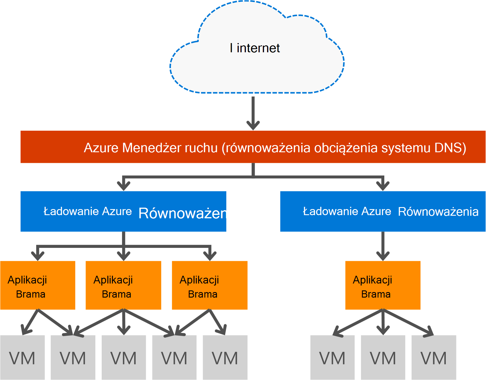

<properties
   pageTitle="Wprowadzenie do bramy aplikacji | Microsoft Azure"
   description="Ta strona zawiera omówienie usługi bram aplikacji dla warstwy 7 równoważenia obciążenia, tym rozmiarów bramy, HTTP ładowanie koligacji sesji bilansowania, oparte na plików cookie i odciążanie protokołu SSL."
   documentationCenter="na"
   services="application-gateway"
   authors="georgewallace"
   manager="carmonm"
   editor="tysonn"/>
<tags
   ms.service="application-gateway"
   ms.devlang="na"
   ms.topic="hero-article"
   ms.tgt_pltfrm="na"
   ms.workload="infrastructure-services"
   ms.date="10/25/2016"
   ms.author="gwallace"/>

# Omówienie aplikacji bramy

## Co to jest brama aplikacji

Microsoft Azure Application Gateway stanowi kontroler dostarczenia aplikacji (ADC) jako usługa, zapewniając równoważenia możliwości aplikacji różne obciążenia warstwy 7. Umożliwia klientom optymalizowanie przenosząc Procesora intensywnej SSL zakończenie do bramy aplikacji sieci web produktywność. Umożliwia także inne możliwości routingu 7 warstwy, takie jak rozkład okrężnego ruchu przychodzącego, plików cookie podstawie koligacji sesji, routing ścieżkę adresu URL i możliwość obsługi wielu witryn sieci Web za jednym bramy aplikacji. Brama aplikacji ma także zapory aplikacji sieci web (WAF), która chroni aplikacji przed większość OWASP górny 10 typowych web luk. Brama aplikacji można skonfigurować jako bramy przeciwległych internet, wewnętrznych bramy tylko lub obu tych sposobów. Aplikacja brama jest w pełni Azure zarządzane, skalowalna i wysokiej dostępności. Przewiduje bogatego zestawu funkcji narzędzia diagnostyczne i możliwości rejestrowania lepsze zarządzanie. Brama aplikacji działa z maszyn wirtualnych, usług w chmurze i wewnętrznych i zewnętrznych przeciwległych aplikacji sieci web.

Brama aplikacji jest dedykowane urządzenia wirtualnego aplikacji i składa się z wielu wystąpień pracownika w celu skalowalność i wysoką dostępność. Podczas tworzenia bramy aplikacji punktu końcowego (VIP publicznej lub wewnętrzny ILB IP) jest skojarzony i użyć ingress ruchu w sieci. Ten VIP lub ILB IP jest udostępniany przez usługi równoważenia obciążenia Azure na poziomie transportu (port TCP/UDP) i cały przychodzący ruch sieciowy obciążenia strategie wystąpieniach bramy aplikacji pracownika. Brama aplikacji, a następnie przekierowuje ruch protokołu HTTP/HTTPS na podstawie konfiguracji czy maszyn wirtualnych w chmurze usługi, wewnętrzny i zewnętrzny adres IP. Aby uzyskać Umowa dotycząca poziomu usług i ceny, odwoływanie się do strony [Umowa dotycząca poziomu usług](https://azure.microsoft.com/support/legal/sla/) i [ceny](https://azure.microsoft.com/pricing/details/application-gateway/) .

## Funkcje

Brama aplikacji obsługuje obecnie dostarczanie aplikacji 7 warstwy następujące funkcje:

- **[Zapora aplikacji sieci web (wersja Preview)](application-gateway-webapplicationfirewall-overview.md)** — zapory aplikacji sieci web (WAF) w polu Brama aplikacji Azure chroni aplikacji sieci web z typowych atakami oparte na sieci web, takich jak uruchomienie SQL, atakami skryptów między witrynami i hijacks sesji.
- **Równoważenia obciążenia HTTP** - bramy aplikacji znajdują się równoważenia obciążenia okrężnego. Równoważenia obciążenia jest wykonywane na 7 warstwy i służy jedynie do ruchu HTTP (S).
- **Koligacja sesji plików cookie** — ta funkcja jest przydatny, gdy chcesz zachować sesji użytkownika na tym samym wewnętrzną. Za pomocą bramy zarządzania plików cookie, bramy aplikacji będzie mógł skierowania kolejnych ruchu z sesją użytkownika do samej wewnętrznej przetwarzania. Ta funkcja jest ważna w przypadku stanu sesji zapisywania lokalnie na serwerze wewnętrznej dla sesji użytkownika.
- **[Odciążanie secure Sockets Layer (SSL)](application-gateway-ssl-arm.md)** — ta funkcja ma kosztów zadań odszyfrowywania ruchu HTTPS wyłączanie serwerów sieci web. Zakończenie połączenia SSL na bramy aplikacji i przesyłania dalej żądanie do serwera nie zaszyfrowane, serwer sieci web jest unburdened przez odszyfrowywanie.  Ponownie bramy aplikacji są szyfrowane odpowiedzi przed wysłaniem go do klienta. Ta funkcja jest przydatne w sytuacjach, gdzie wewnętrznej znajduje się w tym samym zabezpieczone wirtualną sieć jako brama aplikacji platformy Azure.
- **[SSL kompleksowego](application-gateway-backend-ssl.md)** - bramy aplikacji obsługuje szyfrowanie kompleksowego ruchu. Aplikacja bramy powinien się tym zająć przez zakończenie połączenia SSL na bramy aplikacji. Następnie bramy dotyczy reguł rozsyłania ruchu, ponownie szyfrowanie pakietu i przesyła pakiet do odpowiedniej wewnętrznej bazy danych na podstawie reguł rozsyłania zdefiniowane. Odpowiedzi na serwerze sieci web przechodzi przez ten sam proces powrót do użytkownika końcowego.
- **[Adresy URL rozsyłanie zawartości](application-gateway-url-route-overview.md)** — ta funkcja umożliwia używanie różnych serwerów wewnętrznej dla różnych ruch. Ruch do folderu na serwerze sieci web lub CDN może kierowane do różnych wewnętrznej, zmniejszenie niepotrzebne obciążenia w wewnętrznych bazach danych, który nie służyć określonej zawartości.
- **[Wiele witryn routingu](application-gateway-multi-site-overview.md)** - aplikacji bramy umożliwia konsolidowanie maksymalnie 20 witryn sieci Web w jednej aplikacji bramy.
- **[Obsługuje Websocket](application-gateway-websocket.md)** - innego doskonałych funkcji bramy aplikacji jest wbudowana obsługa Websocket.
- **[Monitorowanie kondycji](application-gateway-probe-overview.md)** - bramy aplikacji znajdują się domyślne monitorowanie kondycji zasobów wewnętrznej bazy danych i niestandardowe sondy do monitorowania więcej określonych scenariuszach.

## Zalety

Brama aplikacji jest przydatne w przypadku:

- Aplikacje, które wymagają żądania z tej samej sesji użytkownika/klienta do osiągnięcia tej samej maszyny wirtualnej wewnętrznej. Przykłady te aplikacje czy zakupy, aplikacje koszyka i serwery poczty w sieci web.
- Aplikacje, które mają być wolny farmy serwerów sieci web z góry opłaty za SSL.
- Aplikacjami, takimi jak sieci dostarczania zawartości, który wymaga użycia wielu żądania HTTP na tym samym długotrwałe połączenia TCP przesyłane i ładowanie strategie do różnych serwerów wewnętrznej.
- Aplikacje, które obsługują ruch websocket
- Ochrona aplikacji sieci web atakami typowych oparte na sieci web, takich jak uruchomienie, atakami skryptów między witrynami i hijacks sesji SQL.

Brama aplikacji równoważenia obciążenia usługi zarządzanych Azure zezwala inicjowania obsługi administracyjnej usługi równoważenia obciążenia warstwy 7 za równoważenia obciążenia Azure oprogramowania. Menedżer ruchu może służyć do wykonania tego scenariusza, jak pokazano na poniższej ilustracji. W przypadku, gdy Menedżer ruchu zapewnia przekierowania i dostępności, równoważenia obciążenia znajdują się w regionie skalowalność i dostępność i bramy aplikacji zawiera równoważenia obciążenia warstwy 7 krzyżowego region.

[AZURE.INCLUDE [load-balancer-compare-tm-ag-lb-include.md](../../includes/load-balancer-compare-tm-ag-lb-include.md)]

## Rozmiary bramy i wystąpień

Brama aplikacji jest dostępne w trzech rozmiarów: mały, średni i duży. Wystąpienia małych rozmiarów są przeznaczone dla scenariuszy badania i rozwój.

Obecnie są dwie wersje produktu dla bramy aplikacji: WAF i standardowy.

Możesz utworzyć maksymalnie 50 bram aplikacji na subskrypcję i każdej bramy aplikacji może zawierać maksymalnie 10 wystąpieniach. Każdej bramy aplikacji może zawierać 20 detektory http. Aby uzyskać pełną listę limitów bramy aplikacji odwiedź stronę [Ograniczenia usługi](../azure-subscription-service-limits.md#application-gateway) .

W poniższej tabeli przedstawiono przepustowość średni wynik dla każdego wystąpienia bramy aplikacji:

| Odpowiedź strony wewnętrznej | Małe | Średnia | Duży|
|---|---|---|---|
| 6K | 7.5 MB/s | 13 MB/s | 50 MB/s |
|100 KB | 35 MB/s | 100 MB/s| 200 MB/s |

>[AZURE.NOTE] Wartości te są przybliżone wartości przepustowości bramy aplikacji. Rzeczywisty przepustowość zależy od środowiska szczegółowe informacje, takie jak rozmiar strony, lokalizację wewnętrznej wystąpienia i czas przetwarzania do obsługi strony. Dla numerów dokładnie wydajności należy uruchomić swoje własne testy, wartości te są dostarczane tylko dla wskazówki dotyczące planowania pojemności.

## Monitorowanie kondycji

Azure bramy aplikacji automatycznie monitoruje kondycję wystąpienia wewnętrznej za pośrednictwem basic lub sondy zdrowia niestandardowe. Za pomocą sondy kondycji, to zapewnia, że tylko prawidłowy hosts odpowiadać na ruch. Aby uzyskać więcej informacji zobacz [Omówienie monitorowania kondycji aplikacji bramy](application-gateway-probe-overview.md).

## Konfigurowanie i zarządzanie nimi

W przypadku punktu końcowego bramy aplikacji może zawierać publiczny adres IP i prywatne IP gdy jest ono skonfigurowane. Skonfigurowano bramy aplikacji wewnątrz wirtualną sieć w osobnej podsieci. Tylko zasoby, które są dozwolone w podsieci są innych bram aplikacji, podsieci, utworzone lub na potrzeby aplikacji bramy nie może zawierać innych typów zasobów. Zapewnienie zasobów wewnętrznej bazy danych do wewnętrznej bazy danych serwerów mogą być zawarte w innej podsieci w tej samej sieci wirtualnej jako brama aplikacji. Ten dodatkowe podsieci, które go nie są wymagane dla aplikacji wewnętrznej bazy danych, jak brama aplikacji można połączyć z adresem ip, brama aplikacji jest możliwość zapewniają możliwości ADC dla serwerów wewnętrznej bazy danych.

Można tworzyć i zarządzać bramy aplikacji przy użyciu interfejsów API pozostałych, polecenia cmdlet programu PowerShell, polecenie Azure lub [Azure portal](https://portal.azure.com/).

## Następne kroki

Po naukę bramy aplikacji, możesz [utworzyć bramy aplikacji](application-gateway-create-gateway-portal.md) lub można [utworzyć bramy aplikacji odciążanie protokołu SSL](application-gateway-ssl-arm.md) do równoważenia obciążenia połączeń HTTPS.

Aby dowiedzieć się, jak utworzyć bramy aplikacji przy użyciu adresu URL routingu opartego na protokole zawartości, przejdź do [Tworzenie bramy aplikacji przy użyciu routingu opartego na adres URL](application-gateway-create-url-route-arm-ps.md) , aby uzyskać więcej informacji.

