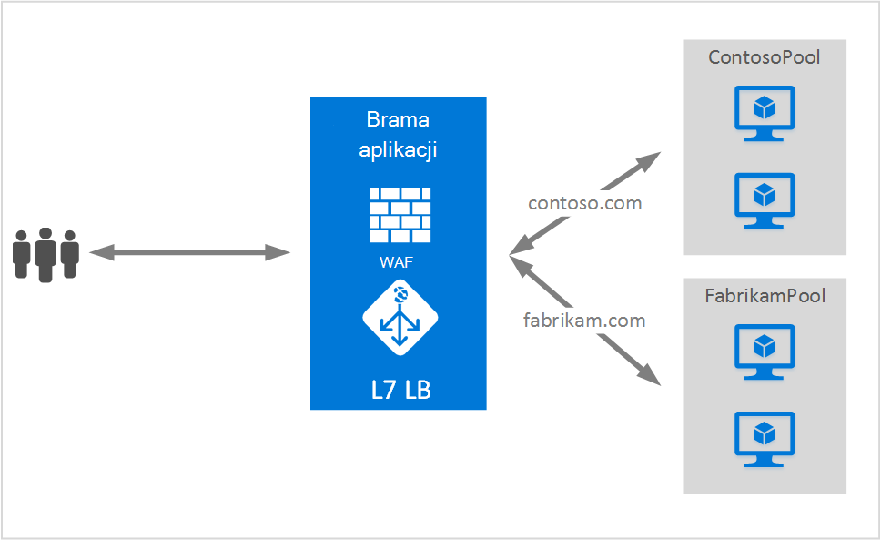

<properties
   pageTitle="Obsługa wielu witryn na bramy aplikacji | Microsoft Azure"
   description="Ta strona zawiera omówienie obsługi wielu aplikacji bramy."
   documentationCenter="na"
   services="application-gateway"
   authors="amsriva"
   manager="rossort"
   editor="amsriva"/>
<tags
   ms.service="application-gateway"
   ms.devlang="na"
   ms.topic="hero-article"
   ms.tgt_pltfrm="na"
   ms.workload="infrastructure-services"
   ms.date="10/25/2016"
   ms.author="amsriva"/>

# Brama aplikacji wielu hostingu witryny

Wiele hostingu witryny umożliwia konfigurowanie więcej niż jedna aplikacja sieci web na tym samym wystąpieniu bramy aplikacji. Ta funkcja umożliwia konfigurowanie topologii efektywniejsze dla wdrożeń, dodając maksymalnie 20 witryn sieci Web w jednej aplikacji bramy. Każdej witryny sieci Web może być kierowane do własną pulę wewnętrznej bazy danych. W poniższym przykładzie bramy aplikacji jest obsługujące ruch contoso.com i fabrikam.com z dwóch zestawów wewnętrznej serwera o nazwie ContosoServerPool i FabrikamServerPool.

Żądania dla http://contoso.com są kierowane do ContosoServerPool i http://fabrikam.com są kierowane do FabrikamServerPool.

Podobnie dwóch poddomen tej samej domeny nadrzędne może być przechowywana na tym samym wdrażania aplikacji w bramy. Przykłady używania poddomen mogą obejmować http://blog.contoso.com i http://app.contoso.com hostowanej wdrożenia bramy jednej aplikacji.

## Nagłówki hosta i wskazanie nazwa serwera (SNI)

Istnieją trzy Wspólne mechanizmy umożliwiających wielu hostingu witryny na tym samym infrastruktury.

1. Udostępniać wielu aplikacji sieci web każdego na unikatowy adres IP.
2. Użyj nazwy hosta do obsługi wielu aplikacji sieci web w taki sam adres IP.
3. Za pomocą różnych portów do obsługi wielu aplikacji sieci web w taki sam adres IP.

Obecnie bramy aplikacji otrzymuje jeden publiczny adres IP jego wykrywa ruchu. W związku z tym obsługi wielu aplikacji, każda z własnego adresu IP nie jest obecnie obsługiwane. Brama aplikacji obsługuje obsługi wielu aplikacji każdego nasłuchują na różnych portów, ale w tym scenariuszu wymaga aplikacjom akceptować ruch niestandardowych portów i jest zazwyczaj nie Konfiguracja docelowa. Brama aplikacji zależy od nagłówków hosta HTTP 1.1 do obsługi więcej niż jednej witryny sieci Web, w tym samym publiczny adres IP i port. Witryn znajdujących się na bramy aplikacji można także odciążania SSL pomocy technicznej z rozszerzeniem TLS wskazanie nazwa serwera (SNI). W tym scenariuszu oznacza, że farmy klienta przeglądarki i wewnętrznej bazy danych sieci web musi obsługiwać protokołu HTTP/1.1 i rozszerzenia TLS zdefiniowane w RFC 6066.

## Element konfiguracji odbiornika

Istniejący element konfiguracji HTTPListener jest rozszerzony o obsługę hosta serwera i nazwa nazwa oznaczenie elementów, używaną przez bramę aplikacji do rozsyłania ruchu do puli odpowiednie wewnętrznej bazy danych. W poniższym przykładzie jest wstawkę kodu elementu HttpListeners z pliku szablonu.

    "httpListeners": [
                {
                    "name": "appGatewayHttpsListener1",
                    "properties": {
                        "FrontendIPConfiguration": {
                            "Id": "/subscriptions/<subid>/resourceGroups/<rgName>/providers/Microsoft.Network/applicationGateways/applicationGateway1/frontendIPConfigurations/DefaultFrontendPublicIP"
                        },
                        "FrontendPort": {
                            "Id": "/subscriptions/<subid>/resourceGroups/<rgName>/providers/Microsoft.Network/applicationGateways/applicationGateway1/frontendPorts/appGatewayFrontendPort443'"
                        },
                        "Protocol": "Https",
                        "SslCertificate": {
                            "Id": "/subscriptions/<subid>/resourceGroups/<rgName>/providers/Microsoft.Network/applicationGateways/applicationGateway1/sslCertificates/appGatewaySslCert1'"
                        },
                        "HostName": "contoso.com",
                        "RequireServerNameIndication": "true"
                    }
                },
                {
                    "name": "appGatewayHttpListener2",
                    "properties": {
                        "FrontendIPConfiguration": {
                            "Id": "/subscriptions/<subid>/resourceGroups/<rgName>/providers/Microsoft.Network/applicationGateways/applicationGateway1/frontendIPConfigurations/appGatewayFrontendIP'"
                        },
                        "FrontendPort": {
                            "Id": "/subscriptions/<subid>/resourceGroups/<rgName>/providers/Microsoft.Network/applicationGateways/applicationGateway1/frontendPorts/appGatewayFrontendPort80'"
                        },
                        "Protocol": "Http",
                        "HostName": "fabrikam.com",
                        "RequireServerNameIndication": "false"
                    }
                }
            ],

[Szablon Menedżera zasobów przy użyciu wielu hostingu witryny](https://github.com/Azure/azure-quickstart-templates/blob/master/201-application-gateway-multihosting) mogą odwiedzić wdrożenia kompleksowego oparty na szablonie.

## Reguły routingu

Istnieje zmiany nie są wymagane w regule routingu. Reguły routingu "Basic" powinny nadal można wybrać powiązać odbiornika odpowiedniej witryny do odpowiedniej puli adresów wewnętrznej bazy danych.

    "requestRoutingRules": [
    {
        "name": "<ruleName1>",
        "properties": {
            "RuleType": "Basic",
            "httpListener": {
                "id": "/subscriptions/<subid>/resourceGroups/<rgName>/providers/Microsoft.Network/applicationGateways/applicationGateway1/httpListeners/appGatewayHttpsListener1')]"
            },
            "backendAddressPool": {
                "id": "/subscriptions/<subid>/resourceGroups/<rgName>/providers/Microsoft.Network/applicationGateways/applicationGateway1/backendAddressPools/ContosoServerPool')]"
            },
            "backendHttpSettings": {
                "id": "/subscriptions/<subid>/resourceGroups/<rgName>/providers/Microsoft.Network/applicationGateways/applicationGateway1/backendHttpSettingsCollection/appGatewayBackendHttpSettings')]"
            }
        }

    },
    {
        "name": "<ruleName2>",
        "properties": {
            "RuleType": "Basic",
            "httpListener": {
                "id": "/subscriptions/<subid>/resourceGroups/<rgName>/providers/Microsoft.Network/applicationGateways/applicationGateway1/httpListeners/appGatewayHttpListener2')]"
            },
            "backendAddressPool": {
                "id": "/subscriptions/<subid>/resourceGroups/<rgName>/providers/Microsoft.Network/applicationGateways/applicationGateway1/backendAddressPools/FabrikamServerPool')]"
            },
            "backendHttpSettings": {
                "id": "/subscriptions/<subid>/resourceGroups/<rgName>/providers/Microsoft.Network/applicationGateways/applicationGateway1/backendHttpSettingsCollection/appGatewayBackendHttpSettings')]"
            }
        }

    }
    ]

## Następne kroki

Po naukę obsługi wielu witryn, przejdź do [Tworzenie bramy aplikacji przy użyciu wielu hostingu witryny](application-gateway-create-multisite-azureresourcemanager-powershell.md) , aby utworzyć bramy aplikacji z możliwość obsługi więcej niż jedna aplikacja sieci web.
