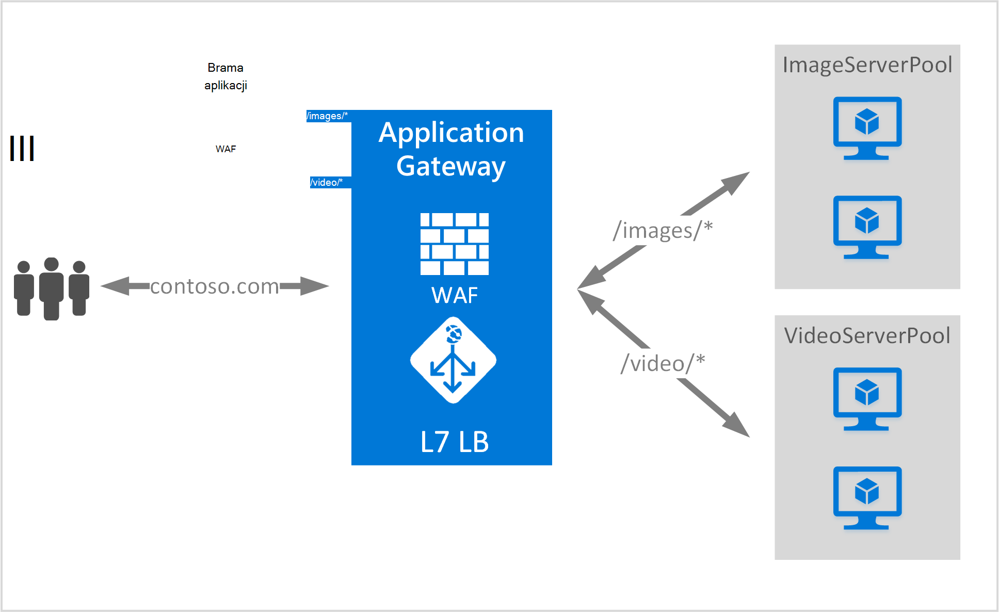

<properties
   pageTitle="Adresy URL Przegląd kierowanie zawartości | Microsoft Azure"
   description="Ta strona zawiera omówienie oparte na adres URL aplikacji bramy rozsyłanie zawartości, UrlPathMap konfiguracji i PathBasedRouting reguły."
   documentationCenter="na"
   services="application-gateway"
   authors="georgewallace"
   manager="carmonm"
   editor="tysonn"/>
<tags
   ms.service="application-gateway"
   ms.devlang="na"
   ms.topic="hero-article"
   ms.tgt_pltfrm="na"
   ms.workload="infrastructure-services"
   ms.date="10/25/2016"
   ms.author="gwallace"/>

# Omówienie routingu opartego na adres URL ścieżki

Zależności marszrut w adresu URL pozwala na ruch trasy do pul wewnętrznej serwera według ścieżki adresu URL żądania. Jedną z scenariuszy jest rozsyłanie żądań dla różnych typów zawartości pul serwera innej wewnętrznej bazy danych.
W poniższym przykładzie bramy aplikacji jest obsługujących ruch contoso.com z trzech pul serwera wewnętrznej na przykład: VideoServerPool, ImageServerPool i DefaultServerPool.

Żądania http://contoso.com/video* są kierowane do VideoServerPool i http://contoso.com/images* są kierowane do ImageServerPool. DefaultServerPool jest zaznaczone, jeśli żadna z wzorców ścieżki.

## Element konfiguracji UrlPathMap

UrlPathMap element służy do określania wzorców ścieżka do serwera wewnętrznej puli mapowań. W poniższym przykładzie jest wstawkę kodu elementu urlPathMap z pliku szablonu.

    "urlPathMaps": [
    {
    "name": "<urlPathMapName>",
    "id": "/subscriptions/<subscriptionId>/../microsoft.network/applicationGateways/<gatewayName>/ urlPathMaps/<urlPathMapName>",
    "properties": {
        "defaultBackendAddressPool": {
            "id": "/subscriptions/<subscriptionId>/../microsoft.network/applicationGateways/<gatewayName>/backendAddressPools/<poolName>"
        },
        "defaultBackendHttpSettings": {
            "id": "/subscriptions/<subscriptionId>/../microsoft.network/applicationGateways/<gatewayName>/backendHttpSettingsList/<settingsName>"
        },
        "pathRules": [
            {
                "paths": [
                    <pathPattern>
                ],
                "backendAddressPool": {
                    "id": "/subscriptions/<subscriptionId>/../microsoft.network/applicationGateways/<gatewayName>/backendAddressPools/<poolName2>"
                },
                "backendHttpsettings": {
                    "id": "/subscriptions/<subscriptionId>/../microsoft.network/applicationGateways/<gatewayName>/backendHttpsettingsList/<settingsName2>"
                },

            },

        ],

    }
    }
    

>[AZURE.NOTE] PathPattern: To ustawienie jest lista wzorców ścieżka zgodnie z. Każdy musi rozpoczynać się- i umieszczanie tylko "*" jest dozwolona znajduje się na końcu następujące czynności "/". Ciąg rana do dopasowania ścieżka nie ma żadnego tekstu po pierwszym? lub # i te znaki nie są dozwolone w tym miejscu. 

Należy wyewidencjonować [szablonu Menedżera zasobów za pomocą routingu opartego na adres URL](https://azure.microsoft.com/documentation/templates/201-application-gateway-url-path-based-routing) Aby uzyskać więcej informacji.

## Reguła PathBasedRouting

RequestRoutingRule typu PathBasedRouting jest używana do powiązać detektor urlPathMap. Wszystkie żądania, które są odbierane dla tego odbiornika rozsyłania, na podstawie zasad określonych w urlPathMap.
Fragment PathBasedRouting reguły:

    "requestRoutingRules": [
    {

    "name": "<ruleName>",
    "id": "/subscriptions/<subscriptionId>/../microsoft.network/applicationGateways/<gatewayName>/requestRoutingRules/<ruleName>",
    "properties": {
        "ruleType": "PathBasedRouting",
        "httpListener": {
            "id": "/subscriptions/<subscriptionId>/../microsoft.network/applicationGateways/<gatewayName>/httpListeners/<listenerName>"
        },
        "urlPathMap": {
            "id": "/subscriptions/<subscriptionId>/../microsoft.network/applicationGateways/<gatewayName>/ urlPathMaps/<urlPathMapName>"
        },

    }
    
## Następne kroki

Po szkoleniowe na temat oparte na adres URL rozsyłanie zawartości, przejdź do [tworzenia bramy aplikacji przy użyciu routingu opartego na adres URL](application-gateway-create-url-route-portal.md) Tworzenie bramy aplikacji przy użyciu reguł rozsyłania adresu URL.
