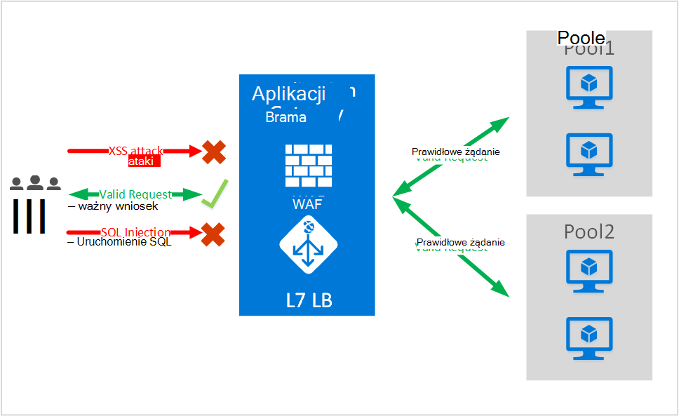
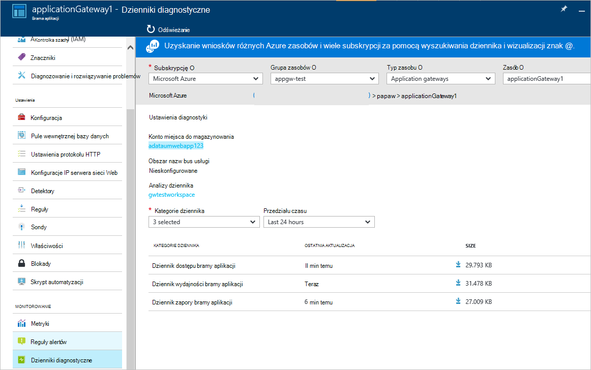

<properties
   pageTitle="Wprowadzenie do zapory aplikacji sieci Web (WAF) dla aplikacji bramy | Microsoft Azure"
   description="Ta strona zawiera omówienie z zapory aplikacji sieci Web (WAF) dla aplikacji bramy "
   documentationCenter="na"
   services="application-gateway"
   authors="amsriva"
   manager="rossort"
   editor="amsriva"/>
<tags
   ms.service="application-gateway"
   ms.devlang="na"
   ms.topic="hero-article"
   ms.tgt_pltfrm="na"
   ms.workload="infrastructure-services"
   ms.date="10/25/2016"
   ms.author="amsriva"/>

# Aplikacja bramy sieci Web aplikacji zapory (wersja preview)

Zapora aplikacji sieci Web (WAF), to funkcja bramy azure aplikacji, która zapewnia ochronę w aplikacjach sieci web, które używają bramy aplikacji dla standardowych funkcji sterowania dostarczenia aplikacji (ADC). Zapora aplikacji sieci Web powinien się tym zająć chroniąc je przed większość OWASP górny 10 typowych web luk. Aplikacje sieci Web są bardziej celów atakami, które wykorzystać znanych luk znane. Wspólne dla takie oprogramowanie są ataki, skryptów krzyżowych ataki kilka. Zapobieganie takie atakami w kodzie aplikacji może być trudne, a może wymagać rygorystyczne utrzymanie, poprawianie i monitorowanie w wielu warstw Topologia aplikacji. Zapory aplikacji web scentralizowane w celu ochrony przed atakami sieci web umożliwia znacznie upraszcza zarządzanie zabezpieczeń i zapewnia lepsze assurance do aplikacji przed zagrożeniami atakami. Rozwiązanie WAF również może reagować na szybsze zagrożenie przez poprawek znany luka w jednym miejscu i zabezpieczanie wszystkich aplikacji sieci web poszczególnych. Istniejące bram aplikacji można łatwo przekonwertowane na bramy aplikacji z zapory aplikacji sieci web.

Brama aplikacji działa jako kontroler dostarczenia aplikacji i oferuje zakończenia SSL, koligacji sesji plików cookie, załaduj okrężny rozmieszczenia, zawartości podstawie routingu, może obsługiwać wiele udoskonaleń witryn sieci Web i zabezpieczenia. Udoskonalenia zabezpieczeń oferowanych przez bramę aplikacji obejmują SSL Zarządzanie kompleksowego Obsługa protokołu SSL. Firma Microsoft są wzmacnianie możliwości zabezpieczeń aplikacji usługi wprowadzając zintegrowane bezpośrednio ADC oferowanie WAF (Zapora aplikacji sieci web). Dzięki temu ułatwia konfigurowanie centralną lokalizację do zarządzania i ochrony aplikacji sieci web pod kątem zgodności znanych luk w sieci web.

Konfigurowanie WAF w aplikacji bramy miejsce następujące korzyści:

- Ochrona aplikacji sieci web z sieci web luk i atakami bez modyfikacji kodu wewnętrznej bazy danych.
- Chroń wielu aplikacji sieci web, w tym samym czasie za bramy aplikacji. Brama aplikacji obsługuje hostingu maksymalnie 20 witryn sieci Web za jednej bramy, która może być wszystkie chronione przed atakami z sieci web.
- Monitorowanie aplikacji sieci web atakami przy użyciu raportu w czasie rzeczywistym generowanych przez dzienniki bramy WAF aplikacji.
- Niektóre formanty zgodności wymagają wszystkie internetowe przeciwległych punkty końcowe ma być chroniony przez rozwiązanie WAF. Używając aplikacji bramy WAF włączone, możesz spełniać następujące wymagania zgodności.

## Omówienie

WAF bramy aplikacji jest oferowane w nowej wersji (WAF SKU) i ma wstępnie skonfigurowane z ModSecurity i zestaw reguł Core OWASP do oferowania według planu bazowego ochrony przed większość OWASP górny 10 typowych web luk.

- Ochrona uruchomienie SQL
- Krzyżowe ochrony skryptów witryny
- Typowe Web ataki ochrony takich jak uruchomienie polecenia, żądania HTTP smuggling odpowiedź HTTP dzielenie i ataki włączenia zdalnego pliku
- Ochrona przed naruszenia protokołu HTTP
- Ochrona różnic protokołu HTTP w odniesieniu takich jak brak obsługi agenta użytkownika i zaakceptuj nagłówków
- Ochrona przed DoS HTTP tym zalewu HTTP i wolne zapobiegania HTTP DoS
- Zapobieganie przed Boty, przeszukiwarki i skanery
- Wykrywanie typowych błędów konfiguracji aplikacji (to znaczy Apache, usług IIS itp.)

## Tryby WAF

WAF bramy aplikacji można skonfigurować do uruchamiania w następujących dwóch trybów:

- **Tryb wykrywania** — Jeśli skonfigurowany do uruchomienia w trybie wykrywania WAF bramy aplikacji monitoruje i rejestruje wszystkie alerty zagrożenie do pliku dziennika. Należy się upewnić, że rejestrowanie diagnostyczne dla aplikacji bramy jest włączona za pomocą sekcji diagnostyki. Konieczne będzie również upewnij się, że dziennik WAF jest zaznaczone i włączone.
- **Tryb zapobiegania** — Jeśli skonfigurowany do uruchomienia w trybie zapobiegania Application Gateway aktywnie blokuje atakami i atakami wykryte przez jego reguły. Tej otrzyma wyjątku 403 nieautoryzowanym dostępem i połączenie zostanie zakończone. Tryb zapobiegania nadal rejestruje takie atakami w dzienniku WAF.

## Raporty WAF bramy aplikacji

WAF bramy aplikacji zawiera szczegółowe raporty na poszczególnych zagrożenia, które wykrywa. Rejestrowanie jest zintegrowany z dzienników Diagnostyka Azure i alerty są rejestrowane w formacie json.

    {
        "resourceId": "/SUBSCRIPTIONS/<subscriptionId>/RESOURCEGROUPS/<resourceGroupName>/PROVIDERS/MICROSOFT.NETWORK/APPLICATIONGATEWAYS/<applicationGatewayName>",
        "operationName": "ApplicationGatewayFirewall",
        "time": "2016-09-20T00:40:04.9138513Z",
        "category": "ApplicationGatewayFirewallLog",
        "properties":     {
            "instanceId":"ApplicationGatewayRole_IN_0",
            "clientIp":"108.41.16.164",
            "clientPort":1815,
            "requestUri":"/wavsep/active/RXSS-Detection-Evaluation-POST/",
            "ruleId":"OWASP_973336",
            "message":"XSS Filter - Category 1: Script Tag Vector",
            "action":"Logged",
            "site":"Global",
            "message":"XSS Filter - Category 1: Script Tag Vector",
            "details":{"message":" Warning. Pattern match "(?i)(<script","file":"/owasp_crs/base_rules/modsecurity_crs_41_xss_attacks.conf","line":"14"}}
    }

## Cennik bramy WAF SKU aplikacji

W wersji preview istnieje nie dodatkowych opłat użycia aplikacji WAF bramy. Nadal jest rozliczana według istniejących opłaty podstawowe SKU. Firma Microsoft przekaże WAF SKU opłaty w czasie GA. Klienci, którzy chcą wdrożyć aplikację bramy w wersji WAF zaczyna się naliczane SKU WAF ceny dopiero po GA powiadomienia.

## Następne kroki

Po więcej informacji na temat możliwości WAF, odwiedź stronę [sposobu konfigurowania zapory aplikacji sieci Web dla aplikacji bramy](application-gateway-web-application-firewall-portal.md).
