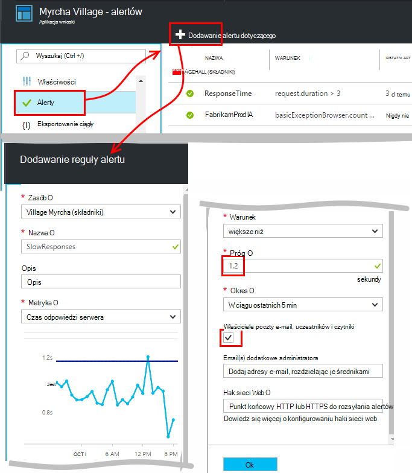
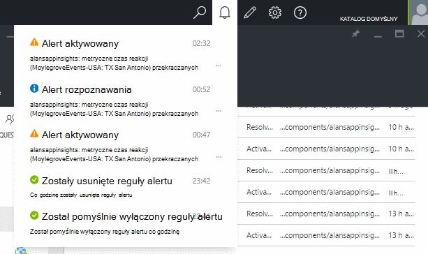
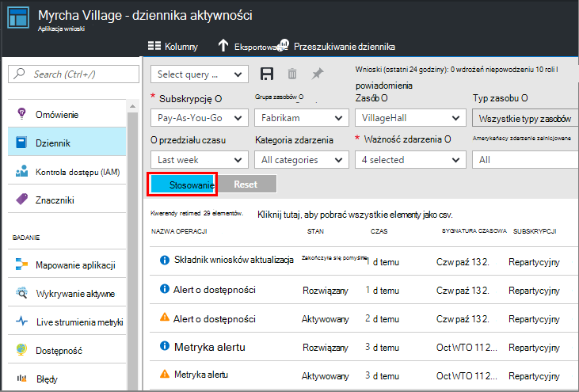

<properties 
    pageTitle="Ustawianie alertów w aplikacji wniosków | Microsoft Azure" 
    description="Otrzymywać powiadomienia o czasu wolnego odpowiedzi, wyjątki i innych wyników lub zastosowania zmian w aplikacji sieci web." 
    services="application-insights" 
    documentationCenter=""
    authors="alancameronwills" 
    manager="douge"/>

<tags 
    ms.service="application-insights" 
    ms.workload="tbd" 
    ms.tgt_pltfrm="ibiza" 
    ms.devlang="na" 
    ms.topic="article" 
    ms.date="10/14/2016" 
    ms.author="awills"/>
 
# Ustawianie alertów w aplikacji wniosków

[Visual Studio aplikacji wniosków] [ start] alert na zmiany wskaźników wydajności i użycia w aplikacji sieci web. 

Wnioski aplikacji monitoruje live aplikacji na [wielu różnych platformach] [ platforms] ułatwiają diagnozowanie problemów z wydajnością i opis upodobania.

Istnieją trzy typy alertów:

* **Alerty metryczne** zorientować się, po dowolnej metryki przecina wartość progowa dla niektórych okres — takie jak czasy odpowiedzi, liczniki wyjątku, użycie Procesora i liczba wyświetleń strony. 
* [**Testy z siecią Web** ] [ availability] informujący o tym, kiedy witryna jest niedostępny w Internecie lub odpowiada powoli. [Dowiedz się więcej][availability].
* [**Diagnostyka aktywne**](app-insights-proactive-diagnostics.md) są konfigurowane automatycznie informujący o wzorców wydajności nietypowego.

Firma Microsoft skoncentrowanie się na metryczne alerty w tym artykule.

## Ustawianie alertu metryczne

Otwórz karta reguły alertów, a następnie za pomocą przycisku Dodaj. 

* Ustawianie zasób przed inne właściwości. **Wybierz zasób "(składniki)"** , jeśli chcesz ustawić alerty dla miar wydajności i użycia.
* Nazwa nadana alert musi być unikatowa w grupie zasobu (nie tylko aplikacji).
* Należy zachować ostrożność Uwaga jednostki, w których jest wyświetlana prośba o wprowadź wartość progowa.
* Po zaznaczeniu pola "E-mail właściciele...", alerty będą wysyłane pocztą e-mail dla każdego, kto ma dostęp do tej grupy zasobów. Aby rozwinąć ten zestaw osób, dodaj je do [grupy zasobów lub innej subskrypcji](app-insights-resources-roles-access-control.md) (ale nie zasób).
* Jeśli użytkownik określi "Dodatkowe wiadomości e-mail", alerty będą wysyłane do odpowiednich osób lub grup (tego, czy zaznaczonym polu "e-mail właściciele..."). 
* Jeśli masz skonfigurowane aplikacji sieci web, która odpowiada alertów, należy ustawić [adres webhook](../monitoring-and-diagnostics/insights-webhooks-alerts.md) . Zostanie on wywołany zarówno po uaktywnieniu alertu (czyli generowany) i gdy problem zostanie rozwiązany. (Należy zauważyć, że obecnie, ale nie przechodzą parametry kwerendy jako właściwości webhook.)
* Możesz wyłączyć lub włączyć alert: Zobacz przyciski w górnej części karta.

*Przycisk Dodaj Alert nie jest widoczny.* 

- Używasz konta organizacji? Alerty można ustawić właściciela lub współautora uzyskiwanie dostępu do tego zasobu aplikacji. Zapoznaj się karta kontrola dostępu. [Więcej informacji na temat kontroli dostępu][roles].

> [AZURE.NOTE] W karta alerty zobaczysz, że jest już Ustawianie alertów w górę: [Diagnostyka aktywne](app-insights-proactive-failure-diagnostics.md). To jest alert automatyczne monitoruje określonego metryczne, żądanie błąd stóp. Chyba że zdecydujesz się na wyłączenie alertu aktywne, nie musisz skonfigurować własne alert na żądanie współczynnik błędów. 

## Zobacz alerty

Otrzymasz wiadomość e-mail, gdy stan alert zmiany między nieaktywne i aktywne. 

Bieżący stan każdej alert są wyświetlane w karta reguł alertów.

Istnieje podsumowanie ostatniej aktywności w sekcji alertów listy rozwijanej:

Historia zmian stanu znajduje się w dzienniku aktywności:

## Jak działają alertów

* Alert ma trzy stany: "Nigdy nie aktywowane", "Aktywny" i "Rozwiązany." Oznacza aktywowanego określony warunek był ma wartość PRAWDA, ostatniego oszacowano.

* Powiadomienie jest generowany podczas alert zmienia stan. (Jeśli warunek alert był już wartość PRAWDA, po utworzeniu alertu, można otrzymać powiadomienie aż warunek ma wartość FAŁSZ.)

* Każde powiadomienie generuje wiadomości e-mail, zaznaczone pole wiadomości e-mail, czy podane adresy e-mail. Można także przeglądać listy rozwijanej powiadomienia.

* Alert jest obliczane zawsze, gdy nadchodzi metryki, ale nie.

* Oceny agreguje metryki w poprzednim okresie, a porównanie jej progu, aby określić nowy stan.

* Okresu, w którym możesz wybrać Określa interwał, w którym są agregowane metryki. Nie wywiera wpływu na częstotliwość obliczane alert: to zależy od częstotliwości nadejście miar.

* Jeśli do określonej metryki nadchodzi bez danych przez pewien czas, odstępu ma różnych efektów na alert oceny, a na wykresach w Eksploratorze metryczne. W Eksploratorze metryczne Jeśli nie danych pojawia się przez dłużej niż interwał pobierania wykresu, wykres pokazuje wartość 0. Ale alertu opartego na tę samą metrykę nie zostać ponownie obliczony i stan alertu pozostaje bez zmian. 

    Po pewnym czasie odebraniu danych wykresu uskoki wartość różną od zera. Oblicza alertu na podstawie danych dostępnych w okresie określonej. Jeśli nowy punkt danych jest to jedyna dostępna w okresie, agregacji opiera się tylko na punkt danych.

* Alert może migotać często między alertów i prawidłowy, nawet jeśli ustawiono długi czas. To może się zdarzyć, jeśli wartość metryki znajduje się wokół progu. Próg jest nie histerezy: przejście do alert odbywa się na tę samą wartość co przejścia do prawidłowy.

## Co to są dobrej alerty, aby ustawić?

To zależy od rodzaju aplikacji. Zaczynać się najlepiej nie ustawiono zbyt wiele metryki. Poświęć trochę czasu spojrzenie na wykresach metryczne po uruchomieniu aplikacji uzyskać działanie jak działa normalnie. Pomaga to sposoby zwiększenia wydajności. Następnie skonfiguruj alerty informujący o tym, kiedy metryki Przejdź poza strefą normalny. 

Popularne alerty obejmują:

* [Metryki przeglądarki][client], zwłaszcza przeglądarki **czasem ładowania strony**, dobry dla aplikacji sieci web. Jeśli stronie zawiera wiele skryptów, należy zwracać uwagę na **Wyjątki przeglądarki**. Aby można było uzyskiwać tych wskaźników i alertów, musisz skonfigurować [monitorowania strony sieci web][client].
* **Czas odpowiedzi serwera** po stronie serwera aplikacji sieci web. Oraz Konfigurowanie alertów, Zwracaj uwagę na tej metryki, aby zobaczyć, jeśli nieproporcjonalnie powstania z żądań wysoki: które wskazują aplikacji brakuje wolnego zasobów. 
* **Wyjątki serwera** — Aby obejrzeć je, musisz wykonać pewne [dodatkowe ustawienia](app-insights-asp-net-exceptions.md).

Nie zapomnij ten [Błąd aktywne stopa diagnostyki](app-insights-proactive-failure-diagnostics.md) automatycznie monitorować stawkę, przy której aplikacji odpowiada na żądania z kodami błąd. 

## Automatyzacji

* [Aby zautomatyzować konfigurowanie alertów za pomocą programu PowerShell](app-insights-powershell-alerts.md)
* [Użyj webhooks, aby zautomatyzować, odpowiadanie na alerty](../monitoring-and-diagnostics/insights-webhooks-alerts.md)

## Zobacz też

* [Dostępność testy sieci web](app-insights-monitor-web-app-availability.md)
* [Automatyzowanie konfigurowania alertów](app-insights-powershell-alerts.md)
* [Aktywne diagnostyki](app-insights-proactive-diagnostics.md) 

<!--Link references-->

[availability]: app-insights-monitor-web-app-availability.md
[client]: app-insights-javascript.md
[platforms]: app-insights-platforms.md
[roles]: app-insights-resources-roles-access-control.md
[start]: app-insights-overview.md

 