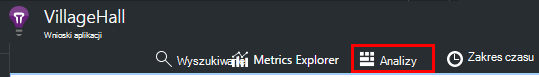
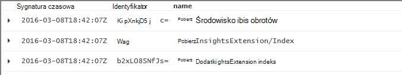
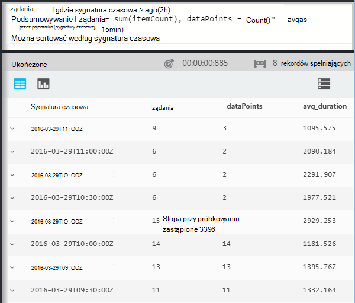

<properties 
    pageTitle="Przewodnik za pomocą analizy w aplikacji wniosków | Microsoft Azure" 
    description="Krótki próbki wszystkie głównym kwerendy do analizy, narzędzie zaawansowane wyszukiwanie wniosków aplikacji." 
    services="application-insights" 
    documentationCenter=""
    authors="alancameronwills" 
    manager="douge"/>

<tags 
    ms.service="application-insights" 
    ms.workload="tbd" 
    ms.tgt_pltfrm="ibiza" 
    ms.devlang="na" 
    ms.topic="article" 
    ms.date="10/15/2016" 
    ms.author="awills"/>


 
# <a name="a-tour-of-analytics-in-application-insights"></a>Przewodnik po analizy w aplikacji wniosków


[Analiza](app-insights-analytics.md) jest funkcją zaawansowane wyszukiwanie [Wniosków aplikacji](app-insights-overview.md). Te strony opisują lanquage zapytania analizy.


* **[Obejrzyj klip wideo wprowadzenia](https://applicationanalytics-media.azureedge.net/home_page_video.mp4)**.
* **[Testowanie analizy w naszych danych symulowany](https://analytics.applicationinsights.io/demo)** Jeśli aplikacji nie jest wysyłanie danych do aplikacji wniosków jeszcze.


Przyjrzyjmy się kolejne kroki niektóre podstawowe kwerendy ułatwiające rozpoczęcie pracy.

## <a name="connect-to-your-application-insights-data"></a>Łączenie z danymi aplikacji wniosków

Otwieranie analizy z Twojej aplikacji [Karta Przegląd](app-insights-dashboards.md) w wniosków aplikacji:



    
## <a name="takeapp-insights-analytics-referencemdtake-operator-show-me-n-rows"></a>[Sporządzanie](app-insights-analytics-reference.md#take-operator): Pokaż n wierszy

Punkty danych, które logowania użytkownika operacje (zwykle żądania HTTP otrzymane przez aplikacji sieci web) są przechowywane w tabeli o nazwie `requests`. Każdy wiersz jest punkt danych telemetrycznego odebrana SDK wniosków aplikacji w aplikacji.

Zacznijmy od badania kilka przykładowych wierszy tabeli:


> [AZURE.NOTE] Umieść kursor w dowolne miejsce w instrukcji zanim klikniesz przycisk Przejdź. Można podzielić instrukcję na więcej niż jeden wiersz, ale nie umieszczaj puste wiersze w instrukcji. Puste wiersze są wygodny sposób, aby zachować kilka oddzielnych zapytań w oknie.


Wybieranie kolumn, przeciągnij je pogrupować według kolumn i filtrować: 


Rozwiń dowolny element, aby wyświetlić szczegóły:
 


> [AZURE.NOTE] Kliknij przycisk nagłówka kolumny, aby zmienić porządek wyników dostępnych w przeglądarce sieci web. Należy jednak pamiętać, że dla zestawu wyników dużej liczby wierszy pobierane do przeglądarki jest ograniczony. Sortowanie w ten sposób nie zawsze pokazano rzeczywiste elementy najwyższe lub najniższe. Aby posortować elementy w wiarygodny sposób, należy użyć `top` lub `sort` operatora. 

## <a name="topapp-insights-analytics-referencemdtop-operator-and-sortapp-insights-analytics-referencemdsort-operator"></a>[Góry](app-insights-analytics-reference.md#top-operator) i [Sortowanie](app-insights-analytics-reference.md#sort-operator)

`take`Umożliwia uzyskiwanie szybkiego próbki wyniku, ale jest wyświetlany w losowej kolejności wierszy z tabeli. Aby uzyskać uporządkowana widok, użyj `top` (w przypadku próbki) lub `sort` (nad całą tabelę).

Pokaż pierwszy n wierszy uporządkowane według określonej kolumny:

```AIQL

    requests | top 10 by timestamp desc 
```

* *Składni:* Większość operatorów mieć parametrów słowo kluczowe, takie jak `by`.
* `desc`= według malejącej `asc` = rosnąco.



`top...`udostępnia więcej performant z informacją o tym `sort ... | take...`. Firma Microsoft może zostały zapisane:

```AIQL

    requests | sort by timestamp desc | take 10
```

Wynik będzie taki sam, ale będzie działać nieco wolniej. (Można też napisać `order`, która jest alias `sort`.)

Aby sortować wyniki na ekranie można również nagłówków kolumn w widoku tabeli. Oczywiście, jeśli wykorzystano, ale `take` lub `top` pobrać tylko część tabeli, można będzie tylko Zmień kolejność rekordy zostały pobrane.


## <a name="projectapp-insights-analytics-referencemdproject-operator-select-rename-and-compute-columns"></a>[Projekt](app-insights-analytics-reference.md#project-operator): Wybierz, Zmień nazwę i obliczyć kolumn

Używanie [`project`](app-insights-analytics-reference.md#project-operator) do wybierania tylko odpowiednie kolumny:

```AIQL

    requests | top 10 by timestamp desc
             | project timestamp, name, resultCode
```


Można także zmienić nazwę kolumny i definiowanie nowych plików:

```AIQL

    requests 
  	| top 10 by timestamp desc 
  	| project  
            name, 
            response = resultCode,
            timestamp, 
            ['time of day'] = floor(timestamp % 1d, 1s)
```


* [Nazwy kolumn](app-insights-analytics-reference.md#names) może zawierać spacje lub symbole, jeśli są one oddzielona podobnie do następującej: `['...']` lub`["..."]`
* `%`jest zwykle modulo operatora. 
* `1d`(jest to cyfry, a następnie sprzedał ") jest przedziału czasu literałów co oznacza jeden dzień. Poniżej przedstawiono niektóre więcej literałów przedziału czasu: `12h`, `30m`, `10s`, `0.01s`.
* `floor`(alias `bin`) zaokrągla wartość w dół do najbliższej wielokrotności wartości bazowej podasz. Dlatego `floor(aTime, 1s)` zaokrągla czasu w dół do najbliższej drugiego.

[Wyrażenia](app-insights-analytics-reference.md#scalars) mogą zawierać zwykłych operatorów (`+`, `-`,...), a istnieje szereg przydatnych funkcji.

    

## <a name="extendapp-insights-analytics-referencemdextend-operator-compute-columns"></a>[Rozszerzona](app-insights-analytics-reference.md#extend-operator): Obliczanie kolumny

Jeśli chcesz dodać kolumny do istniejące, użyj [`extend`](app-insights-analytics-reference.md#extend-operator):

```AIQL

    requests 
  	| top 10 by timestamp desc
  	| extend timeOfDay = floor(timestamp % 1d, 1s)
```

Za pomocą [`extend`](app-insights-analytics-reference.md#extend-operator) jest pełne mniej niż [`project`](app-insights-analytics-reference.md#project-operator) Jeśli chcesz zachować istniejących kolumn.


## <a name="summarizeapp-insights-analytics-referencemdsummarize-operator-aggregate-groups-of-rows"></a>[Podsumowanie](app-insights-analytics-reference.md#summarize-operator): agregowanie grup wierszy

`Summarize`dotyczy określonych *funkcji agregacji* dla grup wierszy. 

Na przykład czas, w aplikacji sieci web ma reagować na żądania jest zgłaszany w polu `duration`. Zobaczmy, Średni czas reakcji na wszystkie żądania:


Lub wynik można oddzielić do żądania różne nazwy:


`Summarize`zbiera punktów danych w strumieniu do grupy, dla której `by` klauzula oblicza równomiernie. Każda wartość w `by` wyrażenie - nazwy operacji w powyższym przykładzie - wyników w wierszu w tabeli wyników. 

I firma Microsoft może grupowanie wyników przez godzinę:


Zwróć uwagę, jak firma Microsoft korzysta `bin` funkcji (czyli `floor`). Jeśli właśnie użyte `by timestamp`, każdy wiersz wprowadzania będą trafiać nieco grupy. Dla dowolnego ciągły skalarnej, takie jak godziny lub numerów, mamy podziału ciągłym zakresie na łatwiejsze liczba osobne wartości, i `bin` — która jest wyjątkowo tylko znanych zaokrąglania szczegółów `floor` funkcja — jest najprostszym sposobem na to zrobić.

Firma Microsoft korzysta sam sposób, aby zmniejszyć zakresów ciągów:


Należy zauważyć, że możesz użyć `name=` ustawić nazwy kolumny wyników, w wyrażeniach agregacji lub klauzula przez.

## <a name="counting-sampled-data"></a>Zliczanie pobrane dane

`sum(itemCount)`jest zalecane agregacji do zliczenia zdarzeń. W większości przypadków: itemCount == 1, aby funkcja po prostu zlicza liczby wierszy w grupie. Jednak podczas [pobierania](app-insights-sampling.md) jest operacja, tylko część oryginalnego zdarzenia zostaną zachowane jako punkty danych w wniosków aplikacji, aby dla każdego punktu danych zostanie wyświetlony `itemCount` zdarzenia. 

Na przykład jeśli przy próbkowaniu odrzuci 75% oryginalnej zdarzenia, a następnie: itemCount == 4 w rekordach podzielonego - oznacza to, że dla każdego rekordu podzielonego, są dostępne cztery rekordy oryginalny. 

Adaptacyjne przy próbkowaniu powoduje: itemCount będzie większa w okresach, gdy aplikacja jest intensywnie używany.

Podsumowanie: itemCount nadaje dobrym oszacowaniem oryginalny liczba zdarzeń.




Istnieje także `count()` agregacji (i operacji Statystyka), w przypadku której naprawdę chcesz zliczyć liczbę wierszy w grupie.


Istnieje szereg [funkcji agregacji](app-insights-analytics-reference.md#aggregations).


## <a name="charting-the-results"></a>Wykresy wyników


```AIQL

    exceptions 
       | summarize count()  
         by bin(timestamp, 1d)
```

Domyślnie wyniki są wyświetlane jako tabelę:


Możemy lepiej niż widoku tabeli. Przyjrzyjmy się wyniki są wyświetlane w widoku wykresu z pionowy pasek opcji:


Należy zauważyć, że mimo że firma Microsoft nie posortować wyniki według czasu (jak widać w tabeli), wykres zawiera zawsze dat i godzin w odpowiedniej kolejności.


## <a name="whereapp-insights-analytics-referencemdwhere-operator-filtering-on-a-condition"></a>[Gdzie](app-insights-analytics-reference.md#where-operator): filtrowanie warunku

Jeśli po skonfigurowaniu aplikacji wniosków monitorowania [klienta](app-insights-javascript.md) i serwera stronach aplikacji, niektóre telemetrycznego w bazie danych pochodzą z przeglądarki.

Zobaczmy, tylko wyjątki zgłoszone z przeglądarek:

```AIQL

    exceptions 
  	| where client_Type == "Browser" 
  	|  summarize count() 
       by client_Browser, outerMessage 
```


`where` Prowadzącego wyrażenie logiczne. Poniżej podano pewne istotne informacje o nich:

 * `and`, `or`: Operatory logiczne
 * `==`, `<>` : równe, a nie ma wartości
 * `=~`, `!=` : bez uwzględniania wielkości liter ciągu równy i nierówne. Istnieje wiele więcej operatory porównania ciągów.

Przeczytaj wszystkich informacji na temat [wyrażeń skalarną](app-insights-analytics-reference.md#scalars).

### <a name="filtering-events"></a>Filtrowanie zdarzeń

Znajdź niepomyślne żądania:

```AIQL

    requests 
  	| where isnotempty(resultCode) and toint(resultCode) >= 400
```

`responseCode`ma typu ciąg, więc możemy musi [zrzutowania go](app-insights-analytics-reference.md#casts) w celu porównania liczbowe.

Podsumowanie różne odpowiedzi:

```AIQL

    requests
  	| where isnotempty(resultCode) and toint(resultCode) >= 400
  	| summarize count() 
      by resultCode
```

## <a name="timecharts"></a>Timecharts

Pokaż, ile wydarzeń są każdego dnia:

```AIQL

    requests
      | summarize event_count=count()
        by bin(timestamp, 1d)
```

Wybierz odpowiednią opcję wyświetlania wykresu:


## <a name="multiple-series"></a>Wiele serii 

Wiele wyrażeń w `summarize` tworzy wielu kolumn.

Wiele wyrażeń w `by` klauzula tworzy wiele wierszy, po jednej dla każdej kombinacji wartości.


```AIQL

    requests
  	| summarize count(), avg(duration) 
      by bin(timestamp, 1d), client_StateOrProvince, client_City 
  	| order by timestamp asc, client_StateOrProvince, client_City
```


### <a name="segment-a-chart-by-dimensions"></a>Segmenty wykresu według wymiarów

Jeśli wykres tabelę zawierającą kolumny ciągu i liczbowe, ciąg można podzielić oddzielnym seria punktów danych liczbowych. Jeśli istnieje więcej niż jedna kolumna ciąg, możesz wybrać kolumnę jako rozróżniacz. 


### <a name="display-multiple-metrics"></a>Wyświetlanie wielu metryki

Jeśli wykres tabeli tego więcej niż jednej kolumny liczbowe, oprócz sygnatura czasowa, można wyświetlić dowolną kombinacją.


Po zaznaczeniu podziału nie można wybrać wielu liczbowe kolumny, których nie można podzielić według kolumny ciąg w tym samym czasie co wyświetlanie więcej niż jednej kolumny liczbowe. 


## <a name="daily-average-cycle"></a>Cykl dzienny średnia

Jak ostrzeżenie o zastosowania różnią się w ciągu dnia średnia?

Liczba żądania przez godzinę modulo jeden dzień binned na godziny:

```AIQL

    requests
  	| extend hour = floor(timestamp % 1d , 1h) 
          + datetime("2016-01-01")
  	| summarize event_count=count() by hour
```


>[AZURE.NOTE] Zwróć uwagę, mamy obecnie przekonwertować czasu trwania do dat i godzin, aby można było wyświetlić na wykresie.


## <a name="compare-multiple-daily-series"></a>Porównanie wiele serii dzienny

Jak zastosowania w zależności od przez godzinę w różnych krajów?

```AIQL

 requests  | where tostring(operation_SyntheticSource)
     | extend hour= floor( timestamp % 1d , 1h)
           + datetime("2001-01-01")
     | summarize event_count=count() 
       by hour, client_CountryOrRegion 
     | render timechart
```


## <a name="plot-a-distribution"></a>Kreśl rozkładu

Ile sesji istnieją o różnych długościach?

```AIQL

    requests 
  	| where isnotnull(session_Id) and isnotempty(session_Id) 
  	| summarize min(timestamp), max(timestamp) 
      by session_Id 
  	| extend sessionDuration = max_timestamp - min_timestamp 
  	| where sessionDuration > 1s and sessionDuration < 3m 
  	| summarize count() by floor(sessionDuration, 3s) 
  	| project d = sessionDuration + datetime("2016-01-01"), count_
```

Ostatni wiersz jest wymagane do przekonwertowania na daty i godziny. Obecnie osi x wykresu jest wyświetlany jako skalarnej tylko wtedy, gdy jest data/godzina.

`where` Klauzula wyłącza sesje one-shot (sessionDuration == 0) i zestawy długość osi x.


## <a name="percentilesapp-insights-analytics-referencemdpercentiles"></a>[Percentylu](app-insights-analytics-reference.md#percentiles)

Jakie zakresów czasu trwania obejmuje różne procenty sesje?

Za pomocą kwerendy powyżej, ale zamiast ostatni wiersz:

```AIQL

    requests 
  	| where isnotnull(session_Id) and isnotempty(session_Id) 
  	| summarize min(timestamp), max(timestamp) 
      by session_Id 
  	| extend sesh = max_timestamp - min_timestamp 
  	| where sesh > 1s
  	| summarize count() by floor(sesh, 3s) 
  	| summarize percentiles(sesh, 5, 20, 50, 80, 95)
```

W klauzuli where możemy również usunięte górną granicę klauzula w taki sposób, aby uzyskać poprawne dane, łącznie z wszystkich sesji z więcej niż jedno żądanie:


Z której widać, że:

* 5% sesji ma czas trwania mniej niż 3 minuty 34s; 
* 50% sesje ostatni mniej niż 36 minnutes;
* 5% sesje ostatnie więcej niż 7 dni

Uzyskanie podział oddzielnych dla każdego kraju, możemy po prostu mieć wyświetlić kolumnę client_CountryOrRegion oddzielnie za pośrednictwem obu podsumowanie operatory:

```AIQL

    requests 
  	| where isnotnull(session_Id) and isnotempty(session_Id) 
  	| summarize min(timestamp), max(timestamp) 
      by session_Id, client_CountryOrRegion
  	| extend sesh = max_timestamp - min_timestamp 
  	| where sesh > 1s
  	| summarize count() by floor(sesh, 3s), client_CountryOrRegion
  	| summarize percentiles(sesh, 5, 20, 50, 80, 95)
      by client_CountryOrRegion
```


## <a name="joinapp-insights-analytics-referencemdjoin"></a>[Dołączanie do](app-insights-analytics-reference.md#join)

Firma Microsoft mają dostęp do kilku tabele, w tym zaproszenia i wyjątki.

Aby znaleźć wyjątki związane z żądanie zwrócił błąd odpowiedź, możemy łączenia tabel na `session_Id`:

```AIQL

    requests 
  	| where toint(responseCode) >= 500 
  	| join (exceptions) on operation_Id 
  	| take 30
```


Dobrym rozwiązaniem jest wykonanie za pomocą `project` zaznacz tylko potrzebne kolumny, które są potrzebne przed wykonaniem sprzężenia.
W tym samym klauzule możemy Zmień nazwę kolumny sygnatury czasowej.


## <a name="letapp-insights-analytics-referencemdlet-clause-assign-a-result-to-a-variable"></a>[Umożliwianie](app-insights-analytics-reference.md#let-clause): przypisywanie wyniku zmiennej

Za pomocą funkcji [umożliwić](./app-insights-analytics-reference.md#let-statements) rozdzielić części wyrażenia poprzedniej. Wyniki są bez zmian:

```AIQL

    let bad_requests = 
      requests
        | where  toint(resultCode) >= 500  ;
    bad_requests
  	| join (exceptions) on session_Id 
  	| take 30
```

> Porada: W kliencie analizy nie umieszczaj puste wiersze między częściami to. Upewnij się wykonać wszystkie.


## <a name="accessing-nested-objects"></a>Uzyskiwanie dostępu do obiektów zagnieżdżonych

Obiekty zagnieżdżone możliwy jest łatwe. Na przykład w strumieniu wyjątki zobaczysz strukturalnych obiektów w następujący sposób:


Można go spłaszczyć, wybierając pozycję Właściwości, które mogą Cię zainteresować:

```AIQL

    exceptions | take 10
  	| extend method1 = tostring(details[0].parsedStack[1].method)
```

Należy zauważyć, że możesz używać [cast](app-insights-analytics-reference.md#casts) do odpowiedniego typu.

## <a name="custom-properties-and-measurements"></a>Właściwości niestandardowe i miar

Jeśli aplikacja dołącza [wymiarów niestandardowe (właściwości) i miar niestandardowych](app-insights-api-custom-events-metrics.md#properties) do zdarzenia, a następnie pojawi się je w `customDimensions` i `customMeasurements` obiektów.


Na przykład, jeśli zawiera aplikacji:

```C#

    var dimensions = new Dictionary<string, string> 
                     {{"p1", "v1"},{"p2", "v2"}};
    var measurements = new Dictionary<string, double>
                     {{"m1", 42.0}, {"m2", 43.2}};
    telemetryClient.TrackEvent("myEvent", dimensions, measurements);
```

Aby wyodrębnić te wartości do analizy:

```AIQL

    customEvents
  	| extend p1 = customDimensions.p1, 
      m1 = todouble(customMeasurements.m1) // cast to expected type

``` 

## <a name="tables"></a>Tabele

Strumień telemetrycznego odebrana z aplikacji są dostępne za pośrednictwem kilku tabel. Schemat właściwości dostępne dla każdej tabeli jest widoczny w lewej części okna.

### <a name="requests-table"></a>Żądania tabeli

Żądania HTTP statystyka do aplikacji sieci web i części według nazwy strony:


Znajdź żądania, których nie powiodło się najczęściej:


### <a name="custom-events-table"></a>Zdarzenia niestandardowe tabeli

Użycie [TrackEvent()](app-insights-api-custom-events-metrics.md#track-event) do wysłania własne zdarzenia, będzie można je odczytać z tej tabeli. 

Spójrzmy na przykład gdzie kodu aplikacji zawiera następujące wiersze:

```C#

    telemetry.TrackEvent("Query", 
       new Dictionary<string,string> {{"query", sqlCmd}},
       new Dictionary<string,double> {
           {"retry", retryCount},
           {"querytime", totalTime}})
```

Wyświetlanie częstotliwości te zdarzenia:
 


Wyodrębnianie wyniki pomiarów oraz wymiary z zdarzenia:


### <a name="custom-metrics-table"></a>Niestandardowe wskaźniki tabeli

Jeśli korzystasz z [TrackMetric()](app-insights-api-custom-events-metrics.md#track-metric) do wysłania metryczne wartości, można znaleźć jej wyniki w strumieniu **customMetrics** . Na przykład:  


> [AZURE.NOTE] W [Eksploratorze metryki](app-insights-metrics-explorer.md)wszystkie miary niestandardowe dołączone do dowolnego typu telemetrycznego wyświetlane razem karta metryki wraz z metryki wysłanych przy użyciu `TrackMetric()`. Ale do analizy, niestandardowe wymiary są nadal dołączony do niezależnie od typu telemetrycznego zostały przeniesione na - zdarzenia lub wezwania i tak dalej - podczas metryki wysyłane przez TrackMetric są wyświetlane w ich własnego strumienia.

### <a name="performance-counters-table"></a>Tabela liczniki wydajności

[Liczniki wydajności](app-insights-performance-counters.md) Pokaż metryki podstawowego systemu dla aplikacji, takich jak Procesora, pamięci i wykorzystania sieci. Możesz skonfigurować SDK, aby wysłać dodatkowych liczników, łącznie z własnych liczników niestandardowych.

Udostępnia schematu **performanceCounters** `category`, `counter` nazwy, a `instance` nazwa wszystkich liczników wydajności. Licznik nazwy dotyczą tylko niektóre liczniki wydajności i zazwyczaj oznacza nazwę procesu, do którego odnosi się wynik. Na telemetrycznego dla każdej aplikacji zostaną wyświetlone tylko liczniki dla tej aplikacji. Na przykład aby sprawdzić, jakie liczniki są dostępne: 


Aby wyświetlić wykres dostępną pamięć w okresie ostatnich: 


Przykład innych telemetrycznego **performanceCounters** również zawiera kolumnę `cloud_RoleInstance` wskazująca tożsamości na komputerze obsługującym, na którym działa aplikacji. Na przykład, aby porównać działanie aplikacji na różnych komputerach: 


### <a name="exceptions-table"></a>Wyjątki tabeli

[Wyjątki zgłaszane przez aplikacji](app-insights-asp-net-exceptions.md) są dostępne w tej tabeli. 

Aby znaleźć żądania HTTP, które aplikacji została obsługi podczas Wystąpił wyjątek, dołączyć na operation_Id:


### <a name="browser-timings-table"></a>Tabela chronometrażu przeglądarki

`browserTimings`zawiera dane ładowania strony zebrane w przeglądarce użytkownika.

[Konfigurowanie aplikacji dla telemetrycznego po stronie klienta](app-insights-javascript.md) , aby zobaczyć te metryki. 

Schemat zawiera [metryki wskazująca długości poszczególne etapy procesu ładowania strony](app-insights-javascript.md#page-load-performance). (Nie pokazują czas, którą użytkownicy przeczytaj strony.)  

Pokazywanie popularities różnych stron i ładowanie godziny dla każdej strony:


### <a name="availbility-results-table"></a>Tabela wyników Availbility

`availabilityResults`pokazano wyniki [testów sieci web](app-insights-monitor-web-app-availability.md). Każdy Uruchom testy z każdego miejsca test zostanie umieszczona osobno. 


### <a name="dependencies-table"></a>Zależności tabeli

Zawiera wyniki połączeń, że aplikacji powoduje, że dla pozostałych API i baz danych i innych połączeń do TrackDependency().

### <a name="traces-table"></a>Tabela śledzenia

Zawiera telemetrycznego wysyłane przez aplikację za pomocą TrackTrace() lub [innych systemów rejestrowania](app-insights-asp-net-trace-logs.md).

## <a name="dashboards"></a>Pulpity nawigacyjne

Wyników na pulpicie nawigacyjnym można przypiąć, aby można było wyświetlić razem wszystkie najważniejsze wykresy i tabele.

* [Azure udostępnionego pulpitu nawigacyjnego](app-insights-dashboards.md#share-dashboards): kliknij ikonę pinezki. Przed wykonaniem tej czynności, musisz mieć udostępnionego pulpitu nawigacyjnego. W portalu usługi Azure Otwórz lub Utwórz pulpit nawigacyjny, a następnie kliknij przycisk Udostępnij.
* [Pulpit nawigacyjny Power BI](app-insights-export-power-bi.md): kliknij pozycję Eksportuj, Power BI kwerendy. Zaletą to alternatywne to, czy możesz wyświetlić zapytania obok innych wyniki z bardzo szeroki zakres źródeł.


## <a name="next-steps"></a>Następne kroki

* [Dokumentacja języka analizy](app-insights-analytics-reference.md)

[AZURE.INCLUDE [app-insights-analytics-footer](../../includes/app-insights-analytics-footer.md)]


