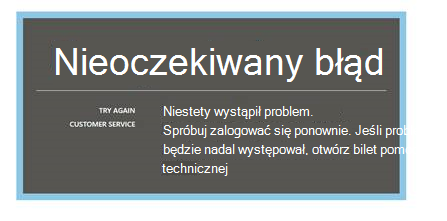
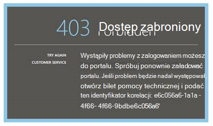
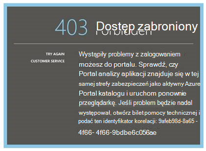
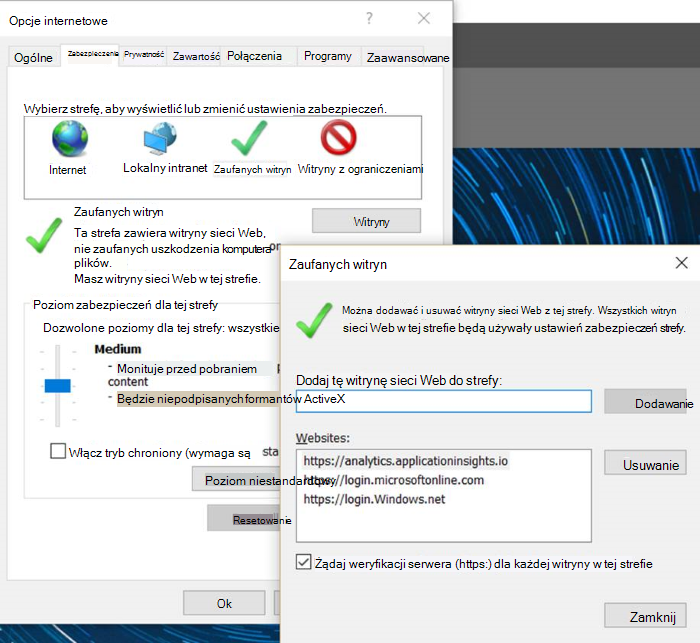
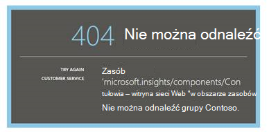
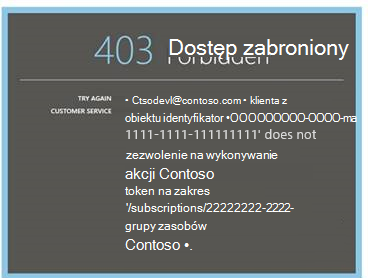
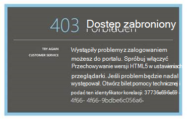
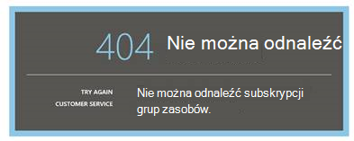
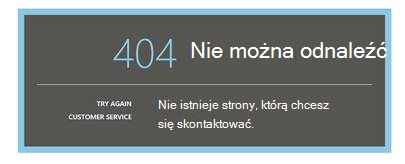

<properties 
    pageTitle="Rozwiązywanie problemów z analizy — narzędzie zaawansowane wyszukiwanie wniosków aplikacji | Microsoft Azure" 
    description="Problemy z analizy wniosków aplikacji? Rozpocznij tutaj. " 
    services="application-insights" 
    documentationCenter=""
    authors="alancameronwills" 
    manager="douge"/>

<tags 
    ms.service="application-insights" 
    ms.workload="tbd" 
    ms.tgt_pltfrm="ibiza" 
    ms.devlang="na" 
    ms.topic="article" 
    ms.date="07/11/2016" 
    ms.author="awills"/>

# Rozwiązywanie problemów z analizy w aplikacji wniosków

Problemy z [analizy wniosków aplikacji](app-insights-analytics.md)? Rozpocznij tutaj. Analizy to narzędzie zaawansowana usługa wyszukiwania programu Visual Studio aplikacji wnioski.

## Ograniczenia

* Obecnie wyniki kwerendy są ograniczone do tylko na tydzień poprzednie dane.
* Przeglądarki testowania na: najnowszej wersji programu Chrome, krawędź i Internet Explorer.

## Rozszerzenia znanych niezgodny przeglądarki

* Ghostery

Wyłącz rozszerzenia lub używanie innej przeglądarki.

##"Nieoczekiwany błąd"

Wystąpił błąd wewnętrzny podczas wykonywania portalu — nieobsługiwanego wyjątku.

* Wyczyść pamięć podręczną w przeglądarce. 

## 403... Spróbuj ponownie załadować

Wystąpił błąd (podczas uwierzytelniania lub podczas generowania token dostępu) związanych z uwierzytelniania. Portalu może być nie można odzyskać bez zmieniania ustawień przeglądarki.

* Sprawdź [pliki cookie innych firm są włączone](#cookies) w przeglądarce. 

## 403... Sprawdź strefy zabezpieczeń

Wystąpił błąd (podczas uwierzytelniania lub podczas generowania token dostępu) związanych z uwierzytelniania. Portalu może być nie można odzyskać bez zmieniania ustawień przeglądarki.

1. Sprawdź [pliki cookie innych firm są włączone](#cookies) w przeglądarce. 

2. Aby otworzyć portal analizy czy używać Ulubione, zakładki lub zapisane łącze? Zalogowani przy użyciu innych poświadczeń niż używanego przy zapisywaniu łącze?

2. Spróbuj użyć okna przeglądarki w prywatny incognito (po zamknięciu takiego systemu windows). Musisz podać poświadczenia. 

2. Otwórz inne okno przeglądarki (zwykłych) i przejdź do [Azure](https://portal.azure.com). Wyloguj się. Następnie otwórz łącze i zaloguj się przy użyciu poprawnych poświadczeń.

2. Użytkownicy krawędzi i programu Internet Explorer można również uzyskać ten błąd, gdy ustawienia strefy Zaufane nie są obsługiwane.

    Sprawdź zarówno w [portalu analizy](https://analytics.applicationinsights.io) , jak i w [portalu usługi Azure Active Directory](https://portal.azure.com) są w tej samej strefie zabezpieczeń:

 * W programie Internet Explorer Otwórz **Opcje internetowe**, **Zabezpieczenia**, **witryn zaufanych** **witryn**:

    

    Na liście witryn sieci Web Jeśli dowolny z następujących adresów URL są włączone, upewnij się, że inne są uwzględniane:

    https://Analytics.applicationinsights.IO 
   https://login.microsoftonline.com 
   https://login.Windows.NET

## 404... Nie można odnaleźć zasobu

Zasób aplikacji został usunięty z wniosków aplikacji i nie jest już dostępna. To może się zdarzyć, jeśli został zapisany adres URL strony analizy.

## 403... Nie autoryzacji

Nie masz uprawnień, aby otworzyć tę aplikację do analizy.

* Czy możesz wyświetlić łącze z innej osoby? Poproś ich, aby upewnić się, że jest [czytników lub współautorów dla tej grupy zasobów](app-insights-resources-roles-access-control.md).
* Czy zapisywać łącza przy użyciu innych poświadczeń? Otwórz [Azure portal](https://portal.azure.com), wyloguj się, a następnie spróbuj to łącze, dostarczając poprawnych poświadczeń.

## 403... Magazyn HTML5

Portalu używa HTML5 localStorage i sessionStorage.

* Chrome: Ustawienia prywatności ustawienia treści.
* Internet Explorer: Opcje internetowe, kartę Zaawansowane i zabezpieczeń, Włącz przechowywanie dom.

## 404... Nie odnaleziono subskrypcji

Adres URL jest nieprawidłowy. 

* Otwórz zasób aplikacji w [portalu wniosków aplikacji](https://portal.azure.com). Następnie za pomocą przycisku analizy.

## 404... strona nie istnieje

Adres URL jest nieprawidłowy.

* Otwórz zasób aplikacji w [portalu wniosków aplikacji](https://portal.azure.com). Następnie za pomocą przycisku analizy.

## Włączanie plików cookie innych firm

  Dowiedz się, [jak wyłączyć pliki cookie innych firm](http://www.digitalcitizen.life/how-disable-third-party-cookies-all-major-browsers), ale należy zauważyć, że trzeba **włączyć** je.

## Jeśli wszystkie inne kończy się niepowodzeniem    

[Kontakt z nami](app-insights-get-dev-support.md).
 
[AZURE.INCLUDE [app-insights-analytics-footer](../../includes/app-insights-analytics-footer.md)]

