<properties 
    pageTitle="Za pomocą analizy - narzędzie zaawansowana usługa wyszukiwania wniosków aplikacji | Microsoft Azure" 
    description="Za pomocą analizy, narzędzie diagnostyczne zaawansowana usługa wyszukiwania wniosków aplikacji. " 
    services="application-insights" 
    documentationCenter=""
    authors="danhadari" 
    manager="douge"/>

<tags 
    ms.service="application-insights" 
    ms.workload="tbd" 
    ms.tgt_pltfrm="ibiza" 
    ms.devlang="na" 
    ms.topic="article" 
    ms.date="10/21/2016" 
    ms.author="awills"/>

# Przy użyciu analizy w aplikacji wniosków

[Analiza](app-insights-analytics.md) jest funkcją zaawansowane wyszukiwanie [Wniosków aplikacji](app-insights-overview.md). Te strony opisują języka kwerend analizy.

* **[Obejrzyj klip wideo wprowadzenia](https://applicationanalytics-media.azureedge.net/home_page_video.mp4)**.
* **[Testowanie analizy w naszych danych symulowany](https://analytics.applicationinsights.io/demo)** Jeśli aplikacji nie jest wysyłanie danych do aplikacji wniosków jeszcze.

## Otwieranie analizy

W aplikacji sieci domowej zasobu w wniosków aplikacji kliknij opcję analizy.

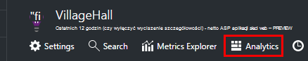

Samouczek w tekście umożliwia następujących wskazówek o tym, co można zrobić.

Ma [tutaj szerszej przewodnika](app-insights-analytics-tour.md).

## Kwerenda z telemetrycznego

### Napisać kwerendę

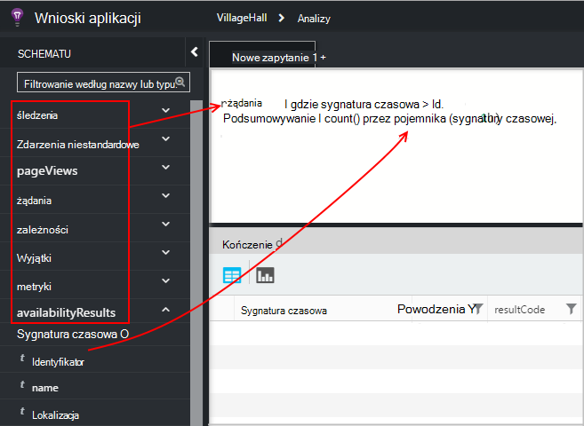

Nazwy zaczynają się od nazwy tabel, na liście po lewej stronie (lub operatory [zakresu](app-insights-analytics-reference.md#range-operator) lub [Unii](app-insights-analytics-reference.md#union-operator) ). Używanie `|` Aby utworzyć potok [operatorów](app-insights-analytics-reference.md#queries-and-operators). IntelliSense zostanie wyświetlony monit z operatorów i niektóre elementy wyrażenia, które są dostępne.

Zobacz [Omówienie języka analizy](app-insights-analytics-tour.md) i [Dokumentacja języka](app-insights-analytics-reference.md).

### Uruchamianie kwerendy

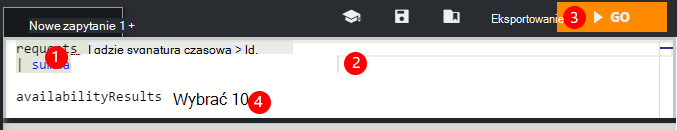

1. Za pomocą pojedynczego podziałów w kwerendzie.
2. Umieść kursor w organizacji lub na końcu kwerendy, którą chcesz uruchomić.
3. Kliknij przycisk Przejdź, aby uruchomić kwerendę.
4. Nie umieszczaj pustych wierszy w kwerendzie. Kilka oddzielnych kwerendy można przechowywać w jedną kartę kwerendy, oddzielając je przy użyciu pustych wierszy. Działa tylko jeden z kursorem.

### Zapisz kwerendę

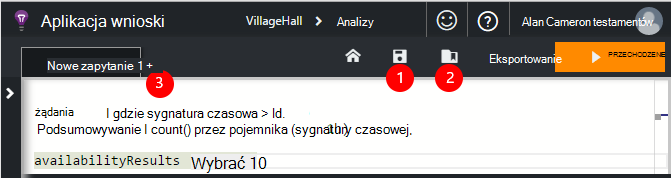

1. Zapisywanie bieżącego pliku kwerendy.
2. Otwieranie pliku zapisanego zapytania.
3. Tworzenie nowego pliku kwerendy.

## Zobacz szczegóły

Rozwiń węzeł dowolnego wiersza w wynikach, aby wyświetlić jego pełną listę właściwości. Dodatkowo można rozwinąć dowolną właściwość, która jest wartością strukturalnymi — na przykład, niestandardowe wymiary lub stos w wyjątek.

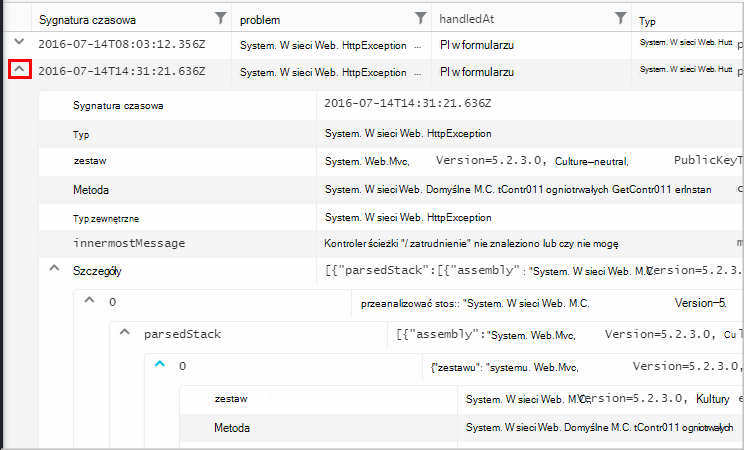

 

## Rozmieszczenie wyników

Czy sortowania, filtrowania, podzielony na strony i wyniki zwrócone przez kwerendę grupy.

> [AZURE.NOTE] Sortowania, grupowania i filtrowania w przeglądarce nie ponownie uruchom zapytanie. Tylko zmienić ich rozmieszczenie wyniki zwrócone przez kwerendę ostatniej. 
> 
> Do wykonywania następujących zadań na serwerze, zanim wyniki są zwracane, napisz kwerendy przy użyciu operatorów [Sortowanie](app-insights-analytics-reference.md#sort-operator), [podsumowywanie](app-insights-analytics-reference.md#summarize-operator) i [gdzie](app-insights-analytics-reference.md#where-operator) .

Wybierz kolumny, które chcesz wyświetlić, przeciągnij nagłówki kolumn, można zmienić ich rozmieszczenie i zmienianie rozmiaru kolumn, przeciągając ich obramowania.

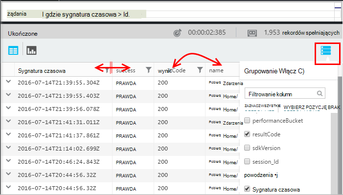

### Sortowanie i filtrowanie elementów

Sortować wyniki wyszukiwania, klikając pozycję nagłówka kolumny. Kliknij ponownie, aby posortować inny sposób, a następnie kliknij przycisk innej czasu, aby przywrócić oryginalny kolejnością zwrócone przez kwerendę.

Użyj ikonę filtru, aby zawęzić kryteria wyszukiwania.

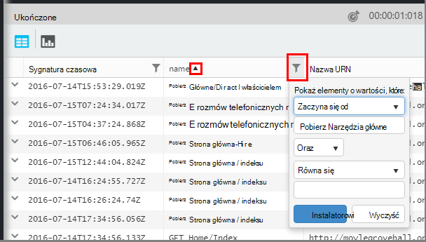

### Grupowanie elementów

Aby posortować dane według więcej niż jednej kolumny, należy użyć grupowania. Najpierw włączyć ją, a następnie przeciągnij nagłówków kolumn na miejsce nad tabelą.

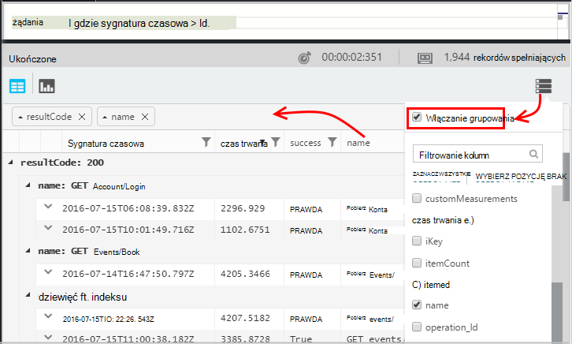

### Brakuje niektórych wyników?

Istnieje limit 10 wierszy k w wynikach z portalu. Ostrzeżenie pokazuje, czy migrować przekracza limit. W takim przypadku sortowania wyników w tabeli nie będzie zawsze pokazywać wszystkie rzeczywiste pierwszego lub ostatniego wyniki. 

Najlepiej unikać naciśnięcie limit. Użyj operatorów, takich jak:

* [miejsce, w którym sygnatura czasowa > ago(3d)](app-insights-analytics-reference.md#where-operator)
* [100 pierwszych przez sygnatura czasowa](app-insights-analytics-reference.md#top-operator) 
* [sporządzanie 100](app-insights-analytics-reference.md#take-operator)
* [Podsumowywanie](app-insights-analytics-reference.md#summarize-operator) 

## Diagramy

Wybierz typ diagramu, który chcesz:

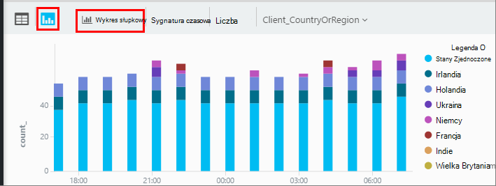

Jeśli masz kilka kolumn typów prawo, możesz wybrać x i y osie i kolumny wymiarów, aby podzielić wyniki według.

Domyślnie wyniki początkowo są wyświetlane jako tabelę, a następnie wybierz diagram ręcznie. Ale umożliwia [renderowania dyrektywy](app-insights-analytics-reference.md#render-directive) na końcu kwerendy Wybierz diagramu.

## Przypinanie do pulpitu nawigacyjnego

Można przypiąć diagramu lub tabelę do jednego z [udostępnionych pulpitów nawigacyjnych](app-insights-dashboards.md) - tylko kliknij numer pin. (Użytkownik może być konieczne do [uaktualnienia aplikacji jest ceny pakiet](app-insights-pricing.md) włączyć tę funkcję.) 

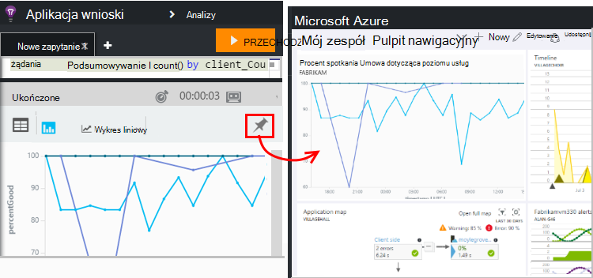

Oznacza to, że po umieszczeniu razem pulpitu nawigacyjnego ułatwiające monitorowanie wydajności i użycia usług sieci web, mogą zawierać dość złożone analizy wraz z innymi wskaźnikami. 

Tabela na pulpicie nawigacyjnym można przypiąć, jeśli został czterech kolumn. Pierwszych siedem wierszy są wyświetlane.

#### Odświeżanie pulpitu nawigacyjnego

Wykres przypięta do pulpitu nawigacyjnego są odświeżane automatycznie przy ponownym uruchomieniem kwerendy około co pół godziny.

#### Automatyczne uproszczenia

W niektórych przypadkach niektóre uproszczenia są stosowane do wykresu przypięcie do pulpitu nawigacyjnego.

Gdy pin wykresu, który zawiera wiele osobne przedziałów (zwykle wykresu słupkowego) przedziały mniej wypełnione automatycznie są pogrupowane w jednym przedziału "inne". Na przykład poniższe zapytanie:

    requests | summarize count_search = count() by client_CountryOrRegion

wygląda następująco w analizy:

ale po przypiąć go do pulpitu nawigacyjnego, wygląda następująco:

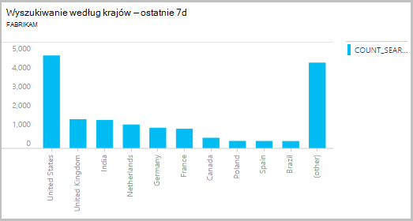

## Eksportowanie do programu Excel

Po uruchomieniu kwerendy, możesz pobrać pliku CSV. Kliknij przycisk **Eksportuj do programu Excel**.

## Eksportowanie do usługi Power BI

Umieść kursor w kwerendzie, a następnie wybierz pozycję **Eksportuj do usługi Power BI**.

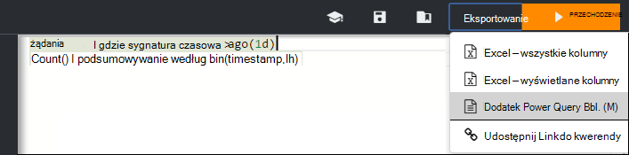

Kwerenda w usłudze Power BI. Można ustawić go, aby odświeżyć zgodnie z harmonogramem.

Dzięki usłudze Power BI można tworzyć pulpity nawigacyjne, które umożliwiają powiązanie danych z wielu różnych źródeł.

[Dowiedz się więcej o Eksportuj do usługi Power BI](app-insights-export-power-bi.md)

[AZURE.INCLUDE [app-insights-analytics-footer](../../includes/app-insights-analytics-footer.md)]

