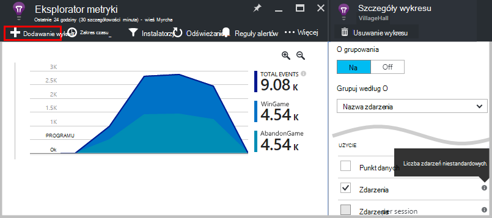
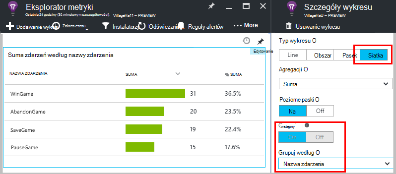
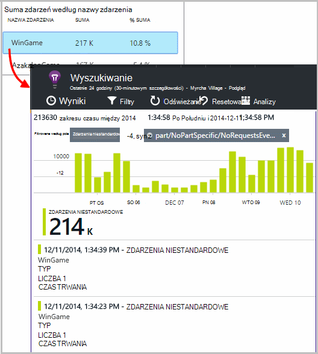
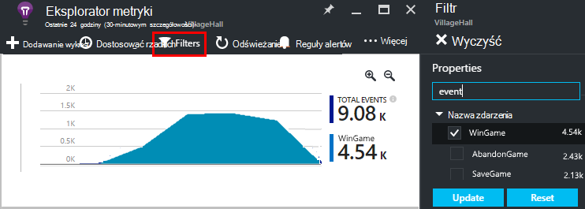
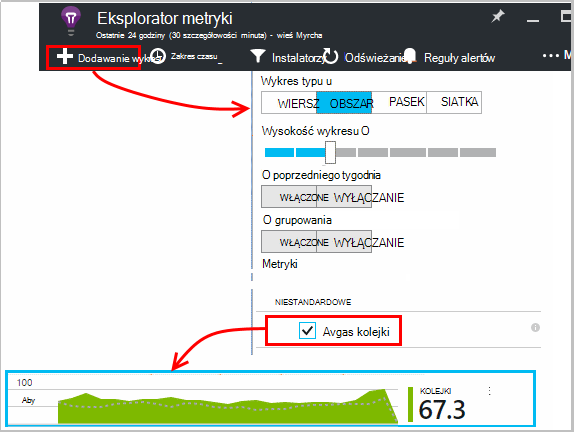
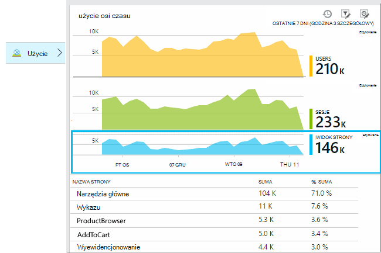
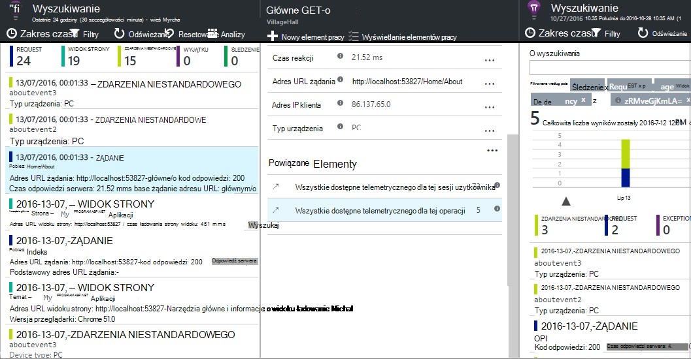
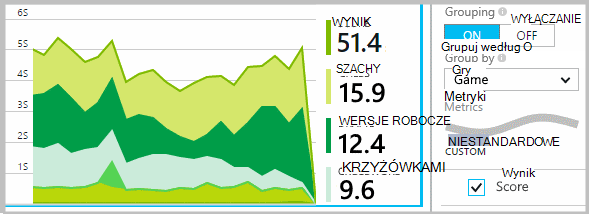
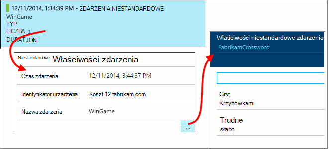
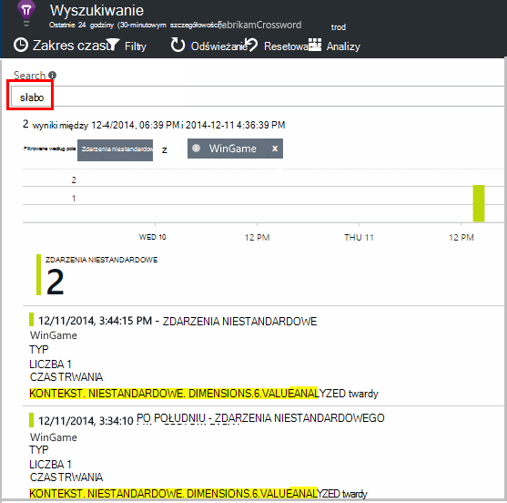

<properties 
    pageTitle="Interfejs API wniosków aplikacji dla zdarzenia niestandardowe i wskaźniki | Microsoft Azure" 
    description="Wstawianie kilka wierszy kodu w aplikacji urządzenia lub pulpitu, strony sieci web lub usługi, śledzenie użycia i diagnozowanie problemów." 
    services="application-insights"
    documentationCenter="" 
    authors="alancameronwills" 
    manager="douge"/>
 
<tags 
    ms.service="application-insights" 
    ms.workload="tbd" 
    ms.tgt_pltfrm="ibiza" 
    ms.devlang="multiple" 
    ms.topic="article" 
    ms.date="10/19/2016" 
    ms.author="awills"/>

# <a name="application-insights-api-for-custom-events-and-metrics"></a>Interfejs API wniosków aplikacji dla zdarzenia niestandardowe i miar 

*Wnioski aplikacji jest w podglądzie.*

Wstawianie kilka wierszy kodu w aplikacji, aby dowiedzieć się, co robią użytkowników z nim lub diagnozowanie problemów. Możesz wysłać telemetrycznego z urządzenia i aplikacji klasycznych, klienci sieci web i serwerów sieci web. Telemetrycznego core [Visual Studio aplikacji wniosków](app-insights-overview.md) interfejsu API pozwala wysyłać zdarzenia niestandardowe i metryki i własnej wersji standardowej telemetrycznego. Ten interfejs API jest tego samego interfejsu API jest używana przez standardowy zbierających dane aplikacji wnioski.

## <a name="api-summary"></a>Podsumowanie interfejsu API

Interfejs API jest stała na wszystkich platformach, z wyjątkiem kilku małe zmiany.

Metoda | Na potrzeby
---|---
[`TrackPageView`](#page-views) | Stron, monitorów, karty lub formularzy
[`TrackEvent`](#track-event) | Akcje użytkownika i inne zdarzenia. Używane do śledzenia zachowanie użytkownika lub monitorowanie wydajności.
[`TrackMetric`](#track-metric) | Pomiary wydajności, takich jak długości kolejki nie związane z określonych zdarzeń
[`TrackException`](#track-exception)|Wyjątki dzienników diagnostycznych. Śledzenie miejsce, w którym występują inne zdarzenia oraz sprawdzenie śledzenia stosu.
[`TrackRequest`](#track-request)| Zaloguj się, częstotliwość i czas trwania żądania serwera analizy wydajności.
[`TrackTrace`](#track-trace)|Wiadomości w dzienniku diagnostycznym. Można także przechwycić dzienniki 3rd firm.
[`TrackDependency`](#track-dependency)|Zaloguj się, czas trwania i częstotliwość połączeń składników zewnętrznych, od których zależy aplikacji.

Możesz [dołączyć właściwości i metryk](#properties) do większości telefonów telemetrycznego. 


## <a name="prep"></a>Przed rozpoczęciem

Jeśli nie są jeszcze:

* Dodawanie SDK wniosków aplikacji do projektu:
 * [Projekt programu ASP.NET][greenbrown]
 * [Projekt języka Java][java] 
 * [Język JavaScript w każdej strony sieci web][client]   

* W kodzie serwer sieci web lub urządzenie obejmują:

    *C#:*`using Microsoft.ApplicationInsights;`

    *VB:*`Imports Microsoft.ApplicationInsights`

    *Java:*`import com.microsoft.applicationinsights.TelemetryClient;`

## <a name="construct-a-telemetryclient"></a>Konstruowanie TelemetryClient

Skonstruować wystąpienia TelemetryClient (z wyjątkiem kodu JavaScript na stronach sieci web):

*C#:* 

    private TelemetryClient telemetry = new TelemetryClient();

*VB:* 

    Private Dim telemetry As New TelemetryClient

*Java*

    private TelemetryClient telemetry = new TelemetryClient();

TelemetryClient jest bezpieczne wątku.

Firma Microsoft zaleca używanie wystąpienie `TelemetryClient` dla każdego modułu aplikacji. Na przykład możesz napotkać `TelemetryClient` w danej usługi sieci web, aby zgłosić przychodzących żądań http, a drugi w klasie pośredniczącym z zdarzeń logiczny biznesowych raportu. Można ustawić właściwości, takie jak `TelemetryClient.Context.User.Id` do śledzenia użytkowników i sesji, lub `TelemetryClient.Context.Device.Id` do identyfikowania komputera. Te informacje dołączony do wszystkich zdarzeń wysyłane przez wystąpienie.


## <a name="track-event"></a>Śledzenie zdarzeń

W aplikacji wniosków, *zdarzenia niestandardowego* jest punkt danych, czy możesz wyświetlić zarówno w [Eksploratorze metryki] [ metrics] jako zagregowane liczba, a także jako pojedyncze wystąpienia w [Wyszukiwaniu diagnostyczne][diagnostic]. (Nie jest nim związany z MVC lub innych framework "zdarzenia.") 

Wstawianie TrackEvent połączenia w kodzie do zliczania, ile razy użytkownikom wybrać poszczególnych funkcji, jak często są osiągnięciu określonego celów, lub być może utworzyć określonych typów błąd. 

Na przykład w aplikacji dla gry wysłać zdarzenia, gdy użytkownik wygrywa ten: 

*Języka JavaScript*

    appInsights.trackEvent("WinGame");

*C#*
    
    telemetry.TrackEvent("WinGame");

*VB*


    telemetry.TrackEvent("WinGame")

*Java*

    telemetry.trackEvent("WinGame");


### <a name="view-your-events-in-the-azure-portal"></a>Wyświetlanie zdarzeń w portalu Azure

Aby wyświetlić liczbę zdarzeń, otwórz karta [Eksploratora metryczne](app-insights-metrics-explorer.md) , dodawanie nowego wykresu, a następnie wybierz zdarzenia.  



Aby porównać liczby różnych zdarzeń, należy ustawić typ wykresu do siatki i grupy, Nazwa zdarzenia:




Na siatce kliknij nazwę zdarzenia, aby wyświetlić poszczególne wystąpienia tego zdarzenia.



Kliknij dowolne wystąpienie, aby wyświetlić więcej szczegółów.

Skoncentrować się na określonych zdarzeń za pomocą wyszukiwania lub Eksploratora metryczne, ustaw filtr karta do nazw zdarzeń, które Cię interesują:



## <a name="track-metric"></a>Metryka śledzenia

Umożliwia wysłanie metryk, które nie są dołączone do wybranych zdarzeń TrackMetric. Na przykład można monitorować długość kolejki w regularnych odstępach czasu. 

Wskaźniki są wyświetlane jako wykresy statystyczne w Eksploratorze metryczne, ale w przeciwieństwie do zdarzenia, nie można wyszukiwać poszczególnych wystąpień w wyszukiwaniu diagnostyczne.

Metryka wartości powinny być > = 0, które mają być wyświetlane poprawnie.


*Języka JavaScript*

    appInsights.trackMetric("Queue", queue.Length);

*C#*

    telemetry.TrackMetric("Queue", queue.Length);

*VB*

    telemetry.TrackMetric("Queue", queue.Length)

*Java*

    telemetry.trackMetric("Queue", queue.Length);

W rzeczywistości może to zrobić w wątku tła:

*C#*

    private void Run() {
     var appInsights = new TelemetryClient();
     while (true) {
      Thread.Sleep(60000);
      appInsights.TrackMetric("Queue", queue.Length);
     }
    }


Aby wyświetlić wyniki, otwórz Eksploratora metryki i dodawanie nowego wykresu. Ustaw ją, aby wyświetlić usługi metryki.



Istnieją pewne [ograniczenia dotyczące liczby metryki](#limits) , których można używać.

## <a name="page-views"></a>Liczba wyświetleń strony

Na urządzeniu lub strony sieci web app telemetrycznego widoku strony są wysyłane domyślnie po załadowaniu każdego ekranu lub strony. Ale można zmienić to do śledzenia wyświetleń stron w czasie dodatkowych lub innych. Na przykład w aplikacji, której są wyświetlane karty lub karty, może być do śledzenia "strony", gdy użytkownik otwiera nowy karta. 



Użytkownik i sesja dane są przesyłane jako właściwości oraz liczbę wyświetleń stron, więc wykresów użytkownik i sesja pochodzić aktywności po stronie widoku telemetrycznego.

#### <a name="custom-page-views"></a>Widoki niestandardowe strony

*Języka JavaScript*

    appInsights.trackPageView("tab1");

*C#*

    telemetry.TrackPageView("GameReviewPage");

*VB*

    telemetry.TrackPageView("GameReviewPage")


Jeśli masz kilka kart w różnych stron HTML, można określić adres URL zbyt:

    appInsights.trackPageView("tab1", "http://fabrikam.com/page1.htm");

#### <a name="timing-page-views"></a>Liczba wyświetleń strony chronometraż

Domyślnie czasu zgłoszone jako "Strony widoku Obciążenie time" są mierzone od po przeglądarce przesyła żądanie, aż nosi nazwę zdarzenia ładowania strony w przeglądarce.

Zamiast tego możesz:

* Ustaw jawne czas trwania w ramach połączenia [trackPageView](https://github.com/Microsoft/ApplicationInsights-JS/blob/master/API-reference.md#trackpageview) .
 * `appInsights.trackPageView("tab1", null, null, null, durationInMilliseconds);`
* Korzystanie z widoku strony chronometrażu połączenia `startTrackPage` i `stopTrackPage`.

*Języka JavaScript*

    // To start timing a page:
    appInsights.startTrackPage("Page1");

... 

    // To stop timing and log the page:
    appInsights.stopTrackPage("Page1", url, properties, measurements);

Nazwa służy jako pierwszy parametr kojarzy połączeń rozpoczęcia i zakończenia. Domyślnie nazwa bieżącej strony. 

Otrzymane strony ładowania czasy trwania są wyświetlane w Eksploratorze metryki pochodzą z interwał między połączeń rozpoczęcia i zakończenia. Jest możesz jakie interwał czasu rzeczywistego.

## <a name="track-request"></a>Żądanie śledzenia

Używany przez serwer SDK, aby rejestrować żądania HTTP. 

Można również wywołać go samodzielnie aby symulować żądania w kontekście miejsce, w którym nie masz uruchomione modułu usługi sieci web.

*C#*

    // At start of processing this request:

    // Operation Id and Name are attached to all telemetry and help you identify
    // telemetry associated with one request:
    telemetry.Context.Operation.Id = Guid.NewGuid().ToString();
    telemetry.Context.Operation.Name = requestName;
    
    var stopwatch = System.Diagnostics.Stopwatch.StartNew();

    // ... process the request ...

    stopwatch.Stop();
    telemetry.TrackRequest(requestName, DateTime.Now,
       stopwatch.Elapsed, 
       "200", true);  // Response code, success


## <a name="operation-context"></a>Kontekst operacji

Elementy telemetrycznego można skojarzone ze sobą dołączając do nich identyfikatora typowych operacji Żądanie standardowego śledzenia modułu powinien się tym zająć wyjątki i inne zdarzenia wysłane podczas przetwarzania żądania HTTP. Za pomocą identyfikator łatwo znaleźć wszystkie zdarzenia związane z żądaniem, [wyszukiwania](app-insights-diagnostic-search.md) i [analizy](app-insights-analytics.md). 

Najprostszym sposobem ustawienia identyfikator jest Ustaw kontekst operacji za pomocą tego wzorca:

    // Establish an operation context and associated telemetry item:
    using (var operation = telemetry.StartOperation<RequestTelemetry>("operationName"))
    {
        // Telemetry sent in here will use the same operation ID.
        ...
        telemetry.TrackEvent(...); // or other Track* calls
        ...
        // Set properties of containing telemetry item - for example:
        operation.Telemetry.ResponseCode = "200";
        
        // Optional: explicitly send telemetry item:
        telemetry.StopOperation(operation);

    } // When operation is disposed, telemetry item is sent.

Oraz ustawiania kontekstu operacji `StartOperation` umożliwia utworzenie elementu telemetrycznego typu i przesyła podczas usuwania operacji lub jawnie wywołać `StopOperation`. Jeśli korzystasz z `RequestTelemetry` jako typ telemetrycznego to jego czasu trwania ma wartość czasowy interwał między rozpoczęcia i zakończenia.

Nie można zagnieżdżać konteksty operacji. Jeśli jest już kontekście operacji, Identyfikatora jest skojarzony z wszystkich zawartych elementów, w tym elemencie utworzone za pomocą StartOperation.

W polu Wyszukaj kontekst operacji służy do tworzenia listy powiązanych elementów:




## <a name="track-exception"></a>Śledzenie wyjątku

Wysyłanie wyjątki do aplikacji wniosków: [zliczyć][metrics], jako wskazanie częstotliwości problemu. i sprawdzenie [poszczególne wystąpienia][diagnostic]. Raporty zawierają śledzenia stosu.

*C#*

    try
    {
        ...
    }
    catch (Exception ex)
    {
       telemetry.TrackException(ex);
    }

*Języka JavaScript*

    try
    {
       ...
    }
    catch (ex)
    {
       appInsights.trackException(ex);
    }

SDK efektywnej wiele wyjątki automatycznie, dlatego zawsze nie masz połączenie TrackException jawnie.

* ASP.NET: [Pisanie kodu, aby przechwytywać wyjątków](app-insights-asp-net-exceptions.md)
* J2EE: [Wyjątki są automatycznie otrzymanych](app-insights-java-get-started.md#exceptions-and-request-failures)
* JavaScript: Przechwytywanych automatycznie. Jeśli chcesz wyłączyć automatyczne zbioru, należy dodać wiersz do wstawkę kodu, który ma być wstawiony na stronach sieci web:

    ```
    ({
      instrumentationKey: "your key"
      , disableExceptionTracking: true
    })
    ```


## <a name="track-trace"></a>Śledzenie śledzenia 

Umożliwia diagnozowanie problemów, wysyłając dziennik łącza do stron nadrzędnych do wniosków aplikacji. Wysyłanie dużych ilości danych diagnostyczne i sprawdzanie ich w [wyszukiwaniu diagnostyczne][diagnostic]. 

 

[Zaloguj się karty] [ trace] Użyj tego interfejsu API, aby wysłać dzienniki innych firm do portalu.


*C#*

    telemetry.TrackTrace(message, SeverityLevel.Warning, properties);


Możliwość wyszukiwania w treści wiadomości, ale (w przeciwieństwie do wartości właściwości) nie można filtrować go.

Limit rozmiaru plików na `message` jest dużo większe niż limit właściwości.
Zaletą TrackTrace to, że stosunkowo długich danych można umieścić w wiadomości. Można na przykład kodowanie danych wpisu.  


Ponadto możesz dodać poziom ważności do wiadomości. I, takich jak inne telemetrycznego można dodawać wartości właściwości, które służy do filtrowania lub wyszukiwania dla różnych zestawów śledzenia. Na przykład:


    var telemetry = new Microsoft.ApplicationInsights.TelemetryClient();
    telemetry.TrackTrace("Slow database response",
                   SeverityLevel.Warning,
                   new Dictionary<string,string> { {"database", db.ID} });

Umożliwi, w [wyszukiwaniu][diagnostic], aby łatwo odfiltrowywania wszystkich wiadomości poziom ważności określonego odnoszących się do konkretnej bazy danych.

## <a name="track-dependency"></a>Śledź zależności

Za pomocą tego połączenia do śledzenia czasu odpowiedzi i stawki sukcesu połączenia do zewnętrznych fragment kodu. Wyniki zostaną wyświetlone na wykresach zależności w portalu. 

```C#

            var success = false;
            var startTime = DateTime.UtcNow;
            var timer = System.Diagnostics.Stopwatch.StartNew();
            try
            {
                success = dependency.Call();
            }
            finally
            {
                timer.Stop();
                telemetry.TrackDependency("myDependency", "myCall", startTime, timer.Elapsed, success);
            }
```

Należy pamiętać, że serwer SDK obejmują [moduł współzależności](app-insights-dependencies.md) , który zostanie odnaleziona i śledzenie niektórych współzależności wymaga automatycznie — na przykład do baz danych i interfejsów API pozostałych. Musisz zainstalować agenta na serwerze, aby moduł pracy. Jeśli chcesz śledzić połączenia, które nie są objęte automatycznego śledzenia lub jeśli nie chcesz, aby zainstalować agenta, należy użyć tego połączenia.

Aby wyłączyć moduł standardowy współzależności śledzenia, edytowanie [ApplicationInsights.config](app-insights-configuration-with-applicationinsights-config.md) i usuwanie odwołanie do `DependencyCollector.DependencyTrackingTelemetryModule`.


## <a name="flushing-data"></a>Opróżnianie danych

Zwykle zestawu SDK wysyła dane w czasie wybranym, aby zminimalizować wpływ na użytkownika. Jednak w niektórych przypadkach warto opróżnienie bufora — na przykład, jeśli korzystasz z zestawu SDK w aplikacji, która jest zamknięty.

*C#*

    telemetry.Flush();

    // Allow some time for flushing before shutdown.
    System.Threading.Thread.Sleep(1000);

Należy zauważyć, że funkcja asynchroniczne [serwera kanał telemetrycznego](https://www.nuget.org/packages/Microsoft.ApplicationInsights.WindowsServer.TelemetryChannel/), ale obraz, jeśli został wybrany do użycia w pamięci kanał lub [trwałych kanał](app-insights-api-filtering-sampling.md#persistence-channel).


## <a name="authenticated-users"></a>Uwierzytelnionych użytkowników

W aplikacji sieci web dla użytkowników są domyślnie oznaczane plików cookie. Użytkownik może być zliczane więcej niż jeden raz, jeśli dostęp do aplikacji na innym komputerze lub przeglądarki lub usunąć pliki cookie. 

Ale użytkownikom zalogować się do aplikacji, zostanie wyświetlony dokładniejszych informacji o zestawienia, ustawiając uwierzytelnionego użytkownika w kodzie przeglądarki:

*Języka JavaScript*

```JS
    // Called when my app has identified the user.
    function Authenticated(signInId) {
      var validatedId = signInId.replace(/[,;=| ]+/g, "_");
      appInsights.setAuthenticatedUserContext(validatedId);
      ...
    }
```

W sieci web programu ASP.NET aplikacji MVC, na przykład:

*Razor*

        @if (Request.IsAuthenticated)
        {
            <script>
                appInsights.setAuthenticatedUserContext("@User.Identity.Name
                   .Replace("\\", "\\\\")"
                   .replace(/[,;=| ]+/g, "_"));
            </script>
        }

Nie jest konieczne użycie rzeczywisty logowania nazwę użytkownika. Tylko ma być identyfikatora, który jest unikatowy dla tego użytkownika. Nie może zawierać spacji ani znaków `,;=|`. 

Identyfikator użytkownika jest również ustawić w cookie sesji i przesyłane do serwera. Jeśli serwer SDK jest zainstalowany, identyfikator użytkownika uwierzytelnionego zostanie wysłany jako część właściwości kontekstu telemetrycznego klienta i serwera, tak, aby można filtrować i wyszukiwać na nim.

Jeśli aplikacji grupy użytkowników do konta, można również przekazać identyfikator konta (z ograniczeniami znaków).


      appInsights.setAuthenticatedUserContext(validatedId, accountId);

W [Eksploratorze metryki](app-insights-metrics-explorer.md)można utworzyć wykres licząca **użytkowników, uwierzytelniony** i **kont użytkowników**. 

Możesz także [wyszukiwania] [ diagnostic] dla punktów danych klienta przy użyciu nazwy użytkownika i konta.

## <a name="properties"></a>Filtrowanie, wyszukiwanie i segmentu danych za pomocą właściwości

Możesz dołączyć do wydarzenia pomiary i właściwości (i również do miar, strony widoków, wyjątki i innych danych telemetrycznych).

**Właściwości** są ciągami, których można użyć do filtrowania z telemetrycznego w raporty użycia. Na przykład jeśli aplikacji udostępnia kilka gier, należy dołączyć nazwa gry do każdego zdarzenia, tak aby można zobaczyć, które gry są bardziej popularne. 

Istnieje ograniczenie około 1 KB na długość ciągu. (Jeśli chcesz wysłać dużych dużych ilości danych, użyj parametru wiadomości [TrackTrace](#track-trace)).

**Metryki** są wartościami liczbowymi, które mogą być prezentowane w formie graficznej. Na przykład można sprawdzić, czy jest oraz stopniowego zwiększania wyniki, które usługi gracze osiągnięcia. Wykresy może być rozdzielonych właściwości wysyłane ze zdarzeniem, tak, aby można pobrać osobnych lub skumulowane wykresy dla różnych gry.

Metryka wartości powinny być > = 0, które mają być wyświetlane poprawnie.


Istnieją pewne [ograniczenia liczby właściwości, wartości nieruchomości i miar](#limits) , którego można używać.


*Języka JavaScript*

    appInsights.trackEvent
      ("WinGame",
         // String properties:
         {Game: currentGame.name, Difficulty: currentGame.difficulty},
         // Numeric metrics:
         {Score: currentGame.score, Opponents: currentGame.opponentCount}
         );

    appInsights.trackPageView
        ("page name", "http://fabrikam.com/pageurl.html",
          // String properties:
         {Game: currentGame.name, Difficulty: currentGame.difficulty},
         // Numeric metrics:
         {Score: currentGame.score, Opponents: currentGame.opponentCount}
         );
          

*C#*

    // Set up some properties and metrics:
    var properties = new Dictionary <string, string> 
       {{"game", currentGame.Name}, {"difficulty", currentGame.Difficulty}};
    var metrics = new Dictionary <string, double>
       {{"Score", currentGame.Score}, {"Opponents", currentGame.OpponentCount}};

    // Send the event:
    telemetry.TrackEvent("WinGame", properties, metrics);


*VB*

    ' Set up some properties:
    Dim properties = New Dictionary (Of String, String)
    properties.Add("game", currentGame.Name)
    properties.Add("difficulty", currentGame.Difficulty)

    Dim metrics = New Dictionary (Of String, Double)
    metrics.Add("Score", currentGame.Score)
    metrics.Add("Opponents", currentGame.OpponentCount)

    ' Send the event:
    telemetry.TrackEvent("WinGame", properties, metrics)


*Java*
    
    Map<String, String> properties = new HashMap<String, String>();
    properties.put("game", currentGame.getName());
    properties.put("difficulty", currentGame.getDifficulty());
    
    Map<String, Double> metrics = new HashMap<String, Double>();
    metrics.put("Score", currentGame.getScore());
    metrics.put("Opponents", currentGame.getOpponentCount());
    
    telemetry.trackEvent("WinGame", properties, metrics);


> [AZURE.NOTE] Należy zadbać nie chcesz, aby rejestrować informacje osobiste we właściwościach.

**Użycie metryki**, otwórz Eksploratora jednostki metryczne i wybierz metrykę z grupy niestandardowej:


*Jeśli usługi Metryka nie jest wyświetlany lub niestandardowy nie ma tam, zamknij karta zaznaczenia i spróbuj później. Czasami może to trwać godziny dla metryki być zagregowana potoku.*

**Jeśli użyto właściwości i wskaźniki**, części metryki przez właściwość:





**W diagnostyczne wyszukiwania**, możesz wyświetlić właściwości i metryk poszczególne wystąpienia zdarzenia.





Użyj pola wyszukiwania, aby wyświetlić wystąpienia zdarzenia o wartości określonej właściwości.




[Dowiedz się więcej o wyrażeniach wyszukiwania][diagnostic].

#### <a name="alternative-way-to-set-properties-and-metrics"></a>Alternatywny sposobem ustawienia właściwości i miar

Jeśli wygodniej jest może zbierać parametry zdarzenia w osobnym obiektu:

    var event = new EventTelemetry();

    event.Name = "WinGame";
    event.Metrics["processingTime"] = stopwatch.Elapsed.TotalMilliseconds;
    event.Properties["game"] = currentGame.Name;
    event.Properties["difficulty"] = currentGame.Difficulty;
    event.Metrics["Score"] = currentGame.Score;
    event.Metrics["Opponents"] = currentGame.Opponents.Length;

    telemetry.TrackEvent(event);

> [AZURE.WARNING] Nie ponowne używanie tego samego wystąpienia elementu telemetrycznego (`event` w tym przykładzie) połączenie Track*() wielokrotnie. Może to powodować telemetrycznego do wysłania z niepoprawnej konfiguracji.


## <a name="timed"></a>Zdarzenia czasowe

Czasami chcesz wykresu, jak długo trwa wykonywanie określonej akcji. Na przykład może chcesz wiedzieć, jak długo użytkowników sporządzanie brać pod uwagę opcji w gry. To jest przydatne przykłady zastosowania parametru miary.


*C#*

    var stopwatch = System.Diagnostics.Stopwatch.StartNew();

    // ... perform the timed action ...

    stopwatch.Stop();

    var metrics = new Dictionary <string, double>
       {{"processingTime", stopwatch.Elapsed.TotalMilliseconds}};

    // Set up some properties:
    var properties = new Dictionary <string, string> 
       {{"signalSource", currentSignalSource.Name}};

    // Send the event:
    telemetry.TrackEvent("SignalProcessed", properties, metrics);


## <a name="defaults"></a>Domyślne właściwości niestandardowe telemetrycznego

Jeśli chcesz ustawić domyślne wartości właściwości dla niektórych niestandardowych zdarzeń, które można zapisać, możesz ustawić je w TelemetryClient. Są dołączone do wszystkich elementów telemetrycznego wysłanych z tego klienta. 

*C#*

    using Microsoft.ApplicationInsights.DataContracts;

    var gameTelemetry = new TelemetryClient();
    gameTelemetry.Context.Properties["Game"] = currentGame.Name;
    // Now all telemetry will automatically be sent with the context property:
    gameTelemetry.TrackEvent("WinGame");
    
*VB*

    Dim gameTelemetry = New TelemetryClient()
    gameTelemetry.Context.Properties("Game") = currentGame.Name
    ' Now all telemetry will automatically be sent with the context property:
    gameTelemetry.TrackEvent("WinGame")

*Java*

    import com.microsoft.applicationinsights.TelemetryClient;
    import com.microsoft.applicationinsights.TelemetryContext;
    ...


    TelemetryClient gameTelemetry = new TelemetryClient();
    TelemetryContext context = gameTelemetry.getContext();
    context.getProperties().put("Game", currentGame.Name);
    
    gameTelemetry.TrackEvent("WinGame");


    
Poszczególne telemetrycznego połączenia można zastąpić wartości domyślne w ich słowniki właściwości.

**Klienci sieci web dla języka JavaScript**, [za pomocą języka JavaScript telemetrycznego inicjatory](#js-initializer).

**Aby dodać właściwości do wszystkich telemetrycznego** wraz z danymi z modułów zbioru standard [zaimplementować `ITelemetryInitializer` ](app-insights-api-filtering-sampling.md#add-properties).


## <a name="sampling-filtering-and-processing-telemetry"></a>Próbki, filtrowania i przetwarzanie danych telemetrycznych 

Można wpisać kod przetwarzania Twojej telemetrycznego przed wysłaniem z zestawu SDK. Przetwarzanie obejmuje wysyłany przez moduł standardowy telemetrycznego takich jak zbioru żądania HTTP i współzależności zbioru danych.

* [Dodaj właściwości](app-insights-api-filtering-sampling.md#add-properties) do telemetrycznego Wdrażając `ITelemetryInitializer` — na przykład, aby dodać wersję numerów lub wartości obliczana na podstawie innych właściwości. 
* [Filtrowanie](app-insights-api-filtering-sampling.md#filtering) można zmodyfikować lub odrzucić telemetrycznego przed wysłaniem z zestawu SDK z zastosowaniem `ITelemetryProcesor`. Sterowanie co to jest wysyłana lub odrzucane, ale należy wziąć pod uwagę wpływ na użytkownika metryki. W zależności od tego, jak zostaną odrzucone elementów możesz utracić umożliwia przechodzenie między elementami pokrewnymi.
* [Próbki](app-insights-api-filtering-sampling.md#sampling) jest rozwiązaniem detaliczny w celu zmniejszenia ilości danych wysłanych z aplikacji do portalu. Robi to bez wpływu na wyświetlonej metryki i bez wpływu na możliwość diagnozowanie problemów przez nawigowanie między powiązanych elementów takich jak wyjątków, żądania i liczba wyświetleń strony.

[Dowiedz się więcej](app-insights-api-filtering-sampling.md)


## <a name="disabling-telemetry"></a>Wyłączanie telemetrycznego

Aby **dynamicznie zatrzymać i uruchomić** pobranie i przenoszenie telemetrycznego:

*C#*

```C#

    using  Microsoft.ApplicationInsights.Extensibility;

    TelemetryConfiguration.Active.DisableTelemetry = true;
```

**Wyłączanie wybranych zbierających standardowy** — na przykład liczniki wydajności, żądania HTTP lub zależności — usuwanie lub komentarz w odpowiednich pozycjach [ApplicationInsights.config][config]. Można w tym, na przykład, jeśli chcesz wysłać danych TrackRequest.

## <a name="debug"></a>Tryb dewelopera

Podczas debugowania, warto mieć usługi telemetrycznego przyspieszona potoku, tak aby można od razu zobaczyć wyniki. Możesz również te dodatkowe wiadomości get, które ułatwiają śledzenie problemów z telemetrycznego. Wyłącz go w produkcji, jak może spowolnić aplikacji.


*C#*
    
    TelemetryConfiguration.Active.TelemetryChannel.DeveloperMode = true;

*VB*

    TelemetryConfiguration.Active.TelemetryChannel.DeveloperMode = True


## <a name="ikey"></a>Ustawianie klucza oprzyrządowania dla wybranego telemetrycznego niestandardowych

*C#*
    
    var telemetry = new TelemetryClient();
    telemetry.InstrumentationKey = "---my key---";
    // ...


## <a name="dynamic-ikey"></a>Dynamiczne oprzyrządowania klucza

Aby uniknąć mieszanie w górę telemetrycznego z rozwoju, testowanie i produkcji, możesz [utworzyć osobne zasobów wniosków aplikacji] [ create] i zmień swój klucz w zależności od środowiska.

Zamiast wprowadzenie klucza oprzyrządowania z pliku konfiguracji, można ustawić go w kodzie. Ustaw klucz metody inicjowania, takich jak global.aspx.cs w usłudze ASP.NET:

*C#*

    protected void Application_Start()
    {
      Microsoft.ApplicationInsights.Extensibility.
        TelemetryConfiguration.Active.InstrumentationKey = 
          // - for example -
          WebConfigurationManager.Settings["ikey"];
      ...

*Języka JavaScript*

    appInsights.config.instrumentationKey = myKey; 


Na stronach sieci web można ustawić go z serwerem sieci web stan zamiast go dosłownie kodowania do skrypt. Na przykład na stronie sieci web wygenerowane w aplikacji programu ASP.NET:

*Język JavaScript w Razor*

    <script type="text/javascript">
    // Standard Application Insights web page script:
    var appInsights = window.appInsights || function(config){ ...
    // Modify this part:
    }({instrumentationKey:  
      // Generate from server property:
      @Microsoft.ApplicationInsights.Extensibility.
         TelemetryConfiguration.Active.InstrumentationKey"
    }) // ...


## <a name="telemetrycontext"></a>TelemetryContext

TelemetryClient zawiera właściwości kontekstu, która zawiera wartości, które są wysyłane wraz z wszystkich danych telemetrycznych. Zazwyczaj są ustawione przez moduł standardowy telemetrycznego, ale można także ustawić je samodzielnie. Na przykład:

    telemetry.Context.Operation.Name = "MyOperationName";

Jeśli dowolny z tych wartości samodzielnie, należy rozważyć, czy usuwanie odpowiedni wiersz z [ApplicationInsights.config][config], tak aby nie uzyskać mylić wartości i wartości domyślnych.

* **Składnik** Identyfikuje aplikację i jej wersję
* **Urządzenie** Dane dotyczące urządzenia, na którym jest uruchomiona aplikacja (w aplikacjach sieci web jest to urządzenie serwera lub klienta, z którego jest wysyłana telemetrycznego)
* **InstrumentationKey** Służy do identyfikowania zasobu aplikacji wniosków w miejsce, w którym są wyświetlane telemetrycznego Azure. Zazwyczaj pobierane z ApplicationInsights.config
* **Lokalizacja** Określa lokalizację geograficzną urządzenia.
* **Operacja** W aplikacjach sieci web bieżącego żądania HTTP. W przypadku innych typów aplikacji można ustawić to zdarzeń grupy razem.
 * **Identyfikator**: wygenerowane wartość odpowiadająca różnych zdarzeń, tak aby inspekcji zdarzenie w wyszukiwaniu diagnostyczne można znaleźć "powiązane z nimi elementy"
 * **Nazwa**: identyfikator zazwyczaj adres URL żądania HTTP. 
 * **SyntheticSource**: Jeśli nie zawiera wartości null lub jest pusty, ten ciąg wskazuje, że wykryto źródła żądania jako test robot lub sieci web. Domyślnie zostaną wykluczone z obliczeń w Eksploratorze metryki.
* **Właściwości** Właściwości, które są wysyłane z wszystkich danych telemetrycznych. Można zastąpić w poszczególnych śledzenia * połączeń.
* **Sesji** Służy do identyfikowania sesji użytkownika. Identyfikator jest ustawiona na wartość wygenerowanych zostanie zmieniony, gdy użytkownik nie była aktywna przez pewien czas.
* **Użytkownika** Informacje o użytkowniku. 

## <a name="limits"></a>Ograniczenia


[AZURE.INCLUDE [application-insights-limits](../../includes/application-insights-limits.md)]

*Jak można uniknąć, naciśnięcie limit szybkości danych?*

* Za pomocą [próbki](app-insights-sampling.md).

*Jak długo są przechowywane dane?*

* Zobacz [przechowywanie danych i prywatności][data].


## <a name="reference-docs"></a>Odwołanie dokumentów

* [Programu ASP.NET](https://msdn.microsoft.com/library/dn817570.aspx)
* [Odwołanie języka Java](http://dl.windowsazure.com/applicationinsights/javadoc/)
* [Odwołanie języka JavaScript](https://github.com/Microsoft/ApplicationInsights-JS/blob/master/API-reference.md)
* [Zestaw SDK systemu android](https://github.com/Microsoft/ApplicationInsights-Android)
* [iOS SDK](https://github.com/Microsoft/ApplicationInsights-iOS)


## <a name="sdk-code"></a>Kod SDK

* [Podstawowe ASP.NET SDK](https://github.com/Microsoft/ApplicationInsights-dotnet)
* [5 PROGRAMU ASP.NET](https://github.com/Microsoft/ApplicationInsights-aspnet5)
* [Pakiety systemu Windows Server](https://github.com/Microsoft/applicationInsights-dotnet-server)
* [Java SDK](https://github.com/Microsoft/ApplicationInsights-Java)
* [Zestaw SDK języka JavaScript](https://github.com/Microsoft/ApplicationInsights-JS)
* [Wszystkie platformy](https://github.com/Microsoft?utf8=%E2%9C%93&query=applicationInsights)

## <a name="questions"></a>Pytania

* *Jakie wyjątki Zgłoś mogą Track_() połączeń*
    
    Brak. Nie musisz zawijanie je w klauzule efektywnej spróbuj. Jeśli zestawu SDK wystąpią problemy, będzie logowania wiadomości, które zostaną wyświetlone w wynikach konsoli debugowania i - otrzymania wiadomości przez - diagnostyki wyszukiwania.


* *Czy istnieje interfejsu API usługi REST, aby pobrać dane z portalu?*

    Tak — już wkrótce. W międzyczasie użyj [ciągły eksportu](app-insights-export-telemetry.md).

## <a name="next"></a>Następne kroki


[Wyszukiwanie zdarzeń i dzienników][diagnostic]

[Przykłady i instruktaży](app-insights-code-samples.md)

[Rozwiązywanie problemów][qna]


<!--Link references-->

[client]: app-insights-javascript.md
[config]: app-insights-configuration-with-applicationinsights-config.md
[create]: app-insights-create-new-resource.md
[data]: app-insights-data-retention-privacy.md
[diagnostic]: app-insights-diagnostic-search.md
[exceptions]: app-insights-asp-net-exceptions.md
[greenbrown]: app-insights-asp-net.md
[java]: app-insights-java-get-started.md
[metrics]: app-insights-metrics-explorer.md
[qna]: app-insights-troubleshoot-faq.md
[trace]: app-insights-search-diagnostic-logs.md

 
